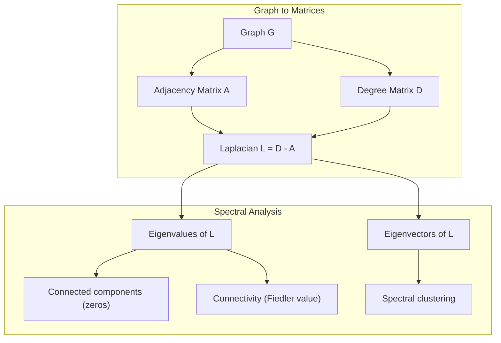
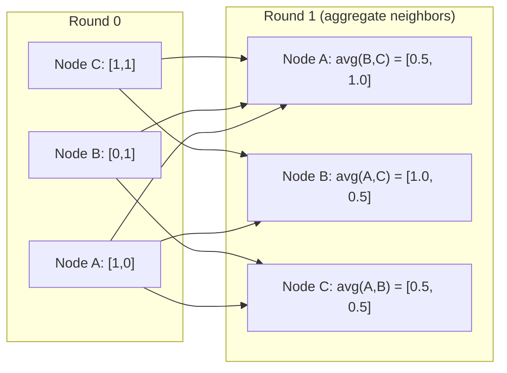

# 面向 Machine Learning'ın Graf Teorisi

> Graf bir ilişki verisi yapısıdır. Eğer verileriniz bağlantıları içerirse, size grafik teorisi gerekmektedir.

**Type:** Build
**Language:**Python
**Prerequisites:** Phase 1, Lessons 01-03（linear algebra, matrices）
**Time:** ~90 分钟

## Öğrenme hedefi
- 构建一个图类,包含邻属矩阵/列表表示,并实现 BFS 和 DFS 遍历
- 计算 graph Laplacian,并使用其自身值 检测连接组件 和对节点 聚类
- Bir sıra GNN 风格的 mesaj geçiş 实现为正常化邻立矩阵乘法
- Faydler vektörünü kullan  spektral gruplama uygulaması 来划分图

## 问题
Sosyal ağlar, moleküller, bilgi tabanları, sitasyon ağları, yol hariteleri, grafiklerdir.

考虑一个社交网络――你想预测某用户会购买什么产品――他们的购买历史很重要――但他们朋友的购买历史更重要――连接本身承载信号――

Ya da bir molekülü düşünerek. Bir proteine bağlanacağını tahmin ederken. Atomlar çok önemli, ama gerçekte önemli olan atomlar birbirlerine nasıl bağlanacaklarıdır.

Grafik sinir ağları (GNN) derin öğrenim içinde en hızlı büyüyen alanlardır. Bunlar ilaç keşfi, sosyal tavsiye, dolandırıcılık tespit ve bilgi grafi düşüncesini yönlendirir.

Sana dört şey lazım:
1. Bir çeşit grafikler matrisler için ifade edilir böylece onları çarpma şeklinde kullanabilirsiniz)
2. Graf yapısını keşfetmek için kullanılır
3. Laplakyan, bu spektral grafik teorisi.
4. Mesaj geçişi, GNN'lerin çalışma işlemidir.

## 概念
### Grafikler: Kısımlar ve Kenarlar

Bir grafik G = (V, E) tarafından zirveler (nodlar) V 和 kenarları E 组成──每条 edge 连接两个节点──

**Directed vs undirected。**Özetlenmeyen grafikte, kenar (u, v) u 连接到 v,并且 v 也连接到 u── Özetlenmeyen grafikte, kenar (u, v) u 指向 v,但反向不一定成立──

**Weighted vs unweighted。**Ağırlaştırılmamış grafikte, kenarlar var mı var mı yok mı var mı var mı yok. Ağırlaştırılmış grafikte, her kenarın bir sayısal değeri var.

| Graph type | Example |
|-----------|---------|
| Undirected, unweighted | Facebook friendship network |
| Directed, unweighted | Twitter follow network |
| Undirected, weighted | Road map（distances） |
| Directed, weighted | Web page links（PageRank scores） |

### Yakınlık Matrisi

A'nın bitişiklik matrisi, n 个 düğüm içeren bir grafik için:

```
A[i][j] = 1    if there is an edge from node i to node j
A[i][j] = 0    otherwise
```

对于未定向图,A 是对称:A[i][j] = A[j][i]。对于权重图,A[i][j] =边 (i, j) 的重量──

**示例：一个 triangle：**

```
Nodes: 0, 1, 2
Edges: (0,1), (1,2), (0,2)

A = [[0, 1, 1],
     [1, 0, 1],
     [1, 1, 0]]
```

bitişiklik matrisi her GNN'in girişidir.

### Derece

Örgütlerin derecesi, kenarlarına bağlanmıştır.

D = diyagonal derece matrisi:

```
D[i][i] = degree of node i
D[i][j] = 0    for i != j
```

对于三角形示例:D = diag(2,2,2),因为每个节点都连接到另外两个节点──

Derece 告诉你节点的重要性──High degree = hub node──a network's degree distribution 揭示了它的结构──Social networks 遵循 power laws(少量 hubs,许多 leaf nodes)──Random graphs 具有Poisson-distributed degrees──

### BFS ve DFS

İki temel grafik geçiş algoritması.

**Breadth-First Search (BFS)：**Önceden tüm komşuları keşfetmek, tekrar komşuların komşularını keşfetmek.

```
BFS from node 0:
  Visit 0
  Queue: [1, 2]        (neighbors of 0)
  Visit 1
  Queue: [2, 3]        (add neighbors of 1)
  Visit 2
  Queue: [3]           (neighbors of 2 already visited)
  Visit 3
  Queue: []            (done)
```

BFS, ağırlıksız grafikler arasında en kısa yolları bulur. BFS'in ilk kez bulunduğu BFS seviyesine benzer şekilde, başlangıç noktasından herhangi bir düğümün mesafesine kadar. Bu nedenle BFS sosyal ağlardaki hop-count mesafelerinde kullanılır.

**Depth-First Search (DFS)：**Bu nedenle, bu durumun bir sonraki aşamasında, bir süre sonra, bir süre sonra, bir süre sonra, bir süre sonra, bir süre sonra, bir süre sonra, bir süre sonra, bir süre sonra, bir süre sonra, bir süre sonra, bir süre sonra, bir süre sonra, bir süre sonra, bir süre sonra, bir süre sonra, bir süre sonra, bir süre sonra, bir süre sonra, bir süre sonra, bir süre sonra, bir süre sonra, bir süre sonra, bir süre sonra, bir süre sonra, bir süre sonra, bir süre sonra, bir süre sonra, bir süre sonra, bir süre sonra, bir süre sonra, bir süre sonra, bir süre sonra, bir süre sonra, bir süre sonra, bir süre sonra, bir süre sonra, bir süre sonra, bir süre sonra, bir süre sonra, bir süre sonra, bir süre sonra, bir süre sonra, bir süre sonra, bir süre sonra, bir süre sonra, bir süre sonra, bir süre sonra, bir süre sonra, bir süre sonra, bir süre sonra, bir süre sonra, bir süre sonra, bir süre sonra, bir süre sonra, bir süre sonra, bir süre sonra, bir süre sonra, bir süre sonra, bir süre sonra, bir süre sonra, bir süre sonra, bir süre sonra, bir süre sonra, bir süre sonra, bir süre sonra, bir süre sonra, bir süre sonra, bir süre sonra, bir süre sonra, bir süre sonra, bir süre sonra, bir süre sonra, bir süre sonra, bir süre sonra, bir süre sonra, bir süre sonra, bir süre sonra, bir süre sonra, bir süre sonra, bir süre sonra, bir süre sonra, bir süre, bir sürece bir sürecececececececececececececececececececececececececececececececececececececececececececececececececececececececececececececececececececececececececececececececececececececececececececececececececececececececececececececececececececececececececececececececececececececececececececececececececececececececececececececececececececececece

```
DFS from node 0:
  Visit 0
  Stack: [1, 2]        (neighbors of 0)
  Visit 2               (pop from stack)
  Stack: [1, 3]         (add neighbors of 2)
  Visit 3               (pop from stack)
  Stack: [1]
  Visit 1               (pop from stack)
  Stack: []             (done)
```

DFS kullanılabilir:
- 查找连接组件(从未访问的节点 运行 DFS)
- Çember tespitleri (DFS ağacı)
- Topolojik sıralama ((反向 DFS bitme sırası)

| Algorithm | Data structure | Finds | Use case |
|-----------|---------------|-------|----------|
| BFS | Queue | Shortest paths | Social network distance, knowledge graph traversal |
| DFS | Stack | Components, cycles | Connectivity, topological sort |

### Grafik Laplakyan

L = D - A──spektral grafik teorisi 中最重要的矩阵──

Üçgen için:

```
D = [[2, 0, 0],    A = [[0, 1, 1],    L = [[2, -1, -1],
     [0, 2, 0],         [1, 0, 1],         [-1, 2, -1],
     [0, 0, 2]]         [1, 1, 0]]         [-1, -1,  2]]
```

Laplakya 具有非常重要的性质:

1. **L 是 positive semi-definite。**Tüm öz değerleri = 0

2. **zero eigenvalues 的数量等于 connected components 的数量。**Bir bağlantılı grafik 恰好 has zero eigenvalue── bir has has 3 ′s disconnected components of graph has three zero eigenvalue──

3. **最小的 non-zero eigenvalue（Fiedler value）衡量 connectivity。**较大的Fiedler value 表示图 连接良好──较小的Fiedler value 表示图 有一个薄弱点,也就是瓶──

4. **Fiedler value 的 eigenvector（Fiedler vector）揭示最佳切分。**值为正的节点 进入一组,值为负的节点 进入另一组──这是光谱集群──



### Spektral Özellikler

Yakınlık matrisi ve Laplakçi'nin öz değerleri herhangi bir geçiş yapmadan yapısal özellikleri ortaya çıkarabilir.

**Spectral clustering**Şöyle çalışmaktadır:
1. 计算 Laplak L
2. 找到 L's k 个最小 eigenvectors(跳过第一个; Bağlı grafikler için, bu tamamı 1)
3. Bu öz vektörleri her düğümün yeni bir sitatörü olarak kullanın
4. Bu yolculukların k-mahası

Neden bu geçerli?L'nin öz vektörleri grafı kodladı   滑                                                                                                                                                                                                                                                   

**Random walk connection。**Normalleştirilmiş Laplaksian 收得有多快) 取决于光谱差──

### Mesaj Geçiriliyor

Bu Graph Neural Networks'in temel işlevi. Her düğüm komşularından mesaj toplayıp onları toplayıp kendi durumunu yeniliyor.

```
h_v^(k+1) = UPDATE(h_v^(k), AGGREGATE({h_u^(k) : u in neighbors(v)}))
```

En basit biçimde,Aggregate = ortalama,UPDATE = doğrusal dönüşüm + etkinleştirme:

```
h_v^(k+1) = sigma(W * mean({h_u^(k) : u in neighbors(v)}))
```

Bu aslında başka bir tür matris çarpımı olarak taklit edilmektedir. H tüm düğüm özelliklerinin matrisidirse, A bitişiklik matrisidir:

```
H^(k+1) = sigma(A_norm * H^(k) * W)
```

Bunlardan A_norm = normalleştirilmiş bitişiklik matrisi (((

Bir mesaj geçiyor 让每个节点 看到它的近邻――两轮让它看到邻居的邻居――K 轮让每个节点 获得来自其K-hop邻居的信息――



### 概念与 ML 应用

| Concept | ML Application |
|---------|---------------|
| Adjacency matrix | GNN input representation |
| Graph Laplacian | Spectral clustering, community detection |
| BFS/DFS | Knowledge graph traversal, path finding |
| Degree distribution | Node importance, feature engineering |
| Message passing | GNN layers (GCN, GAT, GraphSAGE) |
| Eigenvalues of L | Community detection, graph partitioning |
| Spectral clustering | Unsupervised node grouping |
| PageRank | Node importance, web search |


```figure
graph-degree-distribution
```

## Yapın onu.
### 步骤 1: sıfırdan gerçekleştirme Graf 类

```python
class Graph:
    def __init__(self, n_nodes, directed=False):
        self.n = n_nodes
        self.directed = directed
        self.adj = {i: {} for i in range(n_nodes)}

    def add_edge(self, u, v, weight=1.0):
        self.adj[u][v] = weight
        if not self.directed:
            self.adj[v][u] = weight

    def neighbors(self, node):
        return list(self.adj[node].keys())

    def degree(self, node):
        return len(self.adj[node])

    def adjacency_matrix(self):
        import numpy as np
        A = np.zeros((self.n, self.n))
        for u in range(self.n):
            for v, w in self.adj[u].items():
                A[u][v] = w
        return A

    def degree_matrix(self):
        import numpy as np
        D = np.zeros((self.n, self.n))
        for i in range(self.n):
            D[i][i] = self.degree(i)
        return D

    def laplacian(self):
        return self.degree_matrix() - self.adjacency_matrix()
```

bitişiklik listesi(`self.adj`) yüksek verimli depolama komşuları olabilir.

### 步骤 2: BFS ve DFS

```python
from collections import deque

def bfs(graph, start):
    visited = set()
    order = []
    distances = {}
    queue = deque([(start, 0)])
    visited.add(start)
    while queue:
        node, dist = queue.popleft()
        order.append(node)
        distances[node] = dist
        for neighbor in graph.neighbors(node):
            if neighbor not in visited:
                visited.add(neighbor)
                queue.append((neighbor, dist + 1))
    return order, distances


def dfs(graph, start):
    visited = set()
    order = []
    stack = [start]
    while stack:
        node = stack.pop()
        if node in visited:
            continue
        visited.add(node)
        order.append(node)
        for neighbor in reversed(graph.neighbors(node)):
            if neighbor not in visited:
                stack.append(neighbor)
    return order
```

BFS 使用 deque(iki uçlı kuyruk) O(1) popleft。DFS 使用 list 作为堆──两者都会恰好访问每个节点 一次,时间复杂度为 O(V + E)。

### 步骤 3: Bağlı bileşenler 和 Laplacian öz değerleri

```python
def connected_components(graph):
    visited = set()
    components = []
    for node in range(graph.n):
        if node not in visited:
            order, _ = bfs(graph, node)
            visited.update(order)
            components.append(order)
    return components


def laplacian_eigenvalues(graph):
    import numpy as np
    L = graph.laplacian()
    eigenvalues = np.linalg.eigvalsh(L)
    return eigenvalues
```

`eigvalsh`Simetrik matrisler için kullanılan, Laplacian ise yönlendirilmemiş grafikler için daima simetriktir.

### 步骤 4: Spektral gruplama

```python
def spectral_clustering(graph, k=2):
    import numpy as np
    L = graph.laplacian()
    eigenvalues, eigenvectors = np.linalg.eigh(L)
    features = eigenvectors[:, 1:k+1]

    labels = np.zeros(graph.n, dtype=int)
    for i in range(graph.n):
        if features[i, 0] >= 0:
            labels[i] = 0
        else:
            labels[i] = 1
    return labels
```

K=2,Fiedler vektörünün 符号会将图分成两集── k>2,你会在前 k 个个个个个个个个个个个个个个个个个个个个个个个个个个个个个个个个个个个个个个个个个个个个个个个个个个个个个个个个个个个个个个个个个个个个个个个个个个个个个个个个个个个个个个个个个个个个个个个个个个个个个个个个个个个个个个个个个个个个个个个个个个个个个个个个个个个个个个个个个个个个个个个个个个个个个个个个个个个个个个个个个个个个个个个个个个个个个个个个个个个个个个个个个个个个个个个个个个个个个个个个个个个个个个个个个个个个个个个个个个个个个个个个个个个个个个个个个个个个个个个个个个个个个个个个个个个个个个个个个个个个个个个个个个个个个个个个个个个个个个个个个个个个个个个个个个个个个个个个个个个个个个个个个个个个个个个个个个个个个个个个个个个个个个个个个个个个个个个个个个个个个个个个个个个个个个个个个个个个个个个个个个个个个个个个个个个个个个个个个个个个个个个个个个个个个个个个个个个个个个个

### 步骤 5: Mesaj geçiş

```python
def message_passing(graph, features, weight_matrix):
    import numpy as np
    A = graph.adjacency_matrix()
    row_sums = A.sum(axis=1, keepdims=True)
    row_sums[row_sums == 0] = 1
    A_norm = A / row_sums
    aggregated = A_norm @ features
    output = aggregated @ weight_matrix
    return output
```

Bu bir GNN mesajı geçiş döngüsü. Her düğümün yeni özellikleri komşu özelliklerinin ağırlıklı ortalamasıdır.

## Kullan
Şebekeden ve numpy'den, aynı operasyonlar tek satırlı:

```python
import networkx as nx
import numpy as np

G = nx.karate_club_graph()

A = nx.adjacency_matrix(G).toarray()
L = nx.laplacian_matrix(G).toarray()

eigenvalues = np.linalg.eigvalsh(L.astype(float))
print(f"Smallest eigenvalues: {eigenvalues[:5]}")
print(f"Connected components: {nx.number_connected_components(G)}")

communities = nx.community.greedy_modularity_communities(G)
print(f"Communities found: {len(communities)}")

pr = nx.pagerank(G)
top_nodes = sorted(pr.items(), key=lambda x: x[1], reverse=True)[:5]
print(f"Top 5 PageRank nodes: {top_nodes}")
```

Networkx, optimize edilmiş C arka planlarını kullanarak herhangi bir boyutlu grafikleri işleyebilir.

### Numpy spektral analizi

```python
import numpy as np

A = np.array([
    [0, 1, 1, 0, 0],
    [1, 0, 1, 0, 0],
    [1, 1, 0, 1, 0],
    [0, 0, 1, 0, 1],
    [0, 0, 0, 1, 0]
])

D = np.diag(A.sum(axis=1))
L = D - A

eigenvalues, eigenvectors = np.linalg.eigh(L)
print(f"Eigenvalues: {np.round(eigenvalues, 4)}")
print(f"Fiedler value: {eigenvalues[1]:.4f}")
print(f"Fiedler vector: {np.round(eigenvectors[:, 1], 4)}")

fiedler = eigenvectors[:, 1]
group_a = np.where(fiedler >= 0)[0]
group_b = np.where(fiedler < 0)[0]
print(f"Cluster A: {group_a}")
print(f"Cluster B: {group_b}")
```

Fiedler vektörü 承担了主要工作──正值条目位于一个集群,负值条目位于另一个集群──不需要再进化优化,只需要一次自构──

## - Söyle.
本课产 出:
- `outputs/skill-graph-analysis.md`: Grafik yapılı verileri analiz etmek için kullanılır

## Bağlantılar

| Concept | Where it shows up |
|---------|------------------|
| Adjacency matrix | GCN, GAT, GraphSAGE input |
| Laplacian | Spectral clustering, ChebNet filters |
| BFS | Knowledge graph traversal, shortest path queries |
| Message passing | Every GNN layer, neural message passing |
| Spectral gap | Graph connectivity, mixing time of random walks |
| Degree distribution | Power-law networks, node feature engineering |
| Connected components | Preprocessing, handling disconnected graphs |
| PageRank | Node importance ranking, attention initialization |

GNN'ler 值得特别说明──GCN(Kipf & Welling, 2017) içindeki grafik kıvrım işleminde kullanılarak kendi kendini döngülerin bitişiklik matrisini ekledi, A_hat = A + I:

```text
H^(l+1) = sigma(D_hat^(-1/2) * A_hat * D_hat^(-1/2) * H^(l) * W^(l))
```

Bunlardan A_hat = A + I(adjacency加 self-loops),D_hat is A_hat'ın derece matrisi。self-loops 确保每个节在聚合期间包含自身特征──这正是带有对称正常化的信息传递──D_hat^(-1/2) *A_hat * D_hat^(-1/2) 是正常化邻接矩阵──Laplacian 出现在这里,是因为这种正常化与L_sym = I - D^(-1/2) *A * D^(-1/2) 相关──理解Laplacian,就意味着理解GCNs为为什么有效──

## 练习
1. **从零实现 PageRank。**Birlikte puanlar 开始──每一步:score(v) = (1-d) /n + d * sum(score(u) /out_degree(u)), u ∈ u ∈ u ∈ u ∈ u ∈ u ∈ u ∈ u ∈ u ∈ u ∈ u ∈ u ∈ u ∈ u ∈ u ∈ u ∈ u ∈ u ∈ u ∈ u ∈ u ∈ u ∈ u ∈ u ∈ u ∈ u ∈ u ∈ u ∈ u ∈ u ∈ u ∈ u ∈ u ∈ u ∈ u ∈ u ∈ u ∈ u ∈ u ∈ u ∈ u ∈ u ∈ u ∈ u ∈ u ∈ u ∈ u ∈ u ∈ u ∈ u ∈ u ∈ u ∈ u ∈ u ∈ u ∈ u ∈ u ∈ u ∈ u ∈ u ∈ u ∈ u ∈ u ∈ u ∈ u ∈ u ∈ u ∈ u ∈ u ∈ u ∈ u ∈ u ∈ u ∈ u ∈ u ∈ u ∈ u ∈ u ∈ u ∈ u ∈ u ∈ u ∈ ∈            ∈                                                                                                                                                                                                                

2. **使用 spectral clustering 查找 communities。**✓ İki açık ayrılıklı kümeler içeren bir grafik oluşturmak  Örneğin, iki klik ✓ ✓ ✓ ✓ ✓ ✓ ✓ ✓ ✓ ✓ ✓ ✓ ✓ ✓ ✓ ✓ ✓ ✓ ✓ ✓ ✓ ✓ ✓ ✓ ✓ ✓ ✓ ✓ ✓ ✓ ✓ ✓ ✓ ✓ ✓ ✓ ✓ ✓ ✓ ✓ ✓ ✓ ✓ ✓ ✓ ✓ ✓ ✓ ✓ ✓ ✓ ✓ ✓ ✓ ✓ ✓ ✓ ✓ ✓ ✓ ✓ ✓ ✓ ✓ ✓ ✓ ✓ ✓ ✓ ✓ ✓ ✓ ✓ ✓ ✓ ✓ ✓ ✓ ✓ ✓ ✓ ✓ ✓ ✓ ✓ ✓ ✓ ✓ ✓ ✓ ✓ ✓ ✓ ✓ ✓ ✓ ✓ ✓ ✓ ✓ ✓ ✓ ✓ ✓ ✓ ✓ ✓ ✓ ✓ ✓ ✓ ✓ ✓ ✓ ✓ ✓ ✓ ✓ ✓ ✓ ✓ ✓ ✓ ✓ ✓ ✓ ✓ ✓ ✓ ✓ ✓ ✓ ✓ ✓ ✓ ✓ ✓ ✓ ✓ ✓ ✓ ✓ ✓ ✓ ✓ ✓ ✓ ✓ ✓ ✓ ✓ ✓ ✓ ✓ ✓ ✓ ✓ ✓ ✓ ✓ ✓ ✓ ✓ ✓ ✓ ✓ ✓ ✓ ✓ ✓ ✓ ✓ ✓ ✓ ✓ ✓ ✓ ✓ ✓ ✓ ✓ ✓ ✓ ✓ ✓ ✓ ✓ ✓ ✓ ✓ ✓ ✓ ✓ ✓ ✓ ✓ ✓ ✓ ✓ ✓ ✓ ✓ ✓ ✓ ✓ ✓ ✓ ✓ ✓ ✓ ✓ ✓ ✓ ✓ ✓ ✓ ✓ ✓ ✓ ✓ ✓ ✓ ✓ ✓ ✓ ✓ ✓ ✓ ✓   ✓ ✓ ✓  ✓ ✓    ✓ ✓          ✓

3. **为 weighted graphs 中的 shortest paths 实现 Dijkstra's algorithm。**Üstteki grafikte aynı ağırlıklara sahip olanların sonuçları BFS ile karşılaştırılır.

4. **构建一个 2-layer message passing network。**İki kez mesaj geçiş kullanmak. 2 kez gösterilince, her düğümün 2 kez gönderilen mesajı kullanmak.

5. **分析一个真实世界 graph。**kullan Karate Club grafiği(34 düğüm, 78 kenar) ・・・ hesaplama derecesi dağılım、Laplacian öz değerleri 和 spektral kümeler。

## 关键术语
| Term | What people say | What it actually means |
|------|----------------|----------------------|
| Graph | “Nodes and edges” | 一种数学结构 G=(V,E)，用于编码 pairwise relationships |
| Adjacency matrix | “The connection table” | 一个 n x n matrix，其中如果 nodes i 和 j 相连，则 A[i][j] = 1 |
| Degree | “一个 node 有多 connected” | 接触某个 node 的 edges 数量 |
| Laplacian | “D minus A” | L = D - A，其 eigenvalues 会揭示 graph structure 的 matrix |
| Fiedler value | “The algebraic connectivity” | L 的最小 non-zero eigenvalue，用于衡量 graph 连接得有多好 |
| BFS | “Level-by-level search” | 在深入之前先访问所有 neighbors 的 traversal，可找到 shortest paths |
| DFS | “Go deep first” | 在回溯之前沿一条 path 走到末端的 traversal |
| Message passing | “Nodes talk to neighbors” | 每个 node 从其 neighbors 聚合信息，这是 GNNs 的核心 |
| Spectral clustering | “Cluster by eigenvectors” | 使用 graph 的 Laplacian 的 eigenvectors 来划分 graph |
| Connected component | “A separate piece” | 一个 maximal subgraph，其中每个 node 都能到达其他每个 node |

## 延伸阅读
- **Kipf & Welling (2017)**Grafik Konvolyasyon Ağları ile Yarım Denetimli Sınıflandırma.
- **Spielman (2012)**: Spektral Graph Teorisi Lecture Notları── Laplacianlar hakkında、spektral boşluklar 和 grafi bölünme hakkı──
- **Hamilton (2020)**Grafik Temsil Etme Öğrenimi.
- **Bronstein et al. (2021)**:Jometrik Derin Öğrenme: Gridler, Gruplar, Graflar, Jeodetik ve Ölçüler。统一框架论文。
- **Veličković et al. (2018)**:Graph Attention Networks──Util attention mechanisms 扩展信息传递──
