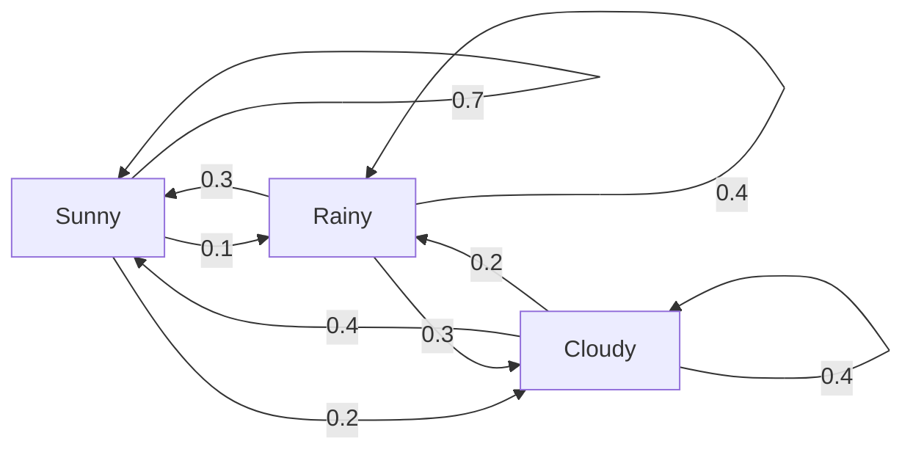
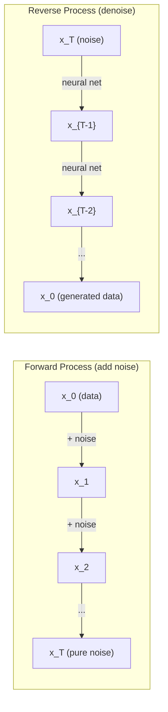

# Stochastic Prosesler

> 具有结构的随机性──随机走行、马科夫链和扩散模型 背后的数学──

**Type:** Learn
**Language:**Python
**Prerequisites:** Phase 1, Lessons 06-07（probability, Bayes）
**Time:** ~75 分钟

## Öğrenme hedefi
- 模拟 1D 和 2D rastgele yürüyüşler,并验证位移的平方(n) 缩放规律
- 构建 Markov chain 模拟器,并通过自己的组合 计算其静止分布
- Metropolis-Hastings MCMC ve Langevin dinamiklerini hedef dağılım biçiminden kullanmak
- Önceden yayılma sürecini Brownian hareketi ile bağlayın, ters süreci nasıl oluşturulur açıklayın

## 问题
Birçok AI sistemi zamanla gelişen bir tesadüfenle ilgilidir. Statik tesadüfen değil, her adım önceden gerçekleşen bir şeye bağlı olarak yapılandırılmış bir sıralama tesadüfenle ilgilidir.

Dil modelleri bir kez bir simge üretir. Her bir simge önündeki bağlamdan bağlıdır. Model bir olasılık dağılımını çıkarır, sonra devam eder.

Diffusion modelleri 逐步向图像添加噪音,直到它变成纯静态噪音──然后它们反转这个过程,逐步谴责这个过程,逐步谴责这个过程,直到出现一张新图像──前进过程是一个马科夫链──反转过程是一个反向运行的学会的马科夫链──

Güçlendirme öğrenme ajanları, çevrede eylemler yaparlar. Her eylem bir tür olasılık ile yeni bir devlete yol açar.

MCMC örneklemesi Bayesian sonuçların bir sütunudur, Markov zinciri oluşturur, sabit dağılımı, yani geriye dönük bir şekilde kullanılır.

Hepsi dört temel düşünce üzerine kurulmuştur:
1. Rastgele yürüyüşler  最简单的 stochastic process
2. Markov zincirleri  带有过渡矩阵的结构化随机性
3. Langevin dinamikleri  带噪声的渐进下降
4. Metropolis-Hastings                                                                                                                                                                                                                                                            

## 概念
### - Rastgele Yürüyüşler

Yerden 0 開始── her adım,抛一枚公平硬币──正面:向右移动(+1)──反面:向左移动(-1)──

经过 n 步后,你的位置是 n 个随机 +/-1 值的总和──期望位置是 0( bu yürüyüş tarafsız 的) ・・・

Bu yürüyüş adil, iki yönde de hareket yoktur. Ama zaman geçtikçe, başlangıç noktasından giderek daha uzaklara gider.

```
Step 0:  Position = 0
Step 1:  Position = +1 or -1
Step 2:  Position = +2, 0, or -2
...
Step 100: Expected distance from origin ~ 10 (sqrt(100))
Step 10000: Expected distance from origin ~ 100 (sqrt(10000))
```

**在 2D 中**, yürüyüşe eşişi gibi olasılık yukarı, aşağı, sola veya sağ hareket eder.

**为什么是 sqrt(n)？**Her adım da bir diğerine benzer bir olasılık vardır +1 veya -1──n 步后, konum S_n = X_1 + X_2 + ... + X_n, bunların her biri X_i +/-1── her adım da bir diğerinden bağımsızdır, bu yüzden Var(S_n) = n──Standard sapma = sqrt(n)──S_n / sqrt(n) 收到标准正常分布──

Bu tür şıklıklı √ n) 缩放放置 ML 中随处可见──SGD 噪音按1/sqrt(batch_size) 缩放──Embedding 维度按 sqrt(d) 缩放──平方根是独立随机加和的标志──

**与 Brownian motion 的联系。**取一个步骤尺为1/sqrt(n) 、每单位时间 n 步的随机走行──当 n 趋近无穷时,这个走行会收到布朗运动 B(t)  一个连续时间过程,其中 B(t) 服从平均值为 0、变量为 t 的正常分布──

Brownian hareket, difüzyonun matematiksel temelidir. Bu, parçacıkların akışında hareketleri, fiyatların hareketlerini ve ayrıca, önemli bir şekilde, difüzyon modellerinde gürültü sürecini çizer.

**Gambler's ruin。**Bir rastgele yürüyüşcü k                                                                                                                                                                                                                                                                                                                                                                                                                                                                                                                      

### Markov Zincirleri

Markov zinciri, sabit olasılıklara göre devletler arasında dönüşümlü bir sistemdir.

```
P(X_{t+1} = j | X_t = i, X_{t-1} = ...) = P(X_{t+1} = j | X_t = i)
```

Bu Markov özelliği. Yani tüm dinamikleri bir geçiş matrisi P ile tanımlayabilirsiniz.

```
P[i][j] = probability of going from state i to state j
```

P'nin her bir dilekçe ve 1 için...

**示例 —— Weather：**

```
States: Sunny (0), Rainy (1), Cloudy (2)

P = [[0.7, 0.1, 0.2],    (if sunny: 70% sunny, 10% rainy, 20% cloudy)
     [0.3, 0.4, 0.3],    (if rainy: 30% sunny, 40% rainy, 30% cloudy)
     [0.4, 0.2, 0.4]]    (if cloudy: 40% sunny, 20% rainy, 40% cloudy)
```

Herhangi bir durumdan 开始── çok kez geçişlerden sonra, durumların dağılımları sabit dağılım pi'ye ulaşır, bunların arasında pi * P = pi── bu P'nin öz değeri 为 1'nin sol öz vektörü olarak bulunur.

 长期来看, whatever starts state is what,  长期来看,  长期来看, 长期来看, 长期来看, 长期来看, 长期来看, 长期来看, 长期来看, 长期来看, 长期来看, 长期来看, 长期来看, 长期来看, 长期来看, 长期来看, 长期来看, 长期来看, 长期来看, 长期来看, 长期来看, 长期来看, 长期来看, 长期来看, 长期来看, 长期来看, 长期来看, 长期来看, 长期的时间的时间的53%是阳阳的.



**计算 stationary distribution。**İki yöntem var:

1. **Power method**Bu da bir çok kez daha yayılmaya devam eder.
2. **Eigenvalue method**: P'nin öz değeri için 1'nin sol öz vektörü bulun.

两种方法都要求链 满足收条件――

**收敛条件。**Eğer bir Markov zinciri  aşağıdaki koşulları karşılarsa, tek sabit dağıtım alacaktır:
- **Irreducible**Her eyalet diğer eyaletlerden gelebilir.
- **Aperiodic**: zincir sabit döngü döngüsü ile gerçekleşmez

ML'de karşılaştığınız büyük zincirler bu iki şartı karşılıyor.

**Absorbing states。**Eğer bir eyalete girerseniz asla ayrılmayacaksınız. Bu eyalet, emekleyici bir durumdur. Markov zincirlerini emekleyici bir süreçtir.

**Mixing time。**需要多少步,chain 才会接近stationary distribution?形式化地说,就是总变距与静止的距离降至某值以下的所需步数――快速混合 = 需要步数少──P'nin spektral gap(1 减去第二大自值) 控制混合时间──gap 越大, mixing 越快──

### İletişim Dil Modelleri

Dil modeli 中的代币生成 近似是一个马科夫过程──给定当前文本,模型输出下一个代币 上的分布──温度 控制敏度:

```
P(token_i) = exp(logit_i / temperature) / sum(exp(logit_j / temperature))
```

- Sıcaklık = 1.0: standart dağılım
- Sıcaklık < 1.0:更尖(更确定)
- Sıcaklık > 1.0:更平坦(更随机)
- Temperatür -> 0:argmax(açık)

Top-k örnekleme 截断至概率最高的 k 个代币――Top-p(nukleus) örnekleme 截断至累积概率 超过 p 的最小代币 集合──两者都会修改马科夫过渡概率──

### Brownian Hareketi

Randeom walk ∞ sürekli zaman sınırı∞ konum Bt) ∞
1. B(0) = 0
2. B(t) - B(s) 服从平均值为 0、变量 为 t - s'ın normal dağılımını
3. 相互独立 不重叠区间上的 相互独立的增长

Brownian hareketi sürekli, ama kısıtlı değildir. Her ölçüde hareket eder.

Bu şekilde Brownian hareketine benzer bir şekilde hareket edebilirsiniz.

```
B(t + dt) = B(t) + sqrt(dt) * z,    where z ~ N(0, 1)
```

sqrt(dt) 缩放 çok önemlidir.

### Langevin Dinamikleri

Gradient Descent 寻找函数的最小值──Langevin dinamikleri 寻找与 exp(-U(x)/T) 成正比的概率分布,其中 U = enerji işlevi, T = sıcaklık──

```
x_{t+1} = x_t - dt * gradient(U(x_t)) + sqrt(2 * T * dt) * z_t
```

Partikel üzerinde iki etki vardır:
1. **Gradient force**(-dt * gradient(U)): aşağı enerjiye doğru ilerlemek
2. **Random force**(sqrt(2*T*dt) * z):推向随机方向(kızılmak)

Bu, Temperatür T = 0 时, bu sadece Gradient Düşüşü. Yüksek sıcaklık. Aşağı, neredeyse rastgele yürüyüş.

**与 diffusion models 的联系。**Diffusion modelinin ileri süreci:

```
x_t = sqrt(alpha_t) * x_{t-1} + sqrt(1 - alpha_t) * noise
```

Bu, bir Markov zinciri ile veriyi yavaş yavaş bir şekilde karıştırmak için yeterli adımlar atılmış.

 Şoktan veriye geri dönmek  Aynı zamanda bir Markov zinciri de vardır, ancak geçiş olasılığı Nöral Ağ tarafından öğrenilmiştir.



### MCMC: Markov Chain Monte Carlo

Bazen bir değer elde edebilirsiniz (bir sabit değerini farklılaştırmak için izin verilir) ama doğrudan bir dağılım elde edemezsiniz (x)

**Metropolis-Hastings**构造一个静止分布 为 p(x) 的马科夫链:

1. Bir yerden x                                                                                                                                                                                                                                                                                                                                                                                                                                                                                                                          
2. Teklif dağıtımından 提议一个新位置 x'
3. 計算 kabul oranı:a(x') * Q(x
4. 以概率 min(1, a) 接受 x'──否则留在 x──
5. Tekrarlıyorum.

Eğer Q is symmetric of (((((x'x de) = Q(x, x'x') = N(x, sigma^2)), oranı 可简化为 a = p(x') / p(x) ――你只需要概率的比例 正常化常数 会相互抵消──

Bu zincir, 温和条件下保证收到 px) .

**为什么它有效。**Kabul oranı  Detaylı dengenin sağlanması: x'de yer alan ve x'ye taşınma olasılığı, x'de yer alan ve x'ye taşınma olasılığı eyleme  Detaylı dengenin anlamı p(x) bu zincirin sabit dağılımıdır── bu nedenle yeterince adımlar atıldı 

**实践注意事项：**
- **Burn-in**: bırakılmamış ön N 个 örnekleri。 zincir 需要时间从起点到静止分布──
- **Thinning**: her k 个样本保持一个, autocorrelation azaltmak için
- **Multiple chains**Çeşitli zincirler farklı noktalardan yürütülür. Eğer onlar aynı dağılımlara ulaşırsa, bu da kanıtlanmıştır.
- **Acceptance rate**Gaussian önerileri için en iyi kabul oranı yaklaşık %23'dir.

### AI'de Stochastic Prosesler

| Process | AI Application |
|---------|---------------|
| Random walk | RL 中的 exploration、Node2Vec embeddings |
| Markov chain | Text generation、MCMC sampling |
| Brownian motion | Diffusion models（forward process） |
| Langevin dynamics | Score-based generative models、SGLD |
| Markov decision process | Reinforcement learning |
| Metropolis-Hastings | Bayesian inference、posterior sampling |


```figure
random-walk-diffusion
```

## Yapın onu.
### 步骤 1: Random walk simülatörü

```python
import numpy as np

def random_walk_1d(n_steps, seed=None):
    rng = np.random.RandomState(seed)
    steps = rng.choice([-1, 1], size=n_steps)
    positions = np.concatenate([[0], np.cumsum(steps)])
    return positions


def random_walk_2d(n_steps, seed=None):
    rng = np.random.RandomState(seed)
    directions = rng.choice(4, size=n_steps)
    dx = np.zeros(n_steps)
    dy = np.zeros(n_steps)
    dx[directions == 0] = 1   # right
    dx[directions == 1] = -1  # left
    dy[directions == 2] = 1   # up
    dy[directions == 3] = -1  # down
    x = np.concatenate([[0], np.cumsum(dx)])
    y = np.concatenate([[0], np.cumsum(dy)])
    return x, y
```

1D yürüyüş  depolama toplu toplamı── her adım +1 veya -1── geçtikten sonra, konum ise toplam ve──varians 随 n 线性增长, bu nedenle standart sapma 按平方(n) 增长──

### 步骤 2: Markov zinciri

```python
class MarkovChain:
    def __init__(self, transition_matrix, state_names=None):
        self.P = np.array(transition_matrix, dtype=float)
        self.n_states = len(self.P)
        self.state_names = state_names or [str(i) for i in range(self.n_states)]

    def step(self, current_state, rng=None):
        if rng is None:
            rng = np.random.RandomState()
        probs = self.P[current_state]
        return rng.choice(self.n_states, p=probs)

    def simulate(self, start_state, n_steps, seed=None):
        rng = np.random.RandomState(seed)
        states = [start_state]
        current = start_state
        for _ in range(n_steps):
            current = self.step(current, rng)
            states.append(current)
        return states

    def stationary_distribution(self):
        eigenvalues, eigenvectors = np.linalg.eig(self.P.T)
        idx = np.argmin(np.abs(eigenvalues - 1.0))
        stationary = np.real(eigenvectors[:, idx])
        stationary = stationary / stationary.sum()
        return np.abs(stationary)
```

sabit dağılım P'nin öz değeri olarak 1'nin sol öz vektörünü hesaplamakla P^T'nin öz vektörlerini bulmaya çalışırız.

### 步骤 3: Langevin dinamikleri

```python
def langevin_dynamics(grad_U, x0, dt, temperature, n_steps, seed=None):
    rng = np.random.RandomState(seed)
    x = np.array(x0, dtype=float)
    trajectory = [x.copy()]
    for _ in range(n_steps):
        noise = rng.randn(*x.shape)
        x = x - dt * grad_U(x) + np.sqrt(2 * temperature * dt) * noise
        trajectory.append(x.copy())
    return np.array(trajectory)
```

Gradient x  aşağı enerjiye doğru ilerleyecektir, gürültü  bu yüzden bu bölge durgunlaşmasını önleyecektir.

### 4 adım: Metropolis-Hastings

```python
def metropolis_hastings(target_log_prob, proposal_std, x0, n_samples, seed=None):
    rng = np.random.RandomState(seed)
    x = np.array(x0, dtype=float)
    samples = [x.copy()]
    accepted = 0
    for _ in range(n_samples - 1):
        x_proposed = x + rng.randn(*x.shape) * proposal_std
        log_ratio = target_log_prob(x_proposed) - target_log_prob(x)
        if np.log(rng.rand()) < log_ratio:
            x = x_proposed
            accepted += 1
        samples.append(x.copy())
    acceptance_rate = accepted / (n_samples - 1)
    return np.array(samples), acceptance_rate
```

Bu algoritma yeni bir nokta önerir, daha yüksek olasılıkla olup olmadığını kontrol eder, sonra tekrar eder. İyi bir karışım elde etmek için, kabul oranı yaklaşık %23-50 arasında olmalıdır.

## Kullan
 Pratikte, bu algoritmaları gerçekleştirmek için olgun kütüphaneler kullanırsınız.

```python
import numpy as np

rng = np.random.RandomState(42)
walk = np.cumsum(rng.choice([-1, 1], size=10000))
print(f"Final position: {walk[-1]}")
print(f"Expected distance: {np.sqrt(10000):.1f}")
print(f"Actual distance: {abs(walk[-1])}")
```

### Değişiklik matrislerinin numpy kullanılarak

```python
import numpy as np

P = np.array([[0.7, 0.1, 0.2],
              [0.3, 0.4, 0.3],
              [0.4, 0.2, 0.4]])

distribution = np.array([1.0, 0.0, 0.0])
for _ in range(100):
    distribution = distribution @ P

print(f"Stationary distribution: {np.round(distribution, 4)}")
```

İlk dağılımını tekrar tekrar P'ye katlayıp yeterince iterasyon geçirdiğinde, nerede başladığınızı düşünmeden sabit dağılım elde eder.

### Gerçek çerçeve ile bağlantı

- **PyTorch diffusion：**Sarılan Yüz`diffusers`Orta `DDPMScheduler`实现了前和反马科夫链
- **NumPyro / PyMC：**MCMC(NUTS örneklemesini kullanarak, Metropolis-Hastings'in gelişimiyle Bayesian sonucu çıkarmak için
- **Gymnasium (RL)：**çevre adım işlevi  tanımlamak bir Markov karar süreci

### 验证 Markov zinciri yakınlığı

```python
import numpy as np

P = np.array([[0.9, 0.1], [0.3, 0.7]])

eigenvalues = np.linalg.eigvals(P)
spectral_gap = 1 - sorted(np.abs(eigenvalues))[-2]
print(f"Eigenvalues: {eigenvalues}")
print(f"Spectral gap: {spectral_gap:.4f}")
print(f"Approximate mixing time: {1/spectral_gap:.1f} steps")
```

Spektral Gap  tell you chain  forget its initial state speed──gap 0.2 ∼ 5 ̊ step ∼ mix ∼ gap ∼ 0.01 ∼ 100 ̊ step ∼ 运行长度模拟 之前必需检查这个点  mixing 很慢的链 会浪费计算──

## - Söyle.
本课产 出:
- `outputs/prompt-stochastic-process-advisor.md` Bir anket, belirli sorunları tanımlamada yardımcı olmak için hangi stohastik süreç çerçevesine uygun

## Bağlantılar

| Concept | Where it shows up |
|---------|------------------|
| Random walk | Node2Vec graph embeddings、RL 中的 exploration |
| Markov chain | LLMs 中的 Token generation、MCMC sampling |
| Brownian motion | DDPM 中的 forward diffusion process、SDE-based models |
| Langevin dynamics | Score-based generative models、stochastic gradient Langevin dynamics (SGLD) |
| Stationary distribution | MCMC convergence target、PageRank |
| Metropolis-Hastings | Bayesian posterior sampling、simulated annealing |
| Temperature | LLM sampling、RL 中的 Boltzmann exploration、simulated annealing |
| Mixing time | MCMC 的 convergence speed、spectral gap analysis |
| Absorbing state | End-of-sequence token、RL 中的 terminal states |
| Detailed balance | MCMC samplers 的 correctness guarantee |

Diffusion modelleri 值得特别关注──DDPM(Ho et al., 2020) bir ileri Markov zinciri tanımladı:

```
q(x_t | x_{t-1}) = N(x_t; sqrt(1-beta_t) * x_{t-1}, beta_t * I)
```

Beta_t, bir gürültü programıdır. T 步后,x_T 近似为 N(0, I) ◊ bir nöron ağının 参数化 tarafından ters bir süreç:

```
p_theta(x_{t-1} | x_t) = N(x_{t-1}; mu_theta(x_t, t), sigma_t^2 * I)
```

Yürütme, öğrenilen her adımın Markov zincirinin bir parçasıdır. Markov zincirlerini anlamak, nasıl ve neden veri üretilebileceğini anlamak anlamına gelir.

SGLD(Stochastic Gradient Langevin Dynamics) Mini-batch Gradient Descent ile Langevin gürültüsü 结合起来──你不计算完整的 Gradient,而是使用 Stochastic estimate并添加校准的噪声──随着学习率的衰退,SGLD 会从优化 过渡到样本采集  你几乎免费得到近似的贝叶斯后样本──这是从神经网络 获得不确定性估计的最简单方式之一──

穿穿这些联系的关键洞见是:stochastic processes are not merely theoretical tools──它们是现代人工智能系统内部的计算机制──当你调节LLM的温度时,你调节一个马科夫链──当你训练扩散模型时,你学习反转一个类似布朗运动的过程──当你运行贝叶斯推理时,你构建一个接收到后的链──

## 练习
1. **模拟 1000 条 10000 步的 random walks。**図図最終位置の分布──验证 図の分布──验证 図の分布──验证 図の分布──验证 図の分布──验证 図の分布──验证 図の分布──验证 図の分布──验证 図の分布──验证 図の分布──验证 図の分布──验证 図の分布──验证 図の分布──验证 図の分布──验证 図の分布──验证 図の分布──验证 図の分布──10000) = 100′ Gaussian── Gaussian── Gaussian── Gaussian── Gaussian── Gaussian── Gaussian── Gaussian── Gaussian── Gaussian── Gaussian── Gaussian── Gaussian── Gaussian── Gaussian── Gaussian. Gaussian. Gaussian. Gaussian. Gaussian. Gaussian. Gaussian. Gaussian. Gaussian. Gaussian. Gaussian. Gaussian. Gaussian. Gaussian. Gaussian. Gaussian. Gaussian. Gaussian. Gaussian. Gaussian. Gaussian. Gaussian. Gaussian. Gaussian. Gaussian. Gaussian. Gaussian. Gaussian Gaussian Gaussian Gaussian Gaussian Gaussian Gaussian Gaussian Gaussian Gaussian Gaussian Gaussian Gaussian Gaussian Gaussian Gaussian Gaussian Gaussian Gaussian Gaussian Gaussian Gaussian Gaussian Gaussian Gaussian Gaussian Gaussian Gaussian Gaussian Gaussian Gaussian Gaussian Gaussian Gaussian Gaussian Gaussian Gaussian Gaussian Gaussian Gaussian Gaussian Gaussian Gaussian Gaussian Gaussian Gaussian Gaussian Gaussian Gaussian Gaussian Gaussian Gaussian Gaussian Gaussian Gaussian Gaussian Gaussian Gaussian Gaussian Gaussian Gaussian Gaussian Gaussian Gaussian Gaussian Gaussian Gaussian Gaussian Gaussian Gaussian Gaussian Gaussian Ga

2. **使用 Markov chain 构建 text generator。**Bir küçük korpus üzerinde eğitim: her kelime için, bir sonraki kelime için geçişleri oluşturmak için.

3. **使用 Metropolis-Hastings 实现 simulated annealing。**Yüksek sıcaklıktan 开始 (resten her şeyi kabul eder), sonra yavaş yavaş降温 (sadece iyileşmeyi kabul eder) ⋅ kullanarak birçok yerel minimum olan işlevi en az değerleri bulur.

4. **比较不同 temperatures 下的 Langevin dynamics。**İkili kuyunun potansiyelinden U(x) = (x^2 - 1)^2 中采样──低温 时,样本 聚集在一个井中──高温 时,它们分布在两个井中──找到链 在井中──之间的混合的关键温度──

5. **实现 forward diffusion process。**Bir 1 boyutlu sinyalden (örneğin sinüs dalgası) başlamak için, 100 adım içinde yavaş yavaş gürültü eklemek için bir çizelge kullanın.

## 关键术语
| Term | What people say | What it actually means |
|------|----------------|----------------------|
| Random walk | “抛硬币式移动” | 一个 position 在每一步按随机 increments 改变的过程 |
| Markov property | “无记忆性” | future 只依赖当前 state，而不依赖 history |
| Transition matrix | “概率表” | P[i][j] = 从 state i 移动到 state j 的概率 |
| Stationary distribution | “长期平均” | 满足 pi*P = pi 的分布 pi —— chain 的 equilibrium |
| Brownian motion | “随机抖动” | random walk 的 continuous-time limit，B(t) ~ N(0, t) |
| Langevin dynamics | “带噪声的 Gradient Descent” | 结合 deterministic Gradient 与 random perturbation 的 update rule |
| MCMC | “向目标行走” | 构造一个 stationary distribution 为你想要的分布的 Markov chain |
| Metropolis-Hastings | “提议并接受/拒绝” | 使用 acceptance ratios 来确保收敛的 MCMC algorithm |
| Temperature | “随机性旋钮” | 控制 exploration 与 exploitation 之间权衡的参数 |
| Diffusion process | “噪声进，噪声出” | Forward：逐渐添加 noise。Reverse：逐渐移除 noise。生成 data。 |

## 延伸阅读
- **Ho, Jain, Abbeel (2020)** Difusion Probability Models'i reddetmek. Open diffusion model 革命的 DDPM 论文──清晰推导了前方和反马科夫链──
- **Song & Ermon (2019)**  Veri dağıtımının gradiyentlerini tahmin ederek jeneratif modellerleme. Langevin dinamiklerini kullanın  örnekleme yapın ◊ ◊ ◊ ◊ ◊ ◊ ◊ ◊ ◊ ◊ ◊ ◊ ◊ ◊ ◊ ◊ ◊ ◊ ◊ ◊ ◊ ◊ ◊ ◊ ◊ ◊ ◊ ◊ ◊ ◊ ◊ ◊ ◊ ◊ ◊ ◊ ◊ ◊ ◊ ◊ ◊ ◊ ◊ ◊ ◊ ◊ ◊ ◊ ◊ ◊ ◊ ◊ ◊ ◊ ◊ ◊ ◊ ◊ ◊ ◊ ◊ ◊ ◊ ◊ ◊ ◊ ◊ ◊ ◊ ◊ ◊ ◊ ◊ ◊ ◊ ◊ ◊ ◊ ◊ ◊ ◊ ◊ ◊ ◊ ◊ ◊ ◊ ◊ ◊ ◊ ◊ ◊ ◊ ◊ ◊ ◊ ◊ ◊ ◊ ◊ ◊ ◊ ◊ ◊ ◊ ◊ ◊ ◊ ◊ ◊ ◊ ◊ ◊ ◊ ◊     ◊                                                                                                                                                                                                                                                 
- **Roberts & Rosenthal (2004)**  Genel devlet uzay Markov zincirleri ve MCMC algoritmaları.    MCMC hakkında 何時以及为什么有效的理论──
- **Norris (1997)** Markov Chains. 标准教材──涵盖融合、静止分布 和打时间──
- **Welling & Teh (2011)** Stochastic Gradient Langevin Dinamikleri üzerinden Bayesian Öğrenimi. SGD ile Langevin dinamiklerini 结合,可扩展 Bayesian inference için kullanılır。
