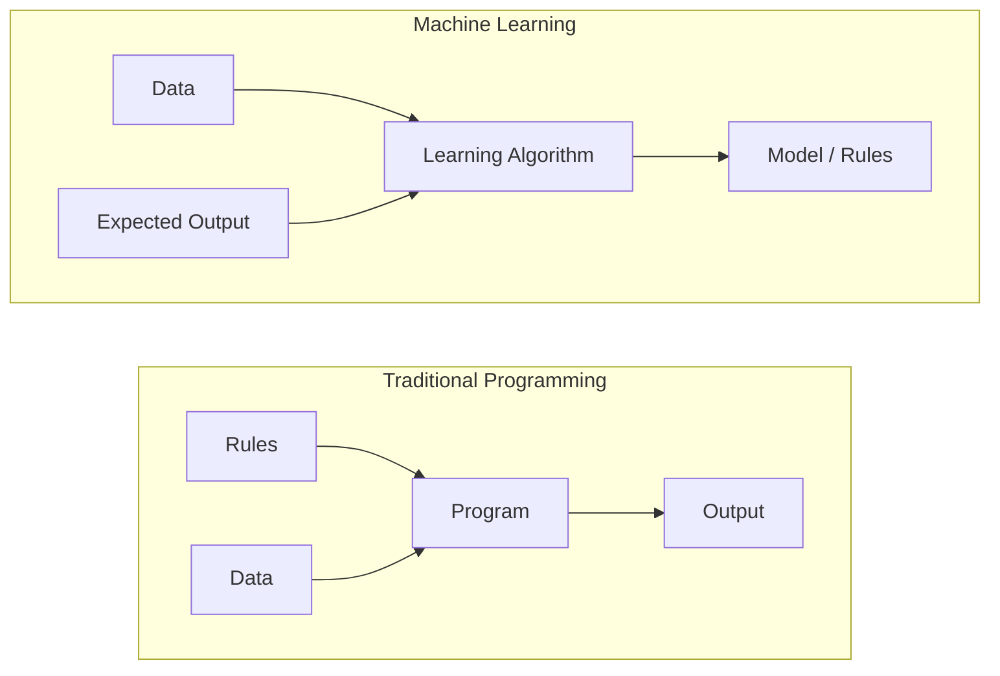
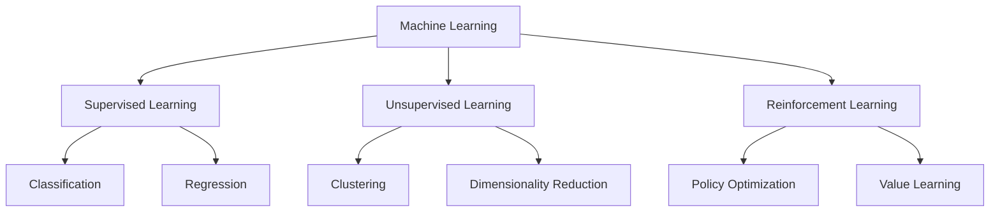
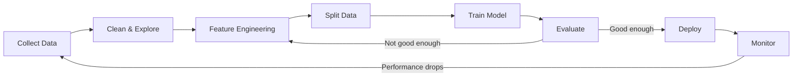
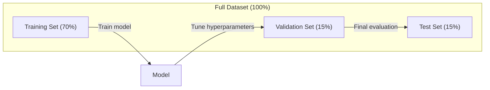
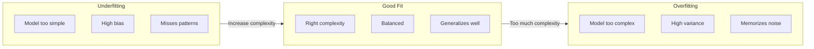
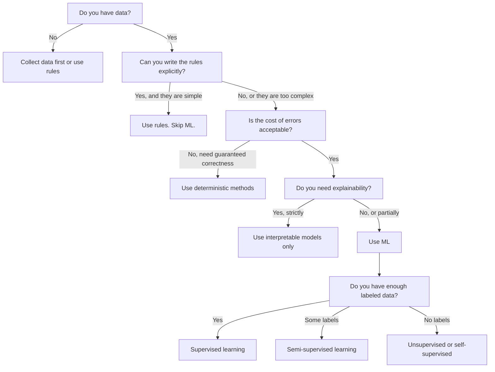

# Makine öğrenimi nedir ?

> Makine öğrenimi, bilgisayarların, el yazma kuralları yerine, verilerde bir model aramasıdır.

**类型：**Öğrenme
**语言：**Python
**先修要求：**1. aşama (Matematik Temeller)
**时间：**45 dakika kadar .

## Öğrenme hedefi

- 解释监督无监督和强化学学习的区别,并判断给定问题适用哪种类型的问题
- En yakın merkez sınıflandırıcısını gerçekleştirmek için, random tabanı kullanmayın.
- 区分 Sınıflama 和 Geri dönüş  görev,并为每种任务选择合适的损失函数
-                                                                                                                                                                                                                                                                                                                                                                                                                                                                                                                              

## 问题

Bir çöp posta filtresi inşa etmek istersin.  geleneksel uygulama şu: oturup birkaç yüz kural yazın. Eğer bir e-posta 'Ücretsiz Para' içerirse, çöp posta olarak işaretlenir. Eğer 3'den fazla hissederse, çöp posta olarak işaretlenir. Birkaç hafta yazmak zorunda kalırsın. Sonra çöp posta gönderen kişi kelime değiştirir. Kurallarınız geçersiz hale gelir. Bu döngü sonsuzdur.

Makine Öğrenimi  bu şekilde değiştirdi. Bu yüzden kural yazmayı bırakıp, bilgisayarın binlerce etiketli posta göndermesine izin vererek, kendi kendine kural bulmasına izin ver. Bu yöntemin hiç düşünmediğini bulma fırsatı bulma fırsatı.

Bu  yazma kurallarından  veri arası öğrenme 'ye dönüşüm, makine öğrenmesinin merkezinde yer almaktadır.

## 概念

### Kurallar yerine verilerden öğrenmek

傳統編程與機械學習以相反的方向解決問題──



傳統編程:你编寫規則──程序把規則應用到数据上并产生输出──

Makine Öğrenimi:You provide data and expect output. Algoritme bulma kuralları.

model                                                                                                                                                                                                                                                              

### Makine Öğrenimi Üç Türü



**Supervised Learning**:You have input-output pair──model öğrenmek 
- Burada kedi veya köpek fotoğrafları için 10.000 张 etiket vardır.
-  Burada ev özellikleri ve fiyatı vardır.

**Unsupervised Learning**Sadece bir giriş. Etiket yok.
- Burada 10.000 adet müşteri satın alımı var.
- Burada 1.000 维'lik bir veri noktası vardır.

**Reinforcement Learning**Bu, bir stratejiyi öğrenir, bir politika yapar, toplam ödülü en üst düzeye çıkarır.
- Bu oyunu oynayalım, +1 kazandık, -1 kaybettik, bir strateji buldu.
- Bu makinenin kolunu kontrol et. Bedenleri kaldır.

Praktiki olarak oluşturulan çoğu içerik denetimsiz öğrenme ile kullanılır. Denetimsiz öğrenme, önceden işleme ve araştırmaya kullanılır.

### 超越三大类型

Yukarıdaki üç sınıf çok net, ama gerçek dünya ML  sık sık bulanık sınırları vardır.

**Semi-supervised learning**Bir küçük bölüm etiketlenen veriler ve çok sayıda etiketsiz veriler kullanın.

- **Label propagation：**构建一个连接相似数据点的图――标签 通过图 从标签节点 传播到无标签邻居──
- **Pseudo-labeling：**Etiketlenmiş veriler üzerinde çalışın, etiketlenmemiş verileri önceden tahmin edin ve sonra tüm veriler üzerinde yeniden çalışın.
- **Consistency regularization：** Bir giriş ve onun hafif rahatsız edici sürümü için, model  aynı tahmin vermektedir. Etiket olmadan bile, bu da çalışabilir.

**Self-supervised learning**Veriler kendiliğinden oluşturma denetimi. Tamamen yapay etiket gerekmiyor.

- **Masked language modeling (BERT)：**隐藏句中 15% 的词,训练模型 预测缺失的词──标签 来自原始文本──
- **Contrastive learning (SimCLR)：**取一张图像, create two enhanced versions── training model 识别它们来自同一张图像,同时将它们与其他图像的增强版本区分──
- **Next-token prediction (GPT)：**给定前面所有词,预测下一个词――每个文本文档都将成为一个训练样本――

Bunlar üç büyük türden farklı sınıflardan bağımsız değildir. Bunlar denetimli ve denetimsiz düşünce yöntemlerinin birleştirilmesidir.

### Sınıflandırma vs. Geri dönüş

Bu iki ana denetimli öğrenme görevi.

| 方面 | Classification | Regression |
|--------|---------------|------------|
| 输出 | 离散类别 | 连续数值 |
| 示例 | “这封邮件是垃圾邮件吗？” | “房价会是多少？” |
| 输出空间 | {cat, dog, bird} | 任意实数 |
| Loss Function | Cross-entropy, accuracy | Mean squared error, MAE |
| 决策 | 类别之间的边界 | 拟合数据的曲线 |

Sınıflama 回答属于哪类别?Regression 回答多少?

Bazı sorunlar iki şekilde ifade edilebilir.

### ML 工作流

Her makine öğrenimi projesi, hangi algoritmayı kullanırsanız kullanın aynı boru hattına uymaktadır.



**Collect Data**: orijinal verileri toplamak. Daha fazla veri neredeyse her zaman daha iyidir, ancak miktardan daha önemli olan kalitedir.

**Clean & Explore**Bu adım genellikle proje toplam zamanının %60-80%'ini oluşturuyor.

**Feature Engineering**:把原始数据转换成模型可用功能──把日期转换为星期几──归结数值列──编码类别变量──好功能比花哨的算法更重要──

**Split Data**:划分为训练、验证 和测试集合──model 在训练数据上训练,你在验证数据上调超参数,并在测试数据上报告最终性能──

**Train Model**:把训练数据输入算法――算法调整内部参数,以最小化损失函数――

**Evaluate**Eğer performans kabul edilemezse, farklı bir özellik, algoritma veya hiperparametre denemeye dönün.

**Deploy**: modelin üretim ortamına yerleştirilmesi, yeni verilere karşı öngörülmesi için

**Monitor**: Sürekli takip performansı, veri dağılımında değişiklikler, veri sürüşü, model giderek geri dönmesi, performansın düşmesi, yeniden eğitimi,

### Eğitim, Valide ve Test

Bu, yeni başlayanların en kolay yanıldığı önemli kavramdır. Eğitim sırasında hiç görmediğiniz verileri değerlendirmek zorunda kalırsın.



| 划分 | 目的 | 使用时机 | 典型大小 |
|-------|---------|-----------|-------------|
| Training | model 从这些数据中学习 | 训练期间 | 60-80% |
| Validation | 调整 hyperparameter、比较 model | 每次训练运行之后 | 10-20% |
| Test | 最终无偏 performance 估计 | 只在最后使用一次 | 10-20% |

Test setleri kutsaldır. Sadece bir kez görebilirsin. Eğer test performansına göre sürekli çalışırsan, test setinde çalışıyorsun.

对于小数据集, k-fold cross-validation:把数据分成 k 份,在 k-1 份训练,在剩余 1 份验证,轮换进行,并对结果取平均──

### Üstü vs. Altı



**Underfitting**Model: 太简单,无法捕捉数据中的模式――就像用一条直线去适合曲关系――训练错 高――测试错也高――

**Overfitting**Model çok karmaşık, eğitim verilerini hatırlıyor, bunların arasında gürültü de var.

**Good fit**:model 捕捉真实模式,而不记忆噪声──训练错和测试错都相对较低──

Aşırı Eklemler:
- Eğitim doğruluğu 远高于验证 doğruluğu
- Model eğitim verilerinde iyi performans gösterdi, ancak yeni verilerde çok kötü performans gösterdi
- 增加更多训练数据 会提升性能(model 原本在记忆中,而不是学习)

修复 Üstü takma:
- Get more training data
- 降低模型复杂性 ((更少参数、更简单架构)
- Düzenlendirme (büyük ağırlığa 添加惩罚)
- İptal(trenman sırasında随机将神经元 置零)
- Erken durdurma (((Bildileme hatası 开始上升时停止训练)

修复 uygunsuzluk:
- Daha karmaşık bir model kullan
- 添加更多 özellik
- 降低 düzenlenme
- 訓練更久

### Taraflı Çeşitlilik Ticaret

Bu, aşırı ve düşük uygunlukların arkasındaki matematik çerçevesidir.

**Bias**Modelleştirilmiş: 错假设的错误──当真相关系非线性时,线性模型会有高偏见──高偏见会导致不适应──

**Variance**Eğitim verilerinden alınan: 中微小波动敏感性エラー──高差的模型 在不同数据集上训练时,会给出非常不同的预测──高差会导致过度适应──

| Model complexity | Bias | Variance | 结果 |
|-----------------|------|----------|--------|
| 过低（用 linear model 拟合弯曲数据） | High | Low | Underfitting |
| 刚好合适 | Medium | Medium | 良好的 generalization |
| 过高（用 degree-20 polynomial 拟合 10 个点） | Low | High | Overfitting |

总 error = Bias^2 + Variance + inconvenient noise

Siz de bu kadar sessiz bir sesini azaltamazsınız. Bu da kendiliğinden bir veri.

### Ücretsiz Öğle Öğle Teoremi Yok

Tüm sorunlara karşı en iyi tek bir algoritma yoktur. Bir sorunun bir sınıfında iyi performans gösteren algoritmalar, diğer sorunun bir sınıfında kötü performans gösterebilir.

实践中,选择取决于:
- Ne kadar veriniz var ?
- Çok fazla özellik var .
- İlişkiler doğrusal ya da doğrusal değil.
- Evet, yorumlanamazlık gerek
- Çekebilen hesap kaynakları

### 什么时候不要使用机器学习

ML  çok güçlü, ama her zaman doğru bir araç değildir.

**不要在以下情况下使用 ML：**

- **规则简单且定义明确。**税费计算、排序算法、单位转换―― birkaç if-statement kullanırsanız 逻辑 yazabilirsiniz, model sadece karmaşıklığı artıracak, hiçbir fayda olmayacaktır―
- **你没有数据或数据很少。**ML  örneklerden öğrenmek gerekir. Sadece 10 veri noktası olduğunda, anlamlı bir şey eğitimi mümkün değil.
- **错误成本是灾难性的，并且你需要保证正确性。**医学量計算、核反应堆控制、密码学验证──ML modeli olasılıktır── bunlar bazen hata yapar.
- **lookup table 或 heuristic 可以解决问题。**Eğer basit bir eşiğin veya tabloun %99'u kapsamaktadırsa, ML eklenmesi bakım maliyetini artıracak, ama anlamlı bir gelişme olmayacaktır.
- **你无法解释决策，而 explainability 又是必需的。**Örgütlenme sektörü ((kredit]],保险、刑事司法) Bazen her kararın tam olarak açıklanabilmesi gerekmektedir.
- **问题变化得比你重新训练还快。**Eğer kurallar her gün değişirse, yeniden eğitilmek bir hafta gerekecekse, model her zaman eskisi gibi olacaktır.

Bu karar akış çizelgesini kullan:




```figure
f3-learning-boundary
```

## Yapın onu.

`code/ml_intro.py`Orta kod, en basit ML algoritması olan en yakın sentroid sınıflandırıcısını sıfırdan gerçekleştirir.

### 步骤 1: En Yakın Merkez sınıflandırıcısını sıfırdan gerçekleştirmek

En yakın merkez sınıflandırıcısı, öğrenme verilerini hesaplar.

```python
class NearestCentroid:
    def fit(self, X, y):
        self.classes = np.unique(y)
        self.centroids = np.array([
            X[y == c].mean(axis=0) for c in self.classes
        ])

    def predict(self, X):
        distances = np.array([
            np.sqrt(((X - c) ** 2).sum(axis=1))
            for c in self.centroids
        ])
        return self.classes[distances.argmin(axis=0)]
```

İşte tüm algoritma. Fit 计算两个意思──预测 计算距离──没有渐进下降,没有反复,没有超参数──

### 步骤 2: Synthetic Data 上训练

2D sınıflandırma verileri oluşturduk, bunlardan iki sınıfın hafif bir ağırlığı var.

```python
rng = np.random.RandomState(42)
X_class0 = rng.randn(100, 2) + np.array([1.0, 1.0])
X_class1 = rng.randn(100, 2) + np.array([-1.0, -1.0])
X = np.vstack([X_class0, X_class1])
y = np.array([0] * 100 + [1] * 100)
```

### 3 adım: Temel değer ile karşılaştır

Her ML modeli basit bir temel çizgiyle karşılaştırılmalıdır. Bu çizgi bir sınıfın tahminini yapmayı gerektirir. Eğer ML modeli tahminini aşamazsa, sorunlar vardır.

```python
baseline_preds = rng.choice([0, 1], size=len(y_test))
baseline_acc = np.mean(baseline_preds == y_test)
```

Bu net veriler topluluğunda, bir merkez sınıflandırıcısı %90+ doğruluğuna ulaşabilmelidir.

### Neden bu çok önemli ?

En yakın merkezde sınıflandırıcı 极其简单―― hiperparametre, iterasyon, gradyen düşüşü yok.

1. Eğitim verilerinden**学习**Bir çeşit ifade
2. Yeni verileri göstermek için kullanın**预测**(en yakın mesafe)
3. Başlangıç  yürütülmesi**评估**(Hepse tahmin et)

Her bir ML algoritması, lojistik gerilemeden transformatörlere kadar, aynı üç adımlı bir model izler.

### 步骤 4:Centroid Classifier yapma

En yakın merkez sınıflandırıcı                                                                                                                                                                                                                                                                                                                                                                                                                                                                                                                        

- sınıf çok sayıda küme vardır. Örneğin sayı 1 birkaç farklı yazma şekli ile yazılabilir.
- Karar sınırları doğrusal değildir.
- Özellik 差异很大(distance 被最大规模的特点 主导)

Bu kısıtlamalar öğrenmek istediğiniz diğer tüm algoritmaları ortaya çıkardı. K-en yakın komşular birden fazla kümeyi işleyebilir.

## Kullan

Süküler       `NearestCentroid`Sintez veri jeneratörü:

```python
from sklearn.neighbors import NearestCentroid
from sklearn.datasets import make_classification
from sklearn.model_selection import train_test_split

X, y = make_classification(
    n_samples=500, n_features=2, n_redundant=0,
    n_clusters_per_class=1, random_state=42
)
X_train, X_test, y_train, y_test = train_test_split(X, y, test_size=0.3)

clf = NearestCentroid()
clf.fit(X_train, y_train)
print(f"Accuracy: {clf.score(X_test, y_test):.3f}")
```

## - Söyle.

本课会生成 `outputs/prompt-ml-problem-framer.md`Bu, hızlı bir şekilde, belirsiz bir iş sorunu olarak belirli bir ML görevine dönüştürülebilir. Bu sorunun bir açıklamasını yaparak, öğrenme türünü tanımlar, tahmin hedefini tanımlar, aday özelliğini listeler, başarı metriklerini seçer, bir temel oluşturur, ve verilerin sızmasını veya sınıf dengesizliğini belirler.

## 关键术语

| 术语 | 人们常说 | 实际含义 |
|------|----------------|----------------------|
| Model | “The AI” | 一个带有可学习 parameter 的数学函数，用于把输入映射到输出 |
| Training | “Teaching the AI” | 运行 optimization algorithm 来调整 model parameter，使预测匹配已知输出 |
| Feature | “An input column” | 数据中可测量的属性，model 用它进行预测 |
| Label | “The answer” | training example 的已知输出，用于计算 error signal |
| Hyperparameter | “A setting you tweak” | 训练前设置的 parameter，用于控制学习过程（learning rate、layer 数量） |
| Loss Function | “How wrong the model is” | 衡量预测输出与实际输出之间差距的函数，训练会尝试将其最小化 |
| Overfitting | “It memorized the test” | model 学到了 training-specific noise，而不是通用模式，因此在新数据上失败 |
| Underfitting | “It didn't learn anything” | model 太简单，无法捕捉数据中的真实模式 |
| Generalization | “It works on new data” | model 对未训练过的数据做出准确预测的能力 |
| Cross-validation | “Testing on different chunks” | 反复把数据拆分为 train/test fold 并对结果取平均，从而得到更稳健的 performance 估计 |
| Regularization | “Keeping weights small” | 向 Loss Function 添加 penalty term，以抑制过于复杂的 model |
| Data drift | “The world changed” | 传入数据的统计分布随时间发生变化，导致 model performance 下降 |

## 练习

1. 选择任意数据集 (例如 Iris、Titanic) 』按 70/15/15 拆分为火车/验证/测试――解释为什么不应该在测试组上调整超参数――
2. 列出三真世界问题──对每一个问题,判断它是分类、退缩还是集群,以及它是监督还是无监督──
3. Bir model eğitim verilerinde %99 doğruluğa ulaşır, ancak test verilerinde sadece %60 doğruluğa ulaşır.

## 延伸阅读

- [An Introduction to Statistical Learning](https://www.statlearning.com/)- 免费教材,覆盖所有经典 ML 方法,并配有实践示例
- [Google's Machine Learning Crash Course](https://developers.google.com/machine-learning/crash-course)- ML kavramının basitleştirilmesi
- [Scikit-learn User Guide](https://scikit-learn.org/stable/user_guide.html)- Python'da ML'yi gerçekleştirmek için pratik referans
