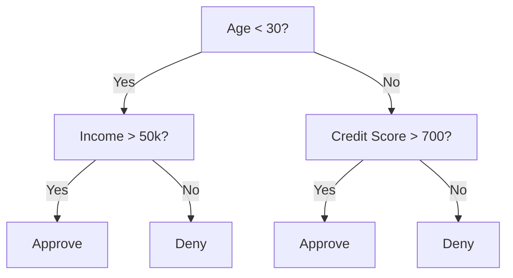
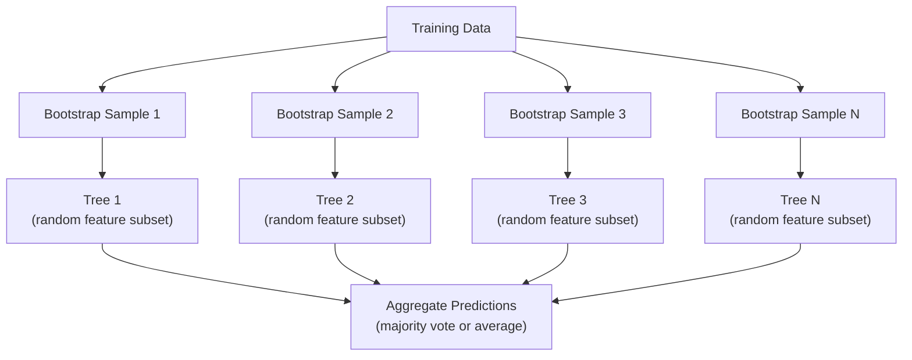

# Karar ağaçları ve rastgele ormanlar

> Karar ağacı sadece bir süreçtir. Ama birçok ağaçtan oluşan orman, ML'nin en güçlü araçlarından biridir.

**类型：**Yapım
**语言：**Python
**先修要求：**Eğitim Fase 1 ((Düşünmeler 09 Bilgi Teorisi, 06 Muhtemelenlik)
**时间：**90 dakika kadar .

## Öğrenme hedefi

- 实现 Gini pisliği, entropi, bilgi kazanımı 计算, en iyi karar ağacı bölünmesini bulmak için
- Çıktırma yapımı: 零构建一个决策树分类器,并加入预剪切 控制(最大深度、min 样本)
- Bootstrap örneği kullanın ve özellik rastlantılama  Randeom orman inşa,并 açıklayın neden varyansa düşürmek için
- MDI özellik önemi ile permutasyon önemi karşılaştırın, MDI'yi ne zaman önyargılı olduğunu belirleyin

## 问题

Eğer bir tablo verisi varsa, örneği vardır, bir özellik vardır, ayrıca bir hedef sütunu vardır. Sen doğrudan bir sinir ağına yüklenebilirsin.

Neden?Ağaç  preprocessing                                                                                                                                                                                                                                                                                                                                                                                                                                                                                                                    

Bu ders, geri dönüşlü bölünmeyi kullanarak, karar ağaçlarını sıfırdan inşa ederek, sonra da üzerinde rastgele orman inşa edersiniz.

## 核心概念

### Karar ağacı ne yapsın

Karar ağacı                                                                                                                                                                                                                                                                                                                                                                                                                                                                                                                          



Her iç düğüm bir eşiği kullanır. Bir özellik dener. Her yaprak düğümü bir tahmin yapar. Yeni bir veri noktasını sınıflandırır.

Ağacın üst-üstüne yapımı: her düğümde, en iyi ve en iyi verileri seçin.

### Ayrılama kriterleri: Kirlilik ölçümü

Her düğümde bir grup örnek var. Biz onları bölmek istiyoruz. Böylece çocuk düğümleri mümkün olduğunca saf hale gelir.

**Gini impurity** Ölçüm: Eğer bu düğümün sınıf dağılımına göre ırk seçimi ırk seçimi ırk etiketine ırk ayrımı yapılırsa, yanlış sınıflandırılma olasılığı vardır.

```
Gini(S) = 1 - sum(p_k^2)

where p_k is the proportion of class k in set S.
```

对于纯节点(全部属于同一个类),Gini = 0。对于 50/50类的二进分,Gini = 0.5。越低越好。

```
Example: 6 cats, 4 dogs

Gini = 1 - (0.6^2 + 0.4^2) = 1 - (0.36 + 0.16) = 0.48
```

**Entropy**衡量 node 中的信息量(混乱程度) ――Fase 1 Ders 09 已覆盖──

```
Entropy(S) = -sum(p_k * log2(p_k))
```

对于纯节点,entropy = 0──对于50/50 双分点,entropy = 1.0──越低越好──

```
Example: 6 cats, 4 dogs

Entropy = -(0.6 * log2(0.6) + 0.4 * log2(0.4))
        = -(0.6 * -0.737 + 0.4 * -1.322)
        = 0.442 + 0.529
        = 0.971 bits
```

**Information gain**                                                                                                                                                                                                                                                              

```
IG(S, feature, threshold) = Impurity(S) - weighted_avg(Impurity(S_left), Impurity(S_right))

where the weights are the proportions of samples in each child.
```

Her düğümün üstündeki açgözlülük algoritması:`(feature, threshold)`组合──

### Bölme 如何工作

对于当前节上包含 n 个特征、m 个样本的数据集:

1. J(j = 1 ~ n için:
   - 按特征 j对样本 排序
   - △ △ △ △ △ △ △ △ △ △ △ △ △ △ △ △ △ △ △ △ △ △ △ △ △ △ △ △ △ △ △ △ △ △ △ △ △ △ △ △ △ △ △ △ △ △ △ △ △ △ △ △ △ △ △ △ △ △ △ △ △ △ △ △ △ △ △ △ △ △ △ △ △ △ △ △ △ △ △ △ △ △ △ △ △ △ △ △ △ △ △ △ △ △ △ △ △ △ △ △ △ △ △ △ △ △ △ △ △ △ △ △ △ △ △ △ △ △ △ △ △ △ △ △ △ △ △ △ △ △ △ △ △ △ △ △ △ △ △ △ △ △ △ △ △ △ △ △ △ △ △ △ △ △ △ 
   - 计算每个门的信息收益
2. 选择信息获取最高特征和门
3. Verileri sol için bölmek (Fitur <= eşiği) ve sağ için (Fitur > eşiği)
4. Her çocuk için 递归执行

Bu açgözlülük ısı tüm dünyadaki en iyi ağaç elde etmek için güvence verilmiyor. En iyi ağaç bulmak NP-kıt ama açgözlülük bölünmesi pratikte çok iyi bir etki sağlar.

### Durumları

Eğer durma koşulları yoksa, ağaç her yaprak temiz olana kadar büyümeye devam eder.

**Pre-pruning**Ağaçta bir süre kalmak için durmadan:
- Maksimum derinlik:当 tree  设定深度 时停止 splitting
- Yarpaq başına en az örnekler: Eğer bir düğümün örnekleri k'den az ise, durdurulur
- En az bilgi kazancı: En iyi artan artan artan artan bir eşiğden ise,
- Maksimum yaprak düğümleri: limiti yaprakların toplam sayısı

**Post-pruning**Önce tam bir ağaç üret, sonra tekrar tekrar biçim:
- Masraflı karmaşıklık kesim ((çık-bilin kullanımı): yapraklarla bir ekle sayısal oranla ceza
- Kısaltılmış hata kesimi: Eğer bir alt ağacı kaldırmak onaylama hatasını artırmazsa, onu kaldır

Daha basit ya da daha hızlı. Kesmeden sonra genellikle daha iyi ağaçlar üretilir, çünkü daha sonra faydalı bölünmeler getirebilecek olan ağaçları çok erken durdurmaz.

### Geri dönüş karar ağaçları kullanıyor .

 Geri dönüş için, yaprak tahminleri  yapraklar arasındaki hedef değerlerin ortalama değeri  Ayrılık kriterleri  Değişiklik:

**Variance reduction**替代 bilgi kazanımı:

```
VR(S, feature, threshold) = Var(S) - weighted_avg(Var(S_left), Var(S_right))
```

选择使变化 降低最多的分离―― Tree 会把输入空间 划分多个区域,并在每个区域预测一个常数(平均值) ――

### Rastgele ormanlar: Ensemble's forces

单树决策树 具有高变化──数据中的微小变化可能产生完全不同的树──随机森林 通过许多树 寻求平均来解决这个问题──



两种随机性 让树木 多样性:

**Bagging（bootstrap aggregating）：**Her ağaç bir başlangıç örneğinde bulunur. Üzerinde yapılan eğitimlerin bir kısmıdır.

**Feature randomization：**Bu nedenle, her bölünme sırasında, sadece bir sıradan özellik alt kümesini düşünün.

关键洞见: 求平均, 求平均, 求平均, 求平均, 求平均, 求平均, 求平均, 求平均, 求平均, 求平均, 求平均, 求平均, 求平均, 求平均, 求平均, 求平均,求平均,求平均,求平均,求平均,求平均,求平均,求平均,求平均,求平均,求平均,求平均,求平均,求平均,求平均,求平均,求平均,求平均,求平均,求平均,求平均,求平均,求平均,求平均,求平均,求平均,求平均,求平均,求平均,求平均,求平均,求平均,求平均,求平均,求平均,求平均,求平均,求平均,求平均,求平均,求平均,求平均,求平均,求平均,求平均,求平均,求平均,求平均,求平均,求平均,求平均,求平均,求平均,求平均,求平均,求平均,求平均,求平均,求平均,求平均,求平均,求平均,求平均,求6.

### Özellik önemi

Rastgele ormanlar 天然提供特色重要性スコア──最常见的方法:

**Mean Decrease in Impurity (MDI)：**Her bir özellik için, tüm ağaçlarda tüm bu özellik kullanan düğümler için  toplam miktarı  toplam miktarı                                                                                                                                                                                                                                                                                                                                                                                                                                                                                                    

```
importance(feature_j) = sum over all nodes where feature_j is used:
    (n_samples_at_node / n_total_samples) * impurity_decrease
```

Bu yöntem çok hızlıdır, ancak yüksek kardinallık özelliklerine ve birçok olası bölünme noktasına sahip özelliklere yönelir.

**Permutation importance**Bu yöntemin diğer bir yolu da, bir özelliğin değerlerini dengelemek ve model doğruluğunu ölçmek.

### Ağacı 何時胜過 神経ネットワーク

Ağaçlar ve ormanlar, tablo verilerinde genellikle sinir ağlarından üstün gelir.

| Factor | Trees | Neural networks |
|--------|-------|----------------|
| Mixed types (numeric + categorical) | 原生支持 | 需要 encoding |
| Small datasets (< 10k rows) | 表现良好 | 容易 overfit |
| Feature interactions | 通过 splitting 找到 | 需要 architecture design |
| Interpretability | 完全透明 | Black box |
| Training time | 分钟级 | 小时级 |
| Hyperparameter sensitivity | 低 | 高 |

Verilerden oluşan bir dizi veya uzaylı yapı vardır.


```figure
decision-tree-depth
```

## Yapın onu.

### 步骤 1:Gini kirlilik 和 entropi

Bu iki bölünme kriterinin de, hangi bölünmelerin iyi olduğuna dair bir karar vermelerini onaylamakta.

```python
import math

def gini_impurity(labels):
    n = len(labels)
    if n == 0:
        return 0.0
    counts = {}
    for label in labels:
        counts[label] = counts.get(label, 0) + 1
    return 1.0 - sum((c / n) ** 2 for c in counts.values())

def entropy(labels):
    n = len(labels)
    if n == 0:
        return 0.0
    counts = {}
    for label in labels:
        counts[label] = counts.get(label, 0) + 1
    return -sum(
        (c / n) * math.log2(c / n) for c in counts.values() if c > 0
    )
```

### 步骤 2: en iyi bölünmeyi bulmak

尝试每个特征 和每个门──返回信息获取最高的那个──

```python
def information_gain(parent_labels, left_labels, right_labels, criterion="gini"):
    measure = gini_impurity if criterion == "gini" else entropy
    n = len(parent_labels)
    n_left = len(left_labels)
    n_right = len(right_labels)
    if n_left == 0 or n_right == 0:
        return 0.0
    parent_impurity = measure(parent_labels)
    child_impurity = (
        (n_left / n) * measure(left_labels) +
        (n_right / n) * measure(right_labels)
    )
    return parent_impurity - child_impurity
```

### 步骤 3: DecisionTree sınıfını oluştur

Tekrarlı bölünme, tahmin ve özellik önem takip edilmesi

```python
class DecisionTree:
    def __init__(self, max_depth=None, min_samples_split=2,
                 min_samples_leaf=1, criterion="gini",
                 max_features=None):
        self.max_depth = max_depth
        self.min_samples_split = min_samples_split
        self.min_samples_leaf = min_samples_leaf
        self.criterion = criterion
        self.max_features = max_features
        self.tree = None
        self.feature_importances_ = None

    def fit(self, X, y):
        self.n_features = len(X[0])
        self.feature_importances_ = [0.0] * self.n_features
        self.n_samples = len(X)
        self.tree = self._build(X, y, depth=0)
        total = sum(self.feature_importances_)
        if total > 0:
            self.feature_importances_ = [
                fi / total for fi in self.feature_importances_
            ]

    def predict(self, X):
        return [self._predict_one(x, self.tree) for x in X]
```

### 步骤 4: RandomForest sınıfını oluştur

Bootstrap örnekleme, özellikler rastlantısı ve çoğunluk oylaması

```python
class RandomForest:
    def __init__(self, n_trees=100, max_depth=None,
                 min_samples_split=2, max_features="sqrt",
                 criterion="gini"):
        self.n_trees = n_trees
        self.max_depth = max_depth
        self.min_samples_split = min_samples_split
        self.max_features = max_features
        self.criterion = criterion
        self.trees = []

    def fit(self, X, y):
        n = len(X)
        for _ in range(self.n_trees):
            indices = [random.randint(0, n - 1) for _ in range(n)]
            X_boot = [X[i] for i in indices]
            y_boot = [y[i] for i in indices]
            tree = DecisionTree(
                max_depth=self.max_depth,
                min_samples_split=self.min_samples_split,
                max_features=self.max_features,
                criterion=self.criterion,
            )
            tree.fit(X_boot, y_boot)
            self.trees.append(tree)

    def predict(self, X):
        all_preds = [tree.predict(X) for tree in self.trees]
        predictions = []
        for i in range(len(X)):
            votes = {}
            for preds in all_preds:
                v = preds[i]
                votes[v] = votes.get(v, 0) + 1
            predictions.append(max(votes, key=votes.get))
        return predictions
```

完整实现及所有辅助方法 见 `code/trees.py`- Evet.

## Kullan

Sıcak öğren, tesadüfen eğitim orman sadece üç行:

```python
from sklearn.ensemble import RandomForestClassifier
from sklearn.datasets import load_iris
from sklearn.model_selection import train_test_split

X, y = load_iris(return_X_y=True)
X_train, X_test, y_train, y_test = train_test_split(X, y, random_state=42)

rf = RandomForestClassifier(n_estimators=100, random_state=42)
rf.fit(X_train, y_train)
print(f"Accuracy: {rf.score(X_test, y_test):.4f}")
print(f"Feature importances: {rf.feature_importances_}")
```

Praktiki olarak, dereceli güçlendirilmiş ağaçlar (XGBoost、LightGBM、CatBoost) genellikle rastgele ormanlardan daha güçlüdürler, çünkü ağaçların yapılandırılması sırasıyla, her ağaç ağaçların yanlışına düzeltmektedir.

## - Söyle.

本课会产 出 `outputs/prompt-tree-interpreter.md`Bu, iş ilişkileri için kullanılır bir karar ağacı bölünmelerini açıklamak için bir ipucu. Ona eğitilmiş ağaç yapısını aktarmak için bir örnektir.

## 练习

1. 3 sınıf içeren bir 2 boyutlu veri kümesi içinde, bir karar ağacı üzerinde çalışmak, el izleme ve düz karar sınırlarını çizmek, maksimum derinlik = 2 ile maksimum derinlik = 10 时 sınırlarını karşılaştırmak.

2. Çekilme ağaçları  gerçekleşme varyansa azaltma bölünmesi──为 200 个点生成 y = sin(x) + noise,并拟合你的回归树──将树的碎片wise-constant predictions与真实曲线一起绘图──

3.  yapı 1、5、10、50 和 200 樹のランダム森を含む.  図を描く訓練精度とテスト精度 樹数変化曲線と 図鑑 図鑑 図鑑 図鑑 図鑑 図鑑 図鑑 図鑑 図鑑 図鑑 図鑑 図鑑 図鑑 図鑑 図鑑 図鑑 図鑑 図鑑 図鑑 図鑑 図鑑 図鑑 図鑑 図鑑 図鑑 図鑑 図鑑 図鑑 図鑑 図鑑 図鑑 図鑑 図鑑 図鑑 図鑑 図鑑 図鑑 図鑑 図鑑 図鑑 図鑑 図鑑 図鑑 図鑑 図鑑 図鑑 図鑑 図鑑 図鑑 図鑑 図鑑 図鑑 図鑑 図鑑 図鑑 図鑑 図鑑 図鑑 図鑑 図鑑 図鑑 図鑑 図鑑 図鑑 図鑑 図鑑 図鑑 図鑑 図鑑 図鑑 図鑑 図鑑 図 図鑑 図鑑 図 図鑑 図書 図鑑 図書 図鑑 図書 図書 図書 図書 図書 図書 図書 図書 図書 図書 図書 図書 図書 図書 図書 図書 図書 図書 図書 図書 図書 図書 図書 図書 図書 図書 図書 図書 図書 図書 図書 図書 図書 図書 図書 図書 図書 図書 図書 図書 図書 図書 図書 図書 図書 図書 図書 図書 図書 図書 図書 図書 図書 図書 図書 図書 図書 図書 図書

4. 5 farklı veri kümesi içinde Gini kirliliği ile entropiyi  split kriterleri olarak gösterim olarak ölçmek.

5. 实现 permutation importance──在一个数据集上将它与MDI重要性比较,其中一个特征是随机噪音,但具有高 Cardinality──MDI 会把噪音特征排得很高──Permutation importance 不会──

## 关键术语

| Term | 人们常说 | 实际含义 |
|------|----------------|----------------------|
| Decision tree | “用于 predictions 的流程图” | 一种通过学习一系列 if/else splits，将 feature space 划分为矩形区域的 model |
| Gini impurity | “node 有多混杂” | 在某个 node 上 misclassify 一个 random sample 的概率。0 = pure，0.5 = binary 情况下的最大 impurity |
| Entropy | “node 中的混乱程度” | node 上的信息量。0 = pure，1.0 = binary 情况下的最大 uncertainty。来自 information theory |
| Information gain | “split 有多好” | split 后 impurity 的降低量。用于选择 splits 的 greedy criterion |
| Pre-pruning | “提前停止 tree” | 通过设置 max depth、min samples 或 min gain thresholds，提前停止 tree growth |
| Post-pruning | “事后修剪 tree” | 先生成完整 tree，再移除不会提升 validation performance 的 subtrees |
| Bagging | “在随机 subsets 上训练” | Bootstrap aggregating。在不同的有放回 random sample 上训练每个 model |
| Random forest | “一堆 trees” | Decision trees 的 ensemble，每棵 tree 都在 bootstrap sample 上训练，并在每次 split 使用 random feature subsets |
| Feature importance (MDI) | “哪些 features 重要” | 每个 feature 贡献的总 impurity decrease，在所有 trees 和 nodes 上求和 |
| Permutation importance | “打乱后检查” | 随机打乱某个 feature 的 values 时 accuracy 的下降量。对于 noisy features，比 MDI 更可靠 |
| Variance reduction | “info gain 的 regression 版本” | Information gain 的 regression tree 对应形式。选择使 target variance 降低最多的 split |
| Bootstrap sample | “带重复的 random sample” | 从原始 dataset 中有放回抽取得到的 random sample。大小相同，但包含 duplicates |

## 延伸阅读

- [Breiman: Random Forests (2001)](https://link.springer.com/article/10.1023/A:1010933404324)- 原始随机森林 论文
- [Grinsztajn et al.: Why do tree-based models still outperform deep learning on tabular data? (2022)](https://arxiv.org/abs/2207.08815)- 关于树木 vs. Neural Networks                                                                                                                                                                                                                                                                                                                                                                                                                                                                                                                   
- [scikit-learn Decision Trees documentation](https://scikit-learn.org/stable/modules/tree.html)- 带视觉化工具的实践指南
- [XGBoost: A Scalable Tree Boosting System (Chen & Guestrin, 2016)](https://arxiv.org/abs/1603.02754)- 主导 Kaggle'in eğilimi artırma 论文
