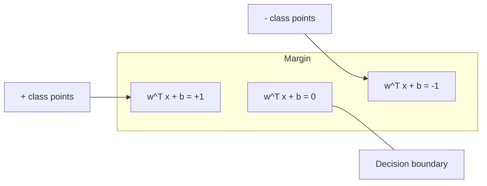
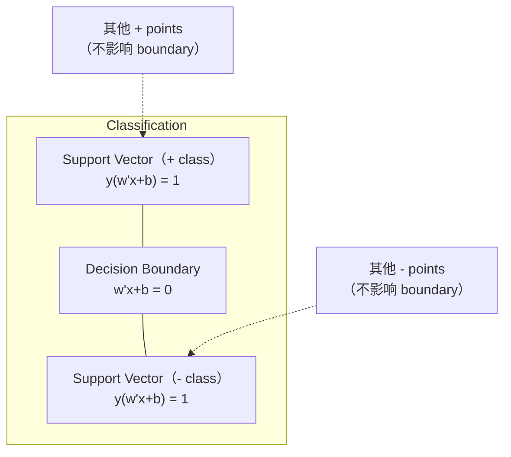
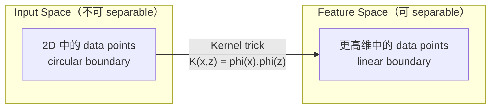

# Destek Vektör Makineleri

> İki sınıf arasında en geniş sokak bul.

**Type:** Build
**Language:**Python
**先修要求：**1. aşama: Dersler 08 Optimize, 14 Norma ve Mesafe, 18 Konves Optimize)
**Time:** ~90 分钟

## Öğrenme hedefi
- Çekil kaybı ve ilk formülasyon yukarıdaki dereceli düşüşü kullanarak, sıfırdan bir doğrusal SVM gerçekleştirmek
- 解释最大边际原理,并从训练好的模型中识别支持向量
- Linyal、polinom ve RBF çekirdekleri ile karşılaştırın, çekirdek hilesini nasıl önleyeceğinizi açıkça açıkça açıkça açıkça açıkça açıkça açıkça açıkça açıkça açıkça açıkça açıkça açıkça açıkça açıkça açıkça açıkça açıkça açıkça açıkça açıkça açıkça açıkça açıkça açıkça açıkça açıkça açıkça açıkça açıkça açıkça açıkça açıkça açıkça açıkça açıkça açıkça açıkça açıkça açıkça açıkça açıkça açıkça açıkça açıkça açıkça açıkça açıkça açıkça açıkça açıkça açıkça açıkça açıkça açıkça açıkça açıkça açıkça açıkça açıkça açıkça açıkça açıkça açıkça açıkça açıkça açıkça açıkça açıkça açıkça açıkça açıkça açıkça açıkça açıkça açıkça açıkça açıkça açıkça açıkça açıkça açıkça açıkça açıkça açıkça açıkça açıkça açıkça açıkça açıkça açıkça açıkça açıkça açıkça açıkça açıkça açıkça açıkça açıkça açıkça açıkça açıkça açıkça açıkça açıkça açıkça açıkça açıkça açıkça açıkça açıkça açıkça açıkça açıkça açıkça açıkça açıkça açıkça açıkça açıkça açıkça açıkça açıkça açıkça açıkça açıkça açıkça açıkça açıkça açıkça açıkça açıkça açıkça açıkça açıkça açıkça açıkça açıkça açıkça açıkça açıkça açıkça açıkça açıkça açıkça açıkça açıkça açıkça açıkça açıkça açıkça
-  C parametre tarafından değerlendirilmiş  kontrol alanı genişliği ile sınıflandırma hataları arasındaki tartışma

## 问题
İki tür veri noktası var, onları ayırmak için bir düz çizgi veya hiperplane çizmek gerekir.

选择边界 最大的那一条──margin, iki tarafın yakın veri noktası arasındaki mesafeden karar sınırıdır──更宽的边界意味着分类者更有信心,并且能更好地概括到未见数据──

Bu algı, ML orta matematikte en iyi algoritmalardan biri olan Destek Vektör Makinelerini ortaya çıkardı. SVM'ler Deep Learning'den önce baskın sınıflandırma yöntemleriydi ve küçük veri kümeleri, yüksek veri ve ilkeler gerektiren, tam olarak anlaşılan, teorik güvenceye sahip model sorunları arasında hala en iyi seçimlerdir.

SVM'ler 直接连接到阶段 1:optimization is convex 的 (Öğrenim 18),margin with norms 来度量 (Normalar ile ölçülme) (Öğrenim 14), while kernel trick utilizing dot products, in non-real calculating high维空间) durumunda işleme çizgisiz sınırları──

## 概念
### Maksimum间隔 sınıflandırıcı

{-1, +1} ve özellik vektörleri x_i'nin doğrusal olarak ayrılabilir verileri verilen etiketler y_i, biz bir hiper düzlem w^T x + b = 0 için aramak istiyoruz.

Hiperplane'a olan mesafe:

```
distance = |w^T x_i + b| / ||w||
```

对于正确分类的点:y_i * (w^T x_i + b) > 0。marjin ise hiperplane'den en yakın noktaya iki kat uzaklıkta.



Optimizeleme sorunu:

```
maximize    2 / ||w||     (margin width)
subject to  y_i * (w^T x_i + b) >= 1  for all i
```

等地(minimize eden daha fazla fiyatı daha kolay optimize etmek için):

```
minimize    (1/2) ||w||^2
subject to  y_i * (w^T x_i + b) >= 1  for all i
```

Bu bir sarkık kare programıdır. Bu tek küresel çözümü vardır. Y_i * (w^T x_i + b) = 1) destek vektörleri yer alır. Bunlar karar sınırının tek belirleyen noktalardır.

### Destek vektörleri:关键的少数点



Çoğu eğitim noktası ️️️️️️️️️️️️️️️️️️️️️️️️️️️️️️️️️️️️️️️️️️️️️️️️️️️️️️️️️️️️️️️️️️️️️️️️️️️️️️️️️️️️️️️️️️️️️️️️️️️️️️️️️️️️️️️️️️️️️️️️️️️️️️️️️️️️️️️️️️️️️️️️️️️️️️️️️️️️️️️️️️️️️️️️️️️️️️️️️️️️️️️️️️️️️️️️️️️️️️️️️️️️️️️️️️️️️️️️️️️️️️

Destek vektörlerinin sayısı da genelleşme hatası sınırını göstermiştir. Verita kümesi boyutuna göre, destek vektörleri 越少, genelleşme 越好。

### Yumuşak Marj: C parametre kullan 処理 noise

Gerçek veriler çok azdır tamamen ayrılabilir ∼ Bazı noktalar sınırın yanlış bir tarafında veya kenarın içinde yerleşebilir ∼ yumuşak kenar formülasyonu ∼ ihlallere izin vermek için gevşek değişkenler ∼

```
minimize    (1/2) ||w||^2 + C * sum(xi_i)
subject to  y_i * (w^T x_i + b) >= 1 - xi_i
            xi_i >= 0  for all i
```

slack değişken xi_i 衡量点 i 违反差 的程度──C 控制这种交易:

| C value | Behavior |
|---------|----------|
| Large C | 对 violations 施加重罚。margin 窄，misclassifications 更少。Overfits |
| Small C | 允许更多 violations。margin 宽，misclassifications 更多。Underfits |

C = düzenlenme gücü 的倒数── Büyük C = 更少的规律化── Küçük C = 更多的规律化──

### Hinge kaybı:SVM'in kaybı işlevi

Soft margin SVM kısıtlama dışı optimizasyon için yeniden yazılabilir:

```
minimize    (1/2) ||w||^2 + C * sum(max(0, 1 - y_i * (w^T x_i + b)))
```

项 max(0, 1 - y_i * f(x_i)) İşte karikatür kaybı。当点被正确分类且位于边缘 之外时,它为零──当点位于边缘 内部或被错误分类时,它是线性的──

```
单个点的 Hinge loss：

loss
  |
  | \
  |  \
  |   \
  |    \
  |     \_______________
  |
  +-----|-----|-------->  y * f(x)
       0     1

当 y*f(x) >= 1 时为 zero loss（正确分类，位于 margin 外）。
当 y*f(x) < 1 时为 linear penalty。
```

•Logistik kayıplarla (logistik gerileme)

```
Hinge:     max(0, 1 - y*f(x))          在 margin 处 hard cutoff
Logistic:  log(1 + exp(-y*f(x)))        平滑，永远不会精确为零
```

Hinge kaybı  nadir çözümler üretir(sadece destek vektörleri 有非零贡献) ――logistik kaybı Bütün veri noktalarını kullanın。 bu da SVM'leri tahmin süresi daha hafıza verimli yapar。

### Uzal gradient düşüş 训练 doğrusal SVM

L2 düzenlenmesi ile yukarıdaki derecelendirme düşüşü kullanarak doğrusal SVM'yi eğitmek için kısıtlı QP'yi çözmek zorunda kalmadan kullanabilirsiniz:

```
L(w, b) = (lambda/2) * ||w||^2 + (1/n) * sum(max(0, 1 - y_i * (w^T x_i + b)))

关于 w 的 Gradient：
  If y_i * (w^T x_i + b) >= 1:  dL/dw = lambda * w
  If y_i * (w^T x_i + b) < 1:   dL/dw = lambda * w - y_i * x_i

关于 b 的 Gradient：
  If y_i * (w^T x_i + b) >= 1:  dL/db = 0
  If y_i * (w^T x_i + b) < 1:   dL/db = -y_i
```

Bu, ilk formülasyon olarak adlandırılır. Her dönem için süresi O (n * d) olarak bilinir.

### Çift formülasyon ve çekirdek hilesi

SVM sorunu  Lagrangian dual  (Fase 1 Ders 18,KKT koşullarından) ):

```
maximize    sum(alpha_i) - (1/2) * sum_ij(alpha_i * alpha_j * y_i * y_j * (x_i . x_j))
subject to  0 <= alpha_i <= C
            sum(alpha_i * y_i) = 0
```

X_j. x_j. ⇒ x_j. x_j. x_j. x_j. x_j. x_j. x_j. x_j. x_j. x_j. x_j. x_j. x_j. x_j. x_j. x_j. x_j. x_j. x_j. x_j. x_j. x_j. x_j. x_j. x_j. x_j. x_j. x_j. x_j. x_j. x_j. x_j. x_j. x_j. x_j. x_j. x_j. x_j. x_j. x_j. x_j. x_j. x_j. x_j. x_j. x_j. x_j. x_j. x_j. x_j. x_j. x_j. x_j. x_j. x_j. x_j. x_j. x_j. x_j. x_j. x_j. x_j. x_j. x_j. x_j. x_j. x_j. x_j. x_j. x_j. x_j. x_j. x_j. x_j. x_j. x_j. x_j. x_j. x_j. x_j. x_j. x_j. x_j. x_j. x_j. x_j. x_j. x_j. x_j. x_j. x_j. x_j. x_j. x_j. x_j. x_j. x_j. x_j. x_j. x__j. x____j. x___________________________________________________________________________________________

```
Linear kernel:      K(x, z) = x . z
Polynomial kernel:  K(x, z) = (x . z + c)^d
RBF (Gaussian):     K(x, z) = exp(-gamma * ||x - z||^2)
```

RBF çekirdeği, verileri sonsuz boyutlu uzaylara yerleştirecek. Giriş alanı, çekirdeği değerini 1 yakınında, çekirdeği değerini 0 yakınında öğrenebilir.



çekirdek hilesi, yüksek boyutlu uzayda nokta ürünü olarak hesaplanmazsa, D 维 中度 d'nin çoklu çekirdekleri için, açık bir özellik alanı vardır O  D 维── ama K  x, z  D 时间内计算──

### Geri dönüş için SVM (SVR)

Destek vektör geri dönüşü, bir epsilon tüpü için genişlik için uygun bir veri etrafında gerçekleşir.

```
minimize    (1/2) ||w||^2 + C * sum(xi_i + xi_i*)
subject to  y_i - (w^T x_i + b) <= epsilon + xi_i
            (w^T x_i + b) - y_i <= epsilon + xi_i*
            xi_i, xi_i* >= 0
```

Epsilon parametri  kontrol tüp genişliği。 tüp 越宽 = destek vektörleri 越少 = fit 更平滑。 tüp 越窄 = destek vektörleri 越多 = fit 更紧。

### Neden SVM'ler derin öğrenme kazandı ve ne zaman hâlâ kazanıyorlar?

1990'ların sonundan 2010'ların başlarına kadar SVM'ler ML'yi yönlendirdi. Derin Öğrenme birkaç nedenden dolayı onları aşmıştır:

| Factor | SVMs | Deep learning |
|--------|------|---------------|
| Feature engineering | 需要它 | 学习 features |
| Scalability | kernel 为 O(n^2) 到 O(n^3) | 使用 SGD 时每个 epoch 为 O(n) |
| Image/text/audio | 需要 handcrafted features | 从 raw data 学习 |
| Large datasets (>100k) | 慢 | 扩展良好 |
| GPU acceleration | 收益有限 | 巨大加速 |

SVM'ler bu sahnelerde hâlâ kazanıyor:
- Küçük veri kümeleri ((100 ila 1000 örnek)
- 高维 kıt veriler(带 TF-IDF özellikleri 的文本)
- Matematik güvenceye ihtiyacın var.
- Zamanı en aza indirmek gerekir (lineer SVM)
- 具有清晰 margin structure 的二进制分類
- Anomaly tespit(bir sınıf SVM)


```figure
svm-margin
```

## Yapın onu.
### 步骤 1: Çakışıklık kaybı ve eğilimi

基础――计算一个批的关损失及其梯度――

```python
def hinge_loss(X, y, w, b):
    n = len(X)
    total_loss = 0.0
    for i in range(n):
        margin = y[i] * (dot(w, X[i]) + b)
        total_loss += max(0.0, 1.0 - margin)
    return total_loss / n
```

### 步骤 2: Dönüşe düşen çizgi SVM

通過最小化定期化關切損失 来訓練──不需要QP çözücü──

```python
class LinearSVM:
    def __init__(self, lr=0.001, lambda_param=0.01, n_epochs=1000):
        self.lr = lr
        self.lambda_param = lambda_param
        self.n_epochs = n_epochs
        self.w = None
        self.b = 0.0

    def fit(self, X, y):
        n_features = len(X[0])
        self.w = [0.0] * n_features
        self.b = 0.0

        for epoch in range(self.n_epochs):
            for i in range(len(X)):
                margin = y[i] * (dot(self.w, X[i]) + self.b)
                if margin >= 1:
                    self.w = [wj - self.lr * self.lambda_param * wj
                              for wj in self.w]
                else:
                    self.w = [wj - self.lr * (self.lambda_param * wj - y[i] * X[i][j])
                              for j, wj in enumerate(self.w)]
                    self.b -= self.lr * (-y[i])

    def predict(self, X):
        return [1 if dot(self.w, x) + self.b >= 0 else -1 for x in X]
```

### 步骤 3: Kernel fonksiyonları

实现 linear、polinomal 和 RBF çekirdekleri。

```python
def linear_kernel(x, z):
    return dot(x, z)

def polynomial_kernel(x, z, degree=3, c=1.0):
    return (dot(x, z) + c) ** degree

def rbf_kernel(x, z, gamma=0.5):
    diff = [xi - zi for xi, zi in zip(x, z)]
    return math.exp(-gamma * dot(diff, diff))
```

### 步骤 4: Marjin ve destek vektörünü tanımlamak

訓練後, 识别哪些点是支持向量,并计算边界宽度──

```python
def find_support_vectors(X, y, w, b, tol=1e-3):
    support_vectors = []
    for i in range(len(X)):
        margin = y[i] * (dot(w, X[i]) + b)
        if abs(margin - 1.0) < tol:
            support_vectors.append(i)
    return support_vectors
```

完整实现和所有 demos 见 `code/svm.py`- Evet.

## Kullan
Sikit-learn kullanın:

```python
from sklearn.svm import SVC, LinearSVC, SVR
from sklearn.preprocessing import StandardScaler
from sklearn.pipeline import Pipeline

clf = Pipeline([
    ("scaler", StandardScaler()),
    ("svm", SVC(kernel="rbf", C=1.0, gamma="scale")),
])
clf.fit(X_train, y_train)
print(f"Accuracy: {clf.score(X_test, y_test):.4f}")
print(f"Support vectors: {clf['svm'].n_support_}")
```

重要: training SVM 之前始终要规模 你的特征──SVMs feature magnitudes 敏感,因为margin 取决于其含量,而未规模的特征会扭曲几何结构──

对于大数据集,使用 `LinearSVC`(Birinci formülasyon, her dönem için O ((n)) değil `SVC`(ikili formülasyon,O(n^2) ~O(n^3)):

```python
from sklearn.svm import LinearSVC

clf = Pipeline([
    ("scaler", StandardScaler()),
    ("svm", LinearSVC(C=1.0, max_iter=10000)),
])
```

## 练习
1. 生成 2D linear olarak ayırılabilir bir veri kümesi。 training your LinearSVM,并识别支持向量──验证支持向量 是最接近决策界的点──

2. Bu nedenle, bu değerler, C değerinin değişikliği ile, C değerinin değişikliği ile, C değerinin değişikliği ile, C değerinin değişikliği ile, C değerinin değişikliği ile, C değerinin değişikliği ile, C değerinin değişikliği ile, C değerinin değişikliği ile, C değerinin değişikliği ile, C değerinin değişikliği ile ve C değerinin değişikliği ile, C değerinin değişikliği ile, C değerinin değişikliği ile ve C değerinin değişikliği ile, C değerinin değişikliği ile, C değerinin değişikliği ile ve C değerinin değişikliği ile, C değerinin değişikliği ile, C değerinin değişikliği ile ve C değerinin değişikliği ile ilgili olarak, C değerlerin değişikliği ile, C değerlerin değişikliği ile ve C değerlerin değişikliği ile ilgili olarak, C değerlerin değişikliği ile, C değerlerin değişikliği ile, C değerlerin değişikliği ile, C değerlerin değişikliği ile, C değerlerin değişikliği ile, C değerlerin değişikliği ile, C değerlerin değişikliği ile, C değerlerin değişikliği ile, C değerlerin değişikliği ile, C değerlerin değişikliği ile, C değerlerin değişikliği ile, değerlerin değişikliği ile, değerlerin değişikliği ile, değerlerin değişikliği ile, değerlerin değişikliği ile, değerlerin değişikliği ile, değerlerin art art art art artı, değerlerin artıdaki artıdaki artıdaki artıdaki artıdaki artıdaki artıdaki artıdaki artıdaki artıdaki artı artı artı artı artı artı artı artı artı artı artı artı artı artı artı artı artı artı artı artı artı artı artı artı artı artı artı artı artı artı artı artı artı artı artı artı artı artı artı artı artı artı artı artı artı artı artı artı artı artı artı artı artı artı artı artı artı artı artı artı artı artı artı artı artı artı artı artı artı artı artı artı artı artı artı art

3. 创建一个类界限 为圆形(非线性) 的数据集──展示线性SVM 会失败──计算 RBF 核矩阵,并展示类别在内核诱导特征空间 中变得分离性──

4. Aynı veri kümesi içinde, yukarıdaki çizgi kaybı ile lojistik kaybı karşılaştırın.

5. 实现 SVR(epsilon-ansansitif kaybı) ・・・将它拟合到 y = sin(x) + noise──绘制预测 周围的epsilon tube,并突出显示支持向量(tube 外的点) ・・・

## 关键术语
| Term | What it actually means |
|------|----------------------|
| Support vectors | 最接近 decision boundary 的 training points。唯一决定 hyperplane 的点 |
| Margin | decision boundary 与最近 support vectors 之间的距离。SVMs 会最大化它 |
| Hinge loss | max(0, 1 - y*f(x))。正确分类且位于 margin 外时为零。否则为 linear penalty |
| C parameter | margin width 与 classification errors 之间的 trade-off。Large C = narrow margin，small C = wide margin |
| Soft margin | 通过 slack variables 允许 margin violations 的 SVM formulation。处理 non-separable data |
| Kernel trick | 在不显式映射到高维 feature space 的情况下，计算该空间中的 dot products |
| Linear kernel | K(x, z) = x . z。等价于标准 dot product。用于 linearly separable data |
| RBF kernel | K(x, z) = exp(-gamma * \|\|x-z\|\|^2)。映射到 infinite dimensions。学习任意 smooth boundary |
| Polynomial kernel | K(x, z) = (x . z + c)^d。映射到 polynomial combinations 的 feature space |
| Dual formulation | SVM problem 的重写形式，只依赖数据点之间的 dot products。支持 kernels |
| SVR | Support Vector Regression。围绕数据拟合 epsilon-tube。tube 内的点具有 zero loss |
| Slack variables | xi_i：衡量一个点违反 margin 的程度。正确分类且位于 margin 外的点为零 |
| Maximum margin | 选择能够最大化到每个类别最近点距离的 hyperplane 的原则 |

## 延伸阅读
- [Vapnik: The Nature of Statistical Learning Theory (1995)](https://link.springer.com/book/10.1007/978-1-4757-3264-1)- 关于SVMs和统计学学习的基础文本
- [Cortes & Vapnik: Support-vector networks (1995)](https://link.springer.com/article/10.1007/BF00994018)- Asıl SVM kağıdı
- [Platt: Sequential Minimal Optimization (1998)](https://www.microsoft.com/en-us/research/publication/sequential-minimal-optimization-a-fast-algorithm-for-training-support-vector-machines/)- SVM eğitimi  pratik bir SMO algoritması haline getirin
- [scikit-learn SVM documentation](https://scikit-learn.org/stable/modules/svm.html)- uygulamanın detaylarını içeren pratik yönlendirme
- [LIBSVM: A Library for Support Vector Machines](https://www.csie.ntu.edu.tw/~cjlin/libsvm/)- Büyük çoğunluk SVM uygulamalar  arkasındaki C ++ kütüphanesi
