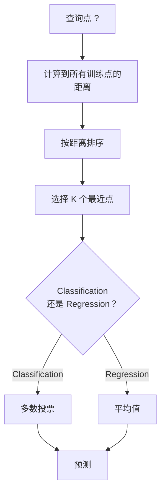
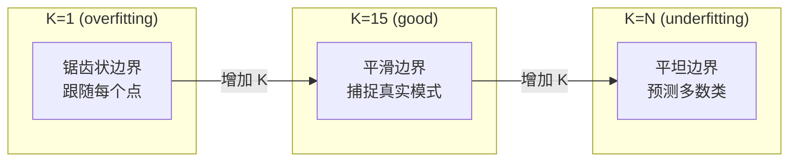
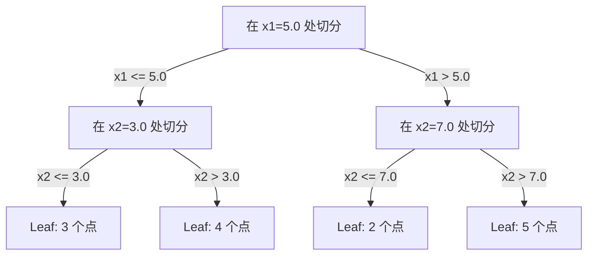

# K-En yakın komşular ve uzaklar

> 保存一切──通过查看你的邻居来预测──这是最简单而真正有效的算法──

**Type:** Build
**Language:**Python
**前置要求：**1. aşama (Distans ve Normalar 14. ders)
**Time:** ~90 分钟

## Öğrenme hedefi
- KNN sınıflandırması ve geri dönüşü, desteklenebilir yapılandırma ve artan oylama hakkı
- L1、L2、cosine 和 Minkowski  mesafe ölçümlerini karşılaştırın, ve belirli veri türüne uygun ölçümleri seçin
- 解释维度灾难,并演示为什么KNN 在高维空间中会退化
- KD ağacını oluşturmak için en yakın komşu arama, ve onu nasıl analiz etmek için sert kuvvetten daha iyi

## 问题
Yeni bir veri noktası var. Bu noktada sınıflandırma yapmanız veya değerini tahmin etmeniz gerekir.

İşte K-en yakın komşularıdır. Bu eğitim aşamasında değildir.

İş gibi basit görünmüyor. Ancak KNN, özellikle de küçük ve orta ölçekli veri kitlesinde birçok sorunda rekabetçi bir şekilde ortaya çıkıyor.

KNN de farklı isimlerle günümüzde AI'nin çeşitli yerlerinde ortaya çıkmaktadır. Vector veritabanları, Embeddings'te bulunur ve KNN aramalarını gerçekleştirir.

## 概念
### KNN' in işleyişi

                                                                                                                                                                                                                                                                                                                                                                                                                                                                                                                             

1.  hesaplama sorgu noktası ile veri merkezi arasındaki mesafe
2. 按距离排序
3. 取最近的 K 个点
4. 对于分类:在 K 个邻居中进行多数投票
5. 对于 Regression:对 K 个邻居的值取平均 (K 个邻居的值取平均)



İşte tam bir algoritma. Hiç bir düzen yok.

### K'yi seçmek

K'nin tek hiperparametri var.

| K | 行为 |
|---|----------|
| K = 1 | 决策边界跟随每一个点。训练误差为零。高方差。Overfits |
| Small K (3-5) | 对局部结构敏感。可以捕捉复杂边界 |
| Large K | 边界更平滑。对噪声更稳健。可能 underfit |
| K = N | 对每个点都预测多数类。最大 bias |

常见起点是对包含 N 个点的数据集使用 K = sqrt(N)。二分类时使用奇数 K,以避免平票──



### Mesafe ölçümleri

距离函数 define what is called 近──不同度量会产生不同的邻居、不同的预测── farklı komşuları oluşur.

**L2 (Euclidean)**Yürüyenler için de bir seçim var.

```
d(a, b) = sqrt(sum((a_i - b_i)^2))
```

Özellik ölçüsüne duyarlılık. L2 ve KNN kullanmak.

**L1 (Manhattan)**L2'ye göre, aşırı değerlere daha fazla direnir çünkü bu, farklılıkların çarpıtı olmayacaktır.

```
d(a, b) = sum(|a_i - b_i|)
```

**Cosine distance**衡量向量 之间的角度,忽略大小──文本和嵌入数据至关重要──

```
d(a, b) = 1 - (a . b) / (||a|| * ||b||)
```

**Minkowski**Use parameters p 泛化 L1 和 L2。

```
d(a, b) = (sum(|a_i - b_i|^p))^(1/p)

p=1: Manhattan
p=2: Euclidean
p->inf: Chebyshev (max absolute difference)
```

Hangi ölçüm kullanılır:

| 数据类型 | 最佳度量 | 原因 |
|-----------|------------|-----|
| 数值特征，尺度相近 | L2 (Euclidean) | 默认选择，适用于空间数据 |
| 数值特征，存在 outliers | L1 (Manhattan) | 稳健，不会放大大差异 |
| Text embeddings | Cosine | 大小是噪声，方向是含义 |
| 高维稀疏 | Cosine 或 L1 | L2 受维度灾难影响严重 |
| 混合类型 | Custom distance | 按特征类型组合度量 |

### Ağır KNN

標準 KNN tüm K 个邻居 给给相同权力――但 0.1 个邻居 应该比 5.0 个邻居更重要――

**Distance-weighted KNN**按距离的倒数为每个邻居加权:

```
weight_i = 1 / (distance_i + epsilon)

For classification: weighted vote
For regression:     weighted average = sum(w_i * y_i) / sum(w_i)
```

Soru noktası ve eğitim noktası tamamen uyumlu olduğunda, epsilon, sıfırdan ayırmayı önleyebilir.

K'nin seçimi için ağır KNN o kadar duyarlı değil, çünkü uzak komşuların nasıl bir katkıda bulunmaları çok küçük.

### 维度灾难

KNN  performansı yüksek seviyede azalır. Bu bir belirsiz kaygı değil, bir matematik gerçektir.

**问题 1：距离会收敛。**Boyut artışıyla en büyük mesafe ile en küçük mesafe oranı 1e yaklaşır.

```
In d dimensions, for random uniform points:

d=2:    max_dist / min_dist = varies widely
d=100:  max_dist / min_dist ~ 1.01
d=1000: max_dist / min_dist ~ 1.001

When all distances are nearly equal, "nearest" is meaningless.
```

**问题 2：体积会爆炸。**Verilerin sabit oranında K'yi komşu olarak yakalamak için, arama yarısını genişletmeniz gerekir, böylece bu özelliklerin büyük bir kısmını kapsayacaktır.

**问题 3：角落占主导。**D 维单位超立方体中, büyük kısmı gövdeden yakın, merkezden uzakta yoğunlaşır.

实际后果:KNN yaklaşık 20-50 个特征内表现良好――超过这个范围后,KNN前应用中需要进行维度减少 (PCA、UMAP、t-SNE),或者使用能利用数据内在低维结构的树基搜索结构――

### KD-Ağaçlar: 快速 en yakın komşu 搜索

Kötü kuvvet KNN, her antrenman noktasının mesafesine kadar soru noktasını hesaplar.

KD- ağaç, bir bölümde bir bölümde bir bölümde bir bölümde bir bölümde bir bölümde bir bölümde bir bölümde bir bölümde bir bölümde bir bölümde bir bölümde bir bölümde bir bölümde bir bölümde bir bölümde bir bölümde bir bölümde bir bölümde bir bölümde bir bölümde bir bölümde bir bölümde bir bölümde bir bölümde bir bölümde bir bölümde bir bölümde bir bölümde bir bölümde bir bölümde bir bölümde bir bölümde bir bölümde bir bölümde bir bölümde bir bölümde bir bölümde bir bölümde bir bölümde bir bölümde bir bölümde bir bölümde bir bölümde bir bölümde bir bölümde bir bölümde bir bölümde bir bölümde bir bölümde bir bölümde bir bölümde bir bölümde bir bölümde bir bölümde bir bölümde bir bölümde bir bölümde bir bölümde bir bölümde bir bölümde bir bölümde bir bölümde bir bölümde bir bölümde bir bölümde bir bölümde bir bölümde bir bölümde bir bölümde bir bölümde bir bölümde bir bölümde bir bölümde bir bölümde bir bölümde bir bölümde bir bölümde bir bölümde bir bölümde bir bölümde bir bölümde bir bölümde bir bölümde bir bölümde bir bölümde bir bölümde bir bölümde bir bölümde bir bölümde bir bölümde bir bölümde bir bölümde bir bölümde bir bölümde bir bölümde bir bölümde bir bölümde bir bölümde bir bölümde bir bölümde bir bölümde bir bölümde bir bölümde bir bölümde bir bölümde bir bölümde bir bölümde bölge bir bölümde bir bölümde bir bölümde bir bölümde bir bölümde bir bölümde bir bölümde bir bölümde bir bölümde bir bölümde bölge bir bölge bir bölge bir bölge bir bölge bir bölge bir bölge bir bölge bir bölge bir bölge bir bölge bir bölge bir bölge bir bölge bir bölge bir bölge bir bölge bir bölge bir bölge bir bölge bir bölge bir bölge bir bölge bir bölge bir bölge bir bölge bir bölge bir bölge bir bölge bir bölge bir bölge bir bölge bir bölge bir bölge bir bölge bir bölge bir bölge bölge bölge bir bölge bölge bir bölge bir bölge bölge bir bölge bir bölge bir bölge bir bölge bir bölge bölge bir bölge böl



为了寻找最近的邻居,先穿过树到包含查询点的叶,然后回归,并且只在相邻分区可能包含更近点时才检查它们――

平均查询时间:低维时为 O(log n) ・・・ ama KD- ağaçları 在高维(d > 20) olarak geri dönüşecektir O(n), çünkü geri dönüşü giderek az olacaktır.

### Top ağaçları: 更适合中等维度

Top ağaçları, her noktayı bir top belirler, merkezi + yarı boyut, bu ağaçtaki tüm noktaları içerir.

KD- ağaçlarına karşı avantajları:
- Orta seviye performans daha iyi ((( en yüksek ~50)
- 能处理非轴对齐结构
- Daha yakın sınır büyüklüğü arama sırasında daha fazla dal kesilebilir anlamına gelir.

KD ağaçları ve top ağaçları çok net bir algoritmadır. Gerçek büyük çaplı arama için, en yakın komşu yöntemini kullanacağız.

### Uşak öğrenme vs. öğrenmek için hevesli

KNN tembel öğrencidir: eğitim sırasında çalışmaz, tüm işler önceden yapılan işlemlerde tamamlanır. Diğer algoritmaların çoğu (lineer regresi, SVM, sinir ağları) öğrenci olmak için heveslidir.

| 方面 | Lazy (KNN) | Eager (SVM, neural net) |
|--------|------------|------------------------|
| 训练时间 | O(1)，只存储数据 | O(n * epochs) |
| 预测时间 | 每次查询 O(n * d) | O(d) 或 O(parameters) |
| 预测时内存 | 存储整个训练集 | 只存储模型参数 |
| 适应新数据 | 立即添加点 | 重新训练模型 |
| 决策边界 | 隐式，在运行时计算 | 显式，训练后固定 |

Uşak öğrenme 适合以下场景:
- Numerolar çok değişir.
- Sadece çok az sorguya ihtiyaç var.
- Senin için zamanı sıfır.
- Çok küçük, kaba güç arama  çok hızlı

### Regresiyon için KNN

KNN Regression Not Making Majority Vote, K 个 komşular için hedef değer ortalama olarak alınmıştır.

```
prediction = (1/K) * sum(y_i for i in K nearest neighbors)

Or with distance weighting:
prediction = sum(w_i * y_i) / sum(w_i)
where w_i = 1 / distance_i
```

KNN Regresyon 产生分段常数预测(使用加权时为分段平滑) ・・・ eğitim verilerinin dışında dışına atılamaz。 Eğer eğitim hedefleri 0 ila 100 arasında olsa, KNN 永远不会预测 200。


```figure
knn-smoothness
```

## Yapın onu.
### 步骤 1: Mesafe fonksiyonları

L1、L2、cosine 和 Minkowski 距离──────────────────────────────────────────────────────────────────────────────────────────────────────────────────────────────────────────────────────────────────────────────────────────────────────────────────────────────────────────────────────────────────────────────────────────────────────────────────────────────────────────────────────────────────────────────────────────────────────────────────────────────────────────────────────────────────────────────────────────────────────────────────────────────────────────────────────────────────────────────────────────────────────────────────────────────────────────────────────────────────────────────────────────────────────────────────────────────────────────────────────────────────────────────────────────────────────────────────────────────────────────────────────────────────────────────────────────────────────────────────────────────────────────────────────────────────────────────────────────────────────────────────────────────

```python
import math

def l2_distance(a, b):
    return math.sqrt(sum((ai - bi) ** 2 for ai, bi in zip(a, b)))

def l1_distance(a, b):
    return sum(abs(ai - bi) for ai, bi in zip(a, b))

def cosine_distance(a, b):
    dot_val = sum(ai * bi for ai, bi in zip(a, b))
    norm_a = math.sqrt(sum(ai ** 2 for ai in a))
    norm_b = math.sqrt(sum(bi ** 2 for bi in b))
    if norm_a == 0 or norm_b == 0:
        return 1.0
    return 1.0 - dot_val / (norm_a * norm_b)

def minkowski_distance(a, b, p=2):
    if p == float('inf'):
        return max(abs(ai - bi) for ai, bi in zip(a, b))
    return sum(abs(ai - bi) ** p for ai, bi in zip(a, b)) ** (1 / p)
```

### 步骤 2: KNN sınıflandırıcısı ve geri dönüşcü

KN'yi tamamlamak, K'ın yapılandırılabilmesi ve seçilebilir mesafe artışı güçleri desteklemek.

```python
class KNN:
    def __init__(self, k=5, distance_fn=l2_distance, weighted=False,
                 task="classification"):
        self.k = k
        self.distance_fn = distance_fn
        self.weighted = weighted
        self.task = task
        self.X_train = None
        self.y_train = None

    def fit(self, X, y):
        self.X_train = X
        self.y_train = y

    def predict(self, X):
        return [self._predict_one(x) for x in X]
```

### 步骤 3: Verimli arama için KD- ağaç

KD ağacı, her boyuttan ortalama sayıya dönüştürülür.

```python
class KDTree:
    def __init__(self, X, indices=None, depth=0):
        # Recursively partition the data
        self.axis = depth % len(X[0])
        # Split on median of the current axis
        ...

    def query(self, point, k=1):
        # Traverse to leaf, then backtrack
        ...
```

完整实现见 `code/knn.py`Bu, tüm yardımcı yöntemleri ve gösterileri içerir.

### 4 adım: Özellik ölçeklendirme

KNN'nin özellik ölçeklendirme ihtiyacı vardır, çünkü özelliklere büyük küçük hassaslıktan dolayı ≠ 0'dan 1000'e kadar ≠ 0'dan 1'e kadar ≠ ≠ ≠ ≠ ≠ ≠ ≠ ≠ ≠ ≠ ≠ ≠ ≠ ≠ ≠ ≠ ≠ ≠ ≠ ≠ ≠ ≠ ≠ ≠ ≠ ≠ ≠ ≠ ≠ ≠ ≠ ≠ ≠ ≠ ≠ ≠ ≠ ∞ ≠ ∞ ∞ ∞ ∞ ∞ ∞ ∞ ∞ ∞ ∞ ∞ ∞ ∞ ∞ ∞ ∞ ∞ ∞ ∞ ∞ ∞ ∞ ∞ ∞ ∞ ∞ ∞ ∞ ∞ ∞ ∞ ∞ ∞ ∞ ∞ ∞ ∞ ∞ ∞ ∞ ∞ ∞ ∞ ∞ ∞ ∞ ∞ ∞ ∞ ∞ ∞ ∞ ∞ ∞ ∞ ∞ ∞ ∞ ∞ ∞ ∞ ∞ ∞ ∞ ∞ ∞ ∞ ∞ ∞ ∞ ∞ ∞ ∞ ∞ ∞ ∞ ∞ ∞ ∞ ∞ ∞ ∞ ∞ ∞ ∞ ∞ ∞ ∞ ∞ ∞ ∞ ∞ ∞ ∞ ∞ ∞ ∞ ∞ ∞ ∞ ∞ ∞ ∞ ∞ ∞ ∞ ∞ ∞ ∞ ∞ ∞ ∞ ∞ ∞ ∞ ∞ ∞ ∞ ∞ ∞ ∞ ∞ ∞ ∞ ∞ ∞ ∞ ∞ ∞ ∞ ∞ ∞ ∞ ∞ ∞ ∞ ∞ ∞ ∞ ∞ ∞ ∞ ∞ ∞ ∞ ∞ ∞ ∞ ∞ ∞ ∞ ∞ ∞ ∞ ∞ ∞ ∞ ∞ ∞ ∞ ∞ ∞  ∞ ∞ ∞  ∞  ∞                                                       

```python
def standardize(X):
    n = len(X)
    d = len(X[0])
    means = [sum(X[i][j] for i in range(n)) / n for j in range(d)]
    stds = [
        max(1e-10, (sum((X[i][j] - means[j]) ** 2 for i in range(n)) / n) ** 0.5)
        for j in range(d)
    ]
    return [[((X[i][j] - means[j]) / stds[j]) for j in range(d)] for i in range(n)], means, stds
```

## Kullan
Sikit-learn kullanın:

```python
from sklearn.neighbors import KNeighborsClassifier
from sklearn.preprocessing import StandardScaler
from sklearn.pipeline import Pipeline

clf = Pipeline([
    ("scaler", StandardScaler()),
    ("knn", KNeighborsClassifier(n_neighbors=5, metric="euclidean")),
])
clf.fit(X_train, y_train)
print(f"Accuracy: {clf.score(X_test, y_test):.4f}")
```

Eğer bir veri kümesi yeterince büyük ve boyut yeterince düşük olduğunda, Scikit-learn otomatik olarak KD ağaçları veya top ağaçları kullanır.`algorithm`Bu noktayı kontrol etmen gerek.

 Büyük boyutlu en yakın komşu arama için ((数百万个矢量), FAISS、Annoy veya Vector veritabanını kullanın:

```python
import faiss

index = faiss.IndexFlatL2(dimension)
index.add(embeddings)
distances, indices = index.search(query_vectors, k=5)
```

## 练习
1. 3 kategori içeren 2D veriler topluluğunda KNN sınıflandırmasını gerçekleştirmek için K=1、K=5、K=15 ve K=N'in karar sınırlarını çizmek için, aşırı uygunluktan düşük uygunluktan değişimleri gözlemlemek için

2. 2、5、10、50、100 和 500 维中生成 1000 随机点──对每个维度计算最大双向距离与最小双向距离的比值──图绘制该比值随维度变化的图图,以可视化维度灾难──

3. Kısayol: Kısayol: Kısayol: Kısayol: Kısayol: Kısayol: Kısayol: Kısayol: Kısayol: Kısayol: Kısayol: Kısayol: Kısayol: Kısayol: Kısayol: Kısayol: Kısayol: Kısayol: Kısayol: Kısayol: Kısayol: Kısayol: Kısayol: Kısayol: Kısayol: Kısayol: Kısayol: Kısayol: Kısayol: Kısayol: Kısayol: Kısayol: Kısayol: Kısayol: Kısayol: Kısayol: Kısayol: Kısayol: Kısayol: Kısayol: Kısayol: Kısayol: Kısayol: Kısayol: Kısayol: Kısayol: Kısayol: Kısayol: Kısayol: Kısayol: Kısayol: Kısayol: Kısayol: Kısayol: Kısayol: Kısayol: Kısayol: Kısayol: Kısayol: Kısayol: Kısayol: Kısayol: Kısayol: Kısayol: Kısayol: Kısayol: Kısayol: Kısayol: Kısayol: Kısayol: Kısayol: Kısayol: Kısayol: Kısayol: Kısayol: Kısayol: Kısayol: Kısayol: Kısayol: Kısayol: Kısayol: Kısayol: Kısayol: Kısayol: Kısayol: Kısayol: Kısayol: Kısayol: Kısayol: Kısayol: Kısayol: Kısayol: Kısayol: Kısayol: Kısayol: Kısayol: Kısayol: Kısayol: Kısayol: Kısayol: Kısayol: Kısayol:

4. KD-Ağaç'ı gerçekleştirmek ve 2D、10D 和 50D'de, 1k、10k 和 100k noktaları için ayrı ayrı olarak ölçüm veri kümesi sorgulama zamanı ve kaba kuvvet karşılaştırması. Hangi boyutta KD-Ağaç daha hızlı kaba kuvvet karşılaştırır?

5. 为 y = sin(x) + noise 构建一个重量KN regressor──将它与K=3、10、30 的重量KN比较──展示加权会产生更平滑的预测,特别是K 较大时──

## 关键术语
| 术语 | 它实际意味着什么 |
|------|----------------------|
| K-nearest neighbors | 一种非参数算法，通过寻找距离查询点最近的 K 个训练点来预测 |
| Lazy learning | 训练时不进行计算。所有工作都发生在预测时。KNN 是典型例子 |
| Eager learning | 训练时进行大量计算以构建紧凑模型。大多数 ML 算法都是 eager |
| Curse of dimensionality | 在高维中，距离会收敛，neighborhoods 会扩展到覆盖空间的大部分，使 KNN 失效 |
| KD-tree | 沿特征轴递归划分空间的二叉树。在低维中查询为 O(log n) |
| Ball tree | 嵌套超球体构成的树。在中等维度（最高约 ~50）中比 KD-trees 表现更好 |
| Weighted KNN | neighbors 按距离倒数加权。更近的 neighbors 对预测影响更大 |
| Feature scaling | 将特征归一化到可比较范围。KNN 等基于距离的方法需要它 |
| Majority vote | 通过统计 K 个 neighbors 中哪个类别最常见来进行 Classification |
| Brute force search | 计算到每个训练点的距离。每次查询 O(n*d)。精确但在大 n 时很慢 |
| Approximate nearest neighbor | 能比精确搜索快得多地找到近似最近点的算法（HNSW、LSH、IVF） |
| Voronoi diagram | 一种空间划分，其中每个区域包含所有比任何其他训练点都更接近某个训练点的点。K=1 KNN 会产生 Voronoi 边界 |

## 延伸阅读
- [Cover & Hart: Nearest Neighbor Pattern Classification (1967)](https://ieeexplore.ieee.org/document/1053964)- 奠基性的 KNN 论文, kanıtlamak için hata oranı en iyisini iki katına kadar Bayes için
- [Friedman, Bentley, Finkel: An Algorithm for Finding Best Matches in Logarithmic Expected Time (1977)](https://dl.acm.org/doi/10.1145/355744.355745)- 原始 KD-tree 论文
- [Beyer et al.: When Is "Nearest Neighbor" Meaningful? (1999)](https://link.springer.com/chapter/10.1007/3-540-49257-7_15)- en yakın komşu 维度灾难的形式化分析
- [scikit-learn Nearest Neighbors documentation](https://scikit-learn.org/stable/modules/neighbors.html)- 包含算法选择的实践指南
- [FAISS: A Library for Efficient Similarity Search](https://github.com/facebookresearch/faiss)- Meta , en yakın komşu aramasında milyarlarca sınıfı kullanıyor .
