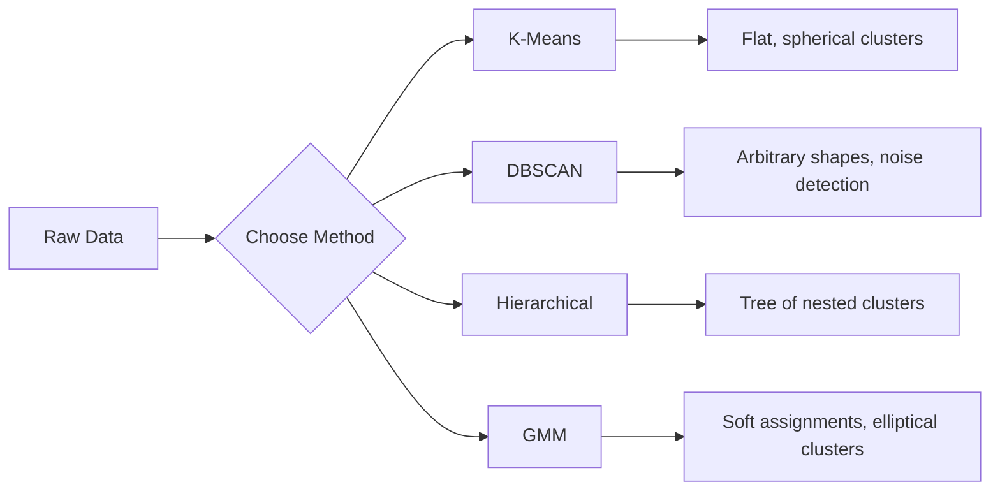

# Denetimsiz Öğrenme

> 没有标签,没有老师──算法自发发现结构──

**类型:**Yapım
**语言:**Python
**前置条件:**1. aşama: Normalar ve mesafeler, olasılık ve dağılımlar, 2. aşama: 1-6 ders
**时间:**~ 90 dakika

## Öğrenme hedefi

- K-Yöntemleri、DBSCAN ve Gaussian Karışıklık Modellerini gerçekleştirmek ve onları gruplama davranışlarıyla karşılaştırmak
- Siluet puanı kullan 和 elleboğu yöntemi  değerlendirme kümesi 质量,并选择最优 K
- 解释 DBSCAN 何時優于 K-Means,并识别哪种算法能处理非球形群 和外形
- Kullanım: Normal modundan uzak noktaları işaretlemek için anomali tespit borusunu oluşturmak için gruplama yöntemleri

## 问题

Şimdiye kadar, her bölümde veriler ile etiketlenmiş olduğu varsayılıyordu: Bu giriş, bu doğru çıkıştı. Gerçek dünyada, etiketlenme maliyeti çok yüksektir. Hastanelerde milyonlarca hasta kaydı var, ama hiçbir insan elini kullanarak hastalık sınıflarını işaretleyen her bir kayıtı vermiyor.

Denetimsiz Öğrenme, ne aramak için bilinmeyen bir durumda bir model bulur. Aynı şekilde, benzer veri noktalarını ayırır, gizli yapıları bulur ve anormallikleri ortaya çıkarır. Eğer denetimsiz öğrenme, öğretim malzemelerinden cevaplarla öğrenilmiş gibiyse, denetimsiz öğrenme, modelin kendini ortaya çıkana kadar orijinal verilere bakarak gerçekleşir.

Sorun şu: Etiket yok, doğrudan ölçemezsiniz. Algoritmanın bulduğu yapıların anlamlı olup olmadığını değerlendirmek için farklı araçlara ihtiyacınız var.

## 核心概念

### Gruplama: birbirine benzer şeyleri ayırıp bir araya getirmek

Gruplama, her veri noktasını bir gruba ayırır, böylece aynı grubu içindeki noktaların diğer grubu içindeki noktalara kıyasla birbirine daha çok benzerliği olur.



### K-Means:常用主力方法

K-Böylece, verileri K 个群 olarak bölmüştür. Her bir kümenin bir merkez noktası vardır.

Lloyd'un algoritması:

1. 随机选择 K 个点作为初始中心点
2. Her veri noktasını en yakın merkezine dağıt
3. Her merkez bölgeyi yeniden hesaplamak için dağıtım noktasının ortalama değerini
4. 重复步骤 2-3, dağıtım sonucu değişmezken

目標函数 (inert) her noktayı kendisine ait merkezde toplam kare mesafeyi ölçmek K-Böylelikle bu değerleri en aza indirmek, ancak sadece yerel en az değerleri bulabilmek mümkündür.

### 选择 K

两种标准方法:

**Elbow method：**K = 1, 2, 3, ..., n 运行 K-Means── çizim inersiyası K'ın ilişkisi ile ilişki çizim── arama elbow,也就是继续增加 时集群 时 inertia 不再显著下降的位置──

**Silhouette score：**Her noktaya göre, kendi kümesinin benzerliği ölçmek için a) yakın diğer kümelere göre b) nasıl; silhouette koeficientleri 为 (b - a) / max (a, b), -1 (分错) kümesinden +1 (分错) kümesine kadar;

### DBSCAN: yoğunluk tabanlı gruplama

K-Böylece 假设群 是球形的,并要求你先选择 K──DBSCAN Bu iki假设群ı yapmaz──bu, 聚星群ı 稀疏区域分开的密区群 olarak bulur.

İki parametre:
- **eps**: 邻域半径
- **min_samples**: 密区形成所需的最小点数

Üç sınıf:
- **Core point**: eps                                                                                                                                                                                                                                                                                                                                                                                                                                                                                                                           
- **Border point**Bir noktayı bulur ama kendisi bir noktayı değil.
- **Noise point**Ne bir temel nokta ne de bir sınır noktası.

DBSCAN, birbirini eps'in kapsamındaki çekirdek noktasına yerleştirir.

优点:能发现任意形的集群,自动确定集群 数量,识别outlier──弱点:难以处理密度差较大的集群──

### Yerarşik Gruplama

构建嵌套 cluster 的树(dendrogram) ⋅

Agglomeratif ((自底向上):
1. Her noktayı kendi grupları oluşturur.
2. 合并两个最近的集群
3. Tekrar tekrar, tek bir küme kalana kadar
4. Bir grup k'den oluşur.

Kluster arasındaki  yakınlık derecesi  şöyle ölçülebilir:
- **Single linkage**İki küme arasındaki en küçük mesafe:
- **Complete linkage**: herhangi iki nokta arasındaki en büyük mesafe
- **Average linkage**Tüm noktalar arasındaki ortalama mesafe
- **Ward's method**: Cluster içi toplam farkı en az birleşme biçimini arttırmaya neden olur

### Gaussian Karışıklık Modelleri (GMM)

K-Yöntem                                                                                                                                                                                                                                                                                                                                                                                                                                                                                                                         

GMM 假设数据由K 个高斯分布的混合生成,每个分布都有自己的平均值和共差性──期望最大化 (EM) algoritması 在以下两步之间交换:

- **E-step**: hesap her noktayı her Gaussian'ın olasılığı
- **M-step**Her Gaussian'ın ortalama değerleri, kovariansa ve karışım ağırlığı, verilerin olasılıklarını en üst düzeye çıkarmak için güncellenir.

GMM sadece K-Beyne o tip top şekli değil, aynı zamanda doğal olarak birbiriyle takılı bir kümesi oluşturur.

### Hangi zaman kullanılır

| Method | Best for | Avoid when |
|--------|----------|------------|
| K-Means | 大型数据集、球形 cluster、已知 K | 形状不规则、存在 outlier |
| DBSCAN | K 未知、任意形状、outlier detection | 密度差异大、维度非常高 |
| Hierarchical | 小型数据集、需要 dendrogram、K 未知 | 大型数据集（O(n^2) memory） |
| GMM | 重叠 cluster、需要软分配 | 非常大的数据集、维度过多 |

### Cluster kullanmak Anomaly Deteksiyon

Clustering 天然支持 anomali tespit:
- **K-Means**Herhangi bir merkezden uzak bir noktaya göre anormal.
- **DBSCAN**Define göre, gürültü noktası anormallik.
- **GMM**Gaussian'da düşük olasılıkla anormal bir nokta var .


```figure
kmeans-step
```

## Yapın onu.

### 步骤 1: K-Means'ı baştan başta gerçekleştirmek

```python
import math
import random


def euclidean_distance(a, b):
    return math.sqrt(sum((ai - bi) ** 2 for ai, bi in zip(a, b)))


def kmeans(data, k, max_iterations=100, seed=42):
    random.seed(seed)
    n_features = len(data[0])

    centroids = random.sample(data, k)

    for iteration in range(max_iterations):
        clusters = [[] for _ in range(k)]
        assignments = []

        for point in data:
            distances = [euclidean_distance(point, c) for c in centroids]
            nearest = distances.index(min(distances))
            clusters[nearest].append(point)
            assignments.append(nearest)

        new_centroids = []
        for cluster in clusters:
            if len(cluster) == 0:
                new_centroids.append(random.choice(data))
                continue
            centroid = [
                sum(point[j] for point in cluster) / len(cluster)
                for j in range(n_features)
            ]
            new_centroids.append(centroid)

        if all(
            euclidean_distance(old, new) < 1e-6
            for old, new in zip(centroids, new_centroids)
        ):
            print(f"  Converged at iteration {iteration + 1}")
            break

        centroids = new_centroids

    return assignments, centroids
```

### 步骤 2: Elbow metodu 和 siluet skor

```python
def compute_inertia(data, assignments, centroids):
    total = 0.0
    for point, cluster_id in zip(data, assignments):
        total += euclidean_distance(point, centroids[cluster_id]) ** 2
    return total


def silhouette_score(data, assignments):
    n = len(data)
    if n < 2:
        return 0.0

    clusters = {}
    for i, c in enumerate(assignments):
        clusters.setdefault(c, []).append(i)

    if len(clusters) < 2:
        return 0.0

    scores = []
    for i in range(n):
        own_cluster = assignments[i]
        own_members = [j for j in clusters[own_cluster] if j != i]

        if len(own_members) == 0:
            scores.append(0.0)
            continue

        a = sum(euclidean_distance(data[i], data[j]) for j in own_members) / len(own_members)

        b = float("inf")
        for cluster_id, members in clusters.items():
            if cluster_id == own_cluster:
                continue
            avg_dist = sum(euclidean_distance(data[i], data[j]) for j in members) / len(members)
            b = min(b, avg_dist)

        if max(a, b) == 0:
            scores.append(0.0)
        else:
            scores.append((b - a) / max(a, b))

    return sum(scores) / len(scores)


def find_best_k(data, max_k=10):
    print("Elbow method:")
    inertias = []
    for k in range(1, max_k + 1):
        assignments, centroids = kmeans(data, k)
        inertia = compute_inertia(data, assignments, centroids)
        inertias.append(inertia)
        print(f"  K={k}: inertia={inertia:.2f}")

    print("\nSilhouette scores:")
    for k in range(2, max_k + 1):
        assignments, centroids = kmeans(data, k)
        score = silhouette_score(data, assignments)
        print(f"  K={k}: silhouette={score:.4f}")

    return inertias
```

### 步骤 3: DBSCAN'ı baştan başta gerçekleştirmek

```python
def dbscan(data, eps, min_samples):
    n = len(data)
    labels = [-1] * n
    cluster_id = 0

    def region_query(point_idx):
        neighbors = []
        for i in range(n):
            if euclidean_distance(data[point_idx], data[i]) <= eps:
                neighbors.append(i)
        return neighbors

    visited = [False] * n

    for i in range(n):
        if visited[i]:
            continue
        visited[i] = True

        neighbors = region_query(i)

        if len(neighbors) < min_samples:
            labels[i] = -1
            continue

        labels[i] = cluster_id
        seed_set = list(neighbors)
        seed_set.remove(i)

        j = 0
        while j < len(seed_set):
            q = seed_set[j]

            if not visited[q]:
                visited[q] = True
                q_neighbors = region_query(q)
                if len(q_neighbors) >= min_samples:
                    for nb in q_neighbors:
                        if nb not in seed_set:
                            seed_set.append(nb)

            if labels[q] == -1:
                labels[q] = cluster_id

            j += 1

        cluster_id += 1

    return labels
```

### 步骤 4:Gaussian Karışıklık Model(EM algoritması)

```python
def gmm(data, k, max_iterations=100, seed=42):
    random.seed(seed)
    n = len(data)
    d = len(data[0])

    indices = random.sample(range(n), k)
    means = [list(data[i]) for i in indices]
    variances = [1.0] * k
    weights = [1.0 / k] * k

    def gaussian_pdf(x, mean, variance):
        d = len(x)
        coeff = 1.0 / ((2 * math.pi * variance) ** (d / 2))
        exponent = -sum((xi - mi) ** 2 for xi, mi in zip(x, mean)) / (2 * variance)
        return coeff * math.exp(max(exponent, -500))

    for iteration in range(max_iterations):
        responsibilities = []
        for i in range(n):
            probs = []
            for j in range(k):
                probs.append(weights[j] * gaussian_pdf(data[i], means[j], variances[j]))
            total = sum(probs)
            if total == 0:
                total = 1e-300
            responsibilities.append([p / total for p in probs])

        old_means = [list(m) for m in means]

        for j in range(k):
            r_sum = sum(responsibilities[i][j] for i in range(n))
            if r_sum < 1e-10:
                continue

            weights[j] = r_sum / n

            for dim in range(d):
                means[j][dim] = sum(
                    responsibilities[i][j] * data[i][dim] for i in range(n)
                ) / r_sum

            variances[j] = sum(
                responsibilities[i][j]
                * sum((data[i][dim] - means[j][dim]) ** 2 for dim in range(d))
                for i in range(n)
            ) / (r_sum * d)
            variances[j] = max(variances[j], 1e-6)

        shift = sum(
            euclidean_distance(old_means[j], means[j]) for j in range(k)
        )
        if shift < 1e-6:
            print(f"  GMM converged at iteration {iteration + 1}")
            break

    assignments = []
    for i in range(n):
        assignments.append(responsibilities[i].index(max(responsibilities[i])))

    return assignments, means, weights, responsibilities
```

### Adım 5: Test verileri oluşturmak ve tüm içeriği yürütmek

```python
def make_blobs(centers, n_per_cluster=50, spread=0.5, seed=42):
    random.seed(seed)
    data = []
    true_labels = []
    for label, (cx, cy) in enumerate(centers):
        for _ in range(n_per_cluster):
            x = cx + random.gauss(0, spread)
            y = cy + random.gauss(0, spread)
            data.append([x, y])
            true_labels.append(label)
    return data, true_labels


def make_moons(n_samples=200, noise=0.1, seed=42):
    random.seed(seed)
    data = []
    labels = []
    n_half = n_samples // 2
    for i in range(n_half):
        angle = math.pi * i / n_half
        x = math.cos(angle) + random.gauss(0, noise)
        y = math.sin(angle) + random.gauss(0, noise)
        data.append([x, y])
        labels.append(0)
    for i in range(n_half):
        angle = math.pi * i / n_half
        x = 1 - math.cos(angle) + random.gauss(0, noise)
        y = 1 - math.sin(angle) - 0.5 + random.gauss(0, noise)
        data.append([x, y])
        labels.append(1)
    return data, labels


if __name__ == "__main__":
    centers = [[2, 2], [8, 3], [5, 8]]
    data, true_labels = make_blobs(centers, n_per_cluster=50, spread=0.8)

    print("=== K-Means on 3 blobs ===")
    assignments, centroids = kmeans(data, k=3)
    print(f"  Centroids: {[[round(c, 2) for c in cent] for cent in centroids]}")
    sil = silhouette_score(data, assignments)
    print(f"  Silhouette score: {sil:.4f}")

    print("\n=== Elbow Method ===")
    find_best_k(data, max_k=6)

    print("\n=== DBSCAN on 3 blobs ===")
    db_labels = dbscan(data, eps=1.5, min_samples=5)
    n_clusters = len(set(db_labels) - {-1})
    n_noise = db_labels.count(-1)
    print(f"  Found {n_clusters} clusters, {n_noise} noise points")

    print("\n=== GMM on 3 blobs ===")
    gmm_assignments, gmm_means, gmm_weights, _ = gmm(data, k=3)
    print(f"  Means: {[[round(m, 2) for m in mean] for mean in gmm_means]}")
    print(f"  Weights: {[round(w, 3) for w in gmm_weights]}")
    gmm_sil = silhouette_score(data, gmm_assignments)
    print(f"  Silhouette score: {gmm_sil:.4f}")

    print("\n=== DBSCAN on moons (non-spherical clusters) ===")
    moon_data, moon_labels = make_moons(n_samples=200, noise=0.1)
    moon_db = dbscan(moon_data, eps=0.3, min_samples=5)
    n_moon_clusters = len(set(moon_db) - {-1})
    n_moon_noise = moon_db.count(-1)
    print(f"  Found {n_moon_clusters} clusters, {n_moon_noise} noise points")

    print("\n=== K-Means on moons (will fail to separate) ===")
    moon_km, moon_centroids = kmeans(moon_data, k=2)
    moon_sil = silhouette_score(moon_data, moon_km)
    print(f"  Silhouette score: {moon_sil:.4f}")
    print("  K-Means splits moons poorly because they are not spherical")

    print("\n=== Anomaly detection with DBSCAN ===")
    anomaly_data = list(data)
    anomaly_data.append([20.0, 20.0])
    anomaly_data.append([-5.0, -5.0])
    anomaly_data.append([15.0, 0.0])
    anomaly_labels = dbscan(anomaly_data, eps=1.5, min_samples=5)
    anomalies = [
        anomaly_data[i]
        for i in range(len(anomaly_labels))
        if anomaly_labels[i] == -1
    ]
    print(f"  Detected {len(anomalies)} anomalies")
    for a in anomalies[-3:]:
        print(f"    Point {[round(v, 2) for v in a]}")
```

## Kullan

Sikit-learn kullanın, aynı algoritma bir şekilde tamamlanabilir:

```python
from sklearn.cluster import KMeans, DBSCAN, AgglomerativeClustering
from sklearn.mixture import GaussianMixture
from sklearn.metrics import silhouette_score as sklearn_silhouette

km = KMeans(n_clusters=3, random_state=42).fit(data)
db = DBSCAN(eps=1.5, min_samples=5).fit(data)
agg = AgglomerativeClustering(n_clusters=3).fit(data)
gmm_model = GaussianMixture(n_components=3, random_state=42).fit(data)
```

K-Yöntemleri arasında 代︎ DBSCAN 密种子 开始扩展集群──GMM 期望和最大化 之间交换──库版会增加数值稳定性、更智能的初始化──K-Yöntemleri++) ve GPU 快速,但核心逻辑相同──

## - Söyle.

Bu ders, K-Means、DBSCAN 和 GMM¬'den elde edilen bir uygulamadan oluşmaktadır.

## 练习

1. 实现 K-Means++ başlangıç: önce ilk merkez bölgeyi seçerek, önce ilk merkez bölgeyi seçerek, sonra her merkez bölgeyi en yakın bir merkez bölgeye ait olan çeyreğin çarpımasıyla karşılaştırmak için seçilir.
2. 向代码中加入階層的集積集積化──实现 Ward's linkage,并生成 dendrogram──作为合并的嵌套列表──在不同层级切分它,并与K-Means 结果比较──
3. DBSCAN ve GMM'de aynı veriler üzerinde çalışarak, işaretlenen iki yöntemin de dışa giden nokta olarak kabul edildiği belirtilmiştir.

## 关键术语

| Term | What people say | What it actually means |
|------|----------------|----------------------|
| Clustering | “把相似的事物分组” | 将数据划分为若干子集，使组内相似度高于组间相似度，并由特定距离度量来衡量 |
| Centroid | “cluster 的中心” | 分配给某个 cluster 的所有点的均值；K-Means 将其用作 cluster 的代表 |
| Inertia | “cluster 有多紧凑” | 每个点到其所属 centroid 的平方距离之和；越低表示越紧凑 |
| Silhouette score | “cluster 分离得有多好” | 对每个点计算 (b - a) / max(a, b)，其中 a 是平均 cluster 内距离，b 是最近 cluster 的平均距离 |
| Core point | “稠密区域中的点” | 在 DBSCAN 中，eps 距离内至少有 min_samples 个邻居的点 |
| EM algorithm | “软 K-Means” | Expectation-Maximization：迭代计算成员概率（E-step）并更新 distribution 参数（M-step） |
| Dendrogram | “cluster 的树” | 一种树状图，展示 hierarchical clustering 中 cluster 被合并的顺序以及合并时的距离 |
| Anomaly | “一个 outlier” | 不符合预期模式的数据点，在 DBSCAN 中被识别为 noise，或在 GMM 中被识别为低概率点 |

## 延伸阅读

- [Stanford CS229 - Unsupervised Learning](https://cs229.stanford.edu/notes2022fall/main_notes.pdf)- Andrew Ng  Clustering ve EM hakkında ders notları
- [scikit-learn Clustering Guide](https://scikit-learn.org/stable/modules/clustering.html)- Tüm Gruplama Algoritmelerinin pratik karşılaştırmalarına göre, görülebilir örnekler de bulunmaktadır
- [DBSCAN original paper (Ester et al., 1996)](https://www.aaai.org/Papers/KDD/1996/KDD96-037.pdf)-  densite tabanlı gruplama ̆ ̆ ̆ ̆ ̆ ̆ ̆ ̆ ̆ ̆ ̆ ̆ ̆ ̆ ̆ ̆ ̆ ̆ ̆ ̆ ̆ ̆ ̆ ̆ ̆ ̆ ̆ ̆ ̆ ̆ ̆ ̆ ̆ ̆ ̆ ̆ ̆ ̆ ̆ ̆ ̆ ̆ ̆ ̆ ̆ ̆ ̆ ̆ ̆ ̆ ̆ ̆ ̆ ̆ ̆ ̆ ̆ ̆ ̆ ̆ ̆ ̆ ̆ ̆ ̆ ̆ ̆ ̆ ̆ ̆ ̆ ̆ ̆ ̆ ̆ ̆ ̆ ̆ ̆ ̆ ̆ ̆ ̆ ̆ ̆ ̆ ̆ ̆ ̆ ̆ ̆ ̆ ̆ ̆ ̆ ̆ ̆ ̆ ̆ ̆ ̆ ̆ ̆ ̆ ̆ ̆ ̆ ̆ ̆ ̆ ̆ ̆ ̆ ̆ ̆ ̆ ̆ ̆ ̆ ̆ ̆ ̆ ̆ ̆ ̆ ̆ ̆ ̆ ̆ ̆ ̆ ̆ ̆ ̆ ̆ ̆ ̆ ̆ ̆ ̆ ̆ ̆ ̆ ̆ ̆ ̆ ̆ ̆ ̆ ̆ ̆ ̆ ̆ ̆ ̆ ̆ ̆ ̆ ̆ ̆ ̆ ̆ ̆ ̆ ̆ ̆ ̆ ̆ ̆                                                                                                                                                                    
