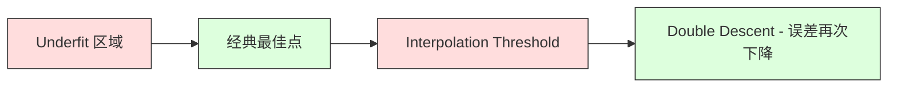
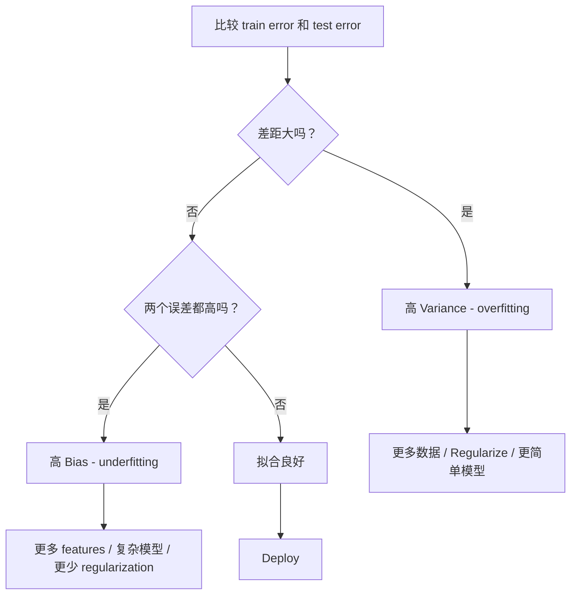
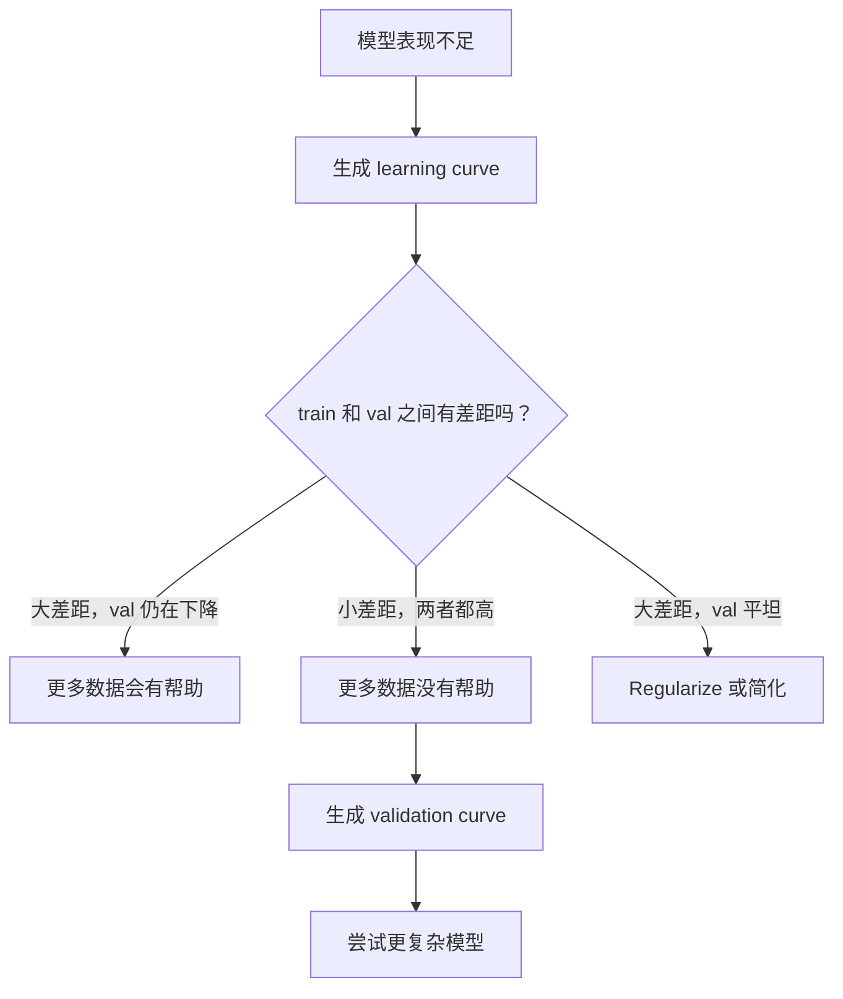

# Taraflı Çeşitlilik Ticaret

> Her model hatası üç kaynağın birinden gelir: Taraflar, Çeşitlilik veya Ses.

**Type:** Learn
**Language:**Python
**Prerequisites:** Phase 2, Lessons 01-09（ML 基础、Regression、Classification、评估）
**Time:** ~75 分钟

## Öğrenme hedefi
- 推导期望预测 误差的偏差-变异 分解,并解释不可约噪音的作用
- Uses training error and test error mode Diagnosis modelinin yüksek önyargı veya yüksek değişim olup olmadığını
- 解释 技术(L1、L2、dropout、early stopping) nasıl kullanılır
- 实现实验,可视化不同复杂性模型上偏差-变量交易

## 问题
Bir model eğitmişsin. Test verilerinde bir hata var. Bu hata nereden geliyor?

Eğer modeliniz çok basitse (örneğin, 曲数据集larında lineer regresyon kullanırsa), gerçek modelin yanlışı devam eder. Bu, Bayas'ın bir parçasıdır. Eğer modeliniz çok karmaşıksa (örneğin, 15 个数据点上使用度-20多项), mükemmel bir şekilde uyumlu hale gelir.

Sistemsel model kapasitesi için, bunları aynı anda en aza indiremezsiniz. Biaz, Varians, Varians, Variance, Variance, Variance, Variance, Variance, Variance, Variance, Variance, Variance, Variance, Variance, Variance, Variance, Variance, Variance, Variance, Variance, Variance, Variance, Variance, Variance, Variance, Variance, Variance, Variance, Variance, Variance, Variance, Variance, Variance, Variance, Variance, Variance, Variance, Variance, Variance, Variance, Variance, Variance, Variance, Variance, Variance, Variance, Variance, Variance, Variance, Variance, Variance, Variance, Variance, Variance, Variance, Variance, Variance, Variance, Variance, Variance, Variance, Variance, Variance, Variance, Variance, Variance, Variance, Variance, Variance, Variance, Variance, Variance, Variance, Variance, Variance, Variance, Variance, Variance, Variance, Variance, Variance, Variance, Variance, Variance, Variance, Variance, Variance, Variance, Variance, Variance, Variance, Variance, Variance, Variance, Variance, Variance, Variance, Variance, Variance, Variance, Variance, Variance, Variance, Variance, Variance, Variance, Variance, Variance, Variance, Variance, Variance, Variance, Variance, Variance, Variance, Variance, Variance, Variance, Variance, Variance, Variance, Variance, Variance, Variance, Variance, Variance, Variance, Variance, Variance, Variance, Variance, Variance, Variance, Variance, Variance, Variance, Variance, Variance, Variance, Variance, Variance, Variance, Variance, Variance, Variance, Variance, Variance, Variance, Variance, Variance, Variance, Variance, Variance, Variance, Variance, Variance, Variance, Variance, Variance, Variance, Variance, Variance, Variance

## 概念
### Tarafsızlık: 系统性误差

Tarafsızlık ölçümü, model ortalama tahmin ile gerçek değer arasındaki ayrım derecesidir. Eğer aynı dağılımdan gelen birçok farklı eğitim kitlesinde aynı model üzerinde çalışıyorsanız, ve tahmin ortalaması için ölçüyorsanız, Tarafsızlık, bu ortalama değer ile gerçek değer arasındaki farkdır.

Yüksek Taraflılık, modelin çok sert olduğunu, gerçek modelleri yakalayamıyor demektir.

```
高 Bias（underfitting）：
  模型总是预测大致相同的错误结果。
  训练误差：高
  测试误差：高
  二者差距：小
```

### Varians: Eğitim verilerine karşı hassaslık

Varians ölçümü, farklı veri kümelerinde eğitim aldığınızda, tahminlerin değişmesi ne kadar büyüktür.

Yüksek Varians, modelin alt sinyal değil, uygun antrenman verilerindeki gürültü anlamına gelir. 20 derece polinom her antrenman noktasını geçecek, ancak bunlar arasında şiddetli dalga geçecek.

```
高 Variance（overfitting）：
  模型完美拟合训练数据，但在新数据上失败。
  训练误差：低
  测试误差：高
  二者差距：大
```

### Çürümesi

任意点 x,平方损失下期望预测误差 için doğru olarak şöyle ayrıştırılabilir:

```
Expected Error = Bias^2 + Variance + Irreducible Noise

where:
  Bias^2   = (E[f_hat(x)] - f(x))^2
  Variance = E[(f_hat(x) - E[f_hat(x)])^2]
  Noise    = E[(y - f(x))^2]             (sigma^2)
```

- `f(x)`Evet gerçek bir işlevi
- `f_hat(x)`Yaptı mı?
- `E[...]`Farklı eğitim gruplarının beklentileri
- `y`Evet, bu da bir şey.

噪音项是不可约的──在有噪音数据上,没有模型能比 sigma^2做得更好──你的任务是在偏见^2 和变异之间找到正确平衡──

### Modelleştirilmişlik vs Hata


Klasik U 形曲线:

| Complexity | Bias | Variance | Total Error |
|-----------|------|----------|-------------|
| 过低 | 高 | 低 | 高（underfitting） |
| 刚刚好 | 中等 | 中等 | 最低 |
| 过高 | 低 | 高 | 高（overfitting） |

### 作为偏差变化 控制的规范化

Düzenleme, farkı azaltmak için önyargıyı artırmak için düzenleme yapar.

- **L2 (Ridge):**Ekipmanlık hakkını yeniden sıfırdan küçültmek, tüm özellikleri korumak, ancak etkilerini azaltmak.
- **L1 (Lasso):**Bazı özellikleri seçiyor.
- **Dropout:**Eğitim sırasında sinir hücrelerini kapatmak gerekmektedir.
- **Early stopping:**Bu eğitimden önce eğitimden vazgeçmek gerekir.

Düzenleme 强度(lambda、drop rate、epoch 数) will directly control you in Bias-Variance 曲线上的位置──更多 Düzenleme daha fazla 偏差、更少变差── anlamına gelir.

### Çift İndir: 现代视角

经典理论认为: best point after, more complexity is always harmful── ancak 2019 yılından bu yana yapılan araştırmalar beklenmedik bir fenomen göstermiştir── eğer model kapasitesini uzaktan uzanan interpolasyon eşiğine kadar artırmaya devam ederseniz, modelin yeterli parametre olması için mükemmel bir şekilde uyum sağlayabilir eğitim verisi konumunda), test hataları tekrar düşebilir──



Bu "ikili düşüş" fenomeni neden büyük çapta aşırı parametreli sinir ağlarının (parametre sayısı eğitim örneğinden çok fazla) hala iyi genel hale gelebileceğini açıklıyor.

关于双下降的关键观察:
- Düzsel modeller, karar ağaçları ve sinir ağları içinde ortaya çıkar.
- 区域, daha fazla veri aslında zararlı olabilir
- 更多训练时代 也可能导致它(epoch-wise double descent)
- Düzenleme, bir en yüksek seviyeye ulaşır ama onu ortadan kaldırmaz.

Bu durum neden gerçekleşir? Interpolasyon eşiğinde, model sadece yeterli kapasiteye sahip tüm antrenman noktalarına uygun bir çözüme girmek zorunda kalır. Bu çözüme her noktada, verideki küçük rahatsızlıklar, uyumluğun devasa değişimine yol açar. Burada varyasyon ırkınlık konumuna ulaşır. Bu eşiğin ötesinde, modelde mükemmel uyumlu veriye sahip olabilecek birçok olası çözüm vardır. Öğrenme algoritması (örneğin, içinden en basit olanı seçmek için eğiliyor). Bu tür basit çözüme yönlü bir kısıtlama, aşırı parametreli modellerin ırkını genel hale getirebilmesinin bir nedeni.

| Regime | Parameters vs Samples | Behavior |
|--------|----------------------|----------|
| Underparameterized | p << n | 经典 tradeoff 适用 |
| Interpolation threshold | p ~ n | Variance 达到峰值，测试误差激增 |
| Overparameterized | p >> n | Implicit regularization 开始起作用，测试误差下降 |

Praktiği bakış açısından: Eğer Nöral Ağlar veya büyük ağaç ensembleri kullanıyorsanız, interpolasyon eşiğinde durmayın.

### Modelinizi Tanımayın



| Symptom | Diagnosis | Fix |
|---------|-----------|-----|
| 高 train error，高 test error | Bias | 更多 features、复杂模型、更少 regularization |
| 低 train error，高 test error | Variance | 更多数据、regularization、更简单模型、dropout |
| 低 train error，低 test error | 拟合良好 | Ship it |
| Train error 下降，test error 上升 | Overfitting 正在发生 | Early stopping |

### Uygulanabilir Stratejler

**当 Bias 是问题时：**
- 添加 çoklu veya etkileşim özellikleri
- Daha kolay kullanılır modelleri (örneğin ağaç ansamblını kullanır)
- 降低 düzenleme gücü
- 訓練更久 (Yokken henüz alınmamışsa)

**当 Variance 是问题时：**
- Get more training data
- kullanmakla birlikte
- 增加 regularisation ((更高 lambda、更多 dropup)
- Özellik seçimi (şirkin ses özelliklerini kaldırmak)
- Çarpıştırma kullanın.

### Toplama Metodları 和方差降低

Birleştirme yöntemleri, Varians'a karşı en pratik araçtır.

**Bagging (Bootstrap Aggregating)**Üretim verilerinin farklı başlangıç örnekleri üzerinde bir çok model eğitilmiştir, sonra tahmin ortalaması alınmıştır.

Matematik olarak etkili olmasının nedeni şudur: Eğer ortalama N 个独立预测, her bir预测'in değişimi sigma^2'dirse, ortalama değer değişimi sigma^2/N'dir. Bu modeller gerçekten bağımsız değildir.

**Boosting**                                                                                                                                                                                                                                                              

| Method | Primary Effect | Bias Change | Variance Change |
|--------|---------------|-------------|-----------------|
| Bagging | 降低 Variance | 不变 | 降低 |
| Boosting | 降低 Bias | 降低 | 可能增加 |
| Stacking | 同时降低两者 | 取决于 meta-learner | 取决于 base models |
| Dropout | Implicit bagging | 略微增加 | 降低 |

**实践规则：**Eğer temel modeliniz varsa yüksek Varians ((Dünya ağaçları、 Yüksek dereceli polinomlar), kullanın paketleme。 Eğer temel modeliniz varsa yüksek önyargılar✔Dünya saplar、 basit doğrusal modeller), kullanın güçlendirme。

### Öğrenme Kurbalıkları

Öğrenme eğrilikleri, eğitim hataları ve doğrulama hataları, eğitim kümesi büyüklükteki işlevler için çizilmiştir. Bunlar sahip olduğunuz en pratik teşhis araçlarıdır. Tek tren/test karşılaştırmasından farklı olarak, öğrenme eğrilikleri, modelin rotasını gösterecek ve daha fazla verinin yardımcı olup olmadığını size söyleyecektir.


Nasıl okuyacağımı?

| Scenario | Training Error | Validation Error | Gap | What It Means | What to Do |
|----------|---------------|-----------------|-----|---------------|------------|
| 高 Bias | 高 | 高 | 小 | 模型无法捕捉模式 | 更多 features、复杂模型、更少 regularization |
| 高 Variance | 低 | 高 | 大 | 模型记忆训练数据 | 更多数据、regularization、更简单模型 |
| 拟合良好 | 中等 | 中等 | 小 | 模型 generalizes well | Ship it |
| 高 Variance，正在改善 | 低 | 随更多数据下降 | 缩小 | 数据可以修复的 Variance 问题 | 收集更多数据 |
| 高 Bias，平坦 | 高 | 高且平坦 | 小且平坦 | 更多数据没有帮助 | 改变 model architecture |

关键洞察: Eğer iki eğri düzleşmişse, fark çok küçük ama iki hata çok yüksekse, daha fazla veriden yararlanılmaz. Daha iyi bir model gerekir.

### 如何生成学习曲线

İki yöntem var:

**Approach 1: 改变训练集大小，固定模型。**保持模型和超参数 不变──在越来越大的训练数据集上训练──测量每大小下训练误差和验证误差──这是标准学习曲线──

**Approach 2: 改变模型复杂度，固定数据。**保持数据不变──扫描一个复杂度参数(polynomial derece、树深、层 数量)──测量每个复杂度下训练误差和验证误差──这是验证曲线,会直接显示 Bias-Variance Tradeoff──

Bu iki yöntem birbirini tamamlıyor. Birincisi size daha fazla verinin yardımcı olup olmadığını söylüyor.




```figure
bias-variance
```

## Yapın onu.
`code/bias_variance.py`İçinde bir kodlama varyasyonı ayrıştırma deneyi. Aşağıda adım adım bir yöntem belirtildi.

### Adım 1: Bilinen işlevinin oluşturduğu veriler

Biz Gaussian gürültüsü kullanıyoruz.`f(x) = sin(1.5x) + 0.5x`◊ bilmek gerçek işlevi biz doğru önyargıları ve değişkenlikleri hesaplayabiliriz.

```python
def true_function(x):
    return np.sin(1.5 * x) + 0.5 * x

def generate_data(n_samples=30, noise_std=0.5, x_range=(-3, 3), seed=None):
    rng = np.random.RandomState(seed)
    x = rng.uniform(x_range[0], x_range[1], n_samples)
    y = true_function(x) + rng.normal(0, noise_std, n_samples)
    return x, y
```

### 步骤 2: Bootstrap Örnekleme & Polinomial Fit

 Her bir polinom derecesi için, biz birçok başlangıç eğitim seti çektik, bir polinomaya uygun hale getirdik ve sabit test çubuğunda  kayıt öngörüdü.

```python
def fit_polynomial(x_train, y_train, degree, lam=0.0):
    X = np.column_stack([x_train ** d for d in range(degree + 1)])
    if lam > 0:
        penalty = lam * np.eye(X.shape[1])
        penalty[0, 0] = 0
        w = np.linalg.solve(X.T @ X + penalty, X.T @ y_train)
    else:
        w = np.linalg.lstsq(X, y_train, rcond=None)[0]
    return w
```

200 farklı başlangıç örneği üzerinde toplanmıştır. Her başlangıç örneği aynı alt kat dağılımdan alınmıştır, ancak farklı noktaları içerir.

### 步骤 3: Bilgisayar Taraflılık^2, Varians Decomposition

Her test noktasında 200 grup öngörüsü varsa, doğrudan tanımlamalara göre hesaplayabiliriz:

```python
mean_pred = predictions.mean(axis=0)
bias_sq = np.mean((mean_pred - y_true) ** 2)
variance = np.mean(predictions.var(axis=0))
total_error = np.mean(np.mean((predictions - y_true) ** 2, axis=1))
```

- `mean_pred`Evet, bu yüzden de bu kadar çok şey yapmam gerekiyor.
- `bias_sq`Yukarıdaki tahmin ile gerçek değer arasındaki farkın karesidir.
- `variance`Evet, buçuktan çıkış örnekleri için
- `total_error`应该近似等于偏差^2 + varyansa + gürültü

### 步骤 4: Öğrenme eğri

Öğrenme eğrilikleri, model karmaşıklığını sabit tuturken, aynı zamanda tarama eğitimlerini gösterir.

```python
def demo_learning_curves():
    sizes = [10, 15, 20, 30, 50, 75, 100, 150, 200, 300]
    degree = 5

    for n in sizes:
        train_errors = []
        test_errors = []
        for seed in range(50):
            x_train, y_train = generate_data(n_samples=n, seed=seed * 100)
            w = fit_polynomial(x_train, y_train, degree)
            train_pred = predict_polynomial(x_train, w)
            train_mse = np.mean((train_pred - y_train) ** 2)
            test_pred = predict_polynomial(x_test, w)
            test_mse = np.mean((test_pred - y_test) ** 2)
            train_errors.append(train_mse)
            test_errors.append(test_mse)
        # 对多次运行取平均，得到 learning curve 上的点
```

对于高变量模型 (小数据上的 5 derece) göreceksiniz:
- Eğitim hataları çok düşüktü, daha fazla veri ile hafıza güçlenir ve artar.
- Test hataları çok yüksek ve model daha fazla sinyal aldığı için düştü.
-  Fark daha fazla veriyle küçülüyor

对于高偏 模型 ((1 derece), iki yanlışlık hızla aynı yüksek değere ulaşır, daha fazla veri hiç yardımcı olmaz.

### 第5 步: Düzenlendirme tarama

代码 da içerir `demo_regularization_sweep()`, yüksek dereceli bir polinomayı sabitler, ve Ridge düzenlenme gücünü 0.001'den 100'e kadar gösterir. Bu, önyargı-varians ticareti'ni başka bir açıdan gösterir: biz model karmaşıklığını değiştirmiyoruz, tersine kısım gücünü değiştiririz.

```python
def demo_regularization_sweep():
    alphas = [0.001, 0.005, 0.01, 0.05, 0.1, 0.5, 1.0, 5.0, 10.0, 50.0, 100.0]
    for alpha in alphas:
        results = bias_variance_decomposition([15], lam=alpha)
        r = results[15]
        print(f"alpha={alpha:.3f}  bias={r['bias_sq']:.4f}  var={r['variance']:.4f}")
```

Aşağı alfa'da, derece 15 polinomunun neredeyse kısıtlanmadığı için, model her başlangıç örneğinin içindeki gürültüyü takip eder.

Bu, değişken polinom derecesini elde etmek ile aynı U eğriyi elde eder, ancak burada ayırılmamış seçenekleri değil, sürekli döngü kullanılarak kontrol edilir.

## Kullan
Süküler       `learning_curve`和 `validation_curve`Bu teşhisleri otomatikleştirebilir, başlangıç döngüsleri yazmak zorunda kalmaz.

### Validasyon eğri:扫描 Modelle karmaşıklık

```python
from sklearn.model_selection import validation_curve
from sklearn.pipeline import make_pipeline
from sklearn.preprocessing import PolynomialFeatures
from sklearn.linear_model import Ridge

degrees = list(range(1, 16))
train_scores_all = []
val_scores_all = []

for d in degrees:
    pipe = make_pipeline(PolynomialFeatures(d), Ridge(alpha=0.01))
    train_scores, val_scores = validation_curve(
        pipe, X, y, param_name="polynomialfeatures__degree",
        param_range=[d], cv=5, scoring="neg_mean_squared_error"
    )
    train_scores_all.append(-train_scores.mean())
    val_scores_all.append(-val_scores.mean())
```

Bu size doğrudan Bias-Variance Tradeoff 曲线──当验证分相对火车分 最差时,Biace 占主导──当两者都差时,Bias 占主导──

### Öğrenme eğri:扫描 Eğitim Seti Boyutu

```python
from sklearn.model_selection import learning_curve

pipe = make_pipeline(PolynomialFeatures(5), Ridge(alpha=0.01))
train_sizes, train_scores, val_scores = learning_curve(
    pipe, X, y, train_sizes=np.linspace(0.1, 1.0, 10),
    cv=5, scoring="neg_mean_squared_error"
)
train_mse = -train_scores.mean(axis=1)
val_mse = -val_scores.mean(axis=1)
```

- Ben de .`train_mse`和 `val_mse`                `train_sizes`Çizim yapın. Kurşun şekli size model hakkında her şeyi anlatacaktır.

### Kullanım Düzenleme 扫描的 交叉验证

```python
from sklearn.model_selection import cross_val_score

alphas = [0.001, 0.01, 0.1, 1.0, 10.0, 100.0]
for alpha in alphas:
    pipe = make_pipeline(PolynomialFeatures(10), Ridge(alpha=alpha))
    scores = cross_val_score(pipe, X, y, cv=5, scoring="neg_mean_squared_error")
    print(f"alpha={alpha:>7.3f}  MSE={-scores.mean():.4f} +/- {scores.std():.4f}")
```

Bu sabit model karmaşıklığı tarama düzenlenme gücü için olacaktır. Aynı Taraflı-Varians Ticaretini göreceksiniz: düşük alfa yüksek varyansa anlamına gelir, yüksek alfa yüksek taraflı anlamına gelir.

### 整合起来:完整的诊断 工作流

Bu teşhisleri uygulamada sırayla yapacaksın:

1. 訓練你的模型──計算列車 和 テストエラー──
2. Eğer ikisi de yüksekse: 问题你有偏见――跳到步骤4――
3. Eğer tren 低但测高:你有变化 问题── oluşturmak öğrenme eğri, daha fazla verinin yardımcı olup olmadığını gör.
4. Doğrulama eğriyi tamamlayın, en önemli karmaşıklık parametreyi tarayın. En iyi noktayı bulun.
5. En iyi noktada, öğrenme eğri oluşturmak. Eğer fark hala büyükse, daha fazla veri veya düzenlenme gerekir.
6. Kullanım`cross_val_score`尝试不同 alpha 值的 Ridge/Lasso──选择交叉验证错误 最低的 alpha──

 Çoğu tablo verileri için, 10-15 dakika hesaplama süresi gerektirir, ancak birkaç saat tahmin tasarruf edebilirsiniz

## - Söyle.
本课产 出:`outputs/prompt-model-diagnostics.md`

## 练习
1. Kullanım`noise_std=0`(Bozsuz) Çözüm Yapılır. Ne olacak? En iyi karmaşıklık değişecek mi?

2. Bu, Varians bileşenini nasıl etkileyecek? En iyi polinom derecesi hareket edecek mi?

3. 向实验添加 L2 düzenlenmesi (Ridge regression) ・・・ 固定高度多項式 (固定的高度多項式) △ 15), lambda 0 扫描到 100 ・・・ 绘制偏^2 和 变量 随 lambda 变化的函数图──

4. 将真实函数 from polynomial 修为`sin(x)`❖ Taraflılık ayrımı nasıl değişir?

5. 实现一个简单的bootstrap agregating(bagging) wrapper:在bootstrap örneklerinde 上训练 10 个模型并平均预测──展示这会降低变化,且几乎不增加偏见──

## 关键术语
| Term | What people say | What it actually means |
|------|----------------|----------------------|
| Bias | “模型太简单” | 来自错误假设的系统性误差。平均模型预测与真实值之间的差距。 |
| Variance | “模型在 overfitting” | 来自对训练数据敏感性的误差。预测在不同训练集之间变化的程度。 |
| Irreducible error | “数据中的噪声” | 来自真实数据生成过程中的随机性的误差。没有模型能消除它。 |
| Underfitting | “学得不够” | 模型有高 Bias。即使在训练数据上也会错过真实模式。 |
| Overfitting | “记住了数据” | 模型有高 Variance。它拟合了训练数据中无法 generalize 的噪声。 |
| Regularization | “约束模型” | 添加惩罚来降低模型复杂度，用 Bias 换取更低 Variance。 |
| Double descent | “更多参数可能有帮助” | 当模型容量远超 interpolation threshold 时，测试误差会再次下降。 |
| Model complexity | “模型有多灵活” | 模型拟合任意模式的容量。由 architecture、features 或 regularization 控制。 |

## 延伸阅读
- [Hastie, Tibshirani, Friedman: Elements of Statistical Learning, Ch. 7](https://hastie.su.domains/ElemStatLearn/)-- Taraflılık Ayrıntıları
- [Belkin et al., Reconciling modern machine learning practice and the bias-variance trade-off (2019)](https://arxiv.org/abs/1812.11118)-- ikili asıllı 论文
- [Nakkiran et al., Deep Double Descent (2019)](https://arxiv.org/abs/1912.02292)-- çağ ve örnekler arasındaki çift düşüş
- [Scott Fortmann-Roe: Understanding the Bias-Variance Tradeoff](http://scott.fortmann-roe.com/docs/BiasVariance.html)-- 清晰的可视化解释
