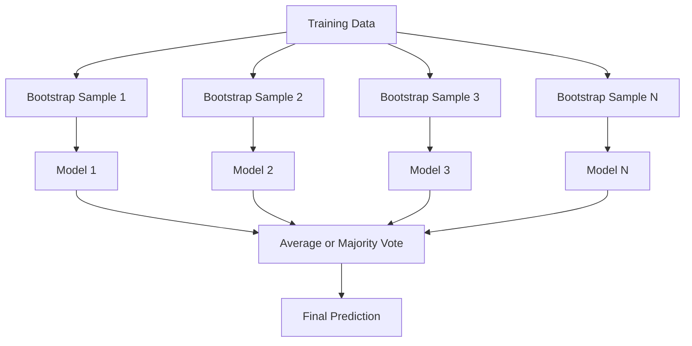
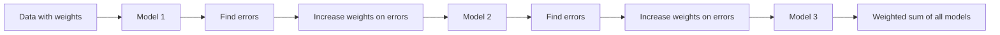
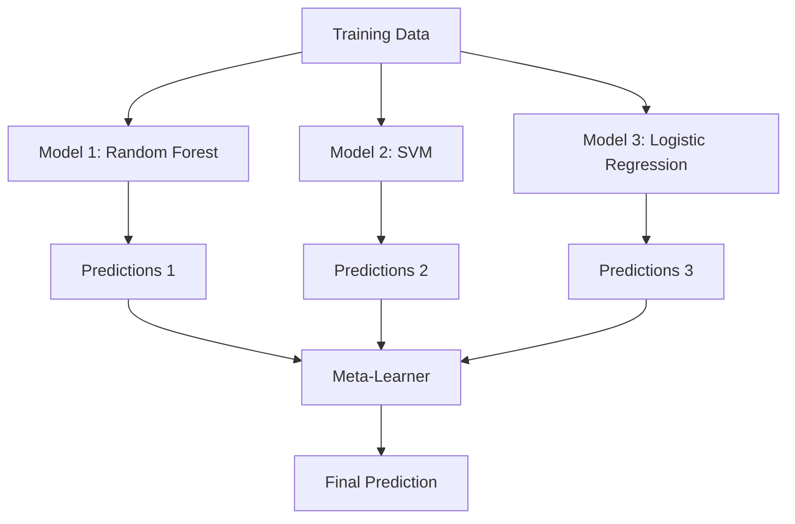

# Metotları Birleştir

> Bir grup zayıf öğrenci, eğer doğru bir şekilde birleşirse, güçlü bir öğrenci olur. Bu bir metafor değil.

**Type:** Build
**Language:**Python
**Prerequisites:** Phase 2, Lesson 10 (Bias-Variance Tradeoff)
**Time:** ~120 分钟

## Öğrenme hedefi

- AdaBoost ve gradient artışı,并 açıklamak  nasıl 序列下降偏差
- Bir paketleme ansamblini oluşturmak, ilgili modellere karşı ortalama nasıl artmaz önyargı durumunda varyansa azaltılacağını göstermek
- Her yöntemle ilgili hata bileşenleri                                                                                                                                                                                                                                                                                                                                                                                                                                                                                                                      
- 评估 ensemble diversity,并解释为什么随着更多独立弱的学习者加入,多数投票精度会提升

## 问题

单个决策树 训练速度快且易解释,但会过于适合――单个线性模型 在复杂边界上会过于适合――完美模型架构的设计.

Birleştirme yöntemleri işte böyle yapılır. Bunlar tablo verilerinde, Kağıl Yarışının en güvenilir teknolojisinde, çoğu üreten ML sisteminin desteğinde ve önyargı-varians ticareti'nin gerçek etkisini canlı bir şekilde göstermektedir.

## 概念

### Neden Ensemeller Etkili

假设你有N个独立分类器,每个的精度都是p > 0.5──多数票的精度为:

```
P(majority correct) = sum over k > N/2 of C(N,k) * p^k * (1-p)^(N-k)
```

21 sınıflandırıcı için %60 oranında doğruluk, çoğunluk oylarının doğruluğu %74 civarında. Eğer 101 sınıflandırıcı varsa, %84'e yükseltilmektedir.

关键要求是 **diversity** Eğer tüm modeller aynı hatalar yaparsa, bunları bir araya getirmek hiçbir yardımı olmaz.

- Örgütleme bölümleri
-  不同的特色子集 ( rastgele ormanlar)
- 顺序式 hata düzeltme(boosting)
- Önemli bir model aile

### Çantalama (Bootstrap Aggregating)

Eğitim verilerinin farklı bootstrap örnekleri ile birlikte, her model üzerinde çeşitlilik yaratmak için toplama yapılması.



Bootstrap örneği, orijinal verilerden alınan geri çekilme örneklerinden oluşur.

Çantalama neredeyse hiçbir önyargı olmadan varyasyonu azaltır. Her tek ağaç kendi çizgi örneğine fazla uyum sağlar, ancak her ağaçın fazla uyum farklıdır. Bu nedenle gürültüden ortalama bir çıkış gerektirir.

**Random Forests**Bu, ağaçlar arasında daha fazla çeşitlilik yaratmaya zorlar. Tipik bir aday özelliği ise, sayıların sınıflandırma içindeki ırkların ırkınlığıdır.`sqrt(n_features)`, ve Regresi İçinde`n_features / 3`- Evet.

### Boosting(顺序式 Hata Düzeltme)

按顺序训练模型──每个新模型都关注之前模型预测错误的例子──



Boosting  reducing bias── her yeni model, daha önce yapılan sistematik hataları düzeltir── son tahmin, tüm modellerin ağırlıklı toplamıdır, bunlardan daha iyi performans gösteren model daha yüksek bir ağırlık elde eder──

ʎaż: Eğer çok fazla tekerlek yürütülürse, güçlendirme daha fazla olabilir, çünkü daha zor örneklere sürekli uyum sağlayacaktır, bazıları ise sadece gürültü olabilir.

### AdaBoost

AdaBoost (Adaptive Boosting) ilk kullanılabilir güçlendirme algoritmasıdır.

算法:

```
1. Initialize sample weights: w_i = 1/N for all i

2. For t = 1 to T:
   a. Train weak learner h_t on weighted data
   b. Compute weighted error:
      err_t = sum(w_i * I(h_t(x_i) != y_i)) / sum(w_i)
   c. Compute model weight:
      alpha_t = 0.5 * ln((1 - err_t) / err_t)
   d. Update sample weights:
      w_i = w_i * exp(-alpha_t * y_i * h_t(x_i))
   e. Normalize weights to sum to 1

3. Final prediction: H(x) = sign(sum(alpha_t * h_t(x)))
```

hata daha düşük model daha yüksek alfa elde eder. Hata sınıflandırılmış örnekler daha yüksek ağırlıklar elde eder.

### Aradan Artarak

Gradyent artışı 泛化到任意 Loss Function ︎; bu, örneklerin yeniden yüklenmesi değil, her yeni modelin mevcut ansamblın kalıntılarına uygun hale gelmesine izin vermek olacaktır.

```
1. Initialize: F_0(x) = argmin_c sum(L(y_i, c))

2. For t = 1 to T:
   a. Compute pseudo-residuals:
      r_i = -dL(y_i, F_{t-1}(x_i)) / dF_{t-1}(x_i)
   b. Fit a tree h_t to the residuals r_i
   c. Find optimal step size:
      gamma_t = argmin_gamma sum(L(y_i, F_{t-1}(x_i) + gamma * h_t(x_i)))
   d. Update:
      F_t(x) = F_{t-1}(x) + learning_rate * gamma_t * h_t(x)

3. Final prediction: F_T(x)
```

√2 hata kaybı için,pseudo-residüal = gerçek residüal:`r_i = y_i - F_{t-1}(x_i)`❖ Her ağaç aslında bir takım hatalar yapar.

Öğrenme oranı (shrinkage) kontrol her ağaçın katkı derecesi. Daha küçük öğrenme oranları. Daha fazla ağaç gerektirir.

### XGBoost: Neden Tablo Verileri Başlatıyor ?

XGBoost (eXtreme Gradient Boosting) bir teknik optimizasyon gradient boosting, hızlı 、 doğru, ve kolayca overfit yapmak için kullanılır:

- **Regularized objective:**Yaprak ağırlıklarına L1 ve L2 cezalar eklemek, tek ağaçtan korunmak  Aşırı güven
- **Second-order approximation:**Aynı zamanda Kayıpların birinci ve ikinci aşama türevlerini kullanmak, böylece daha iyi bölünme kararları yapmak
- **Sparsity-aware splits:**通过在每次分时学习缺失数据的最佳方向,原生处理缺失值
- **Column subsampling:**                                                                                                                                                                                                                                                              
- **Weighted quantile sketch:**Toplam verilerde top高效 aranan sürekli özelliklerin bölünme noktaları
- **Cache-aware block structure:**CPU cache hatları için  Optimized memory layout

Tablo verileri için, XGBoost ve sonrası LightGBM) sinir ağından daha iyi devam ediyor. Bu kısa süre içinde değişmeyecek. Eğer verileriniz satır ve sütunlar tarafından oluşturulan tabloya yerleştirilebilirse, gradient artırma işleminden başlayın.

### Dökme (Meta-Learning)

Stacking, bir çok temel modelin tahminlerini meta öğrenci özellikleri olarak kullanacaktır.



Meta-öğrenci hangi girişlere güvenmeli olduğu temel model için öğrenir. Eğer rastgele ormanlar bazı bölgelerde daha iyi performans gösterirse ve SVM diğer bölgelerde daha iyi performans gösterirse, meta-öğrenci öğrenme biçiminde bir yolculuk yapar.

Verilerin sızmasını önlemek için, temel model tahminleri  eğitimi kümesi üzerinden geçmelidir                                                                                                                                                                                                                                                                                                                                                                                                                                                                                                         

### Oylama

En basit bir dizi. Doğrudan bir dizi tahminler.

- **Hard voting:**Sınıf etiketlerine çoğunlukla oy kullanmak.
- **Soft voting:**Önceden tahmin edilen olasılıklara göre  ortalama seçin, ortalama olasılık en yüksek sınıfı seçin.


```figure
f3-ensemble-average
```

## Yapın onu.

### 步骤 1: Kararlılık Çubuğu(Baş Öğrenci)

`code/ensembles.py`Biz karar sapından başlayalım: bir ağacın sadece bir parçası var.

```python
class DecisionStump:
    def __init__(self):
        self.feature_idx = None
        self.threshold = None
        self.polarity = 1
        self.alpha = None

    def fit(self, X, y, weights):
        n_samples, n_features = X.shape
        best_error = float("inf")

        for f in range(n_features):
            thresholds = np.unique(X[:, f])
            for thresh in thresholds:
                for polarity in [1, -1]:
                    pred = np.ones(n_samples)
                    pred[polarity * X[:, f] < polarity * thresh] = -1
                    error = np.sum(weights[pred != y])
                    if error < best_error:
                        best_error = error
                        self.feature_idx = f
                        self.threshold = thresh
                        self.polarity = polarity

    def predict(self, X):
        n = X.shape[0]
        pred = np.ones(n)
        idx = self.polarity * X[:, self.feature_idx] < self.polarity * self.threshold
        pred[idx] = -1
        return pred
```

### 步骤 2: AdaBoost'ı sıfırdan gerçekleştirmek

```python
class AdaBoostScratch:
    def __init__(self, n_estimators=50):
        self.n_estimators = n_estimators
        self.stumps = []
        self.alphas = []

    def fit(self, X, y):
        n = X.shape[0]
        weights = np.full(n, 1 / n)

        for _ in range(self.n_estimators):
            stump = DecisionStump()
            stump.fit(X, y, weights)
            pred = stump.predict(X)

            err = np.sum(weights[pred != y])
            err = np.clip(err, 1e-10, 1 - 1e-10)

            alpha = 0.5 * np.log((1 - err) / err)
            weights *= np.exp(-alpha * y * pred)
            weights /= weights.sum()

            stump.alpha = alpha
            self.stumps.append(stump)
            self.alphas.append(alpha)

    def predict(self, X):
        total = sum(a * s.predict(X) for a, s in zip(self.alphas, self.stumps))
        return np.sign(total)
```

### 3 adım: Devamlı Artırma'yı Zero'dan gerçekleştirmek

```python
class GradientBoostingScratch:
    def __init__(self, n_estimators=100, learning_rate=0.1, max_depth=3):
        self.n_estimators = n_estimators
        self.lr = learning_rate
        self.max_depth = max_depth
        self.trees = []
        self.initial_pred = None

    def fit(self, X, y):
        self.initial_pred = np.mean(y)
        current_pred = np.full(len(y), self.initial_pred)

        for _ in range(self.n_estimators):
            residuals = y - current_pred
            tree = SimpleRegressionTree(max_depth=self.max_depth)
            tree.fit(X, residuals)
            update = tree.predict(X)
            current_pred += self.lr * update
            self.trees.append(tree)

    def predict(self, X):
        pred = np.full(X.shape[0], self.initial_pred)
        for tree in self.trees:
            pred += self.lr * tree.predict(X)
        return pred
```

### 4 adım: Süküler ile karşılaştır

代码会验证 Bizim sıfırdan uygulamalar Eğer bu ürünlerle oluşabilir `AdaBoostClassifier`和 `GradientBoostingClassifier`Yakın doğruluk, tüm yöntemleri de simgeleyecektir.

## Kullan

### Her türlü yöntem kullanır mısın?

| Method | Reduces | Best for | Watch out for |
|--------|---------|----------|---------------|
| Bagging / Random Forest | Variance | noisy data、features 很多 | 对 bias 没有帮助 |
| AdaBoost | Bias | clean data、简单 base learners | 对 outliers 和 noise 敏感 |
| Gradient Boosting | Bias | tabular data、比赛 | 训练慢，不调参容易 overfit |
| XGBoost / LightGBM | Both | 生产环境 tabular ML | hyperparameters 很多 |
| Stacking | Both | 争取最后 1-2% accuracy | 复杂，存在 meta-learner overfitting 风险 |
| Voting | Variance | 快速组合 diverse models | 只有在模型足够 diverse 时才有帮助 |

### Tablo Verileri' nin Üretim Stabı

 Çoğu tablo tahmin problemi için, aşağıdaki sırayla deneyin:

1.   使用默认参数 的**LightGBM 或 XGBoost**
2. 调优 n_estimators、learning_rate、max_depth、min_child_weight
3. Eğer son %0,5 yükseltme gerekiyorsa, 3-5 farklı model içeren bir yığma topluluğu oluşturun.
4. 全程使用 çapraz onaylama

Araştırmalar devam etmesine rağmen, Tablo verilerindeki sinir ağları neredeyse her zaman gradient artışı 差──TabNet、NODE ve benzer yapıların bazen yakınlaşmasına rağmen, çok azı iyi bir XGBoost'u aşabildi.

## - Söyle.

本课会产 出 `outputs/prompt-ensemble-selector.md`-- One help you for a given dataset  choose adapt ensemble method  prompt                                                                                                                                                                                                                                                                                                                                                                                                                                                                                                              `outputs/skill-ensemble-builder.md`, içinde tam bir seçim yönlendirme vardır.

## 练习

1. AdaBoost'u değiştirmek, her bir turdan sonra eğitim doğruluğunu takip etmek.

2. 通過向回归樹 添加随机特征子样本化,从零实现一个随机森林──使用 `max_features=sqrt(n_features)`訓練 100 樹 並對予測 求平均──将差異減少與單樹比较──

3. Gelişme hızlandırması 实现中添加早期停止: 每轮后追踪验证损失, eğer连续10轮没有提升则停止──实际需要多少树木?

4. 构建一个包含三个基模型(物流回归、决策树、k-next neighbors) 和一个物流回归 meta-learner的堆积组──使用五倍横断验证 生成 meta-特征──与每个基模型 单独使用时比较──

5. Aynı veri kümesi üzerinde, öntanımlı parametreler kullanarak XGBoost çalıştırılır.

## 关键术语

| Term | 常见说法 | 实际含义 |
|------|----------------|----------------------|
| Bagging | “在 random subsets 上训练” | Bootstrap aggregating：在 bootstrap samples 上训练模型，对 predictions 求平均以降低 variance |
| Boosting | “关注 hard examples” | 按顺序训练模型，每个模型纠正当前 ensemble 的错误，以降低 bias |
| AdaBoost | “重新加权数据” | 通过 sample weight updates 实现 boosting；misclassified points 会在下一个 learner 中获得更高 weight |
| Gradient boosting | “拟合 residuals” | 通过让每个新模型拟合 Loss Function 的 negative Gradient 来实现 boosting |
| XGBoost | “Kaggle 武器” | 带有 regularization、second-order optimization 和系统级加速技巧的 gradient boosting |
| Stacking | “模型叠在模型上” | 将 base models 的 predictions 作为 meta-learner 的 input features |
| Random forest | “许多 randomized trees” | 使用 decision trees 的 bagging，并在每次 split 时加入 random feature subsampling 以增加 diversity |
| Ensemble diversity | “犯不同错误” | 模型的错误必须不相关，ensemble 才能优于单个模型 |
| Out-of-bag error | “免费 validation” | 不在某次 bootstrap draw 中的 samples（约 36.8%）可作为 validation set，无需单独 holdout |

## 延伸阅读

- [Schapire & Freund: Boosting: Foundations and Algorithms](https://mitpress.mit.edu/9780262526036/)-- AdaBoost 创建者所著的书
- [Friedman: Greedy Function Approximation: A Gradient Boosting Machine (2001)](https://statweb.stanford.edu/~jhf/ftp/trebst.pdf)-- 原始 gradient güçlendirme 论文
- [Chen & Guestrin: XGBoost (2016)](https://arxiv.org/abs/1603.02754)-- XGBoost 论文
- [Wolpert: Stacked Generalization (1992)](https://www.sciencedirect.com/science/article/abs/pii/S0893608005800231)-- 原始 论文
- [scikit-learn Ensemble Methods](https://scikit-learn.org/stable/modules/ensemble.html)-- 实用参考
