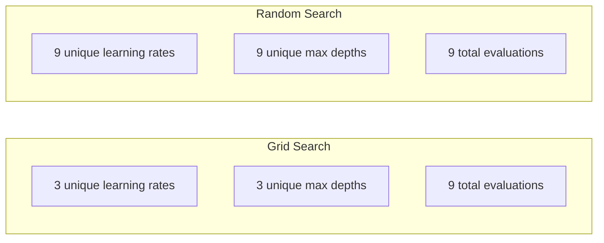
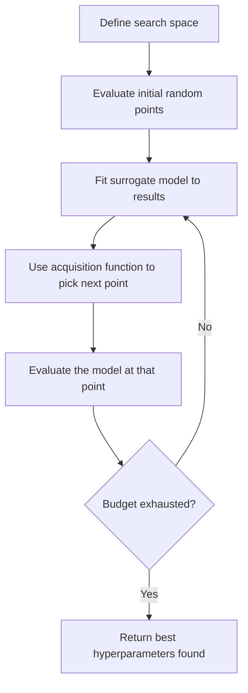
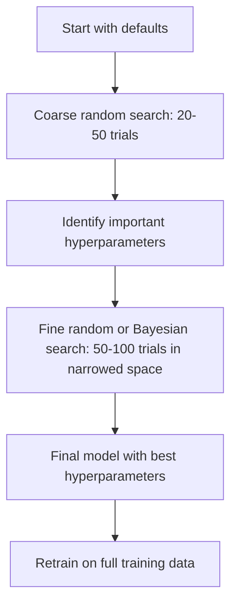
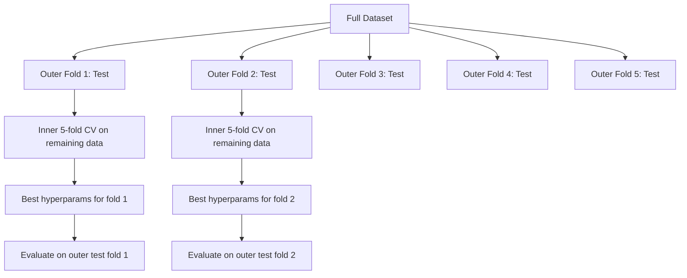

# Hiperparameter Düzenleme

> Hiperparametre, antrenmanın başlangıcından önce düzenlemenizi sağlar.

**Type:** Build
**Language:**Python
**Prerequisites:** Phase 2, Lesson 11 (Ensemble Methods)
**Time:** ~90 分钟

## Öğrenme hedefi
- Çubuğun aramalarını sıfırdan gerçekleştirmek, rastgele arama ve Bayesian optimizasyonu ile karşılaştırmak
-  açıklayın neden çoğu hiperparametre'nin geçerli boyutu düşük olduğunda rastgele arama , şebekeden daha iyi olur
- Üstelik , bu yöntemin bir parçası olarak , bir Bayesian optimizasyonu oluşturmak için bir yöntem oluşturmak için , bir alternatif model kullanmak ve bir satın alma işlevi oluşturmak .
- Design a hyperparameter tuning 策略, via合适的交叉验证 避免对验证集 过拟合

## 问题
模型 has learning rate、number of trees、max depth、min samples per leaf、subsample ratio 和 column sample ratio──也就是六个超参数── eğer her birinde 5 个合理取值 varsa, o zaman grid 就有5^6 = 15,625 组合──每次训练需要10秒──全部尝试一遍需要43 小时的计算时间──

Grid arama en net yöntemdir, aynı zamanda ölçek değişiminden sonra en kötü yöntemdir. Rastom arama daha az hesaplama miktarıyla daha iyi yapılabilir. Bayesian optimizasyon, geçmiş değerlendirmelerden öğrenmekle sonuçlar da daha iyi olacaktır.

## 概念
### Parametre vs. Hiperparametre

Parametre, eğitim sürecinde öğrenilenlerin (veynetleri, tarafsızlıkları, bölünmüş eşiği) kontrol etmesi için, eğitimden önce ayarlanmıştır.

| Hyperparameter | 控制什么 | 典型范围 |
|---------------|-----------------|---------------|
| Learning rate | 每次更新的步长 | 0.001 到 1.0 |
| Number of trees/epochs | 训练时长 | 10 到 10,000 |
| Max depth | 模型复杂度 | 1 到 30 |
| Regularization (lambda) | 防止过拟合 | 0.0001 到 100 |
| Batch size | Gradient 估计噪声 | 16 到 512 |
| Dropout rate | 被丢弃的 neurons 比例 | 0.0 到 0.5 |

### Çubuğu Arama

Grid arama, belirtilen değerlerin her bir kombinasyonunu değerlendirir.

```
Grid for 2 hyperparameters:

  learning_rate: [0.01, 0.1, 1.0]
  max_depth:     [3, 5, 7]

  Evaluations: 3 x 3 = 9 combinations

  (0.01, 3)  (0.01, 5)  (0.01, 7)
  (0.1,  3)  (0.1,  5)  (0.1,  7)
  (1.0,  3)  (1.0,  5)  (1.0,  7)
```

Grid arama bir temel eksikliği vardır: Eğer bir hiperparametre  önemli ise, diğer bir önemi yoksa, çoğu değerlendirme boşa çıkar.

### - Kesinlikle .

Rastgele arama, çubuğundan değil, dağılımdan örnek hiperparametrelerden alınır. Aynı şekilde 9 kez değerlendirilmiş bütçede her hiperparametre 9 eşsiz değer elde edebilir.



Neden rastgele bir şekilde bir ağın üzerinden kazanılır?

- Çoğu hiperparametre'nin geçerli boyutu çok düşüktür.
- Şebekenin araması, kayıpları değerlendirmeyi önemli olmayan bir boyutta yapar.
- Aynı bütçe altında rastgele arama daha yoğun bir şekilde önemli boyutları kaplar.
- 60 kez rastgele denemelerde aşağıda, arama alanında en iyi nokta varsa, en iyi noktaların %5'i içinde bir nokta bulma olasılığın %95'dir.

### Bayesian Optimizasyon

Rastom arama sonuçları ihmal eder. Yüksek öğrenme oranlarına ulaşmak için öğrenmez. Bozulmaya yol açar.



İki önemli bileşen:

**Surrogate model:**Bir düşük maliyetli değerleme modeli (genellikle Gaussian süreci) yakın pahalı objektif fonksiyon için kullanılır. Arama alanında herhangi bir noktada tahmin değerini ve belirsizlik tahminini verir.

**Acquisition function:**通过平衡利用 (在已知好点附近搜索) 和探索 (在不确定性高的区域搜索) 通过平衡利用 (在已知好点附近搜索) 和探索 (在不确定性高的区域搜索) 通过平衡利用 (在已知好点附近搜索) 通过平衡利用 (在已知好点附近搜索) 和探索 (在不确定性高的区域搜索) 通过平衡利用 (在已知好点附近搜索) 和探索 (在不确定性高的区域搜索) 通过平衡利用 (在已知好点附近搜索) 和探索 (在不确定性高的区域搜索) 通过平衡利用 (在已知好点附近搜索) 和探索 (在不确定性高的区域搜索) 通过平衡利用) 通过平衡利用 (在已知好点附近搜索) 和探索 (在不确定性高的区域搜索),决定下一步评估哪里.

- **Expected Improvement (EI):**Bu noktayı, mevcut en iyi değerlere göre ne kadar artırabileceğimizi tahmin ediyoruz?
- **Upper Confidence Bound (UCB):**预测值加上某倍数的不确定性――更高的 UCB, bu noktanın potansiyel olduğunu veya henüz yeterince keşfedilmediğini belirtmektedir――
- **Probability of Improvement (PI):**Bu noktayı geçerli en iyi değerden daha fazla olasılıkla ne kadar?

Bayesian optimizasyonu genellikle rastgele aramalara göre daha iyi hiperparametre bulma 2-5 katı değerlendirme süresi ile daha iyi hiperparametre bulabilir.

### Erken Durma

Eğer bir konut 10 dönemden sonra çok kötüse, onu durdurup bir sonraki süreci sürdürmek gerekir.

策略:
- **Patience-based:**Eğer onay kaybı 连续 N 个时代 没有提升,就停止
- **Median pruning:**Eğer bir deneme ortalaması aynı adımdan daha düşükse, durdurun.
- **Hyperband:**Bazı konutlara küçük bütçelerden daha fazla konut dağıtılmalı, sonra da en iyi konutların bütçelerini yavaş yavaş artırılmalıdır

Hyperband 尤其有效── önce 1 dönem kullanır  81 yapılandırmayı başlatır, önce üçte birini saklar, sonra üçte birini tekrar saklar, sonra da ön üçte birini tekrar saklar.

### Öğrenme Tarih Programcıları

Öğrenme oranı neredeyse her zaman en önemli hiperparametre­dir.

| Scheduler | Formula | 何时使用 |
|-----------|---------|-------------|
| Step decay | 每 N 个 epochs 乘以 0.1 | 经典 CNN 训练 |
| Cosine annealing | lr * 0.5 * (1 + cos(pi * t / T)) | 现代默认选择 |
| Warmup + decay | 先线性增加，再 cosine decay | Transformers |
| One-cycle | 在一个 cycle 内先增加再减少 | 快速收敛 |
| Reduce on plateau | 指标停滞时按因子降低 | 稳妥默认选择 |

### Hiperparametr önemi

Tüm hiperparametre aynı derecede önemli değil. Rastom ormanları hakkında yapılan araştırmalar ve gradient artışı aynı şekilde görülüyor.

**高重要性：**
- Öğrenme oranı (始终优先调)
- Tahminlerin sayısı / dönemleri(Türk durdurma kullanmak yerine调它)
- Düzenleme gücü

**中等重要性：**
- Maksimum derinlik / katman sayısı
- Yarpaq / ağırlık kaybı başına minimum örnekler
- Alt örnek oranı

**低重要性：**
- Max özellikleri( rastgele ormanlar için)
- 具体激活函数 的选择
- Satır boyutu ((在合理范围内)

Önceden önemli, kalanı da belirlenmiş değer olarak saklanıyor.

### Uygulanabilir Strateji



具体工作流:

1. **从库的默认值开始。** Onlar deneyimli uygulayıcılar tarafından seçilir, genellikle %80'e ulaşmıştır.
2. **粗粒度 random search。**Use宽范围,20-50 次 试用早止 快速终止差的运行──
3. **分析结果。**📌 Hangi hiperparametre performans ile ilgili?
4. **精细搜索。**Gelişmiş alanlarda Bayesian optimizasyonu veya odaklı rastgele arama kullanmak―50-100 kez deneme­
5. **使用找到的最佳 hyperparameters 在全部训练数据上重新训练。**

### Çapraz Değerlendirme

En iyi hiperparametre, belirli bir doğrulama katmanına uygun olabilir.

- **Outer loop**(Bildi): verileri tren+val ve test olarak bölmek. Rapor öne çıkmaz.
- **Inner loop**(调优):将 train+val 拆分为 train 和 val──寻找最佳超参数──



Her dış katlanmak kendi en iyi hiperparametrelerini bağımsız olarak bulur. Dış puanlar genelleştirme performansının önyargısız bir tahminidir.

Kullanımlı:

```python
from sklearn.model_selection import cross_val_score, GridSearchCV
from sklearn.ensemble import GradientBoostingRegressor

inner_cv = GridSearchCV(
    GradientBoostingRegressor(),
    param_grid={
        "learning_rate": [0.01, 0.05, 0.1],
        "max_depth": [2, 3, 5],
        "n_estimators": [50, 100, 200],
    },
    cv=5,
    scoring="neg_mean_squared_error",
)

outer_scores = cross_val_score(
    inner_cv, X, y, cv=5, scoring="neg_mean_squared_error"
)

print(f"Nested CV MSE: {-outer_scores.mean():.4f} +/- {outer_scores.std():.4f}")
```

Bu çok pahalı bir yöntemdir. 5 dış katlama x 5 iç katlama x 27 şerit noktası = 675 model uygunluk), ancak güvenilir bir performans tahminini sağlayabilir.

### Etkin İpuçlar

**从 learning rate 开始。**Gradyent tabanlı yöntemler için, her zaman en önemli hiperparametre olmuştur. Kötü öğrenme oranı diğer tüm ayarları anlamsız hale getirecektir.

**对 learning rate 和 regularization 使用 log-uniform distributions。**0.001 ve 0.01 arasındaki fark, 0.1 ve 1.0 arasındaki farkla aynı derecede önemlidir.

**使用 early stopping，而不是调 n_estimators。**Bu, aramalardan bir hiperparametreyi kaldırır.

**预算分配。**%60'lık bütçeyi en önemli iki hiperparametre üzerinde kullanmak. %40'ın geri kalanı diğer tüm parametrelere kullanmak.

**尺度很重要。**永远不要在日志 ölçeğinde 上搜索批量量(16、32、64 就可以) ・・・始终在日志 ölçeğinde 上搜索学习率──让搜索分布匹配超参数 影响模型的方式──

| Model Type | Top Hyperparameters | Recommended Search | Budget |
|-----------|--------------------|--------------------|--------|
| Random Forest | n_estimators, max_depth, min_samples_leaf | Random search，50 次 trials | 低（训练快） |
| Gradient Boosting | learning_rate, n_estimators, max_depth | Bayesian，100 次 trials + early stopping | 中 |
| Neural Network | learning_rate, weight_decay, batch_size | Bayesian 或 random，100+ 次 trials | 高（训练慢） |
| SVM | C, gamma (RBF kernel) | 在 log scale 上 grid，25-50 次 trials | 低（2 个参数） |
| Lasso/Ridge | alpha | 在 log scale 上 1D search，20 次 trials | 很低 |
| XGBoost | learning_rate, max_depth, subsample, colsample | Bayesian，100-200 次 trials + early stopping | 中 |

**拿不准时：**Rastgele arama, deneyler sayısı en az hiperparametre sayısının 2 倍 kullanmak için, örneğin,6 个超参数 = en az 12 kez deneyler) ――You'll be amazed to find, 50 kez deneyler 经常能击败精心设计的网格搜索――


```figure
k-fold-cv
```

## Yapın onu.
### 步骤 1: Grid Arama'yı sıfırdan gerçekleştirmek

`code/tuning.py`Orta kod sıfırdan sıfırdan sıfır arama, rastgele arama ve basit bir Bayesian optimizer gerçekleştirdi.

```python
def grid_search(model_fn, param_grid, X_train, y_train, X_val, y_val):
    keys = list(param_grid.keys())
    values = list(param_grid.values())
    best_score = -float("inf")
    best_params = None
    n_evals = 0

    for combo in itertools.product(*values):
        params = dict(zip(keys, combo))
        model = model_fn(**params)
        model.fit(X_train, y_train)
        score = evaluate(model, X_val, y_val)
        n_evals += 1

        if score > best_score:
            best_score = score
            best_params = params

    return best_params, best_score, n_evals
```

### 步骤 2: Zararlı Aramaları gerçekleştirmek

```python
def random_search(model_fn, param_distributions, X_train, y_train,
                  X_val, y_val, n_iter=50, seed=42):
    rng = np.random.RandomState(seed)
    best_score = -float("inf")
    best_params = None

    for _ in range(n_iter):
        params = {k: sample(v, rng) for k, v in param_distributions.items()}
        model = model_fn(**params)
        model.fit(X_train, y_train)
        score = evaluate(model, X_val, y_val)

        if score > best_score:
            best_score = score
            best_params = params

    return best_params, best_score, n_iter
```

### 步骤 3:Bayesian Optimization (Bayesian Optimization)

核心思想:将Gaussian process 拟合到已观测的(hiperparameter, skor)配对上, sonra edinme fonksiyonu ile bir sonraki adım görmeye karar verir.

```python
class SimpleBayesianOptimizer:
    def __init__(self, search_space, n_initial=5):
        self.search_space = search_space
        self.n_initial = n_initial
        self.X_observed = []
        self.y_observed = []

    def _kernel(self, x1, x2, length_scale=1.0):
        dists = np.sum((x1[:, None, :] - x2[None, :, :]) ** 2, axis=2)
        return np.exp(-0.5 * dists / length_scale ** 2)

    def _fit_gp(self, X_new):
        X_obs = np.array(self.X_observed)
        y_obs = np.array(self.y_observed)
        y_mean = y_obs.mean()
        y_centered = y_obs - y_mean

        K = self._kernel(X_obs, X_obs) + 1e-4 * np.eye(len(X_obs))
        K_star = self._kernel(X_new, X_obs)

        L = np.linalg.cholesky(K)
        alpha = np.linalg.solve(L.T, np.linalg.solve(L, y_centered))
        mu = K_star @ alpha + y_mean

        v = np.linalg.solve(L, K_star.T)
        var = 1.0 - np.sum(v ** 2, axis=0)
        var = np.maximum(var, 1e-6)

        return mu, var

    def _expected_improvement(self, mu, var, best_y):
        sigma = np.sqrt(var)
        z = (mu - best_y) / (sigma + 1e-10)
        ei = sigma * (z * norm_cdf(z) + norm_pdf(z))
        return ei

    def suggest(self):
        if len(self.X_observed) < self.n_initial:
            return sample_random(self.search_space)

        candidates = [sample_random(self.search_space) for _ in range(500)]
        X_cand = np.array([to_vector(c) for c in candidates])
        mu, var = self._fit_gp(X_cand)
        ei = self._expected_improvement(mu, var, max(self.y_observed))
        return candidates[np.argmax(ei)]

    def observe(self, params, score):
        self.X_observed.append(to_vector(params))
        self.y_observed.append(score)
```

GP surrogate, her aday noktasında iki şey verir: tahmin sayıları ((mu) ve belirsizlikleri ((var) ◊) ◊) ◊) ◊) ◊) ◊) ◊) ◊) ◊) ◊) ◊) ◊) ◊) ◊) ◊) ◊) ◊) ◊) ◊) ◊) ◊) ◊) ◊) ◊) ◊) ◊) ◊) ◊ ◊) ◊) ◊) ◊) ◊) ◊) ◊) ◊) ◊) ◊) ◊) ◊) ◊) ◊) ◊) ◊) ◊) ◊) ◊) ◊) ◊) ◊) ◊) ◊) ◊) ◊) ◊) ◊) ◊) ◊) ◊) ◊) ◊) ◊) ◊) ◊) ◊) ◊) ◊) ◊) ◊) ◊) ◊) ◊) ◊ ◊) ◊ ◊ ◊ ◊ ◊ ◊ ◊ ◊ ◊ ◊ ◊ ◊ ◊ ◊ ◊ ◊ ◊ ◊ ◊ ◊ ◊ ◊ ◊ ◊ ◊ ◊ ◊ ◊ ◊ ◊ ◊ ◊ ◊ ◊ ◊ ◊ ◊ ◊ ◊ ◊ ◊ ◊ ◊ ◊ ◊ ◊ ◊ ◊ ◊ ◊ ◊ ◊ ◊ ◊ ◊ ◊ ◊ ◊ ◊ ◊ ◊ ◊ ◊ ◊ ◊ ◊ ◊ ◊ ◊ ◊ ◊ ◊ ◊ ◊ ◊ ◊ ◊ ◊ ◊ ◊ ◊ ◊ ◊ ◊ ◊ ◊ ◊ ◊ ◊ ◊ ◊ ◊ ◊ ◊ ◊ ◊ ◊ ◊ ◊ ◊ ◊ ◊ ◊ ◊ ◊ ◊ ◊ ◊ ◊ ◊ ◊ ◊ ◊ ◊ ◊ ◊ ◊ ◊ ◊ ◊ ◊ ◊ ◊ ◊ ◊ ◊ ◊ ◊ ◊ ◊ ◊ 

### 4 adım: Tüm yöntemleri karşılaştır

Bu karşılaştırma, basitleştirilmiş bir sarma kullanır, doğrudan objektif işleviyle 调用每个优化器 (,) böylece API yukarıdaki model tabanlı 实现不同:

```python
def synthetic_objective(params):
    lr = params["learning_rate"]
    depth = params["max_depth"]
    return -(np.log10(lr) + 2) ** 2 - (depth - 4) ** 2 + 10

param_grid = {
    "learning_rate": [0.001, 0.01, 0.1, 1.0],
    "max_depth": [2, 3, 4, 5, 6, 7, 8],
}

grid_best = None
grid_score = -float("inf")
grid_history = []
for combo in itertools.product(*param_grid.values()):
    params = dict(zip(param_grid.keys(), combo))
    score = synthetic_objective(params)
    grid_history.append((params, score))
    if score > grid_score:
        grid_score = score
        grid_best = params

param_dist = {
    "learning_rate": ("log_float", 0.001, 1.0),
    "max_depth": ("int", 2, 8),
}

rand_best = None
rand_score = -float("inf")
rand_history = []
rng = np.random.RandomState(42)
for _ in range(28):
    params = {k: sample(v, rng) for k, v in param_dist.items()}
    score = synthetic_objective(params)
    rand_history.append((params, score))
    if score > rand_score:
        rand_score = score
        rand_best = params

optimizer = SimpleBayesianOptimizer(param_dist, n_initial=5)
bayes_history = []
for _ in range(28):
    params = optimizer.suggest()
    score = synthetic_objective(params)
    optimizer.observe(params, score)
    bayes_history.append((params, score))
bayes_score = max(s for _, s in bayes_history)

print(f"{'Method':<20} {'Best Score':>12} {'Evaluations':>12}")
print("-" * 50)
print(f"{'Grid Search':<20} {grid_score:>12.4f} {len(grid_history):>12}")
print(f"{'Random Search':<20} {rand_score:>12.4f} {len(rand_history):>12}")
print(f"{'Bayesian Opt':<20} {bayes_score:>12.4f} {len(bayes_history):>12}")
```

Aynı bütçe altında, Bayesian optimizasyonu genellikle en iyi puanı en hızlı bulabilir, çünkü kayıpları açıkça kötü bir bölgede değerlendirmez.

## Kullan
### Optuna Uygulama

Optuna is strict hyperparameter tuning さんの推库──它开箱即支援剪裁、分布式搜索和可视化──

```python
import optuna

def objective(trial):
    lr = trial.suggest_float("learning_rate", 1e-4, 1e-1, log=True)
    n_est = trial.suggest_int("n_estimators", 50, 500)
    max_depth = trial.suggest_int("max_depth", 2, 10)

    model = GradientBoostingRegressor(
        learning_rate=lr,
        n_estimators=n_est,
        max_depth=max_depth,
    )
    model.fit(X_train, y_train)
    return mean_squared_error(y_val, model.predict(X_val))

study = optuna.create_study(direction="minimize")
study.optimize(objective, n_trials=100)

print(f"Best params: {study.best_params}")
print(f"Best MSE: {study.best_value:.4f}")
```

Optuna'nın anahtar özellikleri:
- `suggest_float(..., log=True)`En uygun olan log ölçeğinde arama parametreleri için kullanmak
- `suggest_int`Bütün sayılar için
- `suggest_categorical`İle ayrılı seçim için
- İçinde bulunduğu MedianPruner, kötü denemeler için kullanılır  erken durdurma yapmak
- `study.trials_dataframe()`Analisis için kullanılır

### Çürümekle Optuna

Kesim, umutsuz denemeler durdurmak için, böylece büyük miktarda hesaplama tasarruf etmektedir.

```python
import optuna
from sklearn.model_selection import cross_val_score

def objective(trial):
    params = {
        "learning_rate": trial.suggest_float("lr", 1e-4, 0.5, log=True),
        "max_depth": trial.suggest_int("max_depth", 2, 10),
        "n_estimators": trial.suggest_int("n_estimators", 50, 500),
        "subsample": trial.suggest_float("subsample", 0.5, 1.0),
    }

    model = GradientBoostingRegressor(**params)
    scores = cross_val_score(model, X_train, y_train, cv=3,
                             scoring="neg_mean_squared_error")
    mean_score = -scores.mean()

    trial.report(mean_score, step=0)
    if trial.should_prune():
        raise optuna.TrialPruned()

    return mean_score

pruner = optuna.pruners.MedianPruner(n_startup_trials=10, n_warmup_steps=5)
study = optuna.create_study(direction="minimize", pruner=pruner)
study.optimize(objective, n_trials=200)
```

`MedianPruner`Bir deneyin orta değeri, aynı adımdan tamamlanmış tüm deneylerin orta değeri daha düşük durduracak zamanında.`trial.report()`報告中指标,并调用 `trial.should_prune()`检查该审判是否应该停止──`n_startup_trials=10`                                                                                                                                                                                                                                                              

### Sklern'in İçerilen Tunerleri

                                                                                                                                                                                                                                                              `GridSearchCV`- Evet.`RandomizedSearchCV`和 `HalvingRandomSearchCV`- ...

```python
from sklearn.model_selection import RandomizedSearchCV
from scipy.stats import loguniform, randint

param_dist = {
    "learning_rate": loguniform(1e-4, 0.5),
    "max_depth": randint(2, 10),
    "n_estimators": randint(50, 500),
}

search = RandomizedSearchCV(
    GradientBoostingRegressor(),
    param_dist,
    n_iter=100,
    cv=5,
    scoring="neg_mean_squared_error",
    random_state=42,
    n_jobs=-1,
)
search.fit(X_train, y_train)
print(f"Best params: {search.best_params_}")
print(f"Best CV MSE: {-search.best_score_:.4f}")
```

Öğrenme hızına ve düzenlenmesine`loguniform`△ Tüm sayılardaki hiperparametre kullanım `randint`- Evet.`n_jobs=-1`标志会在所有CPU核心上并行──

### Hiperparameter Düzenleme 中的常见错误

**通过 preprocessing 产生 data leakage。**Eğer çapraz doğrulama sırasında varsa Önceden tam veri kümesi üstü bir ölçekleyici, doğrulama katmanının bilgileri eğitim sırasında sızır.`Pipeline`Bu şekilde sadece antrenman katmanında üst katına girer.

**对 validation set 过拟合。**运行数千次试验 实际上等于在验证组上训练――最终性能估计应使用嵌套横验证,或留出在调优期间从未触碰的独立测试组――

**搜索范围太窄。**Eğer en iyi değerin arama alanının sınırında yer alırsa, arama alanının geniş olmadığını belirtin. En iyi değerin sınır dışında olabilir.

**忽略交互效应。**Gelişmiş bir ortamda öğrenme oranı ve tahminçiler sayısı güçlü bir ilişki geliştirmektedir.

**没有对 iterative models 使用 early stopping。**Gradyent artışı ve sinir ağları için n_estimator veya epochs                                                                                                                                                                                                                                                                                                                                                                                                                                                                                                            

## 练习
1. Aynı bütçe ile çalıştırma şebekesi arama ve rastgele arama (örneğin 50 kez değerlendirme) ◊ En iyi oranı bulmak için farklı tohumlarla karşılaştırmak ◊ 10 kez çalıştırma deneyi ◊ rastgele arama ◊ kaç kez kazanıldı?

2. Hyperband'ı gerçekleştirmek için sıfırdan başlayarak, 81 adet yapılandırma başlatıldı. Her eğitim 1 dönemden başlayarak, her turun 1/3'ü kalınmadan önce, bunların bütçesi 3 katına kadar artıyor.

3. 给 Lesson 11 中的梯度提升 实现添加一个学习率调度器 (tıpkı tıpkı tıpkı tıpkı tıpkı tıpkı tıpkı tıpkı tıpkı tıpkı tıpkı tıpkı tıpkı tıpkı tıpkı tıpkı tıpkı tıpkı tıpkı tıpkı tıpkı tıpkı tıpkı tıpkı tıpkı tıpkı tıpkı tıpkı tıpkı tıpkı tıpkı tıpkı tıpkı tıpkı tıpkı tıpkı tıpkı tıpkı tıpkı tıpkı tıpkı tıpkı tıpkı tıpkı tıpkı tıpkı tıpkı tıpkı tıpkı tıpkı tıpkı tıpkı tıpkı tıpkı tıpkı tıpkı tıpkı tıpkı tıpkı tıpkı tıpkı tıpkı tıpkı tıpkı tıpkı tıpkı tıpkı tıpkı tıpkı tıpkı tıpkı tıpkı tıpkı tıpkı tıpkı tıpkı tıpkı tıpkı tıpkı tıpkı tıpkı tıpkı tıpkı tıpkı tıpkı tıpkı tıpkı tıpkı tıpkı tıpkı tıpkı tıpkı tıpkı tıpkı tıpkı tıpkı tıpkı tıpkı tıpkı tıpkı tıpkı tıpkı tıpkı tıpkı tıpkı tıpkı tıpkı tıpkı tıpkı tıpkı tıpkı tıpkı tıpkı tıpkı tıpkı tıpkı tıpkı tıpkı tıpkı tıpkı tıpkı tıpkı tıpkı tıpkı tıpkı tıpkı tıpkı tıpkı tıpkı tıpkı tıpkı tıpkı tıpkı tıpkı tıpkı tıpkı tıpkı tıpkı tıpkı tıpkı tıpkı tıpkı tıpkı tıpkı tıpkı tıpkı tıpkı tıpkı tıpkı tıpkı tıpkı tıpkı tıpkı tıpkı tıpkı tıpkı tıpkı tıpkı tıpkı tıpkı tıpkı tıpkı tıp

4. Optuna в реальном наборе данных (örneğin, sklearn'ın meme kanseri verileri)`optuna.visualization.plot_param_importances(study)`查看哪些超参数最重要――它是否匹配本课中的重要性排序?

5. 实现一个简单的收购功能(预期改善),并演示探索与利用――绘制替代模型的平均值和不确定性,并演示 EI 选择下一步评估的位置──

## 关键术语
| Term | 人们通常说 | 实际含义 |
|------|----------------|----------------------|
| Hyperparameter | “你选择的一个设置” | 训练前设置的值，用来控制学习过程，不是从数据中学习得到的 |
| Grid search | “尝试每一种组合” | 在指定 parameter grid 上进行穷举搜索。成本呈指数级增长。 |
| Random search | “就是随机采样” | 从分布中采样 hyperparameters。比 grid search 更好地覆盖重要维度。 |
| Bayesian optimization | “智能搜索” | 使用 objective 的 surrogate model 来决定下一步评估哪里，平衡 exploration 和 exploitation |
| Surrogate model | “一个便宜的近似” | 一个模型（通常是 Gaussian process），根据已观测评估来近似昂贵的 objective function |
| Acquisition function | “下一步看哪里” | 通过平衡 expected improvement 和不确定性，为候选点打分。EI 和 UCB 是常见选择。 |
| Early stopping | “停止浪费时间” | 当 validation performance 停止提升时，提前终止训练 |
| Hyperband | “配置的锦标赛分组” | 自适应资源分配：用小预算启动许多 configs，保留最好的并增加它们的预算 |
| Learning rate scheduler | “训练期间改变 lr” | 一个函数，用于在训练过程中调整 learning rate，以获得更好的收敛 |

## 延伸阅读
- [Bergstra & Bengio: Random Search for Hyper-Parameter Optimization (2012)](https://jmlr.org/papers/v13/bergstra12a.html)-- 证明 random 胜过网 的论文
- [Snoek et al., Practical Bayesian Optimization of Machine Learning Algorithms (2012)](https://arxiv.org/abs/1206.2944)-- ML'nin Bayesian optimizasyonu ile
- [Li et al., Hyperband: A Novel Bandit-Based Approach (2018)](https://jmlr.org/papers/v18/16-558.html)-- Hiperband 论文
- [Optuna: A Next-generation Hyperparameter Optimization Framework](https://arxiv.org/abs/1907.10902)-- Optuna 论文
- [Probst et al., Tunability: Importance of Hyperparameters (2019)](https://jmlr.org/papers/v20/18-444.html)-- 哪些 hiperparametre 重要
