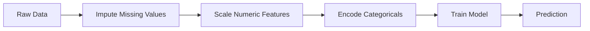
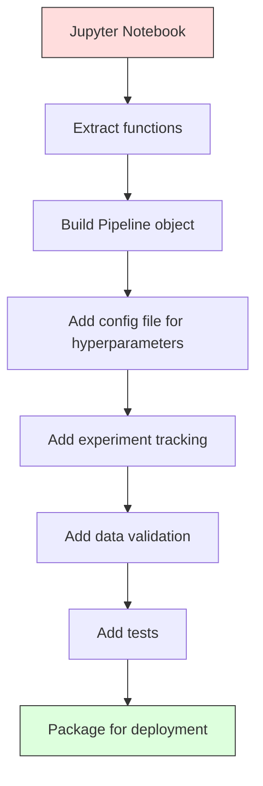

# ML boru hattları

> Model ürün değil.Pipeline sadece.Pipeline, ham veriden uygulanan tahminlere kadar tüm süreçleri kapsar ve her adımın tekrarlanması gerekir.

**Type:** Build
**Language:**Python
**Prerequisites:** Phase 2, Lesson 12 (Hyperparameter Tuning)
**Time:** ~120 minutes

## Öğrenme hedefi
- Bir ML boru hattını oluşturmak, hesaplama, ölçekleme, kodlama ve model eğitimi 串联 into a single object of replicable
- 识别数据泄漏 场景,并解释管道 如何通过仅在训练数据 上拟合变压器 防止泄漏
- Bir sütun oluşturun, sayısal ve kategorik özelliklere  farklı önceden işleme uygulayın
- 实现管道序列化,并证明与一个已拟合的管道在培训和生产中产生一致结果

## 问题
Bir defteriniz var: verileri yükler, eksik değerleri ortalama ile doldurur, kısaltır, eğitim modelini, ve doğru yazır.

Bir ay sonra, birisi yeniden eğitilen model, farklı sonuçlar elde etti. Ortalama test verilerinin tamamı içerir. Skalalama parametri kaydedilmedi, bu nedenle sonuç farklı bir statistiği kullanıldı. Özellik mühendisliği kodları eğitim ve hizmet arasında kopyalandı.

Bunlar varsayılan durum değillerdir. Bunlar, üretimdeki başarısızlığın en yaygın nedenleri.

## 概念
### Bir Boru hattı Nedir

Pipeline, bir dizi düzenli veri dönüşümüdür, sonra bir modelden sonra. Her adımdan önce bir adımdan önce bir giriş olarak çıkış yapılır. Tüm pipeline sadece eğitim verilerinde bir kez uyumlu olur.



Pipeline Güvenli:
- Değişiklikler sadece eğitim verileri üzerinde
- İndirim 时应用 tamamen aynı dönüşümler
- Tüm nesne seriye edilebilir ve bir eser olarak deploye edilebilir.
- Çarşı doğrulama, her katman içinde kullanılan boru hattı, küçük sızıntıların önlenmesi için yapılacak.

### Veriler sızdırıyor:

Veri sızdırılması  test setinde veya gelecek verilerdeki bilgi kirliliği eğitimi sırasında gerçekleşir.

**Leaky（错误）：**
```python
X = df.drop("target", axis=1)
y = df["target"]

scaler = StandardScaler()
X_scaled = scaler.fit_transform(X)

X_train, X_test = X_scaled[:800], X_scaled[800:]
y_train, y_test = y[:800], y[800:]
```

Skaliye göre test verileri var. Ortalama ve standart sapma.

**Correct：**
```python
X_train, X_test = X[:800], X[800:]

scaler = StandardScaler()
X_train_scaled = scaler.fit_transform(X_train)
X_test_scaled = scaler.transform(X_test)
```

Bu sorunu özel olarak düşünmenize gerek yok.

### Sklern boru hattı

Sklern'in `Pipeline`Birleştirilmiş transformatörler ve bir tahminci.`.fit()`- Evet.`.predict()`和 `.score()`, tüm adımları uygulayacak şekilde.

```python
from sklearn.pipeline import Pipeline
from sklearn.preprocessing import StandardScaler
from sklearn.linear_model import LogisticRegression

pipe = Pipeline([
    ("scaler", StandardScaler()),
    ("model", LogisticRegression()),
])

pipe.fit(X_train, y_train)
predictions = pipe.predict(X_test)
```

- Ne ? - Ne ?`pipe.fit(X_train, y_train)`时:
1. Scaler 在 X_train 上调用 `fit_transform`
2. Model X_train 上调用 `fit`

- Ne ? - Ne ?`pipe.predict(X_test)`时:
1. Scaler 在 X_test 上调用 `transform`(Not fit_transform)
2. Model  ölçeklendirilmiş X_test 上调用 `predict`

Skalifiyen, test verilerini asla görmeyecek.

### KolumTransformer:不同列使用不同管道

Gerçek veri kümesi aynı zamanda sayısal ve kategorik sütunları içerir, farklı önceden işleme gerektirir.`ColumnTransformer`Bu durumu ele almak için sorumlu.

```python
from sklearn.compose import ColumnTransformer
from sklearn.preprocessing import StandardScaler, OneHotEncoder
from sklearn.impute import SimpleImputer

numeric_pipe = Pipeline([
    ("impute", SimpleImputer(strategy="median")),
    ("scale", StandardScaler()),
])

categorical_pipe = Pipeline([
    ("impute", SimpleImputer(strategy="most_frequent")),
    ("encode", OneHotEncoder(handle_unknown="ignore")),
])

preprocessor = ColumnTransformer([
    ("num", numeric_pipe, ["age", "income", "score"]),
    ("cat", categorical_pipe, ["city", "gender", "plan"]),
])

full_pipeline = Pipeline([
    ("preprocess", preprocessor),
    ("model", GradientBoostingClassifier()),
])
```

OneHotEncoder 中的 `handle_unknown="ignore"`Üretim için önemli olan, yeni bir kategori ortaya çıktığında, doğrudan çöküş yerine, bir tam sıfır vektörü oluşturur.

### Deneyim Takip

Pipeline                                                                                                                                                                                                                                                                                                                                                                                                                                                                                                                            

**MLflow**En yaygın açık kaynaklı çözümler:

```python
import mlflow

with mlflow.start_run():
    mlflow.log_param("max_depth", 5)
    mlflow.log_param("n_estimators", 100)
    mlflow.log_param("learning_rate", 0.1)

    pipe.fit(X_train, y_train)
    accuracy = pipe.score(X_test, y_test)

    mlflow.log_metric("accuracy", accuracy)
    mlflow.sklearn.log_model(pipe, "model")
```

Her seferinde parametre, metrik, eser ve tam model kaydedilir.

**Weights & Biases (wandb)**提供相同功能,并带有托管仪表板:

```python
import wandb

wandb.init(project="my-pipeline")
wandb.config.update({"max_depth": 5, "n_estimators": 100})

pipe.fit(X_train, y_train)
accuracy = pipe.score(X_test, y_test)

wandb.log({"accuracy": accuracy})
```

### Model Versiyonlama

完成实验跟踪 后,你需要管理模型版本──哪个模型在生产?哪个模型在舞台上?上周使用的是哪个?

MLflow'un Model Kayıtları 提供:
- **Version tracking:**Her bir model bir versiyon numarasını alır .
- **Stage transitions:**"Stage" ̋"Prodüksiyon" ̋"Arşivlenmiş"
- **Approval workflow:**Model üretime açıkça teşvik edilmelidir .
- **Rollback:**立即切回之前 versiyonu

### DVC ile Versiyonlama Versiyonları

代码用 git versiyon yapma. DATA da versiyon edilmelidir, ama git 无法处理大文件──DVC (Data Version Control) 解决了这个问题──

```
dvc init
dvc add data/training.csv
git add data/training.csv.dvc data/.gitignore
git commit -m "Track training data"
dvc push
```

DVC gerçek verileri uzaktan depolama yerinde depolur ve git'te çok küçük bir tane saklar.`.dvc`Bir şey yapma.`dvc checkout`O zamanlar kullanılan kesin verileri geri kazanır.

Bu, her git'in aynı anda kod ve verileri sabitlediği anlamına gelir.

### Tekrarlanabilir Denemeler

Bir deney 4 şeye ihtiyaç duyar:

1. **Fixed random seeds:**Çevreyi, çevreyi, tohumları, tohumları, tohumları, tohumları, tohumları, tohumları, tohumları, tohumları, tohumları, tohumları, tohumları, tohumları, tohumları, tohumları, tohumları, tohumları, tohumları, tohumları, tohumları, tohumları, tohumları, tohumları, tohumları, tohumları, tohumları, tohumları, tohumları, tohumları, tohumları, tohumları, tohumları, tohumları, tohumları, tohumları, tohumları, tohumları, tohumları, tohumları, tohumları, tohumları, tohumları, tohumları, tohumları, tohumları, tohumları, tohumları, tohumları, tohumları ve tohumları, tohumları, tohumları, tohumları, tohumları, tohumları, tohumları, tohum, tohumları, tohum, tohum, tohum, tohum, tohum, tohum, tohum, tohum, tohum, tohum, tohum, tohum, tohum, tohum, tohum, tohum, tohum, tohum, tohum, tohum, tohum, tohum, tohum, tohum, tohum, tohum, tohum, tohum, tohum, tohum, tohum, tohum, tohum, tohum, tohum, tohum, tohum, tohum, tohum, tohum, tohum, tohum, tohum, tohum, tohum, tohum, tohum, tohum, tohum, tohum, tohum, tohum, tohum, tohum, tohum, tohum, tohum, tohum, tohum, tohum, tohum, tohum, tohum, tohum, tohum, tohum, tohum, tohum, tohum, tohum, tohum, tohum, tohum, tohum, tohum, tohum, tohum,
2. **Pinned dependencies:**kullanım带精确版本的 requirements.txt 或 poetry.lock
3. **Versioned data:**DVC veya benzer araç kullanın
4. **Config files:**Tüm hiperparametreler sert kodlanmış değil, yapılandırılmış.

```python
import numpy as np
import random

def set_seed(seed=42):
    random.seed(seed)
    np.random.seed(seed)
    try:
        import torch
        torch.manual_seed(seed)
        torch.cuda.manual_seed_all(seed)
        torch.backends.cudnn.deterministic = True
    except ImportError:
        pass
```

### Not defterinden üretim borusuna



Tipik bir süreç:

1. **Notebook exploration:**快速 deneyler  визуallaşmalar  özellik fikirleri
2. **Extract functions:**Preprocessing, Feature Engineering, Evaluation modüllerine geçiş
3. **Build Pipeline:**串联成 sklearn Pipeline veya özel sınıf dönüşümleri
4. **Config management:**Tüm hiperparametreyi YAML/JSON yapılandırmasına taşıyacak
5. **Experiment tracking:**添加 MLflow veya wandb kaydı
6. **Data validation:**Eğitimde ön kontrol şemaları, dağılımları ve eksik değer kalıpları
7. **Tests:**Transformatörler için  birim testleri, tam boru hattı için  entegrasyon testleri için
8. **Deployment:**Pipeline serilize, API kullanın(FastAPI、Flask)封装,并 containerize

### Genel Pipeline Hataları

| Mistake | Why it is bad | Fix |
|---------|-------------|-----|
| 在 splitting 前对完整数据 fitting | Data leakage | 使用带 cross_val_score 的 Pipeline |
| 在 Pipeline 外做 feature engineering | Train 与 serve 时 transforms 不一致 | 把所有 transforms 放入 Pipeline |
| 不处理 unknown categories | Production 中出现新值会崩溃 | OneHotEncoder(handle_unknown="ignore") |
| Hardcoded column names | schema 变化时会出错 | 从 config 使用 column name lists |
| 没有 data validation | bad data 会导致悄无声息的错误 predictions | 在 prediction 前添加 schema checks |
| Training/serving skew | 模型在 prod 中看到不同 features | training 和 serving 共用一个 Pipeline 对象 |


```figure
f3-pipeline-flow
```

## Yapın onu.
`code/pipeline.py`İçinde: ZERO'dan tam bir ML boru hattı oluştur:

### 步骤 1: Özel Transformer

```python
class CustomTransformer:
    def __init__(self):
        self.means = None
        self.stds = None

    def fit(self, X):
        self.means = np.mean(X, axis=0)
        self.stds = np.std(X, axis=0)
        self.stds[self.stds == 0] = 1.0
        return self

    def transform(self, X):
        return (X - self.means) / self.stds

    def fit_transform(self, X):
        return self.fit(X).transform(X)
```

### 步骤 2: Çöp hattı inşaat

```python
class PipelineFromScratch:
    def __init__(self, steps):
        self.steps = steps

    def fit(self, X, y=None):
        X_current = X.copy()
        for name, step in self.steps[:-1]:
            X_current = step.fit_transform(X_current)
        name, model = self.steps[-1]
        model.fit(X_current, y)
        return self

    def predict(self, X):
        X_current = X.copy()
        for name, step in self.steps[:-1]:
            X_current = step.transform(X_current)
        name, model = self.steps[-1]
        return model.predict(X_current)
```

### 3 adım: Kullanım Pipeline  Anahtarlık Verifikasyonu

代码演示了使用管道的交叉验证 如何防止数据泄漏:scaler 会分别在每个折的训练数据上适应──

### 第4 步: Kullanın sklearn'ın tam üretim boru hattı

Tam bir boru hattı var.`ColumnTransformer`、多条 önceden işleme yolları 和一个模型,并使用正确的交叉验证与实验记录 进行训练──

## - Söyle.
本课产 出:
- `outputs/prompt-ml-pipeline.md`-- ML boru hattlarını inşa etmek ve test etmek için kullanılmış
- `code/pipeline.py`- Bir tam boru hattı, sıfırdan  gerçekleştirmek için sklearn  versiyonu

## 练习
1. Bir boru hattı oluşturmak, 3 sayısal sütun ve 2 kategorik sütun içeren bir veri kümesi işlemek.`ColumnTransformer`Numerikaya  ortalama tahsil + ölçekleme, kategorikalere  en sık tahsil + tek sıcak kodlama uygulamak.

2. Bu nedenle, verilerin sızması: Özgürleştirme sırasında, tüm verilerin sızması için kullanılan ölçekleme cihazı kullanılır.

3. Kullanım`joblib.dump`Your's Pipeline. in tunggal脚本中加载它并运行预测.

4. Pipeline'e iki en önemli sayısal sütun için özel bir transformatör ekleyin.

5. Çöp hattı  MLflow izleme ayarlaması。 farklı hiperparametre kullanmak 运行 5 kez deneyler。 MLflow UI kullanmak`mlflow ui`) karşılaştırma,并选择最佳模型──

## 关键术语
| Term | What people say | What it actually means |
|------|----------------|----------------------|
| Pipeline | "Chain of transforms + model" | 一组有序的已拟合 transformers 和一个模型，作为一个整体应用以防止泄漏 |
| Data leakage | "Test info leaked into training" | 使用 training set 之外的信息构建模型，从而夸大 performance estimates |
| ColumnTransformer | "Different preprocessing per column" | 对不同列子集应用不同 Pipelines，并合并结果 |
| Experiment tracking | "Logging your runs" | 为每次 training run 记录 parameters、metrics、artifacts 和 code versions |
| MLflow | "Track and deploy models" | 用于 experiment tracking、model registry 和 deployment 的 open-source platform |
| DVC | "Git for data" | 面向 large data files 的 version control system，在 git 中存储 hashes，在 remote storage 中存储数据 |
| Model registry | "Model version catalog" | 使用 stage labels（staging、production、archived）追踪 model versions 的系统 |
| Training/serving skew | "It worked in the notebook" | Training 与 inference 期间数据处理方式存在差异，导致 silent errors |
| Reproducibility | "Same code, same result" | 使用相同代码、数据和配置获得完全相同结果的能力 |

## 延伸阅读
- [scikit-learn Pipeline docs](https://scikit-learn.org/stable/modules/compose.html)-- 官方 Bomba İpucu
- [MLflow documentation](https://mlflow.org/docs/latest/index.html)-- deney izleme ve model kayıt
- [DVC documentation](https://dvc.org/doc)-- Versiyonlama
- [Sculley et al., Hidden Technical Debt in Machine Learning Systems (2015)](https://papers.nips.cc/paper/2015/hash/86df7dcfd896fcaf2674f757a2463eba-Abstract.html)--  ML sistemlerinin karmaşıklığı hakkında açılış makalesi
- [Google ML Best Practices: Rules of ML](https://developers.google.com/machine-learning/guides/rules-of-ml)-- 实用生产 ML 建议
