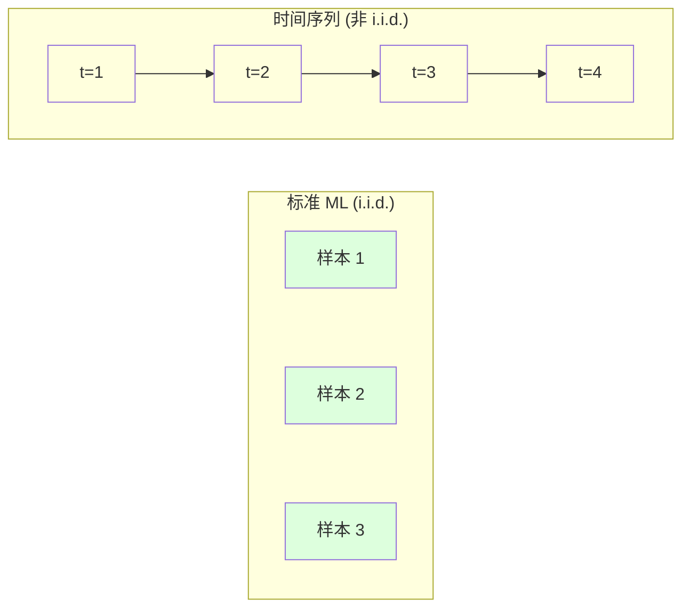
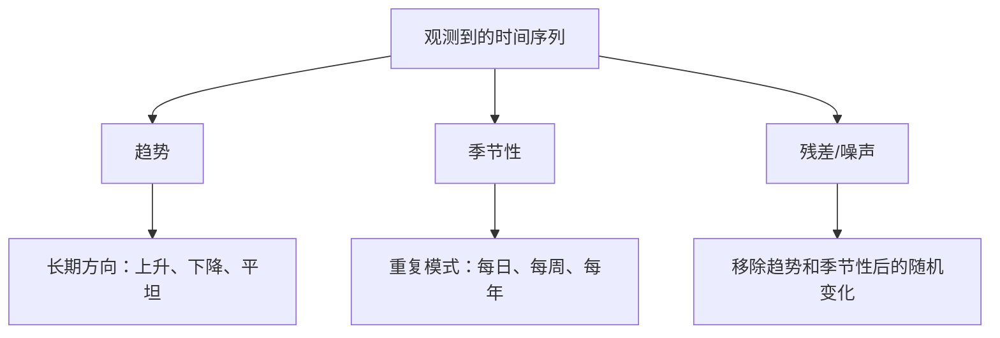
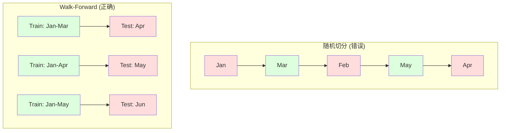

# Zamanı ve süresi

> Geçmişte yapılanlar gelecekte gerçekleşecek sonuçları tahmin edebiliyor.

**Type:** Build
**Language:**Python
**Prerequisites:** Phase 2, Lessons 01-09
**Time:** ~90 分钟

## Öğrenme hedefi

- Zaman dizisini trend, mevsimsel ve geride kalan bileşenlere ayırıp düzlük ve sabitliği kontrol edin.
- 滞留特征和滚动统计量实现, zaman sıralarını gözlem öğrenme sorunu olarak dönüştürmek
- Construct walk-forward validation  framework, preventing future data leakage to training
- Zaman dizisi için neden zaman tren/test bölümü geçersiz olduğunu açıklayın ve doğru zaman bölümü ile performans farkını gösterin.

## 问题

Zaman sıralamasındaki veriler var. Günde satışlar, saatlik sıcaklık, CPU kullanım hızı, haftalık hisseler fiyatı.

Standart ML 工具箱:随机火车/测试分割、横断验证、输入特征矩阵、输出预测──每一步都是错的──

Zaman dizisi, standartları kırar ve ML'ye bağlıdır. Örnekler bağımsız değildir. Bugünün sıcaklığı dün'in sıcaklığına bağlıdır.

Bir rastgele çapraz onaylama ile %95 doğruluk elde eden bir model, doğru zaman tabanlı değerlendirmelerle yalnızca %55 oranında olabilir. Bu fark teknik ayrıntı değildir.

Bu ders kapsamı temel içeriği: Zaman verileri ne farklı, nasıl dürüstçe değerlendirilebilir bir model ve zaman dizisini standart ML  modeline nasıl dönüştürülebilir özellikler olarak kullanılabilir.

## 概念

### Zamanın bir kısmı farklı mı ?

標準 ML 假设 i.i.d. -- 独立同分布── her örnek aynı dağılımdan çıkarılır, ayrıca diğer örneklere bağımsız olur.

- **不独立。**Bugünkü hisse senedi fiyatı dünki fiyatına bağlıdır.
- **不同分布。**Aralık ayının satış sayısı 3 ayın satışından farklı görünüyor.

Bu ihlaller hafif değildir. Özellikleri oluşturma şeklini, modellerin değerlendirilmesini ve hangi algoritmaları kullanabileceğinizi değiştirecektir.



Standart ML'de, örnekler birbirine değişebilir. Çoraplar hiçbir şeyi değiştirmez. Zaman dizisinde, sırası her şeydir.

### Zamanın bir parçası

Her zamanlı dizi aşağıdaki içeriğin bir parçasıdır:



- **趋势**:长期方向── gelir yılda %10 artıyor── küresel sıcaklık yükseldi──
- **季节性**Satışlar 12 aylık artışta. Hava koşullarının kullanım hızı 7 aylık zirve seviyesine ulaştı.
- **残差**: Değişiklik ve mevsimsellik sonrası kalan kısımları kaldırın.

### Düzgün

Eğer bir zaman dizisinin istatistik özellikleri (geçici değer, farklılık, öz-selliği) zamanla değişmezse, bu düz bir durumdur.

**为什么重要：**Düzensiz bir sıradaki ortalama değerler hareket eder. 1 aylık veriler üzerinde yapılan bir çalışmada öğrenilen ortalama değerler 2 aylık gösterilen ortalama değerlerden farklı olacaktır.

**如何检查：**Çekilme ortalamasını ve çekilme standart sapmalarını hesaplayın. Eğer onlar hareket ederse, sıralama düzlemsiz olacaktır.

**如何修复：**差分──不要建模原始值,而是建模连续值之间的变化:

```
diff[t] = value[t] - value[t-1]
```

Eğer bir kez farkı düzleştiremiyorsa, bir kez daha uygulamaya başlıyoruz.

**示例：**

原始序列:[100, 102, 106, 112, 120]
Bir sınıf farklılıkları: [2, 4, 6, 8](Hâlâ yukarı eğilimi içinde)
İki sınıf: [2, 2, 2](normal sayı -- 平稳)

İlk dizide ikinci bir eğilim vardır. Bir aşama onu doğrusal eğilimlere dönüştürür.

**形式化检验：**Geliştirilmiş Dickey-Fuller (ADF) testi, düz düz düzlüklü standart istatistik testidir. Asal varsayımlar, düzlüksiz sırada olmayan ︎ ︎ ︎ ︎ ︎ ︎ ︎ ︎ ︎ ︎ ︎ ︎ ︎ ︎ ︎ ︎ ︎ ︎ ︎ ︎ ︎ ︎ ︎ ︎ ︎ ︎ ︎ ︎ ︎ ︎ ︎ ︎ ︎ ︎ ︎ ︎ ︎ ︎ ︎ ︎ ︎ ︎ ︎ ︎ ︎ ︎ ︎ ︎ ︎ ︎ ︎ ︎ ︎ ︎ ︎ ︎ ︎ ︎ ︎ ︎ ︎ ︎ ︎ ︎ ︎ ︎ ︎ ︎ ︎ ︎ ︎ ︎ ︎ ︎ ︎ ︎ ︎ ︎ ︎ ︎ ︎ ︎ ︎ ︎ ︎ ︎ ︎ ︎ ︎ ︎ ︎ ︎ ︎ ︎ ︎ ︎ ︎ ︎ ︎ ︎ ︎ ︎ ︎ ︎ ︎ ︎ ︎ ︎ ︎ ︎ ︎ ︎ ︎ ︎ ︎ ︎ ︎ ︎ ︎ ︎ ︎ ︎ ︎ ︎ ︎ ︎ ︎ ︎ ︎ ︎ ︎ ︎ ︎ ︎ ︎ ︎ ︎ ︎ ︎ ︎ ︎ ︎ ︎ ︎ ︎ ︎ ︎ ︎ ︎ ︎ ︎ ︎ ︎ ︎ ︎ ︎ 

### Önemli

Öz ilişkili ölçüm zaman t'in değeri ile zaman t-k( geçen k 步) değerleri arasındaki ilişki derecesi.

**ACF 告诉你：**
- 序列能记住多远──如果ACF在5 后降至零,则5 步前的值无关紧要──
- Eğer ACF 12 aylık verilerde geri kalanda zirveye ulaşırsa, yıllık sezonluk vardır.
- ACF'nin göz ardı edilebilir hale gelene kadar kullanılması.

**PACF (Partial Autocorrelation Function)**Eğer bugün 3 天前 ile ilişkili ise, sadece 2 gün dün ile ilişkili olduğu için, o zaman 3'ün PACF'si sıfır, 3'ün ACF'si sıfır olmayacaktır.

### 滞后特征:把时间序列转换为监督学习

标准 ML 模型 features matrix X 和 target y y ⋅ time sequence only gives you a value──桥梁就是滞后特征──

取序列 [10, 12, 14, 13, 15],创建 lag-1 和 lag-2 Özellikleri:

| lag_2 | lag_1 | target |
|-------|-------|--------|
| 10    | 12    | 14     |
| 12    | 14    | 13     |
| 14    | 13    | 15     |

Şimdi sizde bir standart var Geri dönüş 问题── herhangi bir ML 模型──sız bir geri dönüş、hassasi orman、gradyen artışı) bunların tümünden geçiyor 预测 hedef──

Mühendislik yapmanız gereken diğer özellikler:
- **Rolling statistics:**Son k 个值的 mean、std、min、max
- **Calendar features:**# # Günaydın, # # hafta sonu #
- **Differenced values:**Öte yandan değişim
- **Expanding statistics:**累累计平均 累累计 sum
- **Ratio features:**当前值 / rolling mean (Yüksek değerden uzaklıkta)
- **Interaction features:*** haftanın gününün sonucu

**多少个 lag？**Otokorelasyon fonksiyonunu kullanın. ACF'ye kadar 10 gecikme belirginse, en az 10 gecikme kullanın.

**target 对齐陷阱。**                                                                                                                                                                                                                                                              

### İleride Değerlendirme

Bu ders için en önemli kavramdır. Standart k katlı çapraz onaylama.



Önceki onaylama:
1. Zamanın sonuna kadar eğitim
2. 预测时间 t+1(或用于多步预测的 t+1 到 t+k)
3. Çıkarım penceresi
4. Şiddetli

Her test katlaması sadece tüm antrenman verilerinin ardından gelen verileri içerir. Gelecekte bir sızıntı yok. Bu size modelin dağıtım sonrasında nasıl performans göstereceğini açıklayan dürüst bir tahmin verecektir.

**Expanding window**Tüm tarihi verileri kullanın.**Sliding window**Uygulamada, daha eski verilerin hâlâ geçerli olduğuna inanırken, genişlemeyi kullanın.

### ARIMA 直觉

ARIMA klasik zaman dizisi modelitir. Üç bileşeme sahiptir:

- **AR (Autoregressive):**Geçmiş değerinden tahmin yapılmaktadır.
- **I (Integrated):**通过差分实现平稳性──I(d) 应用 d 次差分──
- **MA (Moving Average):**Geçmişte yapılan tahmin hataları kullanmak için yapılan tahminleri kullanmak.

ARIMA(p, d, q) 组合了三者──你基于ACF/PACF 分析或自动搜索(auto-ARIMA)选择 p、d、q──

Arima'yı sıfırdan gerçekleştirmeyeceğiz. Bu sayısal optimizasyon gerektirir, bu sınıfın kapsamından çok daha fazlasını gerektirir.

### Ne zaman kullanıyorsun ?

| Approach | Best For | Handles Seasonality | Handles External Features |
|----------|---------|-------------------|------------------------|
| 滞后特征 + ML | 有很多外部特征的表格数据 | 通过 calendar features | 是 |
| ARIMA | 单个单变量序列、短期 | SARIMA 变体 | 否（ARIMAX 支持有限） |
| Exponential smoothing | 简单趋势 + 季节性 | 是（Holt-Winters） | 否 |
| Prophet | 业务预测、节假日 | 是（Fourier terms） | 有限 |
| Neural networks (LSTM, Transformer) | 长序列、多序列 | 学习得到 | 是 |

 Çoğu gerçek sorunun için, geriye gitme özellikleri + gradient artışı en güçlü başlangıç noktasıdır.

### 预测 Uçaklık ve strateji

单步预测会预测未来一个时间步――多步预测会预测多个时间步――有三种策略:

**Recursive (iterated):**预测 下一步,预测 sonucu olarak bir sonraki adımın girişini yapın. 简单,但错误会积累 - 每个预测都使用上一个预测,因此错误会复合――

**Direct:**Her ufukta  訓練獨立模型──Model-1 预测 t+1,Model-5 预测 t+5── hiçbir hata birikmedi, ama her modelin eğitim örneği daha az, ve onlar paylaşmaz bilgi──

**Multi-output:**訓練一个同时输出所有视野的模型──跨视野 共享信息,但需要支持多输出模型──或自定义 Loss Function──

                                                                                                                                                                                                                                                              

### Zaman sırasındaki sık görülen hatalar

| Mistake | Why it happens | How to fix |
|---------|---------------|-----------|
| 随机 train/test split | 来自标准 ML 的习惯 | 使用 walk-forward 或 temporal split |
| 使用未来特征 | 误把时间 t 的特征包含进去 | 审计每个特征的时间对齐 |
| 对季节性 overfitting | 模型记住了日历模式 | 在 test set 中留出一个完整季节周期 |
| 忽略尺度变化 | 收入翻倍但模式保持 | 建模百分比变化而非绝对值 |
| 过多滞后特征 | “更多历史更好” | 使用 ACF 确定相关 lag |
| 不做差分 | “模型会自己搞定” | 树模型能处理趋势；线性模型需要平稳性 |


```figure
f3-series-decompose
```

## Yapın onu.

`code/time_series.py`Orta kod, çekirdek yapısal blokları sıfırdan gerçekleştirdi.

### 滞后特征创建器

```python
def make_lag_features(series, n_lags):
    n = len(series)
    X = np.full((n, n_lags), np.nan)
    for lag in range(1, n_lags + 1):
        X[lag:, lag - 1] = series[:-lag]
    valid = ~np.isnan(X).any(axis=1)
    return X[valid], series[valid]
```

Bu 1D diziyi bir özellik matrisine dönüştürür, her satır sonuncu.`n_lags`个值作为特征,并以当前值作为目标──

### Yürümeye Devam eden Çarmıhlı Değerlendirme

```python
def walk_forward_split(n_samples, n_splits=5, min_train=50):
    assert min_train < n_samples, "min_train must be less than n_samples"
    step = max(1, (n_samples - min_train) // n_splits)
    for i in range(n_splits):
        train_end = min_train + i * step
        test_end = min(train_end + step, n_samples)
        if train_end >= n_samples:
            break
        yield slice(0, train_end), slice(train_end, test_end)
```

Her bölümde, eğitim verilerini test verilerinden önce sıkı şekilde kontrol etmelisiniz.

### 简单 Autoregressive 模型

純AR 模型就是滞后特征上線 regression:

```python
class SimpleAR:
    def __init__(self, n_lags=5):
        self.n_lags = n_lags
        self.weights = None
        self.bias = None

    def fit(self, series):
        X, y = make_lag_features(series, self.n_lags)
        # Solve via normal equations
        X_b = np.column_stack([np.ones(len(X)), X])
        theta = np.linalg.lstsq(X_b, y, rcond=None)[0]
        self.bias = theta[0]
        self.weights = theta[1:]
        return self
```

Bu kavramda, Ders 02'deki doğrusal gerileme ile tamamen aynıdır, sadece aynı değişkenliğin zaman geride kalan sürümlerinde uygulanmaktadır.

### Düzgün kontrol

代码计算 rolling statistics, görülebilirlik ve sayısal değerlendirme için düzeltme ve sabitliği değerlendirmek için kullanılır:

```python
def check_stationarity(series, window=50):
    rolling_mean = np.array([
        series[max(0, i - window):i].mean()
        for i in range(1, len(series) + 1)
    ])
    rolling_std = np.array([
        series[max(0, i - window):i].std()
        for i in range(1, len(series) + 1)
    ])
    return rolling_mean, rolling_std
```

Eğer yuvarlak ortalama 漂移或 yuvarlak std 变化,序列就是非平稳的──应用差分后再检查一次──

Kod aynı zamanda, bir diziyi karşılaştırma yaparak düzeltme ve sabitliği kontrol eder. Eğer ortalama değer farkı yarı standart farkın üzerinde veya düzeltme farkı iki katın üzerinde ise, diziler düzeltme olmayan olarak belirlenir.

### Önemli

```python
def autocorrelation(series, max_lag=20):
    n = len(series)
    mean = series.mean()
    var = series.var()
    acf = np.zeros(max_lag + 1)
    for k in range(max_lag + 1):
        cov = np.mean((series[:n-k] - mean) * (series[k:] - mean))
        acf[k] = cov / var if var > 0 else 0
    return acf
```

## Kullan

Bu şekilde, herhangi bir geri dönüşü sağlayabilirsiniz.

```python
from sklearn.linear_model import Ridge
from sklearn.ensemble import GradientBoostingRegressor

X, y = make_lag_features(series, n_lags=10)

for train_idx, test_idx in walk_forward_split(len(X)):
    model = Ridge(alpha=1.0)
    model.fit(X[train_idx], y[train_idx])
    predictions = model.predict(X[test_idx])
```

对于 ARIMA,使用统计模型:

```python
from statsmodels.tsa.arima.model import ARIMA

model = ARIMA(train_series, order=(5, 1, 2))
fitted = model.fit()
forecast = fitted.forecast(steps=30)
```

`time_series.py`İçinde iki yöntem gösterildi ve yürüyüşlü doğrulama kullanıldı  karşılaştırma yapıldı.

### sklearn Zaman Sıraları

sklearn                                                                                                                                                                                                                                                                                                                                                                                                                                                                                                                            `TimeSeriesSplit`- ...

```python
from sklearn.model_selection import TimeSeriesSplit

tscv = TimeSeriesSplit(n_splits=5)
for train_index, test_index in tscv.split(X):
    X_train, X_test = X[train_index], X[test_index]
    y_train, y_test = y[train_index], y[test_index]
    model.fit(X_train, y_train)
    score = model.score(X_test, y_test)
```

Bu bizim sıfırdan gerçekleştirdiğimizin değeriyle eşittir.`walk_forward_split`Ama bu, bir verifikasyon çerçevesinde yer aldı.`cross_val_score`Birinci kullanımı:

```python
from sklearn.model_selection import cross_val_score

scores = cross_val_score(model, X, y, cv=TimeSeriesSplit(n_splits=5))
print(f"Mean score: {scores.mean():.4f} +/- {scores.std():.4f}")
```

### 评估指标

时间序列预测使用 Regression 指标,但带有时间感知的上下文:

- **MAE (Mean Absolute Error):**Y_True - y_Prediksiyon'un ortalama değeri, basit birimle açıklanmaktadır.
- **RMSE (Root Mean Squared Error):**ortalama karelerinin karesi kökü. MAE'ye kıyasla, büyük hataların cezası daha ağırdır.
- **MAPE (Mean Absolute Percentage Error):*** 100'ün ortalama değerinin yanlışı / gerçek değeri, ölçüm ile ilgili değildir, farklı sıralamalara uygun değildir.
- **Naive baseline comparison:**始终与简单基线比较――季节性天才基线 会预测上一周期的值(昨天、上周) ・・・ Eğer modeliniz naifleri yenemezse, sorun olduğunu açıklayın。

### Çekilen Özellikler

Kod, geriye dönük özelliklere ekleme istatistiklerini göstermektedir. 7 天 ve 14 天 pencerelerindeki ortalama ̊std、min、max) ̊ bu özellikler, modellere yakın dönemde trend ve hareketlilik bilgilerini sağlarken, bu bilgiler sadece geriye dönük özelliklere dayanarak elde edilemez.

Örneğin, eğer yuvarlak ortalama yukarı çıkıyorsa, yukarı eğilimi var demektir. Eğer yuvarlak std artıyorsa, hareketlilik büyüyor demektir.

## - Söyle.

本课产 出:
- `outputs/prompt-time-series-advisor.md`-- bir zaman sorusu sorusu için bir ipucu
- `code/time_series.py`-- 滞后特征、前行验证、AR 模型、平稳性检查

### Başlangıç çizgisini yenmek zorundasın .

Bu modelden önce, önce bir temel oluşturun:

1. **Last value (persistence).**Yarınki gibi bugün de. Birçok dizi için bu, insan niyetinde yenilmek zor.
2. **Seasonal naive.**预测 Bugün de aynı gün, önceki hafta da aynı gün gibi... Eğer modelin onu yenemezse, sezon dışındaki herhangi bir faydalı model öğrenmediğini gösterir.
3. **Moving average.**预测 Son k 个值的平均值──能平滑噪音,但无法捕获突变──

Eğer üst düzey ML modeliniz mevsimsel saf bir temel çizgiyi verirse, size bir hata vardır. En sık görülmesi: özelliklerdeki gelecekteki sızıntılar, hata değerlendirme yöntemleri veya dizilerin kendisi gerçekten de rastlantı ve öngörülmez.

### 实用建议

1. **从绘图开始。**Herhangi bir modelden önce, önce orijinal sırayı çizin. Gelişmeler, mevsimler, dış görünüşler, yapısal kırıklıklar, davranışlarda ani değişiklikler arayın.

2. **先差分，再建模。**Eğer bir dizi belirgin bir eğilim varsa, oluşturma geride kalma özelliklerinden önce farkı yapın. Ağaç tabanlı modeller eğilimleri ele alabilir, ancak doğrusal modeller yapamaz ve fark genellikle kötü olmaz.

3. **至少留出一个完整季节周期。**Eğer haftalık bir test, test setinde en az bir hafta sürer. Eğer aylık bir test varsa, en az bir ay sürer.

4. **在生产中监控。** Dünya değişimiyle birlikte, zaman dizisi modeli zamanla geri döner.                                                                                                                                                                                                                                                       

5. **警惕 regime changes。**Epidemi öncesi veriler üzerinde yapılan eğitim modelleri, salgın sonrası davranışları tahmin edemezler. Bilinen rejim değişikliklerinin göstergesi olarak belirtileri ekleyerek veya unutulmuş eski verilerin kaydırma penceresini kullanarak.

6. **对偏斜序列做 log-transform。**收入、价格和计数通常右偏──取 log 可以稳定方差,并把乘法模式变成加法模式,从而让线性模型能够处理──在 log 空间预测,再取指数回到原始单位──

## 练习

1. **平稳性实验。**Bir çizgilik eğilimleri sırası oluşturmak. Dönüşüm istatistikleri kullanmak.

2. **Lag 选择。**Bu süre boyunca, bu süre boyunca, bu süre boyunca, bu süre boyunca, bu süre boyunca, bu süre boyunca, bu süre boyunca, bu süre boyunca, bu süre boyunca, bu süre boyunca, bu süre boyunca, bu süre boyunca, bu süre boyunca, bu süre boyunca, bu süre boyunca, bu süre boyunca, bu süre boyunca, bu süre boyunca, bu süre boyunca, bu süre boyunca, bu süre boyunca, bu süre boyunca, bu süre boyunca, bu süre boyunca, bu süre boyunca, bu süre boyunca, bu süre boyunca, bu süre boyunca, bu süre boyunca, bu süre boyunca, bu süre boyunca, bu süre boyunca, bu süre boyunca, bu süre boyunca, bu süre boyunca, bu süre boyunca, bu süre boyunca, bu süre boyunca, bu süre boyunca, bu süre boyunca, bu süre boyunca, bu süre boyunca, bu süre boyunca, bu süre boyunca, bu süre boyunca, bu süre boyunca, bu süre boyunca, bu süre boyunca, bu süre boyunca, bu süre boyunca, bu süreye kadar, süreye kadar, süreye kadar, süreye kadar, süreye kadar, süreye kadar, süreye kadar, süreye kadar, süreye kadar, süreye kadar, süreye kadar, süreye kadar, süreye kadar, süreye kadar, süreye kadar, süreye kadar, süreye kadar, süreye kadar, süreye kadar, daha fazla, daha fazla, daha fazla, daha fazla, daha fazla, daha fazla, daha fazla, daha fazla, daha fazla, daha fazla, daha fazla, daha fazla, daha fazla, daha fazla, daha fazla, daha fazla, daha fazla, daha fazla, daha fazla, daha fazla, daha fazla, daha fazla, daha fazla, daha fazla, daha fazla, daha fazla, daha fazla, daha fazla, daha fazla, daha fazla, daha fazla, daha fazla, daha fazla, daha fazla, daha fazla, daha fazla, daha fazla, daha fazla, daha, daha fazla, daha, daha, daha, daha fazla, daha, daha fazla, daha fazla, daha fazla, daha fazla, daha, daha, daha, daha, daha, daha, daha, daha, daha fazla, daha, daha, daha, daha, daha, daha, daha fazla, daha, daha, daha, daha, daha, daha, daha, daha, daha, daha fazlas, daha fazlas, daha, daha, daha, daha, daha, daha, daha fazlas, daha, daha, daha, daha, daha fazlas, daha, daha, daha, daha

3. **Walk-forward vs random split。**Gecikme özellikleri üzerinde eğitim Ridge geri dönüşü.

4. **特征工程。**Yukarıdaki değeri (fendi = 7)  Yukarıdaki değeri (fendi = 7)  Yukarıdaki değeri (fendi = 7)  Haftanın gününü  Yukarıdaki değeri  Yukarıdaki değeri  Yukarıdaki değeri  Yukarıdaki değeri  Yukarıdaki değeri  Yukarıdaki değeri  Yukarıdaki değeri  Yukarıdaki değeri  Yukarıdaki değeri  Yukarıdaki değeri  Yukarıdaki değeri  Yukarıdaki değeri  Yukarıdaki değeri  Yukarıdaki değeri  Yukarıdaki değeri  Yukarıdaki değeri  Yukarıdaki değeri  Yukarıdaki değeri  Yukarıdaki değeri  Yukarıdaki değeri  Yukarıdaki değeri  Yukarıdaki değeri  Yukarıdaki değeri  Yukarıdaki değeri  Yukarıdaki değeri  Yukarıdaki değeri  Yukarıdaki değeri  Yukarıdaki değeri  Yukarıdaki değeri  Yukarıken  Yukarıdaki değeri  Yukarıdaki değeri  Yukarı  Yukarı  Yukarı  Yukarıdaki değeri  Yukarı  Yukarı  Yukarı  Yukarı  Yukarı  Yukarı  Yukarı  Yukarı  Yukarı  Yukarı  Yukarı  Yukarı  Yukarı  Yukarı  Yukarı  Yukarı     Yukarı                                                                                                     

5. **多步预测。**修改 AR 模型,让它预测未来 5 步而不是 1 步──比较两种策略:(a) 预测一步,把预测作为下一步的输入(recursive),以及 (b) 为每个视野 训练单独模型(直接) ――哪个更准确?

## 关键术语

| Term | What people say | What it actually means |
|------|----------------|----------------------|
| Stationarity | “统计量不随时间变化” | 均值、方差和自相关结构随时间保持不变的序列 |
| Differencing | “连续值相减” | 计算 y[t] - y[t-1] 来移除趋势并实现平稳性 |
| Autocorrelation (ACF) | “一个序列与自身的相关程度” | 时间序列与自身滞后副本之间的相关性，作为 lag 的函数 |
| Partial autocorrelation (PACF) | “只有直接相关” | 移除所有更短 lag 的影响后，lag k 上的自相关 |
| Lag features | “把过去值作为输入” | 使用 y[t-1]、y[t-2]、...、y[t-k] 作为特征来预测 y[t] |
| Walk-forward validation | “尊重时间顺序的 cross-validation” | 训练数据在时间上始终先于测试数据的评估方式 |
| ARIMA | “经典时间序列模型” | AutoRegressive Integrated Moving Average：组合过去值（AR）、差分（I）和过去误差（MA） |
| Seasonality | “重复的日历模式” | 与日历周期（每日、每周、每年）相关的、规则且可预测的时间序列周期 |
| Trend | “长期方向” | 序列水平随时间持续上升或下降 |
| Expanding window | “使用所有历史” | 训练集随每个 fold 增长的 walk-forward validation |
| Sliding window | “固定大小的历史” | 训练集是向前滑动的固定长度窗口的 walk-forward validation |

## 延伸阅读

- [Hyndman and Athanasopoulos, Forecasting: Principles and Practice (3rd ed.)](https://otexts.com/fpp3/)--En iyi ücretsiz zamanlı programlar
- [scikit-learn Time Series Split](https://scikit-learn.org/stable/modules/generated/sklearn.model_selection.TimeSeriesSplit.html)- sklearn'ın ileriye doğru yürüyen bölücü
- [statsmodels ARIMA docs](https://www.statsmodels.org/stable/generated/statsmodels.tsa.arima.model.ARIMA.html)-- 带诊断的ARIMA 实现
- [Makridakis et al., The M5 Competition (2022)](https://www.sciencedirect.com/science/article/pii/S0169207021001874)-- 展示 ML 方法与统计方法大规模预测竞赛
