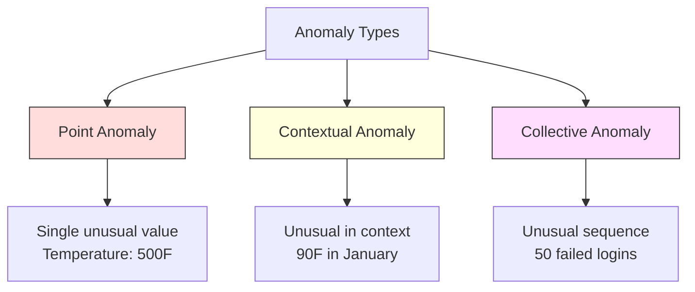
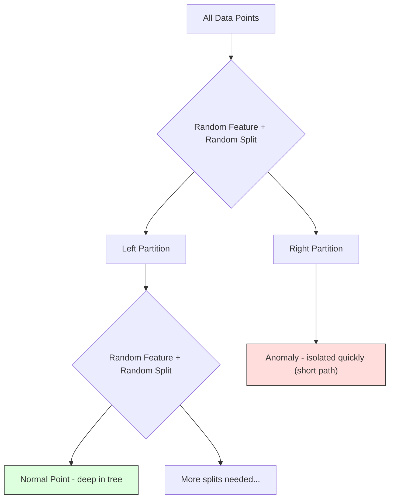
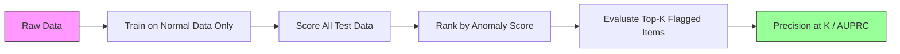

# Anomalyayı tespit etmek

> Normal                                                                                                                                                                                                                                                                                                                                                                                                                                                                                                                             

**Type:** Build
**Language:**Python
**Prerequisites:** Phase 2, Lessons 01-09
**Time:** ~75 minutes

## Öğrenme hedefi

- Z-Score'yi gerçekleştirmek, IQR ve İzolasyon Orman Anomaliyi Algılama Yöntemini
- 区分点、文脈和集体异常,并为每种选择合适的检测方法
- Anomaly Deteksiyonu normal veriye göre, anomalilere göre değil sınıflandırma olarak açıklanmaktadır.
- Gözetimsiz Anomali tespit ile denetimli sınıflandırma karşılaştırmak, yeni anomaliyi değerlendirmek  kapsamı ve doğruluk 

## 问题

Bir kredi kartı öğleden sonra 2 saat New York'ta kullanıldı, sonra öğleden sonra 2:05 saat Tokyo'da kullanıldı.

Bu tüm anomalilerdir. Onları bulmak önemlidir. Dolandırıcılık milyarlarca dolarlık kayıplara yol açar. Cihaz bozukluğu kapanma zamanına yol açar.

Çaban şu: Etiketlerle ilgili anomalilerin çok azı vardır Örnekler. Sahne sadece ticaretlerin %0,1'ünü oluşturuyor. Cihaz bozukluğu yılda sadece birkaç kez gerçekleşir. Standart sınıflandırıcıyı eğitemiyorsun, çünkü "anomali" sınıfında öğrenilebilir bir içerik yok.

Anomaly Detection Reversed the problem. Anomaly Detection. Sorun değişmiştir. Anomaly Detektion. Anomaly Detektion. Anomaly Detektion. Anomaly Detektion. Anomaly Detektion.

## 概念

### Anomalies'ın türü

Tüm anomaliler aynı değil:

- **Point anomalies.**单个数据点无论上下文如何都非常异常──500 度的温度读数──一个通常消费 $50 的账户发生 $50.000'in ticaretinin.
- **Contextual anomalies.**某数据点在给定下文下异常──90°夏季是正常,冬季是异常──同一个值,不同上下文──
- **Collective anomalies.**Bir grup veri noktası, bir bütün olarak sıradışıdır, her tek veri noktası normal olabilir bile.

Büyük çoğunlukla nokta anomalilerini kontrol etme yöntemleri.



### Gözetimsiz 表述

Standart Sınıflandırma'da, iki sınıf etiketlere sahipsiniz. Anomaly Deteksiyon'da, genellikle aşağıdaki üç durumdan birine rastlanır:

1. **Fully unsupervised.**完全没有标签──你在所有数据上配合探测器,并希望异常性 足够稀少,不会污染"正常"模型──
2. **Semi-supervised.**Sadece normal verileri içeren bir net veri kümesi vardır. Bu net veri kümesine yerleşir ve diğer tüm verilere göre bir bölüm oluşturur.
3. **Weakly supervised.**Etiketlerin az miktarda bozuklukları vardır. Onları eğitime değil değerlendirme için kullanır. Önce denetimsiz bir şekilde eğitilmek ve sonra etiketlerin üzerinde doğruluğu/içini çekmek için ölçmek için kullanılır.

关键洞见:Anomaly Detection and Classification There are substantive differences──you are building a distribution of normal data, rather than learning the decision boundary between two categories── Anomali Bulma ve Sınıflandırma Gerçek bir fark vardır.

### Gözetimli vs Gözetimsiz:权衡

Eğer gerçekten etiketleme anomalileri varsa, onları eğitime kullanmalı mıdır?

**Supervised（当作 Classification 处理）：**
- Daha önce gördüğün gerçek anormalliği yakalayabilir.
- Bilinen anormallik türleri için daha yüksek hassasiyet
- Yeni bir anomaliyi tamamen kaçırmış olacağım .
- Yeni bir anormallik ortaya çıktığında yeniden eğitilme gerekebilir.
- 需要足够多的异常示例(通常太少)

**Unsupervised（对 normal 建模，标记偏离项）：**
- 能捕捉任何偏离正常的情况,包括小说类型
- İhtiyacımız yok.
- Yanlış pozitif oran daha yüksek değil tüm alışılmadık şeyler kötüdür)
- Değişimi daha güçlü

實踐中,最好的系统会结合两者: 无监督检测 获得广覆盖, 监督模型 处理已知高优先级异常 类型,并让人工审查模糊案例──

### Z-Score 方法

En basit yöntem: Her özellikin ortalaması ve standart sapmalaması hesaplamak.

```text
z_score = (x - mean) / std
anomaly if |z_score| > threshold
```

默认 eşiği ise 3.0(Gaussian dağılım için normal verilerin %99.7'si 落在 3 个标准偏差范围内)

**优点：**简单――快速――可解释("Bu değer normalden uzakta 4,5 standart sapma vardır")

**缺点：**假设数据服从正常分布──对训练数据中的异值──敏感──异值 会移动 mean并增大STD,使它们更难被检测出来)──在多模分布上失效──

**适用场景：**Görevi büyüklüğü gösterme saat biçiminde dağılımın tek özelliği  Gözlem  servisçi yanıt zamanı  üretim farkı  sabit bir temel çizgi ile sensör okuma 

**失效场景：**Çok sayıda küme sayı (((iki ofis konumunun farklı bir başlangıç seviyesi var 温度) ]], sapmış veriler ((1 000 dolarlık işlem miktarında çok az görülüyor ama anormal değil) 、 eğitim merkezinde dış değerli veriler bulunmaktadır.

### IQR 方法

Z puanından daha sağlam, ortalama ve standart sapma yerine, kareler arası aralığı kullanmak.

```
Q1 = 25th percentile
Q3 = 75th percentile
IQR = Q3 - Q1
lower_bound = Q1 - factor * IQR
upper_bound = Q3 + factor * IQR
anomaly if x < lower_bound or x > upper_bound
```

默认因数 1,5 ⋅

**优点：**Bu değerler, %s'in güçlü olması için uygundur.

**缺点：**仅适用单变的 (单变的) 个特征 独立应用) 不能检测只有在特征中 一起考虑时才异常的异常性 (单变的) 个点在每个特征上单独看可能都是正常的,但在联合空间中是异常的) 

**实践说明：**IQR'de 1.5 faktörü, çubukların üzerinde yer alıyor. Çubukların üzerinde yer alıyor. Dışındaki nokta potansiyel dış değerlerdir.

### İzolasyon Ormanı

关键洞见:anomalies 数量少且与众不同. DATA'yı rastgele bölümlendirdiğinde,anomalies daha kolay ayrılır, sadece daha az rastgele bölünme gerektirir.



**工作方式：**
1. 构建许多随机树 (Bir orman)
2. Her düğümde, bir özelliği seçin ve bu özelliğin en az ve en fazla arasında bir bölme değerini seçin
3. 持续 bölünür, her nokta ayrı kalır, kendi yaprağında yer alır)
4. Tüm ağaçlarda anormallikler Üst ortalama yol uzunlukları daha kısa

**为什么有效：**Normal noktalar  yoğun bölgelerde bulunmaktadır. Bir noktayı komşularından ayırmak için birçok rastgele bölüme ihtiyaç vardır. Anomaliler  nadir bölgelerde bulunmaktadır.

Anomaly skor  tüm ağaçların ortalama yol uzunluğu üzerine,                                                                                                                                                                                                                                                                                                                                                                                                                                                                                                              

```
score(x) = 2^(-average_path_length(x) / c(n))
```

İçlerinden `c(n)`N 个 örneklerin beklenen yol uzunluğu──Score 接近 1 表示异常──Score 接近 0.5 表示正常──Score 接近 0 表示非常正常(位于密集集深处)。

**优点：**没有分布假设──适用于高尺寸──扩展性好(由于每棵使用子样本,所以相对样本大小是子线性)──处理混合特征类型──

**缺点：**難以處理密集區 中的異常 (masking effect) ──当许多特征无关的时,随机分断 效果较差──

**关键 hyperparameters：**
- `n_estimators`Ağaçlar sayı: ∼100 genellikle yeterince ∼ daha fazla ağaç daha sabit puanlar getirecek, ama hesaplama daha yavaş ∼
- `max_samples`Her ağacın örnekleri sayısı. Öntanımlı değer 256'dir. Daha küçük değerler, bir ağacın çok farklı olmasına neden olur.
- `contamination`: 预期异常比例── yalnızca ayar eşiği için kullanılır──不影响分 本身──

### Yerel dış değer faktörü (LOF)

LOF, bir noktayı çevreleyen yerel yoğunluğu komşularının çevreleyen yoğunluğuna karşılaştırır.

**工作方式：**
1. Her noktaya, en yakın komşularını bul.
2. 计算当地可达性密度 (Ülkeye ulaşabilme yoğunluğu)
3. Her noktanın yoğunluğunu komşularının yoğunluklarıyla karşılaştırın
4. Eğer bir noktanın yoğunluğu komşularından daha düşükse, bu daha dışkardır.

**LOF score：**
- LOF  yakın 1.0 gösterir komşuların yoğunluğu
- LOF büyük 1.0 göster yoğunluğu  komşulardan düşük(可能異常)
- LOF 远大于 1.0(例如 2.0+) denliğin belirgin olarak daha düşük olduğunu gösterir

"yerel" 部分至关重要── bir bölgeye iki kümeden oluşan bir veri kümesi düşünün: biri 1000 noktalı yoğun kümeden, diğeri ise 50 noktalı nadir kümeden oluşan bir bölge.

**优点：**检测 local anomalies (dışınlıklarındaki farklı noktaları bile bile)

**缺点：**Büyük veri kümesi üzerinde yavaş bir uygulama (O(n^2)) ◊ k'ın seçim duyarlılığı.

### Karşılaştırma

| Method | Assumptions | Speed | Handles High Dims | Detects Local Anomalies |
|--------|------------|-------|-------------------|------------------------|
| Z-score | Normal distribution | 非常快 | 是（逐 feature） | 否 |
| IQR | 无（逐 feature） | 非常快 | 是（逐 feature） | 否 |
| Isolation Forest | 无 | 快 | 是 | 部分 |
| LOF | Distance 有意义 | 慢 | 较差 | 是 |

### 评估挑战

评估 anomaly detectors vs. evalue classifiers daha zor:

- **Extreme class imbalance.**Eğer anomaliler %0.1'e ulaşırsa, tüm içerikleri "normal" olarak tahmin ederek %99.9'luk doğruluk elde edilir.
- **AUROC 具有误导性。**Şiddetli dengesizlik içinde. Şimdiki modelde de çoğu anomaliyi kaybediyor.
- **更好的 metrics：**Precision@k(top k 被标记项中的多少是真异常) 、AUPRC(precision-recall curve 下的面积),以及在固定 false positive rate 下的回忆──



### Anomaly Deteksiyon Boru hattı

实践中,Anomaly Detection  aşağıdaki iş akışı izleyin:

1. **收集 baseline data.**理想情况下, seçmek bir 您知道没有(或几乎没有) anomalies 的时期──
2. **Feature engineering.**İlk özellikler, elde edilen özellikler, döngü istatistikleri, zaman özellikleri, oranlar.
3. **训练 detector.**Ürünler: Ürünler: Ürünler: Ürünler: Ürünler: Ürünler: Ürünler: Ürünler: Ürünler: Ürünler: Ürünler: Ürünler: Ürünler: Ürünler: Ürünler: Ürünler: Ürünler: Ürünler: Ürünler: Ürünler: Ürünler: Ürünler: Ürünler: Ürünler: Ürünler: Ürünler: Ürünler: Ürünler: Ürünler: Ürünler: Ürünler: Ürünler: Ürünler: Ürünler: Ürünler: Ürünler: Ürünler: Ürünler: Ürünler: Ürünler: Ürünler: Ürünler: Ürünler: Ürünler: Ürünler: Ürünler: Ürünler: Ürünler: Ürünler: Ürünler: Ürünler: Ürünler: Ürünler: Ürünler: Ürünler: Ürünler: Ürünler: Ürünler: Ürünler: Ürünler: Ürünler: Ürünler: Ürünler: Ürünler: Ürünler: Ürünler:: Ürünler::::
4. **对新数据打分.**Her yeni gözlemde anormal bir puan elde edilir.
5. **Threshold selection.**选择分割off──这是业务决策:更高门意味着虚假报警更少,但错过异常更多──
6. **Alert and investigate.**İşaretlenen nokta, yapay inceleme veya otomatik cevaplama girişi.
7. **Feedback collection.**Kayıtlar gerçek anomaliler ve yanlış alarmlar olarak belirlenmiştir.

Pipeline 永遠不是" Done"──Data distributions 会漂移, new anomaly 类型 will appear, thresholds 也需要调整──把 Anomaly Detection 当作一个持续运行的系统,而不是一次性模型──


```figure
f3-anomaly-fence
```

## Yapın onu.

`code/anomaly_detection.py`Orta kod, Z puanı, IQR ve İzolasyon Ormanı'nı sıfırdan gerçekleştirdi.

### Z-Score Detektörü

```python
def zscore_detect(X, threshold=3.0):
    mean = X.mean(axis=0)
    std = X.std(axis=0)
    std[std == 0] = 1.0
    z = np.abs((X - mean) / std)
    return z.max(axis=1) > threshold
```

简单且向量化──如果任何特征 超过门值,就标记该点──

### IQR Detektörü

```python
def iqr_detect(X, factor=1.5):
    q1 = np.percentile(X, 25, axis=0)
    q3 = np.percentile(X, 75, axis=0)
    iqr = q3 - q1
    iqr[iqr == 0] = 1.0
    lower = q1 - factor * iqr
    upper = q3 + factor * iqr
    outside = (X < lower) | (X > upper)
    return outside.any(axis=1)
```

### İzolasyon Ormanını gerçekleştirmek

From zero realization version will build isolation trees, feature space  için rastgele bölüm:

```python
class IsolationTree:
    def __init__(self, max_depth):
        self.max_depth = max_depth

    def fit(self, X, depth=0):
        n, p = X.shape
        if depth >= self.max_depth or n <= 1:
            self.is_leaf = True
            self.size = n
            return self
        self.is_leaf = False
        self.feature = np.random.randint(p)
        x_min = X[:, self.feature].min()
        x_max = X[:, self.feature].max()
        if x_min == x_max:
            self.is_leaf = True
            self.size = n
            return self
        self.threshold = np.random.uniform(x_min, x_max)
        left_mask = X[:, self.feature] < self.threshold
        self.left = IsolationTree(self.max_depth).fit(X[left_mask], depth + 1)
        self.right = IsolationTree(self.max_depth).fit(X[~left_mask], depth + 1)
        return self
```

隔离某个点所需的路径长度决定它的异常分数――更短的路径表示更异常――

`IsolationForest`sınıfı 包装了多棵树:

```python
class IsolationForest:
    def __init__(self, n_estimators=100, max_samples=256, seed=42):
        self.n_estimators = n_estimators
        self.max_samples = max_samples

    def fit(self, X):
        sample_size = min(self.max_samples, X.shape[0])
        max_depth = int(np.ceil(np.log2(sample_size)))
        for _ in range(self.n_estimators):
            idx = rng.choice(X.shape[0], size=sample_size, replace=False)
            tree = IsolationTree(max_depth=max_depth)
            tree.fit(X[idx])
            self.trees.append(tree)

    def anomaly_score(self, X):
        avg_path = average path length across all trees
        scores = 2.0 ** (-avg_path / c(max_samples))
        return scores
```

Normalleşme faktörü`c(n)`n 个元素的二进制搜索树 中一次失败搜索的预期路径长度──等于`2 * H(n-1) - 2*(n-1)/n`, içinden `H`Bu normallaştırma, farklı büyüklükteki veri kümeleri arasında puanların karşılaştırılabilmesini sağlar.

### Demo 场景

代码生成多个测试场景:

1. **Single cluster with outliers.**2 boyutlu Gaussian kümesi, uzak merkezde yerleşik ve anomaliler içine yerleştirilmiştir.
2. **Multimodal data.**Üç farklı büyüklük ve yoğunluklu kümeler.
3. **High-dimensional data.**50 个特点,但异常只在其中5个特点上不同──测试方法是否能在特点子集中找到异常──

Her demo, tüm yöntemleri kullanıyor.

## Kullan

kullanmak için kullanmak için kullanmak için kullanmak için kullanmak için kullanmak için kullanmak için kullanmak için kullanmak için kullanmak için kullanmak için kullanmak için kullanmak için kullanmak için kullanmak için kullanmak için kullanmak için kullanmak için kullanmak için kullanmak için kullanmak için kullanmak için kullanmak için kullanmak için kullanmak için kullanmak için kullanmak için kullanmak için kullanmak için kullanmak için kullanmak için kullanmak için kullanmak için kullanmak için kullanmak için kullanmak için kullanmak için kullanmak için kullanmak için kullanmak için kullanmak için kullanmak için kullanmak için kullanmak için kullanmak için kullanmak için kullanmak için kullanmak için kullanmak için kullanmak için kullanmak için kullanmak için kullanmak için kullanmak için kullanmak için kullanmak için kullanmak için kullanmak için kullanmak için kullanmak için kullanmak için kullanmak için kullanmak için kullanmak için kullanmak için kullanmak için kullanmak için kullanmak için kullanmak için kullanmak için kullanmak için kullanmak için kullanmak için kullanmak için kullanmak için kullanmak için kullanmak için kullanmak için kullanmak için kullanmak için kullanmak için kullanmak için kullanmak için kullanmak için kullanmak için kullanmak için kullanmak için kullanmak için kullanmak için kullanmak için kullanmak için kullanmak için kullanmak için kullanmak için kullanmak için kullanmak için kullanmak için kullanmak için kullanmak için kullanmak için kullanmak için kullanmak için kullanmak için kullanmak için kullanmak için kullanmak için kullanmak için kullanmak için kullanmak için kullanmak için kullanmak için kullanmak için kullanmak için kullanmak için kullanmak için kullanmak için kullanmak için kullanmak için kullanmak için kullanmak için kullanmak için kullanmak için kullanmak için kullanmak için kullanmak için kullanmak için kullanmak için kullanmak için kullanmak için kullanmak için kullanmak için kullanmak için kullanmak için kullanmak için kullanmak için kullanmak için kullanmak için kullanmak için kullanmak için kullanmak için kullanmak için kullanmak için kullanmak için kullanmak için kullanmak için kullanmak için kullanmak için kullanmak için kullanmak için kullanmak için kullanmak için kullanmak için kullanmak için kullanmak için kullanmak için kullanmak için kullan

```python
from sklearn.ensemble import IsolationForest
from sklearn.neighbors import LocalOutlierFactor

iso = IsolationForest(n_estimators=100, contamination=0.05, random_state=42)
iso.fit(X_train)
predictions = iso.predict(X_test)

lof = LocalOutlierFactor(n_neighbors=20, contamination=0.05, novelty=True)
lof.fit(X_train)
predictions = lof.predict(X_test)
```

Dikkat edin.`contamination`设置预期异常例如──正确设置它很重要,太低会漏掉异常,太高会产生虚假报警──

`anomaly_detection.py`Ortalama kodlama aynı veriler üzerinde, sıfırdan gerçekleşen sürüm ile karşılaştırılır.

### sklearn Kirlilik parametri

Sklern 中的 `contamination`Parametre, nasıl devamlı anormallik puanlarını  dönüştürerek ikili tahminlerin eşiğine dönüştürmeyi karar verir.

```python
iso_5 = IsolationForest(contamination=0.05)
iso_10 = IsolationForest(contamination=0.10)
```

两者产生相同的异常分点――但`iso_5`%5'in en üst kısmını işaret ediyor.`iso_10`标记 top 10%── Eğer gerçek anormallik oranını bilmiyorsanız (通常不知道), 污染 将设置为"auto",并直接使用原分── false positives与 false negatives 之间的成本权衡根据 false positives与 false negatives 设置自己的门──

### Bir Sınıf SVM

另一个值得了解的未监督异常检测器──One-Class SVM 会在高维特空间中围绕正常数据 拟合一个边界(使用内核技巧)──

```python
from sklearn.svm import OneClassSVM

oc_svm = OneClassSVM(kernel="rbf", gamma="auto", nu=0.05)
oc_svm.fit(X_train)
predictions = oc_svm.predict(X_test)
```

`nu`Bir Sınıf SVM küçük ve orta seviyede çok iyi bir verim oluşturur, ancak çok büyük verilere genişletilmez.

### Otomatik kodlama yaklaşımı(预览)

Otomotik kodlama, normal verilerde normal biçimlerde yeniden yapılandırma hatası olan anormallikler vardır çünkü ağlar sadece normal biçimleri yeniden yapılandırmayı öğrenir.

Bu, 3 aşamada gerçekleşecek. Ama ilkeler aynı: Normal 建模, 标记偏离项.

### Anomaly Deteksiyonı Birleştir

Aynı şekilde, grup yöntemleri de sınıflandırmayı geliştirecektir.

1. 运行多个探测器(Z puanı、IQR、Yaplanma Orman、LOF)
2. Her detektörün puanları normalleşecek [0, 1]
3. Normal puanlar için ortalama
4. 标记平均 puanı 门值高于的点

Bu, yanlış pozitifleri azaltır, çünkü farklı yöntemlerin farklı başarısızlık modları vardır. Dört yöntem tarafından işaretlenen noktaların neredeyse kesinlikle anormal olduğu doğrudur.

Daha karmaşık takımlar, her detektörün tahminine göre güvenilirlik vermeye güç verir.

### 生产环境考虑

1. **Threshold drift.**漂移, fixed threshold 会过时――监控异常度分的分布,并定期调整――
2. **Alert fatigue.**Yanlış alarmlar 太多时,操作者会停止关注──先使用较高门
3. **Ensemble approach.**Üretim ortamında, birden fazla detektörü bir araya getirmek için birçok yöntem vardır. Sadece bir noktayı anormal olarak görüldüğünde işaretlenir. Bu, yanlış pozitifleri önemli ölçüde azaltır.
4. **Feature engineering.**İlk özellikler genellikle yeterli değildir. Ek olarak, istatistikler, oranlar, son olaydan beri zaman ve alan özel özellikler.
5. **Feedback loop.**İşaretli araştırmaları onayladığında veya reddettiğinde, bu kayıtları kontrol sistemleri tarafından belirtilen veriyi değerlendirilir ve geliştirilmek için kullanılır.

## - Söyle.

本课产 出:
- `outputs/skill-anomaly-detector.md`-- bir uygun algılayıcı seçmek için kullanılacak karar verim becerisi
- `code/anomaly_detection.py`-- Z-score ≠ IQR ≠ İzolasyon Ormanı, ≠ ≠ Sklern karşılığı

### 选择 Sınır

Anomaly score is连续值──你需要一个门值来做二进制决策──这是业务决策,不是技术决策──

İki olayı düşünün:
- **Fraud detection.**漏掉欺诈代价很高(拒付、客户信任) ――Yalancı alarmların maliyeti ise 5 分钟──人工分析师调查 5 分钟──将门设低以捕获更多欺诈,并接受更多假警报──
- **Equipment maintenance.**Yanlış alarm, bir kere durmak zorunda kalmak anlamına geliyor.$50,000。missed failure 意味着 $Bu maliyetleri dengelemek için 500.000'in yapılandırma eşiği ayarlandı.

İki durumda, en iyi eşiğin değerleri yanlış olumlu ile yanlış olumsuz arasındaki maliyet oranına bağlıdır.

###  üretim ortamına yayılma

对于生产环境中的实时异常检测:

1. **Batch training, online scoring.**定期(每日、每周) 短期正常データ 上訓練モデル── her yeni gözlem
2. **Feature computation must match.**Eğer 30 天 pencerenin döngülü istatistiklerini kullanıyorsanız, yeni gözlem için 30 天 tarih gerekir 計算機能──缓存需要歷史──
3. **Score distribution monitoring.**İzleme anomali puanları  Zamanla dağılım  Eğer ortalama puan yukarı taşınırsa, ya da veriler değişiyor, ya da model                                                                                                                                                                                                                                                                                                                                                                                                                                                                                           
4. **Explainability.**Bir anomaliyi işaret ettiğinde, nedenleri açıklayın. Z puanı: "Faktör X normalden yüksek 4,2 个 standart sapma".

## 练习

1. **Threshold tuning.**1.0'dan 5.0'e kadar 0.5 e kadar bir eşiği kullanın Z puanı dedektörü kullanın. Her eşiği çizin. Aşağıdaki doğruluk ve hatırlama. Verilerinizin en iyi dengesi nerede?

2. **Multivariate anomalies.** 2D 数据 oluşturmak, her bir özelliği 单独看都像正常, fakat birleşme anormaldir (örneğin, ana küme çaprazı noktalarından uzak) ;; gösterilen her özelliğin Z-score bu noktaları atır, ancak İzolasyon Ormanı 能捕捉它们──

3. **从零实现 LOF.**K-son komşuları kullanmak Local Outlier Factor'ı gerçekleştirmek. K=10 ve k=50 kullanmak, aynı verilerde ve sklearn'ın LocalOutlier Factor'ı ile karşılaştırmak.

4. **Streaming Anomaly Detection.**修改Z-score detektor,使其在流媒体设置中工作:随着新点到更新运行平均和变异(Welford'ın çevrimiçi algoritması)

5. **Real-world evaluation.**選取一帶有已知異常的資料集 (例如 Kaggle'ın kredi kartı sahtekarlığı)  precision@100、precision@500 和 AUPRC kullan 评估全部四种方法──哪种方法效果最好?为什么?

## 关键术语

| Term | 人们通常怎么说 | 它实际意味着什么 |
|------|----------------|----------------------|
| Anomaly | "Outlier，异常点" | 一个明显偏离 normal data 预期模式的数据点 |
| Point anomaly | "单个奇怪的值" | 一个无论上下文如何都异常的单独 observation |
| Contextual anomaly | "normal 值，错误上下文" | 一个在给定上下文（时间、位置等）下异常、但在另一个上下文中可能 normal 的 observation |
| Isolation Forest | "用 random splits 找 outliers" | 一种 random trees 的 ensemble，它能用比 normal points 更少的 splits 隔离 anomalies |
| Local Outlier Factor | "把 density 和 neighbors 比较" | 一种标记 local density 明显低于其 neighbors density 的点的方法 |
| Z-score | "距离 mean 的 standard deviations 数" | (x - mean) / std，用 standard deviation 为单位衡量某个点距离中心有多远 |
| IQR | "Interquartile range" | Q3 - Q1，衡量数据中间 50% 的 spread，用于 robust outlier detection |
| Contamination | "预期 anomalies 比例" | 一个 hyperparameter，用于告诉 detector 应该将数据中多大比例标记为 anomalous |
| Precision@k | "top k flags 中有多少是真的" | 只在 k 个最可疑点上计算的 precision，适用于 imbalanced Anomaly Detection |
| AUPRC | "Precision-recall curve 下的面积" | 一个汇总所有 thresholds 下 precision-recall 表现的 metric，对 imbalanced data 比 AUROC 更好 |

## 延伸阅读

- [Liu et al., Isolation Forest (2008)](https://cs.nju.edu.cn/zhouzh/zhouzh.files/publication/icdm08b.pdf)-- 原始 İzolasyon Orman 论文
- [Breunig et al., LOF: Identifying Density-Based Local Outliers (2000)](https://dl.acm.org/doi/10.1145/342009.335388)-- 原始 LOF 论文
- [scikit-learn Outlier Detection docs](https://scikit-learn.org/stable/modules/outlier_detection.html)-- Tüm Sklern anomali algılayıcılarının genel tarifi
- [Chandola et al., Anomaly Detection: A Survey (2009)](https://dl.acm.org/doi/10.1145/1541880.1541882)-- Anomaly Detection 方法の综合综述
- [Goldstein and Uchida, A Comparative Evaluation of Unsupervised Anomaly Detection Algorithms (2016)](https://journals.plos.org/plosone/article?id=10.1371/journal.pone.0152173)-- Gerçek verilerde 10 farklı yöntemle karşılaştırma
