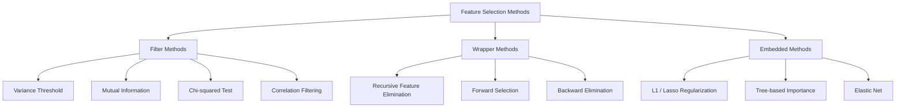
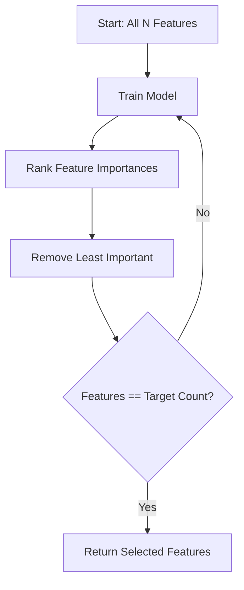
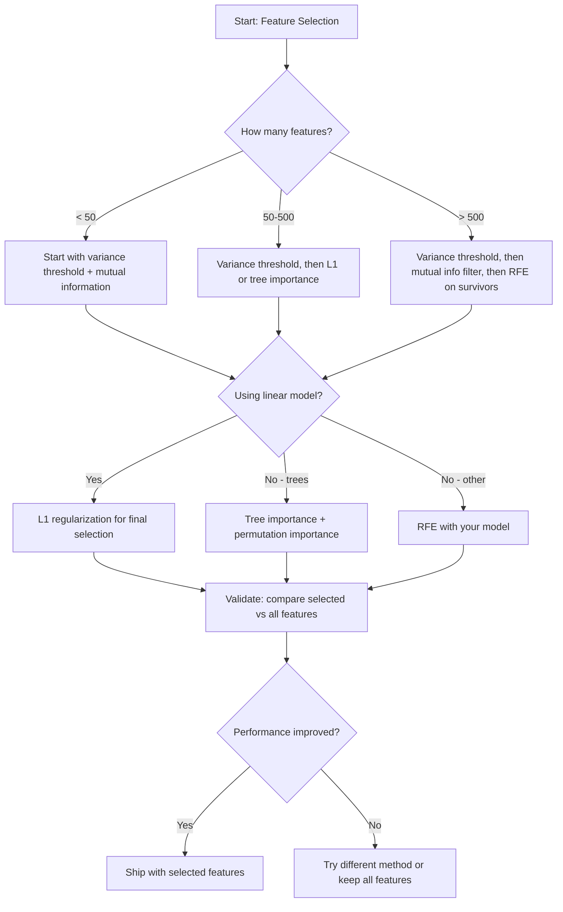

# Özellik Seçimi

> Daha fazla özellik daha iyi değil.

**Type:** Build
**Language:**Python
**先修要求：**Eğitimler: 1. bölüm, 2. bölüm, 1. bölüm, 1. bölüm, 2. bölüm, 1. bölüm, 1. bölüm, 2. bölüm, 1. bölüm, 1. bölüm, 2. bölüm, 1. bölüm, 1. bölüm, 2. bölüm, 1. bölüm, 1. bölüm, 1. bölüm, 2. bölüm, 1. bölüm, 2. bölüm, 1. bölüm, 2. bölüm, 1. bölüm, 2. bölüm, 1. bölüm, 2. bölüm, 2. bölüm, 2. bölüm, 1. bölüm, 1. bölüm, 2. bölüm, 2. bölüm, 2. bölüm, 1. bölüm, 2. bölüm, 1. bölüm, 2. bölüm, 2. bölüm, 2. bölüm, 2. bölüm, 1. bölüm, 2. bölüm, 2. bölüm, 1. bölüm, 2. bölüm, 2. bölüm, 1. bölüm, 2. bölüm, 2. bölüm, 2. bölüm, 2. bölüm, 2. bölüm, 2. bölüm, 2. bölüm, 2. bölüm, 2. bölüm, 2. bölüm, 2. bölüm, 2. bölüm, 2. bölüm, 2. bölüm, 2. bölüm, 2. bölüm, 2. bölüm, 2. bölüm, 2. bölüm, 2. bölüm, 2. bölüm, 2. bölüm, 2. bölüm, 2. bölüm, 2. bölüm, 3. bölüm, 3. bölüm, 3. bölüm, 3. bölüm, 3. bölüm, 3. bölüm, 3. bölüm, 3. bölüm, 3. bölüm, 3. bölüm, 3. bölüm, 5. bölüm.
**Time:** ~75 分钟

## Öğrenme hedefi
- 0 gerçekleştirmek filtresi yöntemleri (varians eşiği, karşılıklı bilgi, çikre) ve sarma yöntemleri (RFE, ileri seçimi)
-                                                                                                                                                                                                                                                                                                                                                                                                                                                                                                                              
- L1 düzenlenmesi (sırılı seçim) ile RFE (sırılı seçim) karşılaştırın,并评估它们的计算权衡
- Bir çok yöntemi birleştiren bir özellik seçimi borusu oluşturmak, ve bunu tutulan veriler üzerinde genelleşmenin etkisini geliştirmek

## 问题
500 özellik var. Modeliniz çok yavaş çalışıyor, sık sık aşırıya kaçıyor ve kimse ne öğrendiklerini açıklayamıyor. Sürekli daha fazla özellik ekliyorsunuz.

Bu, boyutsuzluk lanetinin gerçek bir göstergesidir. Sayı artışıyla birlikte, özellik alanının büyüklüğü patlayıcı olarak büyüyor. Verim noktaları arasındaki mesafe nadirleşmektedir.

Özellik seçimi, 解药──剥离噪声──移除冗長性──保留那些真正携带目标信息的特征──结果是:训练更快、通化更好,并且模型真的可以解释──

Amaç, tüm mevcut bilgileri kullanmak değil, doğru bilgileri kullanmaktır.

## 概念
### Özellik Seçimi

Her türlü özellik seçimi 方法都属于以下三类之一:



**Filter methods**打分──它们不使用模型──速度快,但会漏掉功能相互作用──

**Wrapper methods**訓練モデル 訓練モデル 訓練モデル 訓練モデル 訓練モデル 訓練モデル 訓練モデル 訓練モデル 訓練モデル 訓練モデル 訓練モデル 訓練モデル 訓練モデル 訓練モデル 訓練モデル 訓練モデル 訓練モデル 訓練モデル 訓練モデル 訓練モデル 訓練モデル 訓練モデル 訓練モデル 訓練モデル 訓練モデル 訓練モデル 訓練モデル 訓練モデル 訓練モデル 訓練モデル 訓練モデル 訓練モデル 訓練モデル 訓練モデル 訓練モデル 訓練モデル 訓練モデル 訓練モデル 訓練モデル 訓練モデル 訓練モデル 訓練モデル 訓練モデル 訓練モデル 訓練 訓練モデル 訓練 訓練モデル 訓練 訓練 訓練 訓練 訓練 訓練 訓練 訓練 訓練 訓練 訓練 訓練 訓練 訓練 訓練 訓練 訓練 訓練 訓練 訓練 訓練 訓練 訓練 訓練 訓練 訓練 訓練 訓練 訓練 訓練 訓練 訓練 訓練 訓練 訓練 訓練 訓練 訓練 訓練 訓練 訓練 訓練 訓練 訓練 訓練 訓練 訓練 訓練 訓練 訓練 訓練 訓練 訓練 訓練 訓練 訓練 訓練 訓練 訓練 訓練 訓練 訓練 訓練 訓練 訓練 訓練 訓練 訓練 訓練 訓練 訓練 訓練 訓練 訓練 訓練 訓練 訓練 訓練 報酬 報酬 報酬 報酬 報酬 報酬 報酬 報酬 報酬 報酬 報酬 報酬 報酬 報酬 報酬 報酬 報酬 報酬 報酬 報酬 報酬 報酬 報酬 報酬 報酬 報酬 報酬 報酬 報酬 報酬 報酬 報酬 報酬 報酬 報酬 報酬 報酬

**Embedded methods**Model eğitim sürecinde özellikleri seçmek. L1 düzenlenmesi. Ağırlıkları 零 ∞'ye doğru yönlendirecek. Karar ağaçları en yararlı özelliklere dayalı olarak bölünmüş olacak. Seçim, tek bir adım olarak değil, ∞'ye uygun bir süreçte gerçekleşecek.

### Değişiklik Eğitimi

En basit filtre: Eğer bir özellik örnekler arasında neredeyse değişmezse, neredeyse bilgi taşımaz.

◊ bir özelliği düşünün, 1000 örnekten 999'u 0.0'dur. ◊ 0'ya yakın varyansı vardır. ◊ 0'ya yakın varansı vardır.

```
variance(x) = mean((x - mean(x))^2)
```

设置一个门️ (例如0.01) ・抛弃每个变异 低于这个门的特征――, bu, hedef değişkenleri tamamen görmezden gelmeden sabit veya neredeyse sabit özellikleri taşımak durumunda olacaktır──

Usescenes: Diğer yöntemlerden önceki önceden işleme aşaması olarak neredeyse hiç maliyetle açıkça işe yaramaz özellikleri yakalar.

 sınırlama: bir özellik yüksek bir değişkenlik olabilir, ancak hala saf bir gürültü vardır.

### Karşılıklı Bilgi

Karşılıklı bilgi  Ölçmek Bilinç X'in değerinin hedefi Y'nin belirsizliğini ne ölçüde azaltabilmesi mümkün.

```
I(X; Y) = sum_x sum_y p(x, y) * log(p(x, y) / (p(x) * p(y)))
```

Eğer X 和 Y 独立,则 p(x, y) = p(x) * p(y), bu nedenle log 项为零,I(X; Y) = 0。X 能告诉你越多关于Y 的信息,相互信息就越高。

Önemli avantajları: Karşılıklı bilgi, ışıksız ilişkileri yakalayabilir. Bir özellik, hedef ile ilişkiyi sıfır olarak görebilir.

 Sürekli özellikler için, önce 成 binleri ayırt edelim.                                                                                                                                                                                                                                                       


### Tekrarlı Özelliklerin Yok edilmesi (RFE)

RFE bir ambalaj yöntemi olarak kullanılır.

1. kullanın tüm özellikleri 訓練モデル
2. 按重量对特征 排名(linear modeller kullanmak,koefisienler kullanmak, ağaçlar kullanmak, kirlilik azaltmak)
3. 移除最不重要特征 (En önemli özellik)
4. 重复, until remaining期望 sayısının özellikleri



RFE özellik etkileşimlerini düşünür, çünkü model aynı anda tüm kalan özellikleri görür. Bir özellik çıkarmak diğer özelliklerin önemini değiştirir. Bu, filtre yöntemlerinden daha tamamen farklı hale getirir.

成本:You need to train model N - target 次。 500 özellik için 目標 为 10 durumunda, 490 kez eğitim için ⇒ 490 kez eğitim için ⇒ 490 kez eğitim için ⇒ 490 kez eğitim için ⇒ 490 ⇒ 490 ⇒ 5 ⇒ 5 ⇒ 5 ⇒ 5 ⇒ 5 ⇒ 5 ⇒ 5 ⇒ 5 ⇒ 5 ⇒ 5 ⇒ 5 ⇒ 5 ⇒ 5 ⇒ 5 ⇒ 5 ⇒ 5 ⇒ 5 ⇒ 5 ⇒ 5 ⇒ 5 ⇒ 5 ⇒ 5 ⇒ 5 ⇒ 5 ⇒ 5 ⇒ 5 ⇒ 5 ⇒ 5 ⇒ 5 ⇒ 5 ⇒ 5 ⇒ 5 ⇒ 5 ⇒ 5 ⇒ 5 ⇒ 5 ⇒ 5 ⇒ 5 ⇒ 5 ⇒ 5 ⇒ 5 ⇒ 5 ⇒ 6 ⇒ 6 ⇒ 6 ⇒ 6 ⇒ 6 ⇒ 6 ⇒ 6 ⇒ 6 ⇒ 6 ⇒ 6 ⇒ 6 ⇒ 6 ⇒ 6 ⇒ 6 ⇒ 6 ⇒ 6 ⇒ 6 ⇒ 6 ⇒ 6 ⇒ 6 ⇒ 6 ⇒ 6 ⇒ 6 ⇒ 6 ⇒ 6 ⇒ 6 ⇒ 6 ⇒ 6 ⇒ 6 ⇒ 6 ⇒ 6 ⇒ 6 ⇒ 6 ⇒ 6 ⇒ 6 ⇒ 6 ⇒ 6 ⇒ 6 ⇒ 6 ⇒ 6 ⇒ 6 ⇒ 6 ⇒ 6 ⇒ 6 ⇒ 6 ⇒ 6 ⇒ 6 ⇒ 6 ⇒ 6 ⇒ 6 ⇒ 6 ⇒ 6 ⇒ 6 ⇒ 6 ⇒ 6 ⇒ 6 ⇒ 6 ⇒ ⇒ ⇒ ⇒ ⇒ ⇒ ⇒ ⇒ ⇒ ⇒ ⇒ ⇒ ⇒ ⇒ ⇒ ⇒ ⇒ ⇒ ⇒ ⇒ ⇒ ⇒ ⇒ ⇒ ⇒ ⇒ ⇒ ⇒ ⇒ ⇒ ⇒ ⇒ ⇒ ⇒ ⇒ ⇒ ⇒ ⇒ ⇒ ⇒ ⇒ ⇒ ⇒ ⇒    ⇒ ⇒   ⇒ ⇒ ⇒    ⇒ ⇒     ⇒ ⇒     ⇒       ⇒                        

### L1 (Lasso) Düzenleme

L1 düzenleme 会把重量的绝对值加入 Loss Fonksiyonu:

```
loss = prediction_error + alpha * sum(|w_i|)
```

Alfa 参数 kontrol özellikleri 被剪枝的激进程度──alfa 越高,越多重量 会精确变成零──

L1 cezası ağırlık alanında bir 形束区域ı oluşturur. En iyi çözümü genellikle bu 形ün köşesinde düşer. Orada bir veya daha fazla ağırlık vardır.

İşte gömülü özellik seçimi: model eğitim sırasında hangi özellikleri ımpar edilmelidir ⋅ ağırlık ⋅ sıfır özellikler ⋅ kaldırılması ⋅ fiyatı ⋅

优势: sadece bir antrenman yapmanız gerekiyor, 能处理 correlated features (→                                                                                                                                                                                                                                                     

 sınırlama: sadece doğrusal modeller için uygundur.

### Ağaç Temelindeki Özelliklerin Önemi

Karar ağaçları  ve ansamblları  rastgele ormanlar  gradyent artışı)  排名 排名                                                                                                                                                                                                                                               

                                                                                                                                                                                                                                                              

```
importance(feature_j) = (1/T) * sum over all trees of
    sum over all nodes splitting on feature_j of
        (n_samples * impurity_decrease)
```

Bu, her özellik için normallendirilmiş önem puanı verir.

Dikkat:Ağaç temelli önem 会偏向具有许多独特值的特征 (高 Cardinality) 〔随机 ID 列会显得重要,因为它能完美分割每样品〕

### Permutasyon Önemliliği

Bir model-agnostik 方法:

1. 訓練 modeli, ve onay verileri 上記録基ライン performans
2. Her özellik için: Her zaman karıştıran değerleri, ölçüm performansının düşüşü
3. Aşağıya düşen, bu özellik daha önemli.

Eğer bir özellik karıştığı zaman performansını bozmazsa, modelin buna bağlı olmadığını gösterir.

Değişiklik önemi  ağaç tabanlı önemin kardinallik önyargısını önledi. Ancak bu çok yavaş: Her özellik bir kez tam bir değerlendirme gerektirir ve sabitlik elde etmek için birkaç kez tekrar edilmelidir.

### Karşılaştırma Tablosu

| Method | Type | Speed | Nonlinear | Feature Interactions |
|--------|------|-------|-----------|---------------------|
| Variance threshold | Filter | 非常快 | 否 | 否 |
| Mutual information | Filter | 快 | 是 | 否 |
| Correlation filter | Filter | 快 | 否 | 否 |
| RFE | Wrapper | 慢 | 取决于 model | 是 |
| L1 / Lasso | Embedded | 快 | 否（linear） | 否 |
| Tree importance | Embedded | 中等 | 是 | 是 |
| Permutation importance | Model-agnostic | 慢 | 是 | 是 |

### Karar Akış Çizelgesi




```figure
f3-feature-prune
```

## Yapın onu.
### 步骤 1: Bilinen özellik yapısı ile sentetik verileri oluştur

```python
import numpy as np


def make_feature_selection_data(n_samples=500, seed=42):
    rng = np.random.RandomState(seed)

    x1 = rng.randn(n_samples)
    x2 = rng.randn(n_samples)
    x3 = rng.randn(n_samples)
    x4 = x1 + 0.1 * rng.randn(n_samples)
    x5 = x2 + 0.1 * rng.randn(n_samples)

    informative = np.column_stack([x1, x2, x3, x4, x5])

    correlated = np.column_stack([
        x1 * 0.9 + 0.1 * rng.randn(n_samples),
        x2 * 0.8 + 0.2 * rng.randn(n_samples),
        x3 * 0.7 + 0.3 * rng.randn(n_samples),
        x1 * 0.5 + x2 * 0.5 + 0.1 * rng.randn(n_samples),
        x2 * 0.6 + x3 * 0.4 + 0.1 * rng.randn(n_samples),
    ])

    noise = rng.randn(n_samples, 10) * 0.5

    X = np.hstack([informative, correlated, noise])
    y = (2 * x1 - 1.5 * x2 + x3 + 0.5 * rng.randn(n_samples) > 0).astype(int)

    feature_names = (
        [f"info_{i}" for i in range(5)]
        + [f"corr_{i}" for i in range(5)]
        + [f"noise_{i}" for i in range(10)]
    )

    return X, y, feature_names
```

Biz biliyoruz temel gerçek: 0-4 özellikleri bilgilendirici( ve 3 和 4  0 和 1'nin ilişkili kopyaları), 5-9 özellikleri bilgilendirici özelliklerle                                                                                                                                                                                                                                                                                                                                                                                                                                                                                        

### 步骤 2: Değişiklik eşiği

```python
def variance_threshold(X, threshold=0.01):
    variances = np.var(X, axis=0)
    mask = variances > threshold
    return mask, variances
```

### 步骤 3: karşılıklı bilgi (diskret)

```python
def discretize(x, n_bins=10):
    min_val, max_val = x.min(), x.max()
    if max_val == min_val:
        return np.zeros_like(x, dtype=int)
    bin_edges = np.linspace(min_val, max_val, n_bins + 1)
    binned = np.digitize(x, bin_edges[1:-1])
    return binned


def mutual_information(X, y, n_bins=10):
    n_samples, n_features = X.shape
    mi_scores = np.zeros(n_features)

    y_vals, y_counts = np.unique(y, return_counts=True)
    p_y = y_counts / n_samples

    for f in range(n_features):
        x_binned = discretize(X[:, f], n_bins)
        x_vals, x_counts = np.unique(x_binned, return_counts=True)
        p_x = dict(zip(x_vals, x_counts / n_samples))

        mi = 0.0
        for xv in x_vals:
            for yi, yv in enumerate(y_vals):
                joint_mask = (x_binned == xv) & (y == yv)
                p_xy = np.sum(joint_mask) / n_samples
                if p_xy > 0:
                    mi += p_xy * np.log(p_xy / (p_x[xv] * p_y[yi]))
        mi_scores[f] = mi

    return mi_scores
```

### 步骤 4: Tekrarlı Özelliklerin Yıkılması

```python
def simple_logistic_importance(X, y, lr=0.1, epochs=100):
    n_samples, n_features = X.shape
    w = np.zeros(n_features)
    b = 0.0

    for _ in range(epochs):
        z = X @ w + b
        pred = 1.0 / (1.0 + np.exp(-np.clip(z, -500, 500)))
        error = pred - y
        w -= lr * (X.T @ error) / n_samples
        b -= lr * np.mean(error)

    return w, b


def rfe(X, y, n_features_to_select=5, lr=0.1, epochs=100):
    n_total = X.shape[1]
    remaining = list(range(n_total))
    rankings = np.ones(n_total, dtype=int)
    rank = n_total

    while len(remaining) > n_features_to_select:
        X_subset = X[:, remaining]
        w, _ = simple_logistic_importance(X_subset, y, lr, epochs)
        importances = np.abs(w)

        least_idx = np.argmin(importances)
        original_idx = remaining[least_idx]
        rankings[original_idx] = rank
        rank -= 1
        remaining.pop(least_idx)

    for idx in remaining:
        rankings[idx] = 1

    selected_mask = rankings == 1
    return selected_mask, rankings
```

### 步骤 5: L1 özellik seçimi

```python
def soft_threshold(w, alpha):
    return np.sign(w) * np.maximum(np.abs(w) - alpha, 0)


def l1_feature_selection(X, y, alpha=0.1, lr=0.01, epochs=500):
    n_samples, n_features = X.shape
    w = np.zeros(n_features)
    b = 0.0

    for _ in range(epochs):
        z = X @ w + b
        pred = 1.0 / (1.0 + np.exp(-np.clip(z, -500, 500)))
        error = pred - y

        gradient_w = (X.T @ error) / n_samples
        gradient_b = np.mean(error)

        w -= lr * gradient_w
        w = soft_threshold(w, lr * alpha)
        b -= lr * gradient_b

    selected_mask = np.abs(w) > 1e-6
    return selected_mask, w
```

### 步骤 6: Ağaç temelli önem (sadece karar ağacı)

```python
def gini_impurity(y):
    if len(y) == 0:
        return 0.0
    classes, counts = np.unique(y, return_counts=True)
    probs = counts / len(y)
    return 1.0 - np.sum(probs ** 2)


def best_split(X, y, feature_idx):
    values = np.unique(X[:, feature_idx])
    if len(values) <= 1:
        return None, -1.0

    best_threshold = None
    best_gain = -1.0
    parent_gini = gini_impurity(y)
    n = len(y)

    for i in range(len(values) - 1):
        threshold = (values[i] + values[i + 1]) / 2.0
        left_mask = X[:, feature_idx] <= threshold
        right_mask = ~left_mask

        n_left = np.sum(left_mask)
        n_right = np.sum(right_mask)

        if n_left == 0 or n_right == 0:
            continue

        gain = parent_gini - (n_left / n) * gini_impurity(y[left_mask]) - (n_right / n) * gini_impurity(y[right_mask])

        if gain > best_gain:
            best_gain = gain
            best_threshold = threshold

    return best_threshold, best_gain


def tree_importance(X, y, n_trees=50, max_depth=5, seed=42):
    rng = np.random.RandomState(seed)
    n_samples, n_features = X.shape
    importances = np.zeros(n_features)

    for _ in range(n_trees):
        sample_idx = rng.choice(n_samples, size=n_samples, replace=True)
        feature_subset = rng.choice(n_features, size=max(1, int(np.sqrt(n_features))), replace=False)

        X_boot = X[sample_idx]
        y_boot = y[sample_idx]

        tree_imp = _build_tree_importance(X_boot, y_boot, feature_subset, max_depth)
        importances += tree_imp

    total = importances.sum()
    if total > 0:
        importances /= total

    return importances


def _build_tree_importance(X, y, feature_subset, max_depth, depth=0):
    n_features = X.shape[1]
    importances = np.zeros(n_features)

    if depth >= max_depth or len(np.unique(y)) <= 1 or len(y) < 4:
        return importances

    best_feature = None
    best_threshold = None
    best_gain = -1.0

    for f in feature_subset:
        threshold, gain = best_split(X, y, f)
        if gain > best_gain:
            best_gain = gain
            best_feature = f
            best_threshold = threshold

    if best_feature is None or best_gain <= 0:
        return importances

    importances[best_feature] += best_gain * len(y)

    left_mask = X[:, best_feature] <= best_threshold
    right_mask = ~left_mask

    importances += _build_tree_importance(X[left_mask], y[left_mask], feature_subset, max_depth, depth + 1)
    importances += _build_tree_importance(X[right_mask], y[right_mask], feature_subset, max_depth, depth + 1)

    return importances
```

### 步骤 7: Tüm yöntemleri çalıştırın ve karşılaştırın

代码文件会在同一合成数据集上运行全部五种方法,并打印一个比较表,显示每个方法选择了哪些功能──

## Kullan
Sikit-learn kullan 时, özellik seçimi 已内置到管eline 中:

```python
from sklearn.feature_selection import (
    VarianceThreshold,
    mutual_info_classif,
    RFE,
    SelectFromModel,
)
from sklearn.linear_model import Lasso, LogisticRegression
from sklearn.ensemble import RandomForestClassifier

vt = VarianceThreshold(threshold=0.01)
X_filtered = vt.fit_transform(X)

mi_scores = mutual_info_classif(X, y)
top_k = np.argsort(mi_scores)[-10:]

rfe_selector = RFE(LogisticRegression(), n_features_to_select=10)
rfe_selector.fit(X, y)
X_rfe = rfe_selector.transform(X)

lasso_selector = SelectFromModel(Lasso(alpha=0.01))
lasso_selector.fit(X, y)
X_lasso = lasso_selector.transform(X)

rf = RandomForestClassifier(n_estimators=100)
rf.fit(X, y)
importances = rf.feature_importances_
```

Bu sıfırdan gerçekleştirilir ve her yöntemi içi olanları gösterir.`var(X, axis=0)`Ve uygulamak maskesi.Örtüşsel bilgi, acillik masasında bulunmaktadır.

sklearn  versiyonu dayanıklılığı arttırmıştır, örneğin, k-NN yoğunluk tahminini kullanmak yerine) ̳speed (c 实现) ve boru hattı entegrasyonu¬¬¬

## - Söyle.
本课产 出:
- `outputs/skill-feature-selector.md`-- doğru özellik seçimi yöntemini seçmek için kullanılır

## 练习
1. **Forward selection**RFE'nin ters yön sürecini gerçekleştirmek. 零个特征开始. 零个特征开始. 零个特征开始. 零个特征开始. 零个特征开始. 零个特征开始. 零个特征开始. 零个特征开始. 零个特征开始. 零个特征开始. 零个特征开始. 零个特征开始. 零个特征开始. 零个特征开始. 零个特征开始. 零个特征开始. 零个特征开始. 零个特征开始. 零个特征开始. 零个特征开始. 零个特征开始. 零个特征开始. 零个特征开始. 零个特征开始. 零个特征开始. 零个特征开始. 零个特征开始. 零个特征开始. 零个特征开始. 零个特征开始. 零个特征开始. 零个特征开始. 零个特点: 零个特点: 零个特点: 零个特点: 零个特点: 零个特点: 零个个个个个个个个个个个个个个个个个个个个个个个个个个个个个个个个个个个个个个个个个个个个个个个个个个个个个个个个个个个个个个个个个个个个个个个个个个个个个个个个个个个个个个个个个个个个个个个个个个个个个个个个个个个个个个个个个个个个个个个个个个个个个个个个个个个个个个个个个个个个个个个个个个个个个个个个个个个个个个个个个个个个个个个个个个个个个个个个个个个个个个个个个个个个个个个个个个个个个个个个个个个个个个个个个个个个个个个个个个个个个个个个个个个个个个个个个个个个个

2. **Stability selection**L1 özellikleri seçimi: 50 kez, her seferinde kullanılırken verilerin herhangi bir alt örnekinin %80'ini kullanırken, ve az farklı alfa değerleri kullanırken.

3. **Multicollinearity detection**: hesap tüm özelliklerin ilişki matrisi, bir işlevi gerçekleştirmek, belirli ilişki eşiği (örneğin 0.9), her bir çok ilişkili özellikten bir özellik kaldırmak, hedef ile karşılıklı bilgiyi korumak, daha yüksek olanı)

4. **Feature selection pipeline**:把变异门、相互信息过 和 RFE 串成一管道──先移除近零变异特征,然后按相互信息保留最高50%,再在幸存者上运行 RFE──将该管线与直接在所有特征上运行 RFE比较──管线更快吗?准确性是否相同?

5. **Permutation importance from scratch**: gerçekleştirmek permutasyon önemi. Ve her bir özelliğe karşı, onun değerlerini 10 kez karıştırmak, F1 puanının ortalama düşüşünü ölçmek.

## 关键术语
| Term | What people say | What it actually means |
|------|----------------|----------------------|
| Filter method | “独立为 features 打分” | 一种 feature selection 方法，不训练 model，而是使用统计度量对 features 排名，并孤立地评估每个 feature |
| Wrapper method | “用 model 挑 features” | 一种 feature selection 方法，通过训练 model 并使用其 performance 作为 selection criterion 来评估 feature subsets |
| Embedded method | “model 在训练期间选择 features” | 作为 model fitting 一部分发生的 feature selection，例如 L1 regularization 会把 weights 推向零 |
| Mutual information | “一个变量能告诉你关于另一个变量的多少信息” | 给定 X 的知识后，关于 Y 的不确定性减少量的度量，能够捕捉线性和非线性 dependencies |
| Recursive Feature Elimination | “训练、排名、剪枝、重复” | 一种迭代式 wrapper method，会训练 model、移除最不重要的 feature(s)，并重复直到达到 target count |
| L1 / Lasso regularization | “会消灭 features 的 penalty” | 将 weight 绝对值之和加入 Loss Function，这会把不重要 feature 的 weights 推到精确为零 |
| Variance threshold | “移除 constant features” | 丢弃在 samples 之间 variance 低于指定 threshold 的 features，过滤掉不携带信息的 features |
| Feature importance | “哪些 features 最重要” | 表示每个 feature 对 model predictions 贡献程度的分数，可由 split gains（trees）或 coefficient magnitudes（linear）计算 |
| Permutation importance | “shuffle 并测量损害” | 通过随机 shuffle 每个 feature 的 values，并测量由此导致的 model performance 下降来评估 feature importance |
| Curse of dimensionality | “features 太多，data 不够” | 添加 features 会使 feature space 的体积指数级增长，导致 data 稀疏且 distances 失去意义的现象 |

## 延伸阅读
- [An Introduction to Variable and Feature Selection (Guyon & Elisseeff, 2003)](https://jmlr.org/papers/v3/guyon03a.html)-- özellik seçimi yöntemlerinin temelini anlatmak, bugüne kadar yaygın olarak alıntılanmaktadır
- [scikit-learn Feature Selection Guide](https://scikit-learn.org/stable/modules/feature_selection.html)--  filter  wrapper ve yerleştirilmiş yöntemler hakkında pratik referans, kod örnekleri içerir
- [Stability Selection (Meinshausen & Buhlmann, 2010)](https://arxiv.org/abs/0809.2932)-- Üst örneği, güçlü yeniden üretilebilir sonuçlar elde etmek için özellik seçimi ile birleştirmek
- [Beware Default Random Forest Importances (Strobl et al., 2007)](https://bmcbioinformatics.biomedcentral.com/articles/10.1186/1471-2105-8-25)--  göstermek ağaç temelli önem 中的 Kardinality bias,并提出 условное значение 作为替代方案
