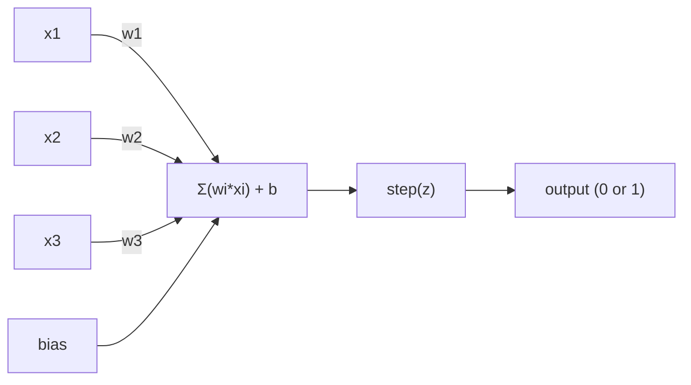
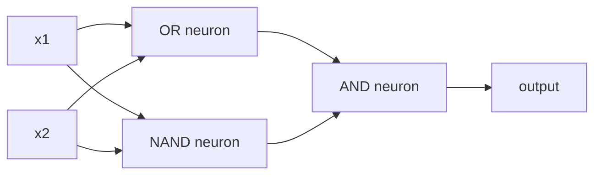

# Perceptron

> Perceptron, sinir ağının bir atomudur. Onu açıp, ağırlıkları, bir tarafsızlığı ve bir karar görüyorsun.

**类型：**Yapım
**语言：**Python
**先修要求：**1. aşama: Düzsel Cevab 直觉)
**时间：**~ 60 dakika

## Öğrenme hedefi
- Python'dan Perceptron'u gerçekleştirmek için, ağırlık güncelleme kuralını ve adım etkinleştirme fonksiyonunu içerir.
- 解释为什么单个Perceptron只能解决线性分离式 问题,并演示 XOR başarısızlık durumu
- OR、NAND 和 AND kapılarını birleştirerek XOR'u çözmek için çok katmanlı bir algılayıcı oluşturun
- Sigmoid aktivasyonu ve geri yayılması kullanın.

## 问题
Vector ve dot ürünü anladın mı? Matrix'in girişleri çıkışlara dönüştüreceğini biliyor musun? Ama makineler nasıl * öğrenir* ? Hangi dönüşümü kullanmalı?

Perceptron bu soruya cevap verdi. Bu en basit öğrenme makinesi: bazı girişleri alır, ağırlıkları katlar, önyargıları artırır, sonra ikili bir karar verir.

Perceptron'u anlamak, koddaki öğrenmeyi anlamak demektir.

## 概念
### Bir nöron, bir karar.

Bir Perceptron n giriş alır, her girişini bir ağırlık, bir gerginlik, bir önyargı ile çarpır ve sonuçları bir etkinleştirme fonksiyonuna aktarır.



Adım fonksiyonu 非常直接: Eğer ağırlıklı toplam加偏 >= 0, onda çıkış 为 1──否则,output 为 0──

```
step(z) = 1  if z >= 0
           0  if z < 0
```

Bu bir çizgisi sınıflandırıcıdır. Ağırlıklar ve tarafsızlıklar, bir çizgi tanımlıyor.

### Karar Sınırı

İki giriş için, Perceptron 2 boyutlu bir uzayda bir çizgi çizer:

```
  x2
  ┤
  │  Class 1        /
  │    (0)          /
  │                /
  │               / w1·x1 + w2·x2 + b = 0
  │              /
  │             /     Class 2
  │            /        (1)
  ┼───────────/──────────── x1
```

線一側所有点輸出 为 0──另一側所有点輸出 为 1── eğitim süreci bu sınıflardan doğru şekilde ayrılıncaya kadar bu çizgiyi hareket ettirir.

### Öğrenme Kuralı

Perceptron öğrenme kuralları 很简单:

```
For each training example (x, y_true):
    y_pred = predict(x)
    error = y_true - y_pred

    For each weight:
        w_i = w_i + learning_rate * error * x_i
    bias = bias + learning_rate * error
```

Eğer tahmin doğru ise, hata = 0, hiçbir şey değişmez. Eğer tahmin 0 ise, ancak 1, ağırlıklar artacaktır. Eğer tahmin 1 ise, ama 0, ağırlıklar düşecek.

### XOR Sorunu

Sorun şu anda ortaya çıkıyor.

```
AND gate:           OR gate:            XOR gate:
x1  x2  out         x1  x2  out         x1  x2  out
0   0   0           0   0   0           0   0   0
0   1   0           0   1   1           0   1   1
1   0   0           1   0   1           1   0   1
1   1   1           1   1   1           1   1   0
```

Ve 和 OR ise doğrusal olarak ayırılabilir: 0 和 1 分开;; XOR 则不是──没有任何一条直线能把 [0,1] 和 [1,0] 与 [0,0] 和 [1,1] 分开──

```
AND (separable):        XOR (not separable):

  x2                      x2
  1 ┤  0     1            1 ┤  1     0
    │     /                 │
  0 ┤  0 / 0              0 ┤  0     1
    ┼──/──────── x1         ┼──────────── x1
       line works!          no single line works!
```

Bu temel bir kısıtlama. Tek bir algılama sadece doğrusal olarak ayrılabilir bir sorunu çözebilir. Minsky ve Papert 1969'da bunu kanıtladı. Bu da neredeyse nöral ağ araştırmasını bir on yıl boyunca durdurdu.

Çözüm: Perceptron'u katmanlara toplayın. Çok katmanlı algılayıcıyı iki doğrusal kararın oluşturulması ile XOR'u çözmek için bir doğrusal olmayan kararın oluşturulması mümkündür.


```figure
perceptron-boundary
```

## Yapın onu.
### 步骤 1: Perceptron sınıfı

```python
class Perceptron:
    def __init__(self, n_inputs, learning_rate=0.1):
        self.weights = [0.0] * n_inputs
        self.bias = 0.0
        self.lr = learning_rate

    def predict(self, inputs):
        total = sum(w * x for w, x in zip(self.weights, inputs))
        total += self.bias
        return 1 if total >= 0 else 0

    def train(self, training_data, epochs=100):
        for epoch in range(epochs):
            errors = 0
            for inputs, target in training_data:
                prediction = self.predict(inputs)
                error = target - prediction
                if error != 0:
                    errors += 1
                    for i in range(len(self.weights)):
                        self.weights[i] += self.lr * error * inputs[i]
                    self.bias += self.lr * error
            if errors == 0:
                print(f"Converged at epoch {epoch + 1}")
                return
        print(f"Did not converge after {epochs} epochs")
```

### 2 adım: Logik kapılarında 上訓練

```python
and_data = [
    ([0, 0], 0),
    ([0, 1], 0),
    ([1, 0], 0),
    ([1, 1], 1),
]

or_data = [
    ([0, 0], 0),
    ([0, 1], 1),
    ([1, 0], 1),
    ([1, 1], 1),
]

not_data = [
    ([0], 1),
    ([1], 0),
]

print("=== AND Gate ===")
p_and = Perceptron(2)
p_and.train(and_data)
for inputs, _ in and_data:
    print(f"  {inputs} -> {p_and.predict(inputs)}")

print("\n=== OR Gate ===")
p_or = Perceptron(2)
p_or.train(or_data)
for inputs, _ in or_data:
    print(f"  {inputs} -> {p_or.predict(inputs)}")

print("\n=== NOT Gate ===")
p_not = Perceptron(1)
p_not.train(not_data)
for inputs, _ in not_data:
    print(f"  {inputs} -> {p_not.predict(inputs)}")
```

### 步骤 3:观察 XOR 失败

```python
xor_data = [
    ([0, 0], 0),
    ([0, 1], 1),
    ([1, 0], 1),
    ([1, 1], 0),
]

print("\n=== XOR Gate (single perceptron) ===")
p_xor = Perceptron(2)
p_xor.train(xor_data, epochs=1000)
for inputs, expected in xor_data:
    result = p_xor.predict(inputs)
    status = "OK" if result == expected else "WRONG"
    print(f"  {inputs} -> {result} (expected {expected}) {status}")
```

Bu tek bir Perceptron'un XOR'u öğrenemediği kesin bir kanıt.

### 步骤 4: İki katman ile  XOR çöz

技巧是:XOR = (x1 YA da x2) ve NOT (x1 YEN x2)



```python
def xor_network(x1, x2):
    or_neuron = Perceptron(2)
    or_neuron.weights = [1.0, 1.0]
    or_neuron.bias = -0.5

    nand_neuron = Perceptron(2)
    nand_neuron.weights = [-1.0, -1.0]
    nand_neuron.bias = 1.5

    and_neuron = Perceptron(2)
    and_neuron.weights = [1.0, 1.0]
    and_neuron.bias = -1.5

    hidden1 = or_neuron.predict([x1, x2])
    hidden2 = nand_neuron.predict([x1, x2])
    output = and_neuron.predict([hidden1, hidden2])
    return output


print("\n=== XOR Gate (multi-layer network) ===")
for inputs, expected in xor_data:
    result = xor_network(inputs[0], inputs[1])
    print(f"  {inputs} -> {result} (expected {expected})")
```

Perceptron'u katmanlara yığarak tek bir Perceptron'u oluşturmak mümkün değil.

### Adım 5: İki katmanlı ağ eğitimi

Adım 4 Handle connected weights── bu XOR için yararlı, ama doğru ağırlıkların gerçek sorunu sizin için geçerli değil.

```python
class TwoLayerNetwork:
    def __init__(self, learning_rate=0.5):
        import random
        random.seed(0)
        self.w_hidden = [[random.uniform(-1, 1), random.uniform(-1, 1)] for _ in range(2)]
        self.b_hidden = [random.uniform(-1, 1), random.uniform(-1, 1)]
        self.w_output = [random.uniform(-1, 1), random.uniform(-1, 1)]
        self.b_output = random.uniform(-1, 1)
        self.lr = learning_rate

    def sigmoid(self, x):
        import math
        x = max(-500, min(500, x))
        return 1.0 / (1.0 + math.exp(-x))

    def forward(self, inputs):
        self.inputs = inputs
        self.hidden_outputs = []
        for i in range(2):
            z = sum(w * x for w, x in zip(self.w_hidden[i], inputs)) + self.b_hidden[i]
            self.hidden_outputs.append(self.sigmoid(z))
        z_out = sum(w * h for w, h in zip(self.w_output, self.hidden_outputs)) + self.b_output
        self.output = self.sigmoid(z_out)
        return self.output

    def train(self, training_data, epochs=10000):
        for epoch in range(epochs):
            total_error = 0
            for inputs, target in training_data:
                output = self.forward(inputs)
                error = target - output
                total_error += error ** 2

                d_output = error * output * (1 - output)

                saved_w_output = self.w_output[:]
                hidden_deltas = []
                for i in range(2):
                    h = self.hidden_outputs[i]
                    hd = d_output * saved_w_output[i] * h * (1 - h)
                    hidden_deltas.append(hd)

                for i in range(2):
                    self.w_output[i] += self.lr * d_output * self.hidden_outputs[i]
                self.b_output += self.lr * d_output

                for i in range(2):
                    for j in range(len(inputs)):
                        self.w_hidden[i][j] += self.lr * hidden_deltas[i] * inputs[j]
                    self.b_hidden[i] += self.lr * hidden_deltas[i]
```

```python
net = TwoLayerNetwork(learning_rate=2.0)
net.train(xor_data, epochs=10000)
for inputs, expected in xor_data:
    result = net.forward(inputs)
    predicted = 1 if result >= 0.5 else 0
    print(f"  {inputs} -> {result:.4f} (rounded: {predicted}, expected {expected})")
```

İlk olarak, Sigmoid, adım fonksiyonunu değiştirdi çünkü düz bir adımdır.`train`方法把 error from output Backpropagation to hidden layer,并按每重量对错误的贡献比例调整它们──这是 20 行代码中的 Backpropagation──

Bu, Ders 03'ün köprücüsü.`d_output`和 `hidden_deltas`Arkasındaki matematik, zincir kuralını ağ grafikine uyguladı. Orda resmi olarak uygulayacağız.

## Kullan
Yeni oluşturduğunuz tüm içeriği bir import içinde var:

```python
from sklearn.linear_model import Perceptron as SkPerceptron
import numpy as np

X = np.array([[0,0],[0,1],[1,0],[1,1]])
y = np.array([0, 0, 0, 1])

clf = SkPerceptron(max_iter=100, tol=1e-3)
clf.fit(X, y)
print([clf.predict([x])[0] for x in X])
```

Senin 30'un var.`Perceptron`Sınıf aynı şeyi yapıyor. Sklern'in versiyonu, yakınlık kontrollerini arttırdı. Çoklu Kayıp fonksiyonları ve nadir giriş desteği, ama temel döngü tamamen aynı: ağırlıklı toplam, adım fonksiyonu, hatalar, yenilemeler.

Gerçek farklar ölçekte ortaya çıkar. Üretim ağları arasında neler oluyor:

- Adım fonksiyonu Sigmoid ̊ ReLU veya diğer düzlem aktivasyonu olacak
- Ağırlıklar 会通过背扩散自动学习(Düşünme 03)
- katmanlar daha derinleşecek: 3 ̊10 ̊100+ katmanlar
- Aynı prensip hala geçerli: her katman önceki katmanın çıkışlarından yeni özellikler oluşturur

Tek bir algılama sadece düz çizim yapabilir. Onları toplayıp, istediğin şekli çizersin.

## - Söyle.
Bu ders:
- `outputs/skill-perceptron.md`- Bir yetenek, tek katmanlı ve çok katmanlı mimarlıklara ne zaman ihtiyaç olduğunu açıklamak

## 练习
1. NAND kapısı, herhangi bir mantıksal devrenin NAND tarafından yapılandırılabilmesi için kullanılır.
2. 修改 Perceptron sınıfı,使其在每个时代跟踪决策界面(w1*x1 + w2*x2 + b = 0) 』印在 AND gate 训练期间这条线如何移动──
3. 构建一个3输入 Perceptron:只有当3输入中至少2个为1时才输出1(多数投票函数) ――它是线性分离的吗?为什么?

## 关键术语
| Term | What people say | What it actually means |
|------|----------------|----------------------|
| Perceptron | “一个假的 neuron” | 一个 linear classifier：inputs 与 weights 的 dot product，加上 bias，再通过 step function |
| Weight | “一个 input 有多重要” | 一个 multiplier，用来缩放每个 input 对 decision 的贡献 |
| Bias | “threshold” | 一个 constant，用来平移 decision boundary，让 Perceptron 即使在 inputs 为零时也能触发 |
| Activation function | “压缩数值的东西” | 一个在 weighted sum 之后应用的 function：Perceptron 使用 step function，现代 networks 使用 sigmoid/ReLU |
| Linearly separable | “你能在它们之间画一条线” | 一个 dataset，其中单个 hyperplane 可以完美分离 classes |
| XOR problem | “Perceptron 做不到的那件事” | single-layer networks 无法学习 non-linearly-separable functions 的证明 |
| Decision boundary | “classifier 发生切换的位置” | 将 input space 分成两个 classes 的 hyperplane w*x + b = 0 |
| Multi-layer perceptron | “一个真正的 Neural Network” | 按 layers 堆叠的 Perceptron，其中每一层的 output 会输入到下一层 |

## 延伸阅读
- Frank Rosenblatt, The Perceptron: Brain'deki Bilgi Kaydetme ve Teşkilatlanma için Bir Muhtemelen Model(1958) -- 开创这一切的原始论文
- Minsky & Papert, Perceptrons 1969-- Bu kitap XOR'un tek katmanlı ağlar tarafından çözülemeyeceğini kanıtladı.
- Michael Nielsen, Neural Networks and Deep Learning,Bölüm 1http://neuralnetworksanddeeplearning.com/）--Perceptron'un ağları nasıl oluşturduğu hakkında en iyi açıklama
