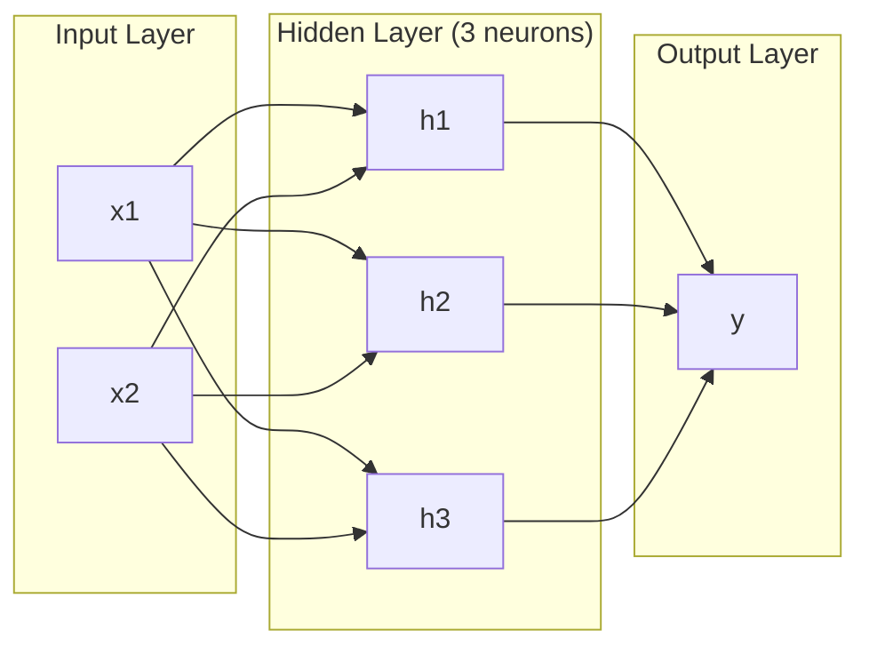
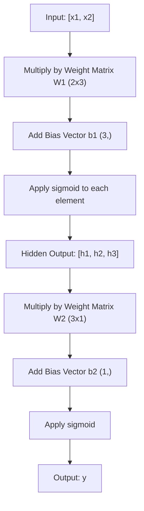
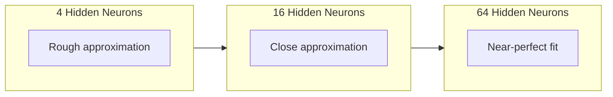

# Çok katlı ağ ve ileri geçit

> Bir sinir bir çizgi çizer. Onları toplarsan, her şeyi çizersin.

**Type:** 构建
**Languages:** Python
**Prerequisites:** Phase 01（Math Foundations），Lesson 03.01（The Perceptron）
**Time:** 约 90 分钟

## Öğrenme hedefi

- Kullanım Katman ve Ağ sınıfı sıfırdan yapılandırmak çok katmanlı bir ağ, tamamlanmak için Tam bir ileri geçiş
-                                                                                                                                                                                                                                                                                                                                                                                                                                                                                                                              
- 解释堆叠非线性激活 网络学习 曲的决策边界 如何让网络学习 曲的决策边界
- 2-2-1 架构和手工调好的 sigmoid 权重解决 XOR 问题

## 问题

单个神经元就是一个画线器――仅此而已――它只能在你的数据中画出一条直线――AI'deki her gerçek sorun - 图像识别,语言理解,下围棋- 曲线――都需要曲线―― 神经元堆叠成层,就是获得曲线的方法――

1969 yılında, Minsky 和 Papert                                                                                                                                                                                                                                                                                                                                                                                                                                                                                                                      

Bu, sinir ağının maliyet desteği on yıldan fazla durdu. Sonrasında, düzeltme yöntemleri çok açık: sadece bir katman kullanmayın.

Bu kompülasyon, günümüzün üretim ortamında her derin öğrenme modelinin temelini oluşturur. Forward Pass - içeriye girme, gizli katmanlardan çıkışa kadar olan veriler - diğer herhangi bir şey çalışmadan önce önce inşa etmeniz gereken ilk şeydir.

## 概念

### 层:输入、隐藏、输出

Bir çok katlı ağ üç katlıktır:

**输入层**- 严格来说不是一层――它保存原始数据――两个特征意味着两个输入节点――这里不发生计算――

**Hidden layer**-- 工作发生的地方──每个神经元接收上层的每个输出,应用权重和一个偏差,然后将结果传输到激活函数──称为隐藏,因为你不会在训练数据中直接看到这些值──

**输出层**-- 最终答案──二分类 için, bir sigmoid ile bir sinir kullanmak──



Bu bir 2-3-1 网络── iki giriş, üç gizli nöron, bir çıkış── her bağlantı bir yük taşır── her sinirden 输入除外) hepsi bir önyargı taşır──

Her katman gizli durum olarak adlandırılan bir dizi sayısal oluşturulan vektör üretir. Metin için, gizli durum, boyutunu artıracak. Bir kelimeyi 768 rakam olarak kodlayarak anlamı kavramayacaktır.

### Nervous Depresyon

Her sinir üç şey yapar:

1. Her giriş karşılığı ağırlığı ile çarpılır .
2. Tüm çarpıtı ve bir tarafa ekleyeceğiz .
3. Bu ve Aktif Etme fonksiyonunu aktar

Şimdi, aktivasyon işlevi sigmoid:

```
sigmoid(z) = 1 / (1 + e^(-z))
```

Sigmoid, herhangi bir sayısal sıkıştırmayı (0, 1) aralığında yapar. Büyük doğru giriş 1'e doğru ilerler. Büyük negatif giriş 0'e doğru ilerler.

### Forward Pass: Data nasıl流动

Forward pass, ağın içinde bir aşama bir veriyi aktarır.



Her aşamada üç işlem sırayla gerçekleşir:

```
z = W * input + b       (linear transformation)
a = sigmoid(z)           (activation)
```

Bir katın giriş, bir katın giriş olur.

### Matrix 维度

追踪维度, derin öğrenme'de en önemli调试技能──这里是 2-3-1 网络:

| Step | Operation | Dimensions | Result Shape |
|------|-----------|------------|-------------|
| 输入 | x | -- | (2,) |
| Hidden 线性部分 | W1 * x + b1 | W1: (3, 2), b1: (3,) | (3,) |
| Hidden 激活 | sigmoid(z1) | -- | (3,) |
| 输出线性部分 | W2 * h + b2 | W2: (1, 3), b2: (1,) | (1,) |
| 输出激活 | sigmoid(z2) | -- | (1,) |

規則:第 k 層の重量 Matrix W'ın şekli 〜 (neurons_in_layer_k, neurons_in_layer_k_minus_1) 』 行对应应应上一层。列对应应上一层。 Eğer şekil 对不上,你就有 bug。

### Evrensel Yaklaşım Teoremi

1989 yılında George Cybenko bir olağanüstü şeyi kanıtladı: tek bir gizli katman ve yeterince sinir ağı olan bir nöron, istedikleri doğrulukla istedikleri herhangi bir devamlı işlevi yaklaşabilir.

Bu, gizli bir katman anlamına gelmez. Bu, yapı teorik olarak yetkin bir yapı anlamına gelmez. Bu, daha derin bir ağın daha az nöron kullanılabilmesinin nedenidür.

直觉是: gizli katmanın içindeki her sinir bir 凸起或特征を学ぶ。 yeterince 凸起があれば, onları doğru yere yerleştirir, herhangi bir düz eğriye yaklaşır.。                                                                                                                                                                                                                                       



### Yapılandırılabilir

Neural Network is a piece of. Biçimsel ağlar, bir kodlayıcı ağı kullanır, bir sesli ağı kullanır ve bağımsız bir kodlayıcı ağı kullanır.


```figure
mlp-forward
```

## Yapın onu.

純 Python──不使用 numpy──每一个矩阵操作都从零编写──

### 步骤 1: Sigmoid 激活

```python
import math

def sigmoid(x):
    x = max(-500.0, min(500.0, x))
    return 1.0 / (1.0 + math.exp(-x))
```

Değerini [500, 500]'e kadar tutarak, aşırı çıkışın önlenmesini sağlayabiliriz.`math.exp(500)`Çok büyük ama sınırlı.`math.exp(1000)`- Evet, çok büyük.

### 步骤 2: Katman sınıfı

Tüm Derin Öğrenme'de en önemli işlem Matrix 乘法──每一层、每一次注意头──每次前进通过-- 底层都是matmul── 一层线性层 接收一个输入向量,将它乘以权重矩阵,并加上偏差向向:y = Wx + b──

Bir katman bir ağırlık matrisi ve bir tarafsızlık vektörü korur. Önüne doğru yöntemi bir giriş vektörü alır ve aktifleştirildikten sonra çıkışını geri gönderir.

```python
class Layer:
    def __init__(self, n_inputs, n_neurons, weights=None, biases=None):
        if weights is not None:
            self.weights = weights
        else:
            import random
            self.weights = [
                [random.uniform(-1, 1) for _ in range(n_inputs)]
                for _ in range(n_neurons)
            ]
        if biases is not None:
            self.biases = biases
        else:
            self.biases = [0.0] * n_neurons

    def forward(self, inputs):
        self.last_input = inputs
        self.last_output = []
        for neuron_idx in range(len(self.weights)):
            z = sum(
                w * x for w, x in zip(self.weights[neuron_idx], inputs)
            )
            z += self.biases[neuron_idx]
            self.last_output.append(sigmoid(z))
        return self.last_output
```

权重矩阵 şekli 权重矩阵 şekli 权重矩阵 şekli 权重矩阵 şekli 权重矩阵 şekli 权重矩阵 şekli 权重矩阵 şekli 权重矩阵 şekli 权重矩阵 şekli 权重矩阵 şekli 权重矩阵 şekli 权重矩阵 şekli 权重矩阵 şekli 权重矩阵 şekli 权重矩阵 şekli 权重矩阵 şekli 权重矩阵 şekli 权重矩阵 şekli 权重矩阵 şekli 权重矩阵 şekli 权重矩阵 şekli 权重矩阵 şekli 权重矩阵 şekli 权重矩阵 şekli 权重矩阵 şekli 权重矩阵 şekli 权重矩阵 şekli 权重矩阵 şekli 权重矩阵 şekli 权重矩阵 权重矩阵 权重矩阵 权重矩阵 权重矩阵 权重矩阵 权重矩阵 权重矩阵 权重矩阵 权重矩阵 权重矩阵 权重矩阵 权重矩阵 权重矩阵 权重矩阵 权重矩阵 权重矩阵 权重矩阵 权重矩阵 权重矩阵 权重矩阵 权重矩阵 权重矩阵 权重矩阵 权重矩阵 权重矩阵 权重 权重矩阵 权重矩阵 权重 权重 权重矩阵 权重 权重 权重 权重 权重 权重 权重 权重 权重 权重 权重 权重 权重 权重 权重 权重 权重 权重 权重 权重 权 权重 权 权 权 权 权 权 权 权 权 权 权 权 权 权 权 权 权 权 权 权 权 权 权 权 权 权 权 权 权 权 权 权 权 权 权 权 权 权 权 权 权 权 权 权

### 步骤 3: Ağ Sınıfı

Bir ağ katmanlı bir listedir.Forward pass onları bir araya getirecektir:

```python
class Network:
    def __init__(self, layers):
        self.layers = layers

    def forward(self, inputs):
        current = inputs
        for layer in self.layers:
            current = layer.forward(current)
        return current
```

Bu, tüm ileri geçiştir.

### 4 adım: XOR'u çözmek için el işlemi yapın

Ders 01'de, OR、NAND 和 AND perceptron ı birleştirerek XOR'u çözdük. Şimdi katmanımız ve ağ sınıfımızla aynı şeyi yapıyoruz.

```python
hidden = Layer(
    n_inputs=2,
    n_neurons=2,
    weights=[[20.0, 20.0], [-20.0, -20.0]],
    biases=[-10.0, 30.0],
)

output = Layer(
    n_inputs=2,
    n_neurons=1,
    weights=[[20.0, 20.0]],
    biases=[-30.0],
)

xor_net = Network([hidden, output])

xor_data = [
    ([0, 0], 0),
    ([0, 1], 1),
    ([1, 0], 1),
    ([1, 1], 0),
]

for inputs, expected in xor_data:
    result = xor_net.forward(inputs)
    predicted = 1 if result[0] >= 0.5 else 0
    print(f"  {inputs} -> {result[0]:.6f} (rounded: {predicted}, expected: {expected})")
```

较大的权重(20, -20) 让 sigmoid 表现如阶跃函数──第一个隐藏神经细胞近似OR──第二个近似NAND──输出神经元把它们组合成 AND,也就是XOR──

### 5 adım: 圆形分类

Bir daha zor bir sorun: 2D nokta sınıflandırması, bir başlangıç noktası merkezli olarak 0,5 çaplı bir yuvarlak veya yuvarlak dışı olarak yapılabilir.

```python
import random
import math

random.seed(42)

data = []
for _ in range(200):
    x = random.uniform(-1, 1)
    y = random.uniform(-1, 1)
    label = 1 if (x * x + y * y) < 0.25 else 0
    data.append(([x, y], label))

circle_net = Network([
    Layer(n_inputs=2, n_neurons=8),
    Layer(n_inputs=8, n_neurons=1),
])
```

Bu yüzden, bu konuda bir çok şey yapmamalıyız. Bu yüzden, bu konuda bir çok şey yapmamalıyız.

```python
correct = 0
for inputs, expected in data:
    result = circle_net.forward(inputs)
    predicted = 1 if result[0] >= 0.5 else 0
    if predicted == expected:
        correct += 1

print(f"Accuracy with random weights: {correct}/{len(data)} ({100*correct/len(data):.1f}%)")
```

随机权重会得到较差的准确率--通常甚至比猜 majority类还差──训练后 (Deneyim 3) ), 8 gizli nöronlu aynı yapı ile bir 曲边界,把内部和外部部分开―― çizer.

## Kullan

PyTorch dört satır kod kullanarak yukarıdaki tüm içeriği tamamladı:

```python
import torch
import torch.nn as nn

model = nn.Sequential(
    nn.Linear(2, 8),
    nn.Sigmoid(),
    nn.Linear(8, 1),
    nn.Sigmoid(),
)

x = torch.tensor([[0.0, 0.0], [0.0, 1.0], [1.0, 0.0], [1.0, 1.0]])
output = model(x)
print(output)
```

`nn.Linear(2, 8)`İşte senin katman sınıfı:şekil 为 (8, 2) ın ağırlıklı matrisi,şekil 为 (8,) ın önyargı vektörü.`nn.Sigmoid()`Bu, senin sigmoid 函数,逐元素应用──`nn.Sequential`Evet, senin ağ sınıfın:

区别在速度和规模中. PyTorch GPU'larda çalışır, milyonlarca örnek parçasını işlemeyi yapar ve otomatik olarak geri yayılma derecesine kullanılır.

## - Söyle.

Bu ders, bir tekrarlanabilir istek oluşturur ve bir ağ yapı tasarlamak için kullanılır:

- `outputs/prompt-network-architect.md`

Eğer belirli bir sorunun ne kadar katman kullanılması gerektiği belirlenirken, her katman için ne kadar sinir kullanılması gerektiği belirlenirken ve hangi aktif fonksiyonları kullanmanız gerektiğinde, kullanılabilir.

## 练习

1. 构建一个 2-4-2-1 网络(两个隐藏层),并使用随机权重运行 XOR 数据上前行通过──打印中间隐藏层的输出,观察表示在每层如何变变──

2. Bu, bir grup olarak kullanılan bir nesneyi oluşturur. Bu nesneyi oluşturan bir nesneyi oluşturur.

3. Bir ağ sınıfı üstü gerçekleştirmek için `count_parameters`Metod, geri dönüşü, ağırlık ve tarafsızlık toplamı.

4. Bu, RGB renkleri için bir yapı oluşturur. Bu bir iki sınıf basit renk sınıflandırma yapı oluşturur.

5. Eğer z < 0,se geri dön 0.01 * z, yoksa geri dön 1.0。 kullanın 4. Adımdaki aynı el işlemi, XOR'da üstü yürüyüşte ileri geçiş yapar.

## 关键术语

| Term | 人们会怎么说 | 它实际意味着什么 |
|------|----------------|----------------------|
| Forward pass | “运行模型” | 将输入推过每一层 -- 乘以权重、加上 bias、激活 -- 以产生输出 |
| Hidden layer | “中间部分” | 输入和输出之间的任意层，其值不会在数据中被直接观察到 |
| Multi-layer network | “一个深的 Neural Network” | 按顺序堆叠的神经元层，其中每一层的输出会输入到下一层 |
| Activation function | “非线性” | 在线性变换之后应用的函数，用来把曲线引入决策边界 |
| Sigmoid | “S 曲线” | sigma(z) = 1/(1+e^(-z))，将任意实数压缩到 (0,1)，平滑且处处可微 |
| Weight matrix | “参数” | 一个 shape 为 (current_layer_neurons, previous_layer_neurons) 的 Matrix W，包含可学习的连接强度 |
| Bias vector | “偏移量” | 在 Matrix 乘法之后添加的 Vector，使神经元即使在所有输入为零时也能激活 |
| Universal approximation | “Neural Network 可以学习任何东西” | 一个拥有足够多神经元的单 hidden layer 可以逼近任意连续函数 -- 但“足够多”可能意味着数十亿 |
| Linear transformation | “Matrix 乘法步骤” | z = W * x + b，激活前的计算，将输入映射到一个新空间 |
| Decision boundary | “分类器切换的地方” | 输入空间中的一个曲面，网络输出在这里跨过分类阈值 |

## 延伸阅读

- Michael Nielsen, "Nöral ağlar ve derin öğrenme", Bölüm 1-2 (http://neuralnetworksanddeeplearning.com/) -- 关于前进通和网络结构最清晰的免费解释,包含交互式可视化
- Cybenko, "Sigmoidal Bir Fonksiyonun Süperpozisyonları ile Yaklaşması" (1989) -- ilk evrensel yaklaşım teoremi 论文,出乎意料地易读
- 3Blue1Brown, "Ama sinir ağı nedir?"https://www.youtube.com/watch?v=aircAruvnKk) -- 20 dakika görülebilir konuşma seviyesi, ağırlık ve ileri geçiş, doğru bir kalp modelini oluşturmaya yardımcı olur.
- İyi arkadaş, Bengio, Courville, "Dikkatli Öğrenme", 6. bölüm (https://www.deeplearningbook.org/) -- Multilayer Network'ın standart referansı, ücretsiz çevrimiçi okumak
