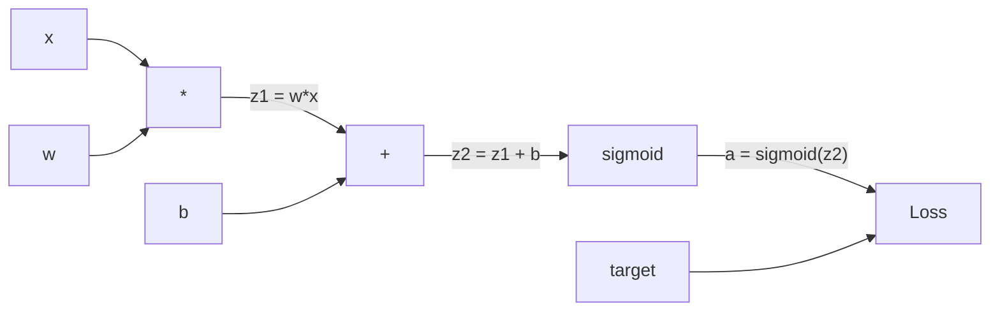
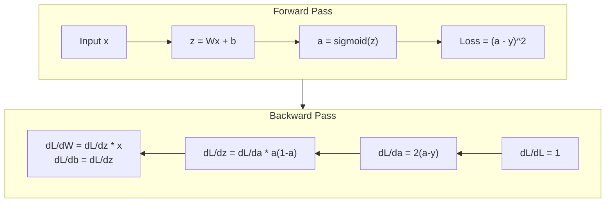
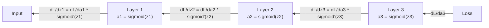

# 0'dan geri yayılma gerçekleştirmek

> Geri yayılma, öğrenmeyi mümkün kılan bir algoritma.

**Type:** Build
**Languages:** Python
**Prerequisites:** Lesson 03.02 (Multi-Layer Networks)
**Time:** ~120 minutes

## Öğrenme hedefi
- Değer tabanlı bir otograd motorunu gerçekleştirmek için, hesaplama grafiği oluşturur ve topolojik türden hesaplanır.
- Kullanın zincir kuralı 推导 ekleme、 çoğaltma 和 sigmoid'in Geriye Geçimi
- Sadece sıfırdan gerçekleştirdiğin geri yayılma motoru kullanarak, XOR ve çevreler sınıflandırma üzerinde bir çok katmanlı ağ eğitimi
- 识别深层sigmoid network 中的消失梯度 问题,并解释为什么 Gradient 会指数级缩小

## 问题
Ağınızda gizli bir katman var, içinde 768  giriş ve 3072  çıkış vardır. Bu 2,359,296    ağırlıktır. Bu hata tahminini yaptı. Hangi ağırlıkların bu hataya yol açtığıdır?

Basit bir uygulama şu: bir ağırlık alın, hafif bir şekilde rahatsız edin, bir kez daha ileri geçiş yapın, Kayıp ölçülür, yükselir veya düşer. Bu, bu ağırlığın derecesini verir. Ardından ağdaki her ağırlık bunu yapar.

Geri yayılma  bu sorunu çözdü. Bir kez ileri geçiş, bir kez geri geçiş, tüm dereceleri hesaplanmıştır.

## 概念
### Zincir Kuralı, Ağ Üstüne Uygulanır

Eğer y = f(g(x) ise, dy/dx = f'(g(x)) * g'(x) ・・・

Nöral Ağlarda, 链条 is input to Loss'un işletim sırası. Her aşama uygulama ağırlığı, 偏置, 再通过的活性化加上. Loss Fungsi, son çıkışı hedefe karşılaştırır.

### Hesaplama Grafikleri

Her seferinde Forward Pass bir grafik oluşturur. Her düğüm bir işlemdir.



Forward Pass: value From left to right流动──x 和 w 产生 z1 = w*x──加上 b 得到 z2──Sigmoid 给出激活 a──使用 Loss Fungsi 将 a 与 target y 比较──

Geriye Geçit: Gradient:DL/DZ2 = z1 + b) ve dL/DZ1 olarak değişir.

Grafdaki her düğümün Arka Yolu sırasında sadece bir görev vardır: yukarıdan gelen dereceleri al, kendi yerel türevini çarpıp aşağıya doğru gönderir.

### Önde Geriye



Forward Pass 会存储每个中间值:z、a、每个层的输入──Backward Pass 需要这些已存储的值 来计算 Gradient──这是 Backpropagation 核心的内存-计算权衡──你用内存(存储激活)换速度(一次通过,而不是数百万次)──

### Gradient Network İçin Akış

Üç katlı bir ağ için, her katlı bir şekilde bir dizi bağlantı var.



Bu nedenle, bir simgelik derivatif olarak, bir simgelik derivatif olarak, bir simgelik derivatif olarak, bir * (1 - a) olarak, en büyük değeri 0.25 olarak kullanılır.

### Kaybolan Değillikler

İşte kaybolan bir gradient 问题──Sigmoid 会把输出压缩到0 和 1 之间──它的衍生品永远小于0.25──堆积足够多的sigmoid layer 后,Gradient 会缩小到接近零──早期层 几乎无法学习,因为它们接收的 Gradient 接近零──

```
sigmoid(z):     Output range [0, 1]
sigmoid'(z):    Max value 0.25 (at z = 0)

After 5 layers:   gradient * 0.25^5 = 0.001x original
After 10 layers:  gradient * 0.25^10 = 0.000001x original
```

Bu yüzden derin seviye sigmoid ağı  neredeyse imkansız eğitim 修复方法 -- ReLU 及其变体 -- 是 第04 ders 的主题──现在, öncelikle Arkaplanasyon'un kendiliğinden mükemmel şekilde çalışmasını anlamak 问题在于它穿过的什么──

### 推导 2 katmanlı ağın derecesi

Aşağıda belirli bir matematik örneği bulunmaktadır: ağlar x 带 sigmoid'in gizli katmanı 带 sigmoid'in çıkış katmanı ve MSE Kayıpları 

Ön geçit:
```
z1 = W1 * x + b1
a1 = sigmoid(z1)
z2 = W2 * a1 + b2
a2 = sigmoid(z2)
L = (a2 - y)^2
```

Geriye Geçme (逐步应用链条):
```
dL/da2 = 2(a2 - y)
da2/dz2 = a2 * (1 - a2)
dL/dz2 = dL/da2 * da2/dz2 = 2(a2 - y) * a2 * (1 - a2)

dL/dW2 = dL/dz2 * a1
dL/db2 = dL/dz2

dL/da1 = dL/dz2 * W2
da1/dz1 = a1 * (1 - a1)
dL/dz1 = dL/da1 * da1/dz1

dL/dW1 = dL/dz1 * x
dL/db1 = dL/dz1
```

Her derecede kayıptan geriye izlenen yerel türevler vardır. Bu da geri yayılmaların tamamıdır.


```figure
backprop-vanishing
```

## Yapın onu.
### 步骤 1: Değer düğüm

Hesaplamalarımızdaki her sayı bir değer haline gelir. Kendi verilerini depolar. Gradyent, ve nasıl oluşturulduğunu bilir.

```python
class Value:
    def __init__(self, data, children=(), op=''):
        self.data = data
        self.grad = 0.0
        self._backward = lambda: None
        self._children = set(children)
        self._op = op

    def __repr__(self):
        return f"Value(data={self.data:.4f}, grad={self.grad:.4f})"
```

Daha fazla Gradient yok.`_children`Bu değerin diğer değerlerini takip ederek, sonra grafik üzerinde topolojik bir tür yapabiliriz.

### 步骤 2: 带 Geriye dönük fonksiyonun işlevi

Her operasyon yeni bir değer oluşturur, nasıl geri akışını tanımlar.

```python
def __add__(self, other):
    other = other if isinstance(other, Value) else Value(other)
    out = Value(self.data + other.data, (self, other), '+')

    def _backward():
        self.grad += out.grad
        other.grad += out.grad

    out._backward = _backward
    return out

def __mul__(self, other):
    other = other if isinstance(other, Value) else Value(other)
    out = Value(self.data * other.data, (self, other), '*')

    def _backward():
        self.grad += other.data * out.grad
        other.grad += self.data * out.grad

    out._backward = _backward
    return out
```

◊a+b) /da = 1,d(a+b) /db = 1── bu nedenle iki giriş doğrudan çıkış elde eder.

对于乘法:d(a*b)/da = b,d(a*b)/db = a。 her giriş şehir bir diğer giriş değerini elde eder 乘以输出级──

`+=`很关键──一个值可能会被多个操作使用──它的渐进是来自所有路径的渐进之和──

### 步骤 3: Sigmoid ve Kayıp

```python
import math

def sigmoid(self):
    x = self.data
    x = max(-500, min(500, x))
    s = 1.0 / (1.0 + math.exp(-x))
    out = Value(s, (self,), 'sigmoid')

    def _backward():
        self.grad += (s * (1 - s)) * out.grad

    out._backward = _backward
    return out
```

Sigmoid türev:sigmoid(x) * (1 - sigmoid(x))。

```python
def mse_loss(predicted, target):
    diff = predicted + Value(-target)
    return diff * diff
```

单个输出的 MSE:(预测 - target) ^ 2。 我们把减算表达为加上一个取负的值──

### 4 adım: Geriye Geçit

Topolojik tür                                                                                                                                                                                                                                                                                                                                                                                                                                                                                                                           

```python
def backward(self):
    topo = []
    visited = set()

    def build_topo(v):
        if v not in visited:
            visited.add(v)
            for child in v._children:
                build_topo(child)
            topo.append(v)

    build_topo(self)
    self.grad = 1.0
    for v in reversed(topo):
        v._backward()
```

开始从 Loss  Gradient = 1.0,因为 dL/dL = 1)──沿着排序后的图反向遍历──每个节点的`_backward`Gradient'i çocuklarına göndereceğim.

### 步骤 5: Katman ve Ağ

```python
import random

class Neuron:
    def __init__(self, n_inputs):
        scale = (2.0 / n_inputs) ** 0.5
        self.weights = [Value(random.uniform(-scale, scale)) for _ in range(n_inputs)]
        self.bias = Value(0.0)

    def __call__(self, x):
        act = sum((wi * xi for wi, xi in zip(self.weights, x)), self.bias)
        return act.sigmoid()

    def parameters(self):
        return self.weights + [self.bias]


class Layer:
    def __init__(self, n_inputs, n_outputs):
        self.neurons = [Neuron(n_inputs) for _ in range(n_outputs)]

    def __call__(self, x):
        out = [n(x) for n in self.neurons]
        return out[0] if len(out) == 1 else out

    def parameters(self):
        params = []
        for n in self.neurons:
            params.extend(n.parameters())
        return params


class Network:
    def __init__(self, sizes):
        self.layers = []
        for i in range(len(sizes) - 1):
            self.layers.append(Layer(sizes[i], sizes[i + 1]))

    def __call__(self, x):
        for layer in self.layers:
            x = layer(x)
            if not isinstance(x, list):
                x = [x]
        return x[0] if len(x) == 1 else x

    def parameters(self):
        params = []
        for layer in self.layers:
            params.extend(layer.parameters())
        return params

    def zero_grad(self):
        for p in self.parameters():
            p.grad = 0.0
```

Bir Nöron  Girişi al, ağırlıklı toplam + tarafsızlığı hesapla, sonra sigmoidı uygula.`parameters()`Metod, öğrenilebilecek tüm değerleri toplar, böylece onları güncelleyebiliriz.

### Adım 6: XOR'da eğitim

```python
random.seed(42)
net = Network([2, 4, 1])

xor_data = [
    ([0.0, 0.0], 0.0),
    ([0.0, 1.0], 1.0),
    ([1.0, 0.0], 1.0),
    ([1.0, 1.0], 0.0),
]

learning_rate = 1.0

for epoch in range(1000):
    total_loss = Value(0.0)
    for inputs, target in xor_data:
        x = [Value(i) for i in inputs]
        pred = net(x)
        loss = mse_loss(pred, target)
        total_loss = total_loss + loss

    net.zero_grad()
    total_loss.backward()

    for p in net.parameters():
        p.data -= learning_rate * p.grad

    if epoch % 100 == 0:
        print(f"Epoch {epoch:4d} | Loss: {total_loss.data:.6f}")

print("\nXOR Results:")
for inputs, target in xor_data:
    x = [Value(i) for i in inputs]
    pred = net(x)
    print(f"  {inputs} -> {pred.data:.4f} (expected {target})")
```

观察 Loss 下降──随机预测到正确的XOR输出, tamamen Backpropagation 计算 Gradient 并向正确方向微调权重来驱动──

### 步骤 7: Çember sınıflandırması

Ders 02'de, sen de bir çevrede sınıflandırılmak için bir çevrede oturuyorsun.

```python
random.seed(7)

def generate_circle_data(n=100):
    data = []
    for _ in range(n):
        x1 = random.uniform(-1.5, 1.5)
        x2 = random.uniform(-1.5, 1.5)
        label = 1.0 if x1 * x1 + x2 * x2 < 1.0 else 0.0
        data.append(([x1, x2], label))
    return data

circle_data = generate_circle_data(80)

circle_net = Network([2, 8, 1])
learning_rate = 0.5

for epoch in range(2000):
    random.shuffle(circle_data)
    total_loss_val = 0.0
    for inputs, target in circle_data:
        x = [Value(i) for i in inputs]
        pred = circle_net(x)
        loss = mse_loss(pred, target)
        circle_net.zero_grad()
        loss.backward()
        for p in circle_net.parameters():
            p.data -= learning_rate * p.grad
        total_loss_val += loss.data

    if epoch % 200 == 0:
        correct = 0
        for inputs, target in circle_data:
            x = [Value(i) for i in inputs]
            pred = circle_net(x)
            predicted_class = 1.0 if pred.data > 0.5 else 0.0
            if predicted_class == target:
                correct += 1
        accuracy = correct / len(circle_data) * 100
        print(f"Epoch {epoch:4d} | Loss: {total_loss_val:.4f} | Accuracy: {accuracy:.1f}%")
```

Burada online SGD kullanıyoruz - her örnek  sonra yenileme ağırlığı, tamamlanmış parti toplamak yerine 👍 bu daha hızlı bir şekilde parçalanır  , ve tüm Kayıp manzarasında sigmoid saturation oluşmasını önler                                                                                                                                                                                                                                      

没有手动调参──网络会自己发现圆形决策界面──这就是反扩散的力量:你定义建筑、损失函数 和数据──算法会找到权重──

## Kullan
PyTorch, yukarıdaki tüm işleri birkaç satır kodla tamamladı.

```python
import torch
import torch.nn as nn

model = nn.Sequential(
    nn.Linear(2, 4),
    nn.Sigmoid(),
    nn.Linear(4, 1),
    nn.Sigmoid(),
)
optimizer = torch.optim.SGD(model.parameters(), lr=1.0)
criterion = nn.MSELoss()

X = torch.tensor([[0,0],[0,1],[1,0],[1,1]], dtype=torch.float32)
y = torch.tensor([[0],[1],[1],[0]], dtype=torch.float32)

for epoch in range(1000):
    pred = model(X)
    loss = criterion(pred, y)
    optimizer.zero_grad()
    loss.backward()
    optimizer.step()

print("PyTorch XOR Results:")
with torch.no_grad():
    for i in range(4):
        pred = model(X[i])
        print(f"  {X[i].tolist()} -> {pred.item():.4f} (expected {y[i].item()})")
```

`loss.backward()`İşte seninki.`total_loss.backward()`- Evet.`optimizer.step()`İşte bu senin el yazmışsın.`p.data -= lr * p.grad`- Evet.`optimizer.zero_grad()`İşte seninki.`net.zero_grad()`△ Aynı algoritma, endüstriyel aşama gerçekleşmesi──PyTorch  GPU hızlandırma ‒ karışık hassaslık ‒ gradyanç kontrol noktası ‒ ve yüzlerce katman tipi ‒ ama Geri Geçmek ‒ hala aynı zincir kuralı, aynı hesaplama grafikinde uygulanmaktadır.

訓練会运行前行パス,然后运行后行パス,再更新权重──Inference 只运行前行パス──没有 Gradient,没有更新── Bu fark önemlidir, çünkü sonuçlandırma 才是生产环境中发生的事情── Claude veya GPT gibi API 时,你运行的是推断 -- 你的提示向前流经网络,Token从另一端输出──没有权重发生变──理解后传播 很重要,因为它塑造了网络中的每一个权重──

## - Söyle.
Bu ders:
- `outputs/prompt-gradient-debugger.md`-- bir tekrarlanabilir istek, herhangi bir sinir ağının gradient problemini teşhis etmek için kullanılır

## 练习
1. 给值类 添加一个 `__sub__`yöntem ((a - b = a + (-1 * b))。 sonra bir `__neg__`(a - b) ^2) gibi bir yöntemle yapılan bir hesaplama ile karşılaştırmak için, test Gradient doğru olup olmadığını göstermek için

2. 给值 添加一个 `relu`yöntem(output 为 max(0, x),derivative 在 x > 0 时为 1,否则为 0) ・・・ gizli katman içinde relu 替换 sigmoid,并再次在 XOR 上训练──比较收速度──你应该看到训练更快--这是课04的预告──

3. Değerleri gerçekleştirmek için kullanılır tam sayı güçleri `__pow__`Metodı kullan.`mse_loss`Gerçek bir şeyle değiştir.`(predicted - target) ** 2`Özetle: Test Gradient ile orijinal gerçekleşme uyumlu.

4. 给训练循环 添加梯度切割:调用 `backward()`后,把所有 Gradient clip 到 [-1, 1]──训练一个更深的网络(4+层与sigmoid),并比较有无剪切的损失曲线──这是你对抗爆炸梯度的第一防线──

5. 构建一个视觉化:在 XOR 训练完成后,打印网络中每个参数的梯度――找出哪一层的梯度 最小――,这会演示你在概念中的 部分读到的消失梯度问题――

## 关键术语
| Term | What people say | What it actually means |
|------|----------------|----------------------|
| Backpropagation | “Network 学会了” | 一种算法，通过沿 Computational Graph 反向应用 chain rule，为每个权重计算 dL/dw |
| Computational graph | “Network 结构” | 一个有向无环 graph，其中 node 是 operation，edge 承载 value（forward）和 Gradient（backward） |
| Chain rule | “把 derivative 相乘” | 如果 y = f(g(x))，那么 dy/dx = f'(g(x)) * g'(x) -- Backpropagation 的数学基础 |
| Gradient | “最陡上升方向” | Loss 相对于某个 parameter 的 partial derivative -- 告诉你如何改变该 parameter 来降低 Loss |
| Vanishing gradient | “深层 network 学不会” | 当 Gradient 通过带有 sigmoid 这类 saturating activation 的 layer 传播时，会指数级缩小 |
| Forward pass | “运行 network” | 通过顺序应用每一层的 operation，从 input 计算 output，并存储 intermediate value |
| Backward pass | “计算 Gradient” | 反向遍历 Computational Graph，在每个 node 使用 chain rule 累积 Gradient |
| Learning rate | “学习速度” | 一个控制权重更新步长的 scalar：w_new = w_old - lr * gradient |
| Topological sort | “正确顺序” | 一种 graph node 排序方式，使每个 node 都出现在其依赖的所有 node 之后 -- 确保 Gradient 在传播前已完全累积 |
| Autograd | “自动微分” | 一个在 forward computation 期间构建 Computational Graph，并自动计算 Gradient 的系统 -- PyTorch 的 engine 做的就是这个 |

## 延伸阅读
- Rumelhart, Hinton & Williams, "Back-propagating errors by learning representations" (1986) -- 这篇论文让 Backpropagation 成为主流,并解锁了多层网络培训
- 3Blue1Brown, "Nöral Ağlar" serisi (https://www.youtube.com/playlist?list=PLZHQObOWTQDNU6R1_67000Dx_ZCJB-3pi) --                                                                                                                                                                                                                                                                                                                                                                                                                                                                                                                            
