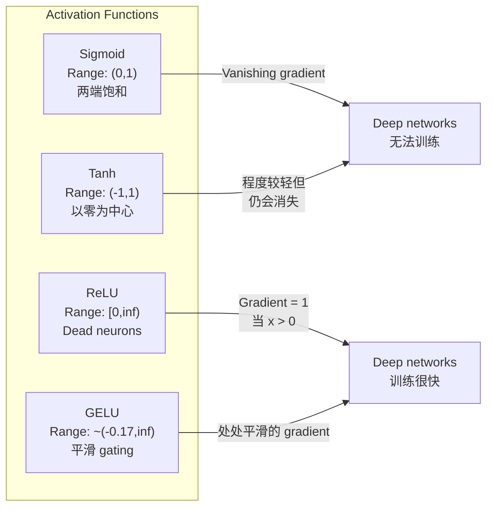
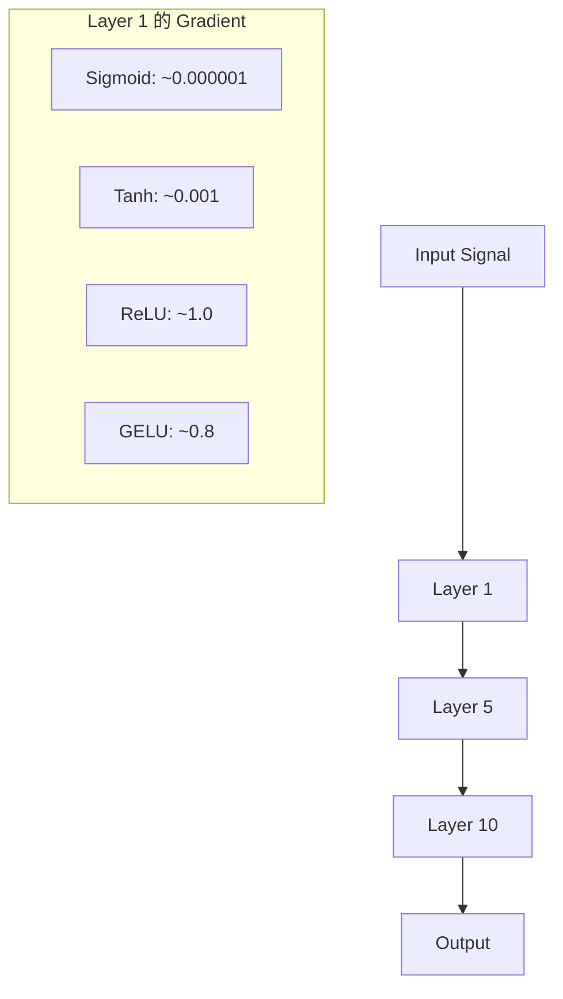
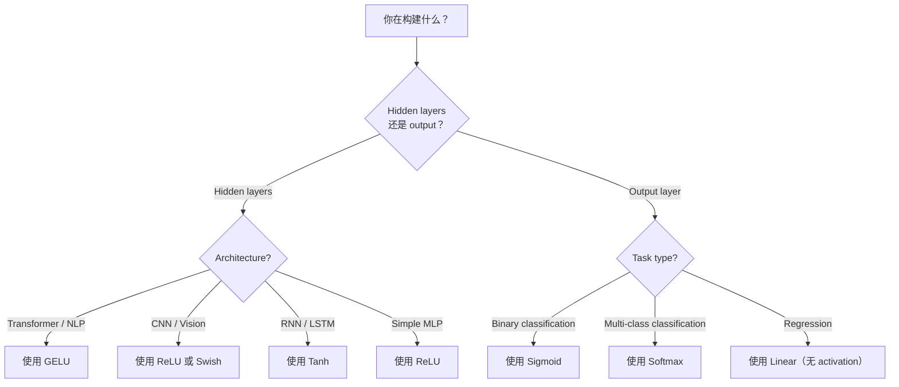

# 激活函数

> 无非线性, senin 100 katlı ağın sadece bir kez精致 Matrix çarpımı.

**Type:** Build
**Languages:** Python
**Prerequisites:** Lesson 03.03 (Backpropagation)
**Time:** ~75 分钟

## Öğrenme hedefi

- Sigmoid, tanh, ReLU, Leaky ReLU, GELU, Swish, Softmax ve onun türevleri
- 通过测量不同激活在10+ 层中的激活大小,诊断消失梯度问题
- ReLU ağının ölü nöronları, GELU'nun neden bu tür bir başarısızlık modunu önleyebileceğini açıkladı.
- Bu yapı için doğru bir etkinleştirme fonksiyonunu seçin.

## 问题

堆叠两个线性变化:y = W2(W1x + b1) + b2。展开它:y = W2W1x + W2b1 + b2。这是只是 y = Ax + c一个单线性变化──无论你堆叠多少线性层,结果都会缩成一次矩阵乘──你的100层网络与单层 具有相同表示能力──

Bu teorik bir hırsızlık değil. Bu derin bir çizgi ağ anlamına gelir. XOR'u öğrenemez, spiral veri kümesini ayırt edemez, insan yüzünü tanımamaktadır.

Aktiflik fonksiyonları 打破线性── bunlar çizgi dışı fonksiyonlar 扭曲每层的输出,让网络 能够曲决策界限、近似任意函数,并真正学习──但是如果选择错误的激活,你的梯度会消失到零(深度网络中的 sigmoid)、爆炸到无穷大(谨慎的启动的无限激活),或者你的神经元会永久死亡(带有较大的负面偏见的 ReLU) ─激活的功能的选择直接决定你的网络 是否能学习──

## 概念

### Neden bu gereklidir?

Matrix çarpımı yapılandırılabilir. İlk olarak Matrix A'yı bir vektörle çarpır, sonra Matrix B'yi çarpır, sonuçta AB'yi doğrudan çarpır. Bu da matematikte on doğrusal katmanın bir büyük Matrix'in doğrusal katmanına eşit olduğu anlamına gelir. Tüm bu parametreler, tüm bu derinlikler boşa çıkar. Bu zinciri kesmek için bir şeye ihtiyacınız var. Bu, etkinleştirme fonksiyonlarının etkisi.

Aşağıda bir kanıt var. Bir çizgi katman f (x) = Wx + b (b) ∈ R

```
Layer 1: h = W1 * x + b1
Layer 2: y = W2 * h + b2
```

代入:

```
y = W2 * (W1 * x + b1) + b2
y = (W2 * W1) * x + (W2 * b1 + b2)
y = A * x + c
```

Bir katlılık. Bir katlılık arasında g()

```
h = g(W1 * x + b1)
y = W2 * h + b2
```

现在代入被打破了──W2 * g(W1 * x + b1) + b2 不能再简化为单线性转换──网络可以表示非线性函数──每增加一层带激活的层,都会增加表示能力──

### Sigmoid

Nöral Ağ'ın en erken etkinleştirme fonksiyonu:

```
sigmoid(x) = 1 / (1 + e^(-x))
```

输出范围:(0, 1)──平滑、可微,任意实数映射到类似概率的值──

Derivat:

```
sigmoid'(x) = sigmoid(x) * (1 - sigmoid(x))
```

Bu türevin en büyük değeri 0.25, x = 0 olarak ortaya çıkar. Geri yayılmada, gradientler bir adım adım adım adım adım adım adım adım adım adım adım adım adım adım adım adım adım adım adım adım adım adım adım adım adım adım adım adım adım adım adım adım adım adım adım adım adım adım adım adım adım adım adım adım adım adım adım adım adım adım adım adım adım adım adım adım adım adım adım adım adım adım adım adım adım adım adım adım adım adım adım adım adım adım adım adım adım adım adım adım adım adım adım adım adım adım adım adım adım adım adım adım adım adım adım adım adım adım adım adım adım adım adım adım adım adım adım adım adım adım adım adım adım adım adım adım adım adım adım adım adım adım adım adım adım adım adım adım adım adım adım adım adım adım adım adım adım adım adım adım adım adım adım adım adım adım adım adım adım adım adım adım adım adım adım adım adım adım adım adım adım adım adım adım adım adım adım adım adım adım adım adım adım adım adım adım adım adım adım adım adım adım adım adım adım adım adım adım adım adım adım adım adım adım adım adım adım adım adım adım adım adım adım adım adım adım adım adım adım adım adım adım adım adım adım adım adım adım adım adım adım adım adım adım adım adım adım adım adım adım adım adım adım adım adım adım adım adım adım adım adım adım adım adım adım adım adım adım adım adım adım adım adım adım adım adım adım adım adım adım adım adım adım adım adım adım adım adım adım adım adım adım adım adım adım adım adım adım adım adım adım adım adım adım adım adım adım adım adım adım adım adım adım adım adım adım adım adım adım adım adım adım adım adım adım adım adım adım adım adım adım adım adım adım adım adım adım adım adım adım adım adım adım adım adım adım adım adım adım adım adım adım adım adım adım adım adım adım adım adım adım adım adım adım adım adım adım adım adım adım adım adım adım adım adım adım adım adım adım adım adım adım adım adım adım adım adım adım adım adım adım adım adım adım adım adım adım adım adım adım adım adım adım adım adım adım adım adım adım adım adım adım adım adım adım adım adım adım adım adım adım adım adım adım adım adım adım adım adım adım adım adım adım adım adım adım adım adım adım adım adım adım adım adım adım adım adım adım adım adım adım adım adım adım adım adım adım adım adım adım adım adım adım adım adım adım adım adım adım adım adım adım adım adım adım adım adım adım adım adım adım adım adım adım adım adım adım adım adım adım adım adım adım adım adım adım adım adım adım adım adım adım adım

```
0.25^10 = 0.000000953674
```

İlk katmanlardaki katmanlar 极小变得,重量 几乎不更新──网络 看起来在学习后层的损失 在下降但前层已结──深度sigmoid网络 根本训练不起──

另一个问题:sigmoid 输出始终为正(0 到 1), bu da 总是同号―― 总是同号―― 总是同号―― 总是同号―― 总是同号―― 总是同号―― 总是同号―― 总是同号―― 总是同号―― 总是同号―― 总是同号―― 总是同号―― 总是同号―― 总是同号―― 总是同号―― 总是同号―― 总是同号―― 总是同号―― 总是同号―― 总是同号―― 总是同号―― 总是同号―― 总是同号―― 总是同号―― 总是同号―― 总是正数−0 到 1 总是正数−0 总是正数−0 到 1,总是正数−0 总是正数−0 到 1,总是正数−0 总是正数−0 到 1,总是正数−0 总是正数−0 总是正数−0 总是正数−0 总是正数−0−0−−−−−−−−−−−−−−−−−−−−−−−−−−−−−−−−−−−−−−−−−−−−−−−−−−−−−−−−−−−−−−−−−−−−−−−−−−−−−−−−−−−−−−−−−−−−−−−−−−−−−−−−−−−−−−−−−−−−−−−−−−−−−−−−−−−−−−−−−−−−−−−−−−−−−−−−−−−−−−−−−−−−−−−−−−−−−−−−−−−−−−−−−−−−−−−−−−−−−−−−−−−−−−−−−−−−−−−−−−−−−−−−−−−−−−−−−−−−−−−−−−−−−−−−

### Tanh

Sigmoid'in iç versiyonu:

```
tanh(x) = (e^x - e^(-x)) / (e^x + e^(-x))
```

输出范围:(-1, 1)──以零为中心,可以消除之字形问题──

Derivat:

```
tanh'(x) = 1 - tanh(x)^2
```

Maksimum türev x = 0 时为 1.0比sigmoid 好四倍――但消失梯度问题 仍然存在――对很大的正输入或负输入,衍生会趋近零――十层仍然会压碎梯度,只是没有那么激烈――

### - Ne demek istiyorsun ?

Düzgün Linyal Birim──Nair 和 Hinton 2010 yılında derin öğrenmeye yayıldı. Bu işlev kendisinin Fukushima 1969 çalışmalarına kadar uzanır.

```
relu(x) = max(0, x)
```

输出范围:[0, sonsuzluk) ・derivative 非常简单:

```
relu'(x) = 1  if x > 0
            0  if x <= 0
```

正输入 için, yok oluşan bir gradient yok.  gradient 正好是 1,会直接传递过去.

Ancak bir başarısızlık moduna sahiptir: ölü nöron sorunu. Eğer bir nöronun ağırlıklı girişleri 始终为负 (çok büyük negatif önyargı veya kötü bir ağırlık başlangıcı nedeniyle) ise, çıkışı sonsuza dek sıfır, dereceli 始终为零, bu nedenle asla yenilenmez.

### Sızan ReLU

Ölü nöronlar en basit onarım yolu.

```
leaky_relu(x) = x        if x > 0
                alpha * x if x <= 0
```

Bunlardan alfa, genellikle 0.01 olarak küçük bir sabitdir.

### GELU:现代默认选择

Gaussian Error Linear Unit── Hendrycks 和 Gimpel tarafından 2016 yılında önerilmiş───: BERT、GPT ve çoğu modern transformörün arasında default aktivasyonu──

```
gelu(x) = x * Phi(x)
```

Bunların arasında Phi(x) standart normal dağılımın kumülatîf dağılım fonksiyonu。 pratikte kullanılan yakın biçim:

```
gelu(x) ~= 0.5 * x * (1 + tanh(sqrt(2/pi) * (x + 0.044715 * x^3)))
```

GELU'da daha küçük bir negatif değer olmasına izin verir. Bu da bir olasılık açıklaması vardır: Gaussian dağılımında yer alan her giriş üzerine doğru bir olasılık vardır. Bu düz kaplama, daha iyi bir gradient akışı sağladığı için transformatör mimarisi arasında ReLU'dan daha iyidir.

### Swish / SiLU

Ramachandran et al. tarafından 2017 yılında otomatik arama yoluyla 发现的自闭门激活──

```
swish(x) = x * sigmoid(x)
```

Swish'in biçimi x * sigmoid(x) ・・・ Google tarafından aktifleştirme fonksiyonu alanında otomatik arama yapıldı.

GELU gibi, daha küçük bir negatif değerlere izin verir. Fark çok ince:Swish sigmoid'i geçit olarak kullanırken GELU Gaussian CDF'yi kullanır.

### Softmax: output Aktifleştirme

Gizli katmanlar için kullanılmıyor. Softmax, çamur puanlar (logits) vectörünü olasılık dağılımına dönüştürür.

```
softmax(x_i) = e^(x_i) / sum(e^(x_j) for all j)
```

Her çıkış 0 ile 1 arasında yer alır. Tüm çıkışlar 1 ile oluşur. Bu da onu çok sınıf sınıflandırma standartlarının son etkinleştirilmesine dönüştürür. En büyük logit en yüksek olasılığı elde eder, ancak argmax ile farklıdır.

### 形对比



### Gradyent Akış karşılığı



### Ne zaman hangi tür etkinleştirme kullanılır?



## 动手构建

### 步骤 1: tüm aktive etme fonksiyonlarını ve türevlerini gerçekleştirmek

Her işlevi bir kayganı alır ve bir kayganı geri gönderir.

```python
import math

def sigmoid(x):
    x = max(-500, min(500, x))
    return 1.0 / (1.0 + math.exp(-x))

def sigmoid_derivative(x):
    s = sigmoid(x)
    return s * (1 - s)

def tanh_act(x):
    return math.tanh(x)

def tanh_derivative(x):
    t = math.tanh(x)
    return 1 - t * t

def relu(x):
    return max(0.0, x)

def relu_derivative(x):
    return 1.0 if x > 0 else 0.0

def leaky_relu(x, alpha=0.01):
    return x if x > 0 else alpha * x

def leaky_relu_derivative(x, alpha=0.01):
    return 1.0 if x > 0 else alpha

def gelu(x):
    return 0.5 * x * (1 + math.tanh(math.sqrt(2 / math.pi) * (x + 0.044715 * x ** 3)))

def gelu_derivative(x):
    phi = 0.5 * (1 + math.erf(x / math.sqrt(2)))
    pdf = math.exp(-0.5 * x * x) / math.sqrt(2 * math.pi)
    return phi + x * pdf

def swish(x):
    return x * sigmoid(x)

def swish_derivative(x):
    s = sigmoid(x)
    return s + x * s * (1 - s)

def softmax(xs):
    max_x = max(xs)
    exps = [math.exp(x - max_x) for x in xs]
    total = sum(exps)
    return [e / total for e in exps]
```

### Adım 2: Görülebilirlik ölüme gidenler

-5'ten 5'e kadar 100 个均间隔点上计算梯度――, her etkinliğin gradienti nerede neredeyse sıfır olduğunu göstererek bir metin histogramı basın.

```python
def gradient_scan(name, derivative_fn, start=-5, end=5, n=100):
    step = (end - start) / n
    near_zero = 0
    healthy = 0
    for i in range(n):
        x = start + i * step
        g = derivative_fn(x)
        if abs(g) < 0.01:
            near_zero += 1
        else:
            healthy += 1
    pct_dead = near_zero / n * 100
    print(f"{name:15s}: {healthy:3d} healthy, {near_zero:3d} near-zero ({pct_dead:.0f}% dead zone)")

gradient_scan("Sigmoid", sigmoid_derivative)
gradient_scan("Tanh", tanh_derivative)
gradient_scan("ReLU", relu_derivative)
gradient_scan("Leaky ReLU", leaky_relu_derivative)
gradient_scan("GELU", gelu_derivative)
gradient_scan("Swish", swish_derivative)
```

### 步骤 3: Kaybolma Gradient 实验

Sigmoid ile ReLU kullanın, N 层 ileri geçiş yoluyla bir sinyal gönderin.

```python
import random

def vanishing_gradient_experiment(activation_fn, name, n_layers=10, n_inputs=5):
    random.seed(42)
    values = [random.gauss(0, 1) for _ in range(n_inputs)]

    print(f"\n{name} through {n_layers} layers:")
    for layer in range(n_layers):
        weights = [random.gauss(0, 1) for _ in range(n_inputs)]
        z = sum(w * v for w, v in zip(weights, values))
        activated = activation_fn(z)
        magnitude = abs(activated)
        bar = "#" * int(magnitude * 20)
        print(f"  Layer {layer+1:2d}: magnitude = {magnitude:.6f} {bar}")
        values = [activated] * n_inputs

vanishing_gradient_experiment(sigmoid, "Sigmoid")
vanishing_gradient_experiment(relu, "ReLU")
vanishing_gradient_experiment(gelu, "GELU")
```

### 步骤 4: Ölü Nöron 检测器

Bir ReLU ağı oluşturup, rastgele girişler gönderip, ne kadar nöron var olduğunu hesaplamak için aktifleşmemiş.

```python
def dead_neuron_detector(n_inputs=5, hidden_size=20, n_samples=1000):
    random.seed(0)
    weights = [[random.gauss(0, 1) for _ in range(n_inputs)] for _ in range(hidden_size)]
    biases = [random.gauss(0, 1) for _ in range(hidden_size)]

    fire_counts = [0] * hidden_size

    for _ in range(n_samples):
        inputs = [random.gauss(0, 1) for _ in range(n_inputs)]
        for neuron_idx in range(hidden_size):
            z = sum(w * x for w, x in zip(weights[neuron_idx], inputs)) + biases[neuron_idx]
            if relu(z) > 0:
                fire_counts[neuron_idx] += 1

    dead = sum(1 for c in fire_counts if c == 0)
    rarely_fire = sum(1 for c in fire_counts if 0 < c < n_samples * 0.05)
    healthy = hidden_size - dead - rarely_fire

    print(f"\nDead Neuron Report ({hidden_size} neurons, {n_samples} samples):")
    print(f"  Dead (never fired):     {dead}")
    print(f"  Barely alive (<5%):     {rarely_fire}")
    print(f"  Healthy:                {healthy}")
    print(f"  Dead neuron rate:       {dead/hidden_size*100:.1f}%")

    for i, c in enumerate(fire_counts):
        status = "DEAD" if c == 0 else "WEAK" if c < n_samples * 0.05 else "OK"
        bar = "#" * (c * 40 // n_samples)
        print(f"  Neuron {i:2d}: {c:4d}/{n_samples} fires [{status:4s}] {bar}")

dead_neuron_detector()
```

### 5 adım: Train对比Sigmoid vs ReLU vs GELU

Çember veri kümesi içinde, 圆内点 = class 1,圆外 = class 0) üzerinde, üç farklı etkinleştirme ile antrenman yaparak iki katlı ağla birlikte.

```python
def make_circle_data(n=200, seed=42):
    random.seed(seed)
    data = []
    for _ in range(n):
        x = random.uniform(-2, 2)
        y = random.uniform(-2, 2)
        label = 1.0 if x * x + y * y < 1.5 else 0.0
        data.append(([x, y], label))
    return data


class ActivationNetwork:
    def __init__(self, activation_fn, activation_deriv, hidden_size=8, lr=0.1):
        random.seed(0)
        self.act = activation_fn
        self.act_d = activation_deriv
        self.lr = lr
        self.hidden_size = hidden_size

        self.w1 = [[random.gauss(0, 0.5) for _ in range(2)] for _ in range(hidden_size)]
        self.b1 = [0.0] * hidden_size
        self.w2 = [random.gauss(0, 0.5) for _ in range(hidden_size)]
        self.b2 = 0.0

    def forward(self, x):
        self.x = x
        self.z1 = []
        self.h = []
        for i in range(self.hidden_size):
            z = self.w1[i][0] * x[0] + self.w1[i][1] * x[1] + self.b1[i]
            self.z1.append(z)
            self.h.append(self.act(z))

        self.z2 = sum(self.w2[i] * self.h[i] for i in range(self.hidden_size)) + self.b2
        self.out = sigmoid(self.z2)
        return self.out

    def backward(self, target):
        error = self.out - target
        d_out = error * self.out * (1 - self.out)

        for i in range(self.hidden_size):
            d_h = d_out * self.w2[i] * self.act_d(self.z1[i])
            self.w2[i] -= self.lr * d_out * self.h[i]
            for j in range(2):
                self.w1[i][j] -= self.lr * d_h * self.x[j]
            self.b1[i] -= self.lr * d_h
        self.b2 -= self.lr * d_out

    def train(self, data, epochs=200):
        losses = []
        for epoch in range(epochs):
            total_loss = 0
            correct = 0
            for x, y in data:
                pred = self.forward(x)
                self.backward(y)
                total_loss += (pred - y) ** 2
                if (pred >= 0.5) == (y >= 0.5):
                    correct += 1
            avg_loss = total_loss / len(data)
            accuracy = correct / len(data) * 100
            losses.append(avg_loss)
            if epoch % 50 == 0 or epoch == epochs - 1:
                print(f"    Epoch {epoch:3d}: loss={avg_loss:.4f}, accuracy={accuracy:.1f}%")
        return losses


data = make_circle_data()

configs = [
    ("Sigmoid", sigmoid, sigmoid_derivative),
    ("ReLU", relu, relu_derivative),
    ("GELU", gelu, gelu_derivative),
]

results = {}
for name, act_fn, act_d_fn in configs:
    print(f"\n=== Training with {name} ===")
    net = ActivationNetwork(act_fn, act_d_fn, hidden_size=8, lr=0.1)
    losses = net.train(data, epochs=200)
    results[name] = losses

print("\n=== Final Loss Comparison ===")
for name, losses in results.items():
    print(f"  {name:10s}: start={losses[0]:.4f} -> end={losses[-1]:.4f} (improvement: {(1 - losses[-1]/losses[0])*100:.1f}%)")
```


```figure
softmax-temperature
```

## Kullan

PyTorch aynı zamanda tüm bu fonksiyonları fonksiyonel ve modül olarak iki biçimle sunmaktadır:

```python
import torch
import torch.nn as nn
import torch.nn.functional as F

x = torch.randn(4, 10)

relu_out = F.relu(x)
gelu_out = F.gelu(x)
sigmoid_out = torch.sigmoid(x)
swish_out = F.silu(x)

logits = torch.randn(4, 5)
probs = F.softmax(logits, dim=1)

model = nn.Sequential(
    nn.Linear(10, 64),
    nn.GELU(),
    nn.Linear(64, 32),
    nn.GELU(),
    nn.Linear(32, 5),
)
```

Transformer İçeri Gizli katmanlar:GELU。CNN İçeri gizli katmanlar:ReLU。 sınıflandırma:softmax。regression output layer:无(linear)。概率 output layer:sigmoid。就是如此。先从这些默认值开始──只有你有证证时才改变它们──

RNN ve LSTM'ler gizli durum kullanımı tanh, kapı kullanımı sigmoid, ama eğer bugün sıfırdan inşa ederseniz, büyük olasılıkla RNN'leri kullanmayacaksınız. Eğer RLU ağınızdaki nöronlar ölü durumda ise, GELU'ya geçin.

## 交付成果

Bu ders:
- `outputs/prompt-activation-selector.md` Bir tekrarlanabilir istek, herhangi bir mimari için yardımcı  doğru etkinleştirme fonksiyonunu seçin

## 练习

1. 实现 Parametric ReLU (PReLU), negatif eğim alfa bir öğrenilebilir parametredir.

2. 10 katlılıktan 50 katlılıkta çalışacak. Sigmoid, Tanh, RELU ve GELU'yu her katlılıkta çizmek.

3. 实现 ELU (Exponential Linear Unit):elu(x) = x eğer x > 0, alfa * (e^x - 1) eğer x <= 0──

4. Gradient sağlık monitörü inşa et, trening period during operation: Each epoch  calculate the average gradient magnitude of each layer── herhangi bir katmanın gradienti  0.001'den düşük veya 100'den fazla olduğunda uyarı yazın──

5. 修改训练对比, XOR'un çevreler yerine ders 01'deki XOR verileri kullanın. XOR'da hangi tür etkinleştirme en hızlı?

## 关键术语

| Term | 人们怎么说 | 它实际是什么意思 |
|------|----------------|----------------------|
| Activation function | “非线性部分” | 应用于每个 neuron 输出的函数，用于打破线性，使 network 能够学习 nonlinear mappings |
| Vanishing gradient | “Gradients 在 deep networks 中消失” | 当 activation 的 derivative 小于 1 时，gradients 会通过 layers 指数级缩小，使早期 layers 无法训练 |
| Exploding gradient | “Gradients 爆炸” | 当有效乘数超过 1 时，gradients 会通过 layers 指数级增长，导致训练不稳定 |
| Dead neuron | “停止学习的 neuron” | 输入永久为负的 ReLU neuron，会产生零输出和零 gradient |
| Sigmoid | “把值压缩到 0-1” | logistic function 1/(1+e^-x)，历史上很重要，但会在 deep networks 中导致 vanishing gradients |
| ReLU | “把负数裁剪为零” | max(0, x)——通过保留 gradient magnitude 让 deep learning 变得实用的 activation |
| GELU | “transformer activation” | Gaussian Error Linear Unit，一种平滑 activation，会根据输入为正的概率对输入加权 |
| Swish/SiLU | “Self-gated ReLU” | x * sigmoid(x)，通过 automated search 发现，用于 EfficientNet |
| Softmax | “把分数变成概率” | 将 logits 的 Vector 归一化为 probability distribution，其中所有值都在 (0,1) 内且总和为 1 |
| Leaky ReLU | “不会死亡的 ReLU” | max(alpha*x, x)，其中 alpha 很小（0.01），通过允许较小的 negative gradients 来防止 dead neurons |
| Saturation | “sigmoid 的平坦部分” | activation 的 derivative 趋近于零的区域，会阻断 gradient flow |
| Logit | “softmax 之前的原始分数” | 应用 softmax 或 sigmoid 之前，final layer 的未归一化输出 |

## 延伸阅读

- Nair & Hinton, "Düzeltilmiş Hattı Birimler Sınırlı Boltzmann Makineleri İyileştirir" (2010) 介绍 ReLU 并促成深度网络 训练的论文
- Hendrycks & Gimpel, "Gaussian Error Linear Units (GELUs) " (2016)  later being transformers 默认选择的激活函数
- Ramachandran et al., "Aktıfasyon Fonksiyonları Arama" (2017)  automated search 发现 Swish, demonstration activation 设计可以自动化
- Glorot & Bengio, "Deep Feedforward sinir ağlarının eğitimi zorluklarını anlamak" (2010)  Diagnosis vanishing/exploding gradients 并 propose Xavier initialization 的论文
- Goodfellow, Bengio, Courville, "Deep Learning" 6.3 (https://www.deeplearningbook.org/) Gizli birimler ve etkinleştirme fonksiyonları hakkında titiz bir açıklama
