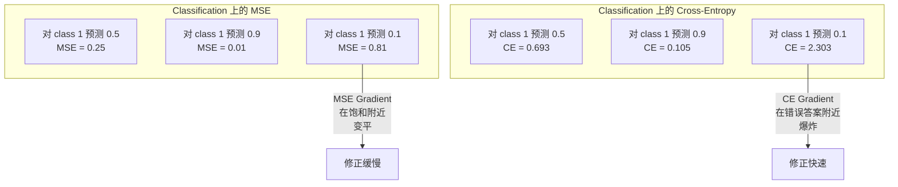
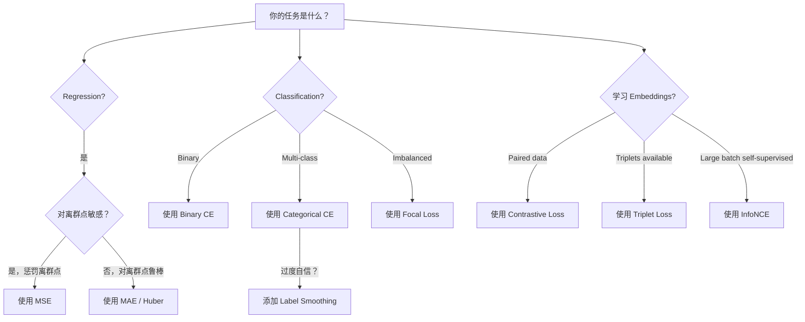
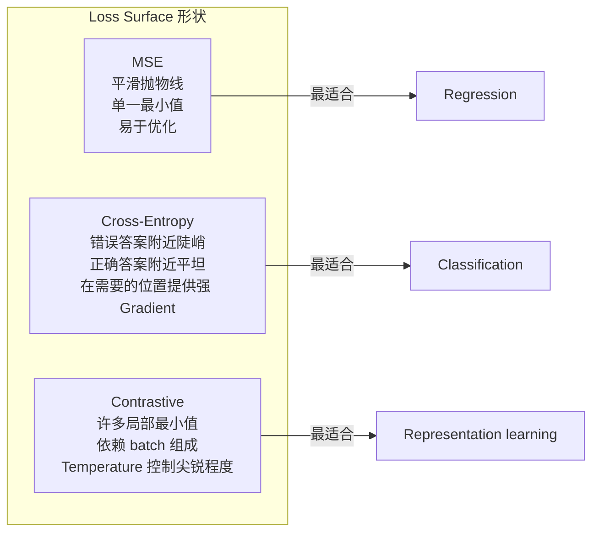

# Kayıp Fonksiyonları

> Senin sinir ağının bir tahmin yapması. Yerel gerçeklik farklı cevaplar verir.

**Type:** Build
**Languages:** Python
**Prerequisites:** Lesson 03.04 (Activation Functions)
**Time:** ~75 minutes

## Öğrenme hedefi

- MSE'nin 零 gerçekleşmesinden ∞ biner çapraz entropi ∞ kategorik çapraz entropi ∞ kontrast kaybı (InfoNCE) ∞ ve bunların gradiyenti
- 通过演示对所有样本都预测 0.5的失败模式,解释为什么MSE不适合分类
- Etiket düzeltme                                                                                                                                                                                                                                                                                                                                                                                                                                                                                                                         
- Geri dönüş, ikili sınıflandırma, çok sınıf sınıflandırma, ve gömleyici öğrenme görevleri doğru bir kayıp fonksiyon seçmek

## 问题

Sınıflandırma  sorunu üzerinde en azlaştırılmış MSE'nin modeli, her şeyi tahmin etmek için çok güvenle olacaktır 0.5── aslında en azlaştırılmış Kayıplar vardır── ama tamamen kullanılmaz──

Kayıp Fonksiyonu, modelin gerçekte iyileştirilmesinin tek bir nesnesi değildir. Düzgünlik değildir. F1 puanı değildir. Ayrıca, yöneticinin herhangi bir metrikini de değildir. Optimizer Kayıp Fonksiyonunun derecesini alır ve bu rakamı küçükleştirmek için yükünü düzenler. Eğer Kayıp Fonksiyonu gerçekten ilgilendiğiniz şeyi yakalamıyorsa, model matematikte en düşük maliyetli bir yolu bulur.

Burada bir örnek vardır. Burada iki sınıflandırma vardır. Sorunlar, 50/50 bölünmüştür. MSE'yi bir kayıp olarak kullanırsın. Modeldeki her giriş için ortalama MSE 0.25'dir. Bu, her neyi öğrenmediğimiz durumlarda elde edilebilecek en düşük değerdir. Bu model herhangi bir ayırt etme yeteneği yoktur, ancak teknik olarak kayıp işleviyi en aza indirmiştir.

状況も悪化します──Self-supervised learning'de, sen bile etiketsiz olursun── Kontrast Lossi 完全定義学习信号: nedir, neye benziyor, ne farklı,以及模型 should be able to divide them apart── Kontrast Lossi 書き错了, Your Embeddings will collapse to one point − Her giriş hepsi aynı vektora yerleştirilmiştir── Teknik olarak Kayıplar ise aslında hiçbir değeri yoktur──

## 概念

### Ortalama Karakter Hata (MSE)

Geri dönüşün öntanımlı seçeneği: hesaplama tahmin değeri ve hedef değeri arasındaki farkın kare ve tüm örneklere ortalama olarak değerlendirilmesi

```
MSE = (1/n) * sum((y_pred - y_true)^2)
```

Neden kare önemli: Büyük hataları ikinci bir şekilde cezalandıracaktır. 2'nin fiyatı 1'in 4 katıdır. 10'un fiyatı 100 katıdır. Bu da MSE'yi bölge noktalarına karşı hassas hale getirir.

Gerçek rakam: Eğer modeliniz ev fiyatını tahmin ederse, çoğu evin farkı $10,000，但对一栋豪宅偏差 $200.000 MSE'nin, o evin performansını etkileyecek bir iyileşme girişiminde bulunması.

MSE karşı karşı tahmin değerinin derecesi:

```
dMSE/dy_pred = (2/n) * (y_pred - y_true)
```

Bu, Regresyon'un özelliği, sınıflandırmanın sorunu, güvenle ama yanlış cevaplara yönelik bir dizi cezası yerine, bir dizi cezası olmasını istersin.

### Çaplak Entropi Kayıpları

Sınıflandırma Kayıp Fonksiyonu── bu bilgi teorisi'nden kaynaklanıyor -- 预测概率分布与真实分布之间的差を衡量します──

**Binary Cross-Entropy (BCE):**

```
BCE = -(y * log(p) + (1 - y) * log(1 - p))
```

Bu da gerçek bir 标签dir.

Neden -log(p) 有效:当真标签是1 且你预测 p = 0.99 时,Loss is -log(0.99) = 0.01。当你预测 p = 0.01 时,Loss is -log(0.01) = 4.6。 Bu 460 倍 差的差就是交叉热 有效的原因──它会严厉惩罚自信但错误的预测,几乎不惩罚自信且正确的预测──

Gradient 讲述是同一个故事:

```
dBCE/dp = -(y/p) + (1-y)/(1-p)
```

Y = 1 ve p ≈ 0 时, Gradient ≈ -1/p, ≈ -负 ≈ ≈ ≈ ≈ ≈ ≈ ≈ ≈ ≈ ≈ ≈ ≈ ≈ ≈ ≈ ≈ ≈ ≈ ≈ ≈ ≈ ≈ ≈ ≈ ≈ ≈ ≈ ≈ ≈ ≈ ≈ ≈ ≈ ≈ ≈ ≈ ≈ ≈ ≈ ≈ ≈ ≈ ≈ ≈ ≈ ≈ ≈ ≈ ≈ ≈ ≈ ≈ ≈ ≈ ≈ ≈ ≈ ≈ ≈ ≈ ≈ ≈ ≈ ≈ ≈ ≈ ≈ ≈ ≈ ≈ ≈ ≈ ≈ ≈ ≈ ≈ ≈ ≈ ≈ ≈ ≈ ≈ ≈ ≈ ≈ ≈ ≈ ≈ ≈ ≈ ≈ ≈ ≈ ≈ ≈ ≈ ≈ ≈ ≈ ≈ ≈ ≈ ≈ ≈ ≈ ≈ ≈ ≈ ≈ ≈ ≈ ≈ ≈ ≈ ≈ ≈ ≈ ≈ ≈ ≈ ≈ ≈ ≈ ≈ ≈ ≈ ≈ ≈ ≈ ≈ ≈ ≈ ≈ ≈ ≈ ≈ ≈ ≈ ≈ ≈ ≈ ≈ ≈ ≈ ≈ ≈ ≈ ≈ ≈ ≈ ≈ ≈ ≈ ≈ ≈ ≈ ≈ ≈ ≈ ≈ ≈ ≈ ≈ ≈ ≈ ≈ ≈ ≈ ≈ ≈ ≈ ≈ ≈ ≈ ≈ ≈ ≈ ≈ ≈ ≈ ≈ ≈ ≈ ≈ ≈ ≈ ≈ ≈ ≈ ≈ ≈ ≈ ≈ ≈ ≈ ≈ ≈ ≈ ≈ ≈ ≈ ≈ ≈ ≈ ≈ ≈ ≈ ≈ ≈ ≈ ≈ ≈ ≈ ≈ ≈ ≈ ≈ ≈ ≈ ≈ ≈ ≈ ≈ ≈ ≈ ≈ ≈ ≈ ≈ ≈ ≈ ≈ ≈ ≈ ≈ ≈ ≈ ≈ ≈ ≈ ≈ ≈ ≈

**Categorical Cross-Entropy:**

Tek ısılı 编码 hedefinin çok sınıf sınıflandırılması için kullanılmıştır.

```
CCE = -sum(y_i * log(p_i))
```

只有真实类别会贡献损失(因为其他所有 y_i 都是零) ⋅ Eğer 10 类 varsa,正确类别得到的概率是0.1 (随机猜测),Loss is -log (log) ⋅0.1) = 2.3 (■■■ Eğer正确类别得到的概率是0.9,Loss is -log (log) ⋅0.9) =0.105 (■■■■■■■■■■■ Model,概率质量集中到正确答案上――

### Neden MSE sınıflandırmaya uygun değil ?



Bu noktayı karşılayan, MSE Gradientı 和 nedeniyle 和) ⋅Sigmoid'in düz bölgesi, en çok ihtiyaç duyduğu yerde güçlü bir Gradient vermiştir.

### Etiket Düzeltme

標準 one-hot 标签会会说这是100%类3,其他类别都是0%──这是一个强烈的断言──标签滑滑会软化它:

```
smooth_label = (1 - alpha) * one_hot + alpha / num_classes
```

Alfa = 0.1 且有 10 个类别时:目标不再是 [0, 0, 1, 0, ...],而是 [0.01, 0.01, 0.91, 0.01,...]──模型的目标是0.91,而不是 1.0──

Neden bu işe yarıyor: Softmax 输出精确 1.0 modelinden geçmeye çalışmak, logitleri 推向无穷的方向に推移する必要がある. Bu aşırı güven, genelleşme yeteneğini bozmak, modellerin dağılımsal etkisi zayıf hale gelmesine neden olur. Etiket düzeltmesi, hedef sınırını 0.9 ((alfa=0.1 时) olarak belirleyecek.

### Karşılıklı Kayıp

没有标签.没有类别. 只有输入对和一个问题:它们相似还是不同?

**SimCLR-style contrastive loss (NT-Xent / InfoNCE):**

取一张图像──创建它的两个增强视图──作物,旋转,色动──它们是积极对──它们应该有相似的嵌入──rütfede bulunan diğer her 张图像都形成一个负面对──它们应该有不同的嵌入──

```
L = -log(exp(sim(z_i, z_j) / tau) / sum(exp(sim(z_i, z_k) / tau)))
```

İçinde sim() y y cosine benzerliği, z_i 和 z_j y pozitif çift,求和覆盖所有负面,tau ( sıcaklık) 控制分布的尖程度──更低的温度 = 更难的负面 = 更激进的分离──

Gerçek rakam: seri boyutu 256 yani her olumlu çift için 255  negatif vardır. Su sıcaklığı tau = 0.07(SimCLR 默认值) ・・・ bu Kayıp, yumuşak maksimum yapma benzerliği karşı görünüyor.

**Triplet Loss:**

接收三个输入:ankör、pozitfıfıfıfıfıfıfıfıfıfıfıfıfıfıfıfıfıfıfıfıfıfıfıfıfıfıfıfıfıfıfıfıfıfıfıfıfıfıfıfıfıfıfıfıfıfıfıfıfıfıfıfıfıfıfıfıfıfıfıfıfıfıfıfıfıfıfıfıfıfıfıfıfıfıfıfıfıfıfıfıfıfıfıfıfıfıfıfıfıfıfıfıfıfıfıfıfıfıfıfıfıfıfıfıfıfıfıfıfıfıfıfıfıfıfıfıfıfıfıfıfıfıfıfıfıfıfıfıfıfıfıfıfıfıfıfıfıfıfıfıfıfıfıfıfıfıfıfıfıfıfıfıfıfıfıfıfıfıfıfıfıfıfıfıfıfıfıfıfıfıfıfıfıfıfıfıfıfıfıfıfıfıfıfıfıfıfıfıfıfıfıfıfıfıfıfıfıfıfıfıfıfıfıfıfıfıfıfıfıfıfıfıfıfıfıfıfıfıfıfıfıfıfıfıfıfıfıfıfıfıf

```
L = max(0, d(anchor, positive) - d(anchor, negative) + margin)
```

Marjinin (öntemde 0.2-1.0) zorunlu pozitif ve negatif arasındaki mesafe en az bir ara vardır. Eğer negatif  yeterince uzaksa, Kayıp ise ise ise 零,  Gradient yok, yenilik yok. Bu, antrenmanın daha etkili olmasına neden olur, ancak dikkatli bir üçlü madencilik yapılması gerekir.

### Göz Kayıpları

Uses in unbalanced data sets. Standart cross-entropy 会等待所有正确分类样本.

```
FL = -alpha * (1 - p_t)^gamma * log(p_t)
```

Bu nedenle, bu değerler, bir diğer değerden daha fazla değer içerir.

- Basit örnek (p_t = 0,9): ağırlık = (0.1) ^ 2 = 0.01──基本被忽略──
- Sert örnek (p_t = 0.1): ağırlık = (0.9) ^2 = 0.81──完整的 Gradient 信号──

Lin ve diğerleri tarafından önerilen, nesne tespitinde kullanılırken, bunların %99'unun seçimi bölgesi arka plandır.

### Kayıp Fonksiyonu 决策树



### Kayıp Çevre




```figure
cross-entropy-loss
```

## Yapın onu.

### 步骤 1: MSE  ve Gradient

```python
def mse(predictions, targets):
    n = len(predictions)
    total = 0.0
    for p, t in zip(predictions, targets):
        total += (p - t) ** 2
    return total / n

def mse_gradient(predictions, targets):
    n = len(predictions)
    grads = []
    for p, t in zip(predictions, targets):
        grads.append(2.0 * (p - t) / n)
    return grads
```

### 步骤 2: Binary Cross-Entropy

log(0)  sorun gerçek varlıklı bir soru. Eğer model olumlu bir örnekle karşı karşıya kalırsa 精确预测 0,log(0) =负无穷──剪可以防止这一点──

```python
import math

def binary_cross_entropy(predictions, targets, eps=1e-15):
    n = len(predictions)
    total = 0.0
    for p, t in zip(predictions, targets):
        p_clipped = max(eps, min(1 - eps, p))
        total += -(t * math.log(p_clipped) + (1 - t) * math.log(1 - p_clipped))
    return total / n

def bce_gradient(predictions, targets, eps=1e-15):
    grads = []
    for p, t in zip(predictions, targets):
        p_clipped = max(eps, min(1 - eps, p))
        grads.append(-(t / p_clipped) + (1 - t) / (1 - p_clipped))
    return grads
```

### 步骤 3: 带 Softmax 的 分类交叉

Softmax orijinal logitleri 概率 olarak dönüştürür. Sonra bir sıcak hedefe göre  çapraz entropi hesaplarız.

```python
def softmax(logits):
    max_val = max(logits)
    exps = [math.exp(x - max_val) for x in logits]
    total = sum(exps)
    return [e / total for e in exps]

def categorical_cross_entropy(logits, target_index, eps=1e-15):
    probs = softmax(logits)
    p = max(eps, probs[target_index])
    return -math.log(p)

def cce_gradient(logits, target_index):
    probs = softmax(logits)
    grads = list(probs)
    grads[target_index] -= 1.0
    return grads
```

Softmax + Cross-entropy'nin Gradient 会优雅地化简化: Gerçek sınıflara göre, sadece bir tahmin olasılığı - 1), diğer sınıflara göre, sadece bir tahmin olasılığıdır.

### 4 adım: Etiket Düzeltme

```python
def label_smoothed_cce(logits, target_index, num_classes, alpha=0.1, eps=1e-15):
    probs = softmax(logits)
    loss = 0.0
    for i in range(num_classes):
        if i == target_index:
            smooth_target = 1.0 - alpha + alpha / num_classes
        else:
            smooth_target = alpha / num_classes
        p = max(eps, probs[i])
        loss += -smooth_target * math.log(p)
    return loss
```

### 步骤 5: Kontrast Kayıpları

```python
def cosine_similarity(a, b):
    dot = sum(x * y for x, y in zip(a, b))
    norm_a = math.sqrt(sum(x * x for x in a))
    norm_b = math.sqrt(sum(x * x for x in b))
    if norm_a < 1e-10 or norm_b < 1e-10:
        return 0.0
    return dot / (norm_a * norm_b)

def contrastive_loss(anchor, positive, negatives, temperature=0.07):
    sim_pos = cosine_similarity(anchor, positive) / temperature
    sim_negs = [cosine_similarity(anchor, neg) / temperature for neg in negatives]

    max_sim = max(sim_pos, max(sim_negs)) if sim_negs else sim_pos
    exp_pos = math.exp(sim_pos - max_sim)
    exp_negs = [math.exp(s - max_sim) for s in sim_negs]
    total_exp = exp_pos + sum(exp_negs)

    return -math.log(max(1e-15, exp_pos / total_exp))
```

### 步骤 6: sınıflandırma  上的 MSE vs Cross-Entropy

Use两种 Loss Function 训练课 04 中 中的同一个神经网络(kör verileri) ・・・观察交叉 Entropy 收得更快──

```python
import random

def sigmoid(x):
    x = max(-500, min(500, x))
    return 1.0 / (1.0 + math.exp(-x))

def make_circle_data(n=200, seed=42):
    random.seed(seed)
    data = []
    for _ in range(n):
        x = random.uniform(-2, 2)
        y = random.uniform(-2, 2)
        label = 1.0 if x * x + y * y < 1.5 else 0.0
        data.append(([x, y], label))
    return data


class LossComparisonNetwork:
    def __init__(self, loss_type="bce", hidden_size=8, lr=0.1):
        random.seed(0)
        self.loss_type = loss_type
        self.lr = lr
        self.hidden_size = hidden_size

        self.w1 = [[random.gauss(0, 0.5) for _ in range(2)] for _ in range(hidden_size)]
        self.b1 = [0.0] * hidden_size
        self.w2 = [random.gauss(0, 0.5) for _ in range(hidden_size)]
        self.b2 = 0.0

    def forward(self, x):
        self.x = x
        self.z1 = []
        self.h = []
        for i in range(self.hidden_size):
            z = self.w1[i][0] * x[0] + self.w1[i][1] * x[1] + self.b1[i]
            self.z1.append(z)
            self.h.append(max(0.0, z))

        self.z2 = sum(self.w2[i] * self.h[i] for i in range(self.hidden_size)) + self.b2
        self.out = sigmoid(self.z2)
        return self.out

    def backward(self, target):
        if self.loss_type == "mse":
            d_loss = 2.0 * (self.out - target)
        else:
            eps = 1e-15
            p = max(eps, min(1 - eps, self.out))
            d_loss = -(target / p) + (1 - target) / (1 - p)

        d_sigmoid = self.out * (1 - self.out)
        d_out = d_loss * d_sigmoid

        for i in range(self.hidden_size):
            d_relu = 1.0 if self.z1[i] > 0 else 0.0
            d_h = d_out * self.w2[i] * d_relu
            self.w2[i] -= self.lr * d_out * self.h[i]
            for j in range(2):
                self.w1[i][j] -= self.lr * d_h * self.x[j]
            self.b1[i] -= self.lr * d_h
        self.b2 -= self.lr * d_out

    def compute_loss(self, pred, target):
        if self.loss_type == "mse":
            return (pred - target) ** 2
        else:
            eps = 1e-15
            p = max(eps, min(1 - eps, pred))
            return -(target * math.log(p) + (1 - target) * math.log(1 - p))

    def train(self, data, epochs=200):
        losses = []
        for epoch in range(epochs):
            total_loss = 0.0
            correct = 0
            for x, y in data:
                pred = self.forward(x)
                self.backward(y)
                total_loss += self.compute_loss(pred, y)
                if (pred >= 0.5) == (y >= 0.5):
                    correct += 1
            avg_loss = total_loss / len(data)
            accuracy = correct / len(data) * 100
            losses.append((avg_loss, accuracy))
            if epoch % 50 == 0 or epoch == epochs - 1:
                print(f"    Epoch {epoch:3d}: loss={avg_loss:.4f}, accuracy={accuracy:.1f}%")
        return losses
```

## Kullan

PyTorch tüm standart kaybı işlevi sağladı ve sayısal değer sabitliğini içerdi:

```python
import torch
import torch.nn as nn
import torch.nn.functional as F

predictions = torch.tensor([0.9, 0.1, 0.7], requires_grad=True)
targets = torch.tensor([1.0, 0.0, 1.0])

mse_loss = F.mse_loss(predictions, targets)
bce_loss = F.binary_cross_entropy(predictions, targets)

logits = torch.randn(4, 10)
labels = torch.tensor([3, 7, 1, 9])
ce_loss = F.cross_entropy(logits, labels)
ce_smooth = F.cross_entropy(logits, labels, label_smoothing=0.1)
```

Kullanım`F.cross_entropy`(Bunun yerine `F.nll_loss`Daha sonra, bu işlem, bir sabit işlem için bir log-softmax ve negatif log- olasılık olarak birlikte gerçekleşir.

 Kontrastlı öğrenme için, çoğu ekip kendi kendini tanımlamak veya kullanmak için kullanır `lightly`- Evet.`pytorch-metric-learning`Bu tür kütle. Kütle döngüsü her zaman aynıdır: hesaplama benzerliklere, olumlu ve olumsuzlara dayanır.

## - Söyle.

Bu ders:
- `outputs/prompt-loss-function-selector.md`-- Bir tekrarlanabilir istek, doğru Kayıp işlevi seçmek için
- `outputs/prompt-loss-debugger.md`- Bir teşhis tesisi, kayıp eğriliği ile ilgili bir durumla ilgilenmek için kullanılır.

## 练习

1. 实现 Huber loss(smooth L1 loss), it对小误差使用MSE,对大误差使用MAE──训练一个回归神经网络 来预测 y = sin(x),并加入随机噪音(离群点) 训练目标的5%的情况下 MSE 与 Huber──比较最终测试误差──

2. Fokal kaybı ekle biner sınıflandırma  eğitim döngüsünde  Create an imbalance data collection 90% class 0,10% class 1)  Comparison standard BCE with focal loss (gamma=2) in 200  epochs                                                                                                                                                                                                                                    

3. 实现带带半硬负矿的三重损失──为 5个类别生成 2D Embedding 数据──对每一个 ancor,找到仍然比积极更远的最硬负面(半硬)──将收情况与随机三重选择进行比较──

4. 运行 MSE vs. cross-entropy对比, ancak eğitim sırasında her aşamasının Gradient büyüklüğünü takip etmek, her döneminin ortalama Gradient normını çizmek, modelin en belirsiz erken dönemlerinde, cross-entropy daha büyük bir Gradient oluşturacaktır.

5. 实现 KL divergence loss,并验证当真实分布是一热时,最小化 KL(true 精算预测) 会给与交叉 Entropy 相同的 Gradient──然后尝试软目标──如知识蒸化),其中真实分布来自教师模型的软max 输出──

## 关键术语

| Term | 人们常说的说法 | 它实际意味着什么 |
|------|----------------|----------------------|
| Loss function | “模型错得有多离谱” | 一个可微函数，将预测和目标映射到 Optimizer 要最小化的标量 |
| MSE | “平均平方误差” | 预测和目标之间平方差的均值；以二次方式惩罚大误差 |
| Cross-entropy | “Classification 的 Loss” | 使用 -log(p) 衡量预测概率分布和真实分布之间的差异 |
| Binary cross-entropy | “BCE” | 两个类别的 cross-entropy：-(y*log(p) + (1-y)*log(1-p)) |
| Label smoothing | “软化目标” | 用软值（例如 0.1/0.9）替换硬 0/1 目标，以防止过度自信并提升泛化能力 |
| Contrastive loss | “拉近，推远” | 一种通过让相似对在 Embedding 空间中更近、非相似对更远来学习表示的 Loss |
| InfoNCE | “CLIP/SimCLR Loss” | 对相似度分数进行 normalized temperature-scaled cross-entropy；将 contrastive learning 视为 Classification |
| Focal loss | “不平衡数据修复方案” | 用 (1-p_t)^gamma 加权的 cross-entropy，用于降低 easy examples 的权重并聚焦 hard examples |
| Triplet loss | “Anchor-positive-negative” | 在 Embedding 空间中，使 anchor 比 negative 至少按一个 margin 更接近 positive |
| Temperature | “尖锐度旋钮” | 作用在 logits/相似度上的标量除数，用于控制结果分布的峰值程度；越低越尖锐 |

## 延伸阅读

- Lin et al., "Dense Object Deteksiyonu için odak kaybı" (2017) -- 引入焦失,用于处理对象检测 中的极端类别不平衡(RetinaNet)
- Chen et al., "Vizual Temsillerin Kontrastlı Öğrenmesi İçin Basit Bir Çerçeve" (SimCLR, 2020) -- 使用 NT-Xent loss 定义了现代 kontrastlı öğrenme 流程
- Szegedy et al., "Inception Architecture'ı Yeniden Düşünmek" (2016) -- 引入 Etiket düzeltme 作为正则化技术,如今已成为多数大模型的标准做法
- Hinton et al., "Neural Ağdaki Bilgiyi Destile etmek" (2015) -- Using Soft Targets 和 KL divergence of knowledge distillation, is model compressed of basis
