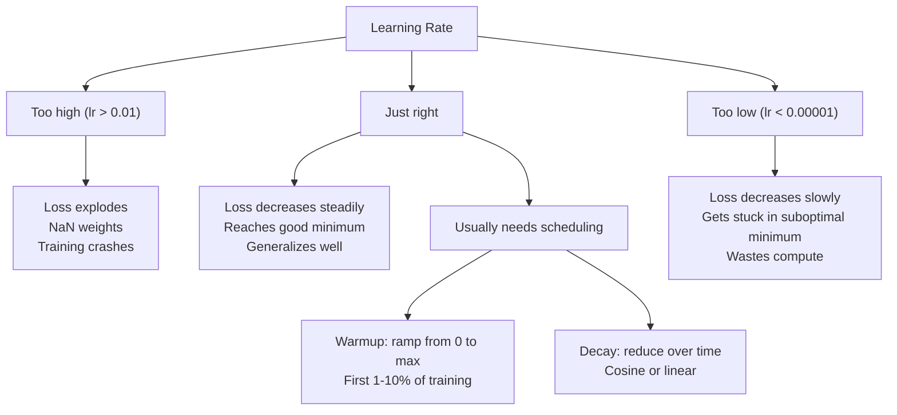
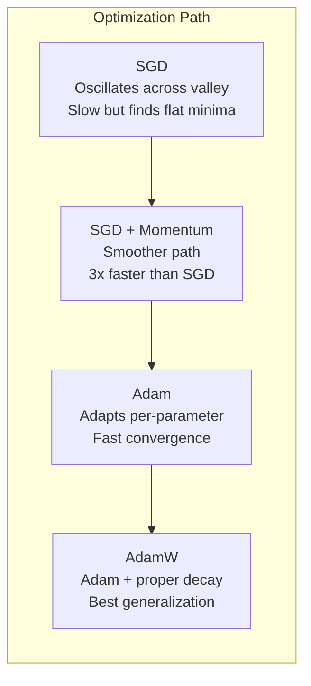
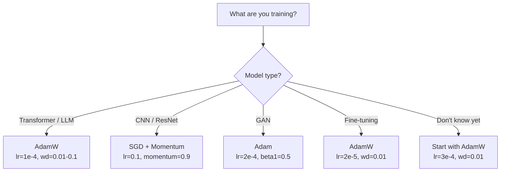

# Optimizeciler

> Gradient Descent  hangi yönde hareket etmeniz gerektiğini söyler. Ne çok uzakta ne de hızlı bir şekilde hareket etmeniz gerektiğini belirtmez.

**Type:** Build
**Languages:** Python
**Prerequisites:** Lesson 03.05 (Loss Functions)
**Time:** ~75 minutes

## Öğrenme hedefi

- Python'dan SGD'yi sıfırdan gerçekleştirmek için SGD'yi, Adam ve AdamW Optimizer'i kullanın.
- 解释 Adam'ın tarafsızlık düzeltmesi  如何补偿训练早期步骤中到零初始化的时刻估算
-  demonstrating why on the same task,AdamW has better generalization ability than L2 regularization of Adam  has better generalization ability on the same task,AdamW has better generalization ability than L2 regularization of Adam  has better generalization ability on the same task                                                                                                                                                                                                                                                                                                                                                                                                                                                                  
- Transformatörler, CNN, GAN ve ince ayarlamalar  Optimizer ve standart hiperparametreyi seçin

## 问题

Gradient'i hesapladın. Biliyor musun 4.721'in ağırlığı kaybı azaltmak için 0.003'e düşmeli. Ama 0.003'in birimi nedir?

Vanilla Gradient Descent her adım her parametre  aynı öğrenme oranını uygula: w = w - lr * gradient。 bu üç soruna neden olur, pratikte sinir ağının eğitimi çok acı verici hale gelmesine neden olur。

İlk olarak, titreşim. Bu kayıp manzarası  çok az bir düz bir kavanoz gibi. Daha çok bir uzun ve dar bir dağ vadisi gibi. Devamlı düşüş, vadinin boyunca değil, vadinin boyunca ilerlemektedir.

İkinci olarak, tüm parametreler için aynı öğrenme oranını kullanmak yanlışdır. Bazı ağırlıklar büyük ölçüde yenilenmelidir.

Üçüncü, otlak noktaları. Yüksek seviye alanında, Kayıp manzarası, Gradient'in sıfıra yakın olduğu düz bölgede büyük bir bölge vardır. Vanilla SGD bu bölgeleri Gradient'in hızıyla tırmanır. Bu hız aslında sıfıra yakın.

Adam  bu üç sorunu çözdü. Bu, her parametreden iki çalışkan ortalama - ortalama gradient (momentum, işlem振荡) ve ortalama kare gradient (adaptif hız, işlem farklı boyutlarda) ı korur. Önceki birkaç adımın tarafsızlık düzeltmesini yeniden birleştirir. Öntanımlı hiperparametre kullanılarak %80 sorunu çözebilir. Bu ders, sıfırdan inşa ederek, diğer %20'de nasıl ve neden başarısız olacağınızı anlamanızı sağlar.

## 概念

### Stochastic Gradient Descent (SGD)

En basit Optimizer. On-batch 上计算 Gradient,并朝相反方向前进一步.

```
w = w - lr * gradient
```

stochastic                                                                                                                                                                                                                                                            

Öğrenme oranı, tek bir dönüm noktasıdır. Çok yüksek: Kayıp 发散── Çok düşük: eğitim çok uzun sürecek. En iyi değer mimarlığa, veriye, seri boyutuna ve mevcut eğitim aşamasına bağlıdır.

### Gelişme

Küçük top roll down mountain slope'nin biçimleri çok fazla kullanılır, ama doğru bir şekilde kullanılır. Sadece ileriye gitme derecesine göre değil, geçmişe gitme derecesini toplamak için bir hız korumak için kullanılır.

```
m_t = beta * m_{t-1} + gradient
w = w - lr * m_t
```

Beta(genellikle 0.9) kontrol ederken, tarihsel bilgiyi saklamak için çok fazla bilgi vardır.

Neden bu canlandırma bozulması: Aynı yönde işaret eden Gradientler Birbirlerine karşı karşı karşıya gelecektir.

Gerçek rakam: Çok kötü koşullarda Kayıp manzarası üzerinde, tek başına SGD kullanmak 10.000 adım gerekebilir.

### RMSProp

İlk gerçekten etkili bir parametresi başına adapte öğrenme oranı 方法── Hinton tarafından önerilen  Coursera  cours中中

```
s_t = beta * s_{t-1} + (1 - beta) * gradient^2
w = w - lr * gradient / (sqrt(s_t) + epsilon)
```

s_t Follow square gradients'in yürüyüş ortalaması── sürekli daha büyük gradients'in parametreleri olacaktır daha büyük bir sayı ile ayrılırlar── daha küçük etkili öğrenme oranı─ Gradients'in daha küçük parametreleri olacaktır daha küçük bir sayı ile ayrılırlar── daha büyük etkili öğrenme oranı──

Bu, tüm parametreleri aynı öğrenme hızını kullanarak çözdü. Bir kişi sürekli olarak büyük bir şekilde yenileme ağırlığı kazanıyor.

Epsilon (önteminde 1e-8) bir parametrede  henüz yenilenmemişken çıkartılmasını önleyecektir.

### Adam: Momentum + RMSProp

Adam iki düşünceyi birleştirdi. Her bir parametre için iki eksponensial hareketli ortalama korudu:

```
m_t = beta1 * m_{t-1} + (1 - beta1) * gradient        (first moment: mean)
v_t = beta2 * v_{t-1} + (1 - beta2) * gradient^2       (second moment: variance)
```

**Bias correction**Bu, bir sonraki aşamada, m_1 = (1 - beta1) * gradient── beta1 = 0.9 时, bu 0.1 * gradient── 小了十倍──移動平均還沒有预熱──偏見修正 会進行補償:

```
m_hat = m_t / (1 - beta1^t)
v_hat = v_t / (1 - beta2^t)
```

第 1 步且 beta1 = 0.9 时:m_hat = m_1 / (1 - 0.9) = m_1 / 0.1 = 实际 Gradient。第 100 步时:(1 - 0.9^100) 约等于 1.0,因此纠正消失──偏差纠正对前 ~10 步非常重要,在 ~50 步后基本无关紧要──

Yeni bir resmi:

```
w = w - lr * m_hat / (sqrt(v_hat) + epsilon)
```

Adam 默认值:lr = 0.001,beta1 = 0.9,beta2 = 0.999,epsilon = 1e-8。 Bunlar %80'lik sorunlara uygundur。 Bunlar uygulanmadığında önce lr¬yi değiştirir。 sonra beta2¬yi değiştirir。 neredeyse asla beta1 veya epsilonı değiştirmez。

### AdamW: 正确处理 Ağırlık kaybı

L2 düzenlenme Kayba yönelişinde lambda * w^2♦ eklenir. Vanilya SGD'de, bu değer ağırlık kaybına denk gelir.

Loshchilov & Hutter'ın açı: L2'yi Kayba Eklerken, Sonra Adam'ı  Gradient 时, Adaptive Learning Rate 时, Adaptive Learning Rate 时, Adaptive Learning Rate 时, Adaptive Learning Rate 时, Adaptive Learning Rate 时, Adaptive Learning Rate 时, Adaptive Learning Rate 时, Adaptive Learning Rate 时, Adaptive Learning Rate 时, Adaptive Learning Rate 时, Adaptive Learning Rate 时, Adaptive Learning Rate 时, Adaptive Learning Rate 时, Adaptive Learning Rate 时, Adaptive Learning Rate 时, Adaptive Learning Rate 时, Adaptive Learning Rate 时, Adaptive Learning Rate 时, Adaptive Learning Rate 时, Adaptive Rate 时, Adaptive Rate 时, Adaptive Rate 时, Adaptive Rate 时, 时, 时, 时, 时, 时, 时, 时, 时, 时, 时, 时, 时, 时, 时, 时, 时, 时, 时, 时, 时, 时, 时, 时, 时, 时, 时, 时, 时, 时, 时, 时, 时, 时, 时, 时, 时, 时, 时, 时, 时, 时, 时, 时, 时, 时, 时, 时, 时, 时, 时, 时, 时, 时, 时, 时, 时, 时, 时, 时, 时, 时, 时, 时, 时, 时, 时, 时, 时, 时, 时, 时, 时, 时, 时, 时, 时, 时, 时, 时, 时, 时, 时, 时, 时, 时, 时, 时, 时, 时, 时, 时, 

AdamW                                                                                                                                                                                                                                                                                                                                                                                                                                                                                                                            

```
w = w - lr * m_hat / (sqrt(v_hat) + epsilon) - lr * lambda * w
```

Ağırlık kaybı terimi (lr * lambda * w) Adem'in uyarlayıcı faktörü tarafından kabul edilmez 缩放── her parametrenin eşit oranında küçülmesi elde edilir──

Bu küçük bir detay gibi görünüyor. Yok. AdamW neredeyse tüm görevlerde tüm olarak Adam + L2 düzenlenmesi 收到更好的解──它是PyTorch 中用于训练变压器、扩散模型和大多数现代建筑的默认优化器──BERT、GPT、LLaMA、Stable Diffusion -- 都是使用 AdamW 训练的──

### Öğrenme Hızı: En Önemli Hiperparametr



Eğer sadece bir hiperparametre ayarlıyorsanız, o zaman öğrenme oranını ayarlıyorsak. Öğrenme oranı 10 kat daha değişir.

- SGD: lr = 0.01 ila 0.1
- Adam/AdamW: lr = 1e-4 ile 3e-4
- Düzgün ayarlama öncesi eğitilmiş modeller: lr = 1e-5 ile 5e-5 arasında
- Öğrenme hızının ısınması: Önceki adımların % 1-10

### Optimizer karşılaştırma



### Her çeşit Optimizer 何時胜出




```figure
optimizer-trajectory
```

## Yapın onu.

### 步骤 1: Vanilla SGD

```python
class SGD:
    def __init__(self, lr=0.01):
        self.lr = lr

    def step(self, params, grads):
        for i in range(len(params)):
            params[i] -= self.lr * grads[i]
```

### 步骤 2: 带 Momentum 的 SGD

```python
class SGDMomentum:
    def __init__(self, lr=0.01, beta=0.9):
        self.lr = lr
        self.beta = beta
        self.velocities = None

    def step(self, params, grads):
        if self.velocities is None:
            self.velocities = [0.0] * len(params)
        for i in range(len(params)):
            self.velocities[i] = self.beta * self.velocities[i] + grads[i]
            params[i] -= self.lr * self.velocities[i]
```

### 3 adım: Adam

```python
import math

class Adam:
    def __init__(self, lr=0.001, beta1=0.9, beta2=0.999, epsilon=1e-8):
        self.lr = lr
        self.beta1 = beta1
        self.beta2 = beta2
        self.epsilon = epsilon
        self.m = None
        self.v = None
        self.t = 0

    def step(self, params, grads):
        if self.m is None:
            self.m = [0.0] * len(params)
            self.v = [0.0] * len(params)

        self.t += 1

        for i in range(len(params)):
            self.m[i] = self.beta1 * self.m[i] + (1 - self.beta1) * grads[i]
            self.v[i] = self.beta2 * self.v[i] + (1 - self.beta2) * grads[i] ** 2

            m_hat = self.m[i] / (1 - self.beta1 ** self.t)
            v_hat = self.v[i] / (1 - self.beta2 ** self.t)

            params[i] -= self.lr * m_hat / (math.sqrt(v_hat) + self.epsilon)
```

### 4 adım: AdamW

```python
class AdamW:
    def __init__(self, lr=0.001, beta1=0.9, beta2=0.999, epsilon=1e-8, weight_decay=0.01):
        self.lr = lr
        self.beta1 = beta1
        self.beta2 = beta2
        self.epsilon = epsilon
        self.weight_decay = weight_decay
        self.m = None
        self.v = None
        self.t = 0

    def step(self, params, grads):
        if self.m is None:
            self.m = [0.0] * len(params)
            self.v = [0.0] * len(params)

        self.t += 1

        for i in range(len(params)):
            self.m[i] = self.beta1 * self.m[i] + (1 - self.beta1) * grads[i]
            self.v[i] = self.beta2 * self.v[i] + (1 - self.beta2) * grads[i] ** 2

            m_hat = self.m[i] / (1 - self.beta1 ** self.t)
            v_hat = self.v[i] / (1 - self.beta2 ** self.t)

            params[i] -= self.lr * m_hat / (math.sqrt(v_hat) + self.epsilon)
            params[i] -= self.lr * self.weight_decay * params[i]
```

### 5 adım: 訓練對比

Sınıfın tüm dört optimizerlerini kullanarak iki katlı bir ağla eğitmek için ders 05'ün döngü verileri üzerinde çalışın.

```python
import random

def sigmoid(x):
    x = max(-500, min(500, x))
    return 1.0 / (1.0 + math.exp(-x))

def make_circle_data(n=200, seed=42):
    random.seed(seed)
    data = []
    for _ in range(n):
        x = random.uniform(-2, 2)
        y = random.uniform(-2, 2)
        label = 1.0 if x * x + y * y < 1.5 else 0.0
        data.append(([x, y], label))
    return data


class OptimizerTestNetwork:
    def __init__(self, optimizer, hidden_size=8):
        random.seed(0)
        self.hidden_size = hidden_size
        self.optimizer = optimizer

        self.w1 = [[random.gauss(0, 0.5) for _ in range(2)] for _ in range(hidden_size)]
        self.b1 = [0.0] * hidden_size
        self.w2 = [random.gauss(0, 0.5) for _ in range(hidden_size)]
        self.b2 = 0.0

    def get_params(self):
        params = []
        for row in self.w1:
            params.extend(row)
        params.extend(self.b1)
        params.extend(self.w2)
        params.append(self.b2)
        return params

    def set_params(self, params):
        idx = 0
        for i in range(self.hidden_size):
            for j in range(2):
                self.w1[i][j] = params[idx]
                idx += 1
        for i in range(self.hidden_size):
            self.b1[i] = params[idx]
            idx += 1
        for i in range(self.hidden_size):
            self.w2[i] = params[idx]
            idx += 1
        self.b2 = params[idx]

    def forward(self, x):
        self.x = x
        self.z1 = []
        self.h = []
        for i in range(self.hidden_size):
            z = self.w1[i][0] * x[0] + self.w1[i][1] * x[1] + self.b1[i]
            self.z1.append(z)
            self.h.append(max(0.0, z))

        self.z2 = sum(self.w2[i] * self.h[i] for i in range(self.hidden_size)) + self.b2
        self.out = sigmoid(self.z2)
        return self.out

    def compute_grads(self, target):
        eps = 1e-15
        p = max(eps, min(1 - eps, self.out))
        d_loss = -(target / p) + (1 - target) / (1 - p)
        d_sigmoid = self.out * (1 - self.out)
        d_out = d_loss * d_sigmoid

        grads = [0.0] * (self.hidden_size * 2 + self.hidden_size + self.hidden_size + 1)
        idx = 0
        for i in range(self.hidden_size):
            d_relu = 1.0 if self.z1[i] > 0 else 0.0
            d_h = d_out * self.w2[i] * d_relu
            grads[idx] = d_h * self.x[0]
            grads[idx + 1] = d_h * self.x[1]
            idx += 2

        for i in range(self.hidden_size):
            d_relu = 1.0 if self.z1[i] > 0 else 0.0
            grads[idx] = d_out * self.w2[i] * d_relu
            idx += 1

        for i in range(self.hidden_size):
            grads[idx] = d_out * self.h[i]
            idx += 1

        grads[idx] = d_out
        return grads

    def train(self, data, epochs=300):
        losses = []
        for epoch in range(epochs):
            total_loss = 0.0
            correct = 0
            for x, y in data:
                pred = self.forward(x)
                grads = self.compute_grads(y)
                params = self.get_params()
                self.optimizer.step(params, grads)
                self.set_params(params)

                eps = 1e-15
                p = max(eps, min(1 - eps, pred))
                total_loss += -(y * math.log(p) + (1 - y) * math.log(1 - p))
                if (pred >= 0.5) == (y >= 0.5):
                    correct += 1
            avg_loss = total_loss / len(data)
            accuracy = correct / len(data) * 100
            losses.append((avg_loss, accuracy))
            if epoch % 75 == 0 or epoch == epochs - 1:
                print(f"    Epoch {epoch:3d}: loss={avg_loss:.4f}, accuracy={accuracy:.1f}%")
        return losses
```

## Kullan

PyTorch Optimizers 会处理参数组、渐进剪裁和学习速度规划:

```python
import torch
import torch.optim as optim

model = torch.nn.Sequential(
    torch.nn.Linear(784, 256),
    torch.nn.ReLU(),
    torch.nn.Linear(256, 10),
)

optimizer = optim.AdamW(model.parameters(), lr=3e-4, weight_decay=0.01)

scheduler = optim.lr_scheduler.CosineAnnealingLR(optimizer, T_max=100)

for epoch in range(100):
    optimizer.zero_grad()
    output = model(torch.randn(32, 784))
    loss = torch.nn.functional.cross_entropy(output, torch.randint(0, 10, (32,)))
    loss.backward()
    torch.nn.utils.clip_grad_norm_(model.parameters(), max_norm=1.0)
    optimizer.step()
    scheduler.step()
```

模式始终是:zero_grad、forward、loss、backward、(clip)、(step、((schedule)。记住这个顺序──弄错它──例如在优化器.step() 之前调用 scheduler.step(((是细微 bug 的常见来源──

CNN'ler için, birçok uygulayıcı hala momentum ile birlikte SGD'yi kullanmayı tercih ediyor (lr=0.1,momentum=0.9,weight_decay=1e-4), ve adım veya cosine planı ile birlikte bulunmaktadır.

## - Söyle.

本课产 出:
- `outputs/prompt-optimizer-selector.md`-- bir kullanılabilir  doğru seçmek mimarlık Optimizer ve öğrenme oranı kararlılık hız

## 练习

1. 实现 Nesterov momentum, içinde siz lookhead 位置 (w - lr * beta * v) yerine mevcut konum hesaplama gradient.

2. ❖ Öğrenme oranı ısınma programını gerçekleştirmek:  Eğitim öncesinde %10'un adımları  0 线性 ramp'tan maksimum  lr'ye kadar, sonra kozin çöküşüne kadar                                                                                                                                                                                                                                                    

3. Adam trenman sırasında takip eden her parametre'nin geçerli öğrenme oranı── geçerli oranı lr * m_hat / (sqrt(v_hat) + eps)── çizim 10.、50 和 200 步后有效率的分布── tüm parametreler aynı hızda mı yeniliyor?

4. 实现梯度剪裁 (→ Global Norm Clip) ∼将最大梯度標準 设置为 1.0──使用较高学习率(Adam'ın lr=0.01) 分别在有剪裁和无剪裁的情况下训练──统计 10 个随机种子中,有多少次运行 会发散(Loss 变为 NaN) ・・・

5. Bir büyük ağırlıklı ağda, Adam ile AdamW¬'u karşılaştırın. Tüm ağırlıkları başlangıçta [-5, 5] arasında herhangi bir değer olarak belirleyecektir.

## 关键术语

| Term | 人们通常怎么说 | 它实际意味着什么 |
|------|----------------|----------------------|
| Learning rate | “Step size” | Gradient update 上的标量乘数；训练中影响最大的单个 hyperparameter |
| SGD | “Basic gradient descent” | Stochastic Gradient Descent：通过减去 lr * gradient 来更新 weights，Gradient 在 mini-batch 上计算 |
| Momentum | “Rolling ball analogy” | 过去 Gradients 的 exponential moving average；削弱振荡，并加速一致方向 |
| RMSProp | “Adaptive learning rate” | 用近期 Gradients 的 running RMS 除以每个 parameter 的 Gradient；均衡 learning rates |
| Adam | “The default optimizer” | 将 momentum（first moment）和 RMSProp（second moment）结合起来，并对初始 steps 进行 bias correction |
| AdamW | “Adam done right” | 带 decoupled weight decay 的 Adam；直接对 weights 应用 regularization，而不是通过 Gradient |
| Bias correction | “Warmup for running averages” | 除以 (1 - beta^t)，用于补偿 Adam 的 moment estimates 的零初始化 |
| Weight decay | “Shrink the weights” | 每一步减去 weight 值的一部分；一种惩罚大 weights 的 regularizer |
| Learning rate schedule | “Changing lr over time” | 在训练期间调整 learning rate 的函数；warmup + cosine decay 是现代默认方案 |
| Gradient clipping | “Capping the gradient norm” | 当 Gradient Vector 的 norm 超过阈值时对其进行缩放；防止 exploding gradient updates |

## 延伸阅读

- Kingma & Ba, Adam: Stochastic Optimization için Bir Yöntem  (2014) -- 原始 Adam makalesi,包含融合分析 和偏差修正 推导
- Loshchilov & Hutter, Despouled Weight Decay Regularization (2017) -- 证明在亚当中L2 düzenlenmesini ve kilo kaybını 
- Smith, Trening Neural Networks için Siklik Öğrenme Sınıfları (2017) -- LR aralığı testinin ve siklik programların girişi, sabit öğrenme oranının gereksinimini azaltmak
- Ruder, Gradient Descent Optimization Algoritmlerinin Özetleri (2016) -- 关于所有优化器 变体的最佳单篇综述,比较清晰,直觉解释也明确
