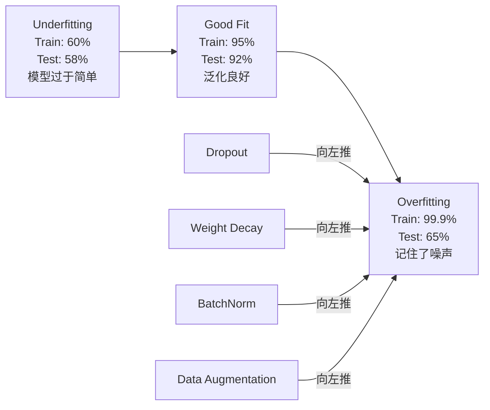
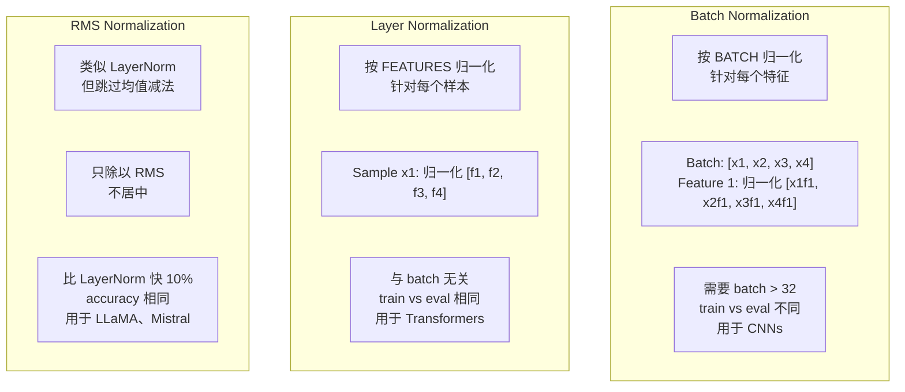
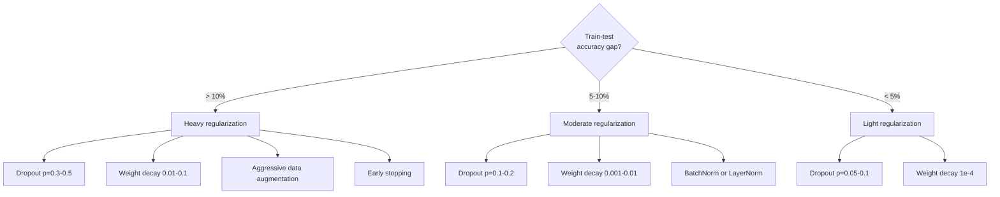

# Düzenlenme

> Modeliniz eğitim verilerinde %99'a ulaşır, ancak test verilerinde sadece %60'a ulaşır.

**Type:** Build
**Languages:** Python
**Prerequisites:** Lesson 03.06 (Optimizers)
**Time:** ~75 minutes

## Öğrenme hedefi
- 0'dan gerçekleşen ters ölçekleme, L2 ağırlık kaybı, parti normallendirme, katman normallendirme ve RMSNorm
- Rail-test doğruluk boşluğu ölçmek,并通过规范化 实验诊断过适
- 解释为什么LayerNorm, BatchNorm yerine LayerNorm kullanmak,以及为什么现代 LLM'ler RMSNorm'ı tercih ederler
- Aşırı derecede uygunluk derecesine göre, uygulanmış doğru düzenlenme 技术组合

## 问题
Zhang et al. (2017) bunu, herhangi bir veri kümesini hatırlayabilecek kadar çok bir parametre olan nöral ağ tarafından kanıtlanmıştır. Bu netler, her zaman etiketlerle birlikte olan ImageNet'in üzerinde yapılan eğitim standartları bunu kanıtlıyor.

Bu, aşırı uygunluk sorunu, ve model daha büyüktür, bu sorun daha ciddiyor. GPT-3 175 milyar parametreye sahiptir. Eğitim kümesi yaklaşık 500 milyar Token'e sahiptir. Bu kadar çok parametre var, yeterli kapasiteye sahip bir model vardır. Eğitim verilerindeki büyük miktarda bölümleri bir kenara anlayabilir.

Ćoşlama performans ve test performans arasındaki fark aşırı uygunluk boşluğu olacaktır。 Bu dersdeki her teknik farklı açılardan bu boşluğu ele alıyor。Droput ızdıracak ağı herhangi bir tek sinirden bağımlı olmamaya zorluyor。 Ağırlık kaybı  herhangi bir tek ağırlığın fazla büyük olmalarını önlemekॆॆॆॆॆॆॆॆॆॆॆॆॆॆॆॆॆॆॆॆॆॆॆॆॆॆॆॆॆॆॆॆॆॆॆॆॆॆॆॆॆॆॆॆॆॆॆॆॆॆॆॆॆॆॆॆॆॆॆॆॆॆॆॆॆॆॆॆॆॆॆॆॆॆॆॆॆॆॆॆॆॆॆॆॆॆॆॆॆॆॆॆॆॆॆॆॆॆॆॆॆॆॆॆॆॆॆॆॆॆॆॆॆॆॆॆॆॆॆॆॆॆॆॆॆॆॆॆॆॆॆॆॆॆॆॆॆॆॆॆॆॆॆॆॆॆॆॆॆॆॆॆॆॆॆॆॆॆॆॆॆॆॆॆॆॆॆॆॆॆॆॆॆॆॆॆॆॆॆॆॆॆॆॆॆॆॆॆॆॆॆॆॆॆॆॆॆॆॆॆॆॆॆॆॆॆॆॆॆॆॆॆॆॆॆॆॆॆॆॆॆॆॆॆॆॆॆॆॆॆॆॆॆॆॆॆॆॆॆॆॆॆॆॆॆॆॆॆॆॆॆॆॆॆॆॆॆॆॆॆॆॆॆॆॆॆॆॆॆॆॆॆॆॆॆॆॆॆॆॆॆॆॆॆॆॆॆॆॆॆॆॆॆॆॆॆॆॆॆॆॆॆॆॆॆॆॆॆॆॆॆॆॆॆॆॆॆॆॆॆॆॆॆॆॆॆॆॆॆॆॆॆॆॆॆॆॆॆॆॆॆॆॆॆॆॆॆॆॆॆॆॆॆॆॆॆॆॆॆॆॆॆॆॆॆॆॆॆॆॆॆॆॆॆॆॆॆॆॆॆॆॆॆॆॆॆॆॆॆॆॆॆॆॆॆॆॆॆॆॆॆॆॆॆॆॆॆॆॆॆॆॆॆॆॆॆॆॆॆॆॆॆॆॆॆॆॆॆॆॆॆॆॆॆ

## 概念
### Aşırı Ekleyici Spektrum

Her model, yetersizliğinden çok basit, ele geçiremezliğe kadar aşırı uygunluğa kadar çok karmaşık, gürültü ele geçirmeye kadar) bir konumdadır.



### İptal

En basit düzenleme  tekniği, en iyi açıklama vardır.

```
output = activation(z) * mask    where mask[i] ~ Bernoulli(1 - p)
```

P = 0.5'de, her ileri geçiş, yarım nöronun sıfırına bırakılmasını sağlar. Ağ, hangi nöronların kullanılabileceğini tahmin edemediği için reduktif ifade öğrenmelidir. Bu, uyum sağlanmasını engeller.

Birlikte açıklayın: bir n n n n n n n n n n n n n n n n n n n n n n n n n n n n n n n n n n n n n n n n n n n n n n n n n n n n n n n n n n n n n n n n n n n n n n n n n n n n n n n n n n n n n n n n n n n n n n n n n n n n n n n n n n n n n n n n n n n n n n n n n n n n n n n n n n n n n n n n n n n n n n n n n n n n n n n n n n n n n n n n n n n n n n n n n n n n n n n n n n n n n n n n n n n n n n n n n n n n n n n n n n n n n n n n n n n n n n n n n n n n n n n n n n n n n n n n n n n n n n n n n n n n n n n n n n n n n n n n n n n n n n n n n n n n n n n n n n n n n n n n n n n n n n n n n n n n n n n n n n n n n n n n n n n n n n n n n n n n n n n n n n n n n n n n n n n n n n n n n n n n n n n n n n n n n n n n n n n n n n n n n n n n n n n n n n n n n n n n n n n n n n n n n n n n n n n n n n n n n n n n n n n n n n n n n n n n n n n n n n n n n n n n n n n n n n n n n n n n n n n n n n n n n n n n n n n n n n n n n n n n n n n n n n n n n n n n n n n n n n n n n n n n n n n n n n n n n n n n n n n n n n n n

实践中,缩放会在训练期间应用,而不是测试期间应用(inverse dropout):

```
During training:  output = activation(z) * mask / (1 - p)
During testing:   output = activation(z)   (no change needed)
```

Bu daha temiz, çünkü test kodları tamamen bırakmak zorunda değil.

默认比例:Transformer 使用 p = 0.1,MLPs 使用 p = 0.5,CNNs 使用 p = 0.2-0.3──更高的 dropout = 更强的规范化 = 更高的不适应风险──

### Ağırlık Kaybedilmesi (L2 Düzenlenmesi)

Ülkeyi yeniden oluşturmak için:

```
total_loss = task_loss + (lambda / 2) * sum(w_i^2)
```

Düzenlenme 项 ̆s Gradient is lambda * w。 bu, her adımda, her ağırlık, büyüklüğü oranında genişliği ile sıfır kısaltmaya göre gerçekleşir. Büyük ağırlık daha güçlü bir ceza alıyor。 model tek bir ağırlık yönetiminin olmadığı bir çözümle yönlendirilir。

Bu neden genelleşmeye yardımcı olur: aşırı fitness model genellikle daha büyük bir ağırlık taşır, antrenman verilerindeki gürültüyi arttırır.

lambda hiperparametre 控制强度── tipik değer:

- Transformer 上的 AdamW 0.01 kullan
- CNN'lerin üstündeki SGD 1e-4 kullan
- 严重 overfit 的模型使用 0.1

6. ders olarak tartışılır: ağırlık kaybı 和 L2 düzenlenmesi, SGD 中等价,但在亚当 中不等价──使用亚当 训练时,始终使用亚当W(脱重减) 。

### Satır Normalleşimi

Her katmanın çıkışı aşağı katmana aktarılmadan önce, önce mini-batch ölümlerinde birleştirilmelidir.

某一层的一批激活:

```
mu = (1/B) * sum(x_i)           (batch mean)
sigma^2 = (1/B) * sum((x_i - mu)^2)   (batch variance)
x_hat = (x_i - mu) / sqrt(sigma^2 + eps)   (normalize)
y = gamma * x_hat + beta        (scale and shift)
```

Gamma ve beta, öğrenilebilir parametrelerdir, böylece en iyi koşullarda ağ bu normallaşmayı geri alabilir.

**Training vs inference split:**訓練期間,mu 和 sigma 来自当前ミニ-batch──推理期間,你使用訓練期間累计的运行平均(momentum = 0.1'in eksponensial hareketli ortalaması,也就是90% 旧值 + 10% 新值) ・・・

BatchNorm neden geçerli olduğu tartışmaya devam ediyor. Asıl makale bunun "daha iç değişkenlik değişimi"ni azaltdığını iddia ediyor.

BatchNorm has one fundamental limit: it depends on batch statistics. Batch size = 1, mean value = 1, mean value = 2, mean difference = 1, mean value = 1, mean value = 3, mean difference = 1, mean value = 1, mean value = 3, mean value = 3, mean value = 3, mean value = 3, mean value = 3, mean value = 3, mean value = 3, mean value = 3, mean value = 3, mean value = 3, mean value = 3, mean value = 3, mean value = 3, mean value = 3, mean value = 3, mean value = 3, mean value = 3, mean value = 3, mean value = 3, mean value = 3, mean value = 3, mean value = 3, mean value = 3, mean value = 3, mean value = 3, mean value = 3, mean value = 3, mean value = 3, mean value = 3, mean value = 3, mean value = 3, mean value = 3, mean value = 3, mean value = 3, mean value = 3, mean value = 3, mean value = 3, mean value = 3, mean value = 3, mean value = 3, mean value = 3, mean value = 3, mean value = 3, mean value = 3, mean value = 3, mean value = 3, mean value = 3, mean value = 3, mean value = 3, mean value = 3, mean value = 3, mean value = 3, mean value = 3, mean value = 3, mean value = 3, mean value = 3, mean value = 3, mean value = 3, mean value = 3, mean value = 3, mean value = 3, mean value = 3, mean value = 3, mean value = 3, mean value = 3, mean value = 3, mean value = 3, mean value = 3, mean = 3, mean = 3, mean = 3, mean = 3, mean = 3, mean = 3, mean = 5 = 3, mean = 3, mean = 5 = 3, mean = 3, mean = 3, mean = 3, mean = 3, mean = 3, mean = 3, mean = 3, mean = 5 = 3, mean = 3, mean = 3, mean = 3, mean = = 3, mean = 3, mean = = = = = 3, mean = = = = = = = = = = = = = = = = = = = = = = = = = = = = = = = = = = = = = = = = = = = = = = = = = = = = = = = = = = = = = = = = = = = = = = = = = = = = = = = = = = = = = = = = = = = = = = = = = = = = = = = = = = =

### Katman Normalleşimi

√ √ √ √ √ √ √ √ √ √ √ √ √ √ √ √ √ √ √ √ √ √ √ √ √ √ √ √ √ √ √ √ √ √ √ √ √ √ √ √ √ √ √ √ √ √ √ √ √ √ √ √ √ √ √ √ √ √ √ √ √ √ √ √ √ √ √ √ √ √ √ √ √ √ √ √ √ √ √ √ √ √ √ √ √ √ √ √ √ √ √ √ √ √ √ √ √ √ √ √ √ √ √ √ √ √ √ √ √ √ √ √ √ √ √ √ √ √ √ √ √ √ √ √ √ √ √ √ √ √ √ √ √ √ √ √ √ √ √ √ √ √ √ √ √ √ √ √ √ √ √ √ √ √ √ √ √ √ √ √ √ √ √ √ √ √ √ √ √ √ √ √ √ √ √ √ √ √ √ √ √ √ √ √ √ √ √ √ √ √ √ √ √ √ √ √ √ √ √ √ √ √ √ √ √ √ √ √ √ √ √ √ √ √ √ √ √ √ √ √ √ √ √ √ √ √ √ √ √ √ √ √ √ √ √ √ √ √ √ √ √ √ √ √ √ √ √ √ √ √ √ √ √ √ √

```
mu = (1/D) * sum(x_j)           (feature mean)
sigma^2 = (1/D) * sum((x_j - mu)^2)   (feature variance)
x_hat = (x_j - mu) / sqrt(sigma^2 + eps)
y = gamma * x_hat + beta
```

D ise özellik boyutu, her örnek bağımsız olarak birleştirilmeye bağlı değildir. Bu yüzden Transformer LayerNorm'i kullanır ve BatchNorm'i kullanmaz.

Transformer'ın Orta LayerNorm 会 Apply in Each Self-Attention Block 和 Each Feed-Forward Block 之后 (Post-LN), or apply in them before (Post-LN), pre-LN, training time more stable) 。

### RMSNorm

                                                                                                                                                                                                                                                              

```
rms = sqrt((1/D) * sum(x_j^2))
y = gamma * x / rms
```

Bu nedenle, bu değerlerin bir kısmı olarak, bir diğer kısmı olarak, bir diğer kısmı olarak, bir diğer kısmı olarak, bir diğer kısmı olarak, bir diğer kısmı olarak, bir diğer kısmı olarak, bir diğer kısmı olarak, bir diğer kısmı olarak, bir diğer kısmı olarak, bir diğer kısmı olarak, bir diğer kısmı olarak, bir diğer kısmı olarak, bir diğer kısmı olarak, bir diğer kısmı olarak, bir diğer kısmı olarak, bir diğer kısmı olarak, bir diğer bir kısmı olarak, bir diğer bir kısmı olarak, bir diğer bir kısmı olarak, bir diğer bir kısmı olarak, bir diğer bir kısmı olarak, bir diğer bir kısmı olarak, bir diğer bir kısmı olarak, bir diğer bir diğerinden daha olarak, bir diğer bir diğerinden daha daha fazla değerlendirilmiştir.

LLaMA、LLaMA 2、LLaMA 3、Mistral ve çoğu modern LLM'de LayerNorm değil RMSNorm kullanılır.

### Normalleşme karşılaştırması



### 作为规范化的数据增强

Bu model değiştirilmedi, veri değiştirildi. Etiketleri saklamak için aynı zamanda değişim yapıldı.

- Resimler: rastgele biçim, dönüş, dönüm, renk gerginliği, kesim
- Metin: eşya sözcükleri değiştirme, geri çevirme, rastgele silme
- Ses: zaman uzantısı, yüksek ses değişimi, gürültü eklenmesi

効果 ve düzenlenme benzer: Bu, eğitim kümesinin etkin boyutunu arttırır, modelin belirli bir örneği hatırlamasını zorlaştırır.

### Erken Durma

En basit düzenleyici: Valide kaybı sırasında                                                                                                                                                                                                                                                                                                                                                                                                                                                                                                                   

### Ne Zaman Kullanmalı




```figure
l2-regularization
```

## Yapın onu.
### 步骤 1: Dropup (Eval ve Tren Modu)

```python
import random
import math


class Dropout:
    def __init__(self, p=0.5):
        self.p = p
        self.training = True
        self.mask = None

    def forward(self, x):
        if not self.training:
            return list(x)
        self.mask = []
        output = []
        for val in x:
            if random.random() < self.p:
                self.mask.append(0)
                output.append(0.0)
            else:
                self.mask.append(1)
                output.append(val / (1 - self.p))
        return output

    def backward(self, grad_output):
        grads = []
        for g, m in zip(grad_output, self.mask):
            if m == 0:
                grads.append(0.0)
            else:
                grads.append(g / (1 - self.p))
        return grads
```

### 步骤 2: L2 Ağırlık Kayıp

```python
def l2_regularization(weights, lambda_reg):
    penalty = 0.0
    for w in weights:
        penalty += w * w
    return lambda_reg * 0.5 * penalty

def l2_gradient(weights, lambda_reg):
    return [lambda_reg * w for w in weights]
```

### 步骤 3: Satır Normalleşimi

```python
class BatchNorm:
    def __init__(self, num_features, momentum=0.1, eps=1e-5):
        self.gamma = [1.0] * num_features
        self.beta = [0.0] * num_features
        self.eps = eps
        self.momentum = momentum
        self.running_mean = [0.0] * num_features
        self.running_var = [1.0] * num_features
        self.training = True
        self.num_features = num_features

    def forward(self, batch):
        batch_size = len(batch)
        if self.training:
            mean = [0.0] * self.num_features
            for sample in batch:
                for j in range(self.num_features):
                    mean[j] += sample[j]
            mean = [m / batch_size for m in mean]

            var = [0.0] * self.num_features
            for sample in batch:
                for j in range(self.num_features):
                    var[j] += (sample[j] - mean[j]) ** 2
            var = [v / batch_size for v in var]

            for j in range(self.num_features):
                self.running_mean[j] = (1 - self.momentum) * self.running_mean[j] + self.momentum * mean[j]
                self.running_var[j] = (1 - self.momentum) * self.running_var[j] + self.momentum * var[j]
        else:
            mean = list(self.running_mean)
            var = list(self.running_var)

        self.x_hat = []
        output = []
        for sample in batch:
            normalized = []
            out_sample = []
            for j in range(self.num_features):
                x_h = (sample[j] - mean[j]) / math.sqrt(var[j] + self.eps)
                normalized.append(x_h)
                out_sample.append(self.gamma[j] * x_h + self.beta[j])
            self.x_hat.append(normalized)
            output.append(out_sample)
        return output
```

### 步骤 4: Katman Normalleşimi

```python
class LayerNorm:
    def __init__(self, num_features, eps=1e-5):
        self.gamma = [1.0] * num_features
        self.beta = [0.0] * num_features
        self.eps = eps
        self.num_features = num_features

    def forward(self, x):
        mean = sum(x) / len(x)
        var = sum((xi - mean) ** 2 for xi in x) / len(x)

        self.x_hat = []
        output = []
        for j in range(self.num_features):
            x_h = (x[j] - mean) / math.sqrt(var + self.eps)
            self.x_hat.append(x_h)
            output.append(self.gamma[j] * x_h + self.beta[j])
        return output
```

### 5 adım: RMSNorm

```python
class RMSNorm:
    def __init__(self, num_features, eps=1e-6):
        self.gamma = [1.0] * num_features
        self.eps = eps
        self.num_features = num_features

    def forward(self, x):
        rms = math.sqrt(sum(xi * xi for xi in x) / len(x) + self.eps)
        output = []
        for j in range(self.num_features):
            output.append(self.gamma[j] * x[j] / rms)
        return output
```

### 步骤 6: Düzenlenme ile ve olmadan eğitim

```python
def sigmoid(x):
    x = max(-500, min(500, x))
    return 1.0 / (1.0 + math.exp(-x))


def make_circle_data(n=200, seed=42):
    random.seed(seed)
    data = []
    for _ in range(n):
        x = random.uniform(-2, 2)
        y = random.uniform(-2, 2)
        label = 1.0 if x * x + y * y < 1.5 else 0.0
        data.append(([x, y], label))
    return data


class RegularizedNetwork:
    def __init__(self, hidden_size=16, lr=0.05, dropout_p=0.0, weight_decay=0.0):
        random.seed(0)
        self.hidden_size = hidden_size
        self.lr = lr
        self.dropout_p = dropout_p
        self.weight_decay = weight_decay
        self.dropout = Dropout(p=dropout_p) if dropout_p > 0 else None

        self.w1 = [[random.gauss(0, 0.5) for _ in range(2)] for _ in range(hidden_size)]
        self.b1 = [0.0] * hidden_size
        self.w2 = [random.gauss(0, 0.5) for _ in range(hidden_size)]
        self.b2 = 0.0

    def forward(self, x, training=True):
        self.x = x
        self.z1 = []
        self.h = []
        for i in range(self.hidden_size):
            z = self.w1[i][0] * x[0] + self.w1[i][1] * x[1] + self.b1[i]
            self.z1.append(z)
            self.h.append(max(0.0, z))

        if self.dropout and training:
            self.dropout.training = True
            self.h = self.dropout.forward(self.h)
        elif self.dropout:
            self.dropout.training = False
            self.h = self.dropout.forward(self.h)

        self.z2 = sum(self.w2[i] * self.h[i] for i in range(self.hidden_size)) + self.b2
        self.out = sigmoid(self.z2)
        return self.out

    def backward(self, target):
        eps = 1e-15
        p = max(eps, min(1 - eps, self.out))
        d_loss = -(target / p) + (1 - target) / (1 - p)
        d_sigmoid = self.out * (1 - self.out)
        d_out = d_loss * d_sigmoid

        for i in range(self.hidden_size):
            d_relu = 1.0 if self.z1[i] > 0 else 0.0
            d_h = d_out * self.w2[i] * d_relu
            self.w2[i] -= self.lr * (d_out * self.h[i] + self.weight_decay * self.w2[i])
            for j in range(2):
                self.w1[i][j] -= self.lr * (d_h * self.x[j] + self.weight_decay * self.w1[i][j])
            self.b1[i] -= self.lr * d_h
        self.b2 -= self.lr * d_out

    def evaluate(self, data):
        correct = 0
        total_loss = 0.0
        for x, y in data:
            pred = self.forward(x, training=False)
            eps = 1e-15
            p = max(eps, min(1 - eps, pred))
            total_loss += -(y * math.log(p) + (1 - y) * math.log(1 - p))
            if (pred >= 0.5) == (y >= 0.5):
                correct += 1
        return total_loss / len(data), correct / len(data) * 100

    def train_model(self, train_data, test_data, epochs=300):
        history = []
        for epoch in range(epochs):
            total_loss = 0.0
            correct = 0
            for x, y in train_data:
                pred = self.forward(x, training=True)
                self.backward(y)
                eps = 1e-15
                p = max(eps, min(1 - eps, pred))
                total_loss += -(y * math.log(p) + (1 - y) * math.log(1 - p))
                if (pred >= 0.5) == (y >= 0.5):
                    correct += 1
            train_loss = total_loss / len(train_data)
            train_acc = correct / len(train_data) * 100
            test_loss, test_acc = self.evaluate(test_data)
            history.append((train_loss, train_acc, test_loss, test_acc))
            if epoch % 75 == 0 or epoch == epochs - 1:
                gap = train_acc - test_acc
                print(f"    Epoch {epoch:3d}: train_acc={train_acc:.1f}%, test_acc={test_acc:.1f}%, gap={gap:.1f}%")
        return history
```

## Kullan
PyTorch, tüm normallaşmayı ve düzenlendirmeyi modüler olarak sunar:

```python
import torch
import torch.nn as nn

model = nn.Sequential(
    nn.Linear(784, 256),
    nn.BatchNorm1d(256),
    nn.ReLU(),
    nn.Dropout(0.3),
    nn.Linear(256, 128),
    nn.BatchNorm1d(128),
    nn.ReLU(),
    nn.Dropout(0.3),
    nn.Linear(128, 10),
)

model.train()
out_train = model(torch.randn(32, 784))

model.eval()
out_test = model(torch.randn(1, 784))
```

`model.train()`- Ne ?`model.eval()`切换非常关键──它会打开/关闭 dropout,并告诉BatchNorm 使用批量統計 还是运行统计──推理前忘记调用 `model.eval()`Deep Learning'de en yaygın hatalardan biri. Test doğruluğu her zaman değişir. Çünkü düşüş hala aktif bir durumdadır. BatchNorm ise mini-batch istatistiklerini kullanıyor.

Transformer için farklı modular:

```python
class TransformerBlock(nn.Module):
    def __init__(self, d_model=512, nhead=8, dropout=0.1):
        super().__init__()
        self.attention = nn.MultiheadAttention(d_model, nhead, dropout=dropout)
        self.norm1 = nn.LayerNorm(d_model)
        self.ff = nn.Sequential(
            nn.Linear(d_model, d_model * 4),
            nn.GELU(),
            nn.Linear(d_model * 4, d_model),
            nn.Dropout(dropout),
        )
        self.norm2 = nn.LayerNorm(d_model)
        self.dropout = nn.Dropout(dropout)

    def forward(self, x):
        attended, _ = self.attention(x, x, x)
        x = self.norm1(x + self.dropout(attended))
        x = self.norm2(x + self.ff(x))
        return x
```

LayerNorm, BatchNorm değil. Depout p=0.1, p=0.5 değil.

## - Söyle.
Bu ders:
- `outputs/prompt-regularization-advisor.md`-- Bir hızlı, aşırı uygun teşhis ve doğru düzenleme stratejisi önermek için

## 练习
1. 2D veriler için uzaylı düşüş: tek bir sinirden vazgeçmeyin, tüm özellik kanallarını bırakın.

2. Nedir bu ders? Nedir bu ders? Nedir bu ders? Nedir bu ders? Nedir bu ders? Nedir bu ders? Nedir bu ders? Nedir bu ders? Nedir bu ders? Nedir bu ders? Nedir bu ders? Nedir bu ders? Nedir bu ders? Nedir bu ders? Nedir bu ders? Nedir bu ders? Nedir bu ders? Nedir bu ders? Nedir bu ders? Nedir bu ders? Nedir bu ders? Nedir bu ders? Nedir bu ders? Nedir bu ders? Nedir bu ders? Nedir bu ders? Nedir bu ders? Nedir bu ders? Nedir bu ders? Nedir bu ders? Nedir bu ders? Nedir bu ders? Nedir bu ders? Nedir bu ders? Nedir bu ders? Nedir bu ders? Nedir bu ders? Nedir bu ders? Nedir bu ders? Nedir bu ders? Nedir bu ders? Nedir bu ders? Nedir bu ders? Nedir bu bölüm? Nedir bu bölüm? Nedir bu bölüm?

3. Çember- veri kümesi ağınızda, gizli katman ve etkinleştirme  arasında bir BatchNorm katmanı ekleyin. Öğrenme oranlarında 0.01、0.05 和 0.1 aşağı, BatchNorm kullanımı ve kullanımı arasında ayrılığa düşmek.

4. 实现早期停止: her dönem 随随随测损失,保存最佳权重,如果测损 连续 20 个时代 没有改善则停止――运行规律化网络 1000 个时代――报告哪个时代 拥有最佳测试精度以及你节省了多少时代的计算――

5. Bir 4 katlı ağda ((( sadece 2 katlı) LayerNorm ve RMSNorm ile karşılaştırmak için aynı ağırlığı ile başlangıç ikili kullanmak için.

## 关键术语
| Term | What people say | What it actually means |
|------|----------------|----------------------|
| Overfitting | "模型记住了数据" | 当模型的训练表现显著高于测试表现时，表示它学到了噪声而不是信号 |
| Regularization | "防止 overfitting" | 任何约束模型复杂度以改善泛化的技术：dropout、weight decay、normalization、augmentation |
| Dropout | "随机删除神经元" | 训练期间以概率 p 将随机神经元置零，迫使模型学习冗余表示；等价于训练一个 ensemble |
| Weight decay | "L2 penalty" | 每一步通过减去 lambda * w 将所有权重向零收缩；通过权重大小惩罚复杂度 |
| Batch normalization | "按 batch 归一化" | 训练期间使用 batch statistics、推理期间使用 running averages，在 batch 维度上对层输出进行归一化 |
| Layer normalization | "按样本归一化" | 在每个样本内部跨特征归一化；与 batch 无关，用于 batch size 可变的 Transformer |
| RMSNorm | "没有均值的 LayerNorm" | Root mean square normalization；从 LayerNorm 中去掉均值减法，以相同 accuracy 获得 10% 加速 |
| Early stopping | "在 overfit 前停止" | 当 validation loss 不再改善时停止训练；最简单的 regularizer，通常与其他方法一起使用 |
| Data augmentation | "用更少数据生成更多数据" | 变换训练输入（flip、crop、noise）以增加有效数据集大小，并迫使模型学习不变性 |
| Generalization gap | "Train-test split" | 训练表现与测试表现之间的差异；regularization 的目标是最小化这个 gap |

## 延伸阅读
- Srivastava et al., "Dropout: Neural Networks'in Aşırı Uygunluktan Korunmasının Basit Bir Yolu" (2014) -- 原始 dropup 论文,包含 ensemble 解释和大量实验
- Ioffe & Szegedy, "Batch Normalisation: Accelerating Deep Network Training by Reducing Internal Covariate Shift" (2015) -- BatchNorm  and its training流程, is quoted most deep learning 论文 文
- Zhang & Sennrich, "Root Mean Square Layer Normalization" (2019) --                                                                                                                                                                                                                                                                                                                                                                                                                                                                                                          
- Zhang et al., "Deep Learning Requires Re-Thinking Generalization" (2017) -- 里程碑论文, gösterir Nöral Ağı Can Remember As As As As An Tags, geleneksel genelleşme görüşünü meydan okudu
