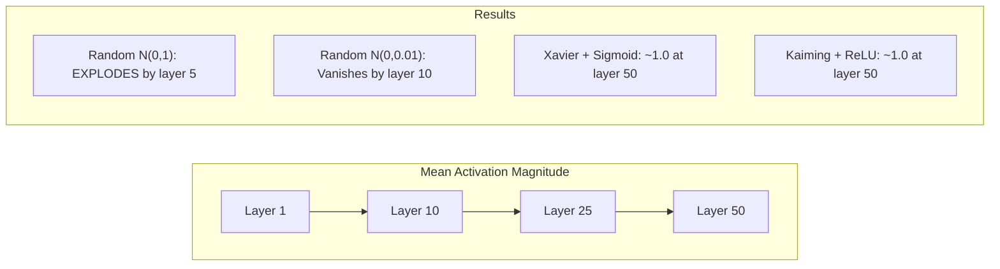
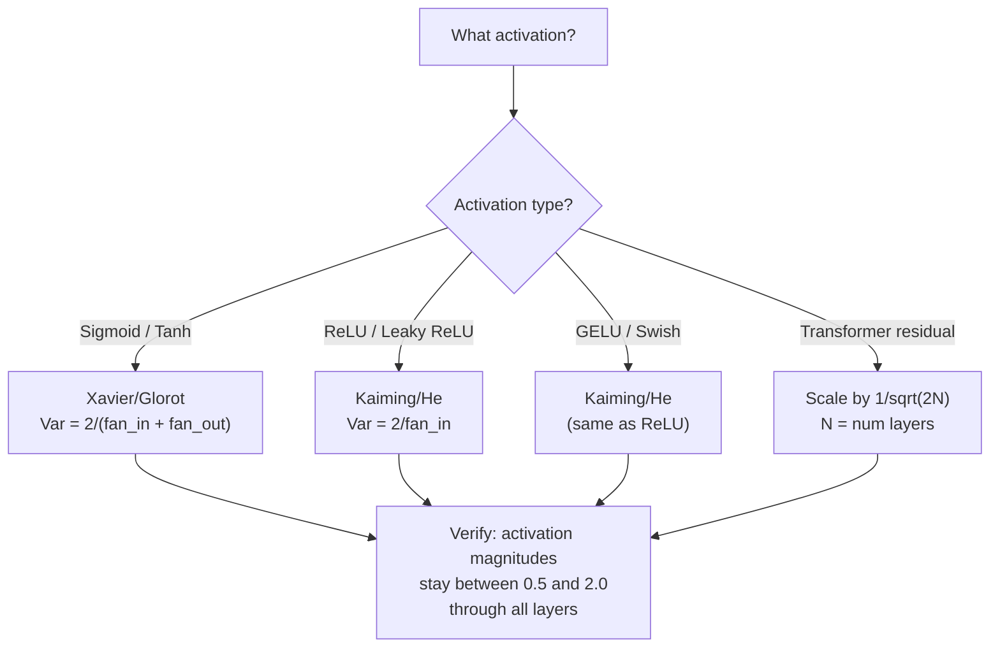

# Ağırlık Başlatma ve Eğitim Stabtabilit

> İlk başlama hatası, eğitim aslında başlamıyor. İlk başlama, 50 kat aynı şekilde 3 kat gibi düz bir eğitim yapabiliyor.

**Type:** Build
**Languages:** Python
**Prerequisites:** Lesson 03.04 (Activation Functions), Lesson 03.07 (Regularization)
**Time:** ~90 minutes

## Öğrenme hedefi
- 实现零、随机、Xavier/Glorot 和 Kaiming/He initialization 策略,并测量它们对50层中激活幅度的影响
- 推导为什么 Xavier init 使用 Var(w) = 2/(fan_in + fan_out), Kaiming ise Var(w) = 2/fan_in
- 演示零初始化的对称性 问题,并解释为什么仅靠随机规模还不够
- 将正确的初始化 策略匹配到激活函数:sigmoid/tanh 使用 Xavier,ReLU/GELU 使用 Kaiming

## 问题
Tüm ağırlıkları sıfır olarak başlatmak. Her nöron aynı işlevi hesaplıyor, aynı dereceliyi alır ve aynı şekilde yeniliyor. 10.000 dönemden sonra, 512 nöron gizli katman hâlâ aynı nöronun 512 nöronunu oluşturur.

Onları çok büyük bir şekilde başlatın. Tüm ağlardaki etkinlikler patlar. 10 katmanına kadar, sayı 1e15'e ulaşır. 20 katmanına kadar, sonsuzlukta taşırlar.

Standart normal dağılımdan standart normal dağılımdan standart normal dağılımdan standart dağılımdan standart dağılımdan standart dağılımdan standart dağılımdan standart dağılımdan standart dağılımdan standart dağılımdan standart dağılımdan standart dağılımdan standart dağılımdan standart dağılımdan standart dağılımdan standart dağılımdan standart dağılımdan standart dağılımdan standart dağılımdan standart dağılımdan standart dağılımdan standart dağılımdan standart dağılımdan standart dağılımdan standart dağılımdan standart dağılımdan standart dağılımdan standart dağılımdan standart dağılımdan standart dağılımdan bağımsız olarak, standart dağılımdan bağımsız olarak, standart dağılımdan bağımsız olarak, standart dağılımdan bağımsız olarak, standart dağılımdan bağımsız olarak, standart dağılımdan bağımsız olarak, standart dağılımdan bağımsız olarak, standart dağılımdan bağımsız olarak, standart dağılımdan bağımsız olarak, standart dağılımdan bağımsız olarak, standart dağılımdan bağımsız olarak, standart dağılımdan bağımsız olarak, standart olarak, standart olarak, standart olarak, standart olarak, standart olarak, standart olarak, standart olarak, standart olarak, standart olarak, standart olarak, standart olarak, standart olarak, standart olarak, standart olarak, standart olarak, standart olarak, standart olarak, standart olarak, standart olarak, standart olarak, standart olarak, standart olarak, standart olarak, standart olarak, standart olarak, standart olarak, standart olarak, standart olarak, standart olarak, standart olarak, standart olarak, standart olarak, standart olarak, standart olarak, standart olarak, standart olarak, standart olarak, standart olarak, standart olarak, standart olarak, standart olarak, ve standart olarak, standart olarak, değer olarak, değer olarak, değer olarak, değerlendirme olarak, değer olarak, değerlendirme olarak, değer olarak, değerlendirme olarak, değerlendirme olarak, değerlendirme olarak, değerlendirme olarak, değerlendirme olarak, değer olarak, değerlendirme olarak, değerlendirme olarak, değer.

Ağırlık başlangıcı, derin öğrenme arasında en düşük değerlendirilmiş bir karardır. Arsitektur, yazıları vardır. Optimizerler, blog yazıları vardır.

## 概念
### Simetri Sorunu

Bir katman içindeki her nöronun aynı yapısı vardır: ağırlıklarla ıkıştırılır, önyargı artırılır, uygulama etkinleştirilmektedir. Eğer tüm ağırlıklar aynı değerden başlarsa, her nöron aynı çıkış hesaplanır.

Ağda yüzlerce parametre var, ama hepsi aynı anda hareket eder. Buna simetri denir, rastgele başlangıç ise şiddetli bir yöntemdir. Her nöron ağırlık alanındaki farklı konumlardan başlar, bu nedenle her nöron farklı özellikler öğrenir.

Ama rastlantı yetmez. *Sakalınca* ağın eğitim yapıp yapamayacağını belirler.

### Çevrelerle Yayılan Çevreler

考虑一个具有风扇_in 个输入的单层:

```
z = w1*x1 + w2*x2 + ... + w_n*x_n
```

Eğer her ağırlık wi varansı var var ((w) dağılımından gelirse ve her giriş xi varansı var ((x), output varansı var (():

```
Var(z) = fan_in * Var(w) * Var(x)
```

Eğer Var(w) = 1 ve fan_in = 512, ise çıkış varyansi 512 倍── input varyansi ∞ ∞ ∞ ∞ ∞ ∞ ∞ ∞ ∞ ∞ ∞ ∞ ∞ ∞ ∞ ∞ ∞ ∞ ∞ ∞ ∞ ∞ ∞ ∞ ∞ ∞ ∞ ∞ ∞ ∞ ∞ ∞ ∞ ∞ ∞ ∞ ∞ ∞ ∞ ∞ ∞ ∞ ∞ ∞ ∞ ∞ ∞ ∞ ∞ ∞ ∞ ∞ ∞ ∞ ∞ ∞ ∞ ∞ ∞ ∞ ∞ ∞ ∞ ∞ ∞ ∞ ∞ ∞ ∞ ∞ ∞ ∞ ∞ ∞ ∞ ∞ ∞ ∞ ∞ ∞ ∞ ∞ ∞ ∞ ∞ ∞ ∞ ∞ ∞ ∞ ∞ ∞ ∞ ∞ ∞ ∞ ∞ ∞ ∞ ∞ ∞ ∞ ∞ ∞ ∞ ∞ ∞ ∞ ∞ ∞ ∞ ∞ ∞ ∞ ∞ ∞ ∞ ∞ ∞ ∞ ∞ ∞ ∞ ∞ ∞ ∞ ∞ ∞ ∞ ∞ ∞ ∞ ∞ ∞ ∞ ∞ ∞ ∞ ∞ ∞ ∞ ∞ ∞ ∞ ∞ ∞ ∞ ∞ ∞ ∞ ∞ ∞ ∞ ∞ ∞ ∞ ∞ ∞ ∞ ∞ ∞ ∞ ∞ ∞ ∞ ∞ ∞ ∞ ∞ ∞ ∞ ∞ ∞ ∞ ∞ ∞ ∞ ∞ ∞ ∞ ∞ ∞ ∞ ∞ ∞ ∞ ∞ ∞ ∞ ∞ ∞ ∞ ∞ ∞ ∞ ∞ ∞ ∞ ∞ ∞ ∞ ∞ ∞ ∞ ∞ ∞ ∞ ∞ ∞ ∞ ∞ ∞ ∞ ∞ ∞ ∞ ∞ ∞ ∞ ∞ ∞ ∞ ∞ ∞ ∞ ∞ ∞ ∞ ∞ ∞ ∞ ∞ ∞ ∞ ∞ ∞ ∞ ∞ ∞ ∞ 

Eğer Var(w) = 0.001,则 çıkış değişimi Her kat 0.001 * 512 = 0.512 缩小──经过 10 层:0.512^10 = 0.00013──你的信号 已消失──

目標:选择 Var(w), makes Var(z) = Var(x) ・・・Signal büyüklüğü 在各层之间保持恒定──

### Xavier/Glorot Başlangıç

Glorot and Bengio (2010) 推导了适用于sigmoid 和 tanh aktivasyonlarının çözümü──为了在前和后的通过 中都保持变异恒定:

```
Var(w) = 2 / (fan_in + fan_out)
```

实践中, weights From aşağıdaki dağılım 中采样:

```
w ~ Uniform(-limit, limit)  where limit = sqrt(6 / (fan_in + fan_out))
```

Ya da:

```
w ~ Normal(0, sqrt(2 / (fan_in + fan_out)))
```

Bu nedenle etkili, çünkü sigmoid 和 tanh sıfırın yakınında linear olarak, doğru başlangıç sonrası aktivasyonlar bu bölgede bulunmaktadır.

### Kaiming/O Başlangıç

ReLU, tüm negatiflerin yarısını öldürür. Tüm negatiflerin sıfır haline gelmesi)

He et al. (2015) 调整了公式:

```
Var(w) = 2 / fan_in
```

Ağırlıklar aşağıdaki dağılımdan 中采样:

```
w ~ Normal(0, sqrt(2 / fan_in))
```

2 kullanılır ReLU yarısını etkinleştirir 置零 etkilenir 没有它,信号 每层会缩小约0.5倍──50层后:0.5^50 = 8.8e-16──Kaiming init 可以防止这种情况──

### Transformer Başlatma

GPT-2 başka bir modü başlattı. Geri kalan bağlantılar her alt katmanın çıkışını ve girişini artırır:

```
x = x + sublayer(x)
```

Her zaman artışlar varyansa artır. N'de kalan katmanlar için, varyansa N'de gerçekleşir.

Llama 3 ((405B parametreleri,126 katman) benzer bir yöntem kullanmıştır. Bu kısaltma yoksa, geri kalan akım 126 katman üzerinde olacaktır.

```mermaid
flowchart TD
    subgraph "Zero Init"
        Z1["Layer 1<br/>All weights = 0"] --> Z2["Layer 2<br/>All neurons identical"]
        Z2 --> Z3["Layer 3<br/>Still identical"]
        Z3 --> ZR["Result: 1 effective neuron<br/>regardless of width"]
    end

    subgraph "Xavier Init"
        X1["Layer 1<br/>Var = 2/(fan_in+fan_out)"] --> X2["Layer 2<br/>Signal stable"]
        X2 --> X3["Layer 50<br/>Signal stable"]
        X3 --> XR["Result: Trains with<br/>sigmoid/tanh"]
    end

    subgraph "Kaiming Init"
        K1["Layer 1<br/>Var = 2/fan_in"] --> K2["Layer 2<br/>Signal stable"]
        K2 --> K3["Layer 50<br/>Signal stable"]
        K3 --> KR["Result: Trains with<br/>ReLU/GELU"]
    end
```



### 50 katlık aktivasyon büyüklüğü geçiyor .



### Doğru Yöntemleri Seçmek




```figure
weight-init-variance
```

## Yapın onu.
### 步骤 1: Başlatma Strategiları

İlk olarak, ağırlık matrisinin dört yönü vardır. Her yönü bir liste listesiyle birlikte 2 boyutlu bir matris olarak kullanılır.

```python
import math
import random


def zero_init(fan_in, fan_out):
    return [[0.0 for _ in range(fan_in)] for _ in range(fan_out)]


def random_init(fan_in, fan_out, scale=1.0):
    return [[random.gauss(0, scale) for _ in range(fan_in)] for _ in range(fan_out)]


def xavier_init(fan_in, fan_out):
    std = math.sqrt(2.0 / (fan_in + fan_out))
    return [[random.gauss(0, std) for _ in range(fan_in)] for _ in range(fan_out)]


def kaiming_init(fan_in, fan_out):
    std = math.sqrt(2.0 / fan_in)
    return [[random.gauss(0, std) for _ in range(fan_in)] for _ in range(fan_out)]
```

### 步骤 2: Aktifleştirme fonksiyonları

Her bir başlangıç stratejisi ve beklenen etkinleştirme ile test yapabilmek için sigmoid  tanh  ReLU'ya ihtiyacımız var.

```python
def sigmoid(x):
    x = max(-500, min(500, x))
    return 1.0 / (1.0 + math.exp(-x))


def tanh_act(x):
    return math.tanh(x)


def relu(x):
    return max(0.0, x)
```

### 步骤 3: 50 katman geçiş için ileri

让随机数据 通过一个深层网络,并测量每层的平均激活大小──

```python
def forward_deep(init_fn, activation_fn, n_layers=50, width=64, n_samples=100):
    random.seed(42)
    layer_magnitudes = []

    inputs = [[random.gauss(0, 1) for _ in range(width)] for _ in range(n_samples)]

    for layer_idx in range(n_layers):
        weights = init_fn(width, width)
        biases = [0.0] * width

        new_inputs = []
        for sample in inputs:
            output = []
            for neuron_idx in range(width):
                z = sum(weights[neuron_idx][j] * sample[j] for j in range(width)) + biases[neuron_idx]
                output.append(activation_fn(z))
            new_inputs.append(output)
        inputs = new_inputs

        magnitudes = []
        for sample in inputs:
            magnitudes.append(sum(abs(v) for v in sample) / width)
        mean_mag = sum(magnitudes) / len(magnitudes)
        layer_magnitudes.append(mean_mag)

    return layer_magnitudes
```

### 4 adım: Deneyim

运行所有组合:zero init、random N(0,1)、random N(0,0.01)、Xavier ile sigmoid、Xavier ile tanh、Kaiming ile ReLU。打印关键层的大小──

```python
def run_experiment():
    configs = [
        ("Zero init + Sigmoid", lambda fi, fo: zero_init(fi, fo), sigmoid),
        ("Random N(0,1) + ReLU", lambda fi, fo: random_init(fi, fo, 1.0), relu),
        ("Random N(0,0.01) + ReLU", lambda fi, fo: random_init(fi, fo, 0.01), relu),
        ("Xavier + Sigmoid", xavier_init, sigmoid),
        ("Xavier + Tanh", xavier_init, tanh_act),
        ("Kaiming + ReLU", kaiming_init, relu),
    ]

    print(f"{'Strategy':<30} {'L1':>10} {'L5':>10} {'L10':>10} {'L25':>10} {'L50':>10}")
    print("-" * 80)

    for name, init_fn, act_fn in configs:
        mags = forward_deep(init_fn, act_fn)
        row = f"{name:<30}"
        for idx in [0, 4, 9, 24, 49]:
            val = mags[idx]
            if val > 1e6:
                row += f" {'EXPLODED':>10}"
            elif val < 1e-6:
                row += f" {'VANISHED':>10}"
            else:
                row += f" {val:>10.4f}"
        print(row)
```

### 步骤 5: Simetri gösterimi

Null init'in tamamıyla aynı nöron üretmesini gösterir.

```python
def symmetry_demo():
    random.seed(42)
    weights = zero_init(2, 4)
    biases = [0.0] * 4

    inputs = [0.5, -0.3]
    outputs = []
    for neuron_idx in range(4):
        z = sum(weights[neuron_idx][j] * inputs[j] for j in range(2)) + biases[neuron_idx]
        outputs.append(sigmoid(z))

    print("\nSymmetry Demo (4 neurons, zero init):")
    for i, out in enumerate(outputs):
        print(f"  Neuron {i}: output = {out:.6f}")
    all_same = all(abs(outputs[i] - outputs[0]) < 1e-10 for i in range(len(outputs)))
    print(f"  All identical: {all_same}")
    print(f"  Effective parameters: 1 (not {len(weights) * len(weights[0])})")
```

### 步骤 6: Katmanlık büyüklük rapor

印活性度 図形図図図図図図図図図図図図図図図図図図図図図図図図図図図図図図図図図図図図図図図図図図図図図図図

```python
def magnitude_report(name, magnitudes):
    print(f"\n{name}:")
    for i, mag in enumerate(magnitudes):
        if i % 5 == 0 or i == len(magnitudes) - 1:
            if mag > 1e6:
                bar = "X" * 50 + " EXPLODED"
            elif mag < 1e-6:
                bar = "." + " VANISHED"
            else:
                bar_len = min(50, max(1, int(mag * 10)))
                bar = "#" * bar_len
            print(f"  Layer {i+1:3d}: {bar} ({mag:.6f})")
```

## Kullan
PyTorch bunları bir içe gömülü işlev olarak sunacak:

```python
import torch
import torch.nn as nn

layer = nn.Linear(512, 256)

nn.init.xavier_uniform_(layer.weight)
nn.init.xavier_normal_(layer.weight)

nn.init.kaiming_uniform_(layer.weight, nonlinearity='relu')
nn.init.kaiming_normal_(layer.weight, nonlinearity='relu')

nn.init.zeros_(layer.bias)
```

- Ne ? - Ne ?`nn.Linear(512, 256)`时,PyTorch 默认使用Kaiming 统一初始化――这就是为什么大多数简单网络 只是工作--PyTorch 已经做了正确选择――但是当你构建自定义架构时,或者深入到超过20层时,你需要理解正在发生的情况,并且可能需要覆盖默认设置――

Transformatörler için, HuggingFace modelleri genellikle bunlar arasında olur.`_init_weights`方法中处理 initialization── GPT-2 realization will meet according 1/sqrt(N) 缩放 residual projections── Eğer sıfırdan bir transformatör inşa etmeye başlarsanız, kendinize ekleme gerekmektedir──

## - Söyle.
Bu ders:
- `outputs/prompt-init-strategy.md`-- bir teşhis ağırlığı başlangıç  sorun并推正确策略的提示

## 练习
1. 添加 LeCun initialization(Var = 1/fan_in,为 SELU activation 设计) ・运行50 katlı deney, LeCun init + tanh,并与Xavier + tanh对比──

2. 实现 GPT-2 geri kalan ölçekleme: 加入残留流 之前, 乘以1/sqrt(2*N) 』 分别在有规模和无规模的情况下运行 50 层,测量残留大小 增多多快──

3. 创建一个"init health check" 函数,接收网络的层维度和激活类型,然后推正确的初始化,并当前 init 会导致问题时给出警告──

4. Xavyer ve Kaiming, fan_in'e uygun bir şekilde uyumlu olarak kullanıyor, ama rastgele bir şekilde değil.

5. Ortogonal başlangıç yapmayı gerçekleştirmek, rastgele bir matris oluşturmak, SVD'sini hesaplamak, ortogonal matris U) ・ ile 50 katlı ReLU ağları arasında Kaiming  karşılaştırmak

## 关键术语
| Term | What people say | What it actually means |
|------|----------------|----------------------|
| Weight initialization | “随机设置 starting weights” | 选择 initial weight values 的策略，它决定一个 network 是否有可能训练 |
| Symmetry breaking | “让 neurons 变得不同” | 使用 random initialization 确保 neurons 学习不同 features，而不是计算完全相同的函数 |
| Fan-in | “一个 neuron 的 inputs 数量” | incoming connections 的数量，它决定 input variance 如何在 weighted sum 中累积 |
| Fan-out | “一个 neuron 的 outputs 数量” | outgoing connections 的数量，与在 Backpropagation 期间维持 Gradient variance 有关 |
| Xavier/Glorot init | “sigmoid initialization” | Var(w) = 2/(fan_in + fan_out)，旨在通过 sigmoid 和 tanh activations 保持 variance |
| Kaiming/He init | “ReLU initialization” | Var(w) = 2/fan_in，考虑了 ReLU 会将一半 activations 置零 |
| Variance propagation | “signals 如何在 layers 中增长或缩小” | 基于 weight scale，逐层分析 activation variance 如何变化的数学分析 |
| Residual scaling | “GPT-2 的 init trick” | 将 residual connection weights 按 1/sqrt(2N) 缩放，以防止 variance 在 N 个 transformer layers 中增长 |
| Dead network | “什么都训练不了” | 一个因 initialization 不佳而导致所有 Gradients 为 zero 或所有 activations 饱和的 network |
| Exploding activations | “数值走向 infinity” | 当 weight variance 过高时，activation magnitudes 会在 layers 中指数级增长 |

## 延伸阅读
- Glorot & Bengio, "Deep Feedforward sinir ağlarının eğitimi zorluklarını anlamak" (2010) -- 原始 Xavier initialization 论文,包含变异分析
- He et al., "Dep Diving into Rectifiers" (2015) -- ReLU ağlarının Kaiming başlangıçını başlattı
- Radford et al., "Dil Modelleri Gözlemsiz Çok Görevli Öğrenciler" (2019) -- GPT-2 论文, bunlardan kalan ölçekleme başlangıcı içerir
- Mishkin & Matas, "All You Need is a Good Init" (2016) -- katman-sequential birim-varians başlangıç, bir üslup karşılaştırma biçimi
