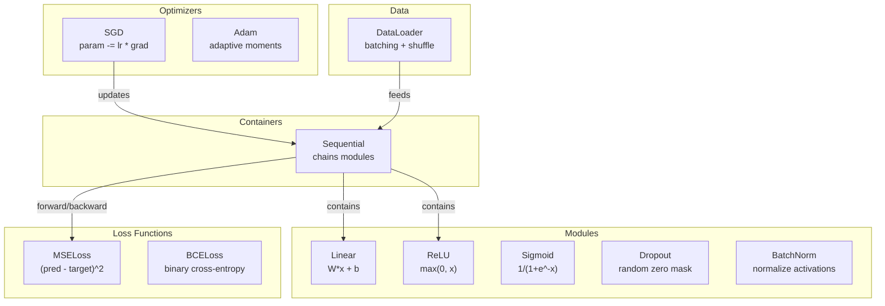
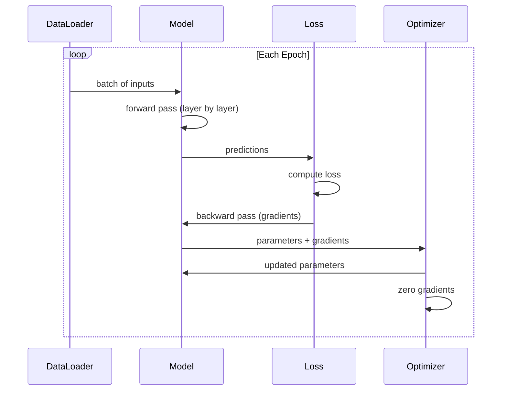
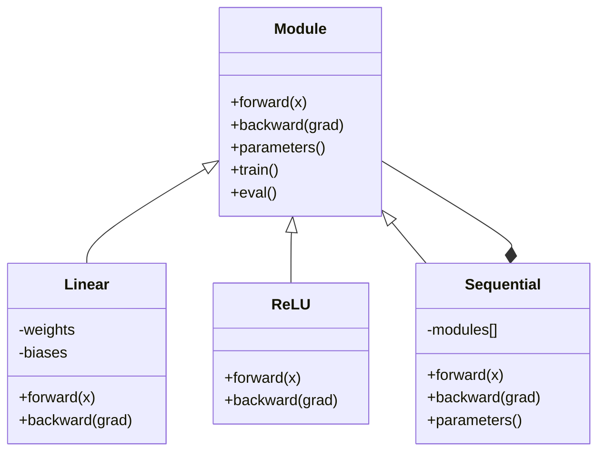

# Kendi Mini Framework'unuzu oluşturun

> Sen nöronları, katmanları, ağları, arka planları, etkinleştirmeler, Kayıp Fonksiyonları, Optimizerler, düzenleme, başlangıç ve LR programları oluşturduğunuzu biliyorum. Bunlar dağılmış bağımsız parçalardır. Şimdi onları bir çerçeveye bağlayın.

**类型:**Yapım
**语言:**Python
**前置知识:**Eğitim 03 全部内容(Düşünmeler 01-09)
**时间:**~ 120 dakika

## Öğrenme hedefi

- Dep Learning Framework'ı oluşturmak (~ 500 行), Modül,Linear,ReLU,Sigmoid,Dropout,BatchNorm,Sequential,Loss Functions,Optimizers, DataLoader içerir
- 解释 Modül abstraksiyonu ((çabuk ilerle, geriye, parametreler), ve neden tren/ev modunu değiştirmek gerekiyor
- Tüm bileşenleri bir çalışma biçimindeki eğitim döngüsüne bağlamak, döngü sınıflandırmasında kullanmak ve 4 katmanlı bir ağ eğitimi
- Çerçeve içindeki her bileşenini karşı karşı karşı karşı karşı karşı karşı karşı karşı karşı karşı karşı karşı karşı karşı karşı karşı karşı karşı karşı karşı karşı karşı karşı karşı karşı karşı karşı karşı karşı karşı karşı karşı karşı karşı karşı karşı karşı karşı karşı karşı karşı karşı karşı karşı karşı karşı karşı karşı karşı karşı karşı karşı karşı karşı karşı karşı karşı karşı karşı karşı karşı karşı karşı karşı karşı karşı karşı karşı karşı karşı karşı karşı karşı karşı karşı karşı karşı karşı karşı karşı karşı karşı karşı karşı karşı karşı karşı karşı karşı karşı karşı karşı karşı karşı karşı karşı karşı karşı karşı karşı karşı karşı karşı karşı karşı karşı karşı karşı karşı karşı karşı karşı karşı karşı karşı karşı karşı karşı karşı karşı karşı karşı karşı karşı karşı karşı karşı karşı karşı karşı karşı karşı karşı karşı karşı karşı karşı karşı karşı karşı karşı karşı karşı karşı karşı karşı karşı karşı karşı karşı karşı karşı karşı karşı karşı karşı karşı karşı karşı karşı karşı karşı karşı karşı karşı karşı karşı karşı karşı karşı karşı karşı karşı karşı karşı karşı karşı karşı karşı karşı karşı karşı karşı karşı karşı karşı karşı karşı karşı karşı karşı karşı karşı karşı karşı karşı karşı karşı karşı karşı karşı karşı karşı karşı karşı karşı karşı karşı karşı karşı karşı karşı karşı karşı karşı karşı karşı karşı karşı karşı karşı karşı karşı karşı karşı karşı karşı karşı karşı karşı karşı karşı karşı karşı karşı karşı karşı karşı karşı karşı karşı karşı karşı karşı karşı karşı karşı karşı karşı karşı karşı karşı karşı karşı karşı karşı karşı karşı karşı karşı karşı karşı karşı karşı karşı karşı karşı karşı karşı karşı karşı karşı karşı karşı karşı karşı karşı karşı karşı karşı karşı karşı karşı karşı karşı karşı karşı karşı karşı karşı karşı karşı karşı karşı karşı karşı karşı karşı karşı karşı karşı karşı karşı karşı karşı karşı karşı karşı karşı karşı karşı karşı karşı karşı karşı karşı karşı karşı karşı karşı karşı karşı karşı karşı karşı karşı karşı karşı karşı karşı karşı karşı karşı karşı karşı karşı karşı karşı karşı karşı karşı karşı karşı karşı karşı karşı karşı karşı karşı karşı karşı karşı karşı karşı karşı karşı karşı karşı karşı karşı karşı karşı karşı karşı karşı karşı karşı karşı karşı karşı karşı karşı karşı karşı karşı karşı karşı karşı karşı karşı karşı karşı karşı karşı karşı karşı karşı karşı karşı karşı karşı karşı karşı karşı karşı karşı karşı karşı karşı karşı karşı karşı karşı karşı karşı karşı karşı karşı karşı karşı karşı karşı karşı karşı karşı karşı karşı karşı karşı karşı karşı karşı karşı karşı karşı karşı karşı karşı karşı karşı karşı karşı karşı karşı karşı karşı karşı karşı karşı karşı karşı karşı karşı karşı karşı karşı karşı karşı karşı karşı karşı karşı karşı karşı karşı karşı karşı karşı karşı karşı karşı karşı karşı karşı karşı karşı karşı karşı karşı karşı karşı karşı karşı karşı karşı karşı karşı karşı karşı karşı karşı karşı karşı karşı karşı karşı karşı karşı karşı karşı karşı karşı karşı karşı karşı karşı karşı karşı karşı

## 问题

10 bölümde farklı dosyalarda dağılıp duran yapı taşlarını inşa ettin.`Value`Bir sınıf, bir eğitim döngüsü var, bir başka dosyada ağırlık başlangıcı var, bir başka dosyada öğrenme oranı programları var. Bir ağı eğitmek için, beş bölümden farklı dersler arasında yapıştırma kodlarını kopyalamak ve sonra bunları elden bağlamak gerekir.

Bu sorunu çözmek için bir çerçeve.`nn.Module`- Evet.`nn.Sequential`- Evet.`optim.Adam`- Evet.`DataLoader`, ve onları bir araya getirerek oluşturulan eğitim döngüsü örneği.`keras.Layer`- Evet.`keras.Sequential`- Evet.`keras.optimizers.Adam`Bunlar sihirli değillerdir. Bunlar, her seferinde temel bağlantı mantıklarını yeniden geliştirmeden, ağları tanımlamak, eğitmek ve değerlendirmek için organizasyon modeldir.

Bu çerçeve, SGD veya Adam ı kullanarak, veriyi batching yapmak, uygulama düşüşü ve batch normallaşımı, istekli etkinleştirme,并调度学习率 kullanarak, herhangi bir geri dönüş ağını tanımlayabilir.

Bitirdikten sonra, PyTorch'da yazılı olarak anlayacaksın.`model = nn.Sequential(...)`Ne oldu, sen de anlamış olacaksın.`model.train()`和 `model.eval()`Nedenini anlayacaksın.`optimizer.zero_grad()`Bu tek bir düzenlemedir. Bunları anlayacaksın çünkü hepsi senin kendi yaptığın.

## 核心概念

### Modül Abstraksiyonu

PyTorch ' un içindeki her katman kendi kendine mirasçı .`nn.Module`❖ Bir Modül üç sorumluluk vardır:

1. **forward()**-- 给定输入,计算输出
2. **parameters()**-- 返回所有可训练重量
3. **backward()**-- 计算 gradients(在 PyTorch 中由自格rad 处理,在我们的框架中显式实现)

Düzsel katman bir Modüludur. RELU etkinleştirmesi bir Modüludur. İndirme katmanı bir Modüludur.

### İletişimli konteyner

`nn.Sequential`会串联模块──Forward pass:让 data依次通过Module 1、Module 2、Module 3──Backward pass:反向遍历这条链──container 本身也是一个Module -- 它有前面()、参数() 和后面(()──这是复合模式:一串模块 本身也是一个模块──

### 訓練 vs Evalüasyon 模式

Eğitim sırasında gevşek ırmak ırmak ırmak ırmak ırmak ırmak ırmak ırmak ırmak ırmak ırmak ırmak ırmak ırmak ırmak ırmak ırmak ırmak ırmak ırmak ırmak ırmak ırmak ırmak ırmak ırmak ırmak ırmak ırmak ırmak ırmak ırmak ırmak ırmak ırmak ırmak ırmak ırmak ırmak ırmak ırmak ırmak ırmak ırmak ırmak ırmak ırmak ırmak ırmak ırmak ırmak ırmak ırmak ırmak ırmak ırmak ırmak ırmak ırmak ırmak ırmak ırmak ırmak ırmak ırmak ırmak ırmak ırmak ırmak ırmak ırmak ırmak ırmak ırmak ırmak ırmak ırmak ırmak ırmak ırmak ırmak ırmak ırmak ırmak ırmak ırmak ırmak ırmak ırmak ırmak ırmak ırmak ırmak ırmak ırmak ırmak ırmak ırmak ırmak ırmak ırmak ırmak ırmak ırmak ırmak ırmak ırmak ırmak ırmak ırmak ırmak ırmak ırmak ırmak ırmak ırmak ırmak ırmak ırmak ırmak ırmak ırmak ırmak ırmak ırmak ırmak ırmak ırmak ırmak ırmak ırmak ırmak ırmak ırmak ırmak ırmak ırmak ırmak ırmak ırmak ırmak ırmak ırmak ırmak ırmak ırmak ırmak ırmak ırmak ırmak ırmak ırmak ırmak ırmak ırmak ırmak ırmak ırmak ırmak ırmak ırmak ır`train()`和 `eval()`Bu davranışları değiştirmek için kullanılan yöntemler.`training`bayrak.

### Optimizer

Optimizer Parametre'nin gradientlerini kullanın onları yenilemek için.`param -= lr * grad`❖ Adam: ❖ ❖ ❖ ❖ ❖ ❖ ❖ ❖ ❖ ❖ ❖ ❖ ❖ ❖ ❖ ❖ ❖ ❖ ❖ ❖ ❖ ❖ ❖ ❖ ❖ ❖ ❖ ❖ ❖ ❖ ❖ ❖ ❖ ❖ ❖ ❖ ❖ ❖ ❖ ❖ ❖ ❖ ❖ ❖ ❖ ❖ ❖ ❖ ❖ ❖ ❖ ❖ ❖ ❖ ❖ ❖ ❖ ❖ ❖ ❖ ❖ ❖ ❖ ❖ ❖ ❖ ❖ ❖ ❖ ❖ ❖ ❖ ❖ ❖ ❖ ❖ ❖ ❖ ❖ ❖ ❖ ❖ ❖ ❖ ❖ ❖ ❖ ❖ ❖ ❖ ❖ ❖ ❖ ❖ ❖ ❖ ❖ ❖ ❖ ❖ ❖ ❖ ❖ ❖ ❖ ❖ ❖ ❖ ❖ ❖ ❖ ❖ ❖ ❖ ❖ ❖ ❖ ❖ ❖ ❖ ❖ ❖ ❖ ❖ ❖ ❖ ❖ ❖ ❖ ❖ ❖ ❖ ❖ ❖ ❖ ❖ ❖ ❖ ❖ ❖ ❖ ❖ ❖ ❖ ❖ ❖ ❖ ❖ ❖ ❖ ❖ ❖ ❖ ❖ ❖ ❖ ❖ ❖ ❖ ❖ ❖ ❖ ❖ ❖ ❖ ❖ ❖ ❖ ❖ ❖ ❖ ❖ ❖ ❖ ❖ ❖ ❖ ❖ ❖ ❖ ❖ ❖ ❖ ❖ ❖ ❖ ❖ ❖ ❖ ❖ ❖            ❖ ❖                                                                                                             

### DataLoader

Batching  çok önemlidir, iki nedeni vardır. Birincisi, büyük sorunlar için tüm veri kümesini kaydetmek mümkün değildir.

### Çerçeve mimarisi



### Eğitim Çubuğu



### Modül Hierarşi




```figure
gradient-clipping
```

## Yapın onu.

### 步骤 1: Modül Üssü Sınıf

Her katmanın bir çekim arayüzü olması gerekiyor.

```python
class Module:
    def __init__(self):
        self.training = True

    def forward(self, x):
        raise NotImplementedError

    def backward(self, grad):
        raise NotImplementedError

    def parameters(self):
        return []

    def train(self):
        self.training = True

    def eval(self):
        self.training = False
```

### 步骤 2: Düz Layer

⋅ ⋅ ⋅ ⋅ ⋅ ⋅ ⋅ ⋅ ⋅ ⋅ ⋅ ⋅ ⋅ ⋅ ⋅ ⋅ ⋅ ⋅ ⋅ ⋅ ⋅ ⋅ ⋅ ⋅ ⋅ ⋅ ⋅ ⋅ ⋅ ⋅ ⋅ ⋅ ⋅ ⋅ ⋅ ⋅ ⋅ ⋅ ⋅ ⋅ ⋅ ⋅ ⋅ ⋅ ⋅ ⋅ ⋅ ⋅ ⋅ ⋅ ⋅ ⋅ ⋅ ⋅ ⋅ ⋅ ⋅ ⋅ ⋅ ⋅ ⋅ ⋅ ⋅ ⋅ ⋅ ⋅ ⋅ ⋅ ⋅ ⋅ ⋅ ⋅ ⋅ ⋅ ⋅ ⋅ ⋅ ⋅ ⋅ ⋅ ⋅ ⋅ ⋅ ⋅ ⋅ ⋅ ⋅ ⋅ ⋅ ⋅ ⋅ ⋅ ⋅ ⋅ ⋅ ⋅ ⋅ ⋅ ⋅ ⋅ ⋅ ⋅ ⋅ ⋅ ⋅ ⋅ ⋅ ⋅ ⋅ ⋅ ⋅ ⋅ ⋅ ⋅ ⋅ ⋅ ⋅ ⋅ ⋅ ⋅ ⋅ ⋅ ⋅ ⋅ ⋅ ⋅ ⋅ ⋅ ⋅ ⋅ ⋅ ⋅ ⋅ ⋅ ⋅ ⋅ ⋅ ⋅ ⋅ ⋅ ⋅ ⋅ ⋅                                                                                                                                                                                                                                

```python
import math
import random


class Linear(Module):
    def __init__(self, fan_in, fan_out):
        super().__init__()
        std = math.sqrt(2.0 / fan_in)
        self.weights = [[random.gauss(0, std) for _ in range(fan_in)] for _ in range(fan_out)]
        self.biases = [0.0] * fan_out
        self.weight_grads = [[0.0] * fan_in for _ in range(fan_out)]
        self.bias_grads = [0.0] * fan_out
        self.fan_in = fan_in
        self.fan_out = fan_out
        self.input = None

    def forward(self, x):
        self.input = x
        output = []
        for i in range(self.fan_out):
            val = self.biases[i]
            for j in range(self.fan_in):
                val += self.weights[i][j] * x[j]
            output.append(val)
        return output

    def backward(self, grad):
        input_grad = [0.0] * self.fan_in
        for i in range(self.fan_out):
            self.bias_grads[i] += grad[i]
            for j in range(self.fan_in):
                self.weight_grads[i][j] += grad[i] * self.input[j]
                input_grad[j] += grad[i] * self.weights[i][j]
        return input_grad

    def parameters(self):
        params = []
        for i in range(self.fan_out):
            for j in range(self.fan_in):
                params.append((self.weights, i, j, self.weight_grads))
            params.append((self.biases, i, None, self.bias_grads))
        return params
```

### 步骤 3: Aktifleştirme Modülleri

ReLU、Sigmoid 和 Tanh 实现为模块──每个都会缓存后转传所需内容──

```python
class ReLU(Module):
    def __init__(self):
        super().__init__()
        self.mask = None

    def forward(self, x):
        self.mask = [1.0 if v > 0 else 0.0 for v in x]
        return [max(0.0, v) for v in x]

    def backward(self, grad):
        return [g * m for g, m in zip(grad, self.mask)]


class Sigmoid(Module):
    def __init__(self):
        super().__init__()
        self.output = None

    def forward(self, x):
        self.output = []
        for v in x:
            v = max(-500, min(500, v))
            self.output.append(1.0 / (1.0 + math.exp(-v)))
        return self.output

    def backward(self, grad):
        return [g * o * (1 - o) for g, o in zip(grad, self.output)]


class Tanh(Module):
    def __init__(self):
        super().__init__()
        self.output = None

    def forward(self, x):
        self.output = [math.tanh(v) for v in x]
        return self.output

    def backward(self, grad):
        return [g * (1 - o * o) for g, o in zip(grad, self.output)]
```

### 步骤 4: Kaldırma Modülü

訓練時随机将元素置零──将保留下来的元素按1/(1-p) 缩放, 期望值保持不变──在 eval 时不做任何处理──

```python
class Dropout(Module):
    def __init__(self, p=0.5):
        super().__init__()
        self.p = p
        self.mask = None

    def forward(self, x):
        if not self.training:
            return x
        self.mask = [0.0 if random.random() < self.p else 1.0 / (1 - self.p) for _ in x]
        return [v * m for v, m in zip(x, self.mask)]

    def backward(self, grad):
        if self.mask is None:
            return grad
        return [g * m for g, m in zip(grad, self.mask)]
```

### 步骤 5: BatchNorm Modül

按特征 在批量上将激活 归一化为零 mean 和单位变量──为 eval mode 维护运行统计──

```python
class BatchNorm(Module):
    def __init__(self, size, momentum=0.1, eps=1e-5):
        super().__init__()
        self.size = size
        self.gamma = [1.0] * size
        self.beta = [0.0] * size
        self.gamma_grads = [0.0] * size
        self.beta_grads = [0.0] * size
        self.running_mean = [0.0] * size
        self.running_var = [1.0] * size
        self.momentum = momentum
        self.eps = eps
        self.x_norm = None
        self.std_inv = None
        self.batch_input = None

    def forward_batch(self, batch):
        batch_size = len(batch)
        output_batch = []

        if self.training:
            mean = [0.0] * self.size
            for sample in batch:
                for j in range(self.size):
                    mean[j] += sample[j]
            mean = [m / batch_size for m in mean]

            var = [0.0] * self.size
            for sample in batch:
                for j in range(self.size):
                    var[j] += (sample[j] - mean[j]) ** 2
            var = [v / batch_size for v in var]

            self.std_inv = [1.0 / math.sqrt(v + self.eps) for v in var]

            self.x_norm = []
            self.batch_input = batch
            for sample in batch:
                normed = [(sample[j] - mean[j]) * self.std_inv[j] for j in range(self.size)]
                self.x_norm.append(normed)
                output = [self.gamma[j] * normed[j] + self.beta[j] for j in range(self.size)]
                output_batch.append(output)

            for j in range(self.size):
                self.running_mean[j] = (1 - self.momentum) * self.running_mean[j] + self.momentum * mean[j]
                self.running_var[j] = (1 - self.momentum) * self.running_var[j] + self.momentum * var[j]
        else:
            std_inv = [1.0 / math.sqrt(v + self.eps) for v in self.running_var]
            for sample in batch:
                normed = [(sample[j] - self.running_mean[j]) * std_inv[j] for j in range(self.size)]
                output = [self.gamma[j] * normed[j] + self.beta[j] for j in range(self.size)]
                output_batch.append(output)

        return output_batch

    def forward(self, x):
        result = self.forward_batch([x])
        return result[0]

    def backward(self, grad):
        if self.x_norm is None:
            return grad
        for j in range(self.size):
            self.gamma_grads[j] += self.x_norm[0][j] * grad[j]
            self.beta_grads[j] += grad[j]
        return [grad[j] * self.gamma[j] * self.std_inv[j] for j in range(self.size)]

    def parameters(self):
        params = []
        for j in range(self.size):
            params.append((self.gamma, j, None, self.gamma_grads))
            params.append((self.beta, j, None, self.beta_grads))
        return params
```

### 步骤 6: Sequential Container

串联模块──Forward from left to right, backward from right to left──

```python
class Sequential(Module):
    def __init__(self, *modules):
        super().__init__()
        self.modules = list(modules)

    def forward(self, x):
        for module in self.modules:
            x = module.forward(x)
        return x

    def backward(self, grad):
        for module in reversed(self.modules):
            grad = module.backward(grad)
        return grad

    def parameters(self):
        params = []
        for module in self.modules:
            params.extend(module.parameters())
        return params

    def train(self):
        self.training = True
        for module in self.modules:
            module.train()

    def eval(self):
        self.training = False
        for module in self.modules:
            module.eval()
```

### 步骤 7: Kayıp İşlevleri

MSE 和 Binary Cross-Entropy── her bir kişi kayıp değerini geri döndürür,并提供一个倒退() 来返回 Gradient──

```python
class MSELoss:
    def __call__(self, predicted, target):
        self.predicted = predicted
        self.target = target
        n = len(predicted)
        self.loss = sum((p - t) ** 2 for p, t in zip(predicted, target)) / n
        return self.loss

    def backward(self):
        n = len(self.predicted)
        return [2 * (p - t) / n for p, t in zip(self.predicted, self.target)]


class BCELoss:
    def __call__(self, predicted, target):
        self.predicted = predicted
        self.target = target
        eps = 1e-7
        n = len(predicted)
        self.loss = 0
        for p, t in zip(predicted, target):
            p = max(eps, min(1 - eps, p))
            self.loss += -(t * math.log(p) + (1 - t) * math.log(1 - p))
        self.loss /= n
        return self.loss

    def backward(self):
        eps = 1e-7
        n = len(self.predicted)
        grads = []
        for p, t in zip(self.predicted, self.target):
            p = max(eps, min(1 - eps, p))
            grads.append((-t / p + (1 - t) / (1 - p)) / n)
        return grads
```

### 步骤 8: SGD 和 Adam Optimizers

两者都接收参数 list,并使用梯度 更新重量──

```python
class SGD:
    def __init__(self, parameters, lr=0.01):
        self.params = parameters
        self.lr = lr

    def step(self):
        for container, i, j, grad_container in self.params:
            if j is not None:
                container[i][j] -= self.lr * grad_container[i][j]
            else:
                container[i] -= self.lr * grad_container[i]

    def zero_grad(self):
        for container, i, j, grad_container in self.params:
            if j is not None:
                grad_container[i][j] = 0.0
            else:
                grad_container[i] = 0.0


class Adam:
    def __init__(self, parameters, lr=0.001, beta1=0.9, beta2=0.999, eps=1e-8):
        self.params = parameters
        self.lr = lr
        self.beta1 = beta1
        self.beta2 = beta2
        self.eps = eps
        self.t = 0
        self.m = [0.0] * len(parameters)
        self.v = [0.0] * len(parameters)

    def step(self):
        self.t += 1
        for idx, (container, i, j, grad_container) in enumerate(self.params):
            if j is not None:
                g = grad_container[i][j]
            else:
                g = grad_container[i]

            self.m[idx] = self.beta1 * self.m[idx] + (1 - self.beta1) * g
            self.v[idx] = self.beta2 * self.v[idx] + (1 - self.beta2) * g * g

            m_hat = self.m[idx] / (1 - self.beta1 ** self.t)
            v_hat = self.v[idx] / (1 - self.beta2 ** self.t)

            update = self.lr * m_hat / (math.sqrt(v_hat) + self.eps)

            if j is not None:
                container[i][j] -= update
            else:
                container[i] -= update

    def zero_grad(self):
        for container, i, j, grad_container in self.params:
            if j is not None:
                grad_container[i][j] = 0.0
            else:
                grad_container[i] = 0.0
```

### 步骤 9: DataLoader

Verileri 切分分批,并可选择在每时代中混动──

```python
class DataLoader:
    def __init__(self, data, batch_size=32, shuffle=True):
        self.data = data
        self.batch_size = batch_size
        self.shuffle = shuffle

    def __iter__(self):
        indices = list(range(len(self.data)))
        if self.shuffle:
            random.shuffle(indices)
        for start in range(0, len(indices), self.batch_size):
            batch_indices = indices[start:start + self.batch_size]
            batch = [self.data[i] for i in batch_indices]
            inputs = [item[0] for item in batch]
            targets = [item[1] for item in batch]
            yield inputs, targets

    def __len__(self):
        return (len(self.data) + self.batch_size - 1) // self.batch_size
```

### 第 10 步: Çember sınıflandırması 上训练 4 katmanlı ağ

Bütün şeyleri bağlayın, model tanımlayın, Kayıp Fonksiyonu seçin, Optimizer seçin, eğitim döngüsünü yürütün.

```python
def make_circle_data(n=500, seed=42):
    random.seed(seed)
    data = []
    for _ in range(n):
        x = random.uniform(-2, 2)
        y = random.uniform(-2, 2)
        label = 1.0 if x * x + y * y < 1.5 else 0.0
        data.append(([x, y], [label]))
    return data


def train():
    random.seed(42)

    model = Sequential(
        Linear(2, 16),
        ReLU(),
        Linear(16, 16),
        ReLU(),
        Linear(16, 8),
        ReLU(),
        Linear(8, 1),
        Sigmoid(),
    )

    criterion = BCELoss()
    optimizer = Adam(model.parameters(), lr=0.01)

    data = make_circle_data(500)
    split = int(len(data) * 0.8)
    train_data = data[:split]
    test_data = data[split:]

    loader = DataLoader(train_data, batch_size=16, shuffle=True)

    model.train()

    for epoch in range(100):
        total_loss = 0
        total_correct = 0
        total_samples = 0

        for batch_inputs, batch_targets in loader:
            batch_loss = 0
            for x, t in zip(batch_inputs, batch_targets):
                pred = model.forward(x)
                loss = criterion(pred, t)
                batch_loss += loss

                optimizer.zero_grad()
                grad = criterion.backward()
                model.backward(grad)
                optimizer.step()

                predicted_class = 1.0 if pred[0] >= 0.5 else 0.0
                if predicted_class == t[0]:
                    total_correct += 1
                total_samples += 1

            total_loss += batch_loss

        avg_loss = total_loss / total_samples
        accuracy = total_correct / total_samples * 100

        if epoch % 10 == 0 or epoch == 99:
            print(f"Epoch {epoch:3d} | Loss: {avg_loss:.6f} | Train Accuracy: {accuracy:.1f}%")

    model.eval()
    correct = 0
    for x, t in test_data:
        pred = model.forward(x)
        predicted_class = 1.0 if pred[0] >= 0.5 else 0.0
        if predicted_class == t[0]:
            correct += 1
    test_accuracy = correct / len(test_data) * 100
    print(f"\nTest Accuracy: {test_accuracy:.1f}% ({correct}/{len(test_data)})")

    return model, test_accuracy
```

## Kullan

Aşağıda, yeni inşa ettiğiniz PyTorch içerikleri ve diğer fiyat versiyonları bulunuyor:

```python
import torch
import torch.nn as nn
from torch.utils.data import DataLoader, TensorDataset

model = nn.Sequential(
    nn.Linear(2, 16),
    nn.ReLU(),
    nn.Linear(16, 16),
    nn.ReLU(),
    nn.Linear(16, 8),
    nn.ReLU(),
    nn.Linear(8, 1),
    nn.Sigmoid(),
)

criterion = nn.BCELoss()
optimizer = torch.optim.Adam(model.parameters(), lr=0.01)

for epoch in range(100):
    model.train()
    for inputs, targets in dataloader:
        optimizer.zero_grad()
        predictions = model(inputs)
        loss = criterion(predictions, targets)
        loss.backward()
        optimizer.step()

    model.eval()
    with torch.no_grad():
        test_predictions = model(test_inputs)
```

结构是完全一致的──`Sequential`- Evet.`Linear`- Evet.`ReLU`- Evet.`Sigmoid`- Evet.`BCELoss`- Evet.`Adam`- Evet.`zero_grad`- Evet.`backward`- Evet.`step`- Evet.`train`- Evet.`eval`△ her kavramı bir karşı karşı karşı karşı karşı karşı karşı karşı karşı karşı karşı karşı karşı karşı karşı karşı karşı karşı karşı karşı karşı karşı karşı karşı karşı karşı karşı karşı karşı karşı karşı karşı karşı karşı karşı karşı karşı karşı karşı karşı karşı karşı karşı karşı karşı karşı karşı karşı karşı karşı karşı karşı karşı karşı karşı karşı karşı karşı karşı karşı karşı karşı karşı karşı karşı karşı karşı karşı karşı karşı karşı karşı karşı karşı karşı karşı karşı karşı karşı karşı karşı karşı karşı karşı karşı karşı karşı karşı karşı karşı karşı karşı karşı karşı karşı karşı karşı karşı karşı karşı karşı karşı karşı karşı karşı karşı karşı karşı karşı karşı karşı karşı karşı karşı karşı karşı karşı karşı karşı karşı karşı karşı karşı karşı karşı karşı karşı karşı karşı karşı karşı karşı karşı karşı karşı karşı karşı karşı karşı karşı karşı karşı karşı karşı karşı karşı karşı karşı karşı karşı karşı karşı karşı karşı karşı karşı karşı karşı karşı karşı karşı karşı karşı karşı karşı karşı karşı karşı karşı karşı karşı karşı karşı karşı karşı karşı karşı karşı karşı karşı karşı karşı karşı karşı karşı karşı karşı karşı karşı karşı karşı karşı karşı karşı karşı karşı karşı karşı karşı karşı karşı karşı karşı karşı karşı karşı karşı karşı karşı karşı karşı karşı karşı karşı karşı karşı karşı karşı karşı karşı karşı karşı karşı karşı karşı karşı karşı karşı karşı karşı karşı karşı karşı karşı karşı karşı karşı karşı karşı karşı karşı karşı karşı karşı karşı karşı karşı karşı karşı karşı karşı karşı karşı karşı karşı karşı karşı karşı karşı karşı karşı karşı karşı karşı karşı karşı karşı karşı karşı karşı karşı karşı karşı karşı karşı karşı karşı karşı karşı karşı karşı karşı karşı karşı karşı karşı karşı karşı karşı karşı karşı karşı karşı karşı karşı karşı karşı karşı karşı karşı karşı karşı karşı karşı karşı karşı karşı karşı karşı karşı karşı karşı karşı karşı karşı karşı karşı karşı karşı karşı karşı karşı karşı karşı karşı karşı karşı karşı karşı karşı karşı karşı karşı karşı karşı karşı karşı karşı karşı karşı karşı karşı karşı karşı karşı karşı karşı karşı karşı karşı karşı karşı karşı karşı karşı karşı karşı karşı karşı karşı karşı karşı karşı karşı karşı karşı karşı karşı karşı karşı karşı karşı karşı karşı karşı karşı karşı karşı karşı karşı karşı karşı karşı karşı karşı karşı karşı karşı karşı karşı karşı karşı karşı karşı karşı karşı karşı karşı karşı karşı karşı karşı karşı karşı karşı karşı karşı karşı karşı karşı karşı karşı karşı karşı karşı karşı karşı karşı karşı karşı karşı karşı karşı karşı karşı karşı karşı karşı karşı karşı karşı karşı karşı karşı karşı karşı karşı karşı karşı karşı karşı karşı karşı karşı karşı karşı karşı karşı karşı karşı karşı karşı karşı karşı karşı karşı karşı karşı karşı karşı karşı karşı karşı karşı karşı karşı karşı karşı karşı karşı karşı karşı karşı karşı karşı karşı karşı karşı karşı karşı karşı karşı karşı karşı karşı karşı karşı karşı karşı karşı karşı karşı karşı karşı karşı karşı karşı karşı karşı karşı karşı karşı karşı

Şimdi, PyTorch kodunu gördüğünde, her satırın ne olduğunu anlayacaksın. Bu anlayış bu dersin tüm anlamını ifade eder.

## 交付内容

Bu ders:
- `outputs/prompt-framework-architect.md`-- bir çerçeve temelinde soyutlamalar için kullanılır  tasarım sinir ağ mimarisi

## 练习

1. Çok sınıf sınıflandırma 添加一个 `SoftmaxCrossEntropyLoss`sınıfı── tahminlere karşı yapın softmax, hesap yapın çapraz entropi kaybı,并处理组合后的倒退通过──在一个3级螺旋数据集上测试它──

2. Önemlendirmeci içinde öğrenme oranı programlamasını gerçekleştirmek: 添加一个`set_lr()`Metod,并接入 Ders 09 中的kosin grafikı──使用暖化+kosin 训练圆分类器,并与常数 LR对比──

3. Çeviri 添加 `save()`和 `load()`Metod, tüm ağırlıkları JSON dosyasına sıralanır, yeniden yüklenir, test yüklenmesinden sonra modelle orijinal model ile aynı tahminler üretir.

4. Adam Optimizer'de kilo kaybını gerçekleştirmek için L2 düzenlenmesi)`weight_decay`Parametre, ağırlıkların her adımdan sıfıra küçülmesini sağlar.

5. Gerçek mini-batch Gradient birikimi  örnek başına değiştirme eğitim döngüsü: Bir parti tüm örnekleri üzerinde toplama gradientleri, sonra parti boyutuna ayırmak, tekrar bir Optimizer adımını gerçekleştirmek.

## 关键术语

| Term | 人们通常怎么说 | 它真正的含义 |
|------|----------------|----------------------|
| Module | “一个 layer” | framework 中的基础 abstraction -- 任何具有 forward()、backward() 和 parameters() 的东西 |
| Sequential | “按顺序堆叠 layers” | 一个串联 modules 的 container，在 forward 时按顺序应用，在 backward 时反向应用 |
| Forward pass | “运行 network” | 按顺序让 input 通过每个 module 来计算 output |
| Backward pass | “计算 gradients” | 将 Loss Gradient Backpropagation通过每个 module，以计算 parameter gradients |
| Parameters | “可训练 weights” | network 中 Optimizer 可以更新的所有值 -- weights 和 biases |
| Optimizer | “更新 weights 的东西” | 一种使用 gradients 更新 parameters 的算法，实现 SGD、Adam 或其他规则 |
| DataLoader | “喂 data 的东西” | 一个 iterator，将 dataset 切分为 batches，并可选择在 epochs 之间 shuffle |
| Training mode | “model.train()” | 一个启用 stochastic 行为的 flag，例如 dropout，以及使用 batch stats 的 batch normalization |
| Evaluation mode | “model.eval()” | 一个禁用 dropout 并让 batch normalization 使用 running statistics 的 flag |
| Zero grad | “清空 gradients” | 在计算下一个 batch 的 gradients 之前，将所有 parameter gradients 重置为零 |

## 延伸阅读

- Paszke et al., "PyTorch: Bir İmperatif Stylo, Yüksek Performanslı Derin Öğrenme Kütüphanesi" (2019) -- 描述 PyTorch 设计决策的论文
- Chollet, "Python ile Derin Öğrenme, İkinci Sürüm" (2021) -- Bölüm 3 介绍 Keras içselleri, Using the same module/layer abstraction
- Johnson, "Tiny-DNN" (https://github.com/tiny-dnn/tiny-dnn) -- Framework içini anlamak için sadece başlıklı bir C++ Derin Öğrenme çerçevesini oluşturmak
