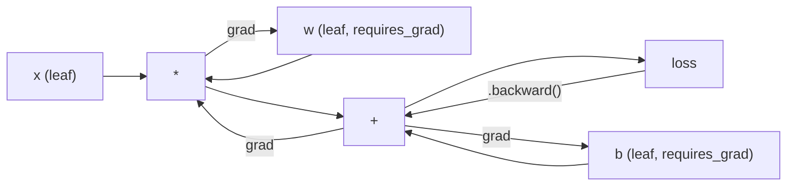
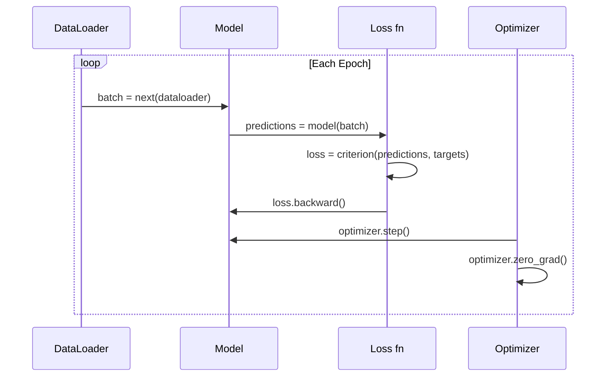

# PyTorch Giriş

> Sen motorumu bir yandan yaratmışsın. Şimdi herkesin gerçekten açacak bir tane öğrenmeye gel.

**Type:** Build
**Languages:** Python
**Prerequisites:** Lesson 03.10 (Build Your Own Mini Framework)
**Time:** ~75 minutes

## Öğrenme hedefi
- PyTorch'in nn.Module、nn.Sequential 和 autograd 构建并训练 Nöral Ağ
- PyTorch Tensor、GPU 加速,以及标准训练循环(zero_grad、forward、loss、backward、step)
- Çerez'den Mini Framework'ı Çerez'e dönüştürmek
- Aynı görevdeki profil ve Python çerçevesini PyTorch'in eğitim hızıyla karşılaştır

## 问题
Siz zaten çalışabilir bir mini çerçeve var. Sınırlı katmanlar, RELU, düşüş, parti normları, Adam, bir DataLoader, bir eğitim döngüsü.

Ama aynı sorunda, PyTorch'tan 500 kat daha yavaş.

Sizin mini çerçeve Python  döngüsü bir örnek işleme için kullanılır. PyTorch aynı işlemleri optimize edilmiş C++/CUDA çekirdeklerine dağıtacak ve GPU'ya yüklenecek.

速度不是唯一差距──你的框架──没有GPU 支持──没有自动区分──你为每个模块写回文了()──没有序列化──没有分布式训练──没有混合精度──除了打印语句,没有方法 debug Gradient flow──

PyTorch  tüm bu eksiklikleri doldurmuştur. Ayrıca, oluşturduğunuz tamamen aynı zihinsel modeli koruyor: Modül, ileri, ön, ön, ön, ön, ön, ön, ön, ön, ön, ön, ön, ön, ön, ön, ön, ön, ön, ön, ön, ön, ön, ön, ön, ön, ön, ön, ön, ön, ön, ön, ön, ön, ön, ön, ön, ön, ön, ön, ön, ön, ön, ön, ön, ön, ön, ön, ön, ön, ön, ön, ön, ön, ön, ön, ön, ön, ön, ön, ön, ön, ön, ön, ön, ön, ön, ön, ön, ön, ön, ön, ön, ön, ön, ön, ön, ön, ön, ön, ön, ön, ön, ön, ön, ön, ön, ön, ön, ön, ön, ön, ön, ön, ön, ön, ön, ön, ön, ön, ön, ön, ön, ön, ön, ön, ön, ön, ön, ön, ön, ön, ön, ön, ön, ön, ön, ön, ön, ön, ön, ön, ön, ön, ön, ön, ön, ön, ön, ön, ön, ön, ön, ön, ön, ön, ön, ön, ön, ön, ön, ön, ön, ön, ön, ön, ön, ön, ön, ön, ön, ön, ön, ön, ön, ön, ön, ön, ön, ön, ön, ön, ön, ön, ön, ön, ön, ön, ön, ön, ön, ön, ön, ön, ön, ön, ön, ön, ön, ön, ön, ön, ön, ön, ön, ön, ön, ön, ön, ön, ön, ön, ön, ön, ön, ön, ön, ön, ön, ön, ön, ön, ön, ön, ön, ön, ön, ön, ön, ön, ön, ön, ön, ön, ön, ön, ön, ön, ön, ön, ön, ön, ön, ön, ön, ön, ön, ön, ön, ön, ön, ön, ön, ön, ön, ön, ön, ön, ön, ön, ön

## 概念
### PyTorch Neden Kazandı

2015 yılında, TensorFlow                                                                                                                                                                                                                                                                                                                                                                                                                                                                                                                       

PyTorch 2017 yılında yayınlanan, farklı bir düşünceyi benimsemiştir: hevesli yürütme.`y = model(x)`Bu, standart Python debugging 工具都能工作──print() 能工作──pdb 能工作──forward pass 里 if/else 能工作──

Piyasa 2020 yılına kadar cevap verdi. Python'un ML araştırma makalelerinde payı %7'den 2017'de %75'e kadar büyüdü.

Bu bölümün önemli noktası: Geliştiriciler deneyimi %10 yavaş büyüyecek, ama %50'lik çerçeveyi düzeltmek için her seferinde kazanılacak.

### Tansörler

Tensiyon bir çok boyutlu bir sayıdır, üç anahtar özelliğe sahiptir: şekil, dtip ve cihaz.

```python
import torch

x = torch.zeros(3, 4)           # shape: (3, 4), dtype: float32, device: cpu
x = torch.randn(2, 3, 224, 224) # batch of 2 RGB images, 224x224
x = torch.tensor([1, 2, 3])     # from a Python list
```

**Shape**Gösterim: △ △ △ △ △ △ △ △ △ △ △ △ △ △ △ △ △ △ △ △ △ △ △ △ △ △ △ △ △ △ △ △ △ △ △ △ △ △ △ △ △ △ △ △ △ △ △ △ △ △ △ △ △ △ △ △ △ △ △ △ △ △ △ △ △ △ △ △ △ △ △ △ △ △ △ △ △ △ △ △ △ △ △ △ △ △ △ △ △ △ △ △ △ △ △ △ △ △ △ △ △ △ △ △ △ △ △ △ △ △ △ △ △ △ △ △ △ △ △ △ △ △ △ △ △ △ △ △ △ △ △ △ △ △ △ △ △ △ △ △ △ △ △ △ △ △ △ △ △ △ △ △ △ △ △ △ △ △ △ △ △ △ △ △ △ △ △ △ △ △ △ △ △ △ △ △ △ △ △ △ △ △ △ △ △ △ △ 

**Dtype**Kontrol etmem ve kaydetmem.

| dtype | Bits | Range | Use case |
|-------|------|-------|----------|
| float32 | 32 | ~7 位十进制数字 | 默认训练 |
| float16 | 16 | ~3.3 位十进制数字 | Mixed precision |
| bfloat16 | 16 | 与 float32 相同的范围，精度更低 | LLM 训练 |
| int8 | 8 | -128 到 127 | Quantized inference |

**Device**Ne olduğunu belirlemek için.

```python
device = torch.device("cuda" if torch.cuda.is_available() else "cpu")
x = torch.randn(3, 4, device=device)
x = x.to("cuda")
x = x.cpu()
```

Her işlem tüm Tensor'u aynı cihazda gerektirir. Bu ilk öğrencilerin en sık karşılaştığı PyTorch hatasıdır.`RuntimeError: Expected all tensors to be on the same device`❖ Düzeltme yöntemi, tüm içeriği aynı cihaza taşımanın önüne kalktır.

**Reshaping**Bu değişim, veri değil, metadata.

```python
x = torch.randn(2, 3, 4)
x.view(2, 12)      # reshape to (2, 12) -- must be contiguous
x.reshape(6, 4)    # reshape to (6, 4) -- works always
x.permute(2, 0, 1) # reorder dimensions
x.unsqueeze(0)     # add dimension: (1, 2, 3, 4)
x.squeeze()        # remove size-1 dimensions
```

### Autograd

Senin mini çerçevesinin                                                                                                                                                                                                                                                                                                                                                                                                                                                                                                                        



Önceki aşamada bir yazı eklenecek.`.backward()`Bu kaseti tekrar yükleyeceğim.

```python
x = torch.randn(3, requires_grad=True)
y = x ** 2 + 3 * x
z = y.sum()
z.backward()
print(x.grad)  # dz/dx = 2x + 3
```

Autograd'ın üç条规则:

1. Sadece bir tane var .`requires_grad=True`Yaprak Tensiyonı Gradient
2. Gradient 默认会累积                                                                                                                                                                                                                                                                                                                                                                                                                                                                                                                    `optimizer.zero_grad()`
3. `torch.no_grad()`会禁用 Gradient takip(在评估期间使用)

### nn.Modular

`nn.Module`PyTorch'un sürümü otomatik parametreler kaydını, geri dönüşlü modül keşfini, cihaz yönetimini ve durum dikte serileşmesini arttırdı.

```python
import torch.nn as nn

class MLP(nn.Module):
    def __init__(self, input_dim, hidden_dim, output_dim):
        super().__init__()
        self.layer1 = nn.Linear(input_dim, hidden_dim)
        self.relu = nn.ReLU()
        self.layer2 = nn.Linear(hidden_dim, output_dim)

    def forward(self, x):
        x = self.layer1(x)
        x = self.relu(x)
        x = self.layer2(x)
        return x
```

Sen de varken`__init__`İçini birleştir .`nn.Module`Ya da`nn.Parameter`赋值为属性时,PyTorch 会自动注册它──`model.parameters()`Bu yüzden mini çerçeve gibi bir şekilde kilo toplama gerekmiyor.

核心 yapı taşları:

| Module | What it does | Parameters |
|--------|-------------|------------|
| nn.Linear(in, out) | Wx + b | in*out + out |
| nn.Conv2d(in_ch, out_ch, k) | 2D convolution | in_ch*out_ch*k*k + out_ch |
| nn.BatchNorm1d(features) | Normalize activations | 2 * features |
| nn.Dropout(p) | Random zeroing | 0 |
| nn.ReLU() | max(0, x) | 0 |
| nn.GELU() | Gaussian error linear | 0 |
| nn.Embedding(vocab, dim) | Lookup table | vocab * dim |
| nn.LayerNorm(dim) | Per-sample normalization | 2 * dim |

### Kayıp İşlevleri ve Optimizerler

PyTorch kendi içinde oluşturduğunuz tüm içeriklerin üretime hazır versiyonu.

**Loss functions**(Bundan geliyor)`torch.nn`):

| Loss | Task | Input |
|------|------|-------|
| nn.MSELoss() | Regression | 任意 shape |
| nn.CrossEntropyLoss() | Multi-class classification | Logits（不是 softmax） |
| nn.BCEWithLogitsLoss() | Binary classification | Logits（不是 sigmoid） |
| nn.L1Loss() | Regression（robust） | 任意 shape |
| nn.CTCLoss() | Sequence alignment | Log probabilities |

Dikkat:`CrossEntropyLoss`İçeride bir araya geldi.`LogSoftmax`+ `NLLLoss`                                                                                                                                                                                                                                                              

**Optimizers**(Bundan geliyor)`torch.optim`):

| Optimizer | When to use | Typical LR |
|-----------|-------------|-----------|
| SGD(params, lr, momentum) | CNNs、调优良好的 pipelines | 0.01--0.1 |
| Adam(params, lr) | 默认起点 | 1e-3 |
| AdamW(params, lr, weight_decay) | Transformers、fine-tuning | 1e-4--1e-3 |
| LBFGS(params) | Small-scale、second-order | 1.0 |

### Eğitim Çelişkisi

Her PyTorch eğitim döngüsü aynı 5 adımlı bir modüyle devam ediyor.



规范模式:

```python
for epoch in range(num_epochs):
    model.train()
    for inputs, targets in train_loader:
        inputs, targets = inputs.to(device), targets.to(device)
        optimizer.zero_grad()
        outputs = model(inputs)
        loss = criterion(outputs, targets)
        loss.backward()
        optimizer.step()
```

Batch loop 内部五行──训练出 GPT-4、Stable Diffusion 和 LLaMA 的也这五行──architektur 会变──data 会变──这五行不会变──

### Veri kümesi ve DataLoader

PyTorch'in `Dataset`İki yöntemle bir soyut sınıf:`__len__`和 `__getitem__`- Evet.`DataLoader`Bu yüzden paketleme, karıştırma ve çok işlemli veri yükleme.

```python
from torch.utils.data import Dataset, DataLoader

class MNISTDataset(Dataset):
    def __init__(self, images, labels):
        self.images = images
        self.labels = labels

    def __len__(self):
        return len(self.labels)

    def __getitem__(self, idx):
        return self.images[idx], self.labels[idx]

loader = DataLoader(dataset, batch_size=64, shuffle=True, num_workers=4)
```

`num_workers=4`4 süreç başlatılır ve verilerin yüklenmesi, GPU'nun hazırda çalışması. Disk'e bağlı iş yüklerinde, bu işlemlerin eğitim hızını ikiye katlayabilmesi mümkündür.

### GPU Eğitim

Modelleyi GPU'ya taşı:

```python
device = torch.device("cuda" if torch.cuda.is_available() else "cpu")
model = model.to(device)
```

Bu, her parametreyi ve tamponu GPU'ya taşımaya devam eder.

```python
inputs, targets = inputs.to(device), targets.to(device)
```

**Mixed precision**Zamanında kullanılan GPU'lar arasında, A100、H100、RTX 4090'ın üzerinde, 內存 kullanımı azaltılır, 吞吐量倍:前後使用 float16 运行,同时 master weights 保持在 float32:

```python
from torch.amp import autocast, GradScaler

scaler = GradScaler()
for inputs, targets in loader:
    with autocast(device_type="cuda"):
        outputs = model(inputs)
        loss = criterion(outputs, targets)
    scaler.scale(loss).backward()
    scaler.step(optimizer)
    scaler.update()
    optimizer.zero_grad()
```

### Çevre: Mini Framework vs PyTorch vs JAX

| Feature | Mini Framework (L10) | PyTorch | JAX |
|---------|---------------------|---------|-----|
| Autodiff | Manual backward() | Tape-based autograd | Functional transforms |
| Execution | Eager（Python loops） | Eager（C++ kernels） | Traced + JIT compiled |
| GPU support | 无 | 有（CUDA、ROCm、MPS） | 有（CUDA、TPU） |
| Speed (MNIST MLP) | ~300s/epoch | ~0.5s/epoch | ~0.3s/epoch |
| Module system | Custom Module class | nn.Module | Stateless functions（Flax/Equinox） |
| Debugging | print() | print()、pdb、breakpoint() | 更难（JIT tracing 会破坏 print） |
| Ecosystem | 无 | Hugging Face、Lightning、timm | Flax、Optax、Orbax |
| Learning curve | 你已经构建过它 | 中等 | 陡峭（functional paradigm） |
| Production use | Toy problems | Meta、OpenAI、Anthropic、HF | Google DeepMind、Midjourney |


```figure
dropout-mask
```

## Yapın onu.
Bir tek PyTorch primitifleri kullanıyor MNIST'de eğitimli 3 katlı MLP- yok.`torchvision.datasets`◊ 我们自己下载并解析原始数据──

### 步骤 1: from original文件加载 MNIST

MNIST 以 4 个 gzipped dosyaları 发布: training images(60,000 x 28 x 28)  training labels、test images(10,000 x 28 x 28)  test labels────────────────────────────────────────────────────────────────────────────────────────────────────────────────────────────────────────────────────────────────────────────────────────────────────────────────────────────────────────────────────────────────────────────────────────────────────────────────────────────────────────────────────────────────────────────────────────────────────────────────────────────────────────────────────────────────────────────────────────────────────────────────────────────────────────────────────────────────────────────────────────────────────────────────────────────────────────────────────────────────────────────────────────────────────────────────────────────────────────────────────────────────────────────────────────────────────────────────────────────────────────────────────────────────────────────────────────────────────────────────────────────────────────────────────────────────────

```python
import torch
import torch.nn as nn
import struct
import gzip
import urllib.request
import os

def download_mnist(path="./mnist_data"):
    base_url = "https://storage.googleapis.com/cvdf-datasets/mnist/"
    files = [
        "train-images-idx3-ubyte.gz",
        "train-labels-idx1-ubyte.gz",
        "t10k-images-idx3-ubyte.gz",
        "t10k-labels-idx1-ubyte.gz",
    ]
    os.makedirs(path, exist_ok=True)
    for f in files:
        filepath = os.path.join(path, f)
        if not os.path.exists(filepath):
            urllib.request.urlretrieve(base_url + f, filepath)

def load_images(filepath):
    with gzip.open(filepath, "rb") as f:
        magic, num, rows, cols = struct.unpack(">IIII", f.read(16))
        data = f.read()
        images = torch.frombuffer(bytearray(data), dtype=torch.uint8)
        images = images.reshape(num, rows * cols).float() / 255.0
    return images

def load_labels(filepath):
    with gzip.open(filepath, "rb") as f:
        magic, num = struct.unpack(">II", f.read(8))
        data = f.read()
        labels = torch.frombuffer(bytearray(data), dtype=torch.uint8).long()
    return labels
```

### 步骤 2: Model tanımlan

Bir Üç Katman MLP:784 -> 256 -> 128 -> 10。ReLU etkinleştirmeleri。

```python
class MNISTModel(nn.Module):
    def __init__(self):
        super().__init__()
        self.net = nn.Sequential(
            nn.Linear(784, 256),
            nn.ReLU(),
            nn.Dropout(0.2),
            nn.Linear(256, 128),
            nn.ReLU(),
            nn.Dropout(0.2),
            nn.Linear(128, 10),
        )

    def forward(self, x):
        return self.net(x)
```

Çıktı katman 产生 10 个原始logits(每个数字 一个) ――不使用软max`CrossEntropyLoss`İçeride işlenir.

Parametre sayısı: 784*256 + 256 + 256*128 + 128 + 128*10 + 10 = 235.146。

### 3 adım: Eğitim Çubuğu

规范的 ileri-kayıp-geri adım 模式。

```python
def train_one_epoch(model, loader, criterion, optimizer, device):
    model.train()
    total_loss = 0
    correct = 0
    total = 0
    for images, labels in loader:
        images, labels = images.to(device), labels.to(device)
        optimizer.zero_grad()
        outputs = model(images)
        loss = criterion(outputs, labels)
        loss.backward()
        optimizer.step()
        total_loss += loss.item() * images.size(0)
        _, predicted = outputs.max(1)
        correct += predicted.eq(labels).sum().item()
        total += labels.size(0)
    return total_loss / total, correct / total


def evaluate(model, loader, criterion, device):
    model.eval()
    total_loss = 0
    correct = 0
    total = 0
    with torch.no_grad():
        for images, labels in loader:
            images, labels = images.to(device), labels.to(device)
            outputs = model(images)
            loss = criterion(outputs, labels)
            total_loss += loss.item() * images.size(0)
            _, predicted = outputs.max(1)
            correct += predicted.eq(labels).sum().item()
            total += labels.size(0)
    return total_loss / total, correct / total
```

Dikkat değerlendirme sırasında`torch.no_grad()`                                                                                                                                                                                                                                                              

### Adım 4: Tüm bölümleri bağla

```python
def main():
    device = torch.device("cuda" if torch.cuda.is_available() else "cpu")

    download_mnist()
    train_images = load_images("./mnist_data/train-images-idx3-ubyte.gz")
    train_labels = load_labels("./mnist_data/train-labels-idx1-ubyte.gz")
    test_images = load_images("./mnist_data/t10k-images-idx3-ubyte.gz")
    test_labels = load_labels("./mnist_data/t10k-labels-idx1-ubyte.gz")

    train_dataset = torch.utils.data.TensorDataset(train_images, train_labels)
    test_dataset = torch.utils.data.TensorDataset(test_images, test_labels)
    train_loader = torch.utils.data.DataLoader(
        train_dataset, batch_size=64, shuffle=True
    )
    test_loader = torch.utils.data.DataLoader(
        test_dataset, batch_size=256, shuffle=False
    )

    model = MNISTModel().to(device)
    criterion = nn.CrossEntropyLoss()
    optimizer = torch.optim.Adam(model.parameters(), lr=1e-3)

    num_params = sum(p.numel() for p in model.parameters())
    print(f"Device: {device}")
    print(f"Parameters: {num_params:,}")
    print(f"Train samples: {len(train_dataset):,}")
    print(f"Test samples: {len(test_dataset):,}")
    print()

    for epoch in range(10):
        train_loss, train_acc = train_one_epoch(
            model, train_loader, criterion, optimizer, device
        )
        test_loss, test_acc = evaluate(
            model, test_loader, criterion, device
        )
        print(
            f"Epoch {epoch+1:2d} | "
            f"Train Loss: {train_loss:.4f} | Train Acc: {train_acc:.4f} | "
            f"Test Loss: {test_loss:.4f} | Test Acc: {test_acc:.4f}"
        )

    torch.save(model.state_dict(), "mnist_mlp.pt")
    print(f"\nModel saved to mnist_mlp.pt")
    print(f"Final test accuracy: {test_acc:.4f}")
```

10 个时代 后的预期输出:~97.8% test doğruluğu──CPU 上训练时间:~30 秒──GPU 上:~5 秒──使用相同的架构的你的迷你框架:~45 分钟──

## Kullan
### 快速对比: Mini Framework vs PyTorch

| Mini Framework (Lesson 10) | PyTorch |
|---------------------------|---------|
| `model = Sequential(Linear(784, 256), ReLU(), ...)` | `model = nn.Sequential(nn.Linear(784, 256), nn.ReLU(), ...)` |
| `pred = model.forward(x)` | `pred = model(x)` |
| `optimizer.zero_grad()` | `optimizer.zero_grad()` |
| `grad = criterion.backward()` then `model.backward(grad)` | `loss.backward()` |
| `optimizer.step()` | `optimizer.step()` |
| 无 GPU | `model.to("cuda")` |
| 每个 module 都要手写 backward | Autograd 处理所有内容 |

En alt kattaki her şeyde fark var.

### Kaydetme ve yükleme modelleri

```python
torch.save(model.state_dict(), "model.pt")

model = MNISTModel()
model.load_state_dict(torch.load("model.pt", weights_only=True))
model.eval()
```

始终保存 `state_dict()`(parameter sözlüğü), değil model nesne.

### Öğrenme Tarifi Planlama

```python
scheduler = torch.optim.lr_scheduler.CosineAnnealingLR(
    optimizer, T_max=10
)
for epoch in range(10):
    train_one_epoch(model, train_loader, criterion, optimizer, device)
    scheduler.step()
```

PyTorch 15+ programcı ile birlikte:StepLR、ExponentialLR、CosineAnnealingLR、OneCycleLR、ReduceLROnPlateau── hepsi optimizer arayüzüne bağlanabilir──

## - Söyle.
本课会产 iki eserden oluşuyor:

- `outputs/prompt-pytorch-debugger.md` Diagnostic PyTorch                                                                                                                                                                                                                                                                                                                                                                                                                                                                                                                  
- `outputs/skill-pytorch-patterns.md`PyTorch 训练模式的技能参考

## 练习
1. **添加 batch normalization。**Bu , her çizgi katmanın ardından ...`nn.BatchNorm1d`❖ Test doğruluğu ve eğitim hızı, sadece bırakma süresi ile karşılaştırılmalıdır.

2. **实现 learning rate finder。**1e-7'den 1.0) kadar öğrenme oranı için kullanın. Bir dönem eğitim için kullanın.

3. **迁移到 GPU 并使用 mixed precision。**Eğitim döngüsünde `torch.amp.autocast`和 `GradScaler`▽ GPU 上测量使用和不使用混合精度 时的吞吐量( örnekler/sekün) ・ A100 上,预期约2x speedup。

4. **构建 custom Dataset。**Şekil: Şekil: Şekil: Şekil: Şekil: Şekil: Şekil: Şekil: Şekil: Şekil: Şekil: Şekil: Şekil: Şekil: Şekil: Şekil: Şekil: Şekil: Şekil: Şekil: Şekil: Şekil: Şekil: Şekil: Şekil: Şekil: Şekil: Şekil: Şekil: Şekil: Şekil: Şekil: Şekil: Şekil: Şekil: Şekil: Şekil: Şekil: Şekil: Şekil: Şekil: Şekil: Şekil: Şekil: Şekil: Şekil: Şekil: Şekil: Şekil: Şekil: Şekil: Şekil: Şekil: Şekil: Şekil: Şekil: Şekil: Şekil: Şekil: Şekil: Şekil: Şekil: Şekil: Şekil: Şekil: Şekil: Şekil: Şekil: Şekil: Şekil: Şekil: Şekil: Şekil: Şekil: Şekil: Şekil: Şekil: Şekil: Şekil: Şekil: Şekil: Şekil: Şekil: Şekil: Şekil: Şekil: Şekil: Şekil: Şekil: Şekil: Şekil: Şekil: Şekil: Şekil: Şekil: Şekil: Şekil: Şekil: Şekil: Şekil: Şekil: Şekil: Şekil: Şekil: Şekil: Şekil: Şekil: Şekil: Şekil: Şekil: Şekil: Şekil: Şekil: Şekil: Şekil: Şekil: Şekil: Şekil: Şekil: Şekil: Şekil: Şekil: Şekil: Şekil: Şekil: Şekil: Şekil: Şek`__getitem__`和 `__len__``FashionMNISTDataset(Dataset)`Sınıfı── eğitim aynı MLP ve daha fazla doğruluk── Moda-MNIST daha zor  beklenmesi ~88% ~% değil ~98% 

5. **用 SGD + momentum 替换 Adam。**Kullanım`SGD(params, lr=0.01, momentum=0.9)`訓練──比較収束曲──然后加入 `CosineAnnealingLR`Planlamacı, SGD'nin 10'da adam peşinde koşmayacağını gör.

## 关键术语
| Term | What people say | What it actually means |
|------|----------------|----------------------|
| Tensor | “一个多维数组” | 一个有类型、device-aware 的数组，每个操作都内置 automatic differentiation 支持 |
| Autograd | “Automatic backprop” | 一个 tape-based 系统，在 forward pass 期间记录操作，然后反向重放它们以计算精确 Gradient |
| nn.Module | “一个 layer” | 任意 differentiable computation block 的基类——注册 parameters、支持 nesting、处理 train/eval modes |
| state_dict | “model weights” | 一个把 parameter names 映射到 Tensor 的 OrderedDict——trained model 的可移植、可序列化表示 |
| .backward() | “计算 Gradient” | 反向遍历 computational graph，为每个带有 requires_grad=True 的 leaf Tensor 计算并累积 Gradient |
| .to(device) | “移动到 GPU” | 递归地把所有 parameters 和 buffers 转移到指定 device（CPU、CUDA、MPS） |
| DataLoader | “data pipeline” | 一个 iterator，会对来自 Dataset 的数据执行 batching、shuffling，并可选地并行化 data loading |
| Mixed precision | “使用 float16” | 使用 float16 forward/backward 提升速度，同时保留 float32 master weights 以保证 numerical stability |
| Eager execution | “立即运行” | 操作在被调用时立即执行，而不是推迟到之后的 compilation step——这是区分 PyTorch 与 TF 1.x 的核心设计选择 |
| zero_grad | “重置 Gradient” | 在下一次 backward pass 前把所有 parameter gradients 置零，因为 PyTorch 默认会累积 Gradient |

## 延伸阅读
- Paszke et al., PyTorch: Bir İmperatif Stylo, Yüksek Performanslı Derin Öğrenme Kütüphanesi (2019)  açıklayın PyTorch 设计权衡的原始论文
- PyTorch Tutorial: Örneğin yanında PyTorch öğrenmek (https://pytorch.org/tutorials/beginner/pytorch_with_examples.html) Tensor'dan nn.Module'ya kadar resmi yol
- PyTorch Performance Tuning Guide (https://pytorch.org/tutorials/recipes/recipes/tuning_guide.html)Kısıtlı hassasiyet,DataLoader çalışanları,Pinned bellek ve diğer üretim optimizasyonları
- Horace He, Deep Learning'ı yaparakhttps://horace.io/brrr_intro.html)  Neden GPU eğitim  快, ve PyTorch spesifik optimizasyon stratejileri
