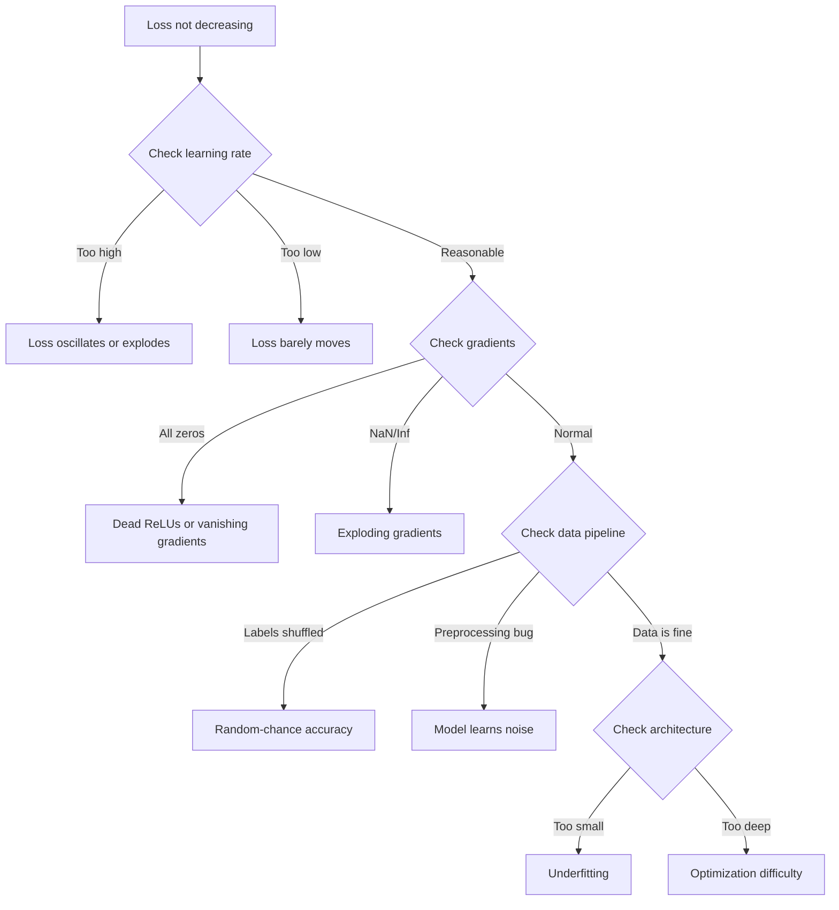
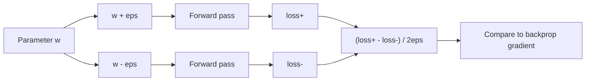
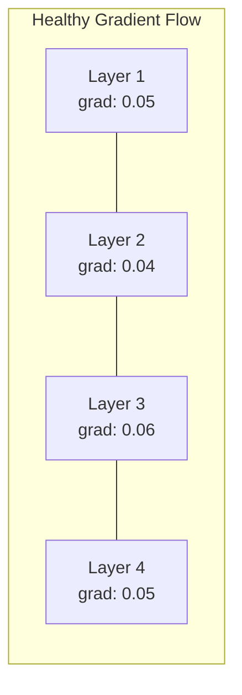
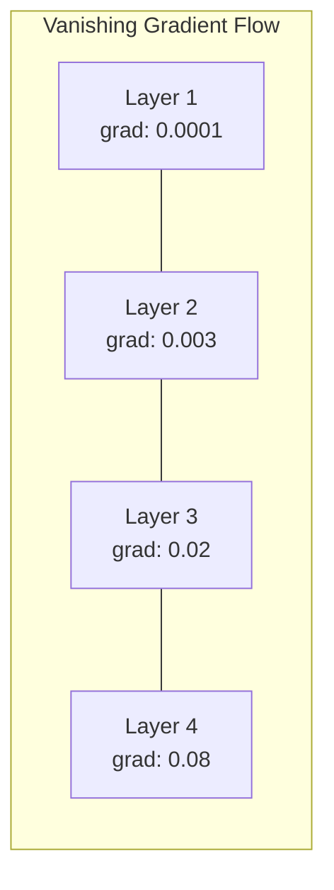
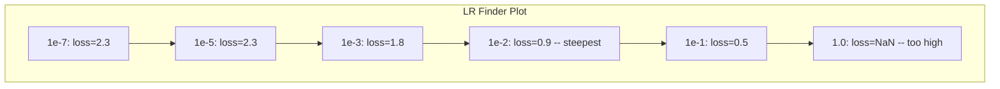

# 调试 Nöral ağlar

> Senin ağın 编译成功了――它运行了――它产生了一个数字――这个数字是错误的,而且什么都没有崩――欢迎来到最难的类型调试:没有错误消息的调试――

**类型：**Yapım
**语言：**Python, PyTorch
**前置要求：**Eğitim 01-10 aşaması, özellikle geri yayılma, kayb fonksiyonları, optimizörler)
**时间：**~ 90 dakika

## Öğrenme hedefi

- Sistematik düzeltme 策略诊断常见 神経ネットワーク故障(NaN kaybı、平坦的損失曲線、overfitting、oscillation)
- 应用 "overfit one batch" 技术,验证模型架构 和训练循环 是否正确
- 检查 Gradient büyüklüğü、Aktıvasyon dağılımı 和 ağırlık normı, kaybolan/fışkıran Gradient  problem
- Bir debugging kontrol listesini oluşturmak, veri borusunu kapsamamak, model mimarisi, Kayıp Fonksiyon, Optimizer ve öğrenme oranı  sorunları

## 问题

传统软件坏掉时会崩──零指标会抛出例外──类型 kusursuzluk 会在编译时间 失败──off-by-one error 会产生明显错误的输出──

Sinir ağları size bu şekilde yardımcı olmaz.

Bir bozuk sinir ağı, bir kaybı değerini yazdırarak, tahminler çıkardı. Kayıplar düşebilir. Tahminler mantıklı görünebilir. Ancak model yanlışlık yapıyor.

Bir çalışılabilir model ile bir bozulmuş model arasında, genellikle sadece bir satır farklılık vardır.`zero_grad()`、转置的尺度、偏差 10x 的学习率──经典的"Neural Networks Training Recipe" (Nörel Ağlar Eğitimi Tarifi) ]]2019)开篇就说:"En yaygın sinir ağ hataları çökmeyen hatalardır".

Bu dersi sana bu böcekleri bulmanı öğretecek.

## 核心概念

### Düşünce Yöntemini Boşaltmak

忘掉打印和喷式调试. Neural Network debugging 需要系统化方法,因为反回路 很慢. 需要几分钟到几小时.

黄金法则:**从简单开始，一次只增加一个复杂度，并独立验证每一部分。**



### Simptom 1: Kayıp 不下降

Bu en yaygın şikâyet. Epoxlar sürekli ilerlerken, kayıplar düz ve şiddetli bir şekilde dalgalanır.

**错误的 learning rate。**太高:損失振動或跳到NaN──太低:損失下降得非常慢,看起来像是平的──对亚当,从1e-3 开始──对SGD,从1e-1 或 1e-2 开始──在决定其他地方有问题之前,始终尝试 3 个相差 10x 的学习率──例如 1e-2、1e-3、1e-4)──

**Dead ReLUs。**Eğer bir ReLU nöronu  çok büyük bir negatif giriş alırsa, 0 çıkardı ve 0 için bir derecede yükseldi. Bu tekrar aktifleşmez. Eğer yeterince nöron ölürse, ağ çalışamaz.

**Vanishing gradients。**Sigmoid veya tanh etkinliklerinin derin ağlarında, Gradientler geriye doğru yayıldığında, ilk katılara ulaştığında, neredeyse ~0〜 ön birkaç katı çalışmayı durdurur.

**Exploding gradients。**相反問題:Gradients 指数级增长──常见于RNNs 和非常深的网络──Loss 跳到NaN──修复方法:gradient clipping(`torch.nn.utils.clip_grad_norm_`)、 öğrenme oranını düşürmek, veya normalleşmeyi artırmak

### Simptom 2: Kayıp aşağı ama model çok kötü

Kayıp aşağı düştü. Eğitim doğruluğu %99'a ulaştı. Ama test doğruluğu %55'dir.

**Overfitting。**Model 记住了训练数据,而不是学习模式──训练损失与验证损失之间的差 会随时间变大──修复方法:更多数据、减肥、减肥、早期停止、数据增长──

**Data leakage。**Test verileri 漏漏进了训练──精度 高得可疑──常见原因:split 之前 shuffle、使用完整数据集的统计做做预处理、不同分区间存在重复样品──修复方法:先分区,再预处理,检查重复点──

**Label errors。**Büyük çoğunluk gerçek veri kümeleri arasında % 5-10'luk etiketler var. Yapılır. Northcutt et al., 2021 -- "Test kümelerindeki yaygın etiket hataları")

### Simptom 3: Kayıplar arasında N veya Inf oluşuyor

Kayıp değeri 變 `nan`Ya da`inf`❖ Eğitim 已失败──

**Learning rate 太高。**Gradient güncellemeler 跨得太远, ağırlıkların patlamasına neden olur.

**log(0) 或 log(negative)。**Çaplak entropik kaybı 会计算 `log(p)`Eğer modeliniz doğru 0 veya negatif olasılığı çıkarsa, log patlayacak.`[eps, 1-eps]`, içinden `eps=1e-7`- Evet.

**除以零。**Satır normallaştırma 会除以標準偏移──常数値の組 有 std=0──修复方法:在分母中添加 epsilon(PyTorch 默认会这样做,但定制实现可能不会)

**Numerical overflow。**Büyük aktivasyonlar 输入 `exp()`Bu sorunun ortaya çıkması özellikle kolay olacaktır.

### Teknik 1: Gradyent Kontrolü

Analiz gradientlerinizi (backprop) ve sayısal gradientleri (finite farklardan) karşılaştırın. Eğer uyumlu değillerse, geriye geçişlerin bir hata olduğunu gösterin.

参数 `w`Bu sayısal gradient:

```
grad_numerical = (loss(w + eps) - loss(w - eps)) / (2 * eps)
```

致性指标 (Relative difference):

```
rel_diff = |grad_analytical - grad_numerical| / max(|grad_analytical|, |grad_numerical|, 1e-8)
```

Eğer `rel_diff < 1e-5`Doğru.`rel_diff > 1e-3`Neredeyse kesinlikle bir böcek var.



### Teknik 2:Aktifleştirme istatistikleri

Eğitim sırasında                                                                                                                                                                                                                                                                                                                                                                                                                                                                                                                          

| Health indicator | Mean | Std | Diagnosis |
|-----------------|------|-----|-----------|
| Healthy | ~0 | ~1 | Network 正常学习 |
| Saturated | >>0 or <<0 | ~0 | Activations 卡在极端值 |
| Dead | 0 | 0 | Neurons 已经 dead（全为零） |
| Exploding | >>10 | >>10 | Activations 无界增长 |

### Teknik 3: Gradyent 流可视化

図面 図面 図面 図面 図面 図面 図面 図面 図面 図面 図面 図面 図面 図面 図面 図面 図面 図面 図面 図面 図面 図面 図面 図面 図面 図面 図面 図面 図面 図面 図面 図面 図面 図面 図面 図面 図面 図面 図面 図面 図面 図面 図面 図面 図面 図面 図面 図面 図面 図面 図面 図面 図面 図面 図面 図面 図面 図面 図面 図面 図面 図面 図面 図面 図面 図面 図面 図面 図面 図面 図面 図面 図面 図面 図面 図面 図面 図面 図面 図面 図面 図面 図面 図面 図面 図面 図面 図面 図面 図 図面 図面 図 図 図 図 図 図 図 図 図 図 図 図 図 図 図 図 図 図 図 図 図 図 図 図 図 図 図 図 図 図 図 図 図 図 図 図 図 図 図 図 図 図 図 図 図 図 図 図 図 図 図 図 図 図 図 図 図 図 図 図 図 図 図 図 図 図 図 図 図 図 図 図 図 図 図 図 図 図 図 図 図 図 図 図 図 図 図 図 図 図 図 図 図 図 図 図 図 図 図 図 図 図 図 図 図 図 図 図 図 図 図 図 図 図 図 図 図 





### Teknik 4: Bir Satır Üstü Uygulama

Bu derin öğrenme en önemli tek debugging teknolojisi.

取一个小批(8-32 个样本) ――在它上面训练100+代谢――损失 应该接近零,训练精度 应该达到100%──如果没有,说明你的模型或训练循环有根本性 bug,不要继续进行完整训练──

Bu test yakalayabilir:
- 损坏s Kayıp Fonksiyonları
- 损坏'ın geriye geçişleri
- Yapısal 太小,不能表示数据
- Optimizer  hiçbir bağlantı modeli parametreleri
- Veriler ve etiketler

Sadece 30 saniye sürer ama tüm eğitim sürümlerinin tam olarak çözülmesini tasarruf eder.

### Teknik 5:Öğrenme oranı arayan

Leslie Smith(2017) bir dönem içinde, öğrenme oranını çok küçükden çok büyüke kadar tarama göre göre, aynı zamanda kayıpları kaydetmek için, kayıpları kayıplara karşı öğrenme oranını çizmek için, bir dönem içinde, en iyi öğrenme oranını ortaya koydu.



Bu örnekten en iyi LR:~1e-3 ((En derin nokta 之前一个数量级) 。

### 常见 PyTorch Böcekleri

Bunlar PyTorch topluluğundaki en fazla zaman kaybı olan böcekler:

| Bug | Symptom | Fix |
|-----|---------|-----|
| 忘记 `optimizer.zero_grad()` | Gradients 在 batches 之间累积，loss oscillates | 在 `loss.backward()` 之前添加 `optimizer.zero_grad()` |
| test time 忘记 `model.eval()` | Dropout 和 batch norm 行为不同，test accuracy 在不同 runs 之间变化 | 添加 `model.eval()` 和 `torch.no_grad()` |
| 错误的 tensor shapes | Silent broadcasting 产生错误结果，没有报错 | debugging 期间在每个 operation 后打印 shapes |
| CPU/GPU mismatch | `RuntimeError: expected CUDA tensor` | 对 model 和 data 都使用 `.to(device)` |
| 没有 detach tensors | Computation graph 不断增长，OOM | 使用 `.detach()` 或 `with torch.no_grad()` |
| In-place operations 破坏 autograd | `RuntimeError: modified by in-place operation` | 将 `x += 1` 替换为 `x = x + 1` |
| Data 未 normalized | Loss 卡在 random-chance 水平 | 将 inputs normalize 到 mean=0, std=1 |
| Labels dtype 错误 | Cross-entropy 期望 `Long`，却得到 `Float` | 转换 labels：`labels.long()` |

### Ana Çözme Masası

| Symptom | Likely cause | First thing to try |
|---------|-------------|-------------------|
| Loss 卡在 -log(1/num_classes) | Model 正在预测 uniform distribution | 检查 data pipeline，验证 labels 匹配 inputs |
| 几步后 Loss NaN | Learning rate 太高 | 将 LR 降低 10x |
| Loss 立即 NaN | log(0) 或除以零 | 在 log/division operations 中添加 epsilon |
| Loss 剧烈 oscillating | LR 太高或 batch size 太小 | 降低 LR，增大 batch size |
| Loss 下降后 plateau | LR 对 fine-tuning phase 来说太高 | 添加 LR schedule（cosine 或 step decay） |
| Training acc 高，test acc 低 | Overfitting | 添加 dropout、weight decay、更多数据 |
| Training acc = test acc = chance | Model 没有学到任何东西 | 运行 overfit-one-batch test |
| Training acc = test acc 但都很低 | Underfitting | 更大的 model、更多 layers、更多 features |
| Gradients 全为零 | Dead ReLUs 或 detached computation graph | 切换到 LeakyReLU，检查 `.requires_grad` |
| Training 期间 out of memory | Batch 太大或 graph 未释放 | 降低 batch size，在 eval 使用 `torch.no_grad()` |


```figure
learning-curves
```

## Yapın onu.

Bir teşhis aracı, etkinlikleri, gradientleri ve kayıp eğrilerini izlemek için kullanılır.

### 步骤1: Ağ Debugger Sınıfı

PyTorch modeline bağlayın, her katın aktivasyonu ve gradient istatistiklerini kaydetin.

```python
import torch
import torch.nn as nn
import math


class NetworkDebugger:
    def __init__(self, model):
        self.model = model
        self.activation_stats = {}
        self.gradient_stats = {}
        self.loss_history = []
        self.lr_losses = []
        self.hooks = []
        self._register_hooks()

    def _register_hooks(self):
        for name, module in self.model.named_modules():
            if isinstance(module, (nn.Linear, nn.Conv2d, nn.ReLU, nn.LeakyReLU)):
                hook = module.register_forward_hook(self._make_activation_hook(name))
                self.hooks.append(hook)
                hook = module.register_full_backward_hook(self._make_gradient_hook(name))
                self.hooks.append(hook)

    def _make_activation_hook(self, name):
        def hook(module, input, output):
            with torch.no_grad():
                out = output.detach().float()
                self.activation_stats[name] = {
                    "mean": out.mean().item(),
                    "std": out.std().item(),
                    "fraction_zero": (out == 0).float().mean().item(),
                    "min": out.min().item(),
                    "max": out.max().item(),
                }
        return hook

    def _make_gradient_hook(self, name):
        def hook(module, grad_input, grad_output):
            if grad_output[0] is not None:
                with torch.no_grad():
                    grad = grad_output[0].detach().float()
                    self.gradient_stats[name] = {
                        "mean": grad.mean().item(),
                        "std": grad.std().item(),
                        "abs_mean": grad.abs().mean().item(),
                        "max": grad.abs().max().item(),
                    }
        return hook

    def record_loss(self, loss_value):
        self.loss_history.append(loss_value)

    def check_loss_health(self):
        if len(self.loss_history) < 2:
            return "NOT_ENOUGH_DATA"
        recent = self.loss_history[-10:]
        if any(math.isnan(v) or math.isinf(v) for v in recent):
            return "NAN_OR_INF"
        if len(self.loss_history) >= 20:
            first_half = sum(self.loss_history[:10]) / 10
            second_half = sum(self.loss_history[-10:]) / 10
            if second_half >= first_half * 0.99:
                return "NOT_DECREASING"
        if len(recent) >= 5:
            diffs = [recent[i+1] - recent[i] for i in range(len(recent)-1)]
            if max(diffs) - min(diffs) > 2 * abs(sum(diffs) / len(diffs)):
                return "OSCILLATING"
        return "HEALTHY"

    def check_activations(self):
        issues = []
        for name, stats in self.activation_stats.items():
            if stats["fraction_zero"] > 0.5:
                issues.append(f"DEAD_NEURONS: {name} has {stats['fraction_zero']:.0%} zero activations")
            if abs(stats["mean"]) > 10:
                issues.append(f"EXPLODING_ACTIVATIONS: {name} mean={stats['mean']:.2f}")
            if stats["std"] < 1e-6:
                issues.append(f"COLLAPSED_ACTIVATIONS: {name} std={stats['std']:.2e}")
        return issues if issues else ["HEALTHY"]

    def check_gradients(self):
        issues = []
        grad_magnitudes = []
        for name, stats in self.gradient_stats.items():
            grad_magnitudes.append((name, stats["abs_mean"]))
            if stats["abs_mean"] < 1e-7:
                issues.append(f"VANISHING_GRADIENT: {name} abs_mean={stats['abs_mean']:.2e}")
            if stats["abs_mean"] > 100:
                issues.append(f"EXPLODING_GRADIENT: {name} abs_mean={stats['abs_mean']:.2e}")
        if len(grad_magnitudes) >= 2:
            first_mag = grad_magnitudes[0][1]
            last_mag = grad_magnitudes[-1][1]
            if last_mag > 0 and first_mag / last_mag > 100:
                issues.append(f"GRADIENT_RATIO: first/last = {first_mag/last_mag:.0f}x (vanishing)")
        return issues if issues else ["HEALTHY"]

    def print_report(self):
        print("\n=== NETWORK DEBUGGER REPORT ===")
        print(f"\nLoss health: {self.check_loss_health()}")
        if self.loss_history:
            print(f"  Last 5 losses: {[f'{v:.4f}' for v in self.loss_history[-5:]]}")
        print("\nActivation diagnostics:")
        for item in self.check_activations():
            print(f"  {item}")
        print("\nGradient diagnostics:")
        for item in self.check_gradients():
            print(f"  {item}")
        print("\nPer-layer activation stats:")
        for name, stats in self.activation_stats.items():
            print(f"  {name}: mean={stats['mean']:.4f} std={stats['std']:.4f} zero={stats['fraction_zero']:.1%}")
        print("\nPer-layer gradient stats:")
        for name, stats in self.gradient_stats.items():
            print(f"  {name}: abs_mean={stats['abs_mean']:.2e} max={stats['max']:.2e}")

    def remove_hooks(self):
        for hook in self.hooks:
            hook.remove()
        self.hooks.clear()
```

### 步骤 2: Bir Satırlık Uygulama

```python
def overfit_one_batch(model, x_batch, y_batch, criterion, lr=0.01, steps=200):
    optimizer = torch.optim.Adam(model.parameters(), lr=lr)
    model.train()
    print("\n=== OVERFIT ONE BATCH TEST ===")
    print(f"Batch size: {x_batch.shape[0]}, Steps: {steps}")

    for step in range(steps):
        optimizer.zero_grad()
        output = model(x_batch)
        loss = criterion(output, y_batch)
        loss.backward()
        optimizer.step()

        if step % 50 == 0 or step == steps - 1:
            with torch.no_grad():
                preds = (output > 0).float() if output.shape[-1] == 1 else output.argmax(dim=1)
                targets = y_batch if y_batch.dim() == 1 else y_batch.squeeze()
                acc = (preds.squeeze() == targets).float().mean().item()
            print(f"  Step {step:3d} | Loss: {loss.item():.6f} | Accuracy: {acc:.1%}")

    final_loss = loss.item()
    if final_loss > 0.1:
        print(f"\n  FAIL: Loss did not converge ({final_loss:.4f}). Model or training loop is broken.")
        return False
    print(f"\n  PASS: Loss converged to {final_loss:.6f}")
    return True
```

### 步骤 3: Öğrenme oranı arayan

```python
def find_learning_rate(model, x_data, y_data, criterion, start_lr=1e-7, end_lr=10, steps=100):
    import copy
    original_state = copy.deepcopy(model.state_dict())
    optimizer = torch.optim.SGD(model.parameters(), lr=start_lr)
    lr_mult = (end_lr / start_lr) ** (1 / steps)

    model.train()
    results = []
    best_loss = float("inf")
    current_lr = start_lr

    print("\n=== LEARNING RATE FINDER ===")

    for step in range(steps):
        optimizer.zero_grad()
        output = model(x_data)
        loss = criterion(output, y_data)

        if math.isnan(loss.item()) or loss.item() > best_loss * 10:
            break

        best_loss = min(best_loss, loss.item())
        results.append((current_lr, loss.item()))

        loss.backward()
        optimizer.step()

        current_lr *= lr_mult
        for param_group in optimizer.param_groups:
            param_group["lr"] = current_lr

    model.load_state_dict(original_state)

    if len(results) < 10:
        print("  Could not complete LR sweep -- loss diverged too quickly")
        return results

    min_loss_idx = min(range(len(results)), key=lambda i: results[i][1])
    suggested_lr = results[max(0, min_loss_idx - 10)][0]

    print(f"  Swept {len(results)} steps from {start_lr:.0e} to {results[-1][0]:.0e}")
    print(f"  Minimum loss {results[min_loss_idx][1]:.4f} at lr={results[min_loss_idx][0]:.2e}")
    print(f"  Suggested learning rate: {suggested_lr:.2e}")

    return results
```

### 步骤 4: Gradient Checker

```python
def _flat_to_multi_index(flat_idx, shape):
    multi_idx = []
    remaining = flat_idx
    for dim in reversed(shape):
        multi_idx.insert(0, remaining % dim)
        remaining //= dim
    return tuple(multi_idx)


def gradient_check(model, x, y, criterion, eps=1e-4):
    model.train()
    x_double = x.double()
    y_double = y.double()
    model_double = model.double()

    print("\n=== GRADIENT CHECK ===")
    overall_max_diff = 0
    checked = 0

    for name, param in model_double.named_parameters():
        if not param.requires_grad:
            continue

        layer_max_diff = 0

        model_double.zero_grad()
        output = model_double(x_double)
        loss = criterion(output, y_double)
        loss.backward()
        analytical_grad = param.grad.clone()

        num_checks = min(5, param.numel())
        for i in range(num_checks):
            idx = _flat_to_multi_index(i, param.shape)
            original = param.data[idx].item()

            param.data[idx] = original + eps
            with torch.no_grad():
                loss_plus = criterion(model_double(x_double), y_double).item()

            param.data[idx] = original - eps
            with torch.no_grad():
                loss_minus = criterion(model_double(x_double), y_double).item()

            param.data[idx] = original

            numerical = (loss_plus - loss_minus) / (2 * eps)
            analytical = analytical_grad[idx].item()

            denom = max(abs(numerical), abs(analytical), 1e-8)
            rel_diff = abs(numerical - analytical) / denom

            layer_max_diff = max(layer_max_diff, rel_diff)
            checked += 1

        overall_max_diff = max(overall_max_diff, layer_max_diff)
        status = "OK" if layer_max_diff < 1e-5 else "MISMATCH"
        print(f"  {name}: max_rel_diff={layer_max_diff:.2e} [{status}]")

    model.float()

    print(f"\n  Checked {checked} parameters")
    if overall_max_diff < 1e-5:
        print("  PASS: Gradients match (rel_diff < 1e-5)")
    elif overall_max_diff < 1e-3:
        print("  WARN: Small differences (1e-5 < rel_diff < 1e-3)")
    else:
        print("  FAIL: Gradient mismatch detected (rel_diff > 1e-3)")
    return overall_max_diff
```

### Adım 5: Kötü ağlar

Şimdi bu araç paketleri kırık ağlara uygulayacağız.

```python
def demo_broken_networks():
    torch.manual_seed(42)
    x = torch.randn(64, 10)
    y = (x[:, 0] > 0).long()

    print("\n" + "=" * 60)
    print("BUG 1: Learning rate too high (lr=10)")
    print("=" * 60)
    model1 = nn.Sequential(nn.Linear(10, 32), nn.ReLU(), nn.Linear(32, 2))
    debugger1 = NetworkDebugger(model1)
    optimizer1 = torch.optim.SGD(model1.parameters(), lr=10.0)
    criterion = nn.CrossEntropyLoss()
    for step in range(20):
        optimizer1.zero_grad()
        out = model1(x)
        loss = criterion(out, y)
        debugger1.record_loss(loss.item())
        loss.backward()
        optimizer1.step()
    debugger1.print_report()
    debugger1.remove_hooks()

    print("\n" + "=" * 60)
    print("BUG 2: Dead ReLUs from bad initialization")
    print("=" * 60)
    model2 = nn.Sequential(nn.Linear(10, 32), nn.ReLU(), nn.Linear(32, 32), nn.ReLU(), nn.Linear(32, 2))
    with torch.no_grad():
        for m in model2.modules():
            if isinstance(m, nn.Linear):
                m.weight.fill_(-1.0)
                m.bias.fill_(-5.0)
    debugger2 = NetworkDebugger(model2)
    optimizer2 = torch.optim.Adam(model2.parameters(), lr=1e-3)
    for step in range(50):
        optimizer2.zero_grad()
        out = model2(x)
        loss = criterion(out, y)
        debugger2.record_loss(loss.item())
        loss.backward()
        optimizer2.step()
    debugger2.print_report()
    debugger2.remove_hooks()

    print("\n" + "=" * 60)
    print("BUG 3: Missing zero_grad (gradients accumulate)")
    print("=" * 60)
    model3 = nn.Sequential(nn.Linear(10, 32), nn.ReLU(), nn.Linear(32, 2))
    debugger3 = NetworkDebugger(model3)
    optimizer3 = torch.optim.SGD(model3.parameters(), lr=0.01)
    for step in range(50):
        out = model3(x)
        loss = criterion(out, y)
        debugger3.record_loss(loss.item())
        loss.backward()
        optimizer3.step()
    debugger3.print_report()
    debugger3.remove_hooks()

    print("\n" + "=" * 60)
    print("HEALTHY NETWORK: Correct setup for comparison")
    print("=" * 60)
    model_good = nn.Sequential(nn.Linear(10, 32), nn.ReLU(), nn.Linear(32, 2))
    debugger_good = NetworkDebugger(model_good)
    optimizer_good = torch.optim.Adam(model_good.parameters(), lr=1e-3)
    for step in range(50):
        optimizer_good.zero_grad()
        out = model_good(x)
        loss = criterion(out, y)
        debugger_good.record_loss(loss.item())
        loss.backward()
        optimizer_good.step()
    debugger_good.print_report()
    debugger_good.remove_hooks()

    print("\n" + "=" * 60)
    print("OVERFIT-ONE-BATCH TEST (healthy model)")
    print("=" * 60)
    model_test = nn.Sequential(nn.Linear(10, 32), nn.ReLU(), nn.Linear(32, 2))
    overfit_one_batch(model_test, x[:8], y[:8], criterion)

    print("\n" + "=" * 60)
    print("LEARNING RATE FINDER")
    print("=" * 60)
    model_lr = nn.Sequential(nn.Linear(10, 32), nn.ReLU(), nn.Linear(32, 2))
    find_learning_rate(model_lr, x, y, criterion)

    print("\n" + "=" * 60)
    print("GRADIENT CHECK")
    print("=" * 60)
    model_grad = nn.Sequential(nn.Linear(10, 8), nn.ReLU(), nn.Linear(8, 2))
    gradient_check(model_grad, x[:4], y[:4], criterion)
```

## Kullan

### PyTorch İçine Ekli Aletler

```python
import torch
import torch.nn as nn

model = nn.Sequential(
    nn.Linear(768, 256),
    nn.ReLU(),
    nn.Linear(256, 10),
)

with torch.autograd.detect_anomaly():
    output = model(input_tensor)
    loss = criterion(output, target)
    loss.backward()

for name, param in model.named_parameters():
    if param.grad is not None:
        print(f"{name}: grad_mean={param.grad.abs().mean():.2e}")
```

### Ağırlık ve Tarafsızlık 集成

```python
import wandb

wandb.init(project="debug-training")

for epoch in range(100):
    loss = train_one_epoch()
    wandb.log({
        "loss": loss,
        "lr": optimizer.param_groups[0]["lr"],
        "grad_norm": torch.nn.utils.clip_grad_norm_(model.parameters(), float("inf")),
    })

    for name, param in model.named_parameters():
        if param.grad is not None:
            wandb.log({f"grad/{name}": wandb.Histogram(param.grad.cpu().numpy())})
```

### TensorBoard

```python
from torch.utils.tensorboard import SummaryWriter

writer = SummaryWriter("runs/debug_experiment")

for epoch in range(100):
    loss = train_one_epoch()
    writer.add_scalar("Loss/train", loss, epoch)

    for name, param in model.named_parameters():
        writer.add_histogram(f"weights/{name}", param, epoch)
        if param.grad is not None:
            writer.add_histogram(f"gradients/{name}", param.grad, epoch)
```

### Debug Checklist (Doğru Düzenleme)

1. 运行 运行 运行 运行 运行 运行 运行 运行 运行 运行 运行 运行 运行 运行 运行 运行 运行 运行 运行 运行 运行 运行 运行 运行 运行 运行 运行 运行 运行 运行 运行 运行 运行 运行 运行 运行 运行 运行 运行 运行 运行 运行 运行 运行 运行 运行 运行 运行 运行 运行 运行 运行 运行 运行 运行 运行 运行 运行 运行 运行 运行 运行 运行 运行 运行 运行 运行 运行 运行 运行 运行 运行 运行 运行 运行 运行 运行 运行 运行 运行 运行 运行 运行 运行 运行 运行 运行 运行 运行 运行 运行 运行 运行 运行 运行 运行 运行 运行 运行 运行 运行 运行 运行 运行 运行 运行 运行 运行 运行 运行 运行 运行 运行 运行 运行 运行 运行 运行 运行 运行 运行 运行 运行 运行 运行 运行 运行 运行 运行 运行 运行 运行 运行 运行 运行 运行 运行 运行 运行 运行 运行 运行 运行 运行 运行 运行 运行 运行 运行 运行 运行 运行 运行 运行 运行 运行 运行 运行 运行 运行 运运行 运行 运行 运行 运行 运行 运行 运行 运行 运
2. 打印 model özet,验证 parametreler sayısı 合理。
3. Randeom verileri kullanın. Bir kez ileriye geçin, çıkış şeklini kontrol edin.
4. 5 dönem, test kaybı, aşağı aşağı.
5. 检查激活统计: ölü katman yok, patlama yok.
6. 检查梯流: yok olmayacak, patlamayacak.
7. 验证 veri boru: 5 个随机样本 及其标签印印――

## - Söyle.

Bu ders:
- `outputs/prompt-nn-debugger.md`-- Neural Network eğitim başarısızlıklarını teşhis etmek için kullanılır .
- `outputs/skill-debug-checklist.md`-- eğitim sorunlarını düzeltmek için kullanılır karar ağacı kontrol listesi

debugging 的关键 dağıtım kalıpları:
- Üretim eğitim senaryolarına 添加 監視 hooks
- Her N adım , etkinleştirme ve gradient istatistikleri W & B veya TensorBoard ' a kaydedilecek .
- Ölü nöron kaybı için %80 sıfır veya gradient patlaması otomatik uyarı gerçekleştirmek
- Her zaman mimarlık veya veri boru hattı değiştirirken,

## 练习

1. **添加 exploding gradient detector。**修改 `NetworkDebugger`, Gradientleri sınırı aşan zaman denetlemesini sağlar ve otomatik olarak gradient kesim değerini öneriyor.

2. **构建 dead neuron resurrector。**编写一个函数,识别死 ReLU ニューロン(始终输出 0),并使用Kaiming initialization 重新初始化它们的进来的重量──展示这能恢复一个>70% ニューロン都死的网络──

3. **实现带 plotting 的 learning rate finder。**扩展 `find_learning_rate`, sonuçları CSV için kaydetir, bir tek script yaz CSV okuyucu, matplotlib kullanmak LR vs kayb eğri göstermek için CIFAR-10'ı ResNet-18'in en iyi LR'sını tanımlamak için kullanmak için kullanır.

4. **创建 data pipeline validator。**编写一个函数,检查:train/test split 之间重复样品、标签分布不平衡(>10:1 oranı)、输入正常化(mean 接近 0,std 接近 1),以及 data 中的 NaN/Inf değerleri──在一个故意腐败的数据集上运行它──

5. **Debug 一个真实 failure。**Uygulamada, bir ince hata yerleştirmek için kullanılır. Örneğin, geriye doğru, ağırlık matrisi çevrilir.

## 关键术语

| Term | What people say | What it actually means |
|------|----------------|----------------------|
| Silent bug | "它能运行，但结果很差" | 不产生错误但降低 model quality 的 bug，是 ML 中占主导的 failure mode |
| Dead ReLU | "neurons 死了" | 输入始终为负的 ReLU neuron，因此它输出 0，并永久接收 0 Gradient |
| Vanishing gradients | "Early layers 停止学习" | Gradients 在 layers 中指数级缩小，使 early layers 的 weights 实际上被冻结 |
| Exploding gradients | "Loss 变成了 NaN" | Gradients 在 layers 中指数级增长，导致 weight updates 大到 overflow |
| Gradient checking | "验证 backprop 是否正确" | 将 backprop 得到的 analytical gradients 与 finite differences 得到的 numerical gradients 比较 |
| Overfit-one-batch | "最重要的 debug test" | 在单个小 batch 上训练，以验证 model 是否能学习；如果不能，说明存在根本性问题 |
| LR finder | "Sweep 以找到正确的 learning rate" | 在一个 epoch 内指数级增大 learning rate，并选择 loss diverge 前的 rate |
| Data leakage | "Test data 泄漏进 training" | test set 的信息污染了 training，产生人为偏高的 accuracy |
| Activation statistics | "监控 layer health" | 跟踪每层 output 的 mean、std 和 zero-fraction，以检测 dead、saturated 或 exploding neurons |
| Gradient clipping | "限制 Gradient magnitude" | 当 Gradients 的 norm 超过 threshold 时将其缩小，防止 exploding gradient updates |

## 延伸阅读

- Smith, "Trenin Neural Ağları İçin Siklik Öğrenme Sınıfları" (2017) -- 提出 learning rate range test (LR finder) 的论文
- Northcutt et al., "Test Setlerinde Etkili Etiket Hataları Makineler Öğrenimi Benchmarks'i Durdurabilirleştirir" (2021) -- 証明ImageNet、CIFAR-10 和其他主要ベンchmarks中有3-6% 的标签是错误的
- Zhang et al., "Deep Learning Understanding Re-Thinking Generalization" (2017) -- This article demonstrates Neural Networks can remember random labels, this is also overfit-one-batch test 有效的原因
- PyTorch Dokümanları 中关于 `torch.autograd.detect_anomaly`和 `torch.autograd.set_detect_anomaly`Bu arada, bu durumun da bir sonucu oldu.
