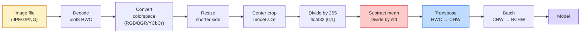
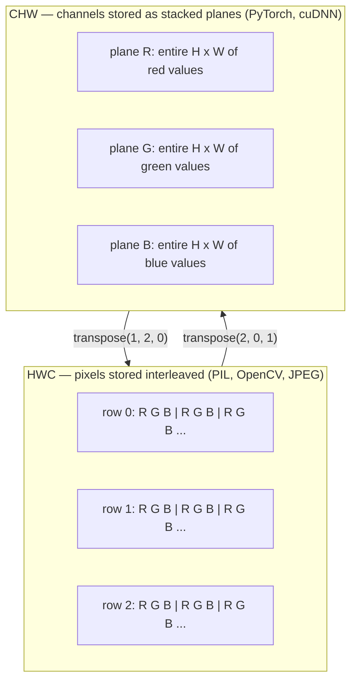

# 图像基础  Pixel、Channel、Renk Alanları

> Resimler ışık alıcı bir Tensor. Sonrasında kullanacağın her görüntü modeli, bu gerçeğe dayanarak başlıyor.

**类型：**Yapım
**语言：**Python
**前置要求：**1. Fase 12. Ders (Tensor Operasyonları), 3. Fase 11. Ders (Intro to PyTorch)
**时间：**45 dakika kadar .

## Öğrenme hedefi

-                                                                                                                                                                                                                                                                                                                                                                                                                                                                                                                              
- Resimleri NumPy dizisi olarak 读取、切片和检查,并熟练在HWC与CHW布局之间切换
- RGB, gri ölçek, HSV ve YCbCr arasında dönüşüm, her renk alanının varlığının nedenini açıklar.
- 严格按照火视的预期应用 Pixel 级预处理(normalize、standardize、size、channel-first)

## 问题

Her bir yazıyı okuyacaksın, her bir ağırlığı indireceksin, her bir vizyon API'ni ayarlayacaksın, her bir giriş belirli bir kodlama ile yapılmış olacak.`uint8`图像传给期望 `float32`Model, hala çalışır ve   anlamsız sonuçlar üretir. RGB üzerinde eğitimli bir ağ için BGR 'yi kullanırken, doğruluk yüzde on puan düşer. Model, ilk olarak kanal beklerken, son girişini yaparken, ilk konv katmanı yükseklik özellikli bir kanal olarak görür. Bunlar hata çıkarmaz.

Bir kere konvulsiyonun üzerinde kaydırıldığını bildiğinizde, kendisi karmaşık değildir. Zorluk şu ki, 一张图像对摄像机,JPEG dekoder,PIL,OpenCV,torchvision 和 CUDA kernel 来说含义不同──每个堆都有自己的轴序、字节范围和频道公约──无法把这些理念放在视觉工程师会交交付坏掉的管道──

Bu ders, bu aşamada yapılacak olanları düzeltir. Sonunda, Pixel nedir, her Pixel'in bir değil üç sayı neden olduğunu, ImageNet'in istatistikleriyle normalleştirilmesini ve bu aşamada diğer her bölümde nasıl kullanılacağını anlayacaksınız.

## 概念

### 完整预处理 boru hattı 一览

Her üretim düzeyinde görme sistemi aynı ters dönüşümler yapmaktadır.



红色和蓝色两个框是80% 静默失败发生的地方:缺少标准化,以及布局 错误──

### Pixel bir örnek, tam bir şekil değil.

Kamera sensörü, küçük bir dedektörün 网格 üzerindeki fotonların sayılarını hesaplar. Her dedektör bir süre içinde bir ışık ayırır ve çarpışan foton sayısına oranlı bir gerilim çıkarır.

```
Continuous scene                 Sensor grid                     Digital image
(infinite detail)                (H x W detectors)               (H x W integers)

    ~~~~~                        +--+--+--+--+--+                 210 198 180 155 120
   # # # # # # # # # # # # # # # # # # # # # # # # # # # # # # # # # # # # # # # # # # # # # # # # # # # # # # # # # # # # # # # # # # # # # # # # # # # # # # # # # # # # # # # # # # # # # # # # # # # # # # # # # # # # # # # # # # # # # # # # # # # # # # # # # # # # # # # # # # # # # # # # # # # # # # # # # # # # # # # # # # # # # # # # # # # # # # # # # # # # # # # # # # # # # # # # # # # # # # # # # # # # # # # # # # # # # # # # # # # # # # # # # # # # # # # # # # # # # # # # # # # # # # # # # # # # # # # # # # # # # # # # # # # # # # # # # # # # # # # # # # # # # # # # # # # # # # # # # # # # # # # # # # # # # # # # # # # # # # # # # # # # # # # # # # # # # # # # # # # # # # # # # # # # # # # # # # # # # # # # # # # # # # # # # # # # # # # # # # # # # # # # # # # # # # # # # # # # # # # # # # # # # # # # # # # # # # # # # # # # # # # # # # # # # # # # # # # # # # # # # # # # # # # # # # # # # # # # # # # # # # # # # # # # # # # # # # # # # # # # # # # # # # # # # # # # # # # # # # # # # # # # # # # # # #
  - ...> +--+--+--+--+--+----> 200 190 175 150 115
   ~~~~~                         |  |  |  |  |  |                 195 185 170 148 112
                                 +--+--+--+--+--+                 188 180 165 145 108
```

Bu adım iki seçeneğe yol açar ve tüm görevlerin sınırlarını belirler:

- **Spatial sampling**Bu durumun bir sonraki döneminde, bir süre sonra, bir süre sonra, bir süre sonra, bir süre sonra, bir süre sonra, bir süre sonra, bir süre sonra, bir süre sonra, bir süre sonra, bir süre sonra, bir süre sonra, bir süre sonra, bir süre sonra, bir süre sonra, bir süre sonra, bir süre sonra, bir süre sonra, bir süre sonra, bir süre sonra, bir süre sonra, bir süre sonra, bir süre sonra, bir süre sonra, bir süre sonra, bir süre sonra, bir süre sonra, bir süre sonra, bir süre sonra, bir süre sonra, bir süre sonra, bir süre sonra, bir süre sonra, bir süre sonra, bir süre sonra, bir süre sonra, bir süre sonra, bir süre sonra, bir süre sonra, bir süre sonra, bir süre sonra, bir süre sonra, bir süre sonra, bir süre sonra, bir süre sonra, bir süre sonra, bir süre sonra, bir süre sonra, bir süre sonra, bir süre sonra, bir süre sonra, bir süre sonra, bir süre sonra, bir süre sonra, bir süre sonra, bir süre sonra, bir süre sonra, bir süre sonra, bir süre sonra, bir süre sonra, bir süre sonra, bir süre sonra, bir süre sonra, bir süre sonra, bir süre sonra, bir süre sonra, bir süre sonra, bir süre sonra, bir süre sonra, bir süre sonra, bir süre sonra, bir süre sonra, bir süre sonra, bir süre sonra, bir süre sonra, bir süre sonra, bir süre sonra, bir süre sonra, bir süre sonra, bir süre sonra, bir süre sonra, bir süre sonra, bir süre sonra, bir süre sonra, bir, bir süre sonra, bir süre sonra, bir süre sonra, bir süre sonra, bir, bir süre sonra, bir, bir, bir süre sonra, bir, bir süre sonra, bir, bir süre sonra, bir, bir, bir süre, bir, bir süre, bir, bir, bir süre sonra, bir, bir, bir süre, bir, bir, bir, bir, bir, bir, bir, bir, bir, bir, bir, bir, bir, bir, bir, bir, bir, bir, bir, bir, bir, bir, bir, bir, bir, bir, bir, bir, bir, bir, bir, bir, bir, bir, bir, bir, bir, bir, bir, bir, bir, bir, bir, bir, bir, bir, bir, bir, bir, bir
- **Intensity quantization**Voltjenin 256 seviye sağlanması, görüntüleme standartları, 10、12、16 bit  daha düz bir derece sağlanması, tıbbi görüntüleme、HDR ve ham sensör boru hattı için çok önemlidir.

Pixel değil 带面积的彩色小方块──它是一次单独测量──size或旋转时,你重新采样这个测量网──

### Neden üç kanal var ?

Bir detektör, tüm görülebilir spektrum aralığında olan fotonları, yani gri ölçekleri oluşturur. Renk elde etmek için, sensör, kırmızı, yeşil, mavi filtre mozaikini kullanır.

```
One pixel in memory:

    (R, G, B) = (210, 140, 30)   <- reddish-orange

An H x W RGB image:

    shape (H, W, 3)     stored as   H rows of W pixels of 3 values
                                    each in [0, 255] for uint8
```

Üç değil harika. Dört kamera Z kanalı ekleyecek. Uydu kanalı kızılötesi ve ultraviyole bant ekleyecek. Tıp taraması genellikle bir kanal vardır.

### 两种布局公约:HWC 和 CHW

Aynı Tensor, iki sıralama. Her birimiz bir tanesini seçeceğiz.

```
HWC (height, width, channels)           CHW (channels, height, width)

   W ->                                    H ->
  +-----+-----+-----+                     +-----+-----+
H |R G B|R G B|R G B|                   C |R R R R R R|
| +-----+-----+-----+                   | +-----+-----+
v |R G B|R G B|R G B|                   v |G G G G G G|
  +-----+-----+-----+                     +-----+-----+
                                          |B B B B B B|
                                          +-----+-----+

   PIL, OpenCV, matplotlib,              PyTorch, most deep learning
   almost every image file on disk       frameworks, cuDNN kernels
```

CHW'nin varlığının nedeni, konvulsiyon çekirdeği H ve W 滑动──把 kanal eksisini 前面に置く, yani her çekirdeğin her kanalın üst kat 2 boyutlu düzlemini görebilmesi, böylece temiz bir şekilde vektör 化──disk biçimi 保持 HWC, çünkü bu uyumlu sensör 输出扫描线的方式──

Bu yüzden, bu yüzden, bu yüzden, bu yüzden, bu yüzden, bu yüzden, bu yüzden, bu yüzden, bu yüzden, bu yüzden, bu yüzden, bu yüzden, bu yüzden, bu yüzden, bu yüzden, bu yüzden, bu yüzden, bu yüzden, bu yüzden, bu yüzden, bu yüzden, bu yüzden, bu yüzden, bu yüzden, bu yüzden, bu yüzden, bu yüzden, bu yüzden, bu yüzden, bu yüzden, bu yüzden, bu yüzden, bu yüzden, bu yüzden, bu yüzden, bu yüzden, bu yüzden, bu yüzden, bu yüzden, bu yüzden, bu yüzden, bu yüzden, bu yüzden, bu yüzden, bu yüzden, bu yüzden, bu yüzden, bu yüzden, bu yüzden, bu yüzden, bu yüzden, bu yüzden,

```
img_chw = img_hwc.transpose(2, 0, 1)      # NumPy
img_chw = img_hwc.permute(2, 0, 1)        # PyTorch tensor
```

Hatıra düzenleme 可視化:



### Byte aralığı 和 dtype

Üç adet en sık görülen:

| Convention | dtype | Range | 你会在哪里见到它 |
|------------|-------|-------|------------------|
| Raw | `uint8` | [0, 255] | Disk 上的文件、PIL、OpenCV output |
| Normalized | `float32` | [0.0, 1.0] | `img.astype('float32') / 255` 之后 |
| Standardized | `float32` | 大约 [-2, +2] | 减去 mean 并除以 std 之后 |

Konvülsiyonel ağ standart girişlerde eğitimlidir.`mean=[0.485, 0.456, 0.406]`- Evet.`std=[0.229, 0.224, 0.225]`Bu, tamamlanmış ImageNet eğitim kümesi üzerinde, normalleştirilmiş Pixel  hesaplama elde edilen üç kanalın aritmetik ortalaması 和 standart sapma ≠`uint8`输入 输入 输入 输入 输入 输入 输入 输入 输入 输入 输入 输入 输入 输入 输入 输入 输入 输入 输入 输入 输入 输入 输入 输入 输入 输入 输入 输入 输入 输入 输入 输入 输入 输入 输入 输入 输入 输入 输入 输入 输入 输入 输入 输入 输入 输入 输 输 输 输 输 输 输 输 输 输 输 输 输 输 输 输 输 输 输 输 输 输 输 输 输 输 输 输 输 输 输 输 输 输 输 输 输 输 输 输 输 输 输 输 输 输 输 输 输 输 输 输 输 输 输 输 输 输 输 输 输 输 输 输 输 输 输 输 输 输 输 输 输 输 输 输 输 输 输 输 输 输 输 输 输                                                                                                                                                            

### Renk alanları ve neden var oldukları

RGB bir yakalama biçimidir, ancak bu daima model için en kullanışlı ifade değildir.

```
 RGB               HSV                       YCbCr / YUV

 R red             H hue (angle 0-360)       Y luminance (brightness)
 G green           S saturation (0-1)        Cb chroma blue-yellow
 B blue            V value/brightness (0-1)  Cr chroma red-green

 Linear to         Separates color from      Separates brightness from
 sensor output     brightness. Useful for    color. JPEG and most video
                   color thresholding, UI    codecs compress the chroma
                   sliders, simple filters   channels harder because the
                                             human eye is less sensitive
                                             to chroma detail than to Y.
```

Çoğu modern CNN için RGB'ye girersiniz.

- **HSV** klasik CV kodu、 renklere dayalı segmentasyon、 beyaz dengeleme¬¬¬¬¬¬¬¬¬¬¬¬¬¬¬¬¬¬¬¬¬¬¬¬¬¬¬¬¬¬¬¬¬¬¬¬¬¬¬¬¬¬¬¬¬¬¬¬¬¬¬¬¬¬¬¬¬¬¬¬¬¬¬¬¬¬¬¬¬¬¬¬¬¬¬¬¬¬¬¬¬¬¬¬¬¬¬¬¬¬¬¬¬¬¬¬¬¬¬¬¬¬¬¬¬¬¬¬¬¬¬¬¬¬¬¬¬¬¬¬¬¬¬¬¬¬¬¬¬¬¬¬¬¬¬¬¬¬¬¬¬¬¬¬¬¬¬¬¬¬¬¬¬¬¬¬¬¬¬¬¬¬¬¬¬¬¬¬¬¬¬¬¬¬¬¬¬¬¬¬¬¬¬¬¬¬¬¬¬¬¬¬¬¬¬¬¬¬¬¬¬¬¬¬¬¬¬¬¬¬¬¬¬¬¬¬¬¬¬¬¬¬¬¬¬¬¬¬¬¬¬¬¬¬¬¬¬¬¬¬¬¬¬¬¬¬¬¬¬¬¬¬¬¬¬¬¬¬¬¬¬¬¬¬¬¬¬¬¬¬¬¬¬¬¬¬¬¬
- **YCbCr** 读取JPEG 内部、视频管线、只在Y 上操作的超分辨率模型中──
- **Grayscale** OCR 、dokümant modeli, ve herhangi bir renk sinyal durumunun değil rahatsızlık değişkenidir.

RGB'den 转灰度量, 权和, 平均值 değil, çünkü insan gözü kırmızı veya mavi renklere göre yeşil renklere daha duyarlı:

```
Y = 0.299 R + 0.587 G + 0.114 B       (ITU-R BT.601, the classic weights)
```

### Göreç oranı, boyutlandırma, interpolasyon

Her model sabit giriş boyutuna sahiptir. Çoğu ImageNet sınıflandırıcısı 224x224, modern detektör 常用 384x384 veya 512x512)

- **Resize shorter side, then center crop** 标准 ImageNet tarifi。 aspect ratio'yu korumak, bir kenar piksel bırakmak。
- **Resize and pad** Hâlâ her piksel için bir bakış oranı var.
- **Resize directly to target** 拉伸图像──便宜, will twist geometry, but for many classification task 足够好──

Yeni ağlar eski ağlarla uyumsuz olduğunda, interpolasyon yöntemi, pixeller arasında nasıl hesaplanacağını belirler:

```
Nearest neighbour     fastest, blocky, only choice for masks/labels
Bilinear              fast, smooth, default for most image resizing
Bicubic               slower, sharper on upscaling
Lanczos               slowest, best quality, used for final display
```

経験法则:bilineer kullanın, bicubic veya lanczos kullanın, en yakın sınıf kimliği içeren herhangi bir şey kullanın.


```figure
conv-output-size
```

## Yapın onu.

### 步骤 1: yükleme görüntü ve şekli kontrol

Use Pillow, herhangi bir JPEG veya PNG yükle, NumPy olarak dönüştür, ve elde ettiğin içeriği basın.

```python
import numpy as np
from PIL import Image

def synthetic_rgb(h=128, w=192, seed=0):
    rng = np.random.default_rng(seed)
    yy, xx = np.meshgrid(np.linspace(0, 1, h), np.linspace(0, 1, w), indexing="ij")
    r = (np.sin(xx * 6) * 0.5 + 0.5) * 255
    g = yy * 255
    b = (1 - yy) * xx * 255
    rgb = np.stack([r, g, b], axis=-1) + rng.normal(0, 6, (h, w, 3))
    return np.clip(rgb, 0, 255).astype(np.uint8)

arr = synthetic_rgb()
# 或从 disk 加载：
# arr = np.asarray(Image.open("your_image.jpg").convert("RGB"))

print(f"type:   {type(arr).__name__}")
print(f"dtype:  {arr.dtype}")
print(f"shape:  {arr.shape}     # (H, W, C)")
print(f"min:    {arr.min()}")
print(f"max:    {arr.max()}")
print(f"pixel at (0, 0): {arr[0, 0]}")
```

预期 çıkış:`shape: (H, W, 3)`- Evet.`dtype: uint8`、 aralığı `[0, 255]`❖ Kamera ❖ JPEG dekodöründen veya sentetik jeneratörden gelen baytlar ne olursa olsun, bunlar disk üzerinde kanonik temsillerdir.

### 步骤 2: Çanakları ayırıp yeniden düzenle

R、G、B'den ayrılıp, sonra HWC'den PyTorch kullanan CHW'ye dönüştürülür.

```python
R = arr[:, :, 0]
G = arr[:, :, 1]
B = arr[:, :, 2]
print(f"R shape: {R.shape}, mean: {R.mean():.1f}")
print(f"G shape: {G.shape}, mean: {G.mean():.1f}")
print(f"B shape: {B.shape}, mean: {B.mean():.1f}")

arr_chw = arr.transpose(2, 0, 1)
print(f"\nHWC shape: {arr.shape}")
print(f"CHW shape: {arr_chw.shape}")
```

Üç tane gri ölçekli düzlem, her kanal bir.CHW sadece bir ağırlıklı sekme; hafıza düzenlemesi izin verdiğinde, ciddi olarak, veri kopyası gerekmiyor.

### 步骤 3: Gri ölçek ve HSV dönüşümü

Daha sonra RGB-HSV'yi kullanın.

```python
def rgb_to_grayscale(rgb):
    weights = np.array([0.299, 0.587, 0.114], dtype=np.float32)
    return (rgb.astype(np.float32) @ weights).astype(np.uint8)

def rgb_to_hsv(rgb):
    rgb_f = rgb.astype(np.float32) / 255.0
    r, g, b = rgb_f[..., 0], rgb_f[..., 1], rgb_f[..., 2]
    cmax = np.max(rgb_f, axis=-1)
    cmin = np.min(rgb_f, axis=-1)
    delta = cmax - cmin

    h = np.zeros_like(cmax)
    mask = delta > 0
    rmax = mask & (cmax == r)
    gmax = mask & (cmax == g)
    bmax = mask & (cmax == b)
    h[rmax] = ((g[rmax] - b[rmax]) / delta[rmax]) % 6
    h[gmax] = ((b[gmax] - r[gmax]) / delta[gmax]) + 2
    h[bmax] = ((r[bmax] - g[bmax]) / delta[bmax]) + 4
    h = h * 60.0

    s = np.where(cmax > 0, delta / cmax, 0)
    v = cmax
    return np.stack([h, s, v], axis=-1)

gray = rgb_to_grayscale(arr)
hsv = rgb_to_hsv(arr)
print(f"gray shape: {gray.shape}, range: [{gray.min()}, {gray.max()}]")
print(f"hsv   shape: {hsv.shape}")
print(f"hue range: [{hsv[..., 0].min():.1f}, {hsv[..., 0].max():.1f}] degrees")
print(f"sat range: [{hsv[..., 1].min():.2f}, {hsv[..., 1].max():.2f}]")
print(f"val range: [{hsv[..., 2].min():.2f}, {hsv[..., 2].max():.2f}]")
```

Hue'nin çıkış birimi derece, doymak, değer ve satürülme oranı [0, 1] arasında bulunmaktadır.`hsv_full`Anlaşma 匹配──

### 步骤 4:Normalleştirmek, standartlandırmak ve geri dönüştürmek

Çöm bayttan 转到预训练的 ImageNet model 期望的精确 Tensor,然后再转回来──

```python
mean = np.array([0.485, 0.456, 0.406], dtype=np.float32)
std = np.array([0.229, 0.224, 0.225], dtype=np.float32)

def preprocess_imagenet(rgb_uint8):
    x = rgb_uint8.astype(np.float32) / 255.0
    x = (x - mean) / std
    x = x.transpose(2, 0, 1)
    return x

def deprocess_imagenet(chw_float32):
    x = chw_float32.transpose(1, 2, 0)
    x = x * std + mean
    x = np.clip(x * 255.0, 0, 255).astype(np.uint8)
    return x

x = preprocess_imagenet(arr)
print(f"preprocessed shape: {x.shape}     # (C, H, W)")
print(f"preprocessed dtype: {x.dtype}")
print(f"preprocessed mean per channel:  {x.mean(axis=(1, 2)).round(3)}")
print(f"preprocessed std  per channel:  {x.std(axis=(1, 2)).round(3)}")

roundtrip = deprocess_imagenet(x)
max_diff = np.abs(roundtrip.astype(int) - arr.astype(int)).max()
print(f"roundtrip max pixel diff: {max_diff}    # 应该是 0 或 1")
```

Kanal başına ortalama 应接近0,std 接近1──这个预处理/deprocess pair 正是每个火视觉`transforms.Normalize`Arama yapma altındaki şeyler.

### 步骤 5: üç farklı interpolasyon yöntemi ile boyut değiştirin

En yakınında bulunan, milyarda ve iki küpçe olarak, bu farklılık daha belirgin olacaktır.

```python
target = (arr.shape[0] * 3, arr.shape[1] * 3)

nearest = np.asarray(Image.fromarray(arr).resize(target[::-1], Image.NEAREST))
bilinear = np.asarray(Image.fromarray(arr).resize(target[::-1], Image.BILINEAR))
bicubic = np.asarray(Image.fromarray(arr).resize(target[::-1], Image.BICUBIC))

def local_roughness(x):
    gy = np.diff(x.astype(float), axis=0)
    gx = np.diff(x.astype(float), axis=1)
    return float(np.abs(gy).mean() + np.abs(gx).mean())

for name, out in [("nearest", nearest), ("bilinear", bilinear), ("bicubic", bicubic)]:
    print(f"{name:>8}  shape={out.shape}  roughness={local_roughness(out):6.2f}")
```

En yakın keskinlik 分数最高, çünkü sert kenarını korur. Biliminar 最平滑──Bicubic 介于两者之间, without stair-step artefact in case of retaining sensory sharpness──

## Kullan

`torchvision.transforms`Üstteki tüm içeriği bir yapılandırılabilir boru hattına bağlayacağım.`preprocess_imagenet`Yapma, yapma, yapma, yapma, yapma.

```python
import torch
from torchvision import transforms
from PIL import Image

img = Image.fromarray(synthetic_rgb(256, 256))

pipeline = transforms.Compose([
    transforms.Resize(256),
    transforms.CenterCrop(224),
    transforms.ToTensor(),
    transforms.Normalize(mean=[0.485, 0.456, 0.406], std=[0.229, 0.224, 0.225]),
])

x = pipeline(img)
print(f"tensor type:  {type(x).__name__}")
print(f"tensor dtype: {x.dtype}")
print(f"tensor shape: {tuple(x.shape)}      # (C, H, W)")
print(f"per-channel mean: {x.mean(dim=(1, 2)).tolist()}")
print(f"per-channel std:  {x.std(dim=(1, 2)).tolist()}")

batch = x.unsqueeze(0)
print(f"\nbatched shape: {tuple(batch.shape)}   # (N, C, H, W) — ready for a model")
```

Dört adım, sırası böyle olmalı:`Resize(256)`Daha kısa bir tarafı 256'a küçültün.`CenterCrop(224)`Aralarından bir 224x224 yama al .`ToTensor()`255'den sonra HWC'yi CHW'ye değiştirmek;`Normalize`减去 ImageNet demek并除以 std──颠倒这个顺序会改变到达模型的内容──

## - Söyle.

Bu ders:

- `outputs/prompt-vision-preprocessing-audit.md` Bir hızlı, istedikleri model kartı veya veri kümesi kartı 转变成清单,列出团队必须遵守的精确预处理不变──
- `outputs/skill-image-tensor-inspector.md` Bir beceri, herhangi bir görüntü şeklinde Tensor veya dizi, rapor dtype レイアウト レンジ, ve aynı zamanda çiğ ̆ normal veya standart görünebilir ̆

## 练习

1. **(Easy)**分別用 OpenCV (`cv2.imread`) 和 Yastık 加载一张 JPEG──打印二者的形 和 `(0, 0)`处的Pixel── açıklayın kanal-sıra 差异, sonra bir satır dönüşüm yazın, OpenCV dizisi ile Pillow dizisi 完全一致させてください──
2. **(Medium)**编写 `standardize(img, mean, std)` ve bunun tersine,  make二者能在任意 uint8 image 上通过 `roundtrip_max_diff <= 1`测试── Fonksiyonunuz aynı çağrı ile aynı zamanda HWC'deki tek çan resimlerini ve NCHW'deki partiyi işleyebilmelidir──
3. **(Hard)**3 kanallı ImageNet standartlı Tensor alın, 1x1 konvoy üzerinden geçsin, bu konvoy RGB'yi tek gri ölçekli kanalı'na yüklemeyi öğrenin.`[0.299, 0.587, 0.114]`,结结它们,并验证输出与你的手动 `rgb_to_grayscale`1x1 konvulsiyon olarak yazılabilecek klasik renk- uzay dönüşümleri nelerdir?

## 关键术语

| Term | 人们的说法 | 它实际的意思 |
|------|----------------|----------------------|
| Pixel | “一个彩色方块” | 一个 grid location 上的一次光强采样；color 用三个数字，grayscale 用一个数字 |
| Channel | “颜色” | 堆叠成 image Tensor 的并行 spatial grid 之一；在 HWC 中是最后一个 axis，在 CHW 中是第一个 |
| HWC / CHW | “shape” | image Tensor 的 axis ordering；disk 和 PIL 使用 HWC，PyTorch 和 cuDNN 使用 CHW |
| Normalize | “缩放图像” | 除以 255，让 Pixel 落在 [0, 1] 中；这是必要的，但还不充分 |
| Standardize | “零中心化” | 按 channel 减去 mean 并除以 std，使 input distribution 匹配模型训练时看到的分布 |
| Grayscale conversion | “对 channel 求平均” | 使用系数 0.299/0.587/0.114 的加权和，匹配人类 luminance perception |
| Interpolation | “resize 如何选 Pixel” | 当新 grid 与旧 grid 不对齐时决定 output value 的规则；label 用 nearest，training 用 bilinear，display 用 bicubic |
| Aspect ratio | “宽高比” | 区分“resize and pad”和“resize and stretch”的 ratio |

## 延伸阅读

- [Charles Poynton — A Guided Tour of Color Space](https://poynton.ca/PDFs/Guided_tour.pdf)  Neden bu kadar çok renk alanı var ve her zamanki en önemli, en net teknik açıklama
- [PyTorch Vision Transforms Docs](https://pytorch.org/vision/stable/transforms.html) Siz üretim içinde gerçekleşmek için kompose 
- [How JPEG Works (Colt McAnlis)](https://www.youtube.com/watch?v=F1kYBnY6mwg) Chrome alt örnekleme ̊ DCT ve neden JPEG                                                                                                                                                                                                                                                                                                                                                                                                                                                                                                                
- [ImageNet Preprocessing Conventions (torchvision models)](https://pytorch.org/vision/stable/models.html) `mean=[0.485, 0.456, 0.406]`Her modelin neden beklediği bir hayvanat bahçesi.
