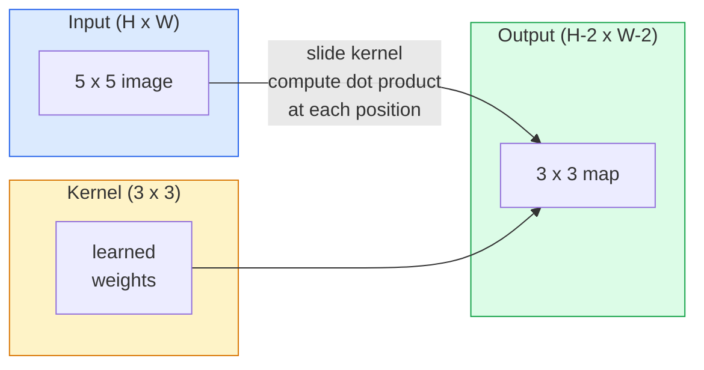
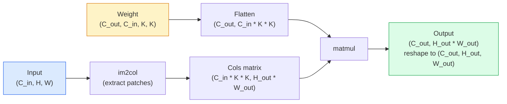

# Baştan Başta Değişiklikler

> Çelişki çok küçük bir yoğun katmandır, onu bir resim üzerinde kaydırır ve her konumda aynı ağırlığı paylaşıyor.

**Type:** Build
**Languages:** Python
**Prerequisites:** Phase 3 (Deep Learning Core), Phase 4 Lesson 01 (Image Fundamentals)
**Time:** ~75 分钟

## Öğrenme hedefi
- Sadece NumPy kullanmak 2D konvulsiyonu, örgü-buçuk  versiyon ve vektörleştirilmiş `im2col`版本
- 针对输入尺寸、kernel尺寸、padding 和 step 的任意组合,计算输出空间尺寸,并解释 `(H - K + 2P) / S + 1`Neden oluştu ?
- Hand工设计 kernels ((ge、blur、sharpen、Sobel), ve neden karşı karşıya aktivasyonlar oluştuğunu açıkladı
- Bir özellik çıkarıcı olarak toplayan kıvrımları toplayıp toplayan derinliği kabul alanının büyüklüğüne bağlayarak

## 问题
Bir 224x224 RGB resimde tamamen bağlantılı bir katman kullanılarak, her nöron 224 * 224 * 3 = 150,528 ıkılık girme ağırlığına ihtiyaç duyar. Sadece 1.000 üniteden oluşan gizli katmanın 1.5 milyar parametri var ve bu da işe yarayacak bir şey öğrenmeden önce gerçekleşir. Daha da kötüsü, bu katman, sol üst köşedeki bir köpek ve sağ alt köşedeki bir köpek hakkında bilmiyor. Bu katman, her bir resim konumunu birbirinden bağımsız bir nesne olarak görüyor, fakat aslında yanlış bir şey: bir kediyi üç resimden uzaklaştırmak, ağı yeniden öğrenmek zorunda bırakmamalıdır.

图像模型 iki niteliği gerektirir:**translation equivariance**(input hareketli,output da hareketli) ve **parameter sharing**(Hem bir özellik detektörü tüm konumlarda çalışır) ―― yoğun katmanlar 两者都不给你──Convolution 两者都天然具备──

Konvülsiyon, derin öğrenme için geliştirilmedi. Ayrıca, JPEG sıkıştırması, Photoshop'taki Gaussian blur, endüstriyel vizyonda kenar algılama ve neredeyse tüm ses filtrelerinin arkasındaki aynı işlemdir. 2012'den 2020'ye kadar ImageNet'in yönlendirmesinin nedeni, konvülsiyonun bu tür verilere uygun bir yöntem olmasıdır.

## 概念
### Bir çekirdek, kaydırılır

2D konvulsiyon, çekirdeğin veya filtre denilen küçük bir ağırlık matrisini alır, içeriye kaydırır ve her konumda her elementin çarpı ve çarpı olarak hesaplanır.



Bir özel 3x3 örneği, 5x5 için giriş, 1 adım:

```
Input X (5 x 5):                Kernel W (3 x 3):

  1  2  0  1  2                   1  0 -1
  0  1  3  1  0                   2  0 -2
  2  1  0  2  1                   1  0 -1
  1  0  2  1  3
  2  1  1  0  1

The kernel slides across every valid 3 x 3 window. Output Y is 3 x 3:

 Y[0,0] = sum( W * X[0:3, 0:3] )
 Y[0,1] = sum( W * X[0:3, 1:4] )
 Y[0,2] = sum( W * X[0:3, 2:5] )
 Y[1,0] = sum( W * X[1:4, 0:3] )
 ... and so on
```

Bu bir formül, yani **shared weights、locality、sliding window**Bu tam bir fikir. Diğer her şey muhasebeciliktir.

### Çıktıran boyut formülü

给定输入空间尺寸 `H`、kernel boyutu `K`、padding `P`İşe çıkma.`S`- ...

```
H_out = floor( (H - K + 2P) / S ) + 1
```

Unutma. Her bir mimarlıkta onu birkaç kez hesaplayacaksın.

| Scenario | H | K | P | S | H_out |
|----------|---|---|---|---|-------|
| Valid conv，无 padding | 32 | 3 | 0 | 1 | 30 |
| Same conv（保持尺寸） | 32 | 3 | 1 | 1 | 32 |
| 按 2 倍 downsample | 32 | 3 | 1 | 2 | 16 |
| Pool 2x2 | 32 | 2 | 0 | 2 | 16 |
| 大 receptive field | 32 | 7 | 3 | 2 | 16 |

"Eşit dolandırma" anlamı, S'de seçilmesini sağlar. S'de seçilirken H_out == H。 K için çicik sayı, yani P = (K - 1) / 2。 bu yüzden 3x3 çekirdekleri  dominant konumdadır: onlar hala merkezi noktayı bulunan en küçük çicik sayı çekirdekleri vardır。

### Çekme

                                                                                                                                                                                                                                                              

```
Zero padding (P = 1) on a 5 x 5 input:

  0  0  0  0  0  0  0
  0  1  2  0  1  2  0
  0  0  1  3  1  0  0
  0  2  1  0  2  1  0       Now the kernel can centre on pixel
  0  1  0  2  1  3  0       (0, 0) and still have three rows and
  0  2  1  1  0  1  0       three columns of values to multiply.
  0  0  0  0  0  0  0
```

实践中会遇到的模式:`zero`(En sık görülen)`reflect`(镜像边缘, generatif modellerde sert sınırları önlemek)`replicate`(Küpleme Kenarında)`circular`(around, в тороидных проблемах 中使用)

### İlerleme

İlerleme, 滑的步长──`stride=1`- Evet.`stride=2`Bu nedenle, CNN'de tek bir birleştirme katmanını kullanmak yerine, bir örnekleme yapmanın klasik yöntemini kullanmak için, uzay boyutunun yarıya düşmesini sağlayacağız.

```
Stride 1 on a 5 x 5 input, 3 x 3 kernel:

  starts: (0,0) (0,1) (0,2)        -> output row 0
          (1,0) (1,1) (1,2)        -> output row 1
          (2,0) (2,1) (2,2)        -> output row 2

  Output: 3 x 3

Stride 2 on the same input:

  starts: (0,0) (0,2)              -> output row 0
          (2,0) (2,2)              -> output row 1

  Output: 2 x 2
```

### Çoklu giriş kanalları

Gerçek görüntü üç kanal var. RGB  RGB  Giriş üzerindeki 3x3 konvulsiyon. Gerçekte bir 3x3x3 vücut: Her giriş kanalı bir 3x3 kesim var. Her boşluk konumunda, üç kesim için çarpma ve aramaya devam edersiniz.

```
Input:   (C_in,  H,  W)        3 x 5 x 5
Kernel:  (C_in,  K,  K)        3 x 3 x 3 (one kernel)
Output:  (1,     H', W')       2D map

For a layer that produces C_out output channels, you stack C_out kernels:

Weight:  (C_out, C_in, K, K)   e.g. 64 x 3 x 3 x 3
Output:  (C_out, H', W')       64 x 3 x 3

Parameter count: C_out * C_in * K * K + C_out   (the + C_out is biases)
```

Son bir satır ise, programlama modelesinde hesaplama içeriği vardır.`64 * 3 * 3 * 3 + 64 = 1,792`个参数―― çok uygun.

### İm2col numarası

Yatağı döngüler  kolay oku, ama çok yavaş. GPU'lar  büyük matris çarpımlarını istiyor.



Her üretim aşamasında bir de bu düşünce ve bir de bu şekilde bir de bu şekilde bir de bu şekilde bir de bu şekilde bir de bu şekilde bir de bu şekilde bir de bu şekilde bir de bu şekilde bir de bu şekilde bir de bu şekilde bir de bu şekilde bir de bu şekilde bir de bu şekilde bir de bu şekilde bir de bu şekilde bir de bu şekilde bir de bu şekilde bir de bu şekilde bir de bu şekilde bir de bu şekilde bir de bu şekilde bir de bu şekilde bir de bu şekilde bir de bu şekilde bir de bu şekilde bir de bu şekilde bir de bu şekilde bir de bu şekilde bir de bu şekilde bir de bu şekilde bir de bu şekilde bir de bu şekilde bir de bu şekilde bir de bu şekilde bir de bu şekilde bir de bu şekilde bir de bu şekilde bir de bu şekilde bir de bu şekilde bir de bu şekilde bir de bu şekilde bir de bu şekilde bir de bu şekilde bir de bu şekilde bir de bu şekilde bir de bu şekilde bir de bu şekilde bir de bu şekilde bir de bu şekilde bir de bu şekilde bir de bu şekilde de bu şekilde de bu şekilde de bu şekilde de bu şekilde de bu şekilde de bu şekilde de bu şekilde de bu şekilde de bu şekilde de bu şekilde de bu şekilde de bu şekilde de bu şekilde de bu şekilde de bu şekilde de bu şekilde de bu şekilde de bu şekilde de bu şekilde de bu şekilde de bu şekilde de bu şekilde de bu şekilde de bu şekilde de bu şekilde de bu şekilde de bu şekilde de bu şekilde de bu şekilde de bu şekilde de bu şekilde de bu şekilde de bu şekilde de bu şekilde de bu şekilde de bu şekilde de bu şekilde de bu şekilde de bu şekilde de bu şekilde de bu şekilde de bu şekilde yapra

### Alıcı alan

单个3x3 conv 会查看9 输入像素──堆叠两个3x3 conv,第二层中的一个神经元 会查看5x5 输入像素──三个3x3 conv 给出7x7──一般来说:

```
RF after L stacked K x K convs (stride 1) = 1 + L * (K - 1)

With strides:   RF grows multiplicatively with stride along each layer.
```

"一路 3x3" 能够有效(VGG、ResNet、ConvNeXt) temel neden ise, iki 3x3 konvoy 见的输入区域与一个5x5 convoy 见的输入区域相同,但参数较少,而且中间多一个非线性──


```figure
convolution-kernel
```

## Yapın onu.
### 步骤 1: Array'ı kapat

En küçük ilkelden 开始: en küçük ilkelden  begin: en küçük ilkelden  begin: en küçük ilkelden  begin: en küçük ilkelden  begin: en küçük ilkelden  begin: en küçük ilkelden  begin: en en küçük ilkelden  begin: en en küçük ilkelden  begin: en küçük ilkelden  begin: en küçük ilkelden  begin: en küçük ilkelden  begin: en küçük ilkelden  begin: en küçük ilkelden  begin: en en küçük ilkelden  begin: en en küçük ilkelden

```python
import numpy as np

def pad2d(x, p):
    if p == 0:
        return x
    h, w = x.shape[-2:]
    out = np.zeros(x.shape[:-2] + (h + 2 * p, w + 2 * p), dtype=x.dtype)
    out[..., p:p + h, p:p + w] = x
    return out

x = np.arange(9).reshape(3, 3)
print(x)
print()
print(pad2d(x, 1))
```

Arka yandan sekiller 技巧 `x.shape[:-2]`Yani, aynı işlevi değiştirmek gerekmez.`(H, W)`- Evet.`(C, H, W)`Ya da`(N, C, H, W)`- Evet.

### 步骤 2: 2D konvulsiyonu gerçekleştirmek için嵌套 döngüsü kullanın

参考实现:慢,但毫不含糊──原则上,这就是`torch.nn.functional.conv2d`Yapma işim.

```python
def conv2d_naive(x, w, b=None, stride=1, padding=0):
    c_in, h, w_in = x.shape
    c_out, c_in_w, kh, kw = w.shape
    assert c_in == c_in_w

    x_pad = pad2d(x, padding)
    h_out = (h + 2 * padding - kh) // stride + 1
    w_out = (w_in + 2 * padding - kw) // stride + 1

    out = np.zeros((c_out, h_out, w_out), dtype=np.float32)
    for oc in range(c_out):
        for i in range(h_out):
            for j in range(w_out):
                hs = i * stride
                ws = j * stride
                patch = x_pad[:, hs:hs + kh, ws:ws + kw]
                out[oc, i, j] = np.sum(patch * w[oc])
        if b is not None:
            out[oc] += b[oc]
    return out
```

Dört kez yuvalanmış döngüler, çıkış kanalı, satır, sütun, tekrar C_in、kh、kw'un gizli kalıpları ve istekleri ile birlikte. Bu, her daha hızlı gerçekleşen temel gerçeği denemek için kullanılır.

### Adım 3: Kullanılan tasarım çekirdeği doğrulama

Dikame bir dikey Sobel çekirdeği oluşturun, onu bir 张合成 step image 上'ye uygulayın, sonra dikey kenarın 点亮──

```python
def synthetic_step_image():
    img = np.zeros((1, 16, 16), dtype=np.float32)
    img[:, :, 8:] = 1.0
    return img

sobel_x = np.array([
    [[-1, 0, 1],
     [-2, 0, 2],
     [-1, 0, 1]]
], dtype=np.float32)[None]

x = synthetic_step_image()
y = conv2d_naive(x, sobel_x, padding=1)
print(y[0].round(1))
```

预期第7 列中出现较大的正值 ((左到右亮度增加),其他位置为零──这个印就是你确认数学正确的智能检查──

### 步骤 4: im2col

Get输入中每个内核大小窗户 转换为矩阵的一列──对`C_in=3, K=3`Her sırada 27 sayı vardır.

```python
def im2col(x, kh, kw, stride=1, padding=0):
    c_in, h, w = x.shape
    x_pad = pad2d(x, padding)
    h_out = (h + 2 * padding - kh) // stride + 1
    w_out = (w + 2 * padding - kw) // stride + 1

    cols = np.zeros((c_in * kh * kw, h_out * w_out), dtype=x.dtype)
    col = 0
    for i in range(h_out):
        for j in range(w_out):
            hs = i * stride
            ws = j * stride
            patch = x_pad[:, hs:hs + kh, ws:ws + kw]
            cols[:, col] = patch.reshape(-1)
            col += 1
    return cols, h_out, w_out
```

Bu hala Python döngüsü, ama şimdi ağır hesaplama bir vektörlü matmul haline gelir.

### 5 adım: Im2col + matmul ile hızlı bir şekilde dönüşüm elde etmek

Bir kez matris çarpımı kullanın dörtlü döngü değiştirin.

```python
def conv2d_im2col(x, w, b=None, stride=1, padding=0):
    c_out, c_in, kh, kw = w.shape
    cols, h_out, w_out = im2col(x, kh, kw, stride, padding)
    w_flat = w.reshape(c_out, -1)
    out = w_flat @ cols
    if b is not None:
        out += b[:, None]
    return out.reshape(c_out, h_out, w_out)
```

Doğruluk kontrolü: iki gerçekleştirilen işlemler

```python
rng = np.random.default_rng(0)
x = rng.normal(0, 1, (3, 16, 16)).astype(np.float32)
w = rng.normal(0, 1, (8, 3, 3, 3)).astype(np.float32)
b = rng.normal(0, 1, (8,)).astype(np.float32)

y_naive = conv2d_naive(x, w, b, padding=1)
y_im2col = conv2d_im2col(x, w, b, padding=1)

print(f"max abs diff: {np.max(np.abs(y_naive - y_im2col)):.2e}")
```

`max abs diff`- Olmalı .`1e-5`左右── bu fark, kaygan nokta 累加顺序'den geliyor, bir hata değil──

### 步骤 6: 一组手工设计的内核

5 filtre, tek bir konaklama katmanı göster.

```python
KERNELS = {
    "identity": np.array([[0, 0, 0], [0, 1, 0], [0, 0, 0]], dtype=np.float32),
    "blur_3x3": np.ones((3, 3), dtype=np.float32) / 9.0,
    "sharpen": np.array([[0, -1, 0], [-1, 5, -1], [0, -1, 0]], dtype=np.float32),
    "sobel_x": np.array([[-1, 0, 1], [-2, 0, 2], [-1, 0, 1]], dtype=np.float32),
    "sobel_y": np.array([[-1, -2, -1], [0, 0, 0], [1, 2, 1]], dtype=np.float32),
}

def apply_kernel(img2d, kernel):
    x = img2d[None].astype(np.float32)
    w = kernel[None, None]
    return conv2d_im2col(x, w, padding=1)[0]
```

                                                                                                                                                                                                                                                                                                                                                                                                                                                                                                                             

## Kullan
PyTorch'in `nn.Conv2d`Autograd CUDA çekirdekleri 和 cuDNN optimizasyonu 包装了同一个操作──形形语义 完全相同──

```python
import torch
import torch.nn as nn

conv = nn.Conv2d(in_channels=3, out_channels=64, kernel_size=3, stride=1, padding=1)
print(conv)
print(f"weight shape: {tuple(conv.weight.shape)}   # (C_out, C_in, K, K)")
print(f"bias shape:   {tuple(conv.bias.shape)}")
print(f"param count:  {sum(p.numel() for p in conv.parameters())}")

x = torch.randn(8, 3, 224, 224)
y = conv(x)
print(f"\ninput  shape: {tuple(x.shape)}")
print(f"output shape: {tuple(y.shape)}")
```

- Ne ?`padding=1`换成 `padding=0`, 222x222 olarak düştü.`stride=1`换成 `stride=2`Bu da senin üzerinde hatırladığın tek formül.

## - Söyle.
Bu ders:

- `outputs/prompt-cnn-architect.md`Bir giriş boyutu, parametre bütçesi, hedef alıcı alanı, tasarım 后, design一组`Conv2d`katmanları ve her adımda doğru K/S/P kullanmak
- `outputs/skill-conv-shape-calculator.md`Bir beceri, bir katı ağ özellikleri, ve her blokun çıkış şekli, reseptör alanı, parametreler sayımı geri dönmek.

## 练习
1. **(Easy)**给定一个 128x128 grayscale 输入,以及一组 `[Conv3x3(s=1,p=1), Conv3x3(s=2,p=1), Conv3x3(s=1,p=1), Conv3x3(s=2,p=1)]`, el işlemi hesaplamak için her katın çıkış alan boyutları ve kabul alanı.`nn.Sequential` test yaptırmak.
2. **(Medium)**扩展 `conv2d_naive`和 `conv2d_im2col`, onları kabul et .`groups`参数。 kanıt `groups=C_in=C_out`Deniz yönünde bir konvulsiyonu tekrarlayabilir ve parametre sayısı `C * K * K`- Hayır .`C * C * K * K`- Evet.
3. **(Hard)**Hand工实现 `conv2d_im2col`≈ ≈ ≈ ≈ ≈ ≈ ≈ ≈ ≈ ≈ ≈ ≈ ≈ ≈ ≈ ≈ ≈ ≈ ≈ ≈ ≈ ≈ ≈ ≈ ≈ ≈ ≈ ≈ ≈ ≈ ≈ ≈ ≈ ≈ ≈ ≈ ≈ ≈ ≈ ≈ ≈ ≈ ≈ ≈ ≈ ≈ ≈ ≈ ≈ ≈ ≈ ≈ ≈ ≈ ≈ ≈ ≈ ≈ ≈ ≈ ≈ ≈ ≈ ≈ ≈ ≈ ≈ ≈ ≈ ≈ ≈ ≈ ≈ ≈ ≈ ≈ ≈ ≈ ≈ ≈ ≈ ≈ ≈ ≈ ≈ ≈ ≈ ≈ ≈ ≈ ≈ ≈ ≈ ≈ ≈ ≈ ≈ ≈ ≈ ≈ ≈ ≈ ≈ ≈ ≈ ≈ ≈ ≈ ≈ ≈ ≈ ≈ ≈ ≈ ≈ ≈ ≈ ≈ ≈ ≈ ≈ ≈ ≈ ≈ ≈ ≈ ≈ ≈ ≈ ≈ ≈ ≈ ≈ ≈ ≈ ≈ ≈ ≈ ≈ ≈ ≈ ≈ ≈ ≈ ≈ ≈ ≈ ≈ ≈ ≈ ≈ ≈ ≈ ≈ ≈ ≈ ≈ ≈ ≈ ≈ ≈ ≈ ≈ ≈ ≈ ≈ ≈ ≈ ≈ ≈ ≈ ≈ ≈ ≈ `x`和 `w`∞ ∞ ∞ ∞ ∞ ∞ ∞ ∞ ∞ ∞ ∞ ∞ ∞ ∞ ∞ ∞ ∞ ∞ ∞ ∞ ∞ ∞ ∞ ∞ ∞ ∞ ∞ ∞ ∞ ∞ ∞ ∞ ∞ ∞ ∞ ∞ ∞ ∞ ∞ ∞ ∞ ∞ ∞ ∞ ∞ ∞ ∞ ∞ ∞ ∞ ∞ ∞ ∞ ∞ ∞ ∞ ∞ ∞ ∞ ∞ ∞ ∞ ∞ ∞ ∞ ∞ ∞ ∞ ∞ ∞ ∞ ∞ ∞ ∞ ∞ ∞ ∞ ∞ ∞ ∞ ∞ ∞ ∞ ∞ ∞ ∞ ∞ ∞ ∞ ∞ ∞ ∞ ∞ ∞ ∞ ∞ ∞ ∞ ∞ ∞ ∞ ∞ ∞ ∞ ∞ ∞ ∞ ∞ ∞ ∞ ∞ ∞ ∞ ∞ ∞ ∞ ∞ ∞ ∞ ∞ ∞ ∞ ∞ ∞ ∞ ∞ ∞ ∞ ∞ ∞ ∞ ∞ ∞ ∞ ∞ ∞ ∞ ∞ ∞ ∞ ∞ ∞ ∞ ∞ ∞ ∞ ∞ ∞ ∞ ∞ ∞ ∞ ∞ ∞ ∞ ∞ ∞ ∞ ∞ ∞ ∞ ∞ ∞ ∞ ∞ ∞ ∞ ∞ ∞ ∞ ∞ ∞ ∞ ∞ ∞ ∞ ∞ ∞ ∞ ∞ ∞ ∞ ∞ ∞ ∞ ∞ ∞ ∞ ∞ ∞ ∞ ∞ ∞ ∞ ∞ ∞ ∞ ∞ ∞ ∞ ∞ ∞ ∞ ∞ ∞ ∞ ∞ ∞ ∞ ∞ ∞ ∞ ∞ ∞ ∞ ∞ ∞ ∞ ∞ ∞ ∞ ∞ ∞ ∞ ∞ ∞ ∞ ∞ ∞ ∞`torch.autograd.grad`验证──关键技巧是:im2col'un derecesi`col2im`Ve bir pencereyi de yüklemesi gerekiyor.

## 关键术语
| Term | What people say | What it actually means |
|------|----------------|----------------------|
| Convolution | “滑动一个 filter” | 一个在每个空间位置用 shared weights 应用的可学习 dot product；数学上是 cross-correlation，但大家都叫它 convolution |
| Kernel / filter | “feature detector” | 一个形状为 (C_in, K, K) 的小型 weight tensor，它与输入窗口的 dot product 会产生一个输出像素 |
| Stride | “每次跳多远” | 连续 kernel placements 之间的步长；stride 2 会让每个空间维度减半 |
| Padding | “边缘上的零” | 在输入周围添加的额外值，使 kernel 可以以边界像素为中心；`same` padding 会让输出尺寸等于输入尺寸 |
| Receptive field | “neuron 能看到多少” | 某个输出 activation 所依赖的原始输入 patch，会随着深度和 stride 增长 |
| im2col | “GEMM trick” | 把每个 receptive window 重排成列，让 convolution 变成一次大型 matrix multiply，这是每个快速 conv kernel 的核心 |
| Depthwise conv | “每个 channel 一个 kernel” | 一个满足 `groups == C_in` 的 conv，每个输出 channel 只由匹配的输入 channel 计算得到；是 MobileNet 和 ConvNeXt 的 backbone |
| Translation equivariance | “输入平移，输出平移” | 输入平移 k 个像素时，输出也平移 k 个像素的性质；shared weights 天然带来这个性质 |

## 延伸阅读
- [A guide to convolution arithmetic for deep learning (Dumoulin & Visin, 2016)](https://arxiv.org/abs/1603.07285)                                                                                                                                                                                                                                                              
- [CS231n: Convolutional Neural Networks for Visual Recognition](https://cs231n.github.io/convolutional-networks/) 经典 ders notları, ilk im2col  açıklama
- [The Annotated ConvNet (fast.ai)](https://nbviewer.org/github/fastai/fastbook/blob/master/13_convolutions.ipynb) Bir el yazma kıvrımından 走到训练数字分类器的笔记本
- [Receptive Field Arithmetic for CNNs (Dang Ha The Hien)](https://distill.pub/2019/computing-receptive-fields/) 具備文文級質量的受容 Alanı 計算交互式讲解器
