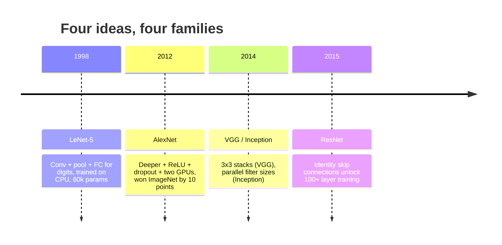
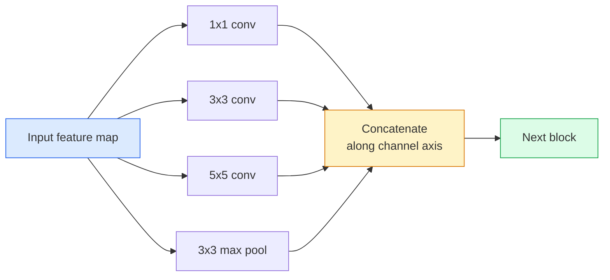
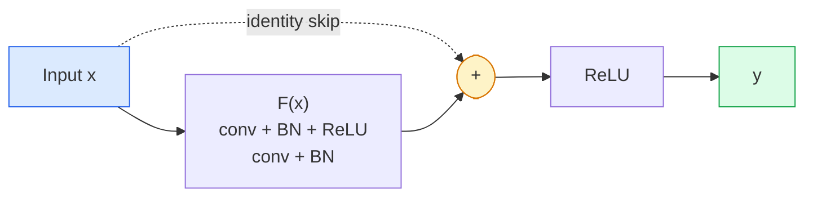

# CNN'ler  LeNet'e ResNet'e

> Son üç on yılda her önemli CNN, aslında aynı bir konvansiyonu olan bir çizgi dışı öntemli öntemli öntemli öntemli öntemli öntemli öntemli öntemli öntemli öntemli öntemli öntemli öntemli öntemli öntemli öntemli öntemli öntemli öntemli öntemli öntemli öntemli öntemli öntemli öntemli öntemli öntemli öntemli öntemli öntemli öntemli öntemli öntemli öntemli öntemli öntemli öntemli öntemli öntemli öntemli öntemli öntemli öntemli öntemli öntemli öntemli öntemli öntemli öntemli öntemli öntemli öntemli öntemli öntemli öntemli öntemli öntemli öntemli öntemli temli öntemli tem

**Type:** 学习 + 构建
**Languages:** Python
**先修要求：**3. aşama 11. dersi (PyTorch), 4. aşama 01. dersi (Şekil Temellikleri), 4. aşama 02. dersi (Çıktırılmalar)
**Time:** ~75 分钟

## Öğrenme hedefi
- 追踪 LeNet-5 -> AlexNet -> VGG -> Başlangıç -> ResNet'in yapısal kaydını, ve her aile katkılarının tek bir yeni fikrini açıklıyor
- PyTorch'te LeNet-5'i gerçekleştirmek, bir VGG 风格 bloku ve bir ResNet BasicBlock'u, her biri 40 行内内控制
- Neden geri kalan bağlantılar , eğitilmeyen 1000 katmanlı ağı en son teknolojiye dönüştürebilir ?
- 阅读一个现代脊椎 (ResNet-18, ResNet-50), ve查看源码前预测 onun çıkış şekli、receptive field 和 parametreler sayımı

## 问题
2011 yılında, en iyi ImageNet sınıflandırıcısının en iyi 5 doğruluğu yaklaşık %74'dir. 2012 yılında AlexNet %85'e ulaştı. 2015 yılında ResNet %96'a ulaştı. Yeni veriler yok. Yeni nesil GPU yok. Yapısal fikirlerden yükseldi.

按顺序学习这些网络也能让你避免一个常见错误: LeNet büyüklüğündeki ağlarda, sorunları çözebildiklerinde, doğrudan kullanılabilir en büyük modeli kullanın. MNIST, ResNet'e ihtiyaç duymıyor.

## 概念
###  değiştirmek için dört fikir



Klasik bir vizyonda, bu dört atılımdan daha önemli bir şey yok.

### LeNet-5 (1998)

Yann LeCun'un rakam tanıtıcısı 60,000 个参数 iki kon-pool bloğu iki tamamen bağlantılı katman tanh aktivasyon defines each CNN 继承模板:

```
input (1, 32, 32)
  conv 5x5 -> (6, 28, 28)
  avg pool 2x2 -> (6, 14, 14)
  conv 5x5 -> (16, 10, 10)
  avg pool 2x2 -> (16, 5, 5)
  flatten -> 400
  dense -> 120
  dense -> 84
  dense -> 10
```

CNN'in çağdaş dünyasında söylediği gibi, yani alternatif dönüşümler ve aşağı örnekleme yeniden bir küçük sınıflandırıcı başlığı, aslında daha fazla kanal daha büyük aktivasyon daha iyi LeNet'tir.

### AlexNet (2012)

Üç değişim birlikte ImageNet'i kırdı:

1. Kullan .**ReLU**替代 tanh──Gradients 不再消失──训练速度提升六倍──
2. Tamamıyla bağlantılı başlı kullanımı**Dropout**❖ Düzenleme bir teknik yerine bir katman haline geldi.
3. **Depth and width**❖ Beş kaplama katmanı, üç yoğun katman, 60M parametreleri, iki blok GPU'da yukarı eğitim, iki blok üzerinde model ayırmak

Raporun 2. Şekili hala GPU'nun bölünmesini, yani iki paralel akışını göstermektedir. Bu paralellik, yapısal olarak değil, bir hardware seviyesinde bir çözümdür.

### VGG (2014)

VGG bir soru sordu: Eğer sadece 3x3 dönüşümleri kullanırsak ve sürekli derinleşirse, ne olur?

```
stack:   conv 3x3 -> conv 3x3 -> pool 2x2
repeat:  16 or 19 conv layers
```

İki 3x3 konvoy  Gördüğünüz giriş alanı bir 5x5 konvoy ile aynıdır, ancak parametreler daha az (2*9*C^2 = 18C^2 vs 25*C^2), ve orta ek olarak bir ReLU。 VGG Bu gözlemü tam bir yapı haline getirir.

代价:138M parametreleri, tren slow,inference 昂贵──

### Başlangıç (2014,同年)

Google'ın ne tür bir çekirdek boyutu kullanmam gerektiğini sorduğu cevap:



Her şubesi özel hale getirilmiştir: 1x1 kanal karışımı için kullanılır, 3x3 yerel doku için kullanılır, 5x5 daha büyük desenler için kullanılır, birleştirme için değişken değişken özellikler kullanılır; konkat 让下层选择任何有用的分支──Inception v1 在每个分支 内部使用 1x1 转折 作为瓶,保持参数计数 合理──

### İğrençlik sorunu

2015 yılına kadar, VGG-19 能工作, VGG-32 不能──Deepth 应有帮助,但超过20层后,训练损失和测试损失都变差了──这不是过量配合──这是优化器 无法找到有用的重量,因为 Gradients 会穿越每层时以乘法方式缩小──

```
Plain deep network:
  y = f_L( f_{L-1}( ... f_1(x) ... ) )

Gradient wrt early layer:
  dL/dW_1 = dL/dy * df_L/df_{L-1} * ... * df_2/df_1 * df_1/dW_1

Each multiplicative term has magnitude roughly (weight magnitude) * (activation gain).
Stack 100 of them with gains < 1 and the gradient is effectively zero.
```

VGG 能在19层工作,是因为批量标准 (几乎同时发表) 让激活 保持良好尺度――, ancak bile,批量标准,也无法拯救超过30层左右的深度――

### ResNet (2015)

Zhang, Ren, Sun, her şeyi değiştirmek için bir çözüm önerdi.

```
standard block:   y = F(x)
residual block:   y = F(x) + x
```

`+ x`Göster katman 总能通过把 `F(x)`推到零来选择什么都不做──1000 katlı ResNet 现在最差也不会差于1 katlı ağ 差, çünkü her ekstra blokta önemsiz bir kaçış hatçası vardır──有这个保证,优化器愿意让每个块变得*稍微*有用;而稍微有用的块堆叠100次,就是最先进的──



Bu blokun iki değişimi her yerde görülüyor:

- **BasicBlock**ResNet-18, ResNet-34: İki 3x3 konvoy, atlayıp 跨过二者──
- **Bottleneck**(ResNet-50, -101, -152):1x1 aşağı,,3x3 orta,1,x1 yukarı, atlayıp 跨过三者──当频道数 很高时更便宜──

 skip                                                                                                                                                                                                                                                                                                                                                                                                                                                                                                                            

### Neden kalıntılar?

Bu fikir gerçekten resim sınıflandırması üzerinde düşünmedi. Bu derin ağları, Gradients'in hayatta kalması için dua etmekten güvenilir ve genişletilebilir bir mühendislik aracı haline getirmekle ilgilidir.


```figure
pooling
```

## Yapın onu.
### 1 adım: LeNet-5

En az ve güvenilir bir LeNet. Tanınma, ortalama birleştirme.`nn.CrossEntropyLoss`...ve orijinal Gaussian bağlantıları değil.

```python
import torch
import torch.nn as nn
import torch.nn.functional as F

class LeNet5(nn.Module):
    def __init__(self, num_classes=10):
        super().__init__()
        self.conv1 = nn.Conv2d(1, 6, kernel_size=5)
        self.conv2 = nn.Conv2d(6, 16, kernel_size=5)
        self.pool = nn.AvgPool2d(2)
        self.fc1 = nn.Linear(16 * 5 * 5, 120)
        self.fc2 = nn.Linear(120, 84)
        self.fc3 = nn.Linear(84, num_classes)

    def forward(self, x):
        x = self.pool(torch.tanh(self.conv1(x)))
        x = self.pool(torch.tanh(self.conv2(x)))
        x = torch.flatten(x, 1)
        x = torch.tanh(self.fc1(x))
        x = torch.tanh(self.fc2(x))
        return self.fc3(x)

net = LeNet5()
x = torch.randn(1, 1, 32, 32)
print(f"output: {net(x).shape}")
print(f"params: {sum(p.numel() for p in net.parameters()):,}")
```

Beklenen üretim: `output: torch.Size([1, 10])`- Evet .`params: 61,706` This is the complete digit classifier of OpenModern Vision

### 步骤 2: Bir VGG bloğu

Bir tekrarlanabilir blok: iki 3x3 konvoy, RELU, parti norm, maksimum havuz.

```python
class VGGBlock(nn.Module):
    def __init__(self, in_c, out_c):
        super().__init__()
        self.conv1 = nn.Conv2d(in_c, out_c, kernel_size=3, padding=1)
        self.bn1 = nn.BatchNorm2d(out_c)
        self.conv2 = nn.Conv2d(out_c, out_c, kernel_size=3, padding=1)
        self.bn2 = nn.BatchNorm2d(out_c)
        self.pool = nn.MaxPool2d(2)

    def forward(self, x):
        x = F.relu(self.bn1(self.conv1(x)))
        x = F.relu(self.bn2(self.conv2(x)))
        return self.pool(x)

class MiniVGG(nn.Module):
    def __init__(self, num_classes=10):
        super().__init__()
        self.stack = nn.Sequential(
            VGGBlock(3, 32),
            VGGBlock(32, 64),
            VGGBlock(64, 128),
        )
        self.head = nn.Sequential(
            nn.AdaptiveAvgPool2d(1),
            nn.Flatten(),
            nn.Linear(128, num_classes),
        )

    def forward(self, x):
        return self.head(self.stack(x))

net = MiniVGG()
x = torch.randn(1, 3, 32, 32)
print(f"output: {net(x).shape}")
print(f"params: {sum(p.numel() for p in net.parameters()):,}")
```

CIFAR büyüklüğündeki giriş üç VGG bloğu, bir adaptatif havuz, bir doğrusal katman için 290k parametreler kullanılır.

### 步骤 3: Bir ResNet BasicBlock

ResNet-18 ve ResNet-34'ün temel yapı taşları

```python
class BasicBlock(nn.Module):
    def __init__(self, in_c, out_c, stride=1):
        super().__init__()
        self.conv1 = nn.Conv2d(in_c, out_c, kernel_size=3, stride=stride, padding=1, bias=False)
        self.bn1 = nn.BatchNorm2d(out_c)
        self.conv2 = nn.Conv2d(out_c, out_c, kernel_size=3, stride=1, padding=1, bias=False)
        self.bn2 = nn.BatchNorm2d(out_c)
        if stride != 1 or in_c != out_c:
            self.shortcut = nn.Sequential(
                nn.Conv2d(in_c, out_c, kernel_size=1, stride=stride, bias=False),
                nn.BatchNorm2d(out_c),
            )
        else:
            self.shortcut = nn.Identity()

    def forward(self, x):
        out = F.relu(self.bn1(self.conv1(x)))
        out = self.bn2(self.conv2(out))
        out = out + self.shortcut(x)
        return F.relu(out)
```

Konaklama katmanları 上的 `bias=False`Bu bir parti normı alışkanlığıdır, çünkü BN'in beta parametri ışığa göre hareket etmiştir, bu yüzden aynı zamanda konfor ışığa göre hareket etmesi de ışığa göre hareket etmesi de ışığa göre hareket etmesi de ışığa göre hareket etmektir.`shortcut`Sadece gerçek bir konuya ihtiyaç vardır. Yoksa bu bir işsiz kimliktir.

### 4 adım: Küçük bir ResNet

堆叠四组 BasicBlocks, CIFAR büyüklüğündeki girişlerin kullanılabilir ResNet için uygun bir tane elde etmek

```python
class TinyResNet(nn.Module):
    def __init__(self, num_classes=10):
        super().__init__()
        self.stem = nn.Sequential(
            nn.Conv2d(3, 32, kernel_size=3, stride=1, padding=1, bias=False),
            nn.BatchNorm2d(32),
            nn.ReLU(inplace=True),
        )
        self.layer1 = self._make_group(32, 32, num_blocks=2, stride=1)
        self.layer2 = self._make_group(32, 64, num_blocks=2, stride=2)
        self.layer3 = self._make_group(64, 128, num_blocks=2, stride=2)
        self.layer4 = self._make_group(128, 256, num_blocks=2, stride=2)
        self.head = nn.Sequential(
            nn.AdaptiveAvgPool2d(1),
            nn.Flatten(),
            nn.Linear(256, num_classes),
        )

    def _make_group(self, in_c, out_c, num_blocks, stride):
        blocks = [BasicBlock(in_c, out_c, stride=stride)]
        for _ in range(num_blocks - 1):
            blocks.append(BasicBlock(out_c, out_c, stride=1))
        return nn.Sequential(*blocks)

    def forward(self, x):
        x = self.stem(x)
        x = self.layer1(x)
        x = self.layer2(x)
        x = self.layer3(x)
        x = self.layer4(x)
        return self.head(x)

net = TinyResNet()
x = torch.randn(1, 3, 32, 32)
print(f"output: {net(x).shape}")
print(f"params: {sum(p.numel() for p in net.parameters()):,}")
```

Dört grup blok, her iki grup. 2. 3, 4 组开头使用步骤 2.  Her bir aşağı örnek 时 频道数 倍倍──约2.8M parametreleri──

### 步骤 5: Parametre- özellik verimliliğini karşılaştır

Aynı giriş                                                                                                                                                                                                                                                              

```python
def summary(name, net, x):
    y = net(x)
    params = sum(p.numel() for p in net.parameters())
    print(f"{name:12s}  input {tuple(x.shape)} -> output {tuple(y.shape)}  params {params:>10,}")

x = torch.randn(1, 3, 32, 32)
summary("LeNet5",     LeNet5(),       torch.randn(1, 1, 32, 32))
summary("MiniVGG",    MiniVGG(),      x)
summary("TinyResNet", TinyResNet(),   x)
```

Üç model, üç zaman, parametreler sayısı 相差三数级── CIFAR-10 doğruluğu için, birkaç dönem için eğitilmek 后大致需要:LeNet 60%,MiniVGG 89%,TinyResNet 93%──

## Kullan
`torchvision.models`Üstteki tüm modellerin önceden eğitilmiş versiyonlarını sunmak. Farklı ailelerin arama imzası tamamen uyumlu.

```python
from torchvision.models import resnet18, ResNet18_Weights, vgg16, VGG16_Weights

r18 = resnet18(weights=ResNet18_Weights.IMAGENET1K_V1)
r18.eval()

print(f"ResNet-18 params: {sum(p.numel() for p in r18.parameters()):,}")
print(r18.layer1[0])
print()

v16 = vgg16(weights=VGG16_Weights.IMAGENET1K_V1)
v16.eval()
print(f"VGG-16   params: {sum(p.numel() for p in v16.parameters()):,}")
```

ResNet-18 11.7M parametreleri vardır VeVGG-16 138M vardır ImageNet top-1 doğruluğu  yakın (69.8% vs 71.6%)  Geri kalan bağlantılar  size 12x'lik parametreler verimliliği getirir  kazançlılık getirir. Bu yüzden 2016 yılından ViT'nin 2021 yılına kadar ortaya çıkmasına kadar, ResNet çeşitleri daima baskın bir konumdaydı ve hesaplama sınırlı gerçek dağıtımlarda hâlâ baskın bir konumdaydı.

Transfer öğrenimi için, bu yöntem her zaman aynıdır: yük önceden eğitilmiş, omurganı dondurmuş, sınıflandırıcı başını değiştirmiştir.

```python
for p in r18.parameters():
    p.requires_grad = False
r18.fc = nn.Linear(r18.fc.in_features, 10)
```

Üç行── şimdi bir 10 sınıf CIFAR sınıflandırıcısına sahip, ImageNet  eğitilmiş temsillerini miras aldı.

## - Söyle.
Bu ders:

- `outputs/prompt-backbone-selector.md`Bu nedenle, bu programın en iyi yöntemi, bu programın en iyi yöntemi ve en iyi yöntemi oluşturan bir programdır.
- `outputs/skill-residual-block-reviewer.md`Bir beceri, PyTorch modülü öğrenir ve atlama bağlantısını işaretler  error(stead change 时缺少快捷径、快捷径激活命令、BN 相对的位置)

## 练习
1. **(Easy)**Hand动逐层计算 `TinyResNet`≠ `sum(p.numel() for p in net.parameters())`Parametre bütçesinin ana kısmı nereye gitti, konvsBN mı yoksa sınıflandırıcı başı mı?
2. **(Medium)**Bottleneck bloğunu gerçekleştirmek (1x1 -> 3x3 -> 1x1 atlamakla), ve onunla CIFAR'ın ResNet-50 tarzı ağını oluşturmak.`TinyResNet`- Karşılaştırmak için.
3. **(Hard)**- Evet .`BasicBlock`CIFAR-10'da, 34 bloklu "sırın" ağı ve 34 bloklu ResNet'i, her bir kişi 10 dönem boyunca antrenman yapmaktadır.

## 关键术语
| Term | What people say | What it actually means |
|------|----------------|----------------------|
| Backbone | “模型” | 产生 feature map 并馈送给 task head 的 convolutional blocks 堆栈 |
| Residual connection | “Skip connection” | `y = F(x) + x`；通过将 F 设为零，让 Optimizer 学习 identity，从而让任意 depth 可训练 |
| BasicBlock | “两个带 skip 的 3x3 convs” | ResNet-18/34 的 building block：conv-BN-ReLU-conv-BN-add-ReLU |
| Bottleneck | “1x1 down，3x3，1x1 up” | ResNet-50/101/152 block；在高 channel counts 下成本低，因为 3x3 运行在缩减后的 width 上 |
| Degradation problem | “更深反而更差” | 超过约 20 个 plain conv layers 后，training error 和 test error 都会增加；由 residual connections 解决，而不是靠更多数据 |
| Stem | “第一层” | 将 3-channel input 转换为基础 feature width 的初始 conv；ImageNet 通常是 7x7 stride 2，CIFAR 通常是 3x3 stride 1 |
| Head | “分类器” | final backbone block 之后的 layers：adaptive pool、flatten、linear(s) |
| Transfer learning | “Pretrained weights” | 加载在 ImageNet 上训练过的 backbone，并且只在你的 task 上 fine-tune head |

## 延伸阅读
- [Deep Residual Learning for Image Recognition (He et al., 2015)](https://arxiv.org/abs/1512.03385)ResNet'in çalışmaları;
- [Very Deep Convolutional Networks (Simonyan & Zisserman, 2014)](https://arxiv.org/abs/1409.1556) VGG 论文; hala anlamışım neden 3x3  için en iyi referans
- [ImageNet Classification with Deep CNNs (Krizhevsky et al., 2012)](https://papers.nips.cc/paper_files/paper/2012/hash/c399862d3b9d6b76c8436e924a68c45b-Abstract.html) AlexNet;终结 el yapımı özellik 时代的论文
- [Going Deeper with Convolutions (Szegedy et al., 2014)](https://arxiv.org/abs/1409.4842) Başlangıç v1; hala görme transformörlerinde görünür.
