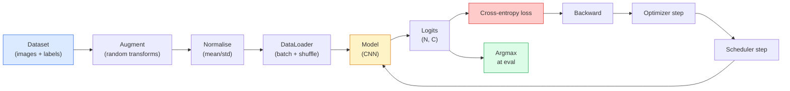

# Resim sınıflandırması

> sınıflandırıcı, piksellerden sınıflara kadar olasılık dağılımının bir işlevi. Diğer her şey bir tüp hattı işidir.

**Type:** Build
**Languages:** Python
**Prerequisites:** Phase 2 Lesson 09 (Model Evaluation), Phase 3 Lesson 10 (Mini Framework), Phase 4 Lesson 03 (CNNs)
**Time:** ~75 minutes

## Öğrenme hedefi

- CIFAR-10'da, son sonuncu görüntü sınıflandırma hattı: veri kümesi, artırma, model, eğitim döngüsü, değerlendirme
- 解释每个组件的作用(dataloader、loss、optimizer、scheduler、augmentation),并预测其中 herhangi bir hata nasıl oluşur
- Çelişkiyi, kesimi ve etiket düzeltmesini gerçekleştirmekle birlikte, bunları ne zaman eklememiz gerektiğini açıklar.
- 阅读混沌矩阵 和 class per precision/recall table, with aggregate accuracy 之外的信息诊断数据集与模型的失败模式

## 问题

Her son görünüm görevi, bir çeşit seviyede görüntü sınıflandırması için düzenlenir. Bölgeler için Deteksiyon, sınıflandırma, sınıflandırma, bölgelik için pikseller için sınıflandırma, sınıf merkezleri için benzerlik düzenine göre sınıflandırma, yani veri kümesi döngüsü, artırma politikası, kaybı, değerlendirme, bu aşamada tüm diğer görevlerin çekirdek kapasitesine geçebilir.

Büyük çoğunluk sınıflandırma hataları 里里里. Onlar pipeline içinde bulunmaktadır: 损坏的正常化、没有混的训练集、会扭曲标签的增强、被训练数据的验证分分、30 之后散发的学习率── CIFAR-10 üzerinde doğru ayarlarda %93'e ulaşan bir CNN, 损坏的设置下通常只能得到 70-75%, Loss 曲线则看起来全程很合理──

Bu ders tüm boru hattını kontrol altına alıyor.`torchvision.datasets`İçinde saklanabilecek herhangi bir şey var.

## 核心概念

### Sınıflandırma boru hattı



Bu döngüdeki her bir çizgi bir hata olabilir.`model(x).softmax()`%2'yi bir arada karıştırdığı için, karıştırmak dışında, katılımlar sadece girişler için kullanılır, etiketler için kullanılmamalıdır.`optimizer.zero_grad()` her adım bir kere yapılmalıdır;                                                                                                                                                                                                                                                           

### Çarşı entropi ̊logits ve softmax

sınıflandırıcı 会为每张图像产生 `C`个数字, logits olarak adlandırılır.

```
softmax(z)_i = exp(z_i) / sum_j exp(z_j)
```

Çarpıcı entropiy 衡量正确 sınıfının negatif log olasılığı:

```
CE(z, y) = -log( softmax(z)_y )
        = -z_y + log( sum_j exp(z_j) )
```

Sağ tarafı biçim = sayı değerinin sabit biçimi (log-sum-exp)`nn.CrossEntropyLoss`Bir op içinde birleştirir softmax + NLL,并直接接收原始logits──自己先应用 softmax 几乎总是 bug,因为你计算的是 log(softmax(softmax(z))),这是一个没有意义的量──

### Neden artış etkili?

CNN çevirime karşı  induktif önyargılı ((( ağırlık paylaşımından kaynaklanıyor), ancak ürünlere karşı 、flips、 renk jitter veya okluksiyon   hiçbir içsel değişim yok。 öğretir bu değişimlerin tek yolu, bu değişimlerin piksellerini görünebilmesi için kullanmaktır。 eğitim sırasında her rastgele dönüşüm ifade ediliyor: Bu iki görüntü aynı etiketlere sahiptir;  farklılıkları ihmal edebilen özellikleri öğrenmek için kullanılır。

```
Original crop:  "dog facing left"
Flip:           "dog facing right"       <- same label, different pixels
Rotate(+15):    "dog, slight tilt"
Colour jitter:  "dog in warmer light"
RandomErasing:  "dog with patch missing"
```

規則是:増幅 必須保存 ラベル──对数字做切割 和回転可能将将6 变成9; bu veriler için, daha küçük dönüm aralıkları kullanmanız gerekir,并選択尊重数字-specific invariance の増幅──

### Karıştırma ve kesim karıştırma

Normal artış piksel değiştirecek ama etiketleri tek sıcaklıklı tutmak için.**Mixup**和 **cutmix**Bu noktayı kırmak için aynı anda iki değer de dahil olacak.

```
Mixup:
  lambda ~ Beta(a, a)
  x = lambda * x_i + (1 - lambda) * x_j
  y = lambda * y_i + (1 - lambda) * y_j

Cutmix:
  paste a random rectangle of x_j into x_i
  y = area-weighted mix of y_i and y_j
```

Bu neden yardımcı olur: model, bir kez daha en sıcak hedefleri hatırlamıyor, ama sınıflar arasında bir şeyler öğrenir.

### Etiket düzeltme

Çelişkiyi kullanmayın.`[0, 0, 1, 0, 0]`作为训练目标,而是用 `[eps/C, eps/C, 1-eps, eps/C, eps/C]`, içinden `eps`Bu modelin herhangi bir sonluk elde etmesini engelledi ve kalibrasyonu neredeyse hiç maliyetle iyileştirdi. PyTorch 1.10'dan beri, içinde yer almıştır.`nn.CrossEntropyLoss(label_smoothing=0.1)`- Evet.

### Düzgünlik dışındaki değerlendirme

Toplam doğruluk dengesizliği örtüştürür. Eğer 90-10'un ikili sınıflandırıcısı çoğunluk sınıfını da tahmin ederse, %90'ı da elde edebilirsin.

- **Per-class accuracy** Her sınıf bir sayı; hemen eksik performans gösterme sınıfı ortaya çıkarmak
- **Confusion matrix** C x C gredi, içinde satır i col j = gerçek sınıf i; diyagonal is correct预测, off-diagonals 才是模型 问题所在。
- **Top-1 / Top-5** Doğrudan sınıfı Top 1 veya 5 tahminlerde Top-5  ImageNet için  çok önemli çünkü Norwich Terrier  和 Norfolk Terrier  gibi sınıflar  gerçekten farklılıklar vardır 
- **Calibration (ECE)** 0.8 güven tahminleri gerçekten %80'lik bir zaman doğru mu? Modern ağlar  sistematik olarak aşırı güvenlidir; sıcaklık ölçeklemesi veya etiket düzeltmesi ile yapılabilir 修正──


```figure
receptive-field
```

## Yapın onu.

### 步骤 1: kesin bir sentetik veri kümesi

CIFAR-10'un disk üzerinde yer alması için, CIFAR'ın sentetik verileri gibi görünen bir dizi oluşturduk. Bu da sınıf-özel yapısı ile, 32x32 RGB görüntülerini öğrenmek zorunda.

```python
import numpy as np
import torch
from torch.utils.data import Dataset


def synthetic_cifar(num_per_class=1000, num_classes=10, seed=0):
    rng = np.random.default_rng(seed)
    X = []
    Y = []
    for c in range(num_classes):
        centre = rng.uniform(0, 1, (3,))
        freq = 2 + c
        for _ in range(num_per_class):
            yy, xx = np.meshgrid(np.linspace(0, 1, 32), np.linspace(0, 1, 32), indexing="ij")
            r = np.sin(xx * freq) * 0.5 + centre[0]
            g = np.cos(yy * freq) * 0.5 + centre[1]
            b = (xx + yy) * 0.5 * centre[2]
            img = np.stack([r, g, b], axis=-1)
            img += rng.normal(0, 0.08, img.shape)
            img = np.clip(img, 0, 1)
            X.append(img.astype(np.float32))
            Y.append(c)
    X = np.stack(X)
    Y = np.array(Y)
    idx = rng.permutation(len(X))
    return X[idx], Y[idx]


class ArrayDataset(Dataset):
    def __init__(self, X, Y, transform=None):
        self.X = X
        self.Y = Y
        self.transform = transform

    def __len__(self):
        return len(self.X)

    def __getitem__(self, i):
        img = self.X[i]
        if self.transform is not None:
            img = self.transform(img)
        img = torch.from_numpy(img).permute(2, 0, 1)
        return img, int(self.Y[i])
```

Her sınıfın kendi renk paleti ve frekans kalıbı vardır, Gaussian gürültüsünü tekrar ekler, anı pikselleri yerine öğrenme sinyalini zorlar.

### 步骤2:Normalleşme ve artırma

Her görüntü borusunda bu iki dönüşüm vardır.

```python
def standardize(mean, std):
    mean = np.array(mean, dtype=np.float32)
    std = np.array(std, dtype=np.float32)
    def _fn(img):
        return (img - mean) / std
    return _fn


def random_hflip(p=0.5):
    def _fn(img):
        if np.random.random() < p:
            return img[:, ::-1, :].copy()
        return img
    return _fn


def random_crop(pad=4):
    def _fn(img):
        h, w = img.shape[:2]
        padded = np.pad(img, ((pad, pad), (pad, pad), (0, 0)), mode="reflect")
        y = np.random.randint(0, 2 * pad)
        x = np.random.randint(0, 2 * pad)
        return padded[y:y + h, x:x + w, :]
    return _fn


def compose(*fns):
    def _fn(img):
        for fn in fns:
            img = fn(img)
        return img
    return _fn
```

Çizgi çubuğu bir sinyal olduğundan, model bir şekilde onu göz ardı eder.

### 步骤 3: Karıştırma

Eğitim aşamasında 内部混合两张图像 和两个标签──; bu yüzden bir dizi verilerin 内部 değil, ileri geçit yakınında yer alır.

```python
def mixup_batch(x, y, num_classes, alpha=0.2):
    if alpha <= 0:
        return x, torch.nn.functional.one_hot(y, num_classes).float()
    lam = float(np.random.beta(alpha, alpha))
    idx = torch.randperm(x.size(0), device=x.device)
    x_mixed = lam * x + (1 - lam) * x[idx]
    y_onehot = torch.nn.functional.one_hot(y, num_classes).float()
    y_mixed = lam * y_onehot + (1 - lam) * y_onehot[idx]
    return x_mixed, y_mixed


def soft_cross_entropy(logits, soft_targets):
    log_probs = torch.log_softmax(logits, dim=-1)
    return -(soft_targets * log_probs).sum(dim=-1).mean()
```

`soft_cross_entropy`Bu, yumuşak etiket dağıtımının çapraz entropiyi hedef alır. Hedef 恰好 is one-hot 时, bu durum normal bir 热 时, 退化.

### 步骤 4:Eğitim döngüsü

完整配方: her parti için bir kez veriyi, her parti için bir kez gradient hesaplayın, her dönem için bir kez programcı adımını gerçekleştirin.

```python
import torch
import torch.nn as nn
from torch.utils.data import DataLoader
from torch.optim import SGD
from torch.optim.lr_scheduler import CosineAnnealingLR

def train_one_epoch(model, loader, optimizer, device, num_classes, use_mixup=True):
    model.train()
    total, correct, loss_sum = 0, 0, 0.0
    for x, y in loader:
        x, y = x.to(device), y.to(device)
        if use_mixup:
            x_m, y_soft = mixup_batch(x, y, num_classes)
            logits = model(x_m)
            loss = soft_cross_entropy(logits, y_soft)
        else:
            logits = model(x)
            loss = nn.functional.cross_entropy(logits, y, label_smoothing=0.1)
        optimizer.zero_grad()
        loss.backward()
        optimizer.step()
        loss_sum += loss.item() * x.size(0)
        total += x.size(0)
        # Training accuracy vs the un-mixed labels `y` is only an approximation
        # when mixup is on (the model saw soft targets, not y). Treat it as a
        # rough progress signal; rely on val accuracy for real performance.
        with torch.no_grad():
            pred = logits.argmax(dim=-1)
            correct += (pred == y).sum().item()
    return loss_sum / total, correct / total


@torch.no_grad()
def evaluate(model, loader, device, num_classes):
    model.eval()
    total, correct = 0, 0
    loss_sum = 0.0
    cm = torch.zeros(num_classes, num_classes, dtype=torch.long)
    for x, y in loader:
        x, y = x.to(device), y.to(device)
        logits = model(x)
        loss = nn.functional.cross_entropy(logits, y)
        pred = logits.argmax(dim=-1)
        for t, p in zip(y.cpu(), pred.cpu()):
            cm[t, p] += 1
        loss_sum += loss.item() * x.size(0)
        total += x.size(0)
        correct += (pred == y).sum().item()
    return loss_sum / total, correct / total, cm
```

Her bir eğitim döngüsü yazırken beş değişkenliği kontrol etmeliyiz:

1. eğitim 前调用 `model.train()`, değerlendirme 前调用 `model.eval()`Bu, bir kaç kişilik ve bir grupluk normunun değişmesi olacaktır.
2. - Evet .`.backward()`Ön调用 `.zero_grad()`- Evet.
3. 累积 metrics 时使用 `.item()`Bu sayede hesaplama grafiği canlı kalmaz.
4. değerlendirme 期间使用 `@torch.no_grad()`, kaydı ve zamanı tasarruf etmek, küçük kazaları önlemek.
5. Çiğ logitler için argmax yapın, yumuşak maksimum için argmax yapın, sonuç aynı, az bir op¬¬¬¬¬¬¬¬¬¬¬¬¬¬¬¬¬¬¬¬¬¬¬¬¬¬¬¬¬¬¬¬¬¬¬¬¬¬¬¬¬¬¬¬¬¬¬¬¬¬¬¬¬¬¬¬¬¬¬¬¬¬¬¬¬¬¬¬¬¬¬¬¬¬¬¬¬¬¬¬¬¬¬¬¬¬¬¬¬¬¬¬¬¬¬¬¬¬¬¬¬¬¬¬¬¬¬¬¬¬¬¬¬¬¬¬¬¬¬¬¬¬¬¬¬¬¬¬¬¬¬¬¬¬¬¬¬¬¬¬¬¬¬¬¬¬¬¬¬¬¬¬¬¬¬¬¬¬¬¬¬¬¬¬¬¬¬¬¬¬¬¬¬¬¬¬¬¬¬¬¬¬¬¬¬¬¬¬¬¬¬¬¬¬¬¬¬¬¬¬¬¬¬¬¬¬¬¬¬¬¬¬¬¬¬¬¬¬¬¬¬¬¬¬¬¬¬¬¬¬¬¬¬¬¬¬¬¬¬¬¬¬¬¬¬¬¬¬¬¬¬¬¬¬¬¬¬¬¬¬¬¬¬¬¬¬¬¬¬

### Adım 5: Toplantı

Uygulayacak ders`TinyResNet`, birkaç dönem eğit, sonra değerlendirelim.

```python
from main import synthetic_cifar, ArrayDataset
from main import standardize, random_hflip, random_crop, compose
from main import mixup_batch, soft_cross_entropy
from main import train_one_epoch, evaluate
# TinyResNet comes from the previous lesson (03-cnns-lenet-to-resnet).
# Adjust the import path to wherever you stored the previous lesson's code.
from cnns_lenet_to_resnet import TinyResNet  # example placeholder

X, Y = synthetic_cifar(num_per_class=500)
split = int(0.9 * len(X))
X_train, Y_train = X[:split], Y[:split]
X_val, Y_val = X[split:], Y[split:]

mean = [0.5, 0.5, 0.5]
std = [0.25, 0.25, 0.25]
train_tf = compose(random_hflip(), random_crop(pad=4), standardize(mean, std))
eval_tf = standardize(mean, std)

train_ds = ArrayDataset(X_train, Y_train, transform=train_tf)
val_ds = ArrayDataset(X_val, Y_val, transform=eval_tf)

train_loader = DataLoader(train_ds, batch_size=128, shuffle=True, num_workers=0)
val_loader = DataLoader(val_ds, batch_size=256, shuffle=False, num_workers=0)

device = "cuda" if torch.cuda.is_available() else "cpu"
model = TinyResNet(num_classes=10).to(device)
optimizer = SGD(model.parameters(), lr=0.1, momentum=0.9, weight_decay=5e-4, nesterov=True)
scheduler = CosineAnnealingLR(optimizer, T_max=10)

for epoch in range(10):
    tr_loss, tr_acc = train_one_epoch(model, train_loader, optimizer, device, 10, use_mixup=True)
    va_loss, va_acc, _ = evaluate(model, val_loader, device, 10)
    scheduler.step()
    print(f"epoch {epoch:2d}  lr {scheduler.get_last_lr()[0]:.4f}  "
          f"train {tr_loss:.3f}/{tr_acc:.3f}  val {va_loss:.3f}/{va_acc:.3f}")
```

Sentetik veri kümesi üzerinde, beş dönem içinde mükemmel doğrulama doğruluğuna yaklaşır, bu da bir odak noktası: boru doğru, model öğrenilebilir bir şey.

### 步骤 6:阅读 karışıklık matrisi

Sadece doğrulukta, modelin nerede başarısız olduğunu asla söyleyemem.

```python
def print_confusion(cm, labels=None):
    c = cm.shape[0]
    labels = labels or [str(i) for i in range(c)]
    print(f"{'':>6}" + "".join(f"{l:>5}" for l in labels))
    for i in range(c):
        row = cm[i].tolist()
        print(f"{labels[i]:>6}" + "".join(f"{v:>5}" for v in row))
    print()
    tp = cm.diag().float()
    fp = cm.sum(dim=0).float() - tp
    fn = cm.sum(dim=1).float() - tp
    prec = tp / (tp + fp).clamp_min(1)
    rec = tp / (tp + fn).clamp_min(1)
    f1 = 2 * prec * rec / (prec + rec).clamp_min(1e-9)
    for i in range(c):
        print(f"{labels[i]:>6}  prec {prec[i]:.3f}  rec {rec[i]:.3f}  f1 {f1[i]:.3f}")

_, _, cm = evaluate(model, val_loader, device, 10)
print_confusion(cm)
```

行是真实类,列是预测──3 ve 5 sınıfları arasında  off-diagonal counts oluştu, yani model 混了这两类,并为定向数据收集或类特定增强提供起点──

## Kullan

`torchvision`Yukarıdaki tüm içeriği alışkanlıklı bir bileşene paketleyeceğim. Gerçek CIFAR-10 için, tüm boru hattı sadece dört satır, bir antrenman döngüsü daha eklenir.

```python
from torchvision.datasets import CIFAR10
from torchvision.transforms import Compose, RandomCrop, RandomHorizontalFlip, ToTensor, Normalize

mean = (0.4914, 0.4822, 0.4465)
std = (0.2470, 0.2435, 0.2616)
train_tf = Compose([
    RandomCrop(32, padding=4, padding_mode="reflect"),
    RandomHorizontalFlip(),
    ToTensor(),
    Normalize(mean, std),
])
eval_tf = Compose([ToTensor(), Normalize(mean, std)])

train_ds = CIFAR10(root="./data", train=True,  download=True, transform=train_tf)
val_ds   = CIFAR10(root="./data", train=False, download=True, transform=eval_tf)
```

Dikkat etmeniz gereken iki nokta var:**dataset-specific**Bu, ImageNet'in yerine CIFAR-10 eğitim kümesinde hesaplanmıştır. Reflekt padı toplumun belirlediği ürün politikalarıdır. Burada kopya yapıştır ImageNet istatistikleri yaklaşık %1 doğruluk sızdırmasına neden olur. Bu tür sorular genellikle bir kişinin profil modeline ulaşmak için bulunur.

## - Söyle.

Bu ders:

- `outputs/prompt-classifier-pipeline-auditor.md` Bir hızlı, denetim eğitim senaryosu yukarıdaki beş değişkenliği karşılamıyor, ilk ihlal ortaya çıkıyor.
- `outputs/skill-classification-diagnostics.md` Bir beceri, belirlenmiş karışıklık matrisi 和 sınıf isimleri 列表后,总结 per class failures,并提出最有影响的单个修复──

## 练习

1. **(Easy)**Sintez veri kümesi üzerinde, aynı modelle ayrılı olarak, karmaşık ve karmaşık olmayan sürümler, her bir eğitim beş dönemleri oluşturur.
2. **(Medium)**实现 Cutout: 中随机把一个8x8 方块置零,并运行ablation,对比无增量、hflip+crop、hflip+crop+cutout、hflip+crop+mixup──报告每种设置的 val精度──
3. **(Hard)** CIFAR-100 borusunu inşa etmek(100 sınıf, aynı giriş boyutu),并复现一次ResNet-34 eğitim çalışması, sonuçları yayınlanmış doğruluk farkı ile% 1 以内〜内〜.

## 关键术语

| Term | 人们通常怎么说 | 它实际是什么意思 |
|------|----------------|----------------------|
| Logits | “Raw outputs” | 每张图像对应的 pre-softmax C 维 Vector；cross-entropy 期望接收它们，而不是 softmaxed values |
| Cross-entropy | “The loss” | 正确 class 的 negative log-probability；在一个稳定 op 中结合 log-softmax 和 NLL |
| DataLoader | “The batcher” | 用 shuffling、batching 和（可选）multi-worker loading 包装 dataset；一半 training bugs 都会被怪到它头上 |
| Augmentation | “Random transforms” | training time 的任何 pixel-level transform，只要它保留 label；教会 CNN 它原生不具备的 invariances |
| Mixup / Cutmix | “Mix two images” | 同时混合 inputs 和 labels，让 classifier 学习平滑插值，而不是硬边界 |
| Label smoothing | “Softer targets” | 用 (1-eps, eps/(C-1), ...) 替换 one-hot；改善 calibration，并略微提升 accuracy |
| Top-k accuracy | “Top-5” | 正确 class 位于 k 个最高 probability predictions 之中；用于包含真实歧义 classes 的 datasets |
| Confusion matrix | “Where errors live” | C x C table，其中 entry (i, j) 统计 true class i 被预测为 j 的 images 数量；diagonal 是正确项，off-diagonal 告诉你该修什么 |

## 延伸阅读

- [CS231n: Training Neural Networks](https://cs231n.github.io/neural-networks-3/)                                                                                                                                                                                                                                                                                                                                                                                                                                                                                                                            
- [Bag of Tricks for Image Classification (He et al., 2019)](https://arxiv.org/abs/1812.01187) Tüm küçük teknikler birlikte, ImageNet'in üstteki ResNet doğruluğunun % 3-4 artmasına yardımcı olabilir
- [mixup: Beyond Empirical Risk Minimization (Zhang et al., 2017)](https://arxiv.org/abs/1710.09412) İlk karışıklık kağıdı; üç sayfa teorisi ve ikna edici deneyler
- [Why temperature scaling matters (Guo et al., 2017)](https://arxiv.org/abs/1706.04599)Bu makale modern ağların yanlış kalibrasyon olduğunu kanıtladı ve bir skalar parametresiyle düzeltti.
