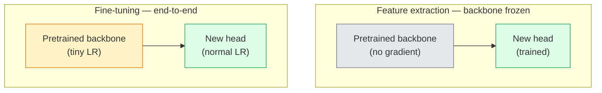

# Transfer Öğrenme ve Düzgün Düzenleme

> Başkaları milyonlarca GPU harcadı. Bu özellikleri kullanmak gerekir.

**Type:** Build
**Languages:** Python
**Prerequisites:** Phase 4 Lesson 03 (CNNs), Phase 4 Lesson 04 (Image Classification)
**Time:** ~75 minutes

## Öğrenme hedefi
- 区分 özelliği çıkarma 和 ince ayarlama,并根据数据集大小、域距离 和计算预算 选择合适方法
- Önceden eğitilmiş omurganı yükle, sınıflandırıcı başını değiştir ve 20 行 içinde sadece eğitim başını  elde edebilirsiniz başlangıç
- ✓ ✓ ✓ ✓ ✓ ✓ ✓ ✓ ✓ ✓ ✓ ✓ ✓ ✓ ✓ ✓ ✓ ✓ ✓ ✓ ✓ ✓ ✓ ✓ ✓ ✓ ✓ ✓ ✓ ✓ ✓ ✓ ✓ ✓ ✓ ✓ ✓ ✓ ✓ ✓ ✓ ✓ ✓ ✓ ✓ ✓ ✓ ✓ ✓ ✓ ✓ ✓ ✓ ✓ ✓ ✓ ✓ ✓ ✓ ✓ ✓ ✓ ✓ ✓ ✓ ✓ ✓ ✓ ✓ ✓ ✓ ✓ ✓ ✓ ✓ ✓ ✓ ✓ ✓ ✓ ✓ ✓ ✓ ✓ ✓ ✓ ✓ ✓ ✓ ✓ ✓ ✓ ✓ ✓ ✓ ✓ ✓ ✓ ✓ ✓ ✓ ✓ ✓ ✓ ✓ ✓ ✓ ✓ ✓ ✓ ✓ ✓ ✓ ✓ ✓ ✓ ✓ ✓ ✓ ✓ ✓ ✓ ✓ ✓ ✓ ✓ ✓ ✓ ✓ ✓ ✓ ✓ ✓ ✓ ✓ ✓ ✓ ✓ ✓ ✓ ✓ ✓ ✓ ✓ ✓ ✓ ✓ ✓ ✓ ✓ ✓ ✓ ✓ ✓ ✓ ✓ ✓ ✓ ✓ ✓ ✓ ✓ ✓ ✓ ✓ ✓ ✓ ✓ ✓ ✓ ✓ ✓ ✓ ✓  ✓ ✓ ✓ ✓ ✓ ✓ ✓ ✓ ✓      ✓ ✓ ✓    ✓ ✓      ✓     ✓       ✓     ✓                                                                                                  
- 诊断三类常见失败:dondurulmuş bloklar 上 LR 过高导致特征漂移、小数据集 上的BN istatistiklerinin çöküşü,以及灾难性忘记

## 问题
ImageNet'te bir ResNet-50'yi eğitmek yaklaşık 2.000 GPU saatini gerektirir. Bu bütçeyi karşılayacak çok az ekip var. Gerçekte tüm ekipler, önceden eğitilmiş bir omurgan ve yeni bir başla birlikte çalışmaktadır. Bu baş ise birkaç yüz veya bin tane görev-özel görüntülerde çalışmaktadır.

Bu bir yol değil. ImageNet'te eğitim görmüş herhangi bir CNN, ilk konaklama blokları, şehir öğrenme kenarları ve Gabor'un benzer filtreleri gibi. Sonraki birkaç blok, dokuları ve basit motifleri öğrenmek. Orta bloklar, nesnelerin parçalarını öğrenmek. Son bloklar, bir bin ImageNet kategorisi bileşimi öğrenmek için başlıyor. Bu seviye yapısının ilk %90'ı neredeyse tıbbi görüntüleme, endüstriyel inceleme, uydu verileri ve diğer her görevi görmeye aktarılabilir. Çünkü doğal ortamın kenarları ve dokuları kelimelerinin miktarı sınırlıdır. Son %10'u, gerçekten eğitilmen gereken bir bölümdür.

İyi bir aktarım yapın sizi bekleyen üç hata var: aşırı yüksek öğrenme oranı ile önceden eğitilmiş özellikleri bozarız; 结过多导致模型信息不足; BatchNorm'un çalıştırma istatistiklerini küçük bir veri kümesine taşımayı sağlarken, sinir ağının geri kalanı bu veri kümesinden hiçbir şey öğrenmedi.

## 概念
### Özellikler vs. ince ayarlama

İki model var, öncelikle eğitilmiş özelliklerin ve ne kadar veri olduğunuza bağlıdır.



经验法则:

| Dataset size | Domain distance | Recipe |
|--------------|-----------------|--------|
| < 1k images | 接近 ImageNet | 冻结 backbone，只训练 head |
| 1k-10k | 接近 | 冻结前 2-3 个 stages，fine-tune 其余部分 |
| 10k-100k | 任意 | 使用 discriminative LR 进行 end-to-end fine-tune |
| 100k+ | 远 | Fine-tune 全部参数；如果 domain 足够远，考虑从零训练 |

接近 ImageNet大致 anlamı 带有物体类内容的自然 RGB fotoğrafları──Medical CT scans、overhead satellite imagery 和 microscopy 属于远域,特征 仍然有帮助,但你需要允许更多层 适应──

### Neden dondurma işe yarıyor ?

CNN'in öğrendiği ImageNet özellikleri bu 1.000 kategoride özel olarak hedeflenmiyor. Bunlar doğal görüntülerin istatistik özelliklerine özel olarak uyarlar: belirli yön kenarları, dokular, kontrast kalıpları, şekil primitifleri. Bu istatistik özellikler, insan tarafından ifade edilebilecek neredeyse her görüntü alanında oldukça istikrarlıdır. Bu nedenle ImageNet'te eğitim gören bir model, CIFAR-10'da sıfır çekim yeni değerlendirme sırasında, sadece bir çizgi başı eklediğinde (kilimsiz tonlu omurğa) %80+ doğruluğa ulaşabilir.

### Ayrımcılıklı öğrenme oranları

Eğer gerçekten çözüyorsan, erken katmanlar  geç katmanlardan daha yavaş çalışmalı.

```
Typical recipe:

  stage 0 (stem + first group): lr = base_lr / 100    (mostly fixed)
  stage 1:                       lr = base_lr / 10
  stage 2:                       lr = base_lr / 3
  stage 3 (last backbone group): lr = base_lr
  head:                          lr = base_lr  (or slightly higher)
```

PyTorch'te, bu sadece Optimizer'ın parametre gruplarını gönderir.

### BatchNorm sorunu

BN katmanları ImageNet'de hesaplanmıştır.`running_mean`和 `running_var`Bufferler. Eğer göreviniz farklı piksel dağılımları varsa, örneğin farklı aydınlatma, farklı sensörler, farklı renk alanları, bu buferler yanlıştır.

1. **在 train mode 下 fine-tune BN。**让 BN 随其它部分一起更新运行统计――当任务数据集 中等大小(>= 5k örnekler)
2. **在 eval mode 下冻结 BN。**ImageNet istatistiklerini tut, sadece ağırlık eğit. Bilgi kümenizin küçük bir BN'nin hareketli ortalaması olduğunda, bu doğru seçimdir.
3. **用 GroupNorm 替换 BN。**完全移除 问题──用于检测和细分背骨,因为每个GPU 上的批量大小很小──

Bu hataların doğruluğunu gösterir. 5-15% düşer.

### Baş tasarımı

Klasör başı 1-3 ′ lineer katman eklenir bir seçilebilir düşüş.

```
backbone.fc = nn.Linear(backbone.fc.in_features, num_classes)          # ResNet
backbone.classifier[1] = nn.Linear(..., num_classes)                    # EfficientNet, MobileNet
backbone.heads.head = nn.Linear(..., num_classes)                       # torchvision ViT
```

 Küçük veri kümeleri için, tek bir çizgi katman genellikle yeterlidir.

### Katmanlı LR çürümesi

Bu, modern ince ayarlamalar arasında kullanılan ayrımcı LR'nin daha düz versiyonu.

```
lr_layer_k = base_lr * decay^(L - k)
```

Bu durumda, ilk blokın eğitimi LR = baş LR `0.75^11 ≈ 0.04x` Transformer ince sesleri için CNN'lere göre daha önemli; CNN'lere göre, sahne gruplarındaki LR'ler genellikle yeterli olmuştur

### Neyi değerlendirelim

Transfer-öğrenme çalışmalar  iki tane gerekir sıfırla çalıştırmak arasında takip etmeyecek sayı:

- **Pretrained-only accuracy**Başının doğruluğu. Bu senin zemin.
- **Fine-tuned accuracy**Sonundan sonuna kadar eğitim 后同一个模型的精度──这是你的天花──

Eğer ince ayarlanmışsa, sadece önceden eğitilmişten daha düşükse, senin öğrenme oranın ya da BN'in hataları vardır.


```figure
transfer-learning
```

## Yapın onu.
### 步骤 1: Önceden eğitilmiş bir omurgan yükle ve kontrol edin

```python
import torch
import torch.nn as nn
from torchvision.models import resnet18, ResNet18_Weights

backbone = resnet18(weights=ResNet18_Weights.IMAGENET1K_V1)
print(backbone)
print()
print("classifier head:", backbone.fc)
print("feature dim:", backbone.fc.in_features)
```

`ResNet18`Dört aşama var.`layer1..layer4`), 外加一个干 和一个 `fc`Başı, her bakış kemiri benzer bir yapıya sahip.

### 步骤 2: Özellik çıkarma  her şeyi dondur, başı değiştir

```python
def make_feature_extractor(num_classes=10):
    model = resnet18(weights=ResNet18_Weights.IMAGENET1K_V1)
    for p in model.parameters():
        p.requires_grad = False
    model.fc = nn.Linear(model.fc.in_features, num_classes)
    return model

model = make_feature_extractor(num_classes=10)
trainable = sum(p.numel() for p in model.parameters() if p.requires_grad)
frozen = sum(p.numel() for p in model.parameters() if not p.requires_grad)
print(f"trainable: {trainable:>10,}")
print(f"frozen:    {frozen:>10,}")
```

Sadece .`model.fc`Yaptığım şey eğitim. Sırt kemiği, dondurulmuş bir özellik çıkarıcı.

### 步骤 3: Ayrımcılıksal ince ayarlama

Bir kullanım, aşama-sözlü öğrenme oranları ile ilgili parametreler grubunu oluşturmak için kullanılır.

```python
def discriminative_param_groups(model, base_lr=1e-3, decay=0.3):
    stages = [
        ["conv1", "bn1"],
        ["layer1"],
        ["layer2"],
        ["layer3"],
        ["layer4"],
        ["fc"],
    ]
    groups = []
    for i, names in enumerate(stages):
        lr = base_lr * (decay ** (len(stages) - 1 - i))
        params = [p for n, p in model.named_parameters()
                  if any(n.startswith(k) for k in names)]
        if params:
            groups.append({"params": params, "lr": lr, "name": "_".join(names)})
    return groups

model = resnet18(weights=ResNet18_Weights.IMAGENET1K_V1)
model.fc = nn.Linear(model.fc.in_features, 10)
for p in model.parameters():
    p.requires_grad = True

groups = discriminative_param_groups(model)
for g in groups:
    print(f"{g['name']:>10s}  lr={g['lr']:.2e}  params={sum(p.numel() for p in g['params']):>8,}")
```

`decay=0.3`Her aşamada eğitim oranının sonraki aşamada %30 olduğunu belirtmek.`fc`- Al .`base_lr`- Evet .`layer4`- Al .`0.3 * base_lr`- Evet .`conv1`- Al .`0.3^5 * base_lr ≈ 0.00243 * base_lr`                                                                                                                                                                                                                                                              

### 步骤 4: BatchNorm kullanım

BN'nin istatistikleri kullanmakla beraber, ağırlıklarının da yardımcıları olarak kullanılıyor.

```python
def freeze_bn_stats(model):
    for m in model.modules():
        if isinstance(m, (nn.BatchNorm1d, nn.BatchNorm2d, nn.BatchNorm3d)):
            m.eval()
            for p in m.parameters():
                p.requires_grad = False
    return model
```

Her dönem  başlama zaman ayar `model.train()`Sonra da kullan.`model.train()`Tüm içeriği eğitim moduna keser; bu işlev sadece BN katmanlarına ters taraftan keser.

### 步骤 5: En az bir son-son ince ayarlama döngüsü

```python
from torch.optim import SGD
from torch.utils.data import DataLoader
from torch.optim.lr_scheduler import CosineAnnealingLR
import torch.nn.functional as F

def fine_tune(model, train_loader, val_loader, device, epochs=5, base_lr=1e-3, freeze_bn=False):
    model = model.to(device)
    groups = discriminative_param_groups(model, base_lr=base_lr)
    optimizer = SGD(groups, momentum=0.9, weight_decay=1e-4, nesterov=True)
    scheduler = CosineAnnealingLR(optimizer, T_max=epochs)

    for epoch in range(epochs):
        model.train()
        if freeze_bn:
            freeze_bn_stats(model)
        tr_loss, tr_correct, tr_total = 0.0, 0, 0
        for x, y in train_loader:
            x, y = x.to(device), y.to(device)
            logits = model(x)
            loss = F.cross_entropy(logits, y, label_smoothing=0.1)
            optimizer.zero_grad()
            loss.backward()
            optimizer.step()
            tr_loss += loss.item() * x.size(0)
            tr_total += x.size(0)
            tr_correct += (logits.argmax(-1) == y).sum().item()
        scheduler.step()

        model.eval()
        va_total, va_correct = 0, 0
        with torch.no_grad():
            for x, y in val_loader:
                x, y = x.to(device), y.to(device)
                pred = model(x).argmax(-1)
                va_total += x.size(0)
                va_correct += (pred == y).sum().item()
        print(f"epoch {epoch}  train {tr_loss/tr_total:.3f}/{tr_correct/tr_total:.3f}  "
              f"val {va_correct/va_total:.3f}")
    return model
```

Yukarıdaki tarifleri kullanın.`ResNet18-IMAGENET1K_V1`Yaklaşık %70 sıfır çekim çizgisi sondası doğruluğu %93'e yükseldi. Eğer sadece başı ve omurgasını tamamen hareketsiz bir şekilde eğitirsek, doğruluk %86'da olur.

### 步骤 6: Gelişmiş dondurma

Bir dönemden bir dönemden bir dönemden bir dönemden bir dönemden bir dönemden bir dönemden bir dönemden bir dönemden bir dönemden bir dönemden bir dönemden bir dönemden bir dönemden bir dönemden bir dönemden bir dönemden bir dönemden bir dönemden bir dönemden bir dönemden bir dönemden bir dönemden bir dönemden bir dönemden bir dönemden bir dönemden bir dönemden bir dönemden bir dönemden bir dönemden bir dönemden bir dönemden bir dönemden bir dönemden bir dönemden bir dönemden bir dönemden bir dönemden bir dönemden bir dönemden bir süreye kadar bir süreye kadar bir süreye kadar bir süreye kadar bir süreye kadar bir süreye kadar bir süreye kadar bir süreye kadar bir süreye kadar bir süreye kadar bir süreye kadar bir süreye kadar bir süreye kadar bir süreye kadar bir süreye kadar bir süreye kadar bir süreye kadar bir süreye kadar bir süreye kadar bir süreye kadar bir süreye kadar bir süreye kadar bir süreye kadar bir süreye kadar bir süreye kadar sürüklenmiştir.

```python
def progressive_unfreeze_schedule(model):
    stages = ["layer4", "layer3", "layer2", "layer1"]
    yielded = set()

    def start():
        for p in model.parameters():
            p.requires_grad = False
        for p in model.fc.parameters():
            p.requires_grad = True

    def unfreeze(epoch):
        if epoch < len(stages):
            name = stages[epoch]
            yielded.add(name)
            for n, p in model.named_parameters():
                if n.startswith(name):
                    p.requires_grad = True
            return name
        return None

    return start, unfreeze
```

İlk çağda bir kez daha kullanıldı .`start()`                                                                                                                                                                                                                                                              `unfreeze(epoch)` Her zaman çalışılabilir parametreler 集合 happens change, must rebuild Optimizer, otherwise frozen parameters  still hold cached moments, will interfere it。

## Kullan
Gerçek görevlerin çoğu için,`torchvision.models`Bu kadar çok şey var. Bu kadar çok şey var.

```python
from torchvision.models import resnet50, ResNet50_Weights

model = resnet50(weights=ResNet50_Weights.IMAGENET1K_V2)
model.fc = nn.Linear(model.fc.in_features, num_classes)
optimizer = torch.optim.AdamW(model.parameters(), lr=1e-4, weight_decay=1e-4)
```

İki üretim derecesinde geri dönüş:

- `timm`提供约800 个预训练的视觉脊椎,并带一致的API(`timm.create_model("resnet50", pretrained=True, num_classes=10)`* Torchvision Zoo'nun dışında herhangi bir ince ayar için standart seçimdir.
- Transformatörler için,`transformers.AutoModelForImageClassification.from_pretrained(name, num_labels=N)`Size ViT / BEiT / DeiT verecek ve metin modelleriyle semantik yükleyecektir.

## - Söyle.
Bu ders:

- `outputs/prompt-fine-tune-planner.md` Bir sürpriz, veri kümesi boyutuna göre, alan mesafesine ve hesaplama bütçesine göre, özellik çıkarımı seçmek, ilerleyici ince ayarlama veya sonundan sonuna ince ayarlama yapmak.
- `outputs/skill-freeze-inspector.md` Bir beceri, PyTorch modelinin 后, hangi parametrelerin eğitilebilir olduğunu, hangi BatchNorm katmanlarının  eval modunda olduğunu ve Optimizer 否真得了训练可的参数── rapor edecektir.

## 练习
1. **(Easy)**Aynı sentetik-CIFAR veriler kümesi üzerinde,`ResNet18`分别作为线性探测器(脊椎凍結) 和完全细调 进行训练──并排报告两者精度──解释哪个缺口 说明特征转移 效果好,哪个缺口 说明效果不好──
2. **(Medium)**Bir böcek getirmek istiyorum.`base_lr = 1e-1`Başını yukarı kaldırmak yerine, eğitim kaybını göster.`discriminative_param_groups`Yardımcı  geri kazanmak  记录 her aşama 开始发散时的 LR。
3. **(Hard)**选取一个医学成像数据集(例如CheXpert-small、PatchCamelyon 或 HAM10000),比较三种制度:(a) ImageNet-pre-trained frozen backbone + linear head;(b) ImageNet-pre-trained end-to-end fine-tune;(c) scratch training──报告每种方法的精度和计算成本──在什么数据集尺寸下,scratch training 开始具备竞争力?

## 关键术语
| Term | What people say | What it actually means |
|------|----------------|----------------------|
| Feature extraction | “Freeze and train head” | Backbone parameters 冻结，只有新的 classifier head 接收 Gradient |
| Fine-tuning | “Retrain end-to-end” | 所有 parameters 都 trainable，通常使用比 scratch training 小得多的 LR |
| Discriminative LR | “Smaller LR for early layers” | Optimizer parameter groups，其中 early-stage LR 是 late-stage LR 的一部分 |
| Layer-wise LR decay | “Smooth LR gradient” | 每层 LR 乘以 decay^(L - k)；常见于 transformer fine-tunes |
| Catastrophic forgetting | “The model lost ImageNet” | 过高 LR 在新任务信号被学到之前覆盖了 pretrained features |
| BN statistics drift | “Running mean is wrong” | BatchNorm running_mean/var 是在不同于当前任务的 distribution 上计算的，会悄悄损害 accuracy |
| Linear probe | “Frozen backbone + linear head” | 对 pretrained features 的评估，即 frozen representation 之上最佳 linear classifier 的 accuracy |
| Catastrophic collapse | “Everything predicts one class” | 当 fine-tuning 的 LR 高到在 head 的 Gradient 能稳定之前就破坏 features 时发生 |

## 延伸阅读
- [How transferable are features in deep neural networks? (Yosinski et al., 2014)](https://arxiv.org/abs/1411.1792)Bu makale farklı katmanlar arasında taşınabilirlik özelliklerini ölçtü
- [Universal Language Model Fine-tuning (ULMFiT, Howard & Ruder, 2018)](https://arxiv.org/abs/1801.06146) İlk ayrımcı LR / ilerleyici dondurma tarifi; bu düşünceler doğrudan vizyonlara aktarılabilir
- [timm documentation](https://huggingface.co/docs/timm) 现代 görüş omurgası 以 ve onun eğitim zamanı精确精调默认的参考
- [A Simple Framework for Linear-Probe Evaluation (Kornblith et al., 2019)](https://arxiv.org/abs/1805.08974) Neden doğrusal-sonde doğruluğu  önemli ve nasıl doğru rapor edilir
