# 目標检测  YOLO'yu sıfırdan gerçekleştirmek

> Deteksiyon, sınıflandırma ve geri dönüştürülme, özellik haritasının her yerinde çalıştırılır, sonra maksimum olmayan baskı ile 清理结果──

**类型：**Yapım
**语言：**Python
**前置要求：**4. aşama 03 ders (CNN), 4. aşama 04 ders (İsmin sınıflandırması), 4. aşama 05 ders (Ücretleme öğrenimi)
**时间：**75 dakika kadar .

## Öğrenme hedefi

-  açıklama  grid-and-anchor  tasarım  nasıl  tespit  dönüştürmek  yoğun tahmin  problem,并说明输出テンসর 中每个数字的含义
- 计算 box     arasındaki Kesintisi Üzerine,并从零'den maksimum olmayan bir baskıyı gerçekleştirmek
- YOLO biçimindeki en küçük bir başı oluşturmak için önceden eğitilmiş omurganın üzerinde sınıflandırma ობიyektliği ve kutu geri dönüş kaybı dahil
- 读懂一行检测测测量(precision@0.5, remember, mAP@0.5, mAP@0.5:0.95),并判断下一步应该调整哪个扣

## 问题

Sınıflama 会話 Bu resim bir köpek ── Deteksiyon 会話  Pixellerde (112, 40, 280, 210)                                                                                                                                                                                                                                               

Deteksiyon da aynı anda ortaya çıkan yerlerdir. Hedefler: Hedefler: Hedefler: Hedefler: Hedefler: Hedefler: Hedefler: Hedefler: Hedefler: Hedefler: Hedefler: Hedefler: Hedefler: Hedefler: Hedefler: Hedefler: Hedefler: Hedefler: Hedefler: Hedefler: Hedefler: Hedefler: Hedefler: Hedefler: Hedefler: Hedefler: Hedefler: Hedefler: Hedefler: Hedefler: Hedefler: Hedefler: Hedefler: Hedefler: Hedefler: Hedefler: Hedefler: Hedefler: Hedefler: Hedefler: Hedefler: Hedefler: Hedefler: Hedefler: Hedefler: Hedefler: Hedefler: Hedefler: Hedefler: Hedefler: Hedefler: Hedefler: Hedefler: Hedefler: Hedefler: Hedefler: Hedefler: Hedefler: Hedefler: Hedefler: Hedefserfserfser: Hedefserfser: Hedefserfserfserfserfserfserfserfserfserfserfserfserfserfserfserfserfserfserfserfserfserfserfserfserfserfserfserfserfserfserfserfserfserfserfserfserfserfserfserfserfserfserfserfserfserfserfserfserfserfserfserfserfserfserfserfserfserfserfserfserfserfserfserfserfserfserfserfserfserfserfserfserfserfserfserfserfserfserfserfserfserfserfserfserfserfserfserfserfserfserf

YOLO(You Only Look Once, Redmon et al. 2016) bir tasarımdır, bu tasarımın, conv net'in tek kez ilerleme geçişini 让所有这些实时运行起来;同样结构决策至今仍然是现代探测器 (YOLOv8, YOLOv9, YOLO-NAS, RT-DETR) 

## 概念

### Deteksiyon  yoğun tahmin olarak

Sınıflayıcı 每张图输出 C 个数字──YOLO 风格探测器 每张图输出 `(S x S x (5 + C))`个数字, içinden S is uzay çubuğunun boyutu。

```mermaid
flowchart LR
    IMG["Input 416x416 RGB"] --> BB["Backbone<br/>(ResNet, DarkNet, ...)"]
    BB --> FM["Feature map<br/>(C_feat, 13, 13)"]
    FM --> HEAD["Detection head<br/>(1x1 convs)"]
    HEAD --> OUT["Output tensor<br/>(13, 13, B * (5 + C))"]
    OUT --> DEC["Decode<br/>(grid + sigmoid + exp)"]
    DEC --> NMS["Non-max suppression"]
    NMS --> RESULT["Final boxes"]

    style IMG fill:#dbeafe,stroke:#2563eb
    style HEAD fill:#fef3c7,stroke:#d97706
    style NMS fill:#fecaca,stroke:#dc2626
    style RESULT fill:#dcfce7,stroke:#16a34a
```



Her biri .`S * S`Grid hücresi 会预测 `B`个盒──对每个盒:

- 4 个数字描述几何信息:`tx, ty, tw, th`- Evet.
- 1 个数字是对象性分数: Bu hücre içinde bir nesne merkezinde mi var?
- C 个数字是类概率──

Her hücreye toplam sayı:`B * (5 + C)`❖ VOC için,若`S=13, B=2, C=20`, , , , , , , , , , , , , , , , , , , , , , , , , , , , , , , , , , , , , , , , , , , , , , , , , , , , , , , , , , , , , , , , , , , , , , , , , , , , , , , , , , , , , , , , , , , , , , , , , , , , , , , , , , , , , , , , , , , , , , , , , , , , , , , , , , , , , , , , , , , , , , , , , , , , , , , , , , , , , , , , , , , , , , , , , , , , , , , , , , , , , , , , , , , , , , , , , , , , , , , , , , , , , , , , , , , , , , , , , , , , , , , , , , , , , , , , , , , , , , , , , , , , , , , , , , , , , , , , , , , , , , , , , , , , , , , , , , , , , , , , , , , , , , , , , , , , , , , , , , , , , , , , , , , , , , , , , , , , , , , , , , , , , , , , , , , , , , , , , , , , , , , , , , , , , , , , , , , , , , , , , , , , , , , , , , , , , , , , , , , , , , , , , , , , , , , , , , , , , , , , , , , , , , , , , , , , , , , , , , , , , , , , , , , , , , , , , , , , , , , , , , , , , , , , , , , , , , , , , , , , , , , , , , , , , , , , , , , , , , , , , , , , , , , , , , , , , , , , , , , , , , , , , , , , , ,

### Neden ağlar ve demirler gerekiyor?

朴素逆転 会为每物 预测绝对坐标形式 的 `(x, y, w, h)`Bu konv ağına göre çok zor, çünkü düz görüntüleri tüm tahminlerin aynı miktarda hareket etmesini sağlamamalı. Her nesne boşlukta belirlenmiştir.

Anchorlar  çözmek ikinci sorun──3x3 konular  çok zor 16 piksel kapsamlı alanın özellik hücresi içinde Regresyon 500 piksel genişliğinde bir kutudan çıkmak── bu nedenle, biz her hücre  önceden tanımlanmıştır `B`个先验 box shape(ankorlar),并从每个ankor 预测小的deltas──模型学习选择正确的ankor 并微调它,而不是从零 Regression──

```
Anchor box priors (example for 416x416 input):

  small:   (30,  60)
  medium:  (75,  170)
  large:   (200, 380)

At each grid cell, every anchor emits (tx, ty, tw, th, obj, c_1, ..., c_C).
```

Modern detektör genellikle FPN kullanır, farklı çözünürlükte farklı demir kümelerini kullanır 浅层高分辨率 haritaları 浅层高分辨率 haritaları 浅层低分辨率 haritaları 浅层小根,深层低分辨率 haritaları 浅层低分辨率 haritaları 浅层高分辨率 haritaları 浅层高分辨率 haritaları 浅层高分辨率 haritaları 浅层高分辨率 haritaları 浅层高分辨率 haritaları 浅层高分辨率 haritaları 浅层高分辨率 haritaları 浅层高分辨率 haritaları 浅层高分辨率 haritaları 浅层高分辨率 haritaları 浅层高分辨率 haritaları 浅层高分辨率 haritaları 浅层高分辨率塔ları 浅层高分辨率塔的焦点点点点点点点点点点点点点点点点点点点点点点点点点点点点点点点点点点点点点点点点点点点点点点点点点点点点点点点点点点点点点点点点点点点点点点点点点点点点点点点点点点点点点点点点点点点点点点点点点点点点点点点点点点点点点点点点点点点点点点点点点点点点点点点点点点点点点点点点点点点点点点点点点点点点点点点点点点点点点点点点点点点点点点点点点点点点点点点点点点点点点点点点点点点点点点点点点点点点点点点点点点点点点点点点点点点点点点点点点点点点点点点点点点点点点点点点点点点点点点点点点点点点点点点点点点点点点点点点点点点点点点点点点点点点点点点点点点点点点点点点点点点点点点点点点点点点点点点点点点点点点点点点点点点点点点

### 解码 tahminleri

Önemli olan`tx, ty, tw, th`Kutunun koordinatları değil; çizimden önce dönüştürülmesi gereken gerileme hedefleri:

```
centre x  = (sigmoid(tx) + cell_x) * stride
centre y  = (sigmoid(ty) + cell_y) * stride
width     = anchor_w * exp(tw)
height    = anchor_h * exp(th)
```

`sigmoid`Merkez hareketini hücreye sınırlamak.`exp`Genişliği demirden serbestçe küçültür ve bir dönüş yok.`stride`Şebekeler için koordinatları küçültmek için piksellere geri dönmek gerekir. Bu çözme adımları her YOLO sürümünde aynıdır.

### Bu

Deteksiyon ortalaması iki kutuyu ölçer:

```
IoU(A, B) = area(A intersect B) / area(A union B)
```

IoU = 1 tamamen aynı gösterir; IoU = 0 gösterir hiçbir yüklenme yok. Önceden ve temel gerçek kutu arasındaki IoU bir tahminin doğru pozitif olup olmadığını belirler.

### Maksimum olmayan baskı

Yakınlı demirlerde Üzerinde eğitimli konfor ağları genellikle aynı nesne için geçerli  öngörüler yükleme kutusu;; NMS güvenini korur en yüksek tahmin, herhangi bir IoU'nun                                                                                                                                                                                                                                        

```
NMS(boxes, scores, iou_threshold):
    sort boxes by score descending
    keep = []
    while boxes not empty:
        pick the top-scoring box, add to keep
        remove every box with IoU > iou_threshold to the picked box
    return keep
```

典型值:object detection 中为 0.45──近期探测器 会用 `soft-NMS`- Evet.`DIoU-NMS`替代标准 NMS,或直接学习抑制 (RT-DETR), ancak yapısal amaç aynıdır.

### Kayıplar

YOLO kaybı üç ağırlık kaybı ile beraberdir:

```
L = lambda_coord * L_box(pred, target, where obj=1)
  + lambda_obj   * L_obj(pred, 1,     where obj=1)
  + lambda_noobj * L_obj(pred, 0,     where obj=0)
  + lambda_cls   * L_cls(pred, target, where obj=1)
```

才会贡献 box-regression 和 classification losses──不含物体的细胞──只贡献对象性损失──教模型保持沉默──`lambda_noobj`Genellikle küçüktür, çünkü çoğu hücre boştur, yoksa toplam kayıpla sonuçlanır.

现代变体会把 MSE box loss 换成 CIoU / DIoU(直接优化 IoU), odak kaybı ile 处理类不平衡,并用质量焦失平衡对象性──三组件结构保持不变──

### Deteksiyon ölçütleri

Kesinlik, doğrudan tespit edilmeye geçemez.

- **Precision@IoU=0.5**                                                                                                                                                                                                                                                              
- **Recall@IoU=0.5**Gerçek nesneler arasında, biz çok şey bulduk.
- **AP@0.5** IoU eşiği 0.5 下 hassaslık geri çağırma eğri 面积; her sınıf 一个数。
- **mAP@0.5:0.95** 在 IoU eşiği 0.5, 0.55, ..., 0.95 上对 AP 求平均──COCO metrik;最严格,也最有信息量──

Eğer bir detektör mAP@0.5 上很强,但在 mAP@0.5:0.95 上很弱,说明定位大致正确但不够紧;用更好的盒回归损失修复──如果 detektör hassasiyeti高、回忆 低,说明它过于保守;降低信心门或提高对象性权重──


```figure
object-detection-nms
```

## Yapın onu.

### 1 adım:

Tüm derslerin temel araçları.`(x1, y1, x2, y2)`格式的盒 arrays──

```python
import numpy as np

def box_iou(boxes_a, boxes_b):
    ax1, ay1, ax2, ay2 = boxes_a[:, 0], boxes_a[:, 1], boxes_a[:, 2], boxes_a[:, 3]
    bx1, by1, bx2, by2 = boxes_b[:, 0], boxes_b[:, 1], boxes_b[:, 2], boxes_b[:, 3]

    inter_x1 = np.maximum(ax1[:, None], bx1[None, :])
    inter_y1 = np.maximum(ay1[:, None], by1[None, :])
    inter_x2 = np.minimum(ax2[:, None], bx2[None, :])
    inter_y2 = np.minimum(ay2[:, None], by2[None, :])

    inter_w = np.clip(inter_x2 - inter_x1, 0, None)
    inter_h = np.clip(inter_y2 - inter_y1, 0, None)
    inter = inter_w * inter_h

    area_a = (ax2 - ax1) * (ay2 - ay1)
    area_b = (bx2 - bx1) * (by2 - by1)
    union = area_a[:, None] + area_b[None, :] - inter
    return inter / np.clip(union, 1e-8, None)
```

Birini geri çevir .`(N_a, N_b)`Çiftçe IoU Matrixı, tek bir temel gerçek kutuyla karşılaştırıldığında, bir dizi şekilinde yapın.`(1, 4)`- Evet.

### 步骤 2: Maksimum olmayan baskı

```python
def nms(boxes, scores, iou_threshold=0.45):
    order = np.argsort(-scores)
    keep = []
    while len(order) > 0:
        i = order[0]
        keep.append(i)
        if len(order) == 1:
            break
        rest = order[1:]
        ious = box_iou(boxes[[i]], boxes[rest])[0]
        order = rest[ious <= iou_threshold]
    return np.array(keep, dtype=np.int64)
```

确定性实现, sıralama getir `O(N log N)`                                                                                                                                                                                                                                                                                                                                                                                                                                                                                                                             `torchvision.ops.nms`Davranışları:

### 步骤 3: Kutunun kodlanması ve çözümü

Piksel koordinatları ve ağ  Gerçek gerileme `(tx, ty, tw, th)`hedefler 之间转换――

```python
def encode(box_xyxy, cell_x, cell_y, stride, anchor_wh):
    x1, y1, x2, y2 = box_xyxy
    cx = 0.5 * (x1 + x2)
    cy = 0.5 * (y1 + y2)
    w = x2 - x1
    h = y2 - y1
    tx = cx / stride - cell_x
    ty = cy / stride - cell_y
    tw = np.log(w / anchor_wh[0] + 1e-8)
    th = np.log(h / anchor_wh[1] + 1e-8)
    return np.array([tx, ty, tw, th])


def decode(tx_ty_tw_th, cell_x, cell_y, stride, anchor_wh):
    tx, ty, tw, th = tx_ty_tw_th
    cx = (sigmoid(tx) + cell_x) * stride
    cy = (sigmoid(ty) + cell_y) * stride
    w = anchor_wh[0] * np.exp(tw)
    h = anchor_wh[1] * np.exp(th)
    return np.array([cx - w / 2, cy - h / 2, cx + w / 2, cy + h / 2])


def sigmoid(x):
    return 1.0 / (1.0 + np.exp(-x))
```

测试:encode a box Recode  You should be able to get very close to the original value of the result `tx`Sigmoid sonrası aralığında, sigmoid tersine tamamen tersine dönüşmez, bu nedenle hafif farklar olur.

### 4 adım: En küçük YOLO başı

Karakteristik haritası 1x1 konvoy, yeniden şekil`(B, S, S, num_anchors, 5 + C)`- Evet.

```python
import torch
import torch.nn as nn

class YOLOHead(nn.Module):
    def __init__(self, in_c, num_anchors, num_classes):
        super().__init__()
        self.num_anchors = num_anchors
        self.num_classes = num_classes
        self.conv = nn.Conv2d(in_c, num_anchors * (5 + num_classes), kernel_size=1)

    def forward(self, x):
        n, _, h, w = x.shape
        y = self.conv(x)
        y = y.view(n, self.num_anchors, 5 + self.num_classes, h, w)
        y = y.permute(0, 3, 4, 1, 2).contiguous()
        return y
```

输出 şekli:`(N, H, W, num_anchors, 5 + C)`Son bir kaydetme.`[tx, ty, tw, th, obj, cls_0, ..., cls_{C-1}]`- Evet.

### 步骤 5: Temel gerçeklik görevimi

Her gerçek kutu için, karar verin.`(cell, anchor)`Sorumlu.

```python
def assign_targets(boxes_xyxy, classes, anchors, stride, grid_size, num_classes):
    num_anchors = len(anchors)
    target = np.zeros((grid_size, grid_size, num_anchors, 5 + num_classes), dtype=np.float32)
    has_obj = np.zeros((grid_size, grid_size, num_anchors), dtype=bool)

    for box, cls in zip(boxes_xyxy, classes):
        x1, y1, x2, y2 = box
        cx, cy = 0.5 * (x1 + x2), 0.5 * (y1 + y2)
        gx, gy = int(cx / stride), int(cy / stride)
        bw, bh = x2 - x1, y2 - y1

        ious = np.array([
            (min(bw, aw) * min(bh, ah)) / (bw * bh + aw * ah - min(bw, aw) * min(bh, ah))
            for aw, ah in anchors
        ])
        best = int(np.argmax(ious))
        aw, ah = anchors[best]

        target[gy, gx, best, 0] = cx / stride - gx
        target[gy, gx, best, 1] = cy / stride - gy
        target[gy, gx, best, 2] = np.log(bw / aw + 1e-8)
        target[gy, gx, best, 3] = np.log(bh / ah + 1e-8)
        target[gy, gx, best, 4] = 1.0
        target[gy, gx, best, 5 + cls] = 1.0
        has_obj[gy, gx, best] = True
    return target, has_obj
```

Anchor selection is  with ground truth  with optimal shape IoU bu ucuz bir proxy, YOLOv2/v3 görevine uyandırıyor。v5 及后续版本使用更复杂的策略(タスク-aligned matching, dynamic k) 来细化同一思路。

### Adım 6: Üç kayıp

```python
def yolo_loss(pred, target, has_obj, lambda_coord=5.0, lambda_obj=1.0, lambda_noobj=0.5, lambda_cls=1.0):
    has_obj_t = torch.from_numpy(has_obj).bool()
    target_t = torch.from_numpy(target).float()

    # box-regression loss: only on cells with objects
    box_pred = pred[..., :4][has_obj_t]
    box_true = target_t[..., :4][has_obj_t]
    loss_box = torch.nn.functional.mse_loss(box_pred, box_true, reduction="sum")

    # objectness loss
    obj_pred = pred[..., 4]
    obj_true = target_t[..., 4]
    loss_obj_pos = torch.nn.functional.binary_cross_entropy_with_logits(
        obj_pred[has_obj_t], obj_true[has_obj_t], reduction="sum")
    loss_obj_neg = torch.nn.functional.binary_cross_entropy_with_logits(
        obj_pred[~has_obj_t], obj_true[~has_obj_t], reduction="sum")

    # classification loss on cells with objects
    cls_pred = pred[..., 5:][has_obj_t]
    cls_true = target_t[..., 5:][has_obj_t]
    loss_cls = torch.nn.functional.binary_cross_entropy_with_logits(
        cls_pred, cls_true, reduction="sum")

    total = (lambda_coord * loss_box
             + lambda_obj * loss_obj_pos
             + lambda_noobj * loss_obj_neg
             + lambda_cls * loss_cls)
    return total, {"box": loss_box.item(), "obj_pos": loss_obj_pos.item(),
                   "obj_neg": loss_obj_neg.item(), "cls": loss_cls.item()}
```

5 hiper-parametre, her YOLO öğretimi, Hardcode, Sweep, Proporsiyon çok önemli:`lambda_coord=5, lambda_noobj=0.5`YOLOv1 kağıdı için geçerli bir standart değerdir.

### 步骤 7: İndirim boru hattı

Çıkarım başlı çıkış, uygulamak sigmoid/exp, nesnelik eşiğine göre 过, sonra NMS。

```python
def postprocess(pred_tensor, anchors, stride, img_size, conf_threshold=0.25, iou_threshold=0.45):
    pred = pred_tensor.detach().cpu().numpy()
    grid_h, grid_w = pred.shape[1], pred.shape[2]
    num_anchors = len(anchors)

    boxes, scores, classes = [], [], []
    for gy in range(grid_h):
        for gx in range(grid_w):
            for a in range(num_anchors):
                tx, ty, tw, th, obj, *cls = pred[0, gy, gx, a]
                score = sigmoid(obj) * sigmoid(np.array(cls)).max()
                if score < conf_threshold:
                    continue
                cls_idx = int(np.argmax(cls))
                cx = (sigmoid(tx) + gx) * stride
                cy = (sigmoid(ty) + gy) * stride
                w = anchors[a][0] * np.exp(tw)
                h = anchors[a][1] * np.exp(th)
                boxes.append([cx - w / 2, cy - h / 2, cx + w / 2, cy + h / 2])
                scores.append(float(score))
                classes.append(cls_idx)

    if not boxes:
        return np.zeros((0, 4)), np.zeros((0,)), np.zeros((0,), dtype=int)
    boxes = np.array(boxes)
    scores = np.array(scores)
    classes = np.array(classes)
    keep = nms(boxes, scores, iou_threshold)
    return boxes[keep], scores[keep], classes[keep]
```

İşte tam değerlendirme yolu: baş -> çözme -> eşiğ -> NMS。

## Kullan

`torchvision.models.detection` aynı konseptli yapı ile üretim sınıfı dedektörleri sağlandı.

```python
import torch
from torchvision.models.detection import fasterrcnn_resnet50_fpn_v2

model = fasterrcnn_resnet50_fpn_v2(weights="DEFAULT")
model.eval()
with torch.no_grad():
    predictions = model([torch.randn(3, 400, 600)])
print(predictions[0].keys())
print(f"boxes:  {predictions[0]['boxes'].shape}")
print(f"scores: {predictions[0]['scores'].shape}")
print(f"labels: {predictions[0]['labels'].shape}")
```

 Gerçek zamanlı sonuçlar için,`ultralytics`(YOLOv8/v9)                                                                                                                                                                                                                                                            `from ultralytics import YOLO; model = YOLO('yolov8n.pt'); model(img)` Model içeride çözümü ve NMS ile işleyecek ve üzerinde oluşturduğunuz gibi geri dönecektir.`boxes / scores / labels`Üç ümmet.

## - Söyle.

Bu ders:

- `outputs/prompt-detection-metric-reader.md`Bir an önce, bir an önce.`precision, recall, AP, mAP@0.5:0.95`转换为一句诊断和最有用的下一个实验――
- `outputs/skill-anchor-designer.md` Bir yetenek, temel gerçek kutuları ver `(w, h)`Ü运行 k-means,并返回每个 FPN seviyesinin demirleme kümeleri ve doğru demirleme seçimi

## 练习

1. **（简单）** gerçekleştirmek `box_iou`, ve 1000 组随机盒对上与 `torchvision.ops.box_iou`                                                                                                                                                                                                                                                              `1e-6`- Evet.
2. **（中等）**- Ben de .`yolo_loss`移植为使用 `CIoU`Box loss değil MSE'nin versiyonu.
3. **（困难）**实现多尺度推理:以三种分辨率将同一图像输入模型,合并框预测,并最后运行一次NMS──在长期的集合上测量相比单尺度推理的mAP 提升──

## 关键术语

| Term | 人们怎么说 | 它实际是什么意思 |
|------|----------------|----------------------|
| Anchor | “Box prior” | 每个 grid cell 上的预定义 box shape，network 从中预测 deltas，而不是预测绝对坐标 |
| IoU | “Overlap” | 两个 box 的 Intersection-over-union；detection 中通用的相似度度量 |
| NMS | “Deduplicate” | 贪心算法，保留最高分 predictions，并移除高于阈值的重叠 predictions |
| Objectness | “Is there something here” | 每个 anchor、每个 cell 的 scalar，用于预测是否有 object 的中心落在该 cell 中 |
| Grid stride | “Downsample factor” | 每个 grid cell 对应的 pixels 数；416-px input 配 13-grid head 时 stride 为 32 |
| mAP | “Mean average precision” | precision-recall curve 下方面积的平均值，对 classes 求平均，并且（对 COCO）也对 IoU thresholds 求平均 |
| AP@0.5 | “PASCAL VOC AP” | IoU threshold 0.5 下的 average precision；该 metric 的宽松版本 |
| mAP@0.5:0.95 | “COCO AP” | 在 IoU thresholds 0.5..0.95、步长 0.05 上求平均；严格版本，也是当前社区标准 |

## 延伸阅读

- [YOLOv1: You Only Look Once (Redmon et al., 2016)](https://arxiv.org/abs/1506.02640)  temel kağıdı; sonrasında her YOLO bu yapının geliştirilmesi için
- [YOLOv3 (Redmon & Farhadi, 2018)](https://arxiv.org/abs/1804.02767)  FPN tarzı çok ölçekli kafalar kağıdı; bugüne kadar hala en net şablon var
- [Ultralytics YOLOv8 docs](https://docs.ultralytics.com) 当前生产参考; kapsamlı veri kümesi biçimleri, artırmalar, eğitim tarifleri
- [The Illustrated Guide to Object Detection (Jonathan Hui)](https://jonathan-hui.medium.com/object-detection-series-24d03a12f904) DETR、RetinaNet、FCOS ve YOLO arasındaki ilişkiyi anlamak için çok değerlidir.
