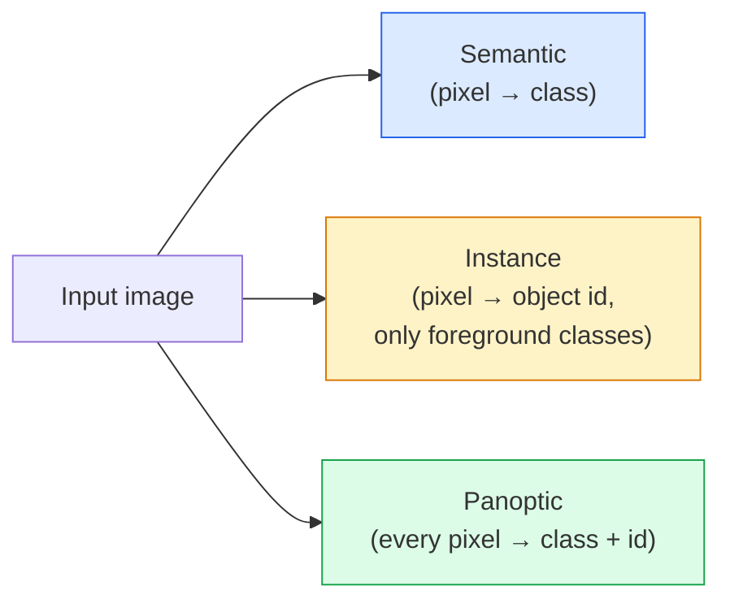
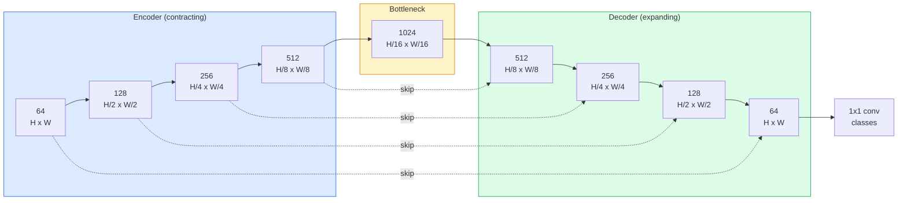

# Semantik Segmentasyon  U-Net

> Segmentasyon, her piksel için sınıflandırma yapılır. U-Net, aşağıdaki örnek kodlayıcı ile yukarıdaki örnek dekodörü arasında birleştirir ve bu olayı mümkün kılar.

**Type:** Build
**Languages:** Python
**Prerequisites:** Phase 4 Lesson 03 (CNNs), Phase 4 Lesson 04 (Image Classification)
**Time:** ~75 minutes

## Öğrenme hedefi
- 区分语义、实例 和泛光分区,并为给定问题选择正确任务
- PyTorch'te U-Net'i oluşturmak için, kodlayıcı blokları, şişe boynuzu, transpose konvulsiyonları ve at bağlantıları içerir.
-  pixel-akıllı çapraz entropiyi ∆ Dice kaybı, ve mevcut tıbbi ve endüstriyel segmentasyonun belirlenmiş kombinasyon kaybı
- 按类 解读 IoU 和 Dice metrikleri,并诊断低分是来自小物体回忆、限度精度,还是类不平衡

## 问题
Sınıflandırma için her resim 输出一个标签――检测对每张图像 输出少量框―― 分类对每像素 输出一个标签――对大小为`H x W`Bu, bir tür bir giriş, çıkış şekli.`H x W`(semantik) veya `H x W x N_instances`Bu, her görüntüde bir tane değil, milyonlarca öngörüm var demektir.

Bölümsel yapı neden neredeyse tüm yoğun tahmin vizyonunu desteklediğini açıkladı. 产品:medical imaging(tumor maskeleri) autonomous driving(road、lane、obstacle) satellite building footprints、crop boundaries) document parsing layout zones (eğitim alanları) robotics (kavranabilir bölgeler)  bu görevler bir nesneye geçemez  bir kutu çizmek için çözülmelidir; onlar doğru bir siluete gerektirir。

Yapısal sorun basit, ama çözülmesi kolay değildir: bir ağ gerekir aynı zamanda görüntü küresel bağlamı görmek için. Bu nasıl bir sahne türüdür? Yerel piksel ayrıntıları.

## 概念
### 语义 vs 实例 vs 全景



- **Semantic**Bu piksel yol, o piksel araba.
- **Instance**Bu piksel #3, o piksel #5, o piksel #5, o piksel #5, o piksel #5, o piksel #5, o piksel #5, o piksel #5, o piksel #5, o piksel #5, o piksel #5, o piksel #5, o piksel #5, o piksel #5, o piksel #3, o piksel #3, o piksel #3, o piksel #3, o piksel #3, o piksel #3, o piksel #3, o piksel #3, o piksel #3, o piksel #3, o piksel #3, o piksel #3, o piksel #3, o piksel #3, o piksel #3, o piksel #3, o piksel #3, o piksel #3, o piksel #3, o piksel #3, o piksel #3, o piksel #3, o piksel #3, o piksel #3, o piksel #3, o piksel #3, o piksel #3, o piksel #3, o piksel #3, o piksel #3, o piksel #3, o piksel #3, o piksel #3, o piksel #3, o piksel #3, o piksel #3, o piksel #3, o piksel #, o piksel #, o piksel #, o piksel #, o piksel #, o piksel #, o piksel #, o piksel #, o piksel #, o piksel #, o piksel #, o piksel #, o piksel #, o piksel #, o piksel # # # # # # # # # # # # # # # # # # # # # # # # # # # # # # # # # # # # # # # # # # # # # # # # # # # # # # # # # # # # # # # # # # # # # # # # # # # # # # # # # # # # # # # # # # # # # # # # # # # # # # # # # # # # # # # # # # # # # # # # # # # # # # # # # # # # # # # # # # # # # # # # # # # # # # # # # # # # # # # # # # # # # # # # # # # # # # # # # # # # # #
- **Panoptic**Bu iki kişi bir araya gelmek için: Her piksel bir sınıf etiketi, her örnek bir benzersiz kimlik elde, şeyler ve şeyler segmentlenmiştir.

Bu ders semantikleri kapsar.

### U-Net şekli



Encoder uzay çözünürlüğünü  yarım dört kez,并将频道 翻倍──decoder 反向执行:将空间 çözünürlüğünü 翻倍四次,并将频道 半减──Skip connections 会在每个解析上把匹配的编码功能与解码功能 进行连接──最终的1x1 conv 在全解析下将`64 -> num_classes`- Evet.

Neden bağlantı atlamak gerekli: Dekoder pixel seviyesindeki tahminleri çıkarmaya çalışırken, sadece çok küçük özellik haritalarını görür. Atlamak yok, kenarları doğru bir şekilde tespit edemez, çünkü bu bilgiler koder içinde sıkıştırılmıştır.

### Transposed vs. bilinear upsample

Dekodör                                                                                                                                                                                                                                                                                                                                                                                                                                                                                                                           

- **Transposed convolution**(`nn.ConvTranspose2d`)  可学习的 upsample──历史上的 U-Net 默认方案──如果步骤和内核尺寸 不能整除,可能产生棋盘文物──
- **Bilinear upsample + 3x3 conv** 平滑 upsample 后一个 conv──Artifacts 更少,parameters 更少,现在是现代默认方案──

İkinci olarak, gerçek projelerde görülür.

### Piksel şebekesi üstü çapraz entropisi

C sınıfları içeren semantik segmentasyon için, model çıkışı`(N, C, H, W)`❖ Hedef:`(N, H, W)`, tam sayı sınıfı kimliklerini içerir.

```
Loss = mean over (n, h, w) of -log( softmax(logits[n, :, h, w])[target[n, h, w]] )
```

PyTorch 中的 `F.cross_entropy`Bu şekli yeniden şekillendirmek zorunda değil.

### Çöp kaybı ve neden ihtiyacımız var

Çarşı entropi  eşitlikle her piksel için                                                                                                                                                                                                                                                                                                                                                                                                                                                                                                                  

Çöp kaybı  doğrudan tahmin maskası ile gerçek maske arasındaki üst üstelik  yoluyla bu sorunu çözmek için:

```
Dice(p, y) = 2 * sum(p * y) / (sum(p) + sum(y) + epsilon)
Dice_loss = 1 - Dice
```

İçlerinden `p`Bu bir sınıfın sigmoid/softmax olasılık haritası.`y`Bu, ikili temel gerçeklik maskasıdır. Sadece üst üste 完美时,損失 才为零. Çünkü oranlara dayanır, sınıf dengesizliği artık ilişkilidir.

实践中,使用 **combined loss**- ...

```
L = L_cross_entropy + lambda * L_dice       (lambda ~ 1)
```

Çarpışma entropi                                                                                                                                                                                                                                                                                                                                                                                                                                                                                                                         

### Değerlendirme ölçümleri

- **Pixel accuracy** 预测 正确的像素 百分比──计算便宜──与分类中的精度一样,不平衡数据上会失效──
- **IoU per class** Birlik üzerinde her sınıf maskesi'nin kesişişi; sınıflar arasında 求平均 = mIoU。
- **Dice (F1 on pixels)** 类似 IoU;`Dice = 2 * IoU / (1 + IoU)`❖Tıp görüntüleme daha iyi Dice, sürücü topluluğu daha iyi IoU;
- **Boundary F1**  Tahmin edilen sınırları ve temel gerçek sınırlarının yakınlığı ölçmek, küçük bir etkisi bile cezalandırılır.

Klass başına bir IOU rapor et, sadece bir IOU değil.  Ortalama IOU bir sınıfı sadece %15 kapsar, diğer dokuz sınıfın durumunun %85 olduğu durumdadır.

### Giriş çözünürlüğü 权衡

U-Net'in kodlayıcı çözünürlüğü  yarım dört kez azaltılacak, bu yüzden giriş 必須能被 16 整除──Tıp görüntüleri genellikle 512x512 veya 1024x1024──Autonom sürücü ürünler  2048x1024──U-Net'in bellek maliyeti 随`H * W * C_max`缩放,在1024x1024 且瓶

两个标准解决方案:
1. Kaynaklı 256x256 kapaklı kaynaklılık, sonra dikişle.
2. Genişletilmiş kıvrımlar ile şişe boynunu değiştirin, aynı zamanda daha yüksek uzaysal çözünürlükte kalın.

İlk model için 256x256 giriş ve 64 kanal tabanlı U-Net'i kullanarak 8 GB VRAM'da rahat bir şekilde antrenman yapabilirsiniz.


```figure
segmentation-flood
```

## Yapın onu.
### 步骤 1: Kodlayıcı blok

2 adet 3×3 konvoy, bir seri normı ve bir RELU.

```python
import torch
import torch.nn as nn
import torch.nn.functional as F

class DoubleConv(nn.Module):
    def __init__(self, in_c, out_c):
        super().__init__()
        self.net = nn.Sequential(
            nn.Conv2d(in_c, out_c, kernel_size=3, padding=1, bias=False),
            nn.BatchNorm2d(out_c),
            nn.ReLU(inplace=True),
            nn.Conv2d(out_c, out_c, kernel_size=3, padding=1, bias=False),
            nn.BatchNorm2d(out_c),
            nn.ReLU(inplace=True),
        )

    def forward(self, x):
        return self.net(x)
```

Bu blok tüm yol boyunca kullanılacak.`bias=False`Çünkü BN'nin beta'sı önyargıyı ele aldı.

### 步骤 2: Aşağı ve yukarı bloklar

```python
class Down(nn.Module):
    def __init__(self, in_c, out_c):
        super().__init__()
        self.net = nn.Sequential(
            nn.MaxPool2d(2),
            DoubleConv(in_c, out_c),
        )

    def forward(self, x):
        return self.net(x)


class Up(nn.Module):
    def __init__(self, in_c, out_c):
        super().__init__()
        self.up = nn.Upsample(scale_factor=2, mode="bilinear", align_corners=False)
        self.conv = DoubleConv(in_c, out_c)

    def forward(self, x, skip):
        x = self.up(x)
        if x.shape[-2:] != skip.shape[-2:]:
            x = F.interpolate(x, size=skip.shape[-2:], mode="bilinear", align_corners=False)
        x = torch.cat([skip, x], dim=1)
        return self.conv(x)
```

Sadece uzay şeklini kontrol et`shape[-2:]`) ölçüleri işleyebilir 16 整除的输入不能被;一个安全的`F.interpolate`Konkret bir şekilde, tıpkı normal bir şekilde, tıpkı normal bir şekilde, tıpkı normal bir şekilde, tıpkı normal bir şekilde, tıpkı normal bir şekilde, tıpkı normal bir şekilde, tıpkı normal bir şekilde, tıpkı normal bir şekilde, tıpkı normal bir şekilde, tıpkı normal bir şekilde, tıpkı tıpkı tıpkı tıpkı tıpkı tıpkı tıpkı tıpkı tıpkı tıpkı tıpkı tıpkı tıpkı tıpkı tıpkı tıpkı tıpkı tıpkı tıpkı tıpkı tıpkı tıpkı tıpkı tıpkı tıpkı tıpkı tıpkı tıpkı tıpkı tıpkı tıpkı tıpkı tıpkı tıpkı tıpkı tıpkı tıpkı tıpkı tıpkı tıpkı tıpkı tıpkı tıpkı tıpkı tıpkı tıpkı tıpkı tıpkı tıpkı tıpkı tıpkı tıpkı tıpkı tıpkı tıpkı tıpkı tıpkı tıpkı tıpkı tıpkı tıpkı tıpkı tıpkı tıpkı tıpkı tıpkı tıpkı tıpkı tıpkı tıpkı tıpkı tıpkı tıpkı tıpkı tıpkı tıpkı tıpkı tıpkı tıpkı tıpkı tıpkı tıpkı tıpkı tıpkı tıpkı tıpkı tıpkı tıpkı tıpkı tıpkı tıpkı tıpkı tıpkı tıpkı tıpkı tıpkı tıpkı tıpkı tıpkı tıpkı tıpkı tıpkı tıpkı tıpkı tıpkı tıpkı tıpkı tıpkı tıpkı tıpkı tıpkı tıpkı tıpkı tıpkı tıpkı tıpkı tıpkı tıpkı tıpkı tıpkı tıpkı tıpkı tıpkı tıpkı tıpkı tıpkı tıpkı tıpkı tıpkı tıpkı tıpkı tıpkı tıpkı tıpkı tıpkı tıpkı tıpkı tıpkı tıpkı tıpkı tıpkı tıpkı tıpkı tıpkı tıpkı

### 步骤 3: U-Net

```python
class UNet(nn.Module):
    def __init__(self, in_channels=3, num_classes=2, base=64):
        super().__init__()
        self.inc = DoubleConv(in_channels, base)
        self.d1 = Down(base, base * 2)
        self.d2 = Down(base * 2, base * 4)
        self.d3 = Down(base * 4, base * 8)
        self.d4 = Down(base * 8, base * 16)
        self.u1 = Up(base * 16 + base * 8, base * 8)
        self.u2 = Up(base * 8 + base * 4, base * 4)
        self.u3 = Up(base * 4 + base * 2, base * 2)
        self.u4 = Up(base * 2 + base, base)
        self.outc = nn.Conv2d(base, num_classes, kernel_size=1)

    def forward(self, x):
        x1 = self.inc(x)
        x2 = self.d1(x1)
        x3 = self.d2(x2)
        x4 = self.d3(x3)
        x5 = self.d4(x4)
        x = self.u1(x5, x4)
        x = self.u2(x, x3)
        x = self.u3(x, x2)
        x = self.u4(x, x1)
        return self.outc(x)

net = UNet(in_channels=3, num_classes=2, base=32)
x = torch.randn(1, 3, 256, 256)
print(f"output: {net(x).shape}")
print(f"params: {sum(p.numel() for p in net.parameters()):,}")
```

Çıktı biçimi `(1, 2, 256, 256)` Giriş alanının büyüklüğü ile aynı, içerir `num_classes`个 kanalları──在 `base=32`7.7M'lik parametreler.

### 4 adım: Kayıplar

```python
def dice_loss(logits, targets, num_classes, eps=1e-6):
    probs = F.softmax(logits, dim=1)
    targets_one_hot = F.one_hot(targets, num_classes).permute(0, 3, 1, 2).float()
    dims = (0, 2, 3)
    intersection = (probs * targets_one_hot).sum(dim=dims)
    denom = probs.sum(dim=dims) + targets_one_hot.sum(dim=dims)
    dice = (2 * intersection + eps) / (denom + eps)
    return 1 - dice.mean()


def combined_loss(logits, targets, num_classes, lam=1.0):
    ce = F.cross_entropy(logits, targets)
    dc = dice_loss(logits, targets, num_classes)
    return ce + lam * dc, {"ce": ce.item(), "dice": dc.item()}
```

Diz 按类 计算后再平均 (Macro Dice)`eps`防止 batch 中缺失某些类 时出现除零──

### 5 adım: IoU metrik

```python
@torch.no_grad()
def iou_per_class(logits, targets, num_classes):
    preds = logits.argmax(dim=1)
    ious = torch.zeros(num_classes)
    for c in range(num_classes):
        pred_c = (preds == c)
        true_c = (targets == c)
        inter = (pred_c & true_c).sum().float()
        union = (pred_c | true_c).sum().float()
        ious[c] = (inter / union) if union > 0 else torch.tensor(float("nan"))
    return ious
```

C'nin vektörüne geri dönmek.`nan`标记批 中缺失类  计算 mIoU 时不要把这些值纳入平均――

### 步骤 6: Sonundan sona doğru doğrulama için sentetik veri kümesi

Renkli arka planlar üzerinde şekil üretmek, ağın piksel rengi yerine şekil öğrenmesi gerekir.

```python
import numpy as np
from torch.utils.data import Dataset, DataLoader

def synthetic_segmentation(num_samples=200, size=64, seed=0):
    rng = np.random.default_rng(seed)
    images = np.zeros((num_samples, size, size, 3), dtype=np.float32)
    masks = np.zeros((num_samples, size, size), dtype=np.int64)
    for i in range(num_samples):
        bg = rng.uniform(0, 1, (3,))
        images[i] = bg
        masks[i] = 0
        num_shapes = rng.integers(1, 4)
        for _ in range(num_shapes):
            cls = int(rng.integers(1, 3))
            color = rng.uniform(0, 1, (3,))
            cx, cy = rng.integers(10, size - 10, size=2)
            r = int(rng.integers(4, 12))
            yy, xx = np.meshgrid(np.arange(size), np.arange(size), indexing="ij")
            if cls == 1:
                mask = (xx - cx) ** 2 + (yy - cy) ** 2 < r ** 2
            else:
                mask = (np.abs(xx - cx) < r) & (np.abs(yy - cy) < r)
            images[i][mask] = color
            masks[i][mask] = cls
        images[i] += rng.normal(0, 0.02, images[i].shape)
        images[i] = np.clip(images[i], 0, 1)
    return images, masks


class SegDataset(Dataset):
    def __init__(self, images, masks):
        self.images = images
        self.masks = masks

    def __len__(self):
        return len(self.images)

    def __getitem__(self, i):
        img = torch.from_numpy(self.images[i]).permute(2, 0, 1).float()
        mask = torch.from_numpy(self.masks[i]).long()
        return img, mask
```

Üç sınıf: arka plan (0) 、daires (1) 、 kare (2) ⋅ Ağ 必須学会区分形──

### 步骤 7: Eğitim döngüsü

```python
def train_one_epoch(model, loader, optimizer, device, num_classes):
    model.train()
    loss_sum, total = 0.0, 0
    iou_sum = torch.zeros(num_classes)
    for x, y in loader:
        x, y = x.to(device), y.to(device)
        logits = model(x)
        loss, _ = combined_loss(logits, y, num_classes)
        optimizer.zero_grad()
        loss.backward()
        optimizer.step()
        loss_sum += loss.item() * x.size(0)
        total += x.size(0)
        iou_sum += iou_per_class(logits, y, num_classes).nan_to_num(0)
    return loss_sum / total, iou_sum / len(loader)
```

Sintez veri kümesi 上运行 10-30 dönem, observe shape classes 爬上 mIoU 0.9 以上──注意,`nan_to_num(0)`Zamanı: 0; sınıf başına doğru bir IOU elde etmek için, değerlendirme aşamasında varlıklara göre yapılması, maske yapılması,`torch.nanmean`Bu yüzden, bu kadar çok şey var.

## Kullan
 üretimi için,`segmentation_models_pytorch`("smp") kullanılarak herhangi bir meşale görme veya zaman omurgası 封装了所有标准分割架构──三行代码:

```python
import segmentation_models_pytorch as smp

model = smp.Unet(
    encoder_name="resnet34",
    encoder_weights="imagenet",
    in_channels=3,
    classes=3,
)
```

实际工作中 ayrıca anlamak gerekir:
- **DeepLabV3+**Uygulama ile birlikte, uydu ve sürüş verileri üzerinde daha hızlı bir şekilde çalışmak için en yüksek havuz tabanlı en düşük örneklemeyi kullanın.
- **SegFormer**Bu konfor kodlayıcıları hiyerarşik transformatör olarak değiştirmek için kullanılır.
- **Mask2Former**- Ne ?**OneFormer**Ünlü bir mimaride, bir semantik ∞ instance 和 panoptic segmentasyon

Bu üç kişi arasında.`smp`Ya da`transformers`İçinde drop-in değiştirme olarak kullanılabilir,并使用相同的数据载体──

## - Söyle.
本课产 出:

- `outputs/prompt-segmentation-task-picker.md` Bir istek, semantik ∞ instance ve panoptik segmentasyon ∞ arasında seçim yapmak için kullanılır,并为给定任务命名架构──
- `outputs/skill-segmentation-mask-inspector.md` Bir beceri, sınıf dağılımını rapor etmek için, tahmin edilen maske istatistiklerini ve düşük tahmin edilen veya sınırları bulanık olan sınıfları oluşturmak için.

## 练习
1. **(Easy)**Çıktırma görevi için`bce_dice_loss`                                                                                                                                                                                                                                                              
2. **(Medium)**- Ben de .`nn.Upsample + conv`替换为  yukarı blok`nn.ConvTranspose2d`                                                                                                                                                                                                                                                              
3. **(Hard)**選取一個真實分區數據組(Oxford-IIIT Hayvanlar、Küçük bölünmüş şehir manzaraları, veya bir tıbbi alt kümeler),并將 U-Net 訓練到距離 `smp.Unet`Referans 2  IoU puanından fazla değildir.

## 关键术语
| Term | What people say | What it actually means |
|------|----------------|----------------------|
| Semantic segmentation | “标注每个 pixel” | 对每个 pixel 进行 C classes 的 Classification；同一 class 的 instances 会合并 |
| Instance segmentation | “标注每个 object” | 分离同一 class 的不同 instances；仅 foreground |
| Panoptic segmentation | “Semantic + instance” | 每个 pixel 得到一个 class；每个 thing instance 还得到一个唯一 id |
| Skip connection | “U-Net bridge” | 将 encoder features concatenate 到匹配 resolution 的 decoder features 中；保留 high-frequency detail |
| Transposed conv | “Deconvolution” | 可学习的 upsampling；可能产生 checkerboard artifacts |
| Dice loss | “Overlap loss” | 1 - 2|A ∩ B| / (|A| + |B|)；直接优化 mask overlap，并且对 class imbalance 鲁棒 |
| mIoU | “Mean intersection over union” | 跨 classes 平均 IoU；segmentation 的 community-standard metric |
| Boundary F1 | “Boundary accuracy” | 只在 boundary pixels 上计算的 F1 score；对 precision-critical tasks 很重要 |

## 延伸阅读
- [U-Net: Convolutional Networks for Biomedical Image Segmentation (Ronneberger et al., 2015)](https://arxiv.org/abs/1505.04597) Asıl kağıt; herkesin tekrar yazması 2. sayfada
- [Fully Convolutional Networks (Long et al., 2015)](https://arxiv.org/abs/1411.4038) 首个将 segmentation 变成端到端 conv problem of paper
- [segmentation_models_pytorch](https://github.com/qubvel/segmentation_models.pytorch) üretim segmentasyonu; tüm standart mimarisi ve tüm standart kaybı içerir
- [Lessons learned from training SOTA segmentation (kaggle.com competitions)](https://www.kaggle.com/code/iafoss/carvana-unet-pytorch) 讲解为什么TTA、伪标签和类权重在真实数据上很重要
