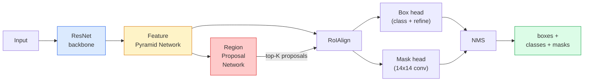

# Durum Segmentasyonu  Maske R-CNN

> Faster R-CNN dedektörü ve küçük bir maske dalı için örnek segmentasyonu elde ediyoruz. RoIAlign'de zorluk çekiyor.

**Type:** Build + Learn
**Languages:** Python
**Prerequisites:** Phase 4 Lesson 06 (YOLO), Phase 4 Lesson 07 (U-Net)
**Time:** ~75 minutes

## Öğrenme hedefi
- 端到端追踪 Mask R-CNN 架构: sırt kemiri、FPN、RPN、RoIAlign、 kutu başı、mask başı
- RoIPool'un neden kullanılmadığını açıkladı.
- Torchvision'ı kullanın `maskrcnn_resnet50_fpn_v2`Önceden eğitilmiş model 生成生产质量 örnek maskeleri,并正确读取它的输出格式
- 通過替換盒 和面具頭,并保持脊椎 结,在小型自定义数据集上精细调面具 R-CNN

## 问题
Semantik segmentasyon her sınıf için bir maskesi verir. Instansa segmentasyonu her nesne için bir maskesi verir. İki nesne bile aynı sınıfa ait olsa bile.

Mask R-CNN (He et al., 2017) ⇒ Anis segmentasyonu yoluyla 重新表述为检测-plus-a-mask来解决这个问题――Bu tasarım sonradan çok basit oldu, çünkü beş yıl boyunca neredeyse her anis segmentasyonu 论文都是 Mask R-CNN'in变体, torchvision uygulaması ise bugüne kadar küçük veri kümelerinin üretimi için bir tercih olarak kalmıştır.

困难的工程问题是采样: bir önerme kutusu içinde sabit büyüklükteki özellik bölgesi nasıl kesilir, bu kutunun köşeli noktası piksel sınırları ile uyumlu değilse? Bu adım hata yapar, her yerde birkaç mAP kaybedecektir.

## 概念
### Mimarlık



需要理解五个部分:

1. **Backbone** ResNet-50 veya ResNet-101                                                                                                                                                                                                                                                          
2. **FPN (Feature Pyramid Network)** üst-eğen + yan bağlantılar, her seviyeye C kanallarının anlamı bol özelliklere sahip olmayı sağlar.
3. **RPN (Region Proposal Network)** Bir küçük konfor başlığı, her bir demir pozisyonunda 上预测 Burada bir nesne var mı?以及我该如何精细盒?──每张图像产生约1000 个建议──
4. **RoIAlign**                                                                                                                                                                                                                                                              
5. **Heads** 两层 box head,用于精细盒并选择类;再加一个小型 conv head,为每一个提案 输出一个 `28x28`İkili maske.

### RoIAlign neden RoIPool değil?

İlk Fast R-CNN RoIPool'u kullanarak, önerme kutusunu bir çubuğa ayırarak, her hücre içinde en büyük özelliği alır, tüm koordinatları toplam sayıya çevirir. Bu yuvarlaklık, özellik haritasını giriş piksel koordinatlarıyla en az bir tam özellik haritası pikselinin yerini alır.

```
RoIPool:
  box (34.7, 51.3, 98.2, 142.9)
  round -> (34, 51, 98, 142)
  split grid -> round each cell boundary
  misalignment accumulates at every step

RoIAlign:
  box (34.7, 51.3, 98.2, 142.9)
  sample at exact float coordinates using bilinear interpolation
  no rounding anywhere
```

RoIAlign 能在 COCO 上免费提升 3-4 个点的面具 AP──现在每个重视位置的探测器都会使用它,包括YOLOv7 seg、RT-DETR、Mask2Former──

### RPN'de bir paragraf

Karakteristik haritasının her yerinde K 个不同尺寸和形状的 ancor boxları yerleştirmek. 个个 ancor 预测一个对象性分数,以及一个回归抵消,用来将 ancor 转变为更贴合对象的盒子. 个 个 个 个 个 个 个 个 个 个 个 个 个 个 个 个 个 个 个 个 个 个 个 个 个 个 个 个 个 个 个 个 个 个 个 个 个 个 个 个 个 个 个 个 个 个 个 个 个 个 个 个 个 个 个 个 个 个 个 个 个 个 个 个 个 个 个 个 个 个 个 个 个 个 个 个 个 个 个 个 个 个 个 个 个 个 个 个 个 个 个 个 个 个 个 个 个 个 个 个 个 个 个 个 个 个 个 个 个 个 个 个 个 个 个 个 个 个 个 个 个 个 个 个 个 个 个 个 个 个 个 个 个 个 个 个 个 个 个 个 个 个 个 个 个 个 个 个 个 个 个 个 个 个 个 个 个 个 个 个 个 个 个 个 个 个 个 个 个 个 个 个 个 个 个 个 个 个 个 个 个 个 个 个 个 个 个 个 个 个 个 个 个 个 个 个 个 个 个 个 个 个 

### Maske başı

Her öneride, maske başı çok küçük bir FCN'dir.`28x28`çözünürlük 下生成 `num_classes`个输出频道──只保留与预测类对应的频道;其他频道会被忽略──这将掩盖预测与分类解──

28x28 maskesini örnekle, ilk piksel boyutunu önermeye koy, son ikili maskeyi elde edeceksin.

### Kayıplar

R-CNN maskası 4 çeşit kayıplara sahip.

```
L = L_rpn_cls + L_rpn_box + L_box_cls + L_box_reg + L_mask
```

- `L_rpn_cls`- Evet .`L_rpn_box` RPN önerilerinin nesnelliği + kutu Geri dönüş
- `L_box_cls` baş sınıflandırıcı 上针对 (C+1) sınıfları(包含 background) 的交叉
- `L_box_reg`Baş kutuyu onarmak için.
- `L_mask` 28x28 maske çıkışı 上的个像素双交进化──

Her kayıpın kendi belirlenmiş yükü vardır; torchvision uygulaması onları yapılandırıcı argümanlar olarak ortaya çıkaracaktır.

### Çıktı biçimi

`torchvision.models.detection.maskrcnn_resnet50_fpn_v2`Bir dizeyi geri çevirin, bir dizeyi karşılaştırın:

```
{
    "boxes":  (N, 4) in (x1, y1, x2, y2) pixel coordinates,
    "labels": (N,) class IDs, 0 = background so indices are 1-based,
    "scores": (N,) confidence scores,
    "masks":  (N, 1, H, W) float masks in [0, 1] — threshold at 0.5 for binary,
}
```

maske 已是 full image resolution──28x28 baş çıkışı 已在内部完成 upsample──


```figure
cv3-roialign-sampling
```

## Yapın onu.
### 步骤 1: Kötüden başlayın

Mask R-CNN'in bu bileşeni, kodla anlamak için yazılı bir tanımlama daha basit bir şekilde kullanılır.

```python
import torch
import torch.nn.functional as F

def roi_align_single(feature, box, output_size=7, spatial_scale=1 / 16.0):
    """
    feature: (C, H, W) single-image feature map
    box: (x1, y1, x2, y2) in original image pixel coordinates
    output_size: side of the output grid (7 for box head, 14 for mask head)
    spatial_scale: reciprocal of the feature map stride
    """
    C, H, W = feature.shape
    x1, y1, x2, y2 = [c * spatial_scale - 0.5 for c in box]
    bin_w = (x2 - x1) / output_size
    bin_h = (y2 - y1) / output_size

    grid_y = torch.linspace(y1 + bin_h / 2, y2 - bin_h / 2, output_size)
    grid_x = torch.linspace(x1 + bin_w / 2, x2 - bin_w / 2, output_size)
    yy, xx = torch.meshgrid(grid_y, grid_x, indexing="ij")

    gx = 2 * (xx + 0.5) / W - 1
    gy = 2 * (yy + 0.5) / H - 1
    grid = torch.stack([gx, gy], dim=-1).unsqueeze(0)
    sampled = F.grid_sample(feature.unsqueeze(0), grid, mode="bilinear",
                            align_corners=False)
    return sampled.squeeze(0)
```

Her sayısal değer ikilik örneğe göre bir konumdan geliyor.

### 步骤 2: Torchvision'in RoIAlign'e karşılaştır

```python
from torchvision.ops import roi_align

feature = torch.randn(1, 16, 50, 50)
boxes = torch.tensor([[0, 10, 20, 100, 90]], dtype=torch.float32)  # (batch_idx, x1, y1, x2, y2)

ours = roi_align_single(feature[0], boxes[0, 1:].tolist(), output_size=7, spatial_scale=1/4)
theirs = roi_align(feature, boxes, output_size=(7, 7), spatial_scale=1/4, sampling_ratio=1, aligned=True)[0]

print(f"shape ours:   {tuple(ours.shape)}")
print(f"shape theirs: {tuple(theirs.shape)}")
print(f"max|diff|:    {(ours - theirs).abs().max().item():.3e}")
```

- Evet .`sampling_ratio=1`Ve`aligned=True`时,两者能在 `1e-5`İçeride uyumlu.

### 步骤 3: Önceden eğitilmiş bir maske R-CNN yükleyin

```python
import torch
from torchvision.models.detection import maskrcnn_resnet50_fpn_v2, MaskRCNN_ResNet50_FPN_V2_Weights

model = maskrcnn_resnet50_fpn_v2(weights=MaskRCNN_ResNet50_FPN_V2_Weights.DEFAULT)
model.eval()
print(f"params: {sum(p.numel() for p in model.parameters()):,}")
print(f"classes (including background): {len(model.roi_heads.box_predictor.cls_score.out_features * [0])}")
```

46M parametreleri,91 sınıflar(COCO)。第一个类(id 0) 背景;模型实际检测所有内容都从id 1 开始。

### 步骤 4: Tahminleri çalıştır

```python
with torch.no_grad():
    x = torch.randn(3, 400, 600)
    predictions = model([x])
p = predictions[0]
print(f"boxes:  {tuple(p['boxes'].shape)}")
print(f"labels: {tuple(p['labels'].shape)}")
print(f"scores: {tuple(p['scores'].shape)}")
print(f"masks:  {tuple(p['masks'].shape)}")
```

Maske tensorunun şekli `(N, 1, H, W)`△ 0.5 ≠ e eşiği için ikili maske elde edilir:

```python
binary_masks = (p['masks'] > 0.5).squeeze(1)  # (N, H, W) boolean
```

### 步骤 5: Özel sınıf sayımı için başları değiştirin

常见的精细调配方:复用脊椎、FPN 和 RPN; iki sınıflandırıcı başının değiştirilmesi──

```python
from torchvision.models.detection.faster_rcnn import FastRCNNPredictor
from torchvision.models.detection.mask_rcnn import MaskRCNNPredictor

def build_custom_maskrcnn(num_classes):
    model = maskrcnn_resnet50_fpn_v2(weights=MaskRCNN_ResNet50_FPN_V2_Weights.DEFAULT)
    in_features = model.roi_heads.box_predictor.cls_score.in_features
    model.roi_heads.box_predictor = FastRCNNPredictor(in_features, num_classes)
    in_features_mask = model.roi_heads.mask_predictor.conv5_mask.in_channels
    hidden_layer = 256
    model.roi_heads.mask_predictor = MaskRCNNPredictor(in_features_mask, hidden_layer, num_classes)
    return model

custom = build_custom_maskrcnn(num_classes=5)
print(f"custom cls_score.out_features: {custom.roi_heads.box_predictor.cls_score.out_features}")
```

`num_classes`必須包含背景类,因此一个有4个对象类的数据集应使用 `num_classes=5`- Evet.

### 步骤 6: Eğitim gerektirmeyenleri dondur

Küçük veri kümelerinde, 结脊椎和 FPN── sadece RPN nesneliği + gerileme ve iki başı öğrenmek için.

```python
def freeze_backbone_and_fpn(model):
    # torchvision Mask R-CNN packs the FPN inside `model.backbone` (as
    # `model.backbone.fpn`), so iterating `model.backbone.parameters()` covers
    # both the ResNet feature layers and the FPN lateral/output convs.
    for p in model.backbone.parameters():
        p.requires_grad = False
    return model

custom = freeze_backbone_and_fpn(custom)
trainable = sum(p.numel() for p in custom.parameters() if p.requires_grad)
print(f"trainable after freeze: {trainable:,}")
```

500 görüntü verisi üzerinde, bu, alım ve aşırı uyum arasındaki farkı gösterir.

## Kullan
R-CNN'in tam eğitim döngüsü sadece 40 行, ve farklı görevler arasında temel olarak değişmez: veri kümelerini değiştirmek, sonra eğitim yapmaya başlamak.

```python
def train_step(model, images, targets, optimizer):
    model.train()
    loss_dict = model(images, targets)
    losses = sum(loss for loss in loss_dict.values())
    optimizer.zero_grad()
    losses.backward()
    optimizer.step()
    return {k: v.item() for k, v in loss_dict.items()}
```

`targets`Liste, her resim için bir diğeri içermelidir.`boxes`- Evet.`labels`和 `masks`(As  olarak)`(num_instances, H, W)`Biner tenzorlar) ――模型在训练中返回四个损失的句,在 eval 时返回预测列表,由 `model.training`Karar ver.

`pycocotools`Bu yüzden, bu iki rakamın birinde bir kutu başı ya da bir maske başı olduğunu belirlemek için iki rakamın olması gerekir.

## - Söyle.
Bu ders:

- `outputs/prompt-instance-vs-semantic-router.md` Bir prompt, üç soruyu ortaya koyacak,并选择实例 vs. semantic vs. panoptic,以及精确的起始模型──
- `outputs/skill-mask-rcnn-head-swapper.md`Bir beceri, yeni bir beceri.`num_classes`, , istenen meşale görme algılama modeli için 生成 交换头的10 行代码──

## 练习
1. **(Easy)**100 adet rastgele kutuda kullanın.`torchvision.ops.roi_align`验证你的RoIAlign──报告最大绝对差值──同时运行RoIPool(pre-2017 davranışları),并显示它在靠近边界的盒中上会偏离约1-2个特征图像──
2. **(Medium)**50 resimden oluşan özel veri kümesi içinde, herhangi iki sınıf: balon, balık, delik, logo) üzerinde ince ayarlama yapın.`maskrcnn_resnet50_fpn_v2`结脊椎,训练20epoca,报告面具 AP@0.5──
3. **(Hard)**R-CNN'in maske başını 56x56 olarak değiştirmek yerine 28x28 olarak değiştirmek için kullanılır.

## 关键术语
| Term | What people say | What it actually means |
|------|----------------|----------------------|
| Mask R-CNN | “Detection plus masks” | Faster R-CNN + 一个小型 FCN head，为每个 proposal 的每个 class 预测一个 28x28 mask |
| FPN | “Feature pyramid” | top-down + lateral connections，让每个 stride level 都有 C channels 的语义丰富 features |
| RPN | “Region proposer” | 一个小型 conv head，每张图像生成约 1000 个 object/no-object proposals |
| RoIAlign | “No-rounding crop” | 从任意 float-coordinate box 中以 bilinear 方式采样固定大小的 feature grid |
| RoIPool | “Pre-2017 crop” | 与 RoIAlign 用途相同，但会 round box coordinates；已经过时 |
| Mask AP | “Instance mAP” | 使用 mask IoU 而不是 box IoU 计算的 average precision；COCO instance segmentation metric |
| Binary mask head | “Per-class mask” | 为每个 proposal 的每个 class 预测一个 binary mask；只保留 predicted class 的 channel |
| Background class | “Class 0” | 兜底的 “no object” class；真实 classes 的 indices 从 1 开始 |

## 延伸阅读
- [Mask R-CNN (He et al., 2017)](https://arxiv.org/abs/1703.06870) 论文; About RoIAlign'ın 3. bölümünün önemli bir okuma
- [FPN: Feature Pyramid Networks (Lin et al., 2017)](https://arxiv.org/abs/1612.03144) FPN 论文; her modern dedektör bunu kullanır
- [torchvision Mask R-CNN tutorial](https://pytorch.org/tutorials/intermediate/torchvision_tutorial.html) ince ayarlama döngüsü
- [Detectron2 model zoo](https://github.com/facebookresearch/detectron2/blob/main/MODEL_ZOO.md) 生产级 uygulamalar, neredeyse tüm tespit ve segmentasyon 变体の訓練された重量
