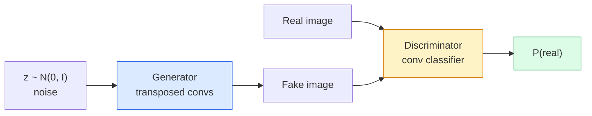
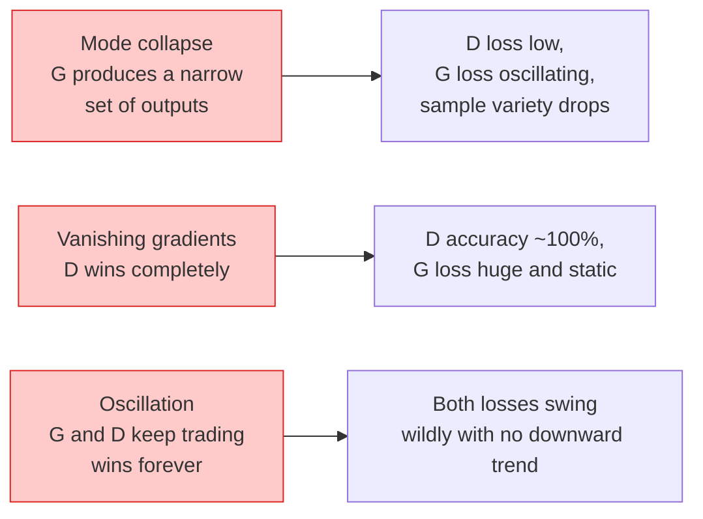

# Resim Yükleme  GAN

> GAN iki sinir ağı arasında sabit bir bağlantıdır. Birinin çizmesi sorumlu, birinin de değerlendirmesi sorumlu.

**Type:** Build
**Languages:** Python
**Prerequisites:** Phase 4 Lesson 03 (CNNs), Phase 3 Lesson 06 (Optimizers), Phase 3 Lesson 07 (Regularization)
**Time:** ~75 分钟

## Öğrenme hedefi
- 解释 发电机与歧视者 之间的最小x 博,以及为什么平衡对应于 p_model = p_data
- PyTorch'te DCGAN'ı gerçekleştirin ve 60 行 içinde 32x32                                                                                                                                                                                                                                                                                                                                                                                                                                                                                                          
- GAN 訓練: doymayan kaybı、spektral norm、TTUR (iki kez güncelleme kuralı)
- 读取训练曲线,区分健康收与模式 çöküş、oscillation、diskriminator-wins-tamamen

## 问题
Classification Church Network images will be mapped onto tags── Generation 则反转了这个问题:采样出看起来像来自同一分布的新图像──这里没有可用对比的差异正确输出;只有一个你想模仿的分布──

標準 Loss Fungsi ((MSE、cross-entropy)) bu örneğin gerçek dağılımdan olup olmadığını ölçemez.

GAN'lar (Goodfellow et al., 2014) bu çerçeveyi tanımladı. 2018 yılına kadar, StyleGAN  zaten fotoğraf ile üretilebilmiştir 1024x1024 insan yüzünü ayırt etmek zor.

## 概念
### İki ağ



**generator**G 接收一个噪音矢量 `z`Ve bir resim çıkardı.**discriminator**D 接收一张图像并输出单个标量:该图像为真的概率──

### Oyun

G 希望 D 犯错――D 希望自己判断正确――形式化地说:

```
min_G max_D  E_x[log D(x)] + E_z[log(1 - D(G(z)))]
```

D tam olarak gerçekte olduğunu gösteriyor.`log D(real)`) ve sahte`log (1 - D(fake))`D = = = = = = = = = = = = = = = = = = = = = = = = = = = = = = = = = = = = = = = = = = = = = = = = = = = = = = = = = = = = = = = = = = = = = = = = = = = = = = = = = = = = = = = = = = = = = = = = = = = = = = = = = = = = = = = = = = = = = = = = = = = = = = = = = = = = = = = = = = = = = = = = = = = = = = = = = = = = = = = = = = = = = = = = = = = = = = = = = = = = = = = = = = = = = = = = = = = = = = = = = = = = = = = = = = = = = = = = = = = = = = = = = = = = = = = = = = = = = = = = = = = = = = = = = = = = = = = = = = = = = = = = = = = = = = = = = = = = = = = = = = = = = = = = = = = = = = = = = = = = = = = = = = = = = = = = = = = = = = = = = = = = = = = = = = = = = = = = = = = = = = = = = = = = = = = = = = = = = = = = = = = = = = = = = = = = = = = = = = = = = = = = = = = = = = = = = = = = = = = = = = = = = = = = = = = = = = = = = = = = = = = = = = = = = = = = = = = = = = = = = = = = = = = = = = = = = = = = = = = = = = = = = = = = = = = = = = = = = = = = = = = = = = = = = = = = = = = = = = = = = = = = = = = = =`D(G(z))`Çok yüksek.

İyi arkadaşım bu minimumun bir bütünsel dengede olduğunu kanıtladı.`p_G = p_data`D. tüm konumlarda 0.5 çıkış yaparak, gerçek dağılım ile dağılım arasındaki Jensen-Shannon farklılığı ortaya çıkar.

### Doymayan kayıplar

Yukarıdaki form, sayısal değerlerde dengesiz.`D(G(z))`Her sahteye sıfır yaklaşıyor.`log(1 - D(G(z)))`G'nin Gradient 会消失──修复方法:翻转 G'in Kaybı──

```
L_D = -E_x[log D(x)] - E_z[log(1 - D(G(z)))]
L_G = -E_z[log D(G(z))]                          # non-saturating
```

Şimdi şimdi`D(G(z))`接近零时,G 的损失 很大,Gradient 也有信息量──每个现代GAN都使用这个变体进行训练──

### DCGAN mimarisi kuralları

Radford、Metz、Chintala (2015) çok yıllık başarısız deneylerin 5 kural haline gelmesini ve GAN ı daha kararlı hale getirmesini sağlayacak:

1. İkisi de aynı şekilde.
2. Generator ve ayrımcı arasında her şey parti normunu kullanır, ancak G'in çıkışı ve D'in girişleri hariçtir.
3. Daha derin bir yapı içinde tamamen bağlantılı katmanların kaldırılması
4. G 在除输出层外所有层使用 ReLU(输出层用 tanh,将输出限制在 [-1, 1])。
5. D 在所有层使用LeakyReLU(negative_slope=0.2)。

Her gün, stilGAN, BigGAN, GigaGAN) bu kurallardan çıkıp bir kez değişti.

### Başarısızlık modları  ve özellikleri



- **Mode collapse**G 找到一张能骗过 D 的图像,然后只生成它──修复:加入迷你批次歧视、光谱规范,或标签条件──
- **Discriminator wins**D 变强太快,G 的 Gradient 消失──修复:减小 D、降低 D öğrenme hızı,或对真实标签 应用标签滑滑──
- **Oscillation**İki ağ sürekli birbirinden üstünlük kazanır, ancak dengeleyen bir şekilde yaklaşmazlar.

### Değerlendirme

GAN'lar gerçek değil, nasıl bileceksin?

- **Sample inspection** her dönem 終時直接查看 64 个样本──不可妥协──
- **FID (Fréchet Inception Distance)** gerçek toplam ve oluşturma toplamının başlangıç-v3 özellik dağılımları arasındaki mesafe──越低越好──社区标准──
- **Inception Score**较旧,也更脆弱; öncelikle FID kullanın
- **Precision/Recall for generative models**分别衡量质量 (doğrulık) 和覆盖度 (hayat et) ──比单独使用 FID 更有信息量──

Küçük sentetik veriler için, örnek denetimi yeterli.


```figure
cv-gan-image
```

## Yapın onu.
### 步骤 1: jeneratör

Küçük bir DCGAN jeneratörü, 64 维 gürültü alıyor ve bir 张 32x32 图像 üretmektedir.

```python
import torch
import torch.nn as nn

class Generator(nn.Module):
    def __init__(self, z_dim=64, img_channels=3, feat=64):
        super().__init__()
        self.net = nn.Sequential(
            nn.ConvTranspose2d(z_dim, feat * 4, kernel_size=4, stride=1, padding=0, bias=False),
            nn.BatchNorm2d(feat * 4),
            nn.ReLU(inplace=True),
            nn.ConvTranspose2d(feat * 4, feat * 2, kernel_size=4, stride=2, padding=1, bias=False),
            nn.BatchNorm2d(feat * 2),
            nn.ReLU(inplace=True),
            nn.ConvTranspose2d(feat * 2, feat, kernel_size=4, stride=2, padding=1, bias=False),
            nn.BatchNorm2d(feat),
            nn.ReLU(inplace=True),
            nn.ConvTranspose2d(feat, img_channels, kernel_size=4, stride=2, padding=1, bias=False),
            nn.Tanh(),
        )

    def forward(self, z):
        return self.net(z.view(z.size(0), -1, 1, 1))
```

4 adet transposed konvoy, her biri kullanıyor.`kernel_size=4, stride=2, padding=1`Bu şekilde, boşluk boyutunu ikiye katlayabilirler.

### 步骤 2: Ayrımcılık

Yüklü konvoylar, son olarak bir sinyal çıkardı.

```python
class Discriminator(nn.Module):
    def __init__(self, img_channels=3, feat=64):
        super().__init__()
        self.net = nn.Sequential(
            nn.Conv2d(img_channels, feat, kernel_size=4, stride=2, padding=1),
            nn.LeakyReLU(0.2, inplace=True),
            nn.Conv2d(feat, feat * 2, kernel_size=4, stride=2, padding=1, bias=False),
            nn.BatchNorm2d(feat * 2),
            nn.LeakyReLU(0.2, inplace=True),
            nn.Conv2d(feat * 2, feat * 4, kernel_size=4, stride=2, padding=1, bias=False),
            nn.BatchNorm2d(feat * 4),
            nn.LeakyReLU(0.2, inplace=True),
            nn.Conv2d(feat * 4, 1, kernel_size=4, stride=1, padding=0),
        )

    def forward(self, x):
        return self.net(x).view(-1)
```

Son bir konaklama .`4x4`Özellik haritası 降到 `1x1`◊输出是每张图像一个标量; △ 输出是每张图像一个标量; △ 输出是每张图像一个标量; △ 输出是每张图像一个标量; △ 输出是每张图像一个标量; △ 输出是每张图像一个标量; △ 输出是每张图像一个标量; △ 输出是每张图像一个标量; △ 输出是每张图像一个标量; △ 输出是每张图像一个标量; △ 输出是每张图像一个标量; △ 输出是每张图像一个标量; △ △ △ △ △ △ △ △ △ △ △ △ △ △ △ △ △ △ △ △ △ △ △ △ △ △ △ △ △ △ △ △ △ △ △ △ △ △ △ △ △ △ △ △ △ △ △ △ △ △ △ △ △ △ △ △ △ △ △ △ △ △ △ △ △ △ △ △ △ △ △ △ △ △ △ △ 

### 步骤 3: Eğitim Adımı

交替执行: Her parti önce bir kez D, tekrar bir kez G..

```python
import torch.nn.functional as F

def train_step(G, D, real, z, opt_g, opt_d, device):
    real = real.to(device)
    bs = real.size(0)

    # D step
    opt_d.zero_grad()
    d_real = D(real)
    d_fake = D(G(z).detach())
    loss_d = (F.binary_cross_entropy_with_logits(d_real, torch.ones_like(d_real))
              + F.binary_cross_entropy_with_logits(d_fake, torch.zeros_like(d_fake)))
    loss_d.backward()
    opt_d.step()

    # G step
    opt_g.zero_grad()
    d_fake = D(G(z))
    loss_g = F.binary_cross_entropy_with_logits(d_fake, torch.ones_like(d_fake))
    loss_g.backward()
    opt_g.step()

    return loss_d.item(), loss_g.item()
```

D adım Orta `G(z).detach()`至关重要: 我们不希望在更新 D 时 Gradient 流入 G ⋅ unutmayın bu klasik yeni öğrenci hataları ⋅

### 4 adım: Sintitik şekillerde 上运行完整训练循环

```python
from torch.utils.data import DataLoader, TensorDataset
import numpy as np

def synthetic_images(num=2000, size=32, seed=0):
    rng = np.random.default_rng(seed)
    imgs = np.zeros((num, 3, size, size), dtype=np.float32) - 1.0
    for i in range(num):
        r = rng.uniform(6, 12)
        cx, cy = rng.uniform(r, size - r, size=2)
        yy, xx = np.meshgrid(np.arange(size), np.arange(size), indexing="ij")
        mask = (xx - cx) ** 2 + (yy - cy) ** 2 < r ** 2
        color = rng.uniform(-0.5, 1.0, size=3)
        for c in range(3):
            imgs[i, c][mask] = color[c]
    return torch.from_numpy(imgs)

device = "cuda" if torch.cuda.is_available() else "cpu"
data = synthetic_images()
loader = DataLoader(TensorDataset(data), batch_size=64, shuffle=True)

G = Generator(z_dim=64, img_channels=3, feat=32).to(device)
D = Discriminator(img_channels=3, feat=32).to(device)
opt_g = torch.optim.Adam(G.parameters(), lr=2e-4, betas=(0.5, 0.999))
opt_d = torch.optim.Adam(D.parameters(), lr=2e-4, betas=(0.5, 0.999))

for epoch in range(10):
    for (batch,) in loader:
        z = torch.randn(batch.size(0), 64, device=device)
        ld, lg = train_step(G, D, batch, z, opt_g, opt_d, device)
    print(f"epoch {epoch}  D {ld:.3f}  G {lg:.3f}")
```

`Adam(lr=2e-4, betas=(0.5, 0.999))`Bu durum, daha düşük beta1'yi kullanmak için DCGAN'ı kullanır.

### 5 adım: Örnekleme

```python
@torch.no_grad()
def sample(G, n=16, z_dim=64, device="cpu"):
    G.eval()
    z = torch.randn(n, z_dim, device=device)
    imgs = G(z)
    imgs = (imgs + 1) / 2
    return imgs.clamp(0, 1)
```

采样前始终切换到 eval mode── DCGAN için bu önemli çünkü parti normı mevcut parti statistikleri yerine çalıştırma istatistiklerini kullanır──

### 步骤 6: Spektral normallaşma

Bir diğer deyişle, bir diğer deyişle, bir diğer deyişle, bir diğer deyişle, bir diğer deyişle, bir diğer deyişle, bir diğer deyişle, bir diğer deyişle, bir diğer deyişle, bir diğer deyişle, bir diğer deyişle, bir diğer deyişle, bir diğer deyişle, bir diğer deyişle, bir diğer deyişle, bir diğer deyişle, bir diğer deyişle, bir diğer deyişle, bir diğer deyişle, bir diğer deyişle, bir diğer deyişle, bir deyişle, bir deyişle, bir deyişle, bir deyişle, bir deyişle, bir deyişle, bir deyişle, bir deyişle, bir deyişle, bir deyişle, bir deyişle, bir deyişle, bir deyişle, bir deyişle, bir deyişle, bir deyişle, bir deyişle, bir deyişle, bir deyişle, bir deyişle, bir deyişle, bir deyişle, bir deyişle, bir deyişle, bir deyişle, bir deyişle, bir deyişle, bir deyişle, bir deyişle, bir deyişle, bir de bir deyişle, bir deyişle, bir de bir deyişle, bir deyişle, bir şekilde, bir deyişle, bir de, bir deyişle, bir de, bir deyişle, bir de, bir de, bir deyişle, bir de, bir de, bir de, bir de, bir deyişle, bir de, bir de, bir de, bir de, bir de, bir de, bir de, bir de, bir de, bir de, bir de, bir de, bir de, bir de, bir de, bir de, bir de, bir de, bir de, bir de, bir de, bir de, bir de, bir de, bir de, bir de, bir de, bir de, bir de, bir de, bir de, bir de, bir de, bir de, bir de, bir de, bir de, bir de, bir de, de, bir de, bir de, bir de, bir de, bir de, bir de, bir de, bir de, bir de, bir de, bir de, de, bir de, de

```python
from torch.nn.utils import spectral_norm

def build_sn_discriminator(img_channels=3, feat=64):
    return nn.Sequential(
        spectral_norm(nn.Conv2d(img_channels, feat, 4, 2, 1)),
        nn.LeakyReLU(0.2, inplace=True),
        spectral_norm(nn.Conv2d(feat, feat * 2, 4, 2, 1)),
        nn.LeakyReLU(0.2, inplace=True),
        spectral_norm(nn.Conv2d(feat * 2, feat * 4, 4, 2, 1)),
        nn.LeakyReLU(0.2, inplace=True),
        spectral_norm(nn.Conv2d(feat * 4, 1, 4, 1, 0)),
    )
```

- Ben de .`Discriminator`替换为 `build_sn_discriminator()`后,你通常不再需要TTUR技巧──光谱规范是最容易应用的单项稳健性升级──

## Kullan
                                                                                                                                                                                                                                                              

- `torch_fidelity`Yükleyici üzerinde FID / IS hesaplayabilirsiniz, ve kendi kendini tanımlamak için değerlendirme kodunu yazmak zorunda değilsiniz.
- `pytorch-gan-zoo`(miras)`StudioGAN`提供经过测试的DCGAN、WGAN-GP、SN-GAN、StyleGAN 和 BigGAN 实现──

2026 yılına kadar, GAN'lar  hâlâ bu sahnelerin en iyi seçeneği: Gerçek zamanlı görüntü üretimi:

## - Söyle.
本课产 出:

- `outputs/prompt-gan-training-triage.md`                                                                                                                                                                                                                                                              
- `outputs/skill-dcgan-scaffold.md`Bir yeteneğe göre.`z_dim`、 hedef `image_size`和 `num_channels`编写DCGAN asfaltı, eğitim döngüsü ve örnek kurtarıcıı içerir.

## 练习
1. **(Easy)**Sintez döngü verisi üzerinde DCGAN'ın üzerinde çalışarak, her dönem sonunda 16 numuneyi kaydetmek. Hangi dönemden sonra, üretilen döngü belirgin bir döngü haline gelir?
2. **(Medium)**Spektral normı kullanın                                                                                                                                                                                                                                                                                                                                                                                                                                                                                                                      
3. **(Hard)**实现 condicional DCGAN:将类标签 输入 G 和 D(在 G 中将 one-hot 拼接到噪音,在 D 中拼接一个类嵌入频道) ⋅在课7 的合成"körler vs. kare" veritası 上训练,并通过使用指定标签 采样来展示类调节 有效──

## 关键术语
| Term | What people say | What it actually means |
|------|----------------|----------------------|
| Generator (G) | “负责画东西的网络” | 将 noise 映射到图像；训练目标是骗过 discriminator |
| Discriminator (D) | “评判者” | Binary classifier；训练目标是区分真实图像与生成图像 |
| Minimax | “这个博弈” | 在 adversarial loss 上对 G 取 min、对 D 取 max；均衡是 p_G = p_data |
| Non-saturating loss | “数值上合理的版本” | G 的 Loss 是 -log(D(G(z)))，而不是 log(1 - D(G(z)))，以避免训练早期 Gradient 消失 |
| Mode collapse | “Generator 只生成一种东西” | G 只生成数据分布中的一小部分；用 SN、minibatch discrimination 或更大的 batch 修复 |
| TTUR | “两个 learning rates” | D 比 G 学得更快，通常快 2-4 倍；稳定训练 |
| Spectral norm | “1-Lipschitz layer” | 一种 weight-normalisation，用来限制每层的 Lipschitz constant；防止 D 变得任意陡峭 |
| FID | “Fréchet Inception Distance” | 真实集合与生成集合的 Inception-v3 feature distributions 之间的距离；标准评估指标 |

## 延伸阅读
- [Generative Adversarial Networks (Goodfellow et al., 2014)](https://arxiv.org/abs/1406.2661) Açıklama bu yönü için makale
- [DCGAN (Radford, Metz, Chintala, 2015)](https://arxiv.org/abs/1511.06434)让GANs 可训练的架构规则
- [Spectral Normalization for GANs (Miyato et al., 2018)](https://arxiv.org/abs/1802.05957) En faydalı tek stabilizasyon tekniği
- [StyleGAN3 (Karras et al., 2021)](https://arxiv.org/abs/2106.12423)Son on yılın tüm tekniklerinin seçili bir kitlesidir.
