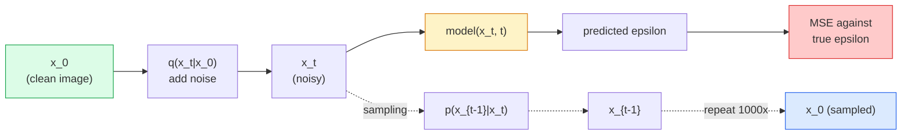

# 图像生成  Diffusion Models

> Diffusion Model öğrenmek denoise eğitimi. Bu, görüntülerin gürültülü bir kısmını silmek için bir görüntü üreticisi oluşturur.

**Type:** Build
**Languages:** Python
**Prerequisites:** Phase 4 Lesson 07 (U-Net), Phase 1 Lesson 06 (Probability), Phase 3 Lesson 06 (Optimizers)
**Time:** ~75 分钟

## Öğrenme hedefi

- 推导 ileri sesleme süreci `x_0 -> x_1 -> ... -> x_T`Neden kapalı olduğunu açıklamadı .`q(x_t | x_0)`Herhangi bir şehrin oluşumu
- 实现 DDPM 风格的训练目标, her adımdan 加入的噪音回归,并实现纯噪音 逐步回归图像的样品器
- Construct a time-conditioned U-Net(小到可以在CPU上训练), herhangi bir zaman aşamasında gürültü tahmin için kullanılır
- 解释 DDPM ve DDIM örneklemesinin farkları ve kendi uygulanabilirlik sahnesini 解释 DDPM ve DDIM örneklemesinin farkları ve kendi uygulanabilirlik sahnesini 解释 (Lesson 23 会深入讲解流匹配和修正流)

## 问题

GANlar bir kez üretilir: gürültü  giriş, görüntü çıkışı, sadece bir kez ileriye geçmek gerekir. Onlar hızlıdır, ancak çok zor eğitilir.

Düzgünlük eğitimi dışında, Diffusion'un generation yapısı da modern görüntü üretimindeki her şeyi çözüyor: metin koşullandırması, boyamak, görüntü düzenleme, süper çözünürlük, kontrol edilebilir stil. Örnekleme döngüsünün her adımı yeni bir küme girişidir. Bu kanca, Stable Diffusion'i oluşturur.

Bu ders, en az bir DDPM oluşturur: ileri gürültü, geriye dönük ifadeler, eğitim döngüsü.

## 核心概念

### ilerleme süreci

Bir resim çek .`x_0`❖加入少量 Gaussian noise  get `x_1`❖ yeniden ekle  get `x_2` devam et  步, `x_T`差不多与纯高斯噪音 区分──

```
q(x_t | x_{t-1}) = N(x_t; sqrt(1 - beta_t) * x_{t-1},  beta_t * I)
```

`beta_t`T=1000'de genellikle 0.0001 線性成長から 0.02'e kadar küçük bir varyansa şablonu vardır.

### 闭式跳转

逐步加入噪音 Markov zinciri, ama matematikte çarpılabilir:`x_0`örnek çıkış`x_t`- Evet.

```
Define alpha_t = 1 - beta_t
Define alpha_bar_t = prod_{s=1..t} alpha_s

Then:
  q(x_t | x_0) = N(x_t; sqrt(alpha_bar_t) * x_0,  (1 - alpha_bar_t) * I)

Equivalently:
  x_t = sqrt(alpha_bar_t) * x_0 + sqrt(1 - alpha_bar_t) * epsilon
  where epsilon ~ N(0, I)
```

Bu tek bir yol da yayılmaların tüm nedenlerini ortaya çıkarır.`t`Doğrudan .`x_0`örnek çıkış`x_t`,并一步完成训练,不需要模拟完整的马科夫链――

### tersine dönüşüm

Önümüzdeki süreç is fixed;; ters süreç `p(x_{t-1} | x_t)`Yeni bir nöral ağı öğrenmek için.`x_{t-1}`Bu sesler ilk adımlarda uyarılıyor.`epsilon`Sonra matematik formüllerinden bir çıkış.`x_{t-1}`- Evet.



### 訓練 Kayıp

对于每一个训练步骤:

1. örnek 一张真实图像 `x_0`- Evet.
2. [1, T] 中均 örnek 一个时间步骤 `t`- Evet.
3. örnek gürültüsü `epsilon ~ N(0, I)`- Evet.
4. 计算 `x_t = sqrt(alpha_bar_t) * x_0 + sqrt(1 - alpha_bar_t) * epsilon`- Evet.
5. Uzd ağı 预测 `epsilon_theta(x_t, t)`- Evet.
6. En küçük şey .`|| epsilon - epsilon_theta(x_t, t) ||^2`- Evet.

İşte böyle. Neural Network öğrenmek istediği zaman aşamasında                                                                                                                                                                                                                                                                                                                                                                                                                                                                                                                

### örnekleme cihazı (DDPM)

生成时: `x_T ~ N(0, I)`Başlayın, bir adım geriye doğru.

```
for t = T, T-1, ..., 1:
    eps = model(x_t, t)
    x_{t-1} = (1 / sqrt(alpha_t)) * (x_t - (beta_t / sqrt(1 - alpha_bar_t)) * eps) + sqrt(beta_t) * z
    where z ~ N(0, I) if t > 1, else 0
return x_0
```

Önemli olan, ters koşullara rağmen genel olarak bilinen bir kapalı biçim yoktur, ancak bu belirli Gaussian ileri süreci için, kapalı bir biçimlidir.

### Neden 1000 adım?

Önceki gürültü programının seçimi amacı, her adımı yeterince gürültüye katmak, ters adımları Gaussian'a yakınlaştırmak, adım sayıları çok az, ters adımlar Gaussian'dan uzaklaştırmak, ağlar ısırabilmesi zor.

### DDIM:快 20 倍的样本

訓練相同,サンプリング 変変遷──DDIM(Song et al., 2020) kesin bir ters süreç tanımladı, yeniden eğitilmeden zaman adımlarını atlayabilirsiniz──DDIM ile 50 步目の örneklemesi kullanarak, 1000 步目の DDPM'nin kalitesine yaklaşılabilir── her üretim sistemi DDIM veya daha hızlı变体 (DEM veya daha hızlı değişimler) △DPM-Solver、Euler ataları) ⋅

### Zaman şartlandırması

ağ `epsilon_theta(x_t, t)`需要知道它正在指明 哪个时间步骤──现代 扩散模型 通过阴道时间嵌入 注入 `t`(Transformatörlerdeki pozisyon kodlama fikri aynı) ve her U-Net seviyesinde özellik haritalarına ekle.

```
t_embedding = sinusoidal(t)
feature_map += MLP(t_embedding)
```

Zaman koşulları yok, ağlar görüntüden gürültü seviyesini tahmin etmek zorunda, bu da çalışabilir, ama örnek verimliliği çok daha düşük olacaktır.


```figure
cv-diffusion-image
```

## Yapın onu.

### 步骤 1: Ses programı

```python
import torch

def linear_beta_schedule(T=1000, beta_start=1e-4, beta_end=2e-2):
    return torch.linspace(beta_start, beta_end, T)


def precompute_schedule(betas):
    alphas = 1.0 - betas
    alphas_cumprod = torch.cumprod(alphas, dim=0)
    return {
        "betas": betas,
        "alphas": alphas,
        "alphas_cumprod": alphas_cumprod,
        "sqrt_alphas_cumprod": torch.sqrt(alphas_cumprod),
        "sqrt_one_minus_alphas_cumprod": torch.sqrt(1.0 - alphas_cumprod),
        "sqrt_recip_alphas": torch.sqrt(1.0 / alphas),
    }

schedule = precompute_schedule(linear_beta_schedule(T=1000))
```

预先计算一次,在训练和采样中 根据索引收集

### 步骤 2: Önceki Diffusion (q_sample)

```python
def q_sample(x0, t, noise, schedule):
    sqrt_a = schedule["sqrt_alphas_cumprod"][t].view(-1, 1, 1, 1)
    sqrt_one_minus_a = schedule["sqrt_one_minus_alphas_cumprod"][t].view(-1, 1, 1, 1)
    return sqrt_a * x0 + sqrt_one_minus_a * noise
```

Bir kısma biçim.`t`Bir dizi zaman aşaması, bir seri içinde her resim birbiriyle karşı karşıya.

### 步骤 3: Küçük bir zaman koşullu U-Net

```python
import torch.nn as nn
import torch.nn.functional as F
import math

def timestep_embedding(t, dim=64):
    half = dim // 2
    freqs = torch.exp(-math.log(10000) * torch.arange(half, device=t.device) / half)
    args = t[:, None].float() * freqs[None]
    emb = torch.cat([args.sin(), args.cos()], dim=-1)
    return emb


class TinyUNet(nn.Module):
    def __init__(self, img_channels=3, base=32, t_dim=64):
        super().__init__()
        self.t_mlp = nn.Sequential(
            nn.Linear(t_dim, base * 4),
            nn.SiLU(),
            nn.Linear(base * 4, base * 4),
        )
        self.t_dim = t_dim
        self.enc1 = nn.Conv2d(img_channels, base, 3, padding=1)
        self.enc2 = nn.Conv2d(base, base * 2, 4, stride=2, padding=1)
        self.mid = nn.Conv2d(base * 2, base * 2, 3, padding=1)
        self.dec1 = nn.ConvTranspose2d(base * 2, base, 4, stride=2, padding=1)
        self.dec2 = nn.Conv2d(base * 2, img_channels, 3, padding=1)
        self.time_proj = nn.Linear(base * 4, base * 2)

    def forward(self, x, t):
        t_emb = timestep_embedding(t, self.t_dim)
        t_emb = self.t_mlp(t_emb)
        t_proj = self.time_proj(t_emb)[:, :, None, None]

        h1 = F.silu(self.enc1(x))
        h2 = F.silu(self.enc2(h1)) + t_proj
        h3 = F.silu(self.mid(h2))
        d1 = F.silu(self.dec1(h3))
        d2 = torch.cat([d1, h1], dim=1)
        return self.dec2(d2)
```

双层 U-Net, ve şişe boynunda Giriş zaman koşullandırma── Gerçek görüntü kullanılırken, genişliği ve derinliğini genişletmek gerekir──

### 4 adım: Eğitim döngüsü

```python
def train_step(model, x0, schedule, optimizer, device, T=1000):
    model.train()
    x0 = x0.to(device)
    bs = x0.size(0)
    t = torch.randint(0, T, (bs,), device=device)
    noise = torch.randn_like(x0)
    x_t = q_sample(x0, t, noise, schedule)
    pred = model(x_t, t)
    loss = F.mse_loss(pred, noise)
    optimizer.zero_grad()
    loss.backward()
    optimizer.step()
    return loss.item()
```

Bu tam bir eğitim döngüsü. GAN oyunu yok, özel bir kayıp yok.

### 步骤 5: Örnekleme (DDPM)

```python
@torch.no_grad()
def sample(model, schedule, shape, T=1000, device="cpu"):
    model.eval()
    x = torch.randn(shape, device=device)
    betas = schedule["betas"].to(device)
    sqrt_one_minus_a = schedule["sqrt_one_minus_alphas_cumprod"].to(device)
    sqrt_recip_alphas = schedule["sqrt_recip_alphas"].to(device)

    for t in reversed(range(T)):
        t_batch = torch.full((shape[0],), t, dtype=torch.long, device=device)
        eps = model(x, t_batch)
        coef = betas[t] / sqrt_one_minus_a[t]
        mean = sqrt_recip_alphas[t] * (x - coef * eps)
        if t > 0:
            x = mean + torch.sqrt(betas[t]) * torch.randn_like(x)
        else:
            x = mean
    return x
```

Bir numune üretmek için 1000 kez ileri geçiş gerekir. Gerçek kodlarda, onu DDIM 50 adımlı numuneye değiştirirsin.

### 步骤 6: DDIM örnekleme (确定性,约快 20倍)

```python
@torch.no_grad()
def sample_ddim(model, schedule, shape, steps=50, T=1000, device="cpu", eta=0.0):
    model.eval()
    x = torch.randn(shape, device=device)
    alphas_cumprod = schedule["alphas_cumprod"].to(device)

    ts = torch.linspace(T - 1, 0, steps + 1).long()
    for i in range(steps):
        t = ts[i]
        t_prev = ts[i + 1]
        t_batch = torch.full((shape[0],), t, dtype=torch.long, device=device)
        eps = model(x, t_batch)
        a_t = alphas_cumprod[t]
        a_prev = alphas_cumprod[t_prev] if t_prev >= 0 else torch.tensor(1.0, device=device)
        x0_pred = (x - torch.sqrt(1 - a_t) * eps) / torch.sqrt(a_t)
        sigma = eta * torch.sqrt((1 - a_prev) / (1 - a_t) * (1 - a_t / a_prev))
        dir_xt = torch.sqrt(1 - a_prev - sigma ** 2) * eps
        noise = sigma * torch.randn_like(x) if eta > 0 else 0
        x = torch.sqrt(a_prev) * x0_pred + dir_xt + noise
    return x
```

`eta=0`Bu durum tamamen kesin. Aynı gürültü.`eta=1`DDPM'yi yeniden başlatmak için.

## Kullan

生产工作中,使用 `diffusers`- ...

```python
from diffusers import DDPMScheduler, UNet2DModel

unet = UNet2DModel(sample_size=32, in_channels=3, out_channels=3, layers_per_block=2)
scheduler = DDPMScheduler(num_train_timesteps=1000)
```

Bu kitle mevcut programlayıcılar sağlar DDPM、DDIM、DPM-Solver、Euler、Heun)、configureable U-Nets、text-to-image 和 image-to-image pipelines, ve LoRA ince ayarlama yardımcıları──

Araştırma çalışmalarında,`k-diffusion`(Katherine Crowson) en güvenilir referans ve en iyi örnekleme varianları vardır.

## - Söyle.

Bu ders:

- `outputs/prompt-diffusion-sampler-picker.md` Bir prompt, kalite hedefine dayanır 延迟预算和条件化 类型选择 DDPM / DDIM / DPM-Solver / Euler。
- `outputs/skill-noise-schedule-designer.md` Bir beceri, T 和 hedef yozlaşma seviyesine göre 生成線性、コシヌまたはシグモイド ベータ şablon,并附带信号-ノイズ oranı 随着時間変化の診断図―

## 练习

1. **（简单）**Gözetim önüne doğru işlem: 取一张图像,并绘制 `t in [0, 100, 250, 500, 750, 1000]`时的 `x_t`❖ Test`x_1000`Tam Gaussian sesi gibi görünüyor.
2. **（中等）**Sintezik döngüler verisi kümesi Üncelim TinyUNet 20 个时代,并样本 16 个圈──比较 DDPM ((1000 步) 和 DDIM ((50 步) 样本:它们是否能从相同的噪音种子产生相似图像?
3. **（困难）**实现 cosine noise schedule (Nichol & Dhariwal, 2021):`alpha_bar_t = cos^2((t/T + s) / (1 + s) * pi / 2)`△ Lineer ve kozin çizelgeleri ile △ modelini eğitmek ve kozinin daha iyi bir örnek üretebildiğini göstermek için △

## 关键术语

| Term | 人们通常怎么说 | 实际含义 |
|------|----------------|----------------------|
| Forward process | “随时间加入 noise” | 一个固定的 Markov chain，会在 T 步内把图像破坏成 Gaussian noise |
| Reverse process | “一步步 denoise” | 学到的分布，会从 noise 逐步走回图像 |
| Epsilon prediction | “预测 noise” | 训练目标：`epsilon_theta(x_t, t)` 预测在第 t 步加入的 noise |
| Beta schedule | “noise 大小” | T 个小 variance 组成的序列，定义每一步进入多少 noise |
| alpha_bar_t | “累计保留因子” | 到时间 t 为止的 (1 - beta_s) 乘积；t 越大，剩余信号越少 |
| DDPM sampler | “Ancestral，随机” | 从每个 x_{t-1} 的 conditional Gaussian 中 sample；1000 步 |
| DDIM sampler | “确定性，快速” | 将 sampling 重写为确定性 ODE；20-100 步即可得到相似质量 |
| Time conditioning | “告诉 model 当前是哪个 t” | 注入 U-Net 的 t 的 sinusoidal embedding，让它知道 noise level |

## 延伸阅读

- [Denoising Diffusion Probabilistic Models (Ho et al., 2020)](https://arxiv.org/abs/2006.11239) 让 Diffusion 变得实用并 FID 上击败 GANs 的论文
- [Improved DDPM (Nichol & Dhariwal, 2021)](https://arxiv.org/abs/2102.09672) cosine planı 和 v-parametreleme
- [DDIM (Song, Meng, Ermon, 2020)](https://arxiv.org/abs/2010.02502) 让实时推论 成为可能的确定性样本
- [Elucidating the Design Space of Diffusion (Karras et al., 2022)](https://arxiv.org/abs/2206.00364) Her bir Diffusion design seçeneğinin bir bütün bakış açısı; mevcut en iyi referans
