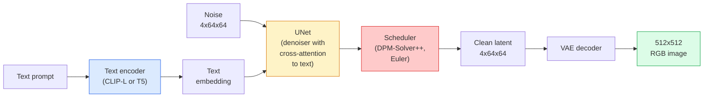

# Dayanıklı Diffusion  架构与精细调

> Stabil Diffusion, bir DDPM biçimidir, VAE'nin gizli alanında çalışır, çapraz dikkatle, hızlı belirlenmiş ODE çözücü kullanılarak 采样,并由分類器 মুক্ত rehberlik 引导──

**Type:** Learn + Use
**Languages:** Python
**Prerequisites:** Phase 4 Lesson 10 (Diffusion), Phase 7 Lesson 02 (Self-Attention)
**Time:** ~75 分钟

## Öğrenme hedefi
-  追踪 Stable Diffusion pipeline'nın beş parçaları: VAE、text encoder、U-Net、scheduler、security checker,并理解它们各自实际做什么
-  açıklama gizli dağılımı, ve neden 4x64x64 gizli alan içinde eğitim (((3x512x512  görüntü üzerinde eğitim yerine) değer kaybı olmadan durumlarda hesaplama miktarı 48x düşürür
- Kullanım`diffusers`生成图像,运行图像-to-image、inpainting 和 ControlNet 引导的生成
- Küçük kendi kendini tanımlayan bir veri kitlesinde LoRA ince ayarlama ile Stable Diffusion, ve sonuç olarak 时加载 LoRA adaptörü

## 问题
DDPM'nin gelişi çok yüksek. Her bir eğitim adımında bir U-Net'ten bir Backpropagation yapılması gerekiyor. Bu U-Net'te 3x512x512 = 786,432 个输入值 görülebilir.

让开权文字-to-image 变得实用技巧是 **latent diffusion**(Rombach et al., CVPR 2022) ◊ bir VAE eğitimi, 3x512x512 图像映射到4x64x64 潜伏テンサー 再映射回来,然后在这个潜伏空间中做 Diffusion──计算量下降 ◊`(3*512*512)/(4*64*64) = 48x` Aynı GPU'da, örnekleme süresi birkaç saniyeden iki saniyeye düşüyor.

几乎所有现代图像生成模型SDXL、SD3、FLUX、HunyuanDiT、Wan-Video都是潜伏扩散模型,只是在自动编码器、denoiser(U-Net或DiT) 和文本条件化上有所变化──学会稳定扩散,你已经掌握了这个模板──

## 概念
### - Boru hattı



- **VAE** 结的自动编码器──Encoder将图像转换为潜藏的(用于img2img 和训练)──Decoder将潜藏的图像转回──
- **Text encoder** CLIP metin kodlayıcısı(SD 1.x/2.x)、CLIP-L + CLIP-G(SDXL) veya T5-XXL(SD3/FLUX)。 oluşturmak 
- **U-Net** denoiser── içerir çapraz dikkat 层,  dizgin seviyelerinde latent katılımından metin eklenmesine kadar──
- **Scheduler** 采样算法(DDIM、Euler、DPM-Solver++) ・・・选择 sigmas,并将预测的噪音 混合回 latente──
- **Safety checker** 可選的输出图像 NSFW / 非法内容过器──

### Sınıflandırıcıdan Çekilmeyen Rehberlik (CFG)

Normal metin şartlandırılması her soruyu yönetecek.`c`Öğrenim`epsilon_theta(x_t, t, c)`CFG'nin eğitiminin %10'u aynı ağda kalır.`c`(alternatif olarak boş yerleştirme), böylece bir tane model elde edilir ve koşulsuz gürültü ve koşulsuz gürültü tahmin edilir.

```
eps = eps_uncond + w * (eps_cond - eps_uncond)
```

`w`Bu bir rehberlik ölçeği.`w=0`Şartsız.`w=1`Normal şartlı,`w>1`Çıktı, çıkış hızlandı, fiyatlar düştü.`w=7.5`- Evet.

CFG ise metin-resim  üretim kalitesine ulaşmanın nedeni  yoktur, çıkışa karşı hızlı bir şekilde yönlendirilir.

### Latent uzay geometrisinin

VAE'nin 4 kanallı gizli görüntüsü sadece sıkıştırılmış görüntüler değildir. Bu bir çeşitliliktir. Bu tür tür türden işlemler ise, hemen mühendislik ve interpolasyonla gerçekleşir. Bu da Diffusion U-Net'in tüm inşaat bütçesine ve eğitim alanına yatırım yapmasıdır.

İki sonuç:

1. **Img2img**= Görüntü kodlamasını gizli, hissesi gürültüye dahil, işlev denoizeri, yeniden kodlamayı yeniden yaptırmak.
2. **Inpainting**= Img2img ile aynı, ama denoiser sadece yenileme maskesi 区域; non mask 区域保留为已编码的潜藏──

### U-Net mimarisi

SD U-Net, TinyUNet'in büyük bir sürümüdür, üç noktayı arttırıyor:

- Her alan çözünürlüğünde.**Transformer blocks**, özdeyişle + metin yerleştirilmesine karşı dikkat içerir.
- Sinusoidal kodlama yoluyla yukarıdaki MLP elde ediyorum .**Time embedding**- Evet.
- Kodlayıcı ve dekodör arasında **Skip connections**- Evet.

SD 1.5'in toplam parametre sayısı: yaklaşık 860M。SDXL: yaklaşık 2.6B。FLUX: yaklaşık 12B。

### LoRA ince ayarlama

Stable Diffusion için tam ince ayarlama yapmak 20+ GB VRAM gerektirir,并更新 860M 个参数。LoRA(Low-Rank Adaptation) temel model tutmak 结,并向 Attention 层注入小型级分解矩阵。 SD'nin LoRA adaptörü genellikle 10-50 MB olarak kullanılır, tek blok tüketim seviyesindeki GPU'da 10-60 dakika boyunca eğitim alır ve sonuçlandırma 时作为下降修 加载。

```
Original: W_q : (d_in, d_out)   frozen
LoRA:     W_q + alpha * (A @ B)   where A : (d_in, r), B : (r, d_out)

r is typically 4-32.
```

LoRA neredeyse tüm topluluklarda iyi uyum sağlayan bir yöntemdir.

### Gördüğün zamanlamalar

- **DDIM** 确定性, yaklaşık 50 adım,简单――
- **Euler ancestral** 随机性,30-50 adım,样本略有创意──
- **DPM-Solver++ 2M Karras** 确定性,20-30 adım,生产默认选择──
- **LCM / TCD / Turbo** tutarlılık modelleri ve destilli çeşitleri;1-4 adım, ama kısımını kurban eder.

- Evet .`diffusers`Çıkarma programı sadece bir satır değiştirilmelidir, bazen herhangi bir yeniden eğitime ihtiyaç yoktur.


```figure
cv3-latent-compression
```

## Yapın onu.
本课端到端使用 `diffusers`, yerine sıfırdan yeniden inşa Stable Diffusion. You need to rebuild the part (VAE.Teks kodlayıcı U-Net.Sedüler) kendi başlarına kendi derslerinin konularıdır; bunun amacı, üretim seviyesinin API'sini aşina olmaktır.

### 步骤 1: Metin-resme

```python
import torch
from diffusers import StableDiffusionPipeline

pipe = StableDiffusionPipeline.from_pretrained(
    "runwayml/stable-diffusion-v1-5",
    torch_dtype=torch.float16,
).to("cuda")

image = pipe(
    prompt="a dog riding a skateboard in tokyo, studio ghibli style",
    guidance_scale=7.5,
    num_inference_steps=25,
    generator=torch.Generator("cuda").manual_seed(42),
).images[0]
image.save("dog.png")
```

`float16`Görülebilir kalite kaybı olmadığı durumlarda VRAM'ı yarıya düşürür.`num_inference_steps=25`                                                                                                                                                                                                                                                                                                                                                                                                                                                                                                                             `num_inference_steps=50`- Evet.

### 步骤 2: Programlayıcıyı değiştir

```python
from diffusers import DPMSolverMultistepScheduler, EulerAncestralDiscreteScheduler

pipe.scheduler = DPMSolverMultistepScheduler.from_config(pipe.scheduler.config)
pipe.scheduler = EulerAncestralDiscreteScheduler.from_config(pipe.scheduler.config)
```

Programlayıcı durum ve U-Net ağırlıkları 解── DDPM 上訓練, sonra istekli programcı 采样──

### 步骤 3: Resimden resme

```python
from diffusers import StableDiffusionImg2ImgPipeline
from PIL import Image

img2img = StableDiffusionImg2ImgPipeline.from_pretrained(
    "runwayml/stable-diffusion-v1-5",
    torch_dtype=torch.float16,
).to("cuda")

init_image = Image.open("dog.png").convert("RGB").resize((512, 512))
out = img2img(
    prompt="a dog riding a skateboard, oil painting",
    image=init_image,
    strength=0.6,
    guidance_scale=7.5,
).images[0]
```

`strength`Defini etmeden önce                                                                                                                                                                                                                                                                                                                                                                                                                                                                                                                         

### 步骤 4: Boyamak

```python
from diffusers import StableDiffusionInpaintPipeline

inpaint = StableDiffusionInpaintPipeline.from_pretrained(
    "runwayml/stable-diffusion-inpainting",
    torch_dtype=torch.float16,
).to("cuda")

image = Image.open("dog.png").convert("RGB").resize((512, 512))
mask = Image.open("dog_mask.png").convert("L").resize((512, 512))

out = inpaint(
    prompt="a cat",
    image=image,
    mask_image=mask,
    guidance_scale=7.5,
).images[0]
```

Maskenin içindeki beyaz resim yeniden üretilme alanıdır.

### 步骤 5: LoRA yükleme

```python
pipe.load_lora_weights("sayakpaul/sd-lora-ghibli")
pipe.fuse_lora(lora_scale=0.8)

image = pipe(prompt="a village square in ghibli style").images[0]
```

`lora_scale`Kontrol Güçü;0.0 = 无效,1.0 = 完整效果──`fuse_lora`Adaptörün hızını artırmak için ağırlıklara kadar yüklenecek ama değişimi engelleyecek.`pipe.unfuse_lora()`- Evet.

### 步骤 6: LoRA eğitim (sketch)

Gerçek LoRA eğitimleri`peft`Ya da`diffusers.training`Ortalama:

```python
# Pseudocode
for step, batch in enumerate(dataloader):
    images, prompts = batch
    latents = vae.encode(images).latent_dist.sample() * 0.18215

    t = torch.randint(0, num_train_timesteps, (batch_size,))
    noise = torch.randn_like(latents)
    noisy_latents = scheduler.add_noise(latents, noise, t)

    text_emb = text_encoder(tokenizer(prompts))

    pred_noise = unet(noisy_latents, t, text_emb)  # LoRA weights injected here

    loss = F.mse_loss(pred_noise, noise)
    loss.backward()
    optimizer.step()
```

只有 LoRA矩阵会接收 Gradient;base U-Net、VAE 和文码码器都被结──使用批量为 1 和梯度检查点时,这可以适应8GB VRAM──

## Kullan
Üretim sırasında, yapmanız gereken kararlar:

- **Model family**SD 1.5 Açık Kaynaklı  Komünitet ince tonları, SDXL Daha Yüksek Sadakat, SD3 / FLUX Yüksek Sanatlı 和 Sıkı İzin Gereksinimleri için.
- **Scheduler**:20-30 adım DPM-Solver++ 2M Karras kullanın; zaman gecikme 低于1s 时使用 LCM-LoRA──
- **Precision**0480/4090 上使用 `float16`,A100 及更新设备上使用 `bfloat16`,VRAM 紧张时使用 `int8`(den geçiyor)`bitsandbytes`Ya da`compel`)。
- **Conditioning**:普通文本可用; Eğer daha güçlü kontrol gerekiyorsa, temel boru hattında 之上加入ControlNet(canny、depth、pose)

Bütçe üretimi için,`AUTO1111`- Ne ?`ComfyUI`Yapım için API kullanımı`diffusers`+ `accelerate`, veya Using带 TensorRT compilation of `optimum-nvidia`- Evet.

## - Söyle.
本课产 出:

- `outputs/prompt-sd-pipeline-planner.md` Bir istek, gecikme bütçesine göre  sadakat hedefi  lisans kısıtlaması  seç SD 1.5 / SDXL / SD3 / FLUX,  planlayıcı ve hassasiyet 
- `outputs/skill-lora-training-setup.md` Kendini tanımlamak için kullanılacak bir beceri, başlıkları, sıralama, parti boyutu ve öğrenme oranı dahil olmak üzere tam LoRA eğitim yapılandırmasını düzenlemek için.

## 练习
1. **(Easy)**Kullanım`[1, 3, 5, 7.5, 10, 15]`Orta `guidance_scale`Özetle bir anket. Resim nasıl değiştiğini anlat. Hangi yönlendirme değerinde eserler ortaya çıkmaya başladı?
2. **(Medium)**選取任意真實照片, 在 `[0.2, 0.4, 0.6, 0.8, 1.0]``strength`Aşağıya geçiyor.`StableDiffusionImg2ImgPipeline`运行── hangi güç 风格 değişimi sırasında yapı tutmak için? Neden 1.0 tamamen giriş ihmal eder?
3. **(Hard)**Bir LoRA'yı kullanarak tek bir konuyu kullanmak, bu konuyu oluşturmak ve bu konuyu oluşturmak için bir LoRA'yı geliştirmek ve bu konuyu oluşturmak için en iyi konum elde etmek için bir LoRA rütbesini ve eğitim adımlarını oluşturmak.

## 关键术语
| Term | What people say | What it actually means |
|------|----------------|----------------------|
| Latent diffusion | “在 latents 中 diffuse” | 在 VAE latent space（4x64x64）而不是 pixel space（3x512x512）中运行整个 DDPM；节省 48x 计算量 |
| VAE scale factor | “0.18215” | 将 VAE 的原始 latent 重新缩放到大致 unit variance 的常数；硬编码在每个 SD pipeline 中 |
| Classifier-free guidance | “CFG” | 混合 conditional 和 unconditional noise predictions；影响最大的 inference knob |
| Scheduler | “Sampler” | 将 noise + model predictions 转换为 denoised latent trajectory 的算法 |
| LoRA | “Low-rank adapter” | 小型 rank-decomposition matrices，可在不触碰 base weights 的情况下 fine-tune Attention 层 |
| Cross-attention | “Text-image attention” | 从 latent tokens 到 text tokens 的 Attention；在每个 U-Net 层级注入 prompt 信息 |
| ControlNet | “Structure conditioning” | 一个单独训练的 adapter，用额外输入（canny、depth、pose、segmentation）引导 SD |
| DPM-Solver++ | “默认 scheduler” | 二阶确定性 ODE solver；在低 step counts（20-30）下拥有最佳质量（2026 年） |

## 延伸阅读
- [High-Resolution Image Synthesis with Latent Diffusion (Rombach et al., 2022)](https://arxiv.org/abs/2112.10752) Stable Diffusion 论文; içerir tasarımın makul olduğunu kanıtlayan her bir ablation
- [Classifier-Free Diffusion Guidance (Ho & Salimans, 2022)](https://arxiv.org/abs/2207.12598) CFG 论文
- [LoRA: Low-Rank Adaptation of Large Language Models (Hu et al., 2021)](https://arxiv.org/abs/2106.09685) LoRA ilk olarak NLP'ye kullanıldı; SD'ye taşındığında neredeyse değiştirilme ihtiyacı yoktu.
- [diffusers documentation](https://huggingface.co/docs/diffusers) Her SD / SDXL / SD3 / FLUX boru hattının referans dosyası
