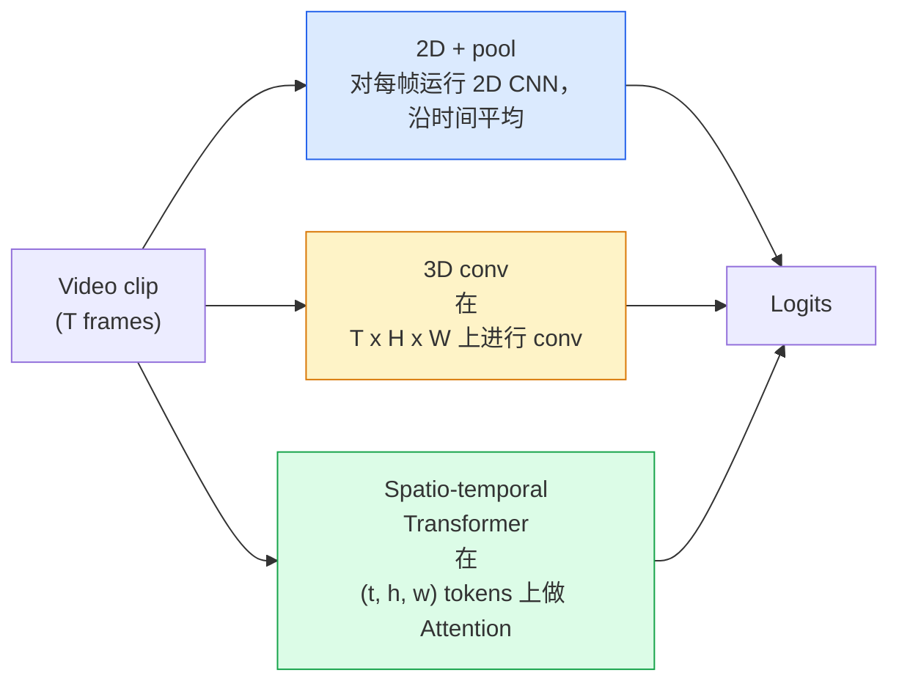

# Video Anlama  时间建模

> 视频 bir dizi görüntüdür, bunların birbirine bağlanmasını sağlayan fizik kurallarına ek olarak. Her video modeli ya zamanı ek bir ekseni olarak görmeli, ya da dikkat etmesi gereken bir dizi olarak görmeli, ya da bir kez bir kez bir kez bir kez bir kez bir kez bir kez bir kez bir kez bir kez bir kez bir kez bir kez bir kez bir kez bir kez bir kez bir kez bir kez bir kez bir kez bir kez bir kez bir kez bir kez bir kez bir kez bir kez bir kez bir kez bir kez bir kez bir kez bir kez bir kez bir kez bir kez bir kez bir kez bir kez bir kez bir kez bir kez bir kez bir kez bir kez bir kez bir kez bir kez bir kez bir kez bir kez bir kez bir kez bir kez bir kez bir kez bir kez bir kez bir kez bir kez bir kez bir kez bir kez bir kez bir kez bir kez bir kez bir kez bir kez bir kez bir kez bir kez bir kez bir kez bir kez bir kez bir kez bir kez bir kez bir kez bir kez bir kez bir kez bir kez bir kez bir kez bir kez bir kez bir kez bir kez bir kez bir kez bir kez bir kez bir kez bir kez bir kez bir kez bir kez bir kez bir kez bir kez bir kez bir kez bir kez bir kez bir kez bir kez bir kez bir kez bir kez bir kez bir kez bir kez bir kez bir kez bir kez bir kez bir kez bir kez bir kez bir kez bir kez bir kez bir kez bir kez bir kez bir kez bir kez bir kez bir kez bir kez bir kez bir kez bir kez bir kez bir kez bir kez bir kez bir kez bir kez bir kez bir kez bir kez bir kez bir kez bir kez bir kez bir kez bir kez bir kez bir kez bir kez bir kez bir kez bir kez bir kez bir kez bir kez bir kez bir kez bir kez bir kez bir kez bir kez bir kez bir kez bir kez bir kez bir kez bir kez bir kez bir kez bir kez bir kez bir kez bir kez bir kez bir kez bir kez bir kez bir kez bir kez bir kez bir kez bir kez bir kez bir kez bir kez bir kez bir kez bir kez bir kez bir kez bir kez bir kez bir kez bir kez bir kez bir kez bir kez bir kez bir kez bir kez bir kez bir kez bir kez bir kez bir kez bir kez bir kez bir kez bir kez bir kez bir kez bir kez bir kez bir kez bir kez bir kez bir kez bir kez bir kez bir kez bir kez bir kez bir kez bir kez bir kez

**类型：**Öğrenim + yapı
**语言：**Python
**先修要求：**4. aşama 03 ders(CNN),4. aşama 04 ders(İsmin sınıflandırması)
**时间：**~ 45 dakika

## Öğrenme hedefi

- 区分三种主要视频建模方法(2D+pool、3D conv、space-temporal Transformer), ve onları maliyet ve doğruluk oranlarında değerlendirerek tahmin et
- PyTorch'te çerçeve örneklemesini, zamanlı birleştirmeyi ve 2D+pool temel çizgi sınıflandırıcısını gerçekleştirmek
- 解释为什么I3D的膨胀3D核 能很好从 ImageNet ağırlıkları 迁移,以及因数化 (2+1)D conv 的不同之处
- Standart eylem tanıma veri kümelerini ve ölçümleri anlamak: Kinetik-400/600、UCF101、Something-Something V2; klip seviyesinin ve video seviyesinin en iyi 1 doğruluğu

## 问题

Bir 30 saniyeli 、30 fps video 900 张图像を含みます. Basitçe bakıldığında, video sınıflandırması, 900 kez görüntü sınıflandırmasını çalıştırmak, sonra bir tür bir toplama yapmak. Bu yöntem neredeyse her zaman görünürken geçerlidir.

Her video yapısının temel sorusu: Zaman yapısı, ne zaman, nasıl inşa edilir? Bu cevaplar diğer tüm şeyleri, hesaplama maliyetlerini, önceden eğitim stratejilerini, ImageNet ağırlıklarını tekrar kullanabilir miyiz, ve modellerin hangi veri kümelerinde eğitim vereceğini belirler.

Bu ders, ististik görüntü programından daha kısa.

## 核心概念

### Üç sınıf yapı ailesi



### 2D + havuz

取一个2D CNN(ResNet、EfficientNet、ViT) ⋅在每个采样上独立运行它──对每的嵌入做平均(或最大池,或注意池)──将聚向向量输入分类器──

优点:
- ImageNet öncesi eğitim doğrudan göç olabilir.
- 实现最简单――
- 便宜:T  * 单张图像推断成本──

缺点:
- 无法建模运动──Action = görünümlerin birleştirilmesi──
- Zamanlı birleştirme, sıraya karşı duyarlı değildir.

适用场景: 视频数据集 üzerinde transfer öğrenme 初始基线――

### 3 boyutlu kıvrımlar

2D (H, W) çekirdeklerini 3D (T, H, W) çekirdeklerine değiştirmek.

I3D 技巧: Bir önceden eğitilmiş 2D ImageNet modeli alın, her 2D çekirdeği 沿新时间轴复制, böylece 膨化──3x3 2D konvulusunu 3x3x3 3D konvulusuna dönüştürün.

优点:
- 直接建模 hareket
- I3D enflasyonı  ücretsiz transfer öğrenimi sağlamak

缺点:
- T / 8'den fazla 2D modelin FLOP'ları için zaman çekirdeği için 3 ̊ toplama 3 kez durum)
- Zaman çekirdekleri 很小;长程 hareket 需要金字塔或双流方法──

适用场景:motion is signal's action recognition (Hızlı hareketli sınıflar içeren bir kinetik)

### 时空 Transformers

网格, ve tüm 补丁ler arasında yapmak 视频 Tokenize 将视频 成空间-zaman yamalar 网格, ve tüm yamalar 之间做 Atenção──TimeSformer、ViViT、Video Swin、VideoMAE──

 Önemli Dikkat Patronu:
- **Joint** 在 (t, h, w) 上做一次大注意──对 `T*H*W`呈二次复杂度;昂贵──
- **Divided** Her blok iki kez dikkat: bir kez zaman boyunca, bir kez uzay boyunca.
- **Factorised**Zaman ve uzay dikkatinin bloklar arasında değişmesi.

优点:
- Tüm ana referans değerlerinde SOTA doğruluğuna ulaşmak için.
-  Patch enflasyonı                                                                                                                                                                                                                                                            
- 通過稀有注意 支持长文段视频──

缺点:
- 計算需求高──
- Dikkatli bir seçim yapmalıyız.

适用场景:大数据集、高保真 video anlama、çok modal video+metin görevleri。

### Çerçeve örneği

Bir 10 saniye、30 fps klipinde 300  vardır; tüm 300  herhangi bir model için çok harcadı.

- **Uniform sampling** 在片中均选取 T ──2D+pool 的默认选择──
- **Dense sampling** 随机连续 T-frame penceresi──3D konvs 中常见,因为运动 需要相邻──
- **Multi-clip**                                                                                                                                                                                                                                                              

T genellikle 8、16、32 veya 64。 daha yüksek T = 更多的时间信号, ayrıca daha fazla hesaplama anlamına gelir.

### Değerlendirme

İki aşama:
- **Clip-level accuracy**Bir T-frame klipi gör, rapor top-k。
- **Video-level accuracy** Her video'nun birden fazla klipi için klip seviyesinin tahminleri 平均; daha yüksek ve daha sabit 

始终报告两者──一个得分为78% clip / 82% video model高度依赖测试时间平均;一个得分为80% / 81%的模型在每片上更强──

### Toplayacağın veriler

- **Kinetics-400 / 600 / 700** 通用行動データセット──400k klip;YouTube URL'leri(很多现在已失效)──
- **Something-Something V2** 由 motion 定义的 actions(x'i soldan sağa taşımak)。 2D+pool kullanılamıyor 解决。
- **UCF-101**- Evet.**HMDB-51** 更老、更小, ama yine de rapor edilmektedir.
- **AVA**                                                                                                                                                                                                                                                              


```figure
v4-video-temporal
```

## Yapın onu.

### 步骤 1: Çerçeve örneği

列表 (或视频テンサー) 列表 (或视频テンサー) 列表 (列表) 列表 (或视频テンサー) 列表 (或视频テンサー) 列表 (列表) 列表 (或视频テンサー) 列表 (或视频テンサー) 列表 (列表) 列表 (或视频テンサー) 列表 (或视频テンサー) 列表 (或视频テンサー) 列表 (列表) 列表) 列表 (或视频テンサー) 列表 (列表) 和视频テンサー) 列表 (列表) 和视频テンサー) 和密度样板

```python
import numpy as np

def sample_uniform(num_frames_total, T):
    if num_frames_total <= T:
        return list(range(num_frames_total)) + [num_frames_total - 1] * (T - num_frames_total)
    step = num_frames_total / T
    return [int(i * step) for i in range(T)]


def sample_dense(num_frames_total, T, rng=None):
    rng = rng or np.random.default_rng()
    if num_frames_total <= T:
        return list(range(num_frames_total)) + [num_frames_total - 1] * (T - num_frames_total)
    start = int(rng.integers(0, num_frames_total - T + 1))
    return list(range(start, start + T))
```

İki kişi geri döndü .`T`个索引, 切片 video tensor için kullanılır

### 步骤 2: bir 2D+pool temel çizgi

Bu arada, 2D ResNet-18'in ortalama havuz özellikleri de var.

```python
import torch
import torch.nn as nn
from torchvision.models import resnet18, ResNet18_Weights

class FramePool(nn.Module):
    def __init__(self, num_classes=400, pretrained=True):
        super().__init__()
        weights = ResNet18_Weights.IMAGENET1K_V1 if pretrained else None
        backbone = resnet18(weights=weights)
        self.features = nn.Sequential(*(list(backbone.children())[:-1]))  # global avg pool kept
        self.head = nn.Linear(512, num_classes)

    def forward(self, x):
        # x: (N, T, 3, H, W)
        N, T = x.shape[:2]
        x = x.view(N * T, *x.shape[2:])
        feats = self.features(x).view(N, T, -1)
        pooled = feats.mean(dim=1)
        return self.head(pooled)

model = FramePool(num_classes=10)
x = torch.randn(2, 8, 3, 224, 224)
print(f"output: {model(x).shape}")
print(f"params: {sum(p.numel() for p in model.parameters()):,}")
```

Bir milyon parametresi,ImageNet önceden eğitilmiş, aşamalı, ortalama 分类── görünüş ağır görevlerde, bu temel genellikle gerçek 3D modellerden 低 5-10 个点, bazen daha iyi, çünkü daha güçlü ImageNet omurgasını tekrar kullanmıştır──

### 步骤 3:I3D tarzı şişmiş 3D konvoy

Yeni zaman çekimleri ile tek bir 2D çekimliği 3D çekimliği olarak dönüştürülecek.

```python
def inflate_2d_to_3d(conv2d, time_kernel=3):
    out_c, in_c, kh, kw = conv2d.weight.shape
    weight_3d = conv2d.weight.data.unsqueeze(2)  # (out, in, 1, kh, kw)
    weight_3d = weight_3d.repeat(1, 1, time_kernel, 1, 1) / time_kernel
    conv3d = nn.Conv3d(in_c, out_c, kernel_size=(time_kernel, kh, kw),
                        padding=(time_kernel // 2, conv2d.padding[0], conv2d.padding[1]),
                        stride=(1, conv2d.stride[0], conv2d.stride[1]),
                        bias=False)
    conv3d.weight.data = weight_3d
    return conv3d

conv2d = nn.Conv2d(3, 64, kernel_size=3, padding=1, bias=False)
conv3d = inflate_2d_to_3d(conv2d, time_kernel=3)
print(f"2D weight shape:  {tuple(conv2d.weight.shape)}")
print(f"3D weight shape:  {tuple(conv3d.weight.shape)}")
x = torch.randn(1, 3, 8, 56, 56)
print(f"3D output shape:  {tuple(conv3d(x).shape)}")
```

Üstelik`time_kernel`Bu, ilk kez yayılmaya yönelik seri norm istatistikleri için çok önemlidir.

### 步骤 4:Faktörlü (2+1) D konvulsiyonu

3D konvoyunu 2D'ye ayırmak ve 1D'de aynı algılama alanı, daha az parametre, bazı referanslarda 准确率更好──

```python
class Conv2Plus1D(nn.Module):
    def __init__(self, in_c, out_c, kernel_size=3):
        super().__init__()
        mid_c = (in_c * out_c * kernel_size * kernel_size * kernel_size) \
                // (in_c * kernel_size * kernel_size + out_c * kernel_size)
        self.spatial = nn.Conv3d(in_c, mid_c, kernel_size=(1, kernel_size, kernel_size),
                                 padding=(0, kernel_size // 2, kernel_size // 2), bias=False)
        self.bn = nn.BatchNorm3d(mid_c)
        self.act = nn.ReLU(inplace=True)
        self.temporal = nn.Conv3d(mid_c, out_c, kernel_size=(kernel_size, 1, 1),
                                  padding=(kernel_size // 2, 0, 0), bias=False)

    def forward(self, x):
        return self.temporal(self.act(self.bn(self.spatial(x))))

c = Conv2Plus1D(3, 64)
x = torch.randn(1, 3, 8, 56, 56)
print(f"(2+1)D output: {tuple(c(x).shape)}")
```

Tam bir R(2+1) D ağı ResNet-18'e benzer, sadece her 3x3 konvoy'u değiştirmek için.`Conv2Plus1D`- Evet.

## Kullan

İki kitle üretim seviyesinde video çalışmaları kapsamaktadır:

- `torchvision.models.video` R(2+1) D、MViT、Swin3D, önceden eğitilmiş Kinetik ağırlıkları ile birlikte.
- `pytorchvideo`(Meta)  model hayvanat bahçesi  Kinetics / SSv2 / AVA'nın veri yükleyicileri  standart dönüşümleri 

对于视频模型视频类型 (Vision-Language video models)`transformers`(`VideoMAE`- Evet.`VideoLLaMA`- Evet.`InternVideo`)。

## - Söyle.

Bu ders:

- `outputs/prompt-video-architecture-picker.md` Bir sürpriz, görünüşe karşı hareket, veri kümesi boyutu ve hesaplama bütçesi  seçin 2D+pool / I3D / (2+1)D / Transformer。
- `outputs/skill-frame-sampler-auditor.md` Bir becerisi, video borusunu kontrol etmek için örnekleme,并标记常见错误:off-by-one index`num_frames < T`时采样 不均、缺少 面保存作物等──

## 练习

1. **（简单）**計算 FramePool 在 T=8 时的FLOPs (FLOPs) 近似值),并与 T=8 的 I3D-style 3D ResNet对比──说明为什么2D+pool 便宜 3-5 倍──
2. **（中等）**生成一个合成视频数据集:随机小球朝随机方向移动,并按运动方向标注(左到右、右到左、横向) ;; FramePool üzerinde yapılan eğitimde, 的确率的接近随机水平的显示,从而证明了仅靠外观不足以完成运动任务──
3. **（困难）**ResNet-18'in her bir bağlantısını değiştirmek için`Conv2Plus1D`, bir R(2+1) D-18 oluşturmak için kullanın ImageNet-pre-trained ResNet-18 şişkinleştirmek için ilk konfor ağırlıkları──

## 关键术语

| Term | 人们常说 | 实际含义 |
|------|----------------|----------------------|
| 2D + pool | “Per-frame classifier” | 在每个采样帧上运行 2D CNN，跨时间 average-pool features，然后分类 |
| 3D convolution | “Spatio-temporal kernel” | 在 (T, H, W) 上进行 conv 的 kernel；可以原生建模 motion |
| Inflation | “Lift 2D weights to 3D” | 通过沿新的时间轴重复 2D conv 的 weights 来初始化 3D conv weights，然后除以 kernel_T 以保持 activation scale |
| (2+1)D | “Factorised conv” | 将 3D 拆成 2D spatial + 1D temporal；参数更少，中间多一个非线性 |
| Divided attention | “Time then space” | 每层有两次 Attention 的 Transformer block：一次在同一帧的 tokens 上，一次在同一位置的 tokens 上 |
| Clip | “T-frame window” | T 帧的采样子序列；video model 消费的单位 |
| Clip vs video accuracy | “Two eval settings” | Clip = 每个视频一个 sample，video = 对多个 sampled clips 取平均 |
| Kinetics | “The ImageNet of video” | 400-700 个 action classes，300k+ YouTube clips，标准 video pretraining corpus |

## 延伸阅读

- [I3D: Quo Vadis, Action Recognition (Carreira & Zisserman, 2017)](https://arxiv.org/abs/1705.07750)                                                                                                                                                                                                                                                                                                                                                                                                                                                                                                                            
- [R(2+1)D: A Closer Look at Spatiotemporal Convolutions (Tran et al., 2018)](https://arxiv.org/abs/1711.11248) faktörleşmiş konular, şimdiye kadar güçlü bir başlangıç seviyesidir
- [TimeSformer: Is Space-Time Attention All You Need? (Bertasius et al., 2021)](https://arxiv.org/abs/2102.05095)İlk güçlü video Transformer
- [VideoMAE (Tong et al., 2022)](https://arxiv.org/abs/2203.12602) Video'nun maskeli oto kodlayıcı önceden eğitim kullanımı;
