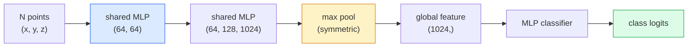

# 3D Görüş  Nokta Bulutları & NeRF'ler

> 3D görüş iki biçim vardır. Nokta bulutu sensörün orijinal çıkışıdır. NeRF öğrenilen boyut alanıdır.

**类型：**Öğren + İnşa et
**语言：**Python
**先修：**4. Fase Ders 03 (CNN), 1. Fase Ders 12 (Tensor Operasyonları)
**时间：**~ 45 dakika

## Öğrenme hedefi
- 区分显式(point cloud、mesh、voxel) 和隐式(signed distance field、NeRF) 3D representations,并 understand their respective applicable scenarios
- PointNet'in simetrik işlevi  tekniği anlamak: Neural Network'in , düzensiz noktaların permutasyon-invariant  性质ine sahip olmasını nasıl sağlar ?
-                                                                                                                                                                                                                                                                                                                                                                                                                                                                                                                              
- Kullanım`nerfstudio`Ya da`instant-ngp`基于少量带姿的图像进行预训练的3D重建

## 问题
Kamera  2 boyutlu görüntü oluşturur。LIDAR                                                                                                                                                                                                                                                                                                                                                                                                                                                                                                                 

3D vizyon  çok önemli, çünkü neredeyse tüm yüksek değerli robot görevleri 3D'de yürür: çektiği – engellerden kaçınma – navigasyon – AR kaplama – 3D içeriği yakalama  Sadece 2D görüntülerin vizyon mühendisi olarak anladığından, bu alanda büyüyen en hızlı bölümden dışarı çıkarılacak  AR/VR içeriği – robotlar – otonom sürücü pilleri – emlak veya inşaat için NeRF tabanlı 3D yeniden inşaat için kullanılır) 

Bu iki tür temsil, farklı nedenlerle yer alıyor.Bunlardan birinde nokta bulutları sensörler, size ücretsiz şeyler verir. NeRF'ler ve onların sonrakileri.

## 概念
### Bıçak bulutları

Nokta bulutu R^3 中 N 个点的无序集合, her nokta seçilebilir, özellikleri vardır 色、强度、正常) 

```
cloud = [
  (x1, y1, z1, r1, g1, b1),
  (x2, y2, z2, r2, g2, b2),
  ...
  (xN, yN, zN, rN, gN, bN),
]
```

ızız, bağlantısı yok. İki özellik vardır.

- **Permutation invariance** 输出不能依赖点的顺序──
- **Variable N** 单个模型 必须能够处理不同大小的云――

PointNet (Qi et al., 2017) iki şeyi bir fikirle çözdü: her noktayı paylaşan MLP uygulaması için, simetrik işlevi ile birlikte.

```
f(P) = max_{p in P} MLP(p)
```

İşte PointNet'in tüm merkezi. Daha derin bir değişim.

### PointNet mimarisi



Bağışlanmış MLP aynı MLP'yi 独立地运行在每个点上──efficiency için, genellikle bir nokta boyutunun 1x1 konvu olarak gerçekleştirilmektedir.

### Nöral Radyans Alanları (NeRF)

NeRF'ler (Mildenhall et al., 2020) soru soruyor:  我们能否从 N 张照片重建一个3D场景? 它的答是:用一个自自就是场景的神经网络――这个网络将`(x, y, z, viewing_direction)`映射到 `(density, colour)`染新视角, ağın etrafındaki bir ışın atış döngüsüdür.

```
NeRF MLP:  (x, y, z, theta, phi) -> (sigma, r, g, b)

To render a pixel (u, v) of a new view:
  1. Cast a ray from the camera through pixel (u, v)
  2. Sample points along the ray at distances t_1, t_2, ..., t_N
  3. Query the MLP at each point
  4. Composite the colours weighted by (1 - exp(-sigma * dt))
  5. The sum is the rendered pixel colour
```

Kayıp 会将染染出的像素与训练照片中的地面真相像素 进行比较──通过染步骤做 Backprop 来更新 MLP──没有3D地面真相,没有显式几何学场景 存储在MLP重中──

### NeRF İçindeki Pozisyon kodlaması

作用在 `(x, y, z)`Üst vanilla MLP 无法表示高频细节,因为 MLPs 在频谱上偏向低频――NeRF 通过在送进 MLP 前,将每个坐标编码成Fourier özelliği vektörü 来修改这一点:

```
gamma(p) = (sin(2^0 pi p), cos(2^0 pi p), sin(2^1 pi p), cos(2^1 pi p), ...)
```

En yüksek L=10 个 frekans seviyesi vardır. Bu, transformörlerin pozisyonları ile aynı teknikle kullanıldığından, aynı şekilde, yayılma zamanının şartlandırılmasında da ortaya çıkacaktır.

### Volumetrik görüntüleme

```
C(r) = sum_i T_i * (1 - exp(-sigma_i * delta_i)) * c_i

T_i  = exp(- sum_{j<i} sigma_j * delta_j)
delta_i = t_{i+1} - t_i
```

`T_i`- Yapabilir. - Evet.`(1 - exp(-sigma_i * delta_i))`Evet, bu kadar açık değil.`c_i`Renk. Son piksel.

### NeRF'lerin yerini ne aldı?

純 NeRFs 訓練慢(数小時), 染也慢(每张图数秒) ・・・

- **Instant-NGP**(2022)  hash-grid kodlama 替代 MLP'nin pozisyon girişleri;数秒内完成训练──
- **Mip-NeRF 360** 処理 unlimited scenes 和 anti-aliasing。
- **3D Gaussian Splatting**(2023)  Birkaç milyon 3D Gaussians ile volumetrik alanı değiştirmek;

2026 yılında neredeyse tüm gerçek NeRF ürünleri  aslında 3D Gaussian splatting ♡♡♡♡♡♡♡♡♡♡♡♡♡♡♡♡♡♡♡♡♡♡♡♡♡♡♡♡♡♡♡♡♡♡♡♡♡♡♡♡♡♡♡♡♡♡♡♡♡♡♡♡♡♡♡♡♡♡♡♡♡♡♡♡♡♡♡♡♡♡♡♡♡♡♡♡♡♡♡♡♡♡♡♡♡♡♡♡♡♡♡♡♡♡♡♡♡♡♡♡♡♡♡♡♡♡♡♡♡♡♡♡♡♡♡♡♡♡♡♡♡♡♡♡♡♡♡♡♡♡♡♡♡♡♡♡♡♡♡♡♡♡♡♡♡♡♡♡♡♡♡♡♡♡♡♡♡♡♡♡♡♡♡♡♡♡♡♡♡♡♡♡♡♡♡♡♡♡♡♡♡♡♡♡♡♡♡♡♡♡♡♡♡♡♡♡♡♡♡♡♡♡♡♡♡♡♡♡♡♡♡♡♡♡♡♡♡♡♡♡♡♡♡♡♡♡♡♡♡♡♡♡♡♡♡♡♡♡♡♡♡♡♡♡♡♡♡♡♡♡♡♡♡♡♡♡♡♡♡♡♡♡♡♡♡♡♡♡♡♡♡♡♡♡♡♡♡♡♡♡♡♡♡♡♡♡♡♡♡♡♡♡♡♡♡♡♡♡♡♡♡♡♡♡♡♡♡♡♡♡♡♡♡♡♡♡♡♡♡♡♡♡♡♡♡♡♡♡♡♡♡♡♡♡♡♡♡♡♡♡♡♡♡♡♡♡♡♡♡♡♡♡♡♡♡♡♡♡♡♡♡♡♡♡♡♡♡♡♡♡♡♡♡♡♡♡♡♡♡♡♡♡♡♡♡♡♡♡♡♡♡♡♡♡♡♡♡♡♡♡♡♡♡♡♡♡♡♡♡♡♡♡♡♡♡♡♡♡♡♡♡♡♡♡♡♡♡♡♡♡♡♡♡♡♡♡♡♡♡♡♡♡♡♡♡♡♡♡♡♡♡♡♡♡♡♡♡♡♡♡♡♡♡♡♡♡♡♡♡♡♡♡♡♡♡♡♡♡♡♡♡♡♡♡♡♡♡♡♡

### Verim kümeleri ve referans değerleri

- **ShapeNet** 3D CAD modelleri  nokta bulutları olarak  sınıflandırma ve segmentasyon yapılması
- **ScanNet** Bölümleme için gerçek oda içi taramalar kullanıyor.
- **KITTI** Özerk sürücü için kullanılır 户外 LIDAR point clouds。
- **NeRF Synthetic**- Ne ?**Blended MVS** Görüntü sentezinin poz görüntü verileri için kullanılmıştır。
- **Mip-NeRF 360**Veri kümesi  sınırsız gerçek sahneler。


```figure
nerf-rays
```

## Yapın onu.
### 步骤 1: PointNet sınıflandırıcısı

```python
import torch
import torch.nn as nn

class PointNet(nn.Module):
    def __init__(self, num_classes=10):
        super().__init__()
        self.mlp1 = nn.Sequential(
            nn.Conv1d(3, 64, 1),    nn.BatchNorm1d(64),   nn.ReLU(inplace=True),
            nn.Conv1d(64, 64, 1),   nn.BatchNorm1d(64),   nn.ReLU(inplace=True),
        )
        self.mlp2 = nn.Sequential(
            nn.Conv1d(64, 128, 1),  nn.BatchNorm1d(128),  nn.ReLU(inplace=True),
            nn.Conv1d(128, 1024, 1), nn.BatchNorm1d(1024), nn.ReLU(inplace=True),
        )
        self.head = nn.Sequential(
            nn.Linear(1024, 512),   nn.BatchNorm1d(512),  nn.ReLU(inplace=True),
            nn.Dropout(0.3),
            nn.Linear(512, 256),    nn.BatchNorm1d(256),  nn.ReLU(inplace=True),
            nn.Dropout(0.3),
            nn.Linear(256, num_classes),
        )

    def forward(self, x):
        # x: (N, 3, num_points) — transposed for Conv1d
        x = self.mlp1(x)
        x = self.mlp2(x)
        x = torch.max(x, dim=-1)[0]       # (N, 1024)
        return self.head(x)

pts = torch.randn(4, 3, 1024)
net = PointNet(num_classes=10)
print(f"output: {net(pts).shape}")
print(f"params: {sum(p.numel() for p in net.parameters()):,}")
```

≈ 1.6M parametreleri── her bulut ≈ 1,024 个点上──

### 步骤 2: Pozisyon kodlaması

```python
def positional_encoding(x, L=10):
    """
    x: (..., D) -> (..., D * 2 * L)
    """
    freqs = 2.0 ** torch.arange(L, dtype=x.dtype, device=x.device)
    args = x.unsqueeze(-1) * freqs * 3.141592653589793
    sinc = torch.cat([args.sin(), args.cos()], dim=-1)
    return sinc.reshape(*x.shape[:-1], -1)

x = torch.randn(5, 3)
y = positional_encoding(x, L=10)
print(f"input:  {x.shape}")
print(f"encoded: {y.shape}     # (5, 60)")
```

- Yukarı .`2^l * pi`Aradan daha yüksek frekanslar alacağım.

### 步骤 3: Küçük NeRF MLP

```python
class TinyNeRF(nn.Module):
    def __init__(self, L_pos=10, L_dir=4, hidden=128):
        super().__init__()
        self.L_pos = L_pos
        self.L_dir = L_dir
        pos_dim = 3 * 2 * L_pos
        dir_dim = 3 * 2 * L_dir
        self.trunk = nn.Sequential(
            nn.Linear(pos_dim, hidden), nn.ReLU(inplace=True),
            nn.Linear(hidden, hidden),  nn.ReLU(inplace=True),
            nn.Linear(hidden, hidden),  nn.ReLU(inplace=True),
            nn.Linear(hidden, hidden),  nn.ReLU(inplace=True),
        )
        self.sigma = nn.Linear(hidden, 1)
        self.color = nn.Sequential(
            nn.Linear(hidden + dir_dim, hidden // 2), nn.ReLU(inplace=True),
            nn.Linear(hidden // 2, 3), nn.Sigmoid(),
        )

    def forward(self, x, d):
        x_enc = positional_encoding(x, self.L_pos)
        d_enc = positional_encoding(d, self.L_dir)
        h = self.trunk(x_enc)
        sigma = torch.relu(self.sigma(h)).squeeze(-1)
        rgb = self.color(torch.cat([h, d_enc], dim=-1))
        return sigma, rgb

nerf = TinyNeRF()
x = torch.randn(128, 3)
d = torch.randn(128, 3)
s, c = nerf(x, d)
print(f"sigma: {s.shape}   rgb: {c.shape}")
```

İlk NeRF ile karşılaştırıldığında çok küçük bir yapı vardır.

### 步骤 4: Bir ışın boyunca boyutsal görüntüleme

```python
def volumetric_render(sigma, rgb, t_vals):
    """
    sigma: (..., N_samples)
    rgb:   (..., N_samples, 3)
    t_vals: (N_samples,) distances along the ray
    """
    delta = torch.cat([t_vals[1:] - t_vals[:-1], torch.full_like(t_vals[:1], 1e10)])
    alpha = 1.0 - torch.exp(-sigma * delta)
    trans = torch.cumprod(torch.cat([torch.ones_like(alpha[..., :1]), 1.0 - alpha + 1e-10], dim=-1), dim=-1)[..., :-1]
    weights = alpha * trans
    rendered = (weights.unsqueeze(-1) * rgb).sum(dim=-2)
    depth = (weights * t_vals).sum(dim=-1)
    return rendered, depth, weights


N = 64
t_vals = torch.linspace(2.0, 6.0, N)
sigma = torch.rand(N) * 0.5
rgb = torch.rand(N, 3)
rendered, depth, weights = volumetric_render(sigma, rgb, t_vals)
print(f"rendered colour: {rendered.tolist()}")
print(f"depth:           {depth.item():.2f}")
```

Bir ışın, 64 örnek, bir RGB piksel ve bir derinlik haline gelmek üzere.

## Kullan
Gerçek iş için:

- `nerfstudio`(Tancik et al.)  当前用于 NeRF / Instant-NGP / Gaussian Splatting 的参考图书馆──命令行加网观看器──
- `pytorch3d`(Meta)  farklılaştırılabilir renderleme  nokta bulut yardımları  mesh operasyonları
- `open3d` nokta bulut işleme, kayıt, görselleştirme

3D Gaussian splating, 100 kat hızlı yayılma hızına sahip olduğu için tamamen saf NeRF'leri değiştirmiştir.

## - Söyle.
本课产 出:

- `outputs/prompt-3d-task-router.md` Bir sürpriz, göreve göre ve giriş verilerine göre 路由到合适的3D temsil 点云、网、voxel、NeRF、Gaussian splat) 
- `outputs/skill-point-cloud-loader.md`PyTorch'i yazmak için bir beceri.`Dataset`, yüklenmiş .ply / .pcd / .xyz 文件,并 doğru bir normallaşma, merkezleme ve nokta örneklemesi gerçekleştirilmiştir

## 练习
1. **（Easy）**证明 PointNet is permutation-invariant:将同一个云 运行两次,一次保持原顺序,一次打乱点――验证输出除了浮点噪音之外完全相同――
2. **（Medium）**实现一个最小射线生成函数:给定摄像头内在和姿,为 H x W görüntülerinin her piksel 生成射线起源和方向――
3. **（Hard）**Renkli küpün rendered görüntülerini oluşturmak  Synth Data Set 上 тренинг TinyNeRF(可通过可分化 rendering或简单射线追踪器 生成) ・报告时代 1、10 和 100 的 rendering loss──Model 在哪个时代 产生可识别的视图?

## 关键术语
| Term | 人们常说 | 实际含义 |
|------|----------------|----------------------|
| Point cloud | “来自 LIDAR 的 3D points” | 无序的 (x, y, z) 集合 + 每个点可选的 features |
| PointNet | “第一个用于 point clouds 的 neural net” | 每个点一个 shared MLP + symmetric (max) pool；结构上天然 permutation-invariant |
| NeRF | “本身就是 scene 的 MLP” | 将 (x, y, z, dir) 映射到 (density, colour) 的 network；通过 ray casting 渲染 |
| Positional encoding | “Fourier features” | 将每个 coordinate 编码为多个 frequencies 下的 sin/cos，以克服 MLP 的低频偏置 |
| Volumetric rendering | “Ray integration” | 使用 transmittance 和 alpha 将 ray 上的 samples 合成为单个 pixel |
| Instant-NGP | “Hash-grid NeRF” | 用 multi-resolution hash grid 替换 NeRF 的 coordinate MLP；快 100-1000 倍 |
| 3D Gaussian splatting | “数百万个 Gaussians” | Scene = 3D Gaussians 的集合；实时渲染，数分钟训练 |
| SDF | “Signed distance field” | 返回到最近 surface 的 signed distance 的 function；另一种 implicit representation |

## 延伸阅读
- [PointNet (Qi et al., 2017)](https://arxiv.org/abs/1612.00593) Permutasyon-invariant sınıflandırıcı
- [NeRF (Mildenhall et al., 2020)](https://arxiv.org/abs/2003.08934) 让从照片进行3D重建 成为神经网络问题 的论文
- [Instant-NGP (Müller et al., 2022)](https://arxiv.org/abs/2201.05989) Haş ağları,1000 倍加速
- [3D Gaussian Splatting (Kerbl et al., 2023)](https://arxiv.org/abs/2308.04079) NeRF'lerin mimarisini üretim sırasında değiştirmek
