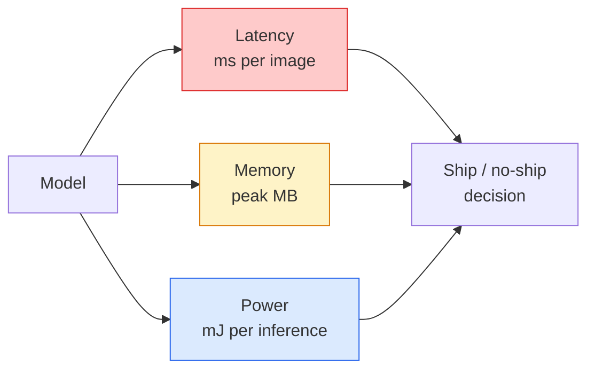

# Gerçek Zaman Görüşü  边缘部署

> Kenarlık sonucu, 90'un tamlığı ile 90'un tamlığı ile 2 GB RAM'li cihazlarda 30 fps'de çalışacak bir model oluşturur.

**Type:** Learn + Build
**Languages:** Python
**Prerequisites:** Phase 4 Lesson 04 (Image Classification), Phase 10 Lesson 11 (Quantization)
**Time:** ~75 minutes

## Öğrenme hedefi
- 测量任意 PyTorch model 的推理延迟、峰值 bellek 和吞吐量,并读懂 FLOPs / params / latency 之间的权衡
- PyTorch'ın eğitim sonrası ölçümünü kullanmak, görme modelini INT8 olarak ölçmek, doğruluk kaybını kontrol etmek < 1%
- 导出到ONNX,并使用ONNX Runtime 或 TensorRT 编译;说出三种最常见的导出失败原因及其修复方式
- 解释在边缘 约束下何时选择 MobileNetV3、EfficientNet-Lite、ConvNeXt-Tiny veya MobileViT

## 问题
訓練阶段'in görme modeli genellikle yüzen bir nokta 巨兽──100M parametreler── her ileri geçiş için 10 GFLOP、2 GB VRAM── bunlar cep telefonu, araç içi infotainment ünitesi、 sanayi makinesi veya drone’ya yüklenemez.

Büyük bölüm çalışması üç dönümden oluşur: model seçimi(INT8 ile FP32 yerine daha küçük bir mimarisi kullanmak) √ kvantizasyon(ONNX Runtime、TensorRT、Core ML、TFLite) √ √ √ √ √ √ √ √ √ √ √ √ √ √ √ √ √ √ √ √ √ √ √ √ √ √ √ √ √ √ √ √ √ √ √ √ √ √ √ √ √ √ √ √ √ √ √ √ √ √ √ √ √ √ √ √ √ √ √ √ √ √ √ √ √ √ √ √ √ √ √ √ √ √ √ √ √ √ √ √ √ √ √ √ √ √ √ √ √ √ √ √ √ √ √ √ √ √ √ √ √ √ √ √ √ √ √ √ √ √ √ √ √ √ √ √ √ √ √ √ √ √ √ √ √ √ √ √ √ √ √ √ √ √ √ √ √ √ √ √ √ √ √ √ √ √ √ √ √ √ √ √ √ √ √ √ √ √ √ √ √ √ √ √ √ √ √ √ √ √ √ √ √ √ √ √ √ √ √ √ √ √ √ √ √ √ √ √ √ √ √ √ √ √ √ √ √ √ √ √ √ √ √ √ √ √ √ √ √ √ √ √ √ √ √ √ √ √ √ √ √ √ √ √ √ √ 

Bu ders önce ölçüm disiplini oluşturur, sonra bu üç dönemi anlatır. Amaç her kenar çalıştırma zamanını öğrenmek değil, hangi kaldıraçların olduğunu ve her kaldıraçın gerçekten yaptığını nasıl doğruladığını bilmek.

## 概念
### Üç bütçe



- **Latency**:p50、p95、p99¬¬ sadece p50 平均值会掩盖对实时系统 非常重要的尾部行为──
- **Peak memory**Bu, bir sistemin en büyük değerini ve sabit durum ortalamasını değil.
- **Power / energy**Batı/GPU kullanımı * zaman yakınlık

kenar  kararlılık bağımlısı bir 張 (model, gecikme, bellek, doğruluk) 表── her bir element                                                                                                                                                                                                                                                

### Ölçüm disiplinleri

Her bir kenar profili üç kural izlemesi gerekir:

1. Ölçümden önce 5-10 kez numayla ileri geçiş yapın.**Warm up**model── soğuk depolama ve JIT birleştirme 会产生不具代表性的首次数值──
2. Zamanlı blok içinde ön ve sonrası kullanımı`torch.cuda.synchronize()` **Synchronise**GPU iş yükleri──否则你测到的是内核发送,而不是内核执行──
3. Giriş boyutlarını **Fix**224x224'in üstünü 512x512'in üstünü değil.

### FLOPs  proxy olarak

FLOPs (FLOPs) (her bir sonucu için akış nokta işlemleri) ucuz bir zamanlılık proxy ≠ cihaz ile ilgili değildir. Yapısal karşılaştırmaya uygun, ancak kesinlikle duvar saati olarak hata oluşur. FLOPs %10'dan fazla bir model, pratikte 2x hızlı olabilir.

规则: FLOP ile mimari arama yapın, cihazda gecikmeyle yerleştirme kararları verin.

### Kvantasyon 一段话说明

INT8 ile FP32 ağırlıklarını ve aktivasyonlarını değiştirmek için kullanılır. Model boyutu 4x azaltılır, hafıza bant genişliği 4x azaltılır, INT8 çekirdeği olan bir cihazın üzerinde hesaplama için kullanılır.

类型:

- **Dynamic** Ölçümlenmesi  INT8 olarak  FP 計算〜简单,速度提升较小〜
- **Static (post-training)** 量化 weights, and小型 calibration set 上校准 aktivasyon aralıkları──比 dinamik 快得多──
- **Quantisation-aware training (QAT)**                                                                                                                                                                                                                                                              

Görüş için, eğitim sonrası statik kvantizasyon %5'lik çalışma gücü ile %95'lik kazanç elde eder. PTQ'nin getirdiği doğruluk kaybı kabul edilemez.

### Kesme ve destilleme

- **Pruning** 移除不重要重量 (büyüklük tabanlı) veya kanallar (struktürlü)   很有效对过参数化模型 (çok fazla parametre edilmiş) 很有效对已经非常紧的建筑 (çok kompakt olan)  用处较小──
- **Distillation** 訓練一個小學生 去模仿大師的logits──通常能恢复缩小模型 后损失的大部分精度──制作边模型的标准做法──

### İndirim süreleri

- **PyTorch eager** 慢,不适合部署── sadece geliştirme için──
- **TorchScript** miraslı¬¬¬¬¬¬¬¬¬¬¬¬¬¬¬¬¬¬¬¬¬¬¬¬¬¬¬¬¬¬¬¬¬¬¬¬¬¬¬¬¬¬¬¬¬¬¬¬¬¬¬¬¬¬¬¬¬¬¬¬¬¬¬¬¬¬¬¬¬¬¬¬¬¬¬¬¬¬¬¬¬¬¬¬¬¬¬¬¬¬¬¬¬¬¬¬¬¬¬¬¬¬¬¬¬¬¬¬¬¬¬¬¬¬¬¬¬¬¬¬¬¬¬¬¬¬¬¬¬¬¬¬¬¬¬¬¬¬¬¬¬¬¬¬¬¬¬¬¬¬¬¬¬¬¬¬¬¬¬¬¬¬¬¬¬¬¬¬¬¬¬¬¬¬¬¬¬¬¬¬¬¬¬¬¬¬¬¬¬¬¬¬¬¬¬¬¬¬¬¬¬¬¬¬¬¬¬¬¬¬¬¬¬¬¬¬¬¬¬¬¬¬¬¬¬¬¬¬¬¬¬¬¬¬¬¬¬¬¬¬¬¬¬¬¬¬¬¬¬¬¬¬¬¬¬¬¬¬¬¬¬¬¬¬¬¬¬¬¬¬¬¬¬¬¬¬¬¬¬¬¬¬¬¬¬¬¬¬¬¬¬¬¬¬¬¬¬¬¬¬¬¬¬¬¬¬¬¬¬¬¬¬¬¬¬¬¬¬¬¬¬¬¬¬¬¬¬¬¬¬¬¬¬¬¬¬¬¬¬¬¬¬¬¬¬¬¬¬¬¬¬¬¬¬¬¬¬¬¬¬¬¬¬¬¬¬¬¬¬¬¬¬¬¬¬¬¬¬¬¬¬¬¬¬¬¬¬¬¬¬¬¬¬¬¬¬¬¬¬¬¬¬¬¬¬¬¬¬¬¬¬¬¬¬¬¬¬¬¬¬¬¬¬¬¬¬¬¬¬¬¬¬¬¬¬¬¬¬¬¬¬¬¬¬¬¬¬¬¬¬¬¬¬¬¬¬¬¬¬¬¬¬¬¬¬¬¬¬¬¬¬¬¬¬¬¬¬¬¬¬¬¬¬¬¬¬¬¬¬¬¬¬¬¬¬¬¬¬¬¬¬¬¬¬¬¬`torch.compile`ÜNNX ihracatı 取代──
- **ONNX Runtime** Orta çalıştırma süresi──CPU、CUDA、CoreML、TensorRT、OpenVINO her yerde ONNX sağlayıcıları vardır── buradan başlamak──
- **TensorRT** NVIDIA'nın kompiliyorı──NVIDIA GPU'larında(iş istasyonu 和 Jetson) en iyi── ONNX Runtime 集成,也可 standalone 使用──
- **Core ML**Apple'ın iOS/macOS çalıştırma süresi.`.mlmodel`Ya da`.mlpackage`- Evet.
- **TFLite**Google'ın Android/ARM çalıştırma süresi.`.tflite`- Evet.
- **OpenVINO**Intel'in CPU/VPU çalıştırma süresi.`.xml`+ `.bin`- Evet.

实践中:export PyTorch -> ONNX -> 为 target 选择 runtime。ONNX is lingua franca。

### Kenar mimarlık seçicisi

| Budget | Model | Why |
|--------|-------|-----|
| < 3M params | MobileNetV3-Small | 到处都能编译，是很好的 baseline |
| 3-10M | EfficientNet-Lite-B0 | TFLite 上每 param 的 accuracy 最好 |
| 10-20M | ConvNeXt-Tiny | accuracy-per-param 最好，且 CPU-friendly |
| 20-30M | MobileViT-S or EfficientViT | 具备 ImageNet accuracy 的 Transformer |
| 30-80M | Swin-V2-Tiny | 如果 stack 支持 window attention |

Bunu yapmamak için açık bir neden yoksa, bunların hepsini INT8 olarak ölçün.


```figure
cnn-param-count
```

## Yapın onu.
### 步骤 1: Doğrudan gecikme ölçümü

```python
import time
import torch

def measure_latency(model, input_shape, device="cpu", warmup=10, iters=50):
    model = model.to(device).eval()
    x = torch.randn(input_shape, device=device)
    with torch.no_grad():
        for _ in range(warmup):
            model(x)
        if device == "cuda":
            torch.cuda.synchronize()
        times = []
        for _ in range(iters):
            if device == "cuda":
                torch.cuda.synchronize()
            t0 = time.perf_counter()
            model(x)
            if device == "cuda":
                torch.cuda.synchronize()
            times.append((time.perf_counter() - t0) * 1000)
    times.sort()
    return {
        "p50_ms": times[len(times) // 2],
        "p95_ms": times[int(len(times) * 0.95)],
        "p99_ms": times[int(len(times) * 0.99)],
        "mean_ms": sum(times) / len(times),
    }
```

                                                                                                                                                                                                                                                                                                                                                                                                                                                                                                                             `time.perf_counter()` % rapor et, sadece anlamı yok.

### 步骤 2: Parametr ve FLOP sayıları

```python
def parameter_count(model):
    return sum(p.numel() for p in model.parameters())

def flops_estimate(model, input_shape):
    """
    Rough FLOP count for a conv/linear-only model. For production use `fvcore` or `ptflops`.
    """
    total = 0
    def conv_hook(m, inp, out):
        nonlocal total
        c_out, c_in, kh, kw = m.weight.shape
        h, w = out.shape[-2:]
        total += 2 * c_in * c_out * kh * kw * h * w
    def linear_hook(m, inp, out):
        nonlocal total
        total += 2 * m.in_features * m.out_features
    hooks = []
    for m in model.modules():
        if isinstance(m, torch.nn.Conv2d):
            hooks.append(m.register_forward_hook(conv_hook))
        elif isinstance(m, torch.nn.Linear):
            hooks.append(m.register_forward_hook(linear_hook))
    model.eval()
    with torch.no_grad():
        model(torch.randn(input_shape))
    for h in hooks:
        h.remove()
    return total
```

Gerçek proje içinde kullanımı `fvcore.nn.FlopCountAnalysis`Ya da`ptflops`Bu modüllerin her türünü doğru şekilde işleyebilirler.

### 步骤 3: Eğitim sonrası statik miktarlandırma

```python
def quantise_ptq(model, calibration_loader, backend="x86"):
    import torch.ao.quantization as tq
    model = model.eval().cpu()
    model.qconfig = tq.get_default_qconfig(backend)
    tq.prepare(model, inplace=True)
    with torch.no_grad():
        for x, _ in calibration_loader:
            model(x)
    tq.convert(model, inplace=True)
    return model
```

Üç adım: yapılandırmak, hazırlamak, gözlemcileri sokmak, gerçek verileri kalibre etmek, dönüştürmek, füz + kuantit)`Conv -> BN -> ReLU`-> `ConvBnReLU`),可由 `torch.ao.quantization.fuse_modules`İşleme.

### 步骤 4: 导出到ONNX

```python
def export_onnx(model, sample_input, path="model.onnx"):
    model = model.eval()
    torch.onnx.export(
        model,
        sample_input,
        path,
        input_names=["input"],
        output_names=["output"],
        dynamic_axes={"input": {0: "batch"}, "output": {0: "batch"}},
        opset_version=17,
    )
    return path
```

`opset_version=17`2026 yılı için güvenlik şartı.`dynamic_axes`让你可以使用任意批量尺寸 运行ONNX modeli。

### 5 adım: Benchmark ve farklı rejimleri karşılaştır

```python
import torch.nn as nn
from torchvision.models import mobilenet_v3_small

def compare_regimes():
    model = mobilenet_v3_small(weights=None, num_classes=10)
    params = parameter_count(model)
    flops = flops_estimate(model, (1, 3, 224, 224))
    lat_fp32 = measure_latency(model, (1, 3, 224, 224), device="cpu")
    print(f"FP32 MobileNetV3-Small: {params:,} params  {flops/1e9:.2f} GFLOPs  "
          f"p50={lat_fp32['p50_ms']:.2f}ms  p95={lat_fp32['p95_ms']:.2f}ms")
```

- Evet .`resnet50`- Evet.`efficientnet_v2_s`和 `convnext_tiny`运行同一个函数,你就能得到部署决策所需的比较表──

## Kullan
Üretim yığınları genellikle üç yollardan biridir:

- **Web / serverless**:PyTorch -> ONNX -> ONNX Runtime(CPU veya CUDA sağlayıcısı) ⋅ en basit, çoğu durum için yeterince iyi ⋅
- **NVIDIA edge (Jetson, GPU server)**-PyTorch -> ONNX -> TensorRT── geçicilik, en iyi mühendislik çabaları en iyisi──
- **Mobile**:PyTorch -> ONNX -> Core ML (iOS) veya TFLite (Android)

测量方面,`torch-tb-profiler`- Evet.`nvprof`- Ne ?`nsys`, ve macOS'taki aletler katman-katman ayrıntılarını verebilir.`benchmark_app`(OpenVINO) 和 `trtexec`(TensorRT) Standalone CLI sayılarını verebilirim.

## - Söyle.
Bu ders:

- `outputs/prompt-edge-deployment-planner.md` Bir istek, hedef cihazı ve gecikme SLA'ya göre 选择脊柱、量化策 和运行时间――
- `outputs/skill-latency-profiler.md`                                                                                                                                                                                                                                                              

## 练习
1. **(Easy)**CPU'da 224x224 ölçüm`resnet18`- Evet.`mobilenet_v3_small`- Evet.`efficientnet_v2_s`和 `convnext_tiny`Rapor Şablon,并指出哪个架构的精度-per-ms 最好──
2. **(Medium)**- Evet .`mobilenet_v3_small`应用后训练静数化――报告 CIFAR-10 或类似数据集 held-out altset 上的 FP32 vs INT8 latency 和 accuracy loss――
3. **(Hard)**- Ben de .`convnext_tiny`导出到ONNX,用 `CPUExecutionProvider`- Evet .`onnxruntime`运行,并将延迟与 PyTorch eager baseline比较──找出ONNX Runtime 第一个更快的层,并解释原因──

## 关键术语
| Term | What people say | What it actually means |
|------|----------------|----------------------|
| Latency | “有多快” | 从 input 到 output 的时间；看 p50/p95/p99 percentiles，而不是 mean |
| FLOPs | “Model size” | 每次 forward pass 的 floating-point ops；compute cost 的粗略 proxy |
| INT8 quantisation | “8-bit” | 用 8-bit integers 替代 FP32 weights/activations；体积约小 4x，速度快 2-4x |
| PTQ | “Post-training quantisation” | 在不 retraining 的情况下量化 trained model；简单，通常足够 |
| QAT | “Quantisation-aware training” | 训练期间模拟 quantisation；accuracy 最好，需要 labelled data |
| ONNX | “中立格式” | 每个主流 inference runtime 都支持的 model exchange format |
| TensorRT | “NVIDIA compiler” | 将 ONNX 编译为面向 NVIDIA GPUs 的 optimised engine |
| Distillation | “Teacher -> student” | 训练 small model 去模仿 big model 的 logits；恢复大部分损失的 accuracy |

## 延伸阅读
- [EfficientNet (Tan & Le, 2019)](https://arxiv.org/abs/1905.11946) 高效架构的复合扩展
- [MobileNetV3 (Howard et al., 2019)](https://arxiv.org/abs/1905.02244) mobil-birincil mimarisi, h-swish ve squeeze-excite içerir
- [A Practical Guide to TensorRT Optimization (NVIDIA)](https://developer.nvidia.com/blog/accelerating-model-inference-with-tensorrt-tips-and-best-practices-for-pytorch-users/) 如何真正获得论文中的吞吐量数字
- [ONNX Runtime docs](https://onnxruntime.ai/docs/) miktarlandırma,graf optimizasyonu, tedarikçi seçimi
