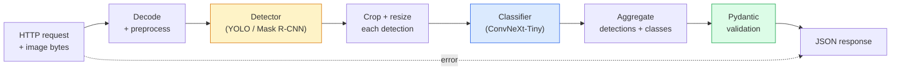

# 构建完整 Vision Pipeline  Capstone

> Üretim seviyesinin vizyonu sistemi, model ve kurallardan oluşan zincirlerden oluşur ve veri sözleşmesi ile 串联起来──本阶段的组件已经准备好; bu baş taşı onları uçtan sonuna bağlayacak──

**Type:** Build
**Languages:** Python
**Prerequisites:** Phase 4 Lessons 01-15
**Time:** ~120 minutes

## Öğrenme hedefi
- Design a production-level vision pipeline, objects ̳in sınıflandırılması için, output in yapılandırılmış JSON, in başarısız yolları aynı zamanda işlemek için
- Bu, bir maske, bir R-CNN veya bir YOLO sınıflandırıcısı ve bir veri sözleşmesi.
- Sonundan sonuna kadar boru hattına  benchmark yapın, ilk şişe boynunu belirleyin (genellikle önce önceden işleme, sonra detektör)
- 发布一个最小 FastAPI hizmet,接受图像上传,运行管道,并返回带有分类的检测结果

## 问题
单个视觉模型 很有用;视觉产品是由它们组成的链条──零售货架审计是检测仪 加产品分类器 再加价格-OCR管道──自动驾驶是2D检测仪 加3D检测仪加段机加跟踪仪加规划仪──医疗预查是分类器加地区分类器加临床医生 UI──

Bu bağlantıları bir araya getirmek, bir model prototipini ve bir ürünün anahtar kısmını ayırt etmek için geçerlidir. Modeller arasındaki her arayüz yeni bir hata kaynağıdır. Her koordinat dönüşümü, her normallaşma, her maskelerin boyutlandırılması, bir boru hattının gücünün en zayıf arayüzüne bağlıdır.

Bu temel taş en az kullanılabilir boru hattı inşa eder: tespit + sınıflandırma + yapılandırılmış çıkış + servis katmanı。4 aşamasındaki diğer içerikler bu yapıtaş içine yerleştirilebilir:把 Mask R-CNN 换成 YOLOv8,添加 OCR başlığı,添加分割分支,添加跟踪器。架构是稳定的;组件是插拔的。

## 概念
### - Boru hattı



七个阶段──两个模型阶段 开销很大;另外五个阶段则是 bug 最常出现的地方──

### 使用 Pydantic 定义 Veriler sözleşmesi

Her model sınırları bir tipleştirilmiş nesneye dönüşür. Bu da sessizlik başarısızlığını açık bir başarısızlığa dönüştürür.

```
Detection(
    box: tuple[float, float, float, float],   # (x1, y1, x2, y2), absolute pixels
    score: float,                              # [0, 1]
    class_id: int,                             # from detector's label map
    mask: Optional[list[list[int]]],           # RLE-encoded if present
)

PipelineResult(
    image_id: str,
    detections: list[Detection],
    classifications: list[Classification],
    inference_ms: float,
)
```

Detektor dönerken`(cx, cy, w, h)`Hayır.`(x1, y1, x2, y2)`Pydantic'in doğrulama süreci bozulur. Bir bitkiyi denemek yerine, sorun hemen fark edilir.

### 延迟花在哪里 ne zaman geçeceğim

Neredeyse her görüş borusu üç gerçekle uyumludur:

1. **Preprocessing 通常是最大的单个模块。**解码 JPEG、转换颜色空间、尺寸, bunlar CPU'ya bağlı ve kolayca göz ardı edilir.
2. **Detector 主导 GPU 时间。**GPU'nun %70'i, tespit ön geçişinde geçiyor.
3. **Postprocessing（NMS、RLE encode/decode）在 GPU 上便宜，在 CPU 上昂贵。**Bir gerçek hedef ortamı kullanmak zorunda.

Toplantıyı iyi anlamak için optimizeyi öncelikli bir liste haline getirmek için.

### Başarısızlık modları

- **Empty detections** 返回空列表, çökme ──记录 log──
- **Out-of-bounds boxes** Kırtma 前 clamp görüntü boyutuna kadar。
- **Tiny crops**                                                                                                                                                                                                                                                              
- **Corrupt upload** 返回带有具体错误代码的400回复,而不是500──
- **Model load failure**                                                                                                                                                                                                                                                              

Üretim sınıfı boru hattı, genel bir durum yazmak yerine her durumu ele alacak.`try/except`Bu başarısızlığın bir adı vardır.

### Toplama

Üretim seviyesinde hizmet 会服务多个客户──跨请求对检测和分类 进行批发可成倍提升吞吐量──代价是: waiting batch 填满会带来额外延迟──典型设置:最多收集 20ms 的请求,合并成批发响应,处理,再发发响应──`torchserve`和 `triton`Bu noktayı destekleyen bir yaşamdır.


```figure
v4-vision-pipeline
```

## Yapın onu.
### 步骤 1: Veriler sözleşmeleri

```python
from pydantic import BaseModel, Field
from typing import List, Optional, Tuple

class Detection(BaseModel):
    box: Tuple[float, float, float, float]
    score: float = Field(ge=0, le=1)
    class_id: int = Field(ge=0)
    mask_rle: Optional[str] = None


class Classification(BaseModel):
    detection_index: int
    class_id: int
    class_name: str
    score: float = Field(ge=0, le=1)


class PipelineResult(BaseModel):
    image_id: str
    detections: List[Detection]
    classifications: List[Classification]
    inference_ms: float
```

5 saniyelik kod, herhangi bir ciddi boru hattı için tasarruf edilebilir.

### 步骤 2: 类最小管道

```python
import time
import numpy as np
import torch
from PIL import Image

class VisionPipeline:
    def __init__(self, detector, classifier, class_names,
                 device="cpu", min_crop=32):
        self.detector = detector.to(device).eval()
        self.classifier = classifier.to(device).eval()
        self.class_names = class_names
        self.device = device
        self.min_crop = min_crop

    def preprocess(self, image):
        """
        image: PIL.Image or np.ndarray (H, W, 3) uint8
        returns: CHW float tensor on device
        """
        if isinstance(image, Image.Image):
            image = np.asarray(image.convert("RGB"))
        tensor = torch.from_numpy(image).permute(2, 0, 1).float() / 255.0
        return tensor.to(self.device)

    @torch.no_grad()
    def detect(self, image_tensor):
        return self.detector([image_tensor])[0]

    @torch.no_grad()
    def classify(self, crops):
        if len(crops) == 0:
            return []
        batch = torch.stack(crops).to(self.device)
        logits = self.classifier(batch)
        probs = logits.softmax(-1)
        scores, cls = probs.max(-1)
        return list(zip(cls.tolist(), scores.tolist()))

    def run(self, image, image_id="anonymous"):
        t0 = time.perf_counter()
        tensor = self.preprocess(image)
        det = self.detect(tensor)

        crops = []
        detections = []
        valid_indices = []
        for i, (box, score, cls) in enumerate(zip(det["boxes"], det["scores"], det["labels"])):
            x1, y1, x2, y2 = [max(0, int(b)) for b in box.tolist()]
            x2 = min(x2, tensor.shape[-1])
            y2 = min(y2, tensor.shape[-2])
            detections.append(Detection(
                box=(x1, y1, x2, y2),
                score=float(score),
                class_id=int(cls),
            ))
            if (x2 - x1) < self.min_crop or (y2 - y1) < self.min_crop:
                continue
            crop = tensor[:, y1:y2, x1:x2]
            crop = torch.nn.functional.interpolate(
                crop.unsqueeze(0),
                size=(224, 224),
                mode="bilinear",
                align_corners=False,
            )[0]
            crops.append(crop)
            valid_indices.append(i)

        class_preds = self.classify(crops)

        classifications = []
        for valid_idx, (cls_id, cls_score) in zip(valid_indices, class_preds):
            classifications.append(Classification(
                detection_index=valid_idx,
                class_id=int(cls_id),
                class_name=self.class_names[cls_id],
                score=float(cls_score),
            ))

        return PipelineResult(
            image_id=image_id,
            detections=detections,
            classifications=classifications,
            inference_ms=(time.perf_counter() - t0) * 1000,
        )
```

Her arayüz türlendirilmiştir. Her başarısızlık yolu, belirli bir işleme kararına sahiptir.

### 步骤 3: 连接一个探测器和一个分类器

```python
from torchvision.models.detection import maskrcnn_resnet50_fpn_v2
from torchvision.models import convnext_tiny

# Use ImageNet-pretrained weights for a realistic pipeline without training
detector = maskrcnn_resnet50_fpn_v2(weights="DEFAULT")
classifier = convnext_tiny(weights="DEFAULT")
class_names = [f"imagenet_class_{i}" for i in range(1000)]

pipe = VisionPipeline(detector, classifier, class_names)

# Smoke test with a synthetic image
test_image = (np.random.rand(400, 600, 3) * 255).astype(np.uint8)
result = pipe.run(test_image, image_id="demo")
print(result.model_dump_json(indent=2)[:500])
```

### 步骤 4: FastAPI hizmeti

```python
from fastapi import FastAPI, UploadFile, HTTPException
from io import BytesIO

app = FastAPI()
pipe = None  # initialised on startup

@app.on_event("startup")
def load():
    global pipe
    detector = maskrcnn_resnet50_fpn_v2(weights="DEFAULT").eval()
    classifier = convnext_tiny(weights="DEFAULT").eval()
    pipe = VisionPipeline(detector, classifier, class_names=[f"c{i}" for i in range(1000)])

@app.post("/detect")
async def detect_endpoint(file: UploadFile):
    if file.content_type not in {"image/jpeg", "image/png", "image/webp"}:
        raise HTTPException(status_code=400, detail="unsupported image type")
    data = await file.read()
    try:
        img = Image.open(BytesIO(data)).convert("RGB")
    except Exception:
        raise HTTPException(status_code=400, detail="cannot decode image")
    result = pipe.run(img, image_id=file.filename or "upload")
    return result.model_dump()
```

Kullanım`uvicorn main:app --host 0.0.0.0 --port 8000`运行。使用 `curl -F 'file=@dog.jpg' http://localhost:8000/detect`测试──

### Adım 5: Bu boru hattı göster

```python
import time

def benchmark(pipe, num_runs=20, image_size=(400, 600)):
    img = (np.random.rand(*image_size, 3) * 255).astype(np.uint8)
    pipe.run(img)  # warm up

    stages = {"preprocess": [], "detect": [], "classify": [], "total": []}
    for _ in range(num_runs):
        t0 = time.perf_counter()
        tensor = pipe.preprocess(img)
        t1 = time.perf_counter()
        det = pipe.detect(tensor)
        t2 = time.perf_counter()
        crops = []
        for box in det["boxes"]:
            x1, y1, x2, y2 = [max(0, int(b)) for b in box.tolist()]
            x2 = min(x2, tensor.shape[-1])
            y2 = min(y2, tensor.shape[-2])
            if (x2 - x1) >= pipe.min_crop and (y2 - y1) >= pipe.min_crop:
                crop = tensor[:, y1:y2, x1:x2]
                crop = torch.nn.functional.interpolate(
                    crop.unsqueeze(0), size=(224, 224), mode="bilinear", align_corners=False
                )[0]
                crops.append(crop)
        pipe.classify(crops)
        t3 = time.perf_counter()
        stages["preprocess"].append((t1 - t0) * 1000)
        stages["detect"].append((t2 - t1) * 1000)
        stages["classify"].append((t3 - t2) * 1000)
        stages["total"].append((t3 - t0) * 1000)

    for stage, times in stages.items():
        times.sort()
        print(f"{stage:12s}  p50={times[len(times)//2]:7.1f} ms  p95={times[int(len(times)*0.95)]:7.1f} ms")
```

CPU'nun tipik çıkışı: preprocess ~3 ms,değer 300-500 ms,classify 20-40 ms,total 350-550 ms;; GPU'da,değer 20-40 ms,bu zaman preprocess + classify 在相对占比上开始更重要;;

## Kullan
Ürün biçimi sonunda aynı yapı ile birlikte, eklenir:

- **Model versioning** 始终在回应中记录模型名 和重量哈希──
- **Per-request trace IDs** 记录 her istek her aşama zamanlama, böylece yavaş tepki ve aşama 关联起来.
- **Fallback path** Eğer sınıflandırıcı zamanlaması varsa, sınıflandırmanın tespit edilmesini geri getirmek yerine tüm talebi başarısız etmek gerekir.
- **Safety filters** NSFW / PII filtre 后分類 后応答 离开服务 之前运行。
- **Batch endpoint**Bir tane.`/detect_batch`, kabul görüntü URL 列表 büyük miktarda işleme için kullanılır。

 üretim servis için,`torchserve`- Evet.`Triton Inference Server`和 `BentoML`开箱即可处理批发,版本, ölçüm ve sağlık kontrolü`FastAPI`适合原型 和小规模产品──

## - Söyle.
Bu ders:

- `outputs/prompt-vision-service-shape-reviewer.md` Bir istek, görme hizmetini kontrol etmek için 代码中的合同/応答形 违规,并指出第一个破裂 bug──
- `outputs/skill-pipeline-budget-planner.md` Bir beceri, belirli hedef gecikme ve geçiş, her boru hattı aşamasında zaman bütçesini bölün, hangi aşamasında en çok bütçeden çıkış olacağını belirleyin.

## 练习
1. **(Easy)**Bu, her aşamada yapılan ortalama zaman raporunu ve her görüntüde tespit sayısını belirler.
2. **(Medium)**- Ver .`Detection`添加面具输出字段,并将其编码为 RLE──验证 Hatta 10 nesne görüntüsü bile JSON da 1MB 以下──
3. **(Hard)**Bir sınıflandırıcıda ön ek bir mikro-batcher: en fazla 10 ms'lik ürün toplayarak, bir GPU çağrısı ile hepsini sınıflandırın, sonra istek üzerine sonuçları geri gönderin.

## 关键术语
| Term | What people say | What it actually means |
|------|----------------|----------------------|
| Pipeline | “系统” | 由 preprocessing、inference 和 postprocessing step 组成的有序链条，每一对 step 之间都有类型化 interface |
| Data contract | “schema” | 每个 stage 的 input 和 output 都必须符合的 Pydantic / dataclass 定义；在边界处捕获 integration bug |
| Preprocessing | “model 之前” | 解码、颜色转换、resizing、normalising；通常是最大的 CPU 时间消耗点 |
| Postprocessing | “model 之后” | NMS、mask resize、threshold、RLE encode；在 GPU 上便宜，在 CPU 上昂贵 |
| Microbatcher | “先收集再 forward” | 在固定窗口内等待多个 request，然后运行一次 batched forward pass 的 aggregator |
| Trace ID | “Request id” | 每个 request 的标识符，会在每个 stage 记录，因此 slow request 可以端到端追踪 |
| Failure code | “命名错误” | 每类 failure 都有具体 error code，而不是泛化的 500；支持 client retry logic |
| Health check | “Readiness probe” | 一个低成本 endpoint，用于报告 service 是否可以响应；loadbalancer 依赖它 |

## 延伸阅读
- [Full Stack Deep Learning — Deploying Models](https://fullstackdeeplearning.com/course/2022/lecture-5-deployment/) 生产级 ML dağıtımının klasik özetleri
- [BentoML docs](https://docs.bentoml.com) 支持批发,版本和计量服务框架
- [torchserve docs](https://pytorch.org/serve/) PyTorch 官方 servis kütüphanesi
- [NVIDIA Triton Inference Server](https://developer.nvidia.com/triton-inference-server) 支持批发和多型的高吞吐量服务
