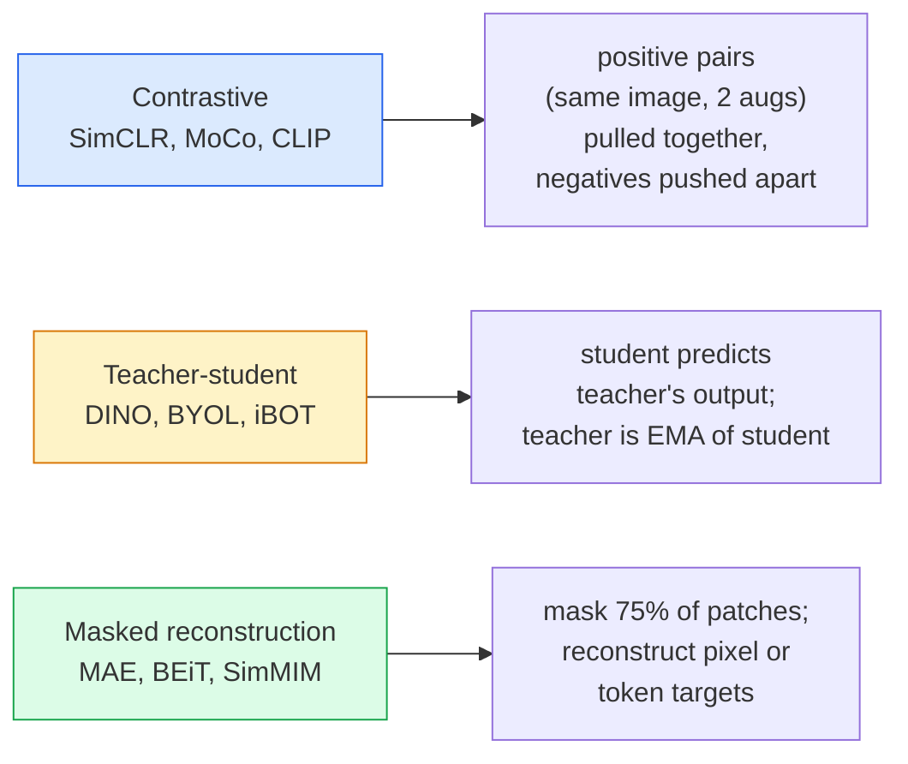

# Kendini Gözetleyici Görüş  SimCLR, DINO, MAE

> Etiketler:                                                                                                                                                                                                                                                              

**类型：**Öğrenim + yapı
**语言：**Python
**先修要求：**4. aşama 04 ders(İsmin sınıflandırması),4. aşama 14 ders(ViT)
**时间：**75 dakika kadar .

## Öğrenme hedefi

- 理三大 自主监督家族                                                                                                                                                                                                                                                          
- InfoNCE kaybını gerçekleştirmek için, niçin seri boyutu 512'dir, seri boyutu 32'dir, neden başarısız olduğunu açıklayın.
- Neden MAE'nin %75 maskeli oranı belirlenmemiş ve BERT metinlerinden %15'ten farklı olduğunu açıklayın
- DINOv2 veya MAE ImageNet kontrol noktalarını kullanmak  Dinov2 veya MAE ImageNet kontrol noktalarını kullanmak

## 问题

Gözetim ImageNet'te 1.3 milyon 张 标签 图像, 标签 费用估计为10M 美元──Medical 和 industrial 数据集更小, 标签 费用也更高──每个视觉 团队都会问: 我们能否先在廉价无标签数据上预训  YouTube 、web 、web 、webcrawls、webcam 摄像头扫描  然后在小规模有标签集合上进行调节吗?

Kendiliğinden denetimli öğrenme, işte bu cevap. LAION veya JFT'de eğitim gören modern kendiliğinden denetimli bir ViT, ince ayarlamalarda 后可達或超越监督 ImageNet 准确率── it is also like supervised pretraining 更好地迁移到下游任务(deteksiyon、sektörlük、 derinlik)──DINOv2(Meta,2023) ve MAE(Meta,2022)

Konsepsel dönüşüm: Ön metin görevi  模型が完成するために訓練された任務  ⇒ ⇒ ⇒ ⇒ ⇒ ⇒ ⇒ ⇒ ⇒ ⇒ ⇒ ⇒ ⇒ ⇒ ⇒ ⇒ ⇒ ⇒ ⇒ ⇒ ⇒ ⇒ ⇒ ⇒ ⇒ ⇒ ⇒ ⇒ ⇒ ⇒ ⇒ ⇒ ⇒ ⇒ ⇒ ⇒ ⇒ ⇒ ⇒ ⇒ ⇒ ⇒ ⇒ ⇒ ⇒ ⇒ ⇒ ⇒ ⇒ ⇒ ⇒ ⇒ ⇒ ⇒ ⇒ ⇒ ⇒ ⇒ ⇒ ⇒ ⇒ ⇒ ⇒ ⇒ ⇒ ⇒ ⇒ ⇒ ⇒ ⇒ ⇒ ⇒ ⇒ ⇒ ⇒ ⇒ ⇒ ⇒ ⇒ ⇒ ⇒ ⇒ ⇒ ⇒ ⇒ ⇒ ⇒ ⇒ ⇒ ⇒ ⇒ ⇒ ⇒ ⇒ ⇒ ⇒ ⇒ ⇒ ⇒ ⇒ ⇒ ⇒ ⇒ ⇒ ⇒ ⇒ ⇒ ⇒ ⇒ ⇒ ⇒ ⇒ ⇒ ⇒ ⇒ ⇒ ⇒ ⇒ ⇒ ⇒ ⇒ ⇒ ⇒ ⇒ ⇒ ⇒ ⇒ ⇒ ⇒ ⇒ ⇒ ⇒ ⇒ ⇒ ⇒ ⇒ ⇒ ⇒ ⇒ ⇒ ⇒ ⇒ ⇒ ⇒ ⇒ ⇒ ⇒ ⇒ ⇒ ⇒ ⇒ ⇒ ⇒ ⇒ ⇒ ⇒ ⇒ ⇒ ⇒ ⇒ ⇒ ⇒ ⇒ ⇒ ⇒ ⇒ ⇒ ⇒ ⇒ ⇒ ⇒ ⇒ ⇒ ⇒ ⇒ ⇒ ⇒ ⇒ ⇒ ⇒ ⇒ ⇒ ⇒ ⇒ ⇒ ⇒ ⇒ ⇒ ⇒ ⇒ ⇒ ⇒ ⇒ ⇒ ⇒ ⇒ ⇒ ⇒ ⇒ ⇒ ⇒ ⇒ ⇒ ⇒ ⇒ ⇒ ⇒ ⇒ ⇒ ⇒ ⇒ ⇒ ⇒ ⇒ ⇒ ⇒ ⇒ ⇒ ⇒ ⇒ ⇒ ⇒ ⇒ ⇒ ⇒ ⇒ ⇒ ⇒ ⇒ ⇒ ⇒ ⇒ ⇒ ⇒ ⇒ ⇒ ⇒ ⇒ ⇒ ⇒ ⇒ ⇒ ⇒ 

## 概念

### Üç aile



### Karşıtlıklı öğrenme (SimCLR)

取一张图像,应用两次随机增强,获得两次见解――将二者送入同一个编码加投影头――最小化一个损失,含义是 两种嵌入式 应该接近,并且 这个嵌入式 应该远离批次中所有其他图像的嵌入式──

```
Loss for positive pair (z_i, z_j) among 2N views per batch:

   L_ij = -log( exp(sim(z_i, z_j) / tau) / sum_k in batch \ {i} exp(sim(z_i, z_k) / tau) )

sim = cosine similarity
tau = temperature (0.1 standard)
```

Bu, InfoNCE kaybıdır. Her olumlu, birçok olumsuz gerektiriyor. Bu nedenle seri boyutu çok önemlidir. SimCLR'nin 512-8192 gerektirdiği.

### Öğretmen-öğrenci ((DINO)

两个结构相同的网络:学生和教师──教师是学生权重的指数动动平均(EMA)──二者都看到同一图像的增幅视图──学生的输出被训练为匹配教师的输出 没有明显负面──

```
loss = CE( student_output(view_1),  teacher_output(view_2) )
     + CE( student_output(view_2),  teacher_output(view_1) )

teacher_weights = m * teacher_weights + (1 - m) * student_weights   (m ≈ 0.996)
```

Neden çökmeyecektir 成预测一个常量:教师的输遇被集中了(减去每个维度的平均值)并磨了(除以较小温度) ・中心化 防止某个维度占主导;磨防止输出崩为均──

DINOv2  DINOv2                                                                                                                                                                                                                                                                                                                                                                                                                                                                                                                     

### Maskeli yeniden inşaat

Maske bir ViT 输入中75%'nin yamaları── yalnızca 25%'nin görünmesi mümkün olacak 送入编码──小解码器 接收编码器 输出以及位于掩盖位置的面具代码,并被训练重建掩盖补丁的像素──

```
Encoder:  visible 25% of patches -> features
Decoder:  features + mask tokens at masked positions -> reconstructed pixels
Loss:     MSE between reconstructed and original pixels on masked patches only
```

让 MAE 有效的关键设计选择:

- **75% mask ratio** 很高──迫使编码器 学习语义特征; yeniden inşa 25% 会接近微小的(相邻像素的相关性太强,到 CNN 都能轻松完成) 
- **Asymmetric encoder/decoder** Büyük ViT kodlayıcı Sadece görülebilir yamalar; küçük dekodör(8-katmanlı,512 boyutlu) yeniden inşaat işlemi.
- **Pixel-space reconstruction target** BET'in simgesel hedefinden daha basit ve ViT'de daha iyi sonuçlar elde etmek için daha kolay.

Pretraining  sonrasında, dekoderi bırakın ∞encoder ∞ feature extractor ∞

### Neden %75'i %15'i değil?

BERT maskesi 15%'nin belirtileri──MAE maskesi 75%── fark bilgi yoğunluğunda──

- Doğal dil Her bir simge  很高──预测 15% simgeler 仍然很难,因为每个掩盖位置都有许多可观的完成──
- Resim yamalarının  çok düşük                                                                                                                                                                                                                                                           

%75  yeterince yüksek, basit bir boşluğu dışarıdan çıkarmak için görevleri çözemez; kodlayıcı ı resmi içeriği göstermelidir.

### Düzsel araştırma değerlendirme

Kendini denetleyen eğitim öncesi eğitimden sonra standart değerlendirme**linear probe**:结 kodlayıcı, üzerinde ImageNet etiketlerine dayalı 训练一个单层线性分类器──报告 top-1 doğruluk──

- SimCLR ResNet-50: yaklaşık %71(2020)
- DINO ViT-S/16: Yaklaşık %77
- MAE ViT-L/16: yaklaşık %76
- DINOv2 ViT-g/14: yaklaşık %86

Düzsel araştırma, özelliklerin kalitesi için saf bir ölçümdür; ince ayarlama genellikle 2-5 puan artır, ancak baş yeniden eğitimin etkisine karışır.


```figure
data-augmentation
```

## Yapın onu.

### 步骤1: İki görüş artış boru hattı

```python
import torch
import torchvision.transforms as T

two_view_train = lambda: T.Compose([
    T.RandomResizedCrop(96, scale=(0.2, 1.0)),
    T.RandomHorizontalFlip(),
    T.ColorJitter(0.4, 0.4, 0.4, 0.1),
    T.RandomGrayscale(p=0.2),
    T.ToTensor(),
])


class TwoViewDataset(torch.utils.data.Dataset):
    def __init__(self, base):
        self.base = base
        self.aug = two_view_train()

    def __len__(self):
        return len(self.base)

    def __getitem__(self, i):
        img, _ = self.base[i]
        v1 = self.aug(img)
        v2 = self.aug(img)
        return v1, v2
```

Her biri .__getitem__Aynı görüntünün iki artıran görüntüsünü geri gönderin; etiket gerekmiyor.

### 步骤 2:BİLGİLİK kaybı

```python
import torch.nn.functional as F

def info_nce(z1, z2, tau=0.1):
    """
    z1, z2: (N, D) L2-normalised embeddings of paired views
    """
    N, D = z1.shape
    z = torch.cat([z1, z2], dim=0)  # (2N, D)
    sim = z @ z.T / tau              # (2N, 2N)

    mask = torch.eye(2 * N, dtype=torch.bool, device=z.device)
    sim = sim.masked_fill(mask, float("-inf"))

    targets = torch.cat([torch.arange(N, 2 * N), torch.arange(0, N)]).to(z.device)
    return F.cross_entropy(sim, targets)
```

调用前先对 Embeddings  L2 normalleştirmesini gerçekleştirmek`tau=0.1`SimCLR'nin öntanımlı değeri; daha düşük değer kaybı daha da artırır, daha fazla negatif gerektirir.

### 步骤 3:Sanit kontrol InfoNCE

```python
z1 = F.normalize(torch.randn(16, 32), dim=-1)
z2 = z1.clone()
loss_same = info_nce(z1, z2, tau=0.1).item()
z2_random = F.normalize(torch.randn(16, 32), dim=-1)
loss_random = info_nce(z1, z2_random, tau=0.1).item()
print(f"InfoNCE with identical pairs:  {loss_same:.3f}")
print(f"InfoNCE with random pairs:     {loss_random:.3f}")
```

Aynı çiftler                                                                                                                                                                                                                                                                                                                                                                                                                                                                                                                           

### 步骤 4:MAE tarzı maskeli

```python
def random_mask_indices(num_patches, mask_ratio=0.75, seed=0):
    g = torch.Generator().manual_seed(seed)
    n_keep = int(num_patches * (1 - mask_ratio))
    perm = torch.randperm(num_patches, generator=g)
    visible = perm[:n_keep]
    masked = perm[n_keep:]
    return visible.sort().values, masked.sort().values


num_patches = 196
visible, masked = random_mask_indices(num_patches, mask_ratio=0.75)
print(f"visible: {len(visible)} / {num_patches}")
print(f"masked:  {len(masked)} / {num_patches}")
```

简单、快速,并且对给定种子是决定性的的──真实MAE 实现将对其进行批发,并保留每个样品的面具──

## Kullan

DINOv2 2026 yılı için üretim standartıdır:

```python
import torch
from transformers import AutoImageProcessor, AutoModel

processor = AutoImageProcessor.from_pretrained("facebook/dinov2-base")
model = AutoModel.from_pretrained("facebook/dinov2-base")
model.eval()

# Per-image embeddings for zero-shot retrieval
with torch.no_grad():
    inputs = processor(images=[pil_image], return_tensors="pt")
    outputs = model(**inputs)
    embedding = outputs.last_hidden_state[:, 0]  # CLS token
```

768 boyutlu gömleğin oluşumu, modern görüntü alımında yoğun bir korespondans ve sıfır çekim transfer boru hattlarının kökenidir.

对于图像文本嵌入,SigLIP或OpenCLIP 是对应方案;对于MAE tarzı ince ayarlama,`timm`repo tüm MAE kontrol noktasını sağladı.

## - Söyle.

Bu ders:

- `outputs/prompt-ssl-pretraining-picker.md` Bir istek, veri kümesi boyutuna göre 計算 和下流任務 選択 SimCLR / MAE / DINOv2──
- `outputs/skill-linear-probe-runner.md`                                                                                                                                                                                                                                                              

## 练习

1. **（Easy）**验证: ⇒ ⇒ ⇒ ⇒ ⇒ ⇒ ⇒ ⇒ ⇒ ⇒ ⇒ ⇒ ⇒ ⇒ ⇒ ⇒ ⇒ ⇒ ⇒ ⇒ ⇒ ⇒ ⇒ ⇒ ⇒ ⇒ ⇒ ⇒ ⇒ ⇒ ⇒ ⇒ ⇒ ⇒ ⇒ ⇒ ⇒ ⇒ ⇒ ⇒ ⇒ ⇒ ⇒ ⇒ ⇒ ⇒ ⇒ ⇒ ⇒ ⇒ ⇒ ⇒ ⇒ ⇒ ⇒ ⇒ ⇒ ⇒ ⇒ ⇒ ⇒ ⇒ ⇒ ⇒ ⇒ ⇒ ⇒ ⇒ ⇒ ⇒ ⇒ ⇒ ⇒ ⇒ ⇒ ⇒ ⇒ ⇒ ⇒ ⇒ ⇒ ⇒ ⇒ ⇒ ⇒ ⇒ ⇒ ⇒ ⇒ ⇒ ⇒ ⇒ ⇒ ⇒ ⇒ ⇒ ⇒ ⇒ ⇒ ⇒ ⇒ ⇒ ⇒ ⇒ ⇒ ⇒ ⇒ ⇒ ⇒ ⇒ ⇒ ⇒ ⇒ ⇒  ⇒ ⇒ ⇒ ⇒ ⇒ ⇒ ⇒    ⇒ ⇒ ⇒   ⇒ ⇒     ⇒ ⇒ ⇒ ⇒ ⇒      ⇒ ⇒                                                                                                                                                                                                                                 `tau in [0.05, 0.1, 0.2, 0.5]`Kayıp karşılığı.
2. **（Medium）**DINO tarzı merkez tamponu gerçekleştirmek için gösterim. Eğer merkezi olmayansa öğrenci birkaç dönem içinde çöküşü için düzenli miktar vektörü görmektedir.
3. **（Hard）**10. Ders İçindeki Küçük Birim 作为脊椎,在CIFAR-100上训练 MAE──报告 10、50 和 200 epochs 时的线性探探精──展示在同一个1000-图片子集上,MAE-pretrained linear probe 优于从头监督的线性探探──

## 关键术语

| Term | 人们的说法 | 实际含义 |
|------|----------------|----------------------|
| Self-supervised | “Label-free” | 一种 pretext task，用于从无标注数据中产生有用 representations |
| Pretext task | “假任务” | SSL 期间使用的 objective（reconstruct patches、match views）；pretraining 后会被丢弃 |
| Linear probe | “Frozen encoder + linear head” | 标准 SSL 评估：只在 frozen features 之上训练一个 linear classifier |
| InfoNCE | “Contrastive loss” | 对 cosine similarities 做 softmax；positive pair 是目标类别，所有其他项都是 negatives |
| EMA teacher | “Moving-average teacher” | 权重是 student 的 exponential moving average 的 teacher；BYOL、MoCo、DINO 使用它 |
| Mask ratio | “隐藏的 patches 百分比” | MAE 期间被 mask 的 patches 比例；vision 为 75%，text 为 15% |
| Representation collapse | “Constant output” | SSL 失败模式：encoder 对所有输入输出一个常量 Vector；通过 centring、sharpening 或 negatives 防止 |
| DINOv2 | “生产级 SSL backbone” | Meta 2023 年的 self-supervised ViT；2026 年最强的通用 image features |

## 延伸阅读

- [SimCLR (Chen et al., 2020)](https://arxiv.org/abs/2002.05709) kontrastlı öğrenme 参考
- [DINO (Caron et al., 2021)](https://arxiv.org/abs/2104.14294) 带 momentum、centring、sharpening of teacher-student
- [MAE (He et al., 2022)](https://arxiv.org/abs/2111.06377) 面向 ViT'in maskeli otokodlayıcı öncesi eğitim
- [DINOv2 (Oquab et al., 2023)](https://arxiv.org/abs/2304.07193) Kendiliğinden denetimli ViT  üretim seviyesine yayılacak
