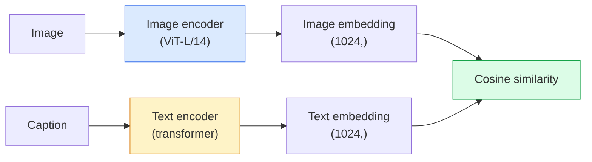

# Açık Sözlü Görüş  CLIP

> Bir resim kodlayıcıyı ve bir metin kodlayıcıyı birleştirerek, paylaşım alanındaki aynı noktaya uyum sağlamaya çalışın.

**Type:** Build + Use
**Languages:** Python
**Prerequisites:** Phase 4 Lesson 14 (ViT), Phase 4 Lesson 17 (Self-Supervised)
**Time:** ~45 分钟

## Öğrenme hedefi

-  açıklama CLIP'in iki kule mimarisi ve karşılaştırmalı eğitim amacı
- Önceden eğitimli CLIP ((( veya SigLIP) kullanarak sıfır atış sınıflandırması yapın, herhangi bir görev-özel eğitim gerektirmez.
- ZERO-shot sınıflandırmasını gerçekleştirmek:kod sınıfı istekleri, hesaplama kosinus benzerliği, argmax
- 区分 CLIP、SigLIP、OpenCLIP 和 LLaVA/LLaMA vizyon modelleri2026 yılında ne için kullanılacaklar

## 问题

传统分類器 是闭式词汇:一个1000级 ImageNet modeli 只能预测1000个标签──每个新类都需要标签数据 和重新训练的头──

CLIP(Radford et al., OpenAI 2021) webden 抓取的400M 个 (resim, başlık) çiftlerinde yukarı eğitildiğini göstermiştir, bir model elde edilebilir, bu sınıflar sadece doğal dil açıklaması ile yapılmalıdır.

Bu tür bir kapasite 零射转移就是每个现代视觉系统都从CLIP-family checkpoint 开始的原因──检测(Grounding DINO、OWL-ViT) 分割(CLIPSeg、SAM)  geri alım、内容调节、VLMs 和 text-to-image generation 都建立在CLIP tarzındaki ortak gömülmeler 之上──

## 概念

### İki kule



两个编码器 最后都会通过线性投影 投影到相同的嵌入维度 ((CLIP-B/32 为 512,CLIP-L/14 为 1024);; L2-normalise 并计算 cosine benzerliği。

### 目標

给定一个包含 N 个 (resim, başlık) çiftler batches,构建一个NxN benzerlik matrix──训练两个编码器,使对角形(匹配对)具有高相似性,而非对角形(非匹配)具有低相似性──

```
sim_matrix = image_embeddings @ text_embeddings.T / tau

loss_i2t = cross_entropy(sim_matrix,       targets=arange(N))
loss_t2i = cross_entropy(sim_matrix.T,     targets=arange(N))
loss = (loss_i2t + loss_t2i) / 2
```

Bu simetrik, çünkü resim-metin ve metin-resim geri alımı kullanılabilir olmalıdır.`tau`(temperatür) genellikle skalar parametresi olarak 0.07 olarak başlar.

### Daha iyi bir kayıp .

SigLIP ((Zhai et al., 2023) çift başına sigmoid  softmax değiştirildi:

```
loss = mean over pairs of log(1 + exp(-y_ij * sim_ij))
y_ij = +1 if matching, -1 otherwise
```

Çift başına Kayıp Clip gerektiren seri seviyesinin normallendirilmesini kaldırmıştır.

### sıfır atış sınıflandırması

İyi bir antrenman yap.

1. Her sınıfa, 组合一个提示:"Bir sınıfın fotoğrafı"
2. Metin kodlayıcı kodlama tüm sınıf ipuçları -> `T`şekli (C, d)
3. Enkodlama test görüntüsü -> `I`şekli (1, d)
4. Benzerlik = `I @ T.T`şekli (1, C) ⋅
5. Argmax -> öngörülen sınıfı。

Hızlı mühendislik  çok önemlidir。OpenAI 为 ImageNet 发布了80 个提示模板("a {}"、"a {}"、"a {}"、"a {}"、"a {}"、...)  "a {}"、"a {}"、"a skits"、"a"の模板の写真"、"a {}"、"a {}"、"a"の模板の画像"、"a {}"の模板の画像"、"a {}"の模板の画像"、"a {}"の模板の画像"、"a {}"の模板のスケッチ"、"a {}"の模板のスケッチ"、"a {}のスケッチ"、"a {}のスケッチ"、...) ・・・

### 2026 yıl CLIP tarzı modellerin kullanım sahnesini

- **Zero-shot classification**直接使用。
- **Image retrieval**一次性 kodlamak tüm görüntüler,  in inference 时 embed query
- **Text-conditioned detection**DINO ŌWL-ViT'in yerleştirilmesi, CLIP metin kulesini tespitçiye bağlayacaktır.
- **Text-conditioned segmentation**CLIPSeg;SAM 通过 CLIP 使用文本快速输入──
- **VLMs**LLaVA、Qwen-VL、InternVL CLIP aile görme kodlayıcı 接入 LLM。
- **Text-to-image gen**Stable Diffusion、DALL-E 3 以 CLIP metin yerleştirmeleri 为条件──

Paylaşılan yerleştirme alanı bir kez varsa, her vizyon+dilli görev mesafe hesaplama haline gelir.


```figure
clip-contrastive
```

## Yapın onu.

### 步骤 1: 极小的两楼模型

Gerçek CLIP, ViT + transformatörüdür. Bu derslerde, kuleler, önceden çekim özelliklerine dayanan küçük MLP'lerdir.

```python
import torch
import torch.nn as nn
import torch.nn.functional as F


class TwoTower(nn.Module):
    def __init__(self, img_in=128, txt_in=64, emb=64):
        super().__init__()
        self.image_proj = nn.Sequential(nn.Linear(img_in, 128), nn.ReLU(), nn.Linear(128, emb))
        self.text_proj = nn.Sequential(nn.Linear(txt_in, 128), nn.ReLU(), nn.Linear(128, emb))
        self.logit_scale = nn.Parameter(torch.ones([]) * 2.6592)  # ln(1/0.07)

    def forward(self, img_feats, txt_feats):
        i = F.normalize(self.image_proj(img_feats), dim=-1)
        t = F.normalize(self.text_proj(txt_feats), dim=-1)
        return i, t, self.logit_scale.exp()
```

两个投影、共享-dim输出、学习温度──形与真实Clip API 相同──

### 步骤 2: Karşılıklı Kayıp

```python
def clip_loss(image_emb, text_emb, logit_scale):
    N = image_emb.size(0)
    sim = logit_scale * image_emb @ text_emb.T
    targets = torch.arange(N, device=sim.device)
    l_i = F.cross_entropy(sim, targets)
    l_t = F.cross_entropy(sim.T, targets)
    return (l_i + l_t) / 2
```

Daha yüksek bir logit_skala = daha yüksek bir softmax = daha fazla güven, ama daha fazla risk var.

### 步骤 3: sıfır atış sınıflandırıcısı

```python
@torch.no_grad()
def zero_shot_classify(model, image_feats, class_text_feats, class_names):
    """
    image_feats:      (N, img_in)
    class_text_feats: (C, txt_in)   one averaged embedding per class
    """
    i = F.normalize(model.image_proj(image_feats), dim=-1)
    t = F.normalize(model.text_proj(class_text_feats), dim=-1)
    sim = i @ t.T
    pred = sim.argmax(dim=-1)
    return [class_names[p] for p in pred.tolist()]
```

Her adım bir satır. Bu, üretim CLIP kontrol noktasında kullanılan kesin sıfır çekim prosedürü.

### 4 adım: Sağlık kontrolü

```python
torch.manual_seed(0)
model = TwoTower()

img = torch.randn(8, 128)
txt = torch.randn(8, 64)
i, t, scale = model(img, txt)
loss = clip_loss(i, t, scale)
print(f"batch size: {i.size(0)}   loss: {loss.item():.3f}")
```

                                                                                                                                                                                                                                                              `log(N) = log(8) = 2.08`Bu henüz yapısal olarak öğrenilmemiş simetrik çapraz entropi hedefi.

## Kullan

OpenCLIP 2026 yılında topluluktan kabul edilen bir seçimdir:

```python
import open_clip
import torch
from PIL import Image

model, _, preprocess = open_clip.create_model_and_transforms("ViT-B-32", pretrained="laion2b_s34b_b79k")
tokenizer = open_clip.get_tokenizer("ViT-B-32")

image = preprocess(Image.open("dog.jpg")).unsqueeze(0)
text = tokenizer(["a photo of a dog", "a photo of a cat", "a photo of a car"])

with torch.no_grad():
    image_features = model.encode_image(image)
    text_features = model.encode_text(text)
    image_features = image_features / image_features.norm(dim=-1, keepdim=True)
    text_features = text_features / text_features.norm(dim=-1, keepdim=True)
    probs = (100.0 * image_features @ text_features.T).softmax(dim=-1)

print(probs)
```

SigLIP 更新,小規模下訓練更好,并且更适合新工作:`google/siglip-base-patch16-224`❖ Yüzü sarmak ❖

## - Söyle.

Bu ders:

- `outputs/prompt-zero-shot-class-picker.md`Bir sürpriz, belirli sınıflarda kullanılır 列表和域 时, for zero-shot CLIP 设计 class templates──
- `outputs/skill-image-text-retriever.md`Bir beceri, herhangi bir CLIP kontrol noktası ile  görüntü yerleştirme endeksini oluşturun, metin-ya da görüntü-ya da sorgu-ya da destekleyin。

## 练习

1. **（Easy）**Önceden eğitilmiş OpenCLIP ViT-B/32 kullanın ve CIFAR-10 上80 şablon sürpriz seti kullanın sıfır çekim sınıflandırması yapın.
2. **（Medium）**Aynı CIFAR-10 görevi üzerinde tek şablonla karşılaştırın "Bir {}" fotoğrafı ve 80 şablon ortalama gömülmeler ile.
3. **（Hard）**构建一个零镜像检索索索引: CLIP kullanarak 1.000 张图像嵌入, FAISS indeksini oluştur,自然语言描述 kullanarak sorgu yapmak.

## 关键术语

| Term | 人们怎么说 | 它实际意味着什么 |
|------|----------------|----------------------|
| Two-tower | "Dual encoder" | 独立的 image 和 text encoders，末端是 shared-dim projection head |
| Zero-shot | "No task-specific training" | 在 inference 时分类到仅由文本描述的 classes；不接触 labels |
| Temperature / logit_scale | "tau" | 在 softmax 前缩放 similarity matrix 的 learned scalar |
| Prompt template | "A photo of a {}" | 包裹 class names 的自然语言包装器；平均多个 templates 会提升 zero-shot accuracy |
| CLIP | "Image+text model" | 2021 年的 OpenAI model；2026 年该领域的通用语汇 |
| SigLIP | "Sigmoid CLIP" | 将 softmax 替换为 per-pair sigmoid；在小 batch 下训练更好 |
| OpenCLIP | "Open reproduction" | 社区在 LAION 上训练的 CLIP variants；open-source pipelines 的 production default |
| VLM | "Vision-language model" | CLIP-family encoder 加上 LLM，训练用来回答关于 images 的问题 |

## 延伸阅读

- [CLIP：从自然语言监督中学习可迁移视觉模型（Radford et al., 2021）](https://arxiv.org/abs/2103.00020)
- [SigLIP：用于 Language-Image Pre-Training 的 Sigmoid Loss（Zhai et al., 2023）](https://arxiv.org/abs/2303.15343)
- [OpenCLIP](https://github.com/mlfoundations/open_clip)社区 kod tabanı
- [DINOv2 vs CLIP vs MAE：features comparison](https://huggingface.co/blog/dinov2)包含并排 kullanım durumları HF kılavuzu
