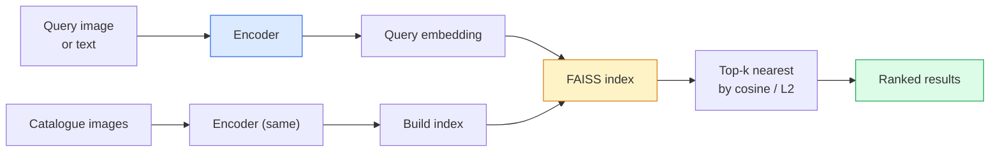

# Resim Alım ve Metrik Öğrenim

> Çıkarma sistemi, yerleşim alanında adayların sıralanmasına olan mesafeyi yerleştirir. Metrik öğrenme, bu alanın şekillendirilmesini sağlayan bir disiplintir.

**Type:** Build
**Languages:** Python
**Prerequisites:** Phase 4 Lesson 14 (ViT), Phase 4 Lesson 18 (CLIP)
**Time:** ~45 minutes

## Öğrenme hedefi
- 解释三点、矛盾 和 proxy-based metric learning losses,并为给定数据集选择合适的方法
- Doğrudan L2 normallaşmasını ve kozine benzerliğini gerçekleştirmek,并审计 "aynı madde" ile "aynı sınıf" geri alım arasındaki fark
- Construct FAISS index, using text and image query it,并为 held-out query set 报告 recall@K
- DINOv2、CLIP 和 SigLIP'i kullanmak için raf dışı kullanmak omurganları yerleştirmek, kendi ne zaman kazanırlarını bilmek

## 问题
Retrieval in production video system is everywhere:duplicate detection, reverse image search, visual search, " benzer ürünler bul ") ‘faç yeniden tanımlama, kontrol edilen kişiyi yeniden tanımlamak, e-ticaret için örnek seviyesinde eşleşme yapmak için kullanılır.’ Ürün sorusu her zaman aynıdır.

两个设计决策决定整个系统──Embedding,也就是由什么模型产生 Vector──Index,也就是如何在规模化场景中找到近邻──到2026年,都已商品化(DINOv2 用于Embedding,FAISS 用于索引), bu da 门:难点在定义你的应用中*什么算相似*,然后塑造嵌入空间,让距离与这个定义匹配──

Bu biçimlendirme, metrik öğrenme biçimidir.

## 概念
### Bir bakışta bir çıkış



### Dört kaybeden aile

| Loss | Requires | Pros | Cons |
|------|----------|------|------|
| **Contrastive** | (anchor, positive) + negatives | 简单，可用于任何 pair label | 没有大量 negatives 时收敛较慢 |
| **Triplet** | (anchor, positive, negative) | 直观；可直接控制 margin | Hard-triplet mining 成本高 |
| **NT-Xent / InfoNCE** | Pairs + batch-mined negatives | 可扩展到大 batch | 需要大 batch 或 momentum queue |
| **Proxy-based (ProxyNCA)** | 仅 class labels | 快速、稳定、无需 mining | 在小数据集上可能 overfit 到 proxies |

Çoğu üretim kullanımına göre, önce önceden eğitilmiş omurganı  başlayın; sadece raf dışı yerleşimlerde test kitlesinde performans eksikliği olduğunda, metrik öğrenme ince ayarlarını tekrar ekleyin.

### Üçlü kayıp resmi olarak

```
L = max(0, ||f(a) - f(p)||^2 - ||f(a) - f(n)||^2 + margin)
```

Anchor et`a`拉近 olumlu `p`, onu negatifden at .`n`,并使用 `margin`确保间隔──三图结构可泛化到任何相似度排序──

Madencilik  很重要: kolay üçlüler(`n`Artık gitmiş .`a`很远) 贡献零 Loss;只有硬三人才教会模型──半硬挖掘(`n`- Hayır .`p`Daha da uzakta ama hala bir kenarda) 2016 yılında FaceNet'in bir programı ve bugün hala baskın konumdadır.

### Cosine benzerliği vs L2

İki metrik, iki set:

- **Cosine**:Vektor 之间的角── L2 normallaştırılmış yerleşimler gerekir──
- **L2**:Euklide mesafeı── çiğ veya normalleştirilmiş yerleşimlerde kullanılabilir, ancak genellikle L2-normalleştirilmiş + kare L2 搭配──

Çoğu modern ağ için, ikisi de eşit fiyatlı:`||a|| = ||b|| = 1`时,`||a - b||^2 = 2 - 2 cos(a, b)`△ Seçim                                                                                                                                                                                                                                                             

### Hatırlat @ K

标准 geri alım metrikleri:

```
recall@K = fraction of queries where at least one correct match is in the top K results
```

Notes: REPORT Recall@1、@5、@10。若 recall@10 高于0.95 而 recall@1 低于0.5,说明 Embedding space 结构正确,但排序有噪音;可以尝试更长的细节或重排序步骤──

Duplikat algılama için, doğruluk@K daha önemlidir, çünkü her yanlış pozitif kullanıcı tarafından görülebilir bir hata olmuştur.

### FAISS tek bir paragraf

Facebook AI Benzerlik Aramaları──事实标准的近邻搜索 库──三种索引 选择:

- `IndexFlatIP`- Ne ?`IndexFlatL2` kaba güç、精确、无需训练──可用到约1M vektör──
- `IndexIVFFlat`  K 个 hücrelerine bölün, sadece yakın birkaç hücre arayın¬¬¬ yakınlık 、 快速、 需要训练数据¬¬
- `IndexHNSW` Grafik tabanlı, çok sayıda sorguya en hızlı, indeks boyutu 较大──

100k vektörler için, cosine benzerliği üzerinde düşünüyor olabilir `IndexFlatIP`❖ 10M için kullanmak `IndexIVFFlat`❖ 100M+ için, ürün miktarı`IndexIVFPQ`)。

### örnek seviyesine karşı kategoriler seviyesine karşı çekim

Aynı ama çok farklı iki sorun:

- **Category-level** "在我的目录 中找猫──" Sınıf koşulları benzerliği; raf dışı CLIP / DINOv2 Embeddings 效果很好──
- **Instance-level** "在我的目录中找*这个确切产品*──" 需要在同一类内视觉相似对象之间做细粒度区分;off-the-shelf Embeddings表现不足;使用的测量学习细调; çok önemlidir──

Seçim modelinden önce, hangisini çözdüğünü bilmek için öncelikle sor.


```figure
metric-embedding
```

## Yapın onu.
### 步骤 1: Üçlü kayıp

```python
import torch
import torch.nn.functional as F

def triplet_loss(anchor, positive, negative, margin=0.2):
    d_ap = F.pairwise_distance(anchor, positive, p=2)
    d_an = F.pairwise_distance(anchor, negative, p=2)
    return F.relu(d_ap - d_an + margin).mean()
```

Bir行── L2 normallaştırılmış veya ham yerleşimlere uygundur──

### 步骤 2: Yarım sert madencilik

给定一批嵌入和标签,为每个 ancor 找到最难的半硬负面──

```python
def semi_hard_negatives(emb, labels, margin=0.2):
    dist = torch.cdist(emb, emb)
    same_class = labels[:, None] == labels[None, :]
    diff_class = ~same_class
    N = emb.size(0)

    positives = dist.clone()
    positives[~same_class] = float("-inf")
    positives.fill_diagonal_(float("-inf"))
    pos_idx = positives.argmax(dim=1)

    semi_hard = dist.clone()
    semi_hard[same_class] = float("inf")
    d_ap = dist[torch.arange(N), pos_idx].unsqueeze(1)
    semi_hard[dist <= d_ap] = float("inf")
    neg_idx = semi_hard.argmin(dim=1)

    fallback_mask = semi_hard[torch.arange(N), neg_idx] == float("inf")
    if fallback_mask.any():
        hardest = dist.clone()
        hardest[same_class] = float("inf")
        neg_idx = torch.where(fallback_mask, hardest.argmin(dim=1), neg_idx)
    return pos_idx, neg_idx
```

Her bir demirci sınıfın en zorlu pozitiflerini, ayrıca pozitiften daha uzak ama kenarlıkta olan yarı sert negatiflerini elde eder.

### 3 . Adım: Hatırlat

```python
def recall_at_k(query_emb, gallery_emb, query_labels, gallery_labels, k=1):
    sim = query_emb @ gallery_emb.T
    _, top_k = sim.topk(k, dim=-1)
    matches = (gallery_labels[top_k] == query_labels[:, None]).any(dim=-1)
    return matches.float().mean().item()
```

L2 normallendirilmiş yerleşimlerde üst-k, üst-k, üst-k, üst-k gibi eşit olarak üst-k ile eşit olarak üst-k olarak üst-k olarak göre göre göre göre göre göre göre göre göre göre en az bir doğru komşu sorgu ortalaması vardır.

### 4 adım: Bir araya getirmek

```python
import torch
import torch.nn as nn
from torch.optim import Adam

class Encoder(nn.Module):
    def __init__(self, in_dim=128, emb_dim=64):
        super().__init__()
        self.net = nn.Sequential(
            nn.Linear(in_dim, 128), nn.ReLU(),
            nn.Linear(128, emb_dim),
        )

    def forward(self, x):
        return F.normalize(self.net(x), dim=-1)

torch.manual_seed(0)
num_classes = 6
protos = F.normalize(torch.randn(num_classes, 128), dim=-1)

def sample_batch(bs=32):
    labels = torch.randint(0, num_classes, (bs,))
    x = protos[labels] + 0.15 * torch.randn(bs, 128)
    return x, labels

enc = Encoder()
opt = Adam(enc.parameters(), lr=3e-3)

for step in range(200):
    x, y = sample_batch(32)
    emb = enc(x)
    pos_idx, neg_idx = semi_hard_negatives(emb, y)
    loss = triplet_loss(emb, emb[pos_idx], emb[neg_idx])
    opt.zero_grad(); loss.backward(); opt.step()
```

Birkaç yüz adım sonra, yerleştirme kümeleri her sınıfı bir kümeden oluşturacak.

## Kullan
2026 yılının üretiminde:

- **DINOv2 + FAISS** 通用 görsel kurtarma──可 off-the-shelf 使用──
- **CLIP + FAISS** 当查询是文本时──
- **Fine-tuned DINOv2 + FAISS** örnek düzeyde geri alım, yüz yeniden tanımlama, moda, e-ticaret
- **Milvus / Weaviate / Qdrant**  FAISS veya HNSW'nin yönetilen vektör DB ambalajları etrafında。

 SOTA örnekleri için,配方是:DINOv2 omurgası,添加 Embedding başı, instance-labelled çiftlerde 上用三小段或 InfoNCE Loss-tune, ve FAISS içinde oluşturmak indeksi。

## - Söyle.
本课产 出:

- `outputs/prompt-retrieval-loss-picker.md`                                                                                                                                                                                                                                                              
- `outputs/skill-recall-at-k-runner.md` Bir beceri, hazırlamak için kullanılır干净的回忆@K değerlendirme harness,包含火车/val/galerie split 和正确的数据契约──

## 练习
1. **(Easy)**运行上述玩具例──PCA 绘制训练前后的嵌入,观察六个集群 如何形成──
2. **(Medium)**添加 ProxyNCA Loss 实现: 每类 一个学会的"proxy",在宇宙相似性上做标准交叉 Entropy──比较它与三小数损失在玩具数据上的收速度──
3. **(Hard)**取 1,000 张 ImageNet onay görüntüleri, HuggingFace ile DINOv2 生成 Embeddings kullanarak, FAISS düz indeksi oluşturmak,并報告以同一批图像为查询 时的回忆@{1, 5, 10}(应为 1.0),以及以持久的分割 和 ImageNet etiketler 作为 ground truth 时的结果──

## 关键术语
| Term | What people say | What it actually means |
|------|----------------|----------------------|
| Metric learning | "Shape the space" | 训练一个 encoder，使其输出空间中的距离反映目标相似度 |
| Triplet loss | "Pull and push" | L = max(0, d(a, p) - d(a, n) + margin)；经典的 metric-learning Loss |
| Semi-hard mining | "Useful negatives" | 比 positive 更远但仍在 margin 内的 negatives；经验上信息量最大 |
| Proxy-based loss | "Class prototypes" | 每个 class 一个 learned proxy；对 similarity-to-proxies 做 cross-entropy；无需 pair mining |
| Recall@K | "Top-K hit rate" | top K 中至少有一个正确结果的查询比例 |
| Instance retrieval | "Find this exact thing" | 细粒度匹配；off-the-shelf features 通常表现不足 |
| FAISS | "The NN library" | Facebook 的 nearest-neighbour 库；支持精确和近似 indexes |
| HNSW | "Graph index" | Hierarchical navigable small world；内存开销小的快速近似 NN |

## 延伸阅读
- [FaceNet: A Unified Embedding for Face Recognition (Schroff et al., 2015)](https://arxiv.org/abs/1503.03832) üçlü kayıp / yarı sert madencilik 论文
- [In Defense of the Triplet Loss for Person Re-Identification (Hermans et al., 2017)](https://arxiv.org/abs/1703.07737) üçlü ince ayarlama 实践指南
- [FAISS documentation](https://github.com/facebookresearch/faiss/wiki) Her tür endeks, her tür değişim
- [SMoT: Metric Learning Taxonomy (Kim et al., 2021)](https://arxiv.org/abs/2010.06927) 现代 kaybı  ve bağlantısı 综述
