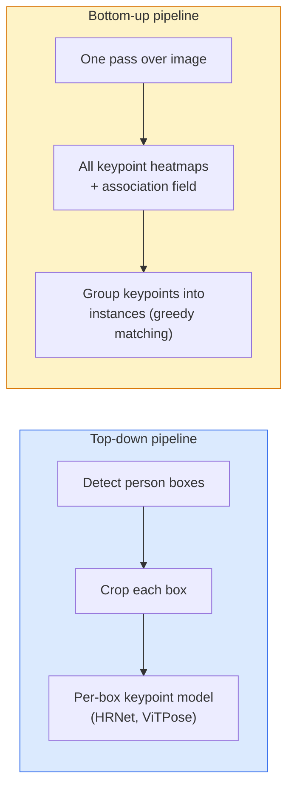

# Anahtar Nokta Bulma ve Poz Tahmini

> Bir poz bir grup düzenli anahtar noktalardır. Bir anahtar nokta detektörü bir ısı haritası gericilidir.

**Type:** Build
**Languages:** Python
**Prerequisites:** Phase 4 Lesson 06 (Detection), Phase 4 Lesson 07 (U-Net)
**Time:** ~45 分钟

## Öğrenme hedefi
- 区分 yukarı aşağı ve alt yukarı poz tahminleri,并说明各自何时使用
- Kullanın Gaussian-per-keypoint hedefi K 个 anahtar noktaları Geri dönüş sıcaklık haritaları ve sonuçlar 提提取 keypoint koordinatları
- 解释 Part Affinity Fields (PAFs), ve alt yukarı boru hattları 如何把关联成实例
- MediaPipe Pose veya MMPose kullanın ve üretim seviyesinin anahtar nokta tahminlerini yapın ve bunların çıkış biçimini anlayın

## 问题
Ana nokta görevleri var: insan pozesi ((17 个体关节) 、 yüz simgeselleri ((68 个点) 、手 ((21 个点) 、 hayvan pozesi、 robot nesne pozesi、 tıbbi anatomi simgeselleri。 bunlar hepsi aynı yapı ile paylaşırlar:

Poz tahminleri hareket yakalama, fitness uygulamaları, spor analitiği, hareket kontrolü, animasyon, AR deneyimi ve robot yakalama temelidir.

工程问题在于尺度──单图、单人姿 是一个20ms 问题──人群中的多人姿 要在30fps 下运行,则是一个完全不同的结构问题──

## 概念
### Yukarıdan aşağıya karşı aşağıya



- **Top-down** Önceden insanları kontrol etmek, her bitkiyi yeniden kontrol etmek 运行 per person keypoint model──准确率最高;随人数线性扩展──
- **Bottom-up**                                                                                                                                                                                                                                                              

Yukarıdan aşağı (HRNet, ViTPose) = doğru oranlı liderlik programı; aşağıdan yukarı (OpenPose, HigherHRNet) = yoğun sahneler arasında %2 oranlı liderlik programı.

### Sıcaklık haritası geri dönüşü

Doğrudan Geri Dönme`(x, y)`Ama her bir anahtar noktaya göre bir tane.`H x W`Gerçek konum merkezinde Gaussian bir damla var.

```
target[k, y, x] = exp(-((x - cx_k)^2 + (y - cy_k)^2) / (2 sigma^2))
```

Sonuçta, her sıcaklık haritasının argmax'i, tahminin anahtar noktasının konumudur.

Neden sıcak haritalar doğrudan gerileme daha iyi: ağın uzay yapısı(conv özellik harita) doğal olarak hazırlıklı alanı çıkarmak için.Gaussian hedefleri de düzenlenme etkisi  küçük yerleşim hatası  küçük kayıplar meydana gelecektir, değil, sıfır 

### Alt piksel yerleşimi

Argmax  give integer坐标── alt piksel hassasiyetini elde etmek için argmax  ve komşu alanlarına uygun parabola ile veya normal ofset kullanılabilir `(dx, dy) = 0.25 * (heatmap[y, x+1] - heatmap[y, x-1], ...)`Yönlendirme.

### Bölüm Affinity Alanları (PAF)

OpenPose, altdan yukarı ilişki tekniğini kullanır. Her bir çift bağlantı anahtar noktası için (örneğin sol omuzdan sol elbiseye kadar), 2 kanal alanı tahmin ederek, bir noktadan diğer noktaya doğru işaret eden birim vektörünü kodlamaktadır. Omzu ile elbiseyi 关联起来,沿连接候选对线积分 PAF;积分最高的对被匹配──

```
For each connection (limb):
  PAF channels: 2 (unit vector x, y)
  Line integral: sum over sample points of (PAF . line_direction)
  Higher integral = stronger match
```

Bu yöntem güzeldir ve kişi başına bitkiler gerekmez.

### COCO Anahtar Noktalar

標準的 body-pose dataset: 每个人 17 个关键点, PCK (Pürsenti Doğru关键点) ve OKS (OJECT Keypoint Similarity) olarak ölçümler olarak kullanılır.

### 2D vs 3D

- **2D pose** görüntü koordinatları; üretimi 
- **3D pose** dünya / kamera koordinatları; hala aktif çalışma yönleri──常见方法:
  - Küçük bir MLP ile 2D tahminlerini 3D'ye yükselteceğim.
  - 直接从图像做3D regression (PyMAF, MHFormer)
  - Çok görüntü ayarları (CMU Panoptic) yeraltı gerçeği için kullanılır.


```figure
cv3-pose-heatmap
```

## Yapın onu.
### 步骤 1: Gaussian ısı haritası hedefi

```python
import numpy as np
import torch

def gaussian_heatmap(size, cx, cy, sigma=2.0):
    yy, xx = np.meshgrid(np.arange(size), np.arange(size), indexing="ij")
    return np.exp(-((xx - cx) ** 2 + (yy - cy) ** 2) / (2 * sigma ** 2)).astype(np.float32)

hm = gaussian_heatmap(64, 32, 32, sigma=2.0)
print(f"peak: {hm.max():.3f} at ({hm.argmax() % 64}, {hm.argmax() // 64})")
```

Kanal eksesi boyunca anahtar noktası başına ısı haritasını toplayarak tam hedef tenzor elde ederiz.

### 步骤 2: Küçük bir anahtar nokta başı

Bir U-Net tarzı modeli, K 个 热地图频道输出――

```python
import torch.nn as nn
import torch.nn.functional as F

class TinyKeypointNet(nn.Module):
    def __init__(self, num_keypoints=4, base=16):
        super().__init__()
        self.down1 = nn.Sequential(nn.Conv2d(3, base, 3, 2, 1), nn.ReLU(inplace=True))
        self.down2 = nn.Sequential(nn.Conv2d(base, base * 2, 3, 2, 1), nn.ReLU(inplace=True))
        self.mid = nn.Sequential(nn.Conv2d(base * 2, base * 2, 3, 1, 1), nn.ReLU(inplace=True))
        self.up1 = nn.ConvTranspose2d(base * 2, base, 2, 2)
        self.up2 = nn.ConvTranspose2d(base, num_keypoints, 2, 2)

    def forward(self, x):
        h1 = self.down1(x)
        h2 = self.down2(h1)
        h3 = self.mid(h2)
        u1 = self.up1(h3)
        return self.up2(u1)
```

输入 `(N, 3, H, W)`, Dışarı çıkış`(N, K, H, W)`❖ Kayıplar Gaussian hedeflerinin piksel başına MSE'dir.

### 步骤 3: İndirim  anahtar nokta koordinatlarını çıkar

```python
def heatmap_to_coords(heatmaps):
    """
    heatmaps: (N, K, H, W)
    returns:  (N, K, 2) float coordinates in image pixels
    """
    N, K, H, W = heatmaps.shape
    hm = heatmaps.reshape(N, K, -1)
    idx = hm.argmax(dim=-1)
    ys = (idx // W).float()
    xs = (idx % W).float()
    return torch.stack([xs, ys], dim=-1)

coords = heatmap_to_coords(torch.randn(2, 4, 32, 32))
print(f"coords: {coords.shape}")  # (2, 4, 2)
```

İnferans 时只需一行──Ayrıca piksellerin artan hale getirilmesi için, argmax 周围插值──

### 步骤 4: Sintez anahtar nokta verisi

很简单: 白色帆布上画四个点,并学习预测它们──

```python
def make_synthetic_sample(size=64):
    img = np.ones((3, size, size), dtype=np.float32)
    rng = np.random.default_rng()
    kps = rng.integers(8, size - 8, size=(4, 2))
    for cx, cy in kps:
        img[:, cy - 2:cy + 2, cx - 2:cx + 2] = 0.0
    hms = np.stack([gaussian_heatmap(size, cx, cy) for cx, cy in kps])
    return img, hms, kps
```

Bu iş yeterince basit, küçük bir model bir dakikada öğrenmek üzere.

### 5 adım: Eğitim

```python
model = TinyKeypointNet(num_keypoints=4)
opt = torch.optim.Adam(model.parameters(), lr=3e-3)

for step in range(200):
    batch = [make_synthetic_sample() for _ in range(16)]
    imgs = torch.from_numpy(np.stack([b[0] for b in batch]))
    hms = torch.from_numpy(np.stack([b[1] for b in batch]))
    pred = model(imgs)
    # Upsample pred to full resolution
    pred = F.interpolate(pred, size=hms.shape[-2:], mode="bilinear", align_corners=False)
    loss = F.mse_loss(pred, hms)
    opt.zero_grad(); loss.backward(); opt.step()
```

## Kullan
- **MediaPipe Pose** Google'ın üretim seviyesinin poz tahmincisi; WebGL + mobil çalıştırma zamanları, gecikme 10 ms'dan düşük olarak sağlanır.
- **MMPose**(OpenMMLab)  全面的研究代码库;包含每种SOTA mimarisi 及预训练的权重──
- **YOLOv8-pose** 最快的实时多人姿,单次前进通用──
- **transformers HumanDPT / PoseAnything** Açık sözcük pozundan  herhangi bir nesne  herhangi bir anahtar nokta seti) daha yeni görüş dilinin yaklaşımlarından kullanılmıştır。

## - Söyle.
本课产 出:

- `outputs/prompt-pose-stack-picker.md` Bir istek, latensi­ye göre √ kalabalık boyutuna göre, ve ayrıca 2D vs 3D  需求選択 MediaPipe / YOLOv8-pose / HRNet / ViTPose。
- `outputs/skill-heatmap-to-coords.md` Her üretim poz modelini yazmak için kullanılan bir beceri, 

## 练习
1. **(Easy)**Sintez 4 nokta verisi kümesi 上训练 微小键点模型──报告 200 adım 后预测与真键点 之间的平均 L2 hata──
2. **(Medium)**添加子像素精炼:给定 argmax position,沿 x 和 y 方向使用邻近像素 拟合1D parabola──报告对整数 argmax的精度增──
3. **(Hard)** 2 kişilik sentetik veri kümesi oluşturun, bunlardan her bir görüntü  iki 4 anahtar nokta örneği örneğini gösterir  training a bottom-up pipeline of PAFs, predictet which key point  belongs to which instance,并 evaluate OKS

## 关键术语
| Term | 人们怎么说 | 它实际是什么意思 |
|------|----------------|----------------------|
| Keypoint | "一个 landmark" | object 上的一个特定有序点（joint、corner、feature） |
| Pose | "skeleton" | 属于一个 instance 的一组有序 keypoints |
| Top-down | "先 detect，再 pose" | Two-stage pipeline：person detector + per-crop keypoint model；准确率最高 |
| Bottom-up | "先 pose，后 group" | Single-pass all-keypoint prediction + grouping；在 crowd size 上耗时恒定 |
| Heatmap | "Gaussian target" | 每个 keypoint 一个 H x W tensor，峰值位于真实位置；首选的 Regression target |
| PAF | "Part Affinity Field" | 编码 limb directions 的 2-channel unit vector field；用于把 keypoints 分组为 instances |
| OKS | "Keypoint IoU" | Object Keypoint Similarity；COCO 的 pose metric |
| HRNet | "High-Resolution Net" | 主流 top-down keypoint architecture；全程保留 high-res features |

## 延伸阅读
- [OpenPose (Cao et al., 2017)](https://arxiv.org/abs/1812.08008) PAF'lerin alt-üstünü kullanmak; hala bu yöntemin en iyi açıklama malzemesi
- [HRNet (Sun et al., 2019)](https://arxiv.org/abs/1902.09212) Yukarıdan Aşağıya 参考架构
- [ViTPose (Xu et al., 2022)](https://arxiv.org/abs/2204.12484) Uygulayabilir bir VIT kullanmak 作为姿骨;在许多基准上是当前SOTA
- [MediaPipe Pose](https://developers.google.com/mediapipe/solutions/vision/pose_landmarker) 生产级实时姿;2026年部署最快的堆
