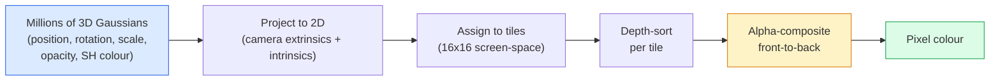

# 3D Gaussian Splating'i gerçekleştirmek

> Bir sahne, milyonlarca 3 boyutlu Gaussian'dan oluşan bir grup buluttur. Her Gaussian'ın konum, yönelim, ölçek ve açıklık ve bakış yönüne bağlı bir renk vardır.

**类型：**Yapım
**语言：**Python
**先修要求：**4. Fase Ders 13 (3D Görme ve NeRF)  1. Fase Ders 12 (Tensor Operasyonları)  4. Fase Ders 10 (Difüzyon Temelleri Seçmeli)
**时间：**90 dakika kadar .

## Öğrenme hedefi

- 解释为什么到2026年,3D Gaussian Splating 已取代NeRF,成为光现实3D重建的生产默认方案
- Bu sayede, her Gaussian'ın altı sınıfı belirtilir.
-                                                                                                                                                                                                                                                                                                                                                                                                                                                                                                                              `alpha`2D Gaussian splating rasterizer'i oluşturmak ve 3D'de nasıl aynı döngüye doğru projekt edileceğini açıklamak
- Kullanım`nerfstudio`- Evet.`gsplat`Ya da`SuperSplat`20-50 张照片 yeniden inşa ettirmek için bir sahne,并导出为`KHR_gaussian_splatting`glTF uzatma veya OpenUSD 26.03 `UsdVolParticleField3DGaussianSplat`Şema

## 问题

NeRF, sahneyi bir MLP ağırlığına depolayacaktır. Her piksel bir ışın boyunca bir MLP sorgulaması yapmalıdır.

3D Gaussian Splating(Kerbl、Kopanas、Leimkühler、Drettakis,SIGGRAPH 2023) hepsini değiştirdi. Bir sahne açıkça 3D Gaussian 集合ıdır. 染 GPU'da 100+ fps ile yapılan rasterleşme。 eğitim sadece birkaç dakikalık sürer. Edit edilmek doğrudan:平移部分 Gaussian,你就移动椅子──2026 yılına kadar, Kronos Group 已批准用于Gaussian splatts glTF extension,OpenUSD 26.03 已内置Gaussian splat schema,Zillow 和染物地产内容,而大多数关于3D重建的新研究论文都是核心3DGS思路体变化──

), ), ), ), ), ), ), ), ), ), ), ), ), ), ), ), ), ), ), ), ), ), ), ), ), ), ), ), ), ), ), ), ), ), ), ), ), ), ), ), ), ), ), ), ), ), ), ), ), ), ), ), ), ), ), ), ), ), ), ), ), ), ), ), ), ), ), ), ), ), ), ), ), ), ), ), ), ), ), ), ), ), ), ), ), ), ), ), ), ), ), ), ), ), ), ), ), ), ), ), ), ), ), ), ), ), ), ), ), ), ), ), ), ), ), ), ), ), ), ), ), ), ), ), ), ), ), ), ), ), ), ), ), ), ), ), ), ), ), ), ), ), ), ), ), ), ), ), ), ), ), ), ), ), ), ), ), ), ), ), ), ), ), ), ), ), ), ), ), ), ), ), ), ), ), ), ), ), ), ), ), ), ), ), ), ), ), ), ), ), ), ), ), ), ), ), ), ), ), ), ), ), ), ), ), ), ), ), ), ), ), ), ), ), ), ), ), ), ), ), ), (), (), (), (), (), (), (), (), (), (), (), (), (), (), (), (), (), (), (), (), (), (b) (), (), ( ( (), (), ( ( ( (), ( (), (), (), (

## 核心概念

### Bir Gaussian ne taşır ?

Bir 3D Gaussian, bu özelliklere sahip bir alanın parametreleşmiş bir blobudur:

```
position         mu         (3,)    centre in world coordinates
rotation         q          (4,)    unit quaternion encoding orientation
scale            s          (3,)    log-scales per axis (exponentiated at render time)
opacity          alpha      (1,)    post-sigmoid opacity [0, 1]
SH coefficients  c_lm       (3 * (L+1)^2,)   view-dependent colour
```

Rotasyon + ölçek 3x3 bir kovarians oluşturur:`Sigma = R S S^T R^T`Bu, Gaussian'ın 3D'de şekli. Sferik harmonikler renklerin izleme yönünü değiştirebilir. Özel noktalar, küçük parlaklıklar, görüntü bağımlılıklı parlaklık, görüntüleme yapıları depolamaya gerek yoktur.

Bir sahne genellikle 1-5 milyon Gaussian vardır. Her bir sahne yaklaşık 60 ı kaydedilir.

### - Rasterize değil, ışın yürüyüşü.



五个步骤,全都对 GPU友好──没有每个像素的 MLP查询──一张RTX 3080 Ti 147 fps 染 600万个位置──

### proje 步骤

位于 dünya pozisyonu `mu`、 3D değişkenliği vardır `Sigma`3D Gaussian'ın ekran pozisyonuna bir proje yapacağım.`mu'`、 2 boyutlu bir değişkenlik gösterir `Sigma'`2D Gaussian'ın:

```
mu' = project(mu)
Sigma' = J W Sigma W^T J^T          (2 x 2)

W = viewing transform (rotation + translation of camera)
J = Jacobian of the perspective projection at mu'
```

2D Gaussian'ın ayak izi bir elipse, onun akıtı ise `Sigma'`Bu elipsin içindeki her piksel bu Gaussian'ın katkılarını alır, ağırlıklı olarak `exp(-0.5 * (p - mu')^T Sigma'^-1 (p - mu'))`- Evet.

### Alfa-kompozisyon 规则

对于一个像素,覆盖它的高ussians会按前向排序 (前向公式按前向排序) ◦Reng 1980'lerden beri kullanılan tüm yarı şeffaf rasteriserlerin aynı yöntemi kullanılarak kompozisyon yapılır:

```
C_pixel = sum_i alpha_i * T_i * c_i

T_i = prod_{j < i} (1 - alpha_j)       transmittance up to i
alpha_i = opacity_i * exp(-0.5 * d^T Sigma'^-1 d)   local contribution
c_i = eval_SH(SH_i, view_direction)    view-dependent colour
```

Bu ile**NeRF 的 volumetric render 是同一个方程**Bu eşitlik, rangiyon kütlesi NeRF'ye eşleşebilmesinin nedeni olarak görülür.

### Neden farklılık yaratabilir?

Her adım: projeksiyon, tilesel atama, alfa kompozisyon, SH değerlendirme, tüm Gaussian 参数 is differentiable 的──给定一张 ground-truth image,计算 rendered pixel Loss,通过 rasteriser 进行 backprop, using Gradient Descent 更新所有`(mu, q, s, alpha, c_lm)`Gaussiler yaklaşık 30.000 kez tekrarlandıktan sonra doğru konum, boyut ve renk bulacaklar.

### Densifikasyon ve kesim

Sıkı bir dizi Gaussyen'in karmaşık sahneyi kapsayacak gücü yoktur.

- **Clone**Bir Gaussian'ın Gradient büyüklüğü çok yüksek ama ölçek çok küçük bir zaman içinde, mevcut konumunda bir Gaussian oluşturmak için daha fazla ayrıntı gerektirir.
- **Split**Bu, büyük bir Gaussian'ın bölgeye uyumsuz olduğunu gösterir.
- **Prune**Bu nedenle, bu konularda, birincil olarak, birincil olarak, birincil olarak, birincil olarak, birincil olarak, birincil olarak, birincil olarak, birincil olarak, birincil olarak, birincil olarak, birincil olarak, birincil olarak, birincil olarak, birincil olarak, birincil olarak, birincil olarak, birincil olarak, birincil olarak, birincil olarak, birincil olarak, birincil olarak, birincil olarak, birincil olarak, birincil olarak, birincil olarak, birincil olarak, birincil olarak, birincil olarak, birincil olarak, birincil olarak, birincil olarak, birincil olarak, birincil olarak, birincil olarak, birincil olarak, birincil olarak, birincil olarak, birincil olarak, birincil olarak, birincil olarak, birincil olarak, birincil olarak, birincil olarak, birincil olarak, birincil olarak, birincil olarak, birincil olarak, birincil olarak,

Densifikasyon Her N kez tekrarlama 运行一次──一个场景通常会从约100k 个初始高西人 (SfM puanları tarafından初始化) 增长到训练结束时的1-5M──

### Kul harmoniklerini anlamak için

Görünüm bağımlısı renk = birim top yüzeyinde bir fonksiyon`c(direction)`◊Spherical harmonics is Fourier'in base on the ball face― dereceye kadar kesilmiştir`L`Her kanalın bir tane var .`(L+1)^2`个基因函数──为一个新视角评估颜色,就是将学到的SH系数与在观看方向上求值的基础做点产品──Degree 0 = 一个系数 = constant color──Degree 3 = 16 个系数 = 足以捕捉兰伯特色、特殊和轻微反射──3D Gaussian Splating 论文默认使用度 3──

### 2026 Yıllık üretim teknolojisi

```
1. Capture         smartphone / DJI drone / handheld scanner
2. SfM / MVS       COLMAP or GLOMAP derives camera poses + sparse points
3. Train 3DGS      nerfstudio / gsplat / inria official / PostShot (~10-30 min on RTX 4090)
4. Edit            SuperSplat / SplatForge (clean floaters, segment)
5. Export          .ply -> glTF KHR_gaussian_splatting or .usd (OpenUSD 26.03)
6. View            Cesium / Unreal / Babylon.js / Three.js / Vision Pro
```

### 4D ile generatif 变体

- **4D Gaussian Splatting**Gaussians is the time of function; used for volumetric video ((Superman 2026, A$AP Rocky's "Helicopter") ").
- **Generative splats**Dünya Laboratuvarları'nın Mermerli), halüsinasyonlar yapabilirsiniz.
- **3D Gaussian Unscented Transform**NVIDIA NuRec, otonom sürüş simülasyonunun bir parçasıdır.


```figure
cv3-gaussian-splat
```

## Yapın onu.

### 1 adım: 2 boyutlu Gaussian

Önce 2 boyutlu bir rasterizer inşa edeceğiz.

```python
import torch
import torch.nn as nn
import torch.nn.functional as F


def eval_2d_gaussian(means, covs, points):
    """
    means:  (G, 2)      centres
    covs:   (G, 2, 2)   covariance matrices
    points: (H, W, 2)   pixel coordinates
    returns: (G, H, W)  density at every pixel for every Gaussian
    """
    G = means.size(0)
    H, W, _ = points.shape
    flat = points.view(-1, 2)
    inv = torch.linalg.inv(covs)
    diff = flat[None, :, :] - means[:, None, :]
    d = torch.einsum("gpi,gij,gpj->gp", diff, inv, diff)
    density = torch.exp(-0.5 * d)
    return density.view(G, H, W)
```

`einsum`会对每个 (Gaussian, pixel) çift 计算平方形式 `diff^T Sigma^-1 diff`- Evet.

### 步骤 2:2D patlama rasterizeri

2 boyutluk derinliğinde ön-geri alfa kompozisyonu hiçbir anlamı yok, bu yüzden bir öğrenilen Gaussian ölçekçi kullanıyoruz.

```python
def rasterise_2d(means, covs, colours, opacities, depths, image_size):
    """
    means:     (G, 2)
    covs:      (G, 2, 2)
    colours:   (G, 3)
    opacities: (G,)     in [0, 1]
    depths:    (G,)     per-Gaussian scalar used for ordering
    image_size: (H, W)
    returns:   (H, W, 3) rendered image
    """
    H, W = image_size
    yy, xx = torch.meshgrid(
        torch.arange(H, dtype=torch.float32, device=means.device),
        torch.arange(W, dtype=torch.float32, device=means.device),
        indexing="ij",
    )
    points = torch.stack([xx, yy], dim=-1)

    densities = eval_2d_gaussian(means, covs, points)
    alphas = opacities[:, None, None] * densities
    alphas = alphas.clamp(0.0, 0.99)

    order = torch.argsort(depths)
    alphas = alphas[order]
    colours_sorted = colours[order]

    T = torch.ones(H, W, device=means.device)
    out = torch.zeros(H, W, 3, device=means.device)
    for i in range(means.size(0)):
        a = alphas[i]
        out += (T * a)[..., None] * colours_sorted[i][None, None, :]
        T = T * (1.0 - a)
    return out
```

Bu hızlı değil, gerçekten gerçekleşecek, küfe tabanlı CUDA çekirdekleri kullanır, ama matematik tamamen doğru, ve tamamen farklılaştırılabilir.

### Adım 3: Eğitilebilir 2D patlama sahnesini

```python
class Splats2D(nn.Module):
    def __init__(self, num_splats=128, image_size=64, seed=0):
        super().__init__()
        g = torch.Generator().manual_seed(seed)
        H, W = image_size, image_size
        self.means = nn.Parameter(torch.rand(num_splats, 2, generator=g) * torch.tensor([W, H]))
        self.log_scale = nn.Parameter(torch.ones(num_splats, 2) * math.log(2.0))
        self.rot = nn.Parameter(torch.zeros(num_splats))  # single angle in 2D
        self.colour_logits = nn.Parameter(torch.randn(num_splats, 3, generator=g) * 0.5)
        self.opacity_logit = nn.Parameter(torch.zeros(num_splats))
        self.depth = nn.Parameter(torch.rand(num_splats, generator=g))

    def covs(self):
        s = torch.exp(self.log_scale)
        c, si = torch.cos(self.rot), torch.sin(self.rot)
        R = torch.stack([
            torch.stack([c, -si], dim=-1),
            torch.stack([si, c], dim=-1),
        ], dim=-2)
        S = torch.diag_embed(s ** 2)
        return R @ S @ R.transpose(-1, -2)

    def forward(self, image_size):
        covs = self.covs()
        colours = torch.sigmoid(self.colour_logits)
        opacities = torch.sigmoid(self.opacity_logit)
        return rasterise_2d(self.means, covs, colours, opacities, self.depth, image_size)
```

`log_scale`- Evet.`opacity_logit`和 `colour_logits`Bu, her 3DGS'in gerçekleştirdiği standart modudur.

### 步骤 4: 2D Gaussians 拟合到目标图像

```python
import math
import numpy as np

def make_target(size=64):
    yy, xx = np.meshgrid(np.arange(size), np.arange(size), indexing="ij")
    img = np.zeros((size, size, 3), dtype=np.float32)
    # Red circle
    mask = (xx - 20) ** 2 + (yy - 20) ** 2 < 10 ** 2
    img[mask] = [1.0, 0.2, 0.2]
    # Blue square
    mask = (np.abs(xx - 45) < 8) & (np.abs(yy - 40) < 8)
    img[mask] = [0.2, 0.3, 1.0]
    return torch.from_numpy(img)


target = make_target(64)
model = Splats2D(num_splats=64, image_size=64)
opt = torch.optim.Adam(model.parameters(), lr=0.05)

for step in range(200):
    pred = model((64, 64))
    loss = F.mse_loss(pred, target)
    opt.zero_grad(); loss.backward(); opt.step()
    if step % 40 == 0:
        print(f"step {step:3d}  mse {loss.item():.4f}")
```

200 adımdan sonra 64 Gaussians bu iki şekil arasında bir araya geldi. Bu, tüm düşüncenin bir parçası.

### Adım 5: 2D'den 3D'ye

3D                                                                                                                                                                                                                                                                                                                                                                                                                                                                                                                            

1. Her Gaussian'ın döngüsü tek açıdan değil dörtgenidir.
2. - Çekimlilik`R S S^T R^T`, içinden `R`Quaternion tarafından inşa edilmiştir.`S = diag(exp(log_scale))`- Evet.
3. Proje `(mu, Sigma) -> (mu', Sigma')`Kamera dışı, ve içinde `mu`处的视角投射 处的视角投射 Jacobian──
4. Renk  şekilli-harmonik genişleme haline gelir; görme yönünde  上评估它──
5. Gerçek kamera-uzay z'den derinlik türü öğrenilen ölçekli değil.

Her üretim gerçekleşir`gsplat`- Evet.`inria/gaussian-splatting`- Evet.`nerfstudio`Bu işlemler GPU'da, küpücük tabanlı CUDA çekirdekleri ile yapılıyor.

### 步骤 6:Spherical harmonics değerlendirme

En yüksek derecede 3'ün SH tabanı Her kanalda 16 noktalar vardır.

```python
def eval_sh_degree_3(sh_coeffs, dirs):
    """
    sh_coeffs: (..., 16, 3)   last dim is RGB channels
    dirs:      (..., 3)       unit vectors
    returns:   (..., 3)
    """
    C0 = 0.282094791773878
    C1 = 0.488602511902920
    C2 = [1.092548430592079, 1.092548430592079,
          0.315391565252520, 1.092548430592079,
          0.546274215296039]
    x, y, z = dirs[..., 0], dirs[..., 1], dirs[..., 2]
    x2, y2, z2 = x * x, y * y, z * z
    xy, yz, xz = x * y, y * z, x * z

    result = C0 * sh_coeffs[..., 0, :]
    result = result - C1 * y[..., None] * sh_coeffs[..., 1, :]
    result = result + C1 * z[..., None] * sh_coeffs[..., 2, :]
    result = result - C1 * x[..., None] * sh_coeffs[..., 3, :]

    result = result + C2[0] * xy[..., None] * sh_coeffs[..., 4, :]
    result = result + C2[1] * yz[..., None] * sh_coeffs[..., 5, :]
    result = result + C2[2] * (2.0 * z2 - x2 - y2)[..., None] * sh_coeffs[..., 6, :]
    result = result + C2[3] * xz[..., None] * sh_coeffs[..., 7, :]
    result = result + C2[4] * (x2 - y2)[..., None] * sh_coeffs[..., 8, :]

    # degree 3 terms omitted here for brevity; full 16-coefficient version in the code file
    return result
```

Öğrenmek için `sh_coeffs`存储该Gaussian 在每个方向上的颜色──在 rendering time,将其与当前视图方向求值,就得到一个3向的RGB──

## Kullan

Gerçek 3DGS 工作请使用 `gsplat`(Meta) veya `nerfstudio`- ...

```bash
pip install nerfstudio gsplat
ns-download-data example
ns-train splatfacto --data path/to/data
```

`splatfacto`Bu, bir sinir stüdyo 3DGS eğitmeni.

2026 yılında dikkat edilmesi gereken seçkinler:

- `.ply`:原始 Gaussian cloud(可移植,文件最大)
- `.splat`:PlayCanvas / SuperSplat kuantized 格式。
- glTF `KHR_gaussian_splatting`:Khronos 标准,可在观众 间移植(2026年 2月 RC) 』
- OpenUSD `UsdVolParticleField3DGaussianSplat`:USD-mülki, NVIDIA Omniverse ve Vision Pro boru hattlarında kullanılır.

4D / dinamik sahneler için,`4DGS`和 `Deformable-3DGS`Zaman değişkenliği ile çamurlulıklarla                                                                                                                                                                                                                                                                                                                                                                                                                                                                                                                    

## - Söyle.

Bu ders:

- `outputs/prompt-3dgs-capture-planner.md`Fotoğraf sayısı, kamera yolu, ışıklandırma)
- `outputs/skill-3dgs-export-router.md`: Bir beceri, aşağı游 izleyicisi veya motoruna göre kullanılır 选择合适的出口格式(`.ply`- Ne ?`.splat`/ glTF / USD)

## 练习

1. **（简单）**Üstteki 2D splat eğitmenini kullanın.`num_splats`- Evet .`[16, 64, 256]`Orta değişim, MSE vs. adımın eğilimi çizimleri, her durumda gelir oranı belirleme noktaları.
2. **（中等）**扩展2D rasteriser,使其支持每-Gaussian RGB renkleri, 通过级-2和基依赖一个标量 视角──在一组目标图像对上训练,并验证模型能重建二者──
3. **（困难）**Klon .`nerfstudio`... ... ... ... ... ... ... ... ... ... ... ... ... ... ... ... ... ... ... ... ... ... ... ... ... ... ... ... ... ... ... ... ... ... ... ... ... ... ... ... ... ... ... ... ... ... ... ... ... ... ... ... ... ... ... ... ... ... ... ... ... ... ... ... ... ... ... ... ... ... ... ... ... ... ... ... ... ... ... ... ... ... ... ... ... ... ... ... ... ... ... ... ... ... ... ... ... ... ... ... ... ... ... ... ... ... ... ... ... ... ... ... ... ... ... ... ... ... ... ... ... ... ... ... ... ... ... ... ... ... ... ... ... ... ... ... ... ... ... ... ... ... ... ... ... ... ... ... ... ... ... ... ... ... ... ... ... ... ... ... ... ... ... ... ... ... ... ... ... ... ... ... ... ... ... ... ... ... ... ... ... ... ... ... ... ... ... ... ... ... ... ... ... ... ... ... ... ... ... ... ... ... ... ... ... ... ... ... ... ... ... ... ... ... ... ... ... ... ... ... ... ... ... ... ... ... ... ... ... ... ... ... ... ... ... ... ... ... ... ... ... ... ... ... ... ... ... ... ... ... ... ... ... ... ... ... ... ... ... ... ... ... ... ... ... ... ... ... ... ... ... ... ... ... ... ... ... ... ... ... ... ... ... ... ... ... ... ... ... ... ... ... ... ... ... ... ... ... ... ... ... ... ... ... ... ... ... ... ... ... ... ... ... ... ... ... ... ... ... ... ... ... ... ... ... ... ... ... ... ... ... ... ... ... ... ... ... ... ... ... ... ... ... ... ... ... ... ... ... ... ... ... ... ... ... ... ... ... ... ... ... ... ... ... ... ... ... ... ... ... ... ... ... ... ... ... ... ... ... ... ... ... ... ... ... ... ... ... ... ... ... ... ... ... ... ... ... ... ... ... ... ... ... ... ... ... ... ... ... ... ... ... ... ... ... ... ... ... ... ... ... ... ... ... ... ... ... ... ... ... ... ... ... ... ... ... ... ... ... ... ... ... ... ... ... ... ... ... ... ... ... ... ... ... ... ... ... ... ... ... ... ... ... ... ... ... ... ... ... ... ... ... ... ... ... ... ... ... ... ... ... ... ... ... ... ... ... ... ... ... ... ... ... ... ... ... ... ... ... ... ... ... ... ... ... ... ... ... ... ...`splatfacto`❖ GTF'ye aktarım`KHR_gaussian_splatting`, ve izleyici ((Three.js `GaussianSplats3D`、SuperSplat、Babylon.js V9) 中打開──報告訓練時間、Gaussians 数量和染 fps──

## 关键术语

| Term | 人们通常怎么说 | 它实际意味着什么 |
|------|----------------|----------------------|
| 3DGS | "Gaussian splats" | 将场景显式表示为数百万个 3D Gaussians，每个 Gaussian 带有 position、rotation、scale、opacity、SH colour |
| Covariance | "Shape of the Gaussian" | `Sigma = R S S^T R^T`；一个 Gaussian 的 orientation 与 anisotropic scale |
| Alpha compositing | "Back-to-front blend" | 与 NeRF 的 volumetric render 相同的方程，但现在作用在显式稀疏集合上 |
| Densification | "Clone and split" | 在 reconstruction under-fit 的位置自适应添加新 Gaussians |
| Pruning | "Delete low-opacity" | 移除训练过程中 opacity 已塌缩到接近零的 Gaussians |
| Spherical harmonics | "View-dependent colour" | 球面上的 Fourier basis；将 colour 存储为 viewing direction 的函数 |
| Splatfacto | "nerfstudio's 3DGS" | 2026 年训练 3DGS 最简单的路径 |
| `KHR_gaussian_splatting` | "glTF standard" | Khronos 2026 extension，使 3DGS 能在 viewers 和 engines 之间移植 |

## 延伸阅读

- [3D Gaussian Splatting for Real-Time Radiance Field Rendering (Kerbl et al., SIGGRAPH 2023)](https://repo-sam.inria.fr/fungraph/3d-gaussian-splatting/) 原始论文
- [gsplat (Meta/nerfstudio)](https://github.com/nerfstudio-project/gsplat) 生产级 CUDA rasteriser
- [nerfstudio Splatfacto](https://docs.nerf.studio/nerfology/methods/splat.html) 参考訓練方案
- [Khronos KHR_gaussian_splatting extension](https://github.com/KhronosGroup/glTF/blob/main/extensions/2.0/Khronos/KHR_gaussian_splatting/README.md) 2026 yılının nakliye biçimi
- [OpenUSD 26.03 release notes](https://openusd.org/release/) `UsdVolParticleField3DGaussianSplat`Şema
- [THE FUTURE 3D State of Gaussian Splatting 2026](https://www.thefuture3d.com/blog-0/2026/4/4/state-of-gaussian-splatting-2026) 行业概览
