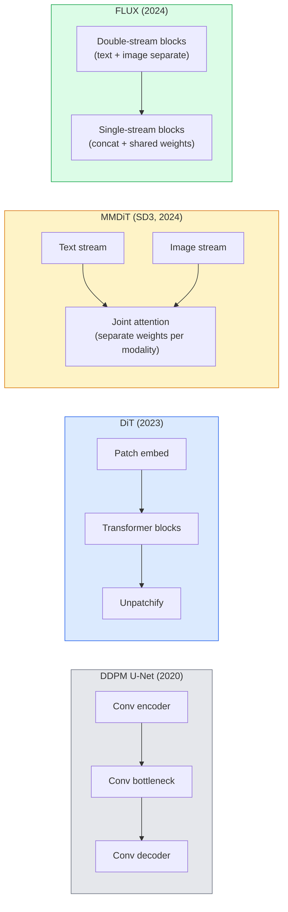

# Diffüzyon Transformatörleri ve Düzeltilmiş Akış

> U-Net'in Diffusion'ın sırrı değil. Transformer'a değiştir, gürültü programını düz yol akışına çevir, birden SD3 ̊FLUX'i ve 2026 yılındaki her metin-resim modeli elde eder.

**类型：**Öğrenim + yapı
**语言：**Python
**前置要求：**4. aşama 10. ders (Difusion DDPM), 4. aşama 14. ders (ViT), 7. aşama 02. ders (Self-Attention)
**时间：**75 dakika kadar .

## Öğrenme hedefi

- U-Net DDPM'den (Desi 10) Diffusion Transformer (DiT) 、MMDiT (SD3), ve tek+iki akımlı DiT (FLUX) gelişimlerine kadar takip
-  Açıklama Düzeltilmiş Akış: Neden gürültü ve veri arasındaki düz yol yolları, modelin 1000 adım yerine 20 adımla tamamlanmasına izin verir
- ¢¢¢¢¢¢¢¢¢¢¢¢¢¢¢¢¢¢¢¢¢¢¢¢¢¢¢¢¢¢¢¢¢¢¢¢¢¢¢¢¢¢¢¢¢¢¢¢¢¢¢¢¢¢¢¢¢¢¢¢¢¢¢¢¢¢¢¢¢¢¢¢¢¢¢¢¢¢¢¢¢¢¢¢¢¢¢¢¢¢¢¢¢¢¢¢¢¢¢¢¢¢¢¢¢¢¢¢¢¢¢¢¢¢¢¢¢¢¢¢¢¢¢¢¢¢¢¢¢¢¢¢¢¢¢¢¢¢¢¢¢¢¢¢¢¢¢¢¢¢¢¢¢¢¢¢¢¢¢¢¢¢¢¢¢¢¢¢¢¢¢¢¢¢¢¢¢¢¢¢¢¢¢¢¢¢¢¢¢¢¢¢¢¢¢¢¢¢¢¢¢¢¢¢¢¢¢¢¢¢¢¢¢¢¢¢¢¢¢¢¢¢¢¢¢¢¢¢¢¢¢¢¢¢¢¢¢¢¢¢¢¢¢¢¢¢¢¢¢¢¢¢¢¢¢¢¢¢¢¢¢¢¢¢¢¢¢¢¢¢¢¢¢¢¢¢¢¢¢¢¢¢¢¢¢¢¢¢¢¢¢¢¢¢¢¢¢¢¢¢¢¢¢¢¢¢¢¢¢¢¢¢¢¢¢¢¢¢¢¢¢¢¢¢¢¢¢¢¢¢¢¢¢¢¢¢¢¢¢¢¢¢¢¢¢¢¢¢¢¢¢¢¢¢¢¢¢¢¢¢¢¢¢¢¢¢¢¢¢¢¢¢¢¢¢¢¢¢¢¢¢¢¢¢¢¢¢¢¢¢¢¢¢¢¢¢¢¢¢¢¢¢¢¢¢¢¢¢¢¢¢¢¢¢¢¢¢¢¢¢¢¢¢¢¢¢¢¢¢¢¢¢¢¢¢¢¢¢¢¢¢¢¢¢¢¢¢¢¢¢¢¢¢¢¢¢¢¢¢¢¢¢¢¢¢¢¢¢¢¢¢¢¢¢¢¢¢¢¢¢¢¢¢¢¢¢¢¢¢¢¢¢¢¢¢¢¢¢¢¢¢¢¢¢¢¢¢¢¢
- Arkitektür 、parametr sayımı 和 lisanslama 区分 model varianları(SD3、FLUX.1-dev、FLUX.1-schnell、Z-Image、Qwen-Image)

## 问题

Ders 10 U-Net denoiser kullanılarak bir DDPM oluşturuldu. Bu yapı 2020-2023 yıllarını yönlendirdi: U-Net + beta programı + gürültü-böylece kaybı.

2026 yılının en gelişmiş metin-resim modellerinin her biri geçti. Stajıf Yayınlama 3、FLUX、SD4、Z-İsmail、Qwen-İsmail、Hunyuan-İsmal U-Net kullanmıyor.

Bu dönüşüm önemli, çünkü tam olarak difüzyon tabanlı görüntü üretimi 变得可控、即时精确 (SD3/SD4 解决文本染) 且足够快投入生产的原因──理解DIT + rectified flow,就是理解2026 yılının jeneratif görüntü yığını──

## 核心概念

### U-Net'ten Transformer'e.



- **DiT**(Peebles & Xie, 2023)  U-Net'i bir ViT'ye benzer bir Transformer ile değiştirin, gizli yamalarda 上运行── Adaptive Layer Norm (AdaLN) la koşullandırma yapılsın──
- **MMDiT**(SD3, Esser et al., 2024) 为文标和图像标 使用两个拥有独立权重的流,并共享一个共同关注──
- **FLUX**(Black Forest Labs, 2024) 前 N 个块 像 SD3 一样采用双流,后续块将代币连锁并共享重量(单流),以提高更深层结构的效率──
- **Z-Image**(2025) 6B parametreleri yüksek verimli tek akımlı DiT, her şeye rağmen genişleme yöntemini zorladı.

### 用一段话解释 Düzeltme akışı

DDPM ileri süreci  gürültülü bir SDE olarak tanımlayacaktır, bunlardan `x_t`Yukarıdaki öğrenme biçiminin tersine, ikinci SDE'dir.

Düzeltilmiş akış  temiz veri ile saf gürültü arasında tanımlandı**直线**插值:

```
x_t = (1 - t) * x_0 + t * epsilon,     t in [0, 1]
```

                                                                                                                                                                                                                                                                                                                                                                                                                                                                                                                             `v_theta(x_t, t) = epsilon - x_0`也就是从清洁数据到噪音的直线路径的前进方向沿的方向`dx_t/dt`)。 örneğin, bu hızda, gürültüden  adım adım veriye doğru ilerlerken, △ △ △ △ △ △ △ △ △ △ △ △ △ △ △ △ △ △ △ △ △ △ △ △ △ △ △ △ △ △ △ △ △ △ △ △ △ △ △ △ △ △ △ △ △ △ △ △ △ △ △ △ △ △ △ △ △ △ △ △ △ △ △ △ △ △ △ △ △ △ △ △ △ △ △ △ △ △ △ △ △ △ △ △ △ △ △ △ △ △ △ △ △ △ △ △ △ △ △ △ △ △ △ △ △ △ △ △ △ △ △ △ △ △ △ △ △ △ △ △ △ △ △ △ △ △ △ △ △ △ △ △ △ △ △ △ △ △ △ △ △ △ △ △ △ △                                                                                                  

SD3 olarak adlandırılır.**Rectified Flow Matching**FLUX、Z-Image 和大多数 2026 yıl model Use the same objective── tipik sonuç:20-30 个 Euler adımları(deterministik), △ eski DDPM 体系indeki 50+ DDIM adımları─Distili / turbo / schnell / LCM çeşitleri 1-4 步e düşebilir

### AdaLN kondisyone edilmesi

DiT              **adaptive layer norm**Zaman aşamasında 和 sınıf / metin 上做kondisyon: fromkondisyon vektörü 中预测 `scale`和 `shift`Bu, U-Nets'te FiLM tarzında modülasyondan daha temiz, her modern DiT'nin standart uygulamasıdır.

```
cond -> MLP -> (scale, shift, gate)
norm(x) * (1 + scale) + shift, then residual add * gate
```

### SD3 ve FLUX içindeki metin kodlayıcıları

- **SD3**Üç metin kodlayıcı kullanın: iki CLIP modeli + T5-XXL。Embeddings Concated 后作为文条调 送入图像流。
- **FLUX**Bir CLIP-L + T5-XXL kullanın.
- **Qwen-Image / Z-Image**Kendiliğinden geliştirilen metin kodlayıcıları için temel LLM'ler kullanmak için farklılıkları vardır.

Metin kodlayıcı SD3/FLUX 之所以比SD1.5 更能理解提示的重要原因──单独T5-XXL 就有4.7B参数──

### Sınıflandırıcısız rehberlik 仍然成立

Düzeltme akışı  değiştirmek, koşullandırma değil örneklemektir. Klasifikasyonsuz rehberlik.  % 10                                                                                                                                                                                                                                                                                                                                                                                                                                                                                               

### Dayanıklılık ¦Turbo ¦Schnell ¦LCM

Çııııııııııııııııııııııııııııııııııııııııııııııııııııııııııııııııııııııııııııııııııııııııııııııııııııııııııııııııııııııııııııııııııııııııııııııııııııııııııııııııııııııııııııııııııııııııııııııııııııııııııııııııııııııııııııııııııııııııııııııııııııııııııııııııııııııııııııııııııııııııııııııııııııııııııııııııııııııııııııııııııııııııııııııııııııııııııııııııııııııııııııııııııııııııııııııııııııııııııııııııııııııııııııııııııııııııııııııııııııııııııııııııııııııııııııııııııııııııııııııııııııııııııııııııııııııııııııı

- **LCM (Latent Consistency Model)**Bir öğrenciyi eğit, onu herhangi bir ortalama yapabil.`x_t`Bir adım önceden tahmin edelim.`x_0`- Evet.
- **SDXL Turbo / FLUX schnell**                                                                                                                                                                                                                                                              
- **SD Turbo**将 OpenAI tarzı tutarlılık modelleri 适配到潜伏传播──

任何新型的生产服务通常都会同时发布一个full quality checkpoint 和一个turbo /快 variant──Schnell(德语中的fast,Black Forest Labs's naming habitue) 在 1-4 步内运行,并适合实时管道──

### 2026 yılının Model manzarası

| Model | Size | Architecture | License |
|-------|------|--------------|---------|
| Stable Diffusion 3 Medium | 2B | MMDiT | SAI Community |
| Stable Diffusion 3.5 Large | 8B | MMDiT | SAI Community |
| FLUX.1-dev | 12B | Double + Single Stream DiT | non-commercial |
| FLUX.1-schnell | 12B | same, distilled | Apache 2.0 |
| FLUX.2 | — | iterated FLUX.1 | mixed |
| Z-Image | 6B | S3-DiT (Scalable Single-Stream) | permissive |
| Qwen-Image | ~20B | DiT + Qwen text tower | Apache 2.0 |
| Hunyuan-Image-3.0 | ~80B | DiT | research |
| SD4 Turbo | 3B | DiT + distillation | SAI Commercial |

FLUX.1-schnell 2026 yılının açık kaynaklı 默认选择──Z-Image is efficiency leader──FLUX.2 和 SD4 is the current quality most reliant model──

### Bu aşama neden çok önemli?

DDPM + U-Net 能工作──DiT + düzeltilmiş akış 工作得**更好、更快，并且扩展得更干净**◊ bu dönüşüm NLP'ye benzer: RNN'lerden transformatörlere dönüşüm: iki çeşit mimarlık   aynı sorunu çözüyor, ancak transformatörler daha da genişleyebilir ve şimdi baskın bir konumdadır。 2026 yılında resim, video veya 3D jenerasyon hakkında her bir makale, DiT şeklinde bir denosör kullanıyor ve genellikle düzeltilmiş akış hedefini kullanıyor。 U-Net DDPM şimdi öğretim için kullanılıyor.


```figure
cv3-rectified-flow
```

## Yapın onu.

### 步骤 1:带 AdaLN'in DiT bloğu

```python
import torch
import torch.nn as nn


class AdaLNZero(nn.Module):
    """
    Adaptive LayerNorm with a gate. Predicts (scale, shift, gate) from the conditioning.
    Init such that the whole block starts as identity ("zero init").
    """

    def __init__(self, dim, cond_dim):
        super().__init__()
        self.norm = nn.LayerNorm(dim, elementwise_affine=False)
        self.mlp = nn.Linear(cond_dim, dim * 3)
        nn.init.zeros_(self.mlp.weight)
        nn.init.zeros_(self.mlp.bias)

    def forward(self, x, cond):
        scale, shift, gate = self.mlp(cond).chunk(3, dim=-1)
        h = self.norm(x) * (1 + scale.unsqueeze(1)) + shift.unsqueeze(1)
        return h, gate.unsqueeze(1)


class DiTBlock(nn.Module):
    def __init__(self, dim=192, heads=3, mlp_ratio=4, cond_dim=192):
        super().__init__()
        self.adaln1 = AdaLNZero(dim, cond_dim)
        self.attn = nn.MultiheadAttention(dim, heads, batch_first=True)
        self.adaln2 = AdaLNZero(dim, cond_dim)
        self.mlp = nn.Sequential(
            nn.Linear(dim, dim * mlp_ratio),
            nn.GELU(),
            nn.Linear(dim * mlp_ratio, dim),
        )

    def forward(self, x, cond):
        h, gate1 = self.adaln1(x, cond)
        a, _ = self.attn(h, h, h, need_weights=False)
        x = x + gate1 * a
        h, gate2 = self.adaln2(x, cond)
        x = x + gate2 * self.mlp(h)
        return x
```

`AdaLNZero`Bir başlangıç bir kimlik haritalamasıdır, çünkü MLP ağırlıkları sıfır olarak başlangıç yapılmıştır.

### 2 adım: Küçük bir diT

```python
def timestep_embedding(t, dim):
    import math
    half = dim // 2
    freqs = torch.exp(-math.log(10000) * torch.arange(half, device=t.device) / half)
    args = t[:, None].float() * freqs[None]
    return torch.cat([args.sin(), args.cos()], dim=-1)


class TinyDiT(nn.Module):
    def __init__(self, image_size=16, patch_size=2, in_channels=3, dim=96, depth=4, heads=3):
        super().__init__()
        self.patch_size = patch_size
        self.num_patches = (image_size // patch_size) ** 2
        self.patch = nn.Conv2d(in_channels, dim, kernel_size=patch_size, stride=patch_size)
        self.pos = nn.Parameter(torch.zeros(1, self.num_patches, dim))
        self.time_mlp = nn.Sequential(
            nn.Linear(dim, dim * 2),
            nn.SiLU(),
            nn.Linear(dim * 2, dim),
        )
        self.blocks = nn.ModuleList([DiTBlock(dim, heads, cond_dim=dim) for _ in range(depth)])
        self.norm_out = nn.LayerNorm(dim, elementwise_affine=False)
        self.head = nn.Linear(dim, patch_size * patch_size * in_channels)

    def forward(self, x, t):
        n = x.size(0)
        x = self.patch(x)
        x = x.flatten(2).transpose(1, 2) + self.pos
        t_emb = self.time_mlp(timestep_embedding(t, self.pos.size(-1)))
        for blk in self.blocks:
            x = blk(x, t_emb)
        x = self.norm_out(x)
        x = self.head(x)
        return self._unpatchify(x, n)

    def _unpatchify(self, x, n):
        p = self.patch_size
        h = w = int(self.num_patches ** 0.5)
        x = x.view(n, h, w, p, p, -1).permute(0, 5, 1, 3, 2, 4).reshape(n, -1, h * p, w * p)
        return x
```

### 步骤 3: Düzeltme akış eğitimi

```python
import torch.nn.functional as F

def rectified_flow_train_step(model, x0, optimizer, device):
    model.train()
    x0 = x0.to(device)
    n = x0.size(0)
    t = torch.rand(n, device=device)
    epsilon = torch.randn_like(x0)
    x_t = (1 - t[:, None, None, None]) * x0 + t[:, None, None, None] * epsilon

    target_velocity = epsilon - x0
    pred_velocity = model(x_t, t)

    loss = F.mse_loss(pred_velocity, target_velocity)
    optimizer.zero_grad()
    loss.backward()
    optimizer.step()
    return loss.item()
```

DDPM'nin gürültü tahmin kaybı ile karşılaştırıldığında: ⇒ ⇒ ⇒ ⇒ ⇒ ⇒ ⇒ ⇒ ⇒ ⇒ ⇒ ⇒ ⇒ ⇒ ⇒ ⇒ ⇒ ⇒ ⇒ ⇒ ⇒ ⇒ ⇒ ⇒ ⇒ ⇒ ⇒ ⇒ ⇒ ⇒ ⇒ ⇒ ⇒ ⇒ ⇒ ⇒ ⇒ ⇒ ⇒ ⇒ ⇒ ⇒ ⇒ ⇒ ⇒ ⇒ ⇒ ⇒ ⇒ ⇒ ⇒ ⇒ ⇒ ⇒ ⇒ ⇒ ⇒ ⇒ ⇒ ⇒ ⇒ ⇒ ⇒ ⇒ ⇒ ⇒ ⇒ ⇒ ⇒ ⇒ ⇒ ⇒ ⇒ ⇒ ⇒ ⇒ ⇒ ⇒ ⇒ ⇒ ⇒ ⇒ ⇒ ⇒ ⇒ ⇒ ⇒ ⇒ ⇒ ⇒ ⇒ ⇒ ⇒ ⇒ ⇒ ⇒ ⇒ ⇒ ⇒ ⇒ ⇒ ⇒ ⇒ ⇒ ⇒ ⇒ ⇒ ⇒ ⇒ ⇒ ⇒ ⇒ ⇒ ⇒ ⇒ ⇒ ⇒ ⇒ ⇒ ⇒ ⇒ ⇒ ⇒ ⇒ ⇒ ⇒ ⇒ ⇒ ⇒ ⇒ ⇒ ⇒ ⇒ ⇒ ⇒ ⇒ ⇒ ⇒ ⇒ ⇒ ⇒ ⇒ ⇒ ⇒ ⇒ ⇒    ⇒ ⇒ ⇒  ⇒ ⇒ ⇒   ⇒ ⇒            ⇒ ⇒                                                                                                                                                                    `epsilon`Ama önceden.**velocity** `epsilon - x_0`, veri ile gürültü yönünde doğru doğru gider.

### 步骤 4: Euler örneği

Düzeltilmiş akış bir ODE'dir. Euler'ın yöntemi en basit yöntemdir ve iyi bir eğitimli düzeltilmiş akış modeli için, 20+ adımlarda 时几乎与高级解决器一样准确──

```python
@torch.no_grad()
def rectified_flow_sample(model, shape, steps=20, device="cpu"):
    model.eval()
    x = torch.randn(shape, device=device)
    dt = 1.0 / steps
    t = torch.ones(shape[0], device=device)
    for _ in range(steps):
        v = model(x, t)
        x = x - dt * v
        t = t - dt
    return x
```

20 adımlı. İyi bir eğitim modelinde, bu 1000 adımlı DDPM karşılaştırma ile örnekler üretilebilir.

### Adım 5: Sonluk duman testi

```python
import numpy as np

def synthetic_blobs(num=200, size=16, seed=0):
    rng = np.random.default_rng(seed)
    out = np.zeros((num, 3, size, size), dtype=np.float32)
    yy, xx = np.meshgrid(np.arange(size), np.arange(size), indexing="ij")
    for i in range(num):
        cx, cy = rng.uniform(4, size - 4, size=2)
        r = rng.uniform(2, 4)
        mask = (xx - cx) ** 2 + (yy - cy) ** 2 < r ** 2
        colour = rng.uniform(-1, 1, size=3)
        for c in range(3):
            out[i, c][mask] = colour[c]
    return torch.from_numpy(out)
```

Bu veri kümesi üzerinde düzeltilmiş akışla bir antrenman .`TinyDiT`❖ 500 adım sonra, örnekleme sonuçları 淡淡的彩色斑点 போல görünmeli ❖

## Kullan

对于使用FLUX / SD3 / Z-Image 的真实图像生成,`diffusers`Her model için 提供统一 API:

```python
from diffusers import FluxPipeline, StableDiffusion3Pipeline
import torch

pipe = FluxPipeline.from_pretrained(
    "black-forest-labs/FLUX.1-schnell",
    torch_dtype=torch.bfloat16,
).to("cuda")

out = pipe(
    prompt="a golden retriever surfing a tsunami, hyperrealistic, studio lighting",
    guidance_scale=0.0,           # schnell was trained without CFG
    num_inference_steps=4,
    max_sequence_length=256,
).images[0]
out.save("surf.png")
```

Üç yol.`FLUX.1-schnell`Dört adım tamamlanmak.`black-forest-labs/FLUX.1-dev`Bu, CFG'yi taşımak için 20-30 adım atmakla daha yüksek kalite elde etmek anlamına gelir.

 SD3 için:

```python
pipe = StableDiffusion3Pipeline.from_pretrained(
    "stabilityai/stable-diffusion-3.5-large",
    torch_dtype=torch.bfloat16,
).to("cuda")
out = pipe(prompt, guidance_scale=3.5, num_inference_steps=28).images[0]
```

## - Söyle.

Bu ders:

- `outputs/prompt-dit-model-picker.md`在给定质量、延迟和许可 约束时,在 SD3、FLUX.1-dev、FLUX.1-schnell、Z-Image、SD4 Turbo 之间做选择──
- `outputs/skill-rectified-flow-trainer.md` AdaLN DiT ve Euler örneklemesini içeren tam bir düzeltilmiş akış eğitim döngüsü yazmak

## 练习

1. **（简单）**Sintez blob verisi üzerinde çalışmak için yukarıdaki TinyDiT 500 adımları kullanın.
2. **（中等）**通過把一個學習的类嵌入 拼接到時間嵌上,加入文本調節 (,) 按颜色划分的10个斑点 类) 〔分别用类0、5 和 9 采样,并验证颜色匹配〕
3. **（困难）**計算在同样大小的网络、同样数据、同样训练步数下,修正-flow与DDPM 版本生成样本 之间的 Fréchet distance (FID proxy) ⋅ rapor哪一个收更快──

## 关键术语

| Term | 人们常说 | 实际含义 |
|------|----------------|----------------------|
| DiT | “Diffusion transformer” | 替代 U-Net 作为 diffusion denoiser 的 Transformer；在 patchified latents 上运行 |
| AdaLN | “Adaptive layer norm” | 通过学习到的 scale、shift、gate 进行 timestep/text conditioning，并在 LayerNorm 之后应用；每个现代 DiT 的标准做法 |
| MMDiT | “Multi-modal DiT (SD3)” | 为 text tokens 和 image tokens 使用独立 weight streams，并共享一个 joint self-attention |
| Single-stream / double-stream | “FLUX trick” | 前 N 个 blocks 为 double-stream（每种 modality 使用独立 weights），后续 blocks 为 single-stream（concat + shared weights），以提升效率 |
| Rectified flow | “Straight-line noise-to-data” | data 与 noise 之间的线性插值；网络预测 velocity；inference 所需 ODE steps 更少 |
| Velocity target | “epsilon - x_0” | rectified flow 中的 Regression target；从 clean data 指向 noise |
| CFG guidance | “classifier-free guidance” | 混合 conditional 与 unconditional predictions；rectified-flow models 中仍然使用 |
| Schnell / turbo / LCM | “1-4 step distillation” | 从 full-quality models distill 得到的小步数 variants；用于生产实时场景 |

## 延伸阅读

- [Scalable Diffusion Models with Transformers (Peebles & Xie, 2023)](https://arxiv.org/abs/2212.09748)DiT 论文
- [Scaling Rectified Flow Transformers (Esser et al., SD3 paper)](https://arxiv.org/abs/2403.03206) Büyük MMDiT ve düzeltilmiş akış
- [FLUX.1 model card and technical report (Black Forest Labs)](https://huggingface.co/black-forest-labs/FLUX.1-dev)iki katlı + tek akımlı 细节
- [Z-Image: Efficient Image Generation Foundation Model (2025)](https://arxiv.org/html/2511.22699v1)6B tek akımlı DiT
- [Elucidating the Design Space of Diffusion (Karras et al., 2022)](https://arxiv.org/abs/2206.00364) Her bir yayılma  tasarım pazarlama referansı
- [Latent Consistency Models (Luo et al., 2023)](https://arxiv.org/abs/2310.04378)LCM-LoRA  nasıl 4 adımlı sonuçlar elde edilebilir
