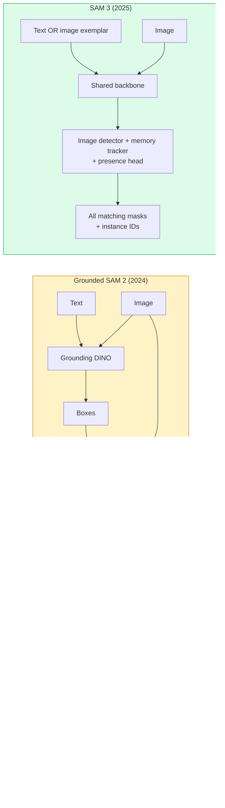

# SAM 3 ve Açık Sözlü Bölümleme

> 模型にテキストプロンプトと一张画像を与え, hemen her eşleşen nesnenin maskelerini elde edebilirsiniz.

**类型：**kullan + 构建
**语言：**Python
**先修要求：**4. aşama 07 ders (U-Net), 4. aşama 08 ders (Maske R-CNN), 4. aşama 18 ders (CLIP)
**时间：**~ 60 dakika

## Öğrenme hedefi

- 区分 SAM(sadece görsel istekler)、Grounded SAM / SAM 2(detektor + SAM) ve SAM 3(Promptable Concept Segmentation yoluyla 原生支持文提示)
- 解释 SAM 3 架构:shared backbone + image detector + memory-based video tracker + presence head + decoupled detector-tracker design
- Üstünü kucaklayan bir yüz kullan `transformers`SAM 3 集成 metin uyarı tespit, segmentasyon ve video izleme gerçekleştirmek
- DATA DATA DATA DATA DATA DATA DATA DATA DATA DATA DATA DATA DATA DATA DATA DATA DATA DATA DATA DATA DATA DATA DATA DATA DATA DATA DATA DATA DATA DATA DATA DATA DATA DATA DATA DATA DATA DATA DATA DATA DATA DATA DATA DATA DATA DATA DATA DATA DATA DATA DATA DATA DATA DATA DATA DATA DATA DATA DATA DATA DATA DATA DATA DATA DATA DATA DATA DATA DATA DATA DATA DATA DATA DATA DATA DATA DATA DATA DATA DATA DATA DATA DATA DATA DATA DATA DATA DATA DATA DATA DATA DATA DATA DATA DATA DATA DATA DATA DATA DATA DATA DATA DATA DATA DATA DATA DATA DATA DATA DATA DATA DATA DATA DATA DATA DATA DATA DATA DATA DATA DATA DATA DATA DATA DATA DATA DATA DATA DATA DATA DATA DATA DATA DATA DATA DATA DATA DATA DATA DATA DATA DATA DATA DATA DATA    DATA  DATA  DATA DATA DATA DATA DATA     DATA   DATA   DATA  DATA            DATA      DATA                                                                                                                                                                    

## 问题

2023 SAM sadece görsel istek destekleyen bir modeldir: bir noktaya tıklayın veya bir çerçeve çizin, bir maskeye döner. Bu fotoğrafta bulunan tüm leri bulmak için bir detektörün olması gerekir.

SAM 3(Meta,2025年 11月,ICLR 2026) bu sınıfı sıkıştırdı.**Promptable Concept Segmentation (PCS)**◊结合 2026 年 3 月的 Object Multiplex 更新(SAM 3.1), aynı kavramın birçok örneğini videoda yüksek verimlilikle takip edebilir。

Bu ders, 2D bölünme, tespit ve metin görüntülerinin yerleştirilmesi ile temsil edilen yapısal değişim üzerine odaklanmıştır.

## 概念

### Üç代模型



### 可 Anında Konsept Bölümselliği

concept prompt 是一个简短的名词短语(`"yellow school bus"`- Evet.`"striped red umbrella"`- Evet.`"hand holding a mug"`) veya bir resim örneği── model, resim içindeki her uyumlu kavramın örneğini  segmentasyon maskelerine geri döndürür ve her uyumlu proje için tek örneğin ID'sini geri döndürür.

Bu klasik görsel-sürekli SAM'den üç farklı noktaya sahip:

1. Not needed individual instance  provide prompt: bir metin istek  return all matches。
2. Açık sözlük: kavramı, doğal dilde açıklayabilen herhangi bir şey olabilir.
3. Birden bir maskeyi geri göndermek yerine birden fazla defa geri dönmek.

### 关键架构组件

- **Shared backbone**Bir ViT 处理 image──detektor başı 和 hafıza tabanlı izleyici 都從中读取信息──
- **Presence head**Önceden: Önceden Anlamak: Önceden Anlamak: Önceden Anlamak: Önceden Anlamak: Önceden Anlamak: Önceden Anlamak: Önceden Anlamak: Önceden Anlamak: Önceden Anlamak: Önceden Anlamak: Önceden Anlamak: Önceden Anlamak: Önceden Anlamak: Önceden Anlamak: Önceden Anlamak: Önceden Anlamak: Önceden Anlamak: Önceden Anlamak: Önceden Anlamak: Önceden Anlamak: Önceden Anlamak: Önceden Anlamak: Önceden Anlamak: Önceden Anlamak: Önceden Anlamak: Önceden Anlamak: Önceden Anlamak: Önceden Anlamak: Önceden Anlamak: Önceden Anlamak: Önceden Anlamak: Önceden Anlamak: Önceden Anlamak: Önceden Anlamak: Önceden Anlamak: Önceden Anlamak: Önceden Anlamak: Önceden Anlamak: Önceden Anlamak: Önceden Anlamak: Önceden Anlamak: Önceden Anlamak: Önceden Anlamak: Önceden Anlamak: Önceden Anlamak: Önceden Anlamak: Önceden Anlamak: Önceden Anlamak: Önceden Anlamak: Önceden Anlamak: Önceden Anlamak: Önceden Anlamak: Önceden Anlamak: Önceden Anlamak: Önceden Anlamak: Önceden An An An An An An An An An An An An An An An An An An An An An An An An An An An An An An An An An An An An An An An An An An An An An An An An An An An An An An An An An An An An An An An An An An An An An An An An An An An An An An An An An An An An An An An An An An An An An An An An An An An An An An An An An An An An An An An An An An An An An An An An An An An An An An An An An An An An An An An An An An An An An An An An An An An An An An An An An An An An An An An An An An An An An An An An An An An An An
- **Decoupled detector-tracker**Fotoğraf seviyesinde tespit ve video seviyesinde izleme İstifadesi bağımsız başlar, birbirlerini rahatsız etmemek için
- **Memory bank**:跨框架 存储每个实例的功能,用于视频跟踪(与SAM 2 使用的机制相同) ⋅

### Büyük çaplı eğitim

SAM 3 **400 万个 unique concepts**Ünce eğitim, bu kavramlar bir veri motoru tarafından üretildi, bu motor AI + 人工审核 代标注并修正──新**SA-CO benchmark**包含270K 个独特概念,以前的基准比大50倍──SAM 3 SA-CO 上达到人类表现的75-80%,以及图像 +视频 PCS 上把现有系统表现升升至两倍──

### SAM 3.1 Nesne Çoklu

2026 yıl 3 月更新:**Object Multiplex** ortak hafıza mekanizması, aynı kavramı bir arada takip etmek için kullanılan birden fazla durumun kullanılmasını öncesine kadar N 个例的跟踪, N 个独立的内存银行的需要的意义――Multiplex, bunu ortak bir hafıza olarak sıkıştırarak, durum başına sorgular kullanır―― sonuç, doğruluğu feda etmeyi önlemleyerek, çok nesneyi takip etmeyi önemli ölçüde hızlandırır──

### 2026 yılında yerleşik SAM  hala önemli bir sahne

- Özel bir açık sözcükleme dedektörü değiştirmek zorunda kalınca...
- SAM 3 lisansı... ..hastaye oldu.
- SAM 3'ün altındaki parametreye göre daha fazla kontrol kontrol etmeniz gerekiyorsa...
- Detektor bileşeninin araştırılması / ablasyon çalışması için kullanılmıştır.

Modüler boru hattları  hala değerlidir. Çoğu üretim işinde, SAM 3 daha basit bir yanıtdır.

### YOLO-World vs SAM 3

- **YOLO-World**Sadece açık sözcükleme dedektörü(maskası yok)。 Gerçek zamanlı。当你需要高fps বাক্স 时最合适。
- **SAM 3**: tam segmentasyon + izleme。 daha yavaş, ama输出更丰富。

生产场景划分:YOLO-World 适合快速检测-only pipelines(robotik navigasyon、hızlı araz aygıtı),SAM 3 适合任何需要面具或跟踪的场景──

### SAM-MI 效率

SAM-MI(2025-2026) SAM'in dekodör boğazını çözmek için

- **Sparse point prompting**:                                                                                                                                                                                                                                                               
- **Shallow mask aggregation**Bu yüzden, daha net bir maskeye dönüştü.
- **Decoupled mask injection**:decoder 接收预计算的面具功能,而不是重新运行──

Sonuç: Açık sözcük referanslarında                                                                                                                                                                                                                                                          

### Üç model'in çıkış biçimi

Bu çok yardımcı olur: Your downstream pipeline does not need to be based on which model to branch.


```figure
cv3-open-vocab
```

## Yapım

### 步骤1:Hızlı yapı

构建一个辅助员,将用户句转换为 SAM 3 concept prompts 列表──这是用户输入的内容和模型消费的内容之间的边界──

```python
def split_concepts(sentence):
    """
    Heuristic splitter for multi-concept prompts.
    Returns list of short noun phrases.
    """
    for sep in [",", ";", "and", "or", "&"]:
        if sep in sentence:
            parts = [p.strip() for p in sentence.replace("and ", ",").split(",")]
            return [p for p in parts if p]
    return [sentence.strip()]

print(split_concepts("cats, dogs and balloons"))
```

SAM 3 Her ileri geçiş  bir kavramı kabul; çok kavramlı sorular için, döngü veya toplu olarak bunları işleme 

### 步骤 2: Post-processing yardımcıları

SAM 3'ün ham ürünlerini temiz tespitlere dönüştürmek için 4. aşamada 16. ders için boru hattı sözleşmesine uygun olarak listelerimiz var.

```python
from dataclasses import dataclass
from typing import List

@dataclass
class ConceptDetection:
    concept: str
    instance_id: int
    box: tuple          # (x1, y1, x2, y2)
    score: float
    mask_rle: str       # run-length encoded


def rle_encode(binary_mask):
    flat = binary_mask.flatten().astype("uint8")
    runs = []
    prev, count = flat[0], 0
    for v in flat:
        if v == prev:
            count += 1
        else:
            runs.append((int(prev), count))
            prev, count = v, 1
    runs.append((int(prev), count))
    return ";".join(f"{v}x{c}" for v, c in runs)
```

RLE'nin yüksek çözünürlüklü maskeleri bile, yanıt yüklerini de sağlayabilmektedir.

### 步骤 3:统一的 açık kelime bölünme arayüzü

Eğer sahip olduğunuz herhangi bir arka uç olacak ((SAM 3 √ Grounded SAM 2 √ YOLO-World + SAM 2)封装在一个统一方法后──当后端 改变时,下游代码不需要改变──

```python
from abc import ABC, abstractmethod
import numpy as np

class OpenVocabSeg(ABC):
    @abstractmethod
    def detect(self, image: np.ndarray, concept: str) -> List[ConceptDetection]:
        ...


class StubOpenVocabSeg(OpenVocabSeg):
    """
    Deterministic stub used for pipeline testing when real models are not loaded.
    """
    def detect(self, image, concept):
        h, w = image.shape[:2]
        return [
            ConceptDetection(
                concept=concept,
                instance_id=0,
                box=(w * 0.2, h * 0.3, w * 0.5, h * 0.8),
                score=0.89,
                mask_rle="0x100;1x50;0x200",
            ),
            ConceptDetection(
                concept=concept,
                instance_id=1,
                box=(w * 0.55, h * 0.25, w * 0.85, h * 0.75),
                score=0.74,
                mask_rle="0x80;1x40;0x220",
            ),
        ]
```

Gerçek .`SAM3OpenVocabSeg`alt sınıf 会封装 `transformers.Sam3Model`和 `Sam3Processor`- Evet.

### 步骤 4: Yüzü sarma SAM 3 用法(reference)

实际模型的 `transformers`集成:

```python
from transformers import Sam3Processor, Sam3Model
import torch

processor = Sam3Processor.from_pretrained("facebook/sam3")
model = Sam3Model.from_pretrained("facebook/sam3").eval()

inputs = processor(images=pil_image, return_tensors="pt")
inputs = processor.set_text_prompt(inputs, "yellow school bus")

with torch.no_grad():
    outputs = model(**inputs)

masks = processor.post_process_masks(
    outputs.masks, inputs.original_sizes, inputs.reshaped_input_sizes
)
boxes = outputs.boxes
scores = outputs.scores
```

Bir an önce, bir kez tekrar tüm eşleşmeleri tekrar kullanın.

### Adım 5: Temel SAM 2'yi ölçmek

Gerçek bir referans: Gerçek bir boru hattında SAM 3 yerine yerleşik SAM 2 ne olacak?

- Gecikme:SAM 3 省掉一次前传 (dependent detector) yoktur, ancak modelin kendisi daha ağırdır; genellikle总体持平或略有速度up──
- Düzgünlük:SAM 3 rare veya kompozisyon kavramlarında`"striped red umbrella"`)                                                                                                                                                                                                                                                               
- Esneklik:Dünya SAM 2                                                                                                                                                                                                                                                                                                                                                                                                                                                                                                                     

结论:SAM 3  2026 yıl açık kelime bölümü                                                                                                                                                                                                                                                       

## kullanımı

生产部署模式:

- **Real-time annotation**:SAM 3 + CVAT'ın etiket-teski-sürekli özelliği。标注员选择一个标签名称;SAM 3 预标注每个匹配的实例──再进行审核和修饰──
- **Video analytics**:SAM 3.1 Object Multiplex, çok nesneyi izlemek için kullanılır; 将 frame 输入 memory-based tracker。
- **Robotics**:SAM 3 Açık kelime manipülasyonu için kullanılır;
- **Medical imaging**Bu nedenle, bu konularda, HF'de başvuruda bulunmak gerekir.

Ultralytics Python paketinde SAM 3'ü kapsıyor:

```python
from ultralytics import SAM

model = SAM("sam3.pt")
results = model(image_path, prompts="yellow school bus")
```

YOLO ve SAM 2 ile aynı arayüz kullanın.

## 交付

Bu ders:

- `outputs/prompt-open-vocab-stack-picker.md`: bir latensiye göre 概念 karmaşıklığı 和 lisanslama  SAM 3 / Yerleşik SAM 2 / YOLO-World / SAM-MI   提示を選択します。
- `outputs/skill-concept-prompt-designer.md`:一个将用户话语转换为格式良好的 SAM 3 konsept istekleri

## 练习

1. **（Easy）**10 张 görüntülerde SAM 3'ü kullanın, kendiniz seçtiğiniz konsept isteklerini kullanın.
2. **（Medium）**Bu nedenle, kullanıcılar, kullanıcıların kendi kendi kendi kendi kendi kendi kendi kendi kendi kendi kendi kendi kendi kendi kendi kendi kendi kendi kendi kendi kendi kendi kendi kendi kendi kendi kendi kendi kendi kendi kendi kendi kendi kendi kendi kendi kendi kendi kendi kendi kendi kendi kendi kendi kendi kendi kendi kendi kendi kendi kendi kendi kendi kendi kendi kendi kendi kendi kendi kendi kendi kendi kendi kendi kendi kendi kendi kendi kendi kendi kendi kendi kendi kendi kendi kendi kendi kendi kendi kendi kendi kendi kendi kendi kendi kendi kendi kendi kendi kendi kendi kendi kendi kendi kendi kendi kendi kendi kendi kendi kendi kendi kendi kendi kendi kendi kendi kendi kendi kendi kendi kendi kendi kendi kendi kendi kendi kendi kendi kendi kendi kendi kendi kendi kendi kendi kendi kendi kendi kendi kendi kendi kendi kendi kendi kendi kendi kendi kendi kendi kendi kendi kendi kendi kendi kendi kendi kendi kendi kendi kendi kendi kendi kendi kendi kendi kendi kendi kendi kendi kendi kendi kendi kendi kendi kendi kendi kendi kendi kendi kendi kendi kendi kendi kendi kendi kendi kendi kendi kendi kendi kendi kendi kendi kendi kendi kendi kendi kendi kendi kendi kendi kendi kendi kendi kendi kendi kendi kendi kendi kendi kendi kendi kendi kendi kendi kendi kendi kendi kendi kendi kendi kendi kendi kendi kendi kendi kendi kendi kendi kendi kendi kendi kendi kendi kendi kendi kendi kendi kendi kendi kendi kendi kendi kendi kendi kendi kendi kendi kendi kendi kendi kendi kendi kendi kendi kendi kendi kendi kendi kendi kendi kendi kendi kendi kendi kendi kendi kendi kendi kendi kendi kendi kendi kendi kendi kendi kendi kendi kendi kendi kendi kendi kendi kendi kendi kendi kendi kendi kendi kendi kendi kendi kendi kendi kendi kendi kendi kendi kendi kendi kendi kendi kendi kendi kendi kendi kendi kendi kendi kendi kendi kendi kendi kendi kendi kendi kendi kendi kendi kendi kendi kendi kendi kendi kendi kendi kendi kendi kendi kendi kendi kendi kendi kendi kendi kendi kendi kendi kendi kendi kendi kendi kendi kendi kendi kendi kendi kendi kendi kendi kendi kendi kendi kendi kendi kendi kendi kendi kendi kendi kendi kendi kendi kendi kendi kendi kendi kendi kendi kendi kendi kendi kendi kendi kendi kendi kendi kendi kendi kendi kendi kendi kendi kendi kendi kendi kendi kendi kendi kendi kendi kendi kendi kendi kendi kendi kendi kendi kendi kendi kendi kendi kendi kendi kendi kendi kendi kendi kendi kendi kendi kendi kendi kendi kendi kendi kendi kendi kendi kendi kendi kendi kendi kendi kendi kendi kendi kendi kendi kendi kendi kendi kendi kendi kendi kendi kendi kendi kendi kendi kendi kendi kendi kendi kendi kendi kendi kendi kendi kendi kendi kendi kendi kendi kendi kendi kendi kendi kendi kendi kendi kendi kendi kendi kendi kendi kendi kendi kendi kendi kendi kendi kendi kendi kendi kendi kendi kendi kendi kendi kendi kendi kendi kendi kendi kendi kendi kendi kendi kendi kendi kendi kendi kendi kendi kendi kendi kendi kendi kendi kendi kendi kendi kendi kendi kendi kendi kendi kendi kendi kendi
3. **（Hard）**Kendini tanımlayan konsept seti (örneğin 5 elektronik bileşen) üzerinde ince ayarlanmış SAM 3, her türde 20 张 etiketlenmiş görüntüler, yukarıdaki sıfır çekim SAM 3 karşılaştırması ile aynı test seti ile; maskenin IoU gelişimini ölçmek,

## 关键术语

| Term | 人们通常怎么说 | 实际含义 |
|------|----------------|----------------------|
| Open-vocabulary segmentation | “Segment by text” | 为自然语言描述的 objects 生成 masks，而不是使用固定 label set |
| PCS | “Promptable Concept Segmentation” | SAM 3 的核心任务：给定一个 noun-phrase 或 image exemplar，segment 所有匹配 instances |
| Concept prompt | “The text input” | 简短名词短语或 image exemplar；不是完整句子 |
| Presence head | “Is it here?” | SAM 3 中的模块，用于在 localisation 之前判断 concept 是否存在于 image 中 |
| SA-CO | “SAM 3 benchmark” | 包含 270K concepts 的 open-vocabulary segmentation benchmark；比以往 open-vocab benchmarks 大 50 倍 |
| Object Multiplex | “SAM 3.1 update” | Shared-memory multi-object tracking；快速联合跟踪多个 instances |
| Grounded SAM 2 | “Modular pipeline” | Detector + SAM 2 级联；当 detector 替换很重要时仍然相关 |
| SAM-MI | “Efficient SAM variant” | Mask Injection，相比 Grounded-SAM 实现 1.6x speedup |

## 延伸阅读

- [SAM 3: Segment Anything with Concepts (arXiv 2511.16719)](https://arxiv.org/abs/2511.16719)
- [SAM 3.1 Object Multiplex (Meta AI, March 2026)](https://ai.meta.com/blog/segment-anything-model-3/)
- [SAM 3 model page on Hugging Face](https://huggingface.co/facebook/sam3)
- [Grounded SAM 2 tutorial (PyImageSearch)](https://pyimagesearch.com/2026/01/19/grounded-sam-2-from-open-set-detection-to-segmentation-and-tracking/)
- [Ultralytics SAM 3 docs](https://docs.ultralytics.com/models/sam-3/)
- [SAM3-I: Instruction-aware SAM (arXiv 2512.04585)](https://arxiv.org/abs/2512.04585)
