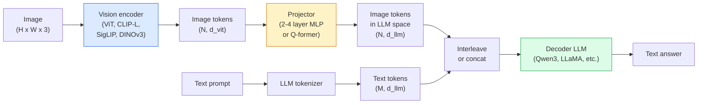

# Görme Dil Modelleri  ViT-MLP-LLM 模式

> Görüş kodlayıcı, resimleri simgeler olarak dönüştürür. MLP projekörü, bu simgelerle LLM'nin yerleşim alanına yerleşecek. Dil modeli, işimizin geri kalanını tamamlayacak.

**类型：**学习 + 使用
**语言：**Python
**前置要求：**4. Fase Ders 14 (ViT), 4. Fase Ders 18 (CLIP), 7. Fase Ders 02 (Öz dikkat)
**时间：**~ 75 dakika

## Öğrenme hedefi

- Açıklayın ViT-MLP-LLM 架构,并解释三个组件各自贡献什么
- Konekst uzunluğu ve referans performansından  açı karşılaştırın Qwen3-VL、InternVL3.5、LLaVA-Next 和 GLM-4.6V
- DeepStack: Neden bir tek son katman özelliklerinden daha fazla ViT özellikleri daha yakından görme dili ayarlama
- Üretim ortamında kullanılmış çapraz modal hata oranı (CMER) VLM halüsinasyon ölçmek, ve bu sinyal üzerine hareket etmek

## 问题

CLIP (Dava 4 Ders 18) resim ve metin için paylaşımlı yerleştirme alanı sağlar, bu sıfır çekim sınıflandırmasını ve kurtarmayı destekleyecek kadarıyla yeterli. Bu tabloda kaç kırmızı araç var?

Görüş Dil Modelleri (VLM)  Qwen3-VL、InternVL3.5、LLaVA-Next、GLM-4.6V  CLIP-aile görüntü kodlayıcıyı 接到一个完整语言模型上──模型看一张图像加一个问题,然后生成答案──到2026年,open source VLMs 在多模标标 (MMMU, MMBench, DocVQA, ChartQA, MathVista, OSWorld) 上已经可以比肩甚至超过GPT-5 和 Gemini-2.5-Pro──

Bu grup üç parça birleştirir. Bu modelin standart yapısıdır. Bu modeller arasındaki fark hangi ViT'yi kullanmakla ilgili.

## 概念

### ViT-MLP-LLM 架构



1. **Vision encoder** 预训练 ViT(CLIP-L/14、SigLIP、DINOv3, veya ince ayarlanmış bir varyant) ・产出补丁符号──
2. **Projector** 一个小模块(2-4 层 MLP, veya Q-former), görme işaretlerini LLM'nin yerleştirme boyutuna映射します。 çoğu ince ayarlama burada gerçekleşir。
3. **LLM** sadece dekodörlü dil modeli(Qwen3、Llama、Mistral、GLM、InternLM) ・・・按序读取视觉 + 文标,并生成文本。

İlk olarak üç bölümü eğitimlidir. Praktiki olarak, vizyon kodlayıcı ve LLM, çoğu donmuş, sadece projector eğitimi, böylece düşük maliyetle milyarlarca parametre büyüklüğünde sinyal taşıyabilir.

### DeepStack

Normal projeksiyon sadece son katman ViT katmanı kullanmaktadır.DeepStack(Qwen3-VL) birden fazla ViT derinlik tasarıma özelliklerden oluşur ve onları yığar. Daha derin katman taşıyor yüksek katmanlı ifade; daha aşın katman taşıyor küçük parçacıklık alan ve yapısal bilgi.

### Üç eğitim aşaması

现代 VLMs 分阶段训练:

1. **Alignment** dondurma ViT 和 LLM── sadece görüntü-başlık çiftlerinde 上訓練投影機──教会投影機 将视野空間 映射到语言空間──
2. **Pre-training** 解所有部分──大规模交错图像文数据(500M+ çift) 上训练──构建模型的视觉知识──
3. **Instruction tuning** 在精选的(图像,问题,答) 三元组上细调──教会对话行为 和任务格式──

Büyük çoğunlukla LoRA ince ayarları 3. aşama için küçük ölçekli etiketleme verileri ile yürütülür.

### 模型家族比较(2026 yıl başlarında)

| Model | Params | Vision encoder | LLM | Context | Strengths |
|-------|--------|----------------|-----|---------|-----------|
| Qwen3-VL-235B-A22B (MoE) | 235B (22B active) | custom ViT + DeepStack | Qwen3 | 256K | 综合 SOTA，GUI agent |
| Qwen3-VL-30B-A3B (MoE) | 30B (3B active) | custom ViT + DeepStack | Qwen3 | 256K | 更小的 MoE 替代方案 |
| Qwen3-VL-8B (dense) | 8B | custom ViT | Qwen3 | 128K | 生产环境 dense 默认选择 |
| InternVL3.5-38B | 38B | InternViT-6B | Qwen3 + GPT-OSS | 128K | MMBench / MMVet 表现强 |
| InternVL3.5-241B-A28B | 241B (28B active) | InternViT-6B | Qwen3 | 128K | 可与 GPT-4o 竞争 |
| LLaVA-Next 72B | 72B | SigLIP | Llama-3 | 32K | 开放，易于 fine-tune |
| GLM-4.6V | ~70B | custom | GLM | 64K | Open-source，OCR 强 |
| MiniCPM-V-2.6 | 8B | SigLIP | MiniCPM | 32K | 适合边缘部署 |

### Görsel ajanlar

Qwen3-VL-235B OSWorld'de küresel en yüksek performansına ulaştı, OSWorld yönde**visual agents**Bu, genellikle 2026 yılında yapılmış olan bir PC  gösterisinin en alt seviyede çalıştığı şeylerden biridir.

### Ajantik 能力 + RoPE 变体

VLM'ler videoda bir şey olduğunu bilmeli.**什么时候**△Qwen3-VL T-RoPE'den △TEMORAL ROTORY POSITIONE yerleşimleri)**基于文本的时间 alignment**,也就是将显式时刻文字代币与视频框架交错――模型看`<timestamp 00:32>`Çizgi, çabuk, zamanla ilgili bir görüşe sahip olabiliriz.

### Düzeltme 问题

爬取数据集中 12% 图像-text pairs 包含并未完全由图像支的描述──vLM 会学会的幻觉化,也就是造物、误读数字、虚构关系──, üretim ortamında en büyük başarısızlık biçimidir.

Skywork.ai                                                                                                                                                                                                                                                                                                                                                                                                                                                                                                                          **Cross-Modal Error Rate (CMER)**Onu takip etmek için:

```
CMER = fraction of outputs where the text confidence is high but the image-text similarity (via a CLIP-family checker) is low
```

Yüksek CMER, modellerin görüntüden desteklenmeyen içeriği güvenle ifade ettiğini ifade ediyor. CMER'i izlemek ve onu üretim KPI olarak değerlendirerek, onların dağıtımında halüsinasyon oranını %35 oranında düşürüyor.

### kullan LoRA / QLoRA  ince ayarlama yapılır

70B VLM için tam ince ayarlama yapın  çoğu ekip kapasitesinin sınırını aşın  dikkat + projektor katmanlarında LoRA kullanın  16-64 sıralamaları, veya 4 bit temel ağırlıkların QLoRA kullanın, tek 张 A100 / H100  maliyet: 5,000-50,000 个样本,$100-$5,000  hesaplama maliyeti,2-10 saat eğitim zamanı。

### Yerel düşünce 仍然薄弱

VLM'ler, uzaylı mantıklama referanslarında (üst-altı, sol-sağ, sayım, mesafe) %50-60 oranında puanlar elde eder. Eğer kullanma durumunuz, başka bir nesne üzerinde bulunan bir nesneye bağlıysa, çok fazla test yapmanız gerekir.


```figure
v4-vlm-projector
```

## Yapın onu.

### 步骤 1: Projector

Bu senin en sık yapılan antrenmanın bir parçası.

```python
import torch
import torch.nn as nn


class Projector(nn.Module):
    def __init__(self, vit_dim=768, llm_dim=4096, hidden=4096):
        super().__init__()
        self.net = nn.Sequential(
            nn.Linear(vit_dim, hidden),
            nn.GELU(),
            nn.Linear(hidden, llm_dim),
        )

    def forward(self, x):
        return self.net(x)
```

输入一个 `(N_patches, d_vit)`- Bu da bir şey.`(N_patches, d_llm)`❖LLM her satırı bir başka token olarak kullanacak.

### 步骤 2: 端到端组装 ViT-MLP-LLM

Aşağıda minimum VLM'nin ileri geçiş testi yerleştirildi.`transformers`Burada konsept tasarımını göstermek için kullanılır.

```python
class MinimalVLM(nn.Module):
    def __init__(self, vit, projector, llm, image_token_id):
        super().__init__()
        self.vit = vit
        self.projector = projector
        self.llm = llm
        self.image_token_id = image_token_id  # placeholder token in text prompt

    def forward(self, image, input_ids, attention_mask):
        # 1. vision features
        vision_tokens = self.vit(image)                     # (B, N_patches, d_vit)
        vision_embeds = self.projector(vision_tokens)       # (B, N_patches, d_llm)

        # 2. text embeddings
        text_embeds = self.llm.get_input_embeddings()(input_ids)  # (B, M, d_llm)

        # 3. replace image placeholder tokens with vision embeds
        merged = self._merge(text_embeds, vision_embeds, input_ids)

        # 4. run LLM
        return self.llm(inputs_embeds=merged, attention_mask=attention_mask)

    def _merge(self, text_embeds, vision_embeds, input_ids):
        out = text_embeds.clone()
        expected = vision_embeds.size(1)
        for b in range(input_ids.size(0)):
            positions = (input_ids[b] == self.image_token_id).nonzero(as_tuple=True)[0]
            if len(positions) != expected:
                raise ValueError(
                    f"batch item {b} has {len(positions)} image tokens but vision_embeds has {expected} patches."
                    " Every sample in the batch must be pre-padded to the same number of image placeholder tokens.")
            out[b, positions] = vision_embeds[b]
        return out
```

文本中 `<image>`Yer tutma tokeni gerçek görüntü yerleştirmelerine değiştirilmiştir,LLaVA、Qwen-VL 和 InternVL kullanımı hepsi aynı moduldür.

### 步骤 3: CMER 计算

Bir tane tane tane kontrol yapıyorum.

```python
import torch.nn.functional as F


def cross_modal_error_rate(image_emb, text_emb, text_confidence, sim_threshold=0.25, conf_threshold=0.8):
    """
    image_emb, text_emb: embeddings of image and generated text (normalised internally)
    text_confidence:     mean per-token probability in [0, 1]
    Returns:             fraction of high-confidence outputs with low image-text alignment
    """
    image_emb = F.normalize(image_emb, dim=-1)
    text_emb = F.normalize(text_emb, dim=-1)
    sim = (image_emb * text_emb).sum(dim=-1)        # cosine similarity
    high_conf_low_sim = (text_confidence > conf_threshold) & (sim < sim_threshold)
    return high_conf_low_sim.float().mean().item()
```

CMER'i üretim KPI olarak kullanmak. Son noktalara göre, hızlı türlere göre, müşteriyi ayırarak kontrol etmek.

### 步骤 4: Oyuncak VLM sınıflandırıcısı(可运行)

演示投影机是可以训练的──伪造的ViT özellikleri输入; küçük bir LLM tarzı token 预测类别──

```python
class ToyVLM(nn.Module):
    def __init__(self, vit_dim=32, llm_dim=64, num_classes=5):
        super().__init__()
        self.projector = Projector(vit_dim, llm_dim, hidden=64)
        self.head = nn.Linear(llm_dim, num_classes)

    def forward(self, vision_tokens):
        projected = self.projector(vision_tokens)
        pooled = projected.mean(dim=1)
        return self.head(pooled)
```

Senetik (feature, class) çiftlerde 200 adımdan fazla kullanamazsınız.

## Kullan

2026 yılında üretim ekipleri VLM'leri kullanmak için üç yöntem kullanıyor:

- **Hosted API** OpenAI Vision、Anthropic Claude Vision、Google Gemini Vision──零 altyapı, satıcı riski vardır──
- **Open-source self-host** 通過 `transformers`和 `vllm`Qwen3-VL veya InternVL3.5 kullanın.
- **在领域数据上 fine-tune** yüklenmek Qwen2.5-VL-7B veya LLaVA-1.6-7B, 5k-50k kendi kendini tanımlayan örnek üzerinde yapmak LoRA, kullan `vllm`Ya da`TGI`Hizmet.

```python
from transformers import AutoProcessor, AutoModelForVision2Seq
import torch
from PIL import Image

model_id = "Qwen/Qwen3-VL-8B-Instruct"
processor = AutoProcessor.from_pretrained(model_id)
model = AutoModelForVision2Seq.from_pretrained(model_id, torch_dtype=torch.bfloat16, device_map="auto")

messages = [{
    "role": "user",
    "content": [
        {"type": "image", "image": Image.open("plot.png")},
        {"type": "text", "text": "What does this chart show?"},
    ],
}]
inputs = processor.apply_chat_template(messages, add_generation_prompt=True, tokenize=True, return_dict=True, return_tensors="pt").to("cuda")
generated = model.generate(**inputs, max_new_tokens=256)
answer = processor.decode(generated[0][inputs["input_ids"].shape[1]:], skip_special_tokens=True)
```

`apply_chat_template`Saklanmış .`<image>`Yer sahibi tokenizasyonu;模型会在内部处理 merge──

## - Söyle.

Bu ders:

- `outputs/prompt-vlm-selector.md`                                                                                                                                                                                                                                                              
- `outputs/skill-cmer-monitor.md` 生成代码, çapraz modal hata oranı ile üretim seviyesindeki VLM son noktası, instrumentasyon, son noktaya göre araç tablosu ve uyarı eşiği kullanmak

## 练习

1. **（简单）**Bu nasıl bir şey? 、   nesneleri sayın 、 sahneyi anlatın )  手动将每个答案评为正确/部分正确/幻觉的──计算一个第一次通过 CMER-like rate──
2. **（中等）**Hedef alanında 500 张带 başlıkları 图像上, LoRA ile yer aldı 16) ince ayarlı Qwen2.5-VL-3B veya LLaVA-1.6-7B──
3. **（困难）**VLM'in görüntü kodlayıcısını Default SigLIP/CLIP'den DINOv3 için değiştirmek. Sadece yeniden eğitilme projeksiyonu yapmak. Dondurulmuş LLM + dondurulmuş DINOv3.

## 关键术语

| Term | 人们常说 | 实际含义 |
|------|----------------|----------------------|
| ViT-MLP-LLM | “VLM pattern” | Vision encoder + projector + language model；每个 2026 年 VLM 都如此 |
| Projector | “桥梁” | 2-4 层 MLP（或 Q-former），将 vision tokens 映射到 LLM embedding space |
| DeepStack | “Qwen3-VL feature trick” | stack 多层级 ViT features，而不是只使用最后一层 |
| Image token | “<image> placeholder” | text stream 中的 special token，会被 projected vision embeddings 替换 |
| CMER | “Hallucination KPI” | Cross-Modal Error Rate；当 text confidence 高但 image-text similarity 低时，该值较高 |
| Visual agent | “会点击的 VLM” | 通过 tool calls 操作 GUI（OSWorld、mobile、web）的 VLM |
| Q-former | “固定数量的 token bridge” | BLIP-2 风格的 projector，产出固定数量的 visual query tokens |
| Alignment / pre-training / instruction tuning | “三个阶段” | 标准 VLM 训练 pipeline |

## 延伸阅读

- [Qwen3-VL Technical Report (arXiv 2511.21631)](https://arxiv.org/abs/2511.21631)
- [InternVL3.5 Advancing Open-Source Multimodal Models (arXiv 2508.18265)](https://arxiv.org/html/2508.18265v1)
- [LLaVA-Next series](https://llava-vl.github.io/blog/2024-05-10-llava-next-stronger-llms/)
- [BentoML: Best Open-Source VLMs 2026](https://www.bentoml.com/blog/multimodal-ai-a-guide-to-open-source-vision-language-models)
- [MMMU: Multi-discipline Multimodal Understanding benchmark](https://mmmu-benchmark.github.io/)
- [VLMs in manufacturing (Robotics Tomorrow, March 2026)](https://www.roboticstomorrow.com/story/2026/03/when-machines-learn-to-see-like-experts-the-rise-of-vision-language-models-in-manufacturing/26335/)
