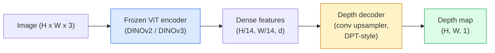

# Teklü derinlik ve Jeometri Tahmini

> Derinlik haritası, bir tek yollu görüntüdür, her bir piksel kameradan uzaklık gösterir. Geçmişte, eğer stereo veya LiDAR yoksa, sadece bir RGB  tahmininden sonra bu imkansız olarak kabul edilir. 2026 yılına kadar, bir VT kodlayıcı ile birlikte hafiflik derecesi başlığı, yeryüzü gerçeği ile sadece birkaç yüz puan fark etmesine ulaşabilmektedir.

**类型：**构建 + 使用
**语言：**Python
**前置要求：**4. aşama Ders 14 (ViT), 4. aşama Ders 17 (Özünle denetim gören), 4. aşama Ders 07 (U-Net)
**时间：**60 dakika kadar .

## Öğrenme hedefi

- 区分相对深和 metriği derinlik,并说明每个生产级模型(MiDaS, Marigold, Depth Anything V3, ZoeDepth)
- V3 ((DINOv2 omurgası) için gerekli olmayan kalibrasyon durumunda, istedikleri tek张图像预测 depth
- 解释为什么单张图像中形成的单张图像中形成的单张图像中形成的单张图像中形成的单张图像中形成的单张图像中形成的单张图像中形成的单张图像中形成的单张图像中形成的单张图像中形成的单张图像中形成的单张图像中形成的单张图像中形成的单张图像中形成的单张图像中形成的单张图像中形成的单张图像中形成的单张图像从中形成的单张图像中形成的单张图像从中形成的单张图像中形成的单张图像从中形成的单张图像从中形成的单张图像中形成的单张图像从从从从从从单张图像中形成的单张图像中形成的单张图像中形成的单张图像从从从从从从从从从单张图像中形成的单个图像中形成的单个图像中形成的单图像中形成的单图像从从从从从从单图的单图的图的图像中形成的单图的单图的单图的单图的图的图的图的图的图的图的图的图的图的图的图的图的图的图的图的图的图的图的图的图的图的图的图的图的图的图的图的图的图的图的图的图的图的图的图的图的图的图的图的图的图的图的图的图的图的图的图的图的图的图的图的图的图的图的图的图的图的图的图的图的图的图的图的图的图的图的图的图的图的图的图的图的图的图的图的图的图的图的图的图的图的图的图的图的图的图的图的图的图的图的图的图的图的图的图的图的图的图的图的图的图的图的图的图的图的图的图的图的图的图的图的图的图的图的图
- 2D algılamaları 3D noktalara yükseltmek için derinlik haritasını ve pinhole kamerası içsellerini kullanın

## 问题

Derinlik 2 boyutlu bilgisayar görmesinde eksik olan bir etkendir. RGB verildiğinde, görüntü düzleminde ortaya çıkan nesnelerin konumunu bilirsin; ama bunların ne kadar uzak olduğunu bilmiyorsun. Derinlik sensörleri (stereo cihazları, LiDAR, uçuş zamanı) bu sorunu doğrudan çözebilir, ancak pahalı, kırılgan ve aralığı sınırlıdır.

Monocular derinlik tahminleri, yani tek张 RGB çerçevesinden  tahmin derinliği, geçmişte sık sık ortaya çıkıyor模糊且不可靠的输出──2026 yıl, büyük önceden eğitilmiş kodlayıcılar  değiştirdi bu noktayı:Depth Anything V3 使用结的 DINOv2 omurgası,并生成能够泛化到室内、室外、医学、和卫星 alanlarının derinlik haritaları──Marigold, koşullu yayılma için derinlik yeniden ifade edecektir 问题──ZoeDepth 回归真实的 метрик mesafelere──

Derinlik de 2D algılama ve 3D anlayış arasındaki köprü: tespit edilen kutu piksellerinin derinliği çarparak 2D nesneyi 3D nokta bulutuna yükseltebiliriz. Bu her AR gizleme sistemi, her engelleme-kaçınma boru hattı ve her bir tası kaldırmak için robotun merkezi.

## 概念

### Relatif vs metrik derinlik

- **Relative depth** 没有真世界单位的序列 `z`A pikselinin B pikselinden daha yakın olduğu, ancak mesafe oranı metreye kadar belirlenmemiştir.
- **Metric depth** Kamera'dan çıkmak 、 ≈ metre 计's mutlak mesafe ∙ ◊ model gerektirir Resim işaretleri ile gerçek mesafe arasındaki istatistik ilişkiyi öğrenmek 

MiDaS 和 Depth Anything V3 生成 göreceli derinlik。Marigold 生成 göreceli derinlik。ZoeDepth、UniDepth 和 Metric3D 生成 metriği derinlik。Metrik modeller kamera içseline karşı duyarlı; göreceli modeller 则不敏感。

### Kodlayıcı-dekoder 模式



Derinlik Herhangi bir V3 结 kodlayıcı, sadece DPT tarzı dekodörü eğitmek.

### Neden sadece bir resim derinlik yaratabilir ?

Bir 张 2D resim derinlik ile ilgili birçok tekerlekli ipucu içerir:

- **Perspective** 3D ortalama düz çizgi 2D ortalama çerçeve ──
- **Texture gradient** 遠處の表面はより小さい,より濃厚な質感を備えている.
- **Occlusion order** Yakın nesneler daha uzak nesnelerden gizlenecek.
- **Size constancy** 已知物体 (kimse ve arabalar) yakınlık ölçeği sağlar.
- **Atmospheric perspective** Dış sahnelerde, uzak nesneler daha fazla görünür 、 daha fazla mavi 、

Bu ipuçlarını milyarlarca resim üzerinde eğitilen ViT'de içerecek. Eğer yeterince veri varsa, yeterli güçlü bir omurgan, monoküler derinlik, açık 3D denetim olmadan bile, mantıklı bir hassasiyete ulaşabilir.

### Tek gözlü derinlik ne yapabilir ?

- 时无内内或场景中的已知物体,无法得到 时无内内或场景中的已知物体,无法得到**absolute metric scale**◊ ağ tahmin edebilirsiniz cup                                                                                                                                                                                                                                                                                                                                                                                                                                                                                                                     
- **Occluded geometry**Sandalyenin arkası görünmez, kesin bir sonucu olamaz.
- **真正无 texture / reflective surfaces** aynalar, cam, teker teker duvarlar, ağlar, akılda mantıklı ama yanlış derinlik gibi görünüyor.

### 2026 yılının derinliği Herşey V3

- 使用原生 DINOv2 ViT-L/14 作为编码器(结)。
- DPT dekodörü
- Fotoğraflı tutarlılık dışında, açıkça derinlik denetimi gerekmez)
- 能够从 **任意数量的 visual inputs 中预测空间一致的 geometry，无论是否已知 camera poses**- Evet.
- Monocular derinliklerde, herhangi bir görüntü geometrisinde, görsel renderi, kamera poz tahmininde, SOTA'ya ulaşmak için.

Bu 2026 yılında derinlik gerektirir.

### Marigold  derinliklerin yayılması için kullanılır

Marigold(Ke et al., CVPR 2024) derinlik tahminini 重新表述为条件性图像-to-image diffusion──Conditioning:RGB──Target:depth map──pre-trained Stable Diffusion 2 U-Net 作为脊柱──输出深度地图 在对象边界处格外清晰──权衡:inference 比进料模型 更慢(10-50 个 个 个 个 否定步骤)──

### İçsel ve çubuklu kamera

Derinlik getirmek zorundasın.`d`                          `(u, v)`提升为摄像头坐标 中的3D点 `(X, Y, Z)`- ...

```
fx, fy, cx, cy = camera intrinsics
X = (u - cx) * d / fx
Y = (v - cy) * d / fy
Z = d
```

İçsel bilgiler EXIF metadata、kalibrasyon kalıplarından veya monocular içsel değerlendiricilerinden elde edilir. Perspektif Alanlar、UniDeepth) ⋅ hiçbir içsel bilgi yoktur.

### Değerlendirme

İki standart ölçüm:

- **AbsRel**(kesin bir ilişki hatası):`mean(|d_pred - d_gt| / d_gt)`❖越低越好── üretim sınıfı modeller genellikle 0.05-0.1──
- **delta < 1.25**(sırh doğruluğu):满足 `max(d_pred/d_gt, d_gt/d_pred) < 1.25`Sıfırda %2'den %2'e kadar.

对于相对深度(Deepth Anything V3、MiDaS),evaluation Using these two metrics of scale-and-shift invariant 版本──


```figure
depth-sweep
```

## Yapım

### 步骤 1: Derinlik ölçümleri

```python
import torch

def abs_rel_error(pred, target, mask=None):
    if mask is not None:
        pred = pred[mask]
        target = target[mask]
    return (torch.abs(pred - target) / target.clamp(min=1e-6)).mean().item()


def delta_accuracy(pred, target, threshold=1.25, mask=None):
    if mask is not None:
        pred = pred[mask]
        target = target[mask]
    ratio = torch.maximum(pred / target.clamp(min=1e-6), target / pred.clamp(min=1e-6))
    return (ratio < threshold).float().mean().item()
```

Önemlendirme sırasında Ön,始终 mask 无效的深度像素 ((零、NaN、飽和) ⋅

### 步骤 2: Ölçek ve değişim düzeni

对于相对深度模型,在计算测量前先将预测对齐到底真相对对对对对对对对对对对对对对对对对对对对对对对对对对对对对对对对对对对对对对对对对对对对对对对对对对对对对对对对对对对对对对对对对对对对对对对对对对对对对对对对对对对对对对对对对对对对对对对对对对对对对对对对对对对对对对对对对对对对对对对对对对对对对对对对对对对对对对对对对对对对对对对对对对对对对对对对对对对对对对对对对对对对对对对对对对对对对对对对对对对对对对对对对对对对对对对对对对对对对对对对对对对对对对对对对对对对对对对对对对对对对对对对对对对对对对对对对对对对对对对对对对对对对对对对对对对对对对对对对对对对对对对对对对对对对对对对对对对对对对对对对对对对对对对对对对对对对对对对对对对对对对对对对对对对对对对对对对对对对对对对对对对对对对对对对对对对对对对对对对对对对对对对对对对对对对对对对对对对对对对对对对对对对对对对对对对对对对对对对对对对对对对对对对对对对对对对对对对对对对对对对对对对对`a * pred + b = target`En az kareyi yap:

```python
def align_scale_shift(pred, target, mask=None):
    if mask is not None:
        p = pred[mask]
        t = target[mask]
    else:
        p = pred.flatten()
        t = target.flatten()
    A = torch.stack([p, torch.ones_like(p)], dim=1)
    coeffs, *_ = torch.linalg.lstsq(A, t.unsqueeze(-1))
    a, b = coeffs[:2, 0]
    return a * pred + b
```

时,先运行 `align_scale_shift`,再运行 `abs_rel_error`- Evet.

### 3 . Adım: Derinliği nokta bulut olarak yükseltmek

```python
import numpy as np

def depth_to_point_cloud(depth, intrinsics):
    H, W = depth.shape
    fx, fy, cx, cy = intrinsics
    v, u = np.meshgrid(np.arange(H), np.arange(W), indexing="ij")
    z = depth
    x = (u - cx) * z / fx
    y = (v - cy) * z / fy
    return np.stack([x, y, z], axis=-1)


depth = np.random.uniform(0.5, 4.0, (240, 320))
intr = (320.0, 320.0, 160.0, 120.0)
pc = depth_to_point_cloud(depth, intr)
print(f"point cloud shape: {pc.shape}  (H, W, 3)")
```

Bir işlevi, tüm 3D kaldırılmış uygulamalara uygundur.`.ply`MeshLab veya CloudCompare'de açıldı.

### 4 adım: Sintez derinlik sahnesini kullanarak duman testi yapın

```python
def synthetic_depth(size=96):
    yy, xx = np.meshgrid(np.arange(size), np.arange(size), indexing="ij")
    # Floor: linear gradient from near (top) to far (bottom)
    depth = 1.0 + (yy / size) * 4.0
    # Box in the middle: closer
    mask = (np.abs(xx - size / 2) < size / 6) & (np.abs(yy - size * 0.6) < size / 6)
    depth[mask] = 2.0
    return depth.astype(np.float32)


gt = torch.from_numpy(synthetic_depth(96))
pred = gt + 0.3 * torch.randn_like(gt)  # simulated prediction
aligned = align_scale_shift(pred, gt)
print(f"before align  absRel = {abs_rel_error(pred, gt):.3f}")
print(f"after align   absRel = {abs_rel_error(aligned, gt):.3f}")
```

### 步骤 5: Derinlik Herşey V3 使用方式(reference)

```python
import torch
from transformers import pipeline
from PIL import Image

pipe = pipeline(task="depth-estimation", model="LiheYoung/depth-anything-v2-large")

image = Image.open("street.jpg").convert("RGB")
out = pipe(image)
depth_np = np.array(out["depth"])
```

Üç yol.`out["depth"]`Yapılan çalışmaların birincil olarak, PIL gri ölçekleri; dönüştürülmesi için numpy 后用于数学计算──对 Depth Anything V3,发布后替换模型 id 即可;API 保持不变──

## kullanımı

- **Depth Anything V3**(Meta AI / ByteDance, 2024-2026)  nispet derinlik ̓默认选择──生产中最快的 ViT-large-backbone model──
- **Marigold**(ETH, 2024)  En iyi görsel kalitede, akıl etkisi 慢──
- **UniDepth**(ETH, 2024)  metrik derinlik,并带 kameranın içsel değerlendirmesi──
- **ZoeDepth**(Intel, 2023)  Metrik derinlik; daha eski, ama hala güvenilir
- **MiDaS v3.1** mirası ama stabil;适合作为比较基线──

Tipik entegrasyon modeli:

1. RGB çerçevesini yakaladım.
2. Derinlik modeli 生成 derinlik haritası
3. Detektorlar... kutular...
4.  derinlik yoluyla kutu centriidleri 提升到3D; eğer nokta bulut varsa, 与其合并──
5. Aşağı游:AR kapatma, yol planlaması, nesne boyut tahminleri, stereo değiştirme.

Real-time kullanımı için,Depth Anything V2 Small ((INT8 kuantized) consumer GPU'da 518x518 olarak yaklaşık 30 fps'e ulaşabilir.

## 交付

Bu ders:

- `outputs/prompt-depth-model-picker.md`                                                                                                                                                                                                                                                              
- `outputs/skill-depth-to-pointcloud.md` Bir derinlik haritası  noktalı bulutlar oluşturma becerisi, doğru şekilde içsel işlem ve çıkarım `.ply`- Evet.

## 练习

1. **（Easy）**Çizgi: Çizgi: Çizgi: Çizgi: Çizgi: Çizgi: Çizgi: Çizgi: Çizgi: Çizgi: Çizgi: Çizgi: Çizgi: Çizgi: Çizgi: Çizgi: Çizgi: Çizgi: Çizgi: Çizgi: Çizgi: Çizgi: Çizgi: Çizgi: Çizgi: Çizgi: Çizgi: Çizgi: Çizgi: Çizgi: Çizgi: Çizgi: Çizgi: Çizgi: Çizgi: Çizgi: Çizgi: Çizgi: Çizgi: Çizgi: Çizgi: Çizgi: Çizgi: Çizgi: Çizgi: Çizgi: Çizgi: Çizgi: Çizgi: Çizgi: Çizgi: Çizgi: Çizgi: Çizgi: Çizgi: Çizgi: Çizgi: Çizgi: Çizgi: Çizgi: Çizgi: Çizgi: Çizgi: Çizgi: Çizgi: Çizgi: Çizgi: Çizgi: Çizgi: Çizgi: Çizgi: Çizgi: Çizgi: Çizgi: Çizgi: Çizgi: Çizgi: Çizgi: Çizgi: Çizgi: Çizgi: Çizgi: Çizgi: Çizgi: Çizgi: Çizgi: Çizgi: Çizgi: Çizgi: Çizgi: Çizgi: Çizgi: Çizgi: Çizgi: Çizgi: Çizgi: Çizgi: Çizgi: Çizgi: Çizgi: Çizgi: Çizgi: Çizgi: Çizgi: Çizgi: Çizgi: Çizgi: Çizgi: Çizgi: Çizgi: Çizgi: Çizgi: Çizgi: Çizgi: Çizgi: Çizgi: Çizgi: Çizgi: Çizgi: Çizgi: Çizgi: Çizgi: Çizgi: Çizgi: Çizgi: Çizgi: Çizgi: Çiz
2. **（Medium）**V2'nin RGB + derinliği , nokta bulut olarak yükseltilmiş ve kullanılmaz .`open3d`染──比较两个场景(室内/室外),并记录哪个看起来更可信──
3. **（Hard）**拍摄五对图像,每对只改变已知对象的位置 (例如, şişeye doğru yakın hareket 30 cm) ⋅ UniDepth 在两张图像上预测米特里深度──报告预测的距离德尔塔与真实30 cm 的差──

## 关键术语

| Term | 人们常说 | 实际含义 |
|------|----------------|----------------------|
| Monocular depth | "Single-image depth" | 从一帧 RGB 进行 depth estimation，不使用 stereo 或 LiDAR |
| Relative depth | "Ordered depth" | 没有真实世界单位的有序 z-values |
| Metric depth | "Absolute distance" | 以 metres 表示的 depth；需要 calibration 或使用 metric supervision 训练的 model |
| AbsRel | "Absolute relative error" | |d_pred - d_gt| / d_gt 的平均值；标准 depth metric |
| Delta accuracy | "delta < 1.25" | prediction 位于 ground truth 25% 以内的 pixels 占比 |
| Pinhole camera | "fx, fy, cx, cy" | 用于将 (u, v, d) 提升到 (X, Y, Z) 的 camera model |
| DPT | "Dense Prediction Transformer" | 位于冻结 ViT encoders 之上的 conv-based decoder，用于 depth |
| DINOv2 backbone | "The reason it works" | 无需 depth labels 即可跨 domains 泛化的 self-supervised features |

## 延伸阅读

- [Depth Anything V3 paper page](https://depth-anything.github.io/) DINOv2 kodlayıcı kullanın SOTA monocular derinliği
- [Marigold (Ke et al., CVPR 2024)](https://marigoldmonodepth.github.io/)  diffüsiyon tabanlı derinlik tahminleri
- [UniDepth (Piccinelli et al., 2024)](https://arxiv.org/abs/2403.18913) 带 içsel derinlik
- [MiDaS v3.1 (Intel ISL)](https://github.com/isl-org/MiDaS) Kanonik nispet derinlik baseline
- [DINOv3 blog post (Meta)](https://ai.meta.com/blog/dinov3-self-supervised-vision-model/) 提升深度精度 的编码家族
