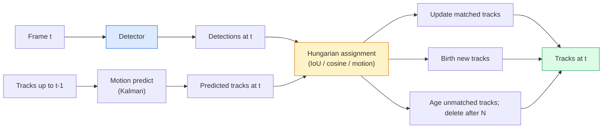

# Çoklu Nesne Takip ve Video belleği

> Takip, tespit, ilişki, kontrol, her bir tespit, her bir tespit, her bir tespit, her birinin izine uygun olacaktır.

**Type:** Build
**Languages:** Python
**Prerequisites:** Phase 4 Lesson 06 (YOLO Detection), Phase 4 Lesson 08 (Mask R-CNN), Phase 4 Lesson 24 (SAM 3)
**Time:** ~60 分钟

## Öğrenme hedefi

- 区分 区分 区分 区分 区分 区分 区分 区分 区分 区分 区分 区分 区分 区分 区分 区分 区分 区分 区分 区分 区分 区分 区分 区分 区分 区分 区分 区分 区分 区分 区分 区分 区分 区分 区分 区分 区分 区分 区分 区分 区分 区分 区分 区分 区分 区分 区分 区分 区分 区分 区分 区分 区分 区分 区分 区分 区分 区分 区分 区分 区分 区分 区分 区分 区分 区分 区分 区分 区分 区分 区分 区分 区分 区分 区分 区分 区分 区分 区分 区分 区分 区分 区分 区分 区分 区分 区分 区分 区分 区分 区分 区分 区分 区分 区分 区分 区分 区分 区分 区分 区分 区 区分 区 区 区 区 区 区 区 区 区 区 区 区 区 区 区 区 区 区 区 区 区 区 区 区 区 区 区 区 区 区 区 区 区 区 区 区 区 区 区 区 区 区 区 区 区 区 区 区 区 区 区 区 区 区 区 区 区 区 区 区 区 区 区 区 区 区 区 区 区 区 区 区 区 区 区 区 区 区 区 区 区 区 区 区 区 区 区 区 区 区 区 区 区 区 区 区 区 区 区 区 区
- YoU + Macar Görevini, klasik izleme-i tespit için gerçekleştirmek
- SAM 2'nin hafıza bankasını açıklayın ve neden IoU'ya göre daha iyi bir okluzyona sahip olduğunu açıklayın.
- 读懂三种跟踪指标(MOTA, IDF1, HOTA),并为给定用例 选择最重要的一项

## 问题

Detektor size tek bir nesneyi nerede bulduğunu söyleyecek.`t`Aracın hangi tespit ve çerçeve`t-1`Bu noktası olmadan nesnelerin bir çizgi boyunca kaç kez geçtiğini bilmiyor, bir topu takip edemiyor, araba # 4'ün yolda durduğunu bile bilmiyor.

Spor analitiği, denetim, otonom sürüş, tıbbi video analizi, vahşi yaşam izleme, kelime işaretleri sayımı.

2026 yılı iki yeni model getirir:**SAM 2 memory-based tracking**(用 feature-memory 替代 motion-model association)**SAM 3.1 Object Multiplex**(Birden fazla kavramda ortak hafıza)

## 核心概念

### İzleme-içinde tespit



2026'da karşılaştığınız her takipçi, bu döngünün değişkenidir.

- **SORT**(2016): Kalman filtre + IoU Macarı¬¬简单、快速,没有外观模型¬
- **DeepSORT**(2017): SORT + 每条 track 一个基于CNN的外观功能(ReID Embedding) ――更能处理交叉场景──
- **ByteTrack**(2021): Aşağı güvenin tespitlerini ikinci aşamada birleştirmek için kullanmak; görünüm özelliklerine ihtiyaç duymaz, ancak MOT17'de performans öncü olarak gösterilmektedir.
- **BoT-SORT**(2022): Byte + kamera hareketi tazminatı + ReID。
- **StrongSORT / OC-SORT** ByteTrack'ın son süresi, daha iyi hareket ve görünümlü olması

### Bir bölüm anlamak Kalman filtre

Kalman Filteri , her iz için bir değişkenlik durumu koruyor .`(x, y, w, h, dx, dy, dw, dh)`                                                                                                                                                                                                                                                              **predict**state, sonra da eşleşik tespit **update** Önceden tahmin edilene göre belirsizlik daha yüksek, güncellemeler daha fazla gerçekleşir.

Her klasik izleyici hareket tahminleri aşamasında Kalman filtre kullanıyor.

### Macar algoritması

- Bir tane.`M x N`maliyet matrisi (tracks x detections),                                                                                                                                                                                                                                                          `1 - IoU(track_bbox, detection_bbox)`, veya görünüm özelliklerinin negatif kozine benzerliği──Runtime is O(((M+N) ^3);当 M、N最高約为1000 时,通过 `scipy.optimize.linear_sum_assignment`Python'da yeterince hızlı.

### ByteTrack'ın anahtar düşünceleri

標準トラッカー 会丢弃低置信度 deteksiyonları(< 0.5) ・・・ByteTrack 会保留它们作为 **second-stage candidates**Önce yüksek güven tespitleriyle eşleşecek, sonra eşleşmeyen izleri biraz daha rahat bir IoU eşiği ile eşleşecek.

### SAM 2 hafıza tabanlı izleme

SAM 2 通过维护 per-instance uzay-zaman özellikleri 的 **memory bank**Videoları işlemek için. Bir kısımdaki promptı belirlemek için. Bir kısımdaki klavyeyi tıklayın.

没有 Kalman filter,也没有匈牙利任务──Association 隐含在记忆-注意中──

优点:
- 鲁棒 (memory 会跨多携带实例身份)
- SAM 3'ün metin çağrıları 结合时支持开口语库──
- 无需单独的运动模型──

缺点:
- Çok nesneyi izlemek için ByteTrack'den daha yavaş.
- Hatıra bankası 会增长; bağlam penceresi 受限。

### SAM 3.1 Nesne Çoklu

Önceki SAM 2 / SAM 3 izleme Programı her durum için bağımsız hafıza bankasını tutmak. 50 nesne, 50 hafıza bankasını oluşturur.**per-instance query tokens**Paylaşılan hafıza¬ların maliyeti durumlar artarak sayı­lı­kın­lık artış­ları­na göre artmaktadır.

Multiplex is 2026 yılının kalabalık takip yeni bir tercih: konser kalabalıkları, depo işçileri, trafik kavşağı,

### 需要掌握的三种计量

- **MOTA (Multi-Object Tracking Accuracy)** 1 - (FN + FP + ID anahtarları) / GT。 hata tipi 加权; bu bir                                                                                                                                                                                                                                                   
- **IDF1 (ID F1)** ID doğruluğu ve hatırlamaların uyumlu ortalaması──专注衡量每条土 truth track 在时间上保持其 ID 的程度──对 ID-switch-sensitive tasks 来说比 MOTA更好──
- **HOTA (Higher Order Tracking Accuracy)** 分解为 检测精度 (DetA) 与 关联精度 (AssA) ⋅2020 yılından beri toplumsal standartlar; en全面──

对于监视(kimin kim):报告 IDF1──对体育分析(计数通票):HOTA──对一般学术比较:HOTA──


```figure
cv3-track-assoc
```

## Yapın onu.

### 步骤 1: 基于 IoU 的成本矩阵

```python
import numpy as np


def bbox_iou(a, b):
    """
    a, b: [x1, y1, x2, y2] 的 (N, 4) arrays。
    返回 (N_a, N_b) IoU matrix。
    """
    ax1, ay1, ax2, ay2 = a[:, 0], a[:, 1], a[:, 2], a[:, 3]
    bx1, by1, bx2, by2 = b[:, 0], b[:, 1], b[:, 2], b[:, 3]
    inter_x1 = np.maximum(ax1[:, None], bx1[None, :])
    inter_y1 = np.maximum(ay1[:, None], by1[None, :])
    inter_x2 = np.minimum(ax2[:, None], bx2[None, :])
    inter_y2 = np.minimum(ay2[:, None], by2[None, :])
    inter = np.clip(inter_x2 - inter_x1, 0, None) * np.clip(inter_y2 - inter_y1, 0, None)
    area_a = (ax2 - ax1) * (ay2 - ay1)
    area_b = (bx2 - bx1) * (by2 - by1)
    union = area_a[:, None] + area_b[None, :] - inter
    return inter / np.clip(union, 1e-8, None)
```

### 步骤 2: 最小 SORT 风格 追踪器

Bu nedenle, Kalman'ın tahminleri, üretim ortamında çok önemli.`sort`Python paketi 提供完整版本──

```python
from scipy.optimize import linear_sum_assignment


class Track:
    def __init__(self, tid, bbox, frame):
        self.id = tid
        self.bbox = bbox
        self.last_frame = frame
        self.hits = 1

    def update(self, bbox, frame):
        self.bbox = bbox
        self.last_frame = frame
        self.hits += 1


class SimpleTracker:
    def __init__(self, iou_threshold=0.3, max_age=5):
        self.tracks = []
        self.next_id = 1
        self.iou_threshold = iou_threshold
        self.max_age = max_age

    def step(self, detections, frame):
        if not self.tracks:
            for d in detections:
                self.tracks.append(Track(self.next_id, d, frame))
                self.next_id += 1
            return [(t.id, t.bbox) for t in self.tracks]

        track_boxes = np.array([t.bbox for t in self.tracks])
        det_boxes = np.array(detections) if len(detections) else np.empty((0, 4))

        iou = bbox_iou(track_boxes, det_boxes) if len(det_boxes) else np.zeros((len(track_boxes), 0))
        cost = 1 - iou
        cost[iou < self.iou_threshold] = 1e6

        matched_track = set()
        matched_det = set()
        if cost.size > 0:
            row, col = linear_sum_assignment(cost)
            for r, c in zip(row, col):
                if cost[r, c] < 1.0:
                    self.tracks[r].update(det_boxes[c], frame)
                    matched_track.add(r); matched_det.add(c)

        for i, d in enumerate(det_boxes):
            if i not in matched_det:
                self.tracks.append(Track(self.next_id, d, frame))
                self.next_id += 1

        self.tracks = [t for t in self.tracks if frame - t.last_frame <= self.max_age]
        return [(t.id, t.bbox) for t in self.tracks]
```

60 行──接收 per frame deteksiyonları, return per frame track ID'leri──真实系统也会加入Kalman tahmin、ByteTrack'ın ikinci aşamasındaki yeniden eşleşme, yanı sıra görünüm özellikleri──

### 步骤 3: Sintez trajektör testi

```python
def synthetic_frames(num_frames=20, num_objects=3, H=240, W=320, seed=0):
    rng = np.random.default_rng(seed)
    starts = rng.uniform(20, 200, size=(num_objects, 2))
    velocities = rng.uniform(-5, 5, size=(num_objects, 2))
    frames = []
    for f in range(num_frames):
        dets = []
        for i in range(num_objects):
            cx, cy = starts[i] + f * velocities[i]
            dets.append([cx - 10, cy - 10, cx + 10, cy + 10])
        frames.append(dets)
    return frames


tracker = SimpleTracker()
for f, dets in enumerate(synthetic_frames()):
    tracks = tracker.step(dets, f)
```

Üç düz çizgi hareketindeki nesne, tüm 20  arasında kendi kimliklerini koruyabilmelidir.

### 步骤 4: Kimlik anahtarı metrikası

```python
def count_id_switches(tracks_per_frame, gt_per_frame):
    """
    tracks_per_frame:  list of list of (track_id, bbox)
    gt_per_frame:      list of list of (gt_id, bbox)
    返回 ID switches 的数量。
    """
    prev_assignment = {}
    switches = 0
    for tracks, gts in zip(tracks_per_frame, gt_per_frame):
        if not tracks or not gts:
            continue
        t_boxes = np.array([b for _, b in tracks])
        g_boxes = np.array([b for _, b in gts])
        iou = bbox_iou(g_boxes, t_boxes)
        for g_idx, (gt_id, _) in enumerate(gts):
            j = iou[g_idx].argmax()
            if iou[g_idx, j] > 0.5:
                t_id = tracks[j][0]
                if gt_id in prev_assignment and prev_assignment[gt_id] != t_id:
                    switches += 1
                prev_assignment[gt_id] = t_id
    return switches
```

Bu, basitleştirilmiş bir IDF1 metrikine yakındır: bir temel gerçek nesneyi bulur ve tahsis edilen tahmin edilen iz kimliği değiştirir. Gerçek MOTA / IDF1 / HOTA 工具位于`py-motmetrics`和 `TrackEval`İçeride.

## Kullan

2026 yılındaki üretim sınıfı takipçileri:

- `ultralytics` YOLOv8 + 内置 ByteTrack / BoT-SORT。`results = model.track(source, tracker="bytetrack.yaml")`❖默认选择──
- `supervision`(Roboflow)  ByteTrack kaplamaları加注释工具──
- SAM 2 / SAM 3.1  通过 `processor.track()` anıt tabanlı izleme yapın。
- Özel yığın: Detektor (YOLOv8 / RT-DETR) + `sort-tracker`- Ne ?`OC-SORT`- Ne ?`StrongSORT`- Evet.

Seçim biçimi:

- 30+ fps Aşağıdaki yayalar / arabalar / kutular:**ByteTrack with ultralytics**- Evet.
- İnsan topluluğunun bir türü:**SAM 3.1 Object Multiplex**- Evet.
- 带有可识别的外观的重 occlusions:**DeepSORT / StrongSORT**(ReID özellikleri)
- Spor / karmaşık etkileşimler:**BoT-SORT**Ya da öğrenilmiş takipçiler ((MOTRv3)

## - Söyle.

Bu ders:

- `outputs/prompt-tracker-picker.md`   Scenenin türüne göre 、okluzyona ait kalıplar 和 gecikme bütçesi 选择 SORT / ByteTrack / BoT-SORT / SAM 2 / SAM 3.1。
- `outputs/skill-mot-evaluator.md` 编写一个完整的评估带,用于地面真相轨迹 评估MOTA / IDF1 / HOTA。

## 练习

1. **(Easy)**Yukarıdaki sentetik izleyiciyi kullanarak 3、10 ve 30 nesneyi ayırın.
2. **(Medium)**之前加入常速加尔曼预测步骤──展示短暂(2-3 )
3. **(Hard)**集成 SAM 2'in hafıza tabanlı takipçisi(pass `transformers`) alternatif takipçi arka uç olarak. ⇒ ⇒ ⇒ ⇒ ⇒ ⇒ ⇒ ⇒ ⇒ ⇒ ⇒ ⇒ ⇒ ⇒ ⇒ ⇒ ⇒ ⇒ ⇒ ⇒ ⇒ ⇒ ⇒ ⇒ ⇒ ⇒ ⇒ ⇒ ⇒ ⇒ ⇒ ⇒ ⇒ ⇒ ⇒ ⇒ ⇒ ⇒ ⇒ ⇒ ⇒ ⇒ ⇒ ⇒ ⇒ ⇒ ⇒ ⇒ ⇒ ⇒ ⇒ ⇒ ⇒ ⇒ ⇒ ⇒ ⇒ ⇒ ⇒ ⇒ ⇒ ⇒ ⇒ ⇒ ⇒ ⇒ ⇒ ⇒ ⇒ ⇒ ⇒ ⇒ ⇒ ⇒ ⇒ ⇒ ⇒ ⇒ ⇒ ⇒ ⇒ ⇒ ⇒ ⇒ ⇒ ⇒ ⇒ ⇒ ⇒ ⇒ ⇒ ⇒ ⇒ ⇒ ⇒ ⇒ ⇒ ⇒ ⇒ ⇒ ⇒ ⇒ ⇒ ⇒ ⇒ ⇒ ⇒ ⇒ ⇒ ⇒ ⇒ ⇒ ⇒ ⇒ ⇒ ⇒ ⇒ ⇒ ⇒ ⇒   ⇒ ⇒ ⇒    ⇒      ⇒ ⇒     ⇒                                                                                                                                                                                                                                          

## 关键术语

| Term | 常见说法 | 实际含义 |
|------|----------------|----------------------|
| Tracking-by-detection | “先 detect 再 associate” | Per-frame detector + 基于 IoU / appearance 的 Hungarian assignment |
| Kalman filter | “Motion predict” | Linear dynamics + covariance，用于平滑 track predictions 和处理 occlusion |
| Hungarian algorithm | “Optimal assignment” | 求解 minimum-cost bipartite matching 问题；`scipy.optimize.linear_sum_assignment` |
| ByteTrack | “低置信度 second pass” | 将未匹配 tracks 重新匹配到低置信度 detections，以恢复短暂 occlusions |
| DeepSORT | “SORT + appearance” | 添加 ReID feature 用于跨帧匹配；更利于保持 ID |
| Memory bank | “SAM 2 trick” | 跨帧存储的 per-instance spatio-temporal features；cross-attention 替代显式 association |
| Object Multiplex | “SAM 3.1 shared memory” | 使用带 per-instance queries 的单一 shared memory，实现快速 many-object tracking |
| HOTA | “现代 tracking metric” | 分解为 detection 和 association accuracy；社区标准 |

## 延伸阅读

- [SORT (Bewley et al., 2016)](https://arxiv.org/abs/1602.00763) 最小 izleme-i tespit 论文
- [DeepSORT (Wojke et al., 2017)](https://arxiv.org/abs/1703.07402) 添加 görünüm özelliği
- [ByteTrack (Zhang et al., 2022)](https://arxiv.org/abs/2110.06864) 低置信度 ikinci geçiş
- [BoT-SORT (Aharon et al., 2022)](https://arxiv.org/abs/2206.14651) Kamera hareket tazminatı
- [HOTA (Luiten et al., 2020)](https://arxiv.org/abs/2009.07736) 分解式 izleme metrikası
- [SAM 2 video segmentation (Meta, 2024)](https://ai.meta.com/sam2/) hafıza tabanlı izleyici
- [SAM 3.1 Object Multiplex (Meta, March 2026)](https://ai.meta.com/blog/segment-anything-model-3/)
